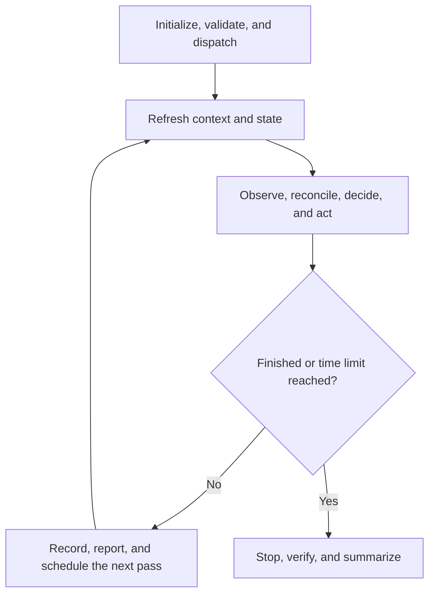

# Run Training Sweep

Finish the declared sweep as fast as possible without violating its operations document.

Optimize global preemptible TPU capacity. Iris handles preemptions; do not replace a
dispatch for a preemption alone—act from W&B progress and the recovery policy.

## Contract

- Treat each experiment-defined configuration as an opaque logical trial.
- Let the training code own configuration and training semantics. Assume standard
  W&B training fields; inspect code for launch, data, and checkpoint behavior.
- Own only validation, placement, dispatch, monitoring, recovery, regional racing, accounting, and reporting.
- Never generate configurations or decide experimental convergence.

## State

Keep each durable fact in one authoritative form:

- **Operations (text):** policy, choices, constraints, exceptions, and operating
  conclusions not reliably recovered from code or data.
- **Experiment and helper code:** executable behavior.
- **SQLite (data):** structured observations, identities, attempts, action results,
  clocks, and history.

Session chat is the interface, not state. Put heartbeat reports and decisions needing
operator input there. Anything needed by a later heartbeat belongs in text, code, or
data.

Never restate code or configuration in Operations; prefer a source reference. Create
no other experiment log, runbook, or recurring status file. Correct the authoritative
form instead of adding a competing note.

## Process

Read every reference in this table before setup. It assigns ownership; later
sections define the phase contracts.

| Phase | Purpose | Detailed references |
| --- | --- | --- |
| Initialize | Gather choices and establish durable state | [operations.md](references/operations.md), [targets.md](references/targets.md), [persistence.md](references/persistence.md) |
| Validate | Establish safe regional targets and launch behavior | [validation.md](references/validation.md) |
| Operate | Observe, place, recover, report, and schedule | [execution.md](references/execution.md), [throughput.md](references/throughput.md), [persistence.md](references/persistence.md) |
| Finish | Verify completion, checkpoints, and integrity | [throughput.md](references/throughput.md), [persistence.md](references/persistence.md) |

Use [utilization.md](references/utilization.md) only for optional placement hints.
Investigate utilization failures when useful, but continue without that hint.



## Initialize

### Interview Briefly

Ask only for missing information. Offer the recommended answer first.

1. **Training entry point and trial catalog.** Require both.
2. **Time limit.** Recommend two weeks. Explain shorter means faster recovery; longer is useful only when healthy trials need it.
3. **Regional replicas per trial.** Recommend `1`; explain `2` often reduces completion time but duplicates work. Discourage more than `2`.
4. **Compute and TPU scope.** Recommend an overall chip limit from the training
   code and prior runs. Default the target scope to every 4–16-chip TPU in all
   otherwise allowed regions. Accept plain-English scopes or exclusions such as
   “training chips only,” “4–16-chip inference TPUs in `euw4`,” or “32+-chip
   TPUs in any region.”
5. **Stall recovery timing.** Recommend `3h / 12h / 4d`: after no W&B
   progress for 3 hours, restart the same target; after 12 hours, try another
   slice in the same region; after 4 days, start separately in another region.
   Explain that only W&B progress resets the stall timer and ask whether to use these
   defaults.

Create the document from [operations.md](references/operations.md). Default to
`scratch/<sweep>/expXXX_operations.md`; offer a tracked experiment-side file only
if requested. Build its candidate grid from [targets.md](references/targets.md), then
initialize SQLite:

```bash
uv run .agents/skills/run-training-sweep/scripts/persistence.py \
  init scratch/<sweep>/expXXX_sweep.sqlite
```

## Validate

Follow [validation.md](references/validation.md) before the first dispatch. Validate
the experiment entry point, regional inputs and checkpoints, target compatibility,
W&B observation, and Iris submission. Submit only `eligible` targets and show the
first assembled dispatch command to the operator.

## Operate

Run each heartbeat as a complete agent decision pass. Helpers may calculate or
render facts; they may not choose or perform actions. Never delegate decisions to a
monitor, dispatcher, scheduled loop, or recovery script.

At every heartbeat:

1. **Refresh:** reread Operations in full, inspect the current experiment and needed
   helpers, and rebuild the SQLite inventory snapshot. Do not rely on prior context.
2. **Observe and reconcile:** query W&B first and use Iris only as allowed by
   [execution.md](references/execution.md). Persist current observations before acting.
3. **Assess:** rebuild the decision snapshot, then evaluate the whole sweep using
   [execution.md](references/execution.md) and [throughput.md](references/throughput.md).
4. **Act or wait:** before any submission, apply the mandatory placement-diversity
   gate in [execution.md](references/execution.md). Perform justified actions, state a
   no-change reason, or pause affected work and request a decision when no safe
   authorized action remains.
5. **Record, report, and schedule:** persist every action result, report the heartbeat
   in session chat, and, as the final action, schedule exactly one next pass with a
   time-based trigger such as `CronTask`. Never rely on event-based monitoring.

Build both snapshots with:

```bash
uv run .agents/skills/run-training-sweep/scripts/persistence.py \
  snapshot scratch/<sweep>/expXXX_sweep.sqlite
```

The snapshot is an ephemeral, decision-complete projection, not another status
record. It must cover every unfinished trial and actionable condition while
summarizing stable history. Query raw history only when a decision needs it.

## Finish

A trial finishes when `run_progress >= 1` and the expected checkpoint is reachable.
W&B `finished` alone is insufficient.

When every trial finishes or the time limit expires, stop remaining dispatches,
verify completion and checkpoints, check SQLite integrity, and report the outcome as
defined by [throughput.md](references/throughput.md). Do not schedule another pass.
