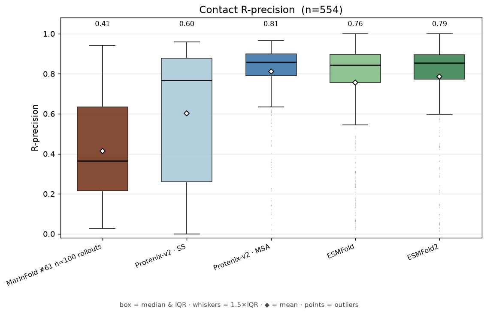

# MarinFold

[](https://colab.research.google.com/github/Open-Athena/MarinFold/blob/main/notebooks/inference_example1.ipynb)

Can a vanilla LLM predict protein structures (e.g. contact maps, inter-residue distances) without MSAs or PLMs?
MarinFold aims to answer this question. Our models are trained from scratch (without natural language data) on [Marin](https://github.com/marin-community/marin) infrastructure.

This is a research codebase for an ongoing project. It is an experiment in open development.

We welcome collaborators! If you would like to discuss or contribute, join the [Marin Discord](https://discord.gg/J9CTk7pqcM) and look for the `#marinfold` channel.

## Current performance

Here we are prompting with the amino acid sequence and predicting residue/residue contacts.



The `MarinFold #61 n=100 rollouts` bar above is our #61 model (eval loss 2.76) with our best test-time inference — 100 resampled rollouts with pairwise tie-breaking (see [exp82](experiments/exp82_evals_contacts_v1_contact_prediction/README.md)).

## Try it out

Our current best model predicts a **residue–residue contact map** from a
single sequence — no MSA, no template, no structure. It's the `contacts-v1`
1.5B model [@eric-czech](https://github.com/eric-czech) trained in
[#61](https://github.com/Open-Athena/MarinFold/issues/61) (the
`MarinFold #61 n=100 rollouts` predictor in *Current performance* above) and is
the default model in [`MODELS.yaml`](marinfold/marinfold/MODELS.yaml).

### GPU example

Set up:

```bash
# Install uv if you don't already have it:
curl -LsSf https://astral.sh/uv/install.sh | sh

git clone https://github.com/Open-Athena/MarinFold.git
cd MarinFold/marinfold
uv sync --extra vllm  # "vllm" for Linux+GPU, "transformers" for CPU/CUDA, "mlx" for Apple Silicon
```

Run inference:

```bash
# Predict the contact map for the Top7 de novo designed protein ([1QYS](https://www.rcsb.org/structure/1QYS)).
# Replace "vllm" with "transformers" (CPU/CUDA) or "mlx" (Apple Silicon).
SEQUENCE=MGDIQVQVNIDDNGKNFDYTYTVTTESELQKVLNELMDYIKKQGAKRVRISITARTKKEAEKFAAILIKVFAELGYNDINVTFDGDTVTVEGQLEGGSLEHHHHHH
uv run marinfold infer \
    --backend vllm \
    --input-sequence $SEQUENCE \
    --out ~/prediction.json \
    --out-plots ~/contact_map.pdf
```

`--out` holds one `P(contact)` score per residue pair; `--out-plots` is the
contact-map heatmap. The first run downloads our 1.5B contacts-v1 model
(~6 gb). Omitting `--model` uses the default (`contacts-v1-exp75-1.5B`); the older
distogram models are still available as `--model 1B` / `1.5B` (see below).

The command above uses the fast **`pairwise`** readout (~0.3 s/protein). Our
**best** inference — the `MarinFold #61 n=100 rollouts` bar in *Current
performance* — is exp82's **`rollout`** recipe: vote over 100 sampled
contact-section completions (each from a freshly resampled document) with a
pairwise tie-break. It is ~150× slower (~50 s/protein on a GPU) but sharpens the
top-ranked contacts. Run it via the per-impl driver (the top-level CLI keeps its
surface narrow):

```bash
uv run contacts-v1 infer \
    --backend vllm --model contacts-v1-exp75-1.5B \
    --method rollout --n-rollouts 100 \
    --input-sequence $SEQUENCE \
    --out ~/prediction.json --out-plots ~/contact_map.pdf
```

`rollout` needs a sampling backend — `--backend vllm` or `transformers` (not
`mlx`). The pairwise `--ensemble-k N` test-time-augmentation knob lives on this
driver too.

To score against a known structure's ground-truth contacts, use `evaluate`
(reports contact-prediction AUC and precision@{L, L/2, L/5}). Ground truth is
read with [pyconfind](https://github.com/timodonnell/pyconfind), so add its
extra to the sync (`uv sync --extra vllm --extra contacts-v1`):

```bash
uv run marinfold evaluate \
    --backend vllm \
    --input tests/data/1QYS.cif \
    --metrics-out ~/metrics.json \
    --out-plots ~/gt_vs_pred.pdf
```

### Previous generation (distograms)

Our earlier `contacts-and-distances-v1` models predict CB–CB **distograms**
rather than contacts. Same CLI, just point `--model` at one of them:

```bash
uv run marinfold infer \
    --backend vllm --model 1B \
    --input-sequence $SEQUENCE \
    --out ~/distogram.json --out-plots ~/distogram.pdf
```

## Document structures

A **document structure** is a recipe for turning a protein structure
into the token string a trained model sees (and back).
`contacts-and-distances-v1` is our current format: a residue
sequence followed by a mix of CB-CB contact statements and per-pair
distance statements, with a per-structure pLDDT-bin token.

Generate one document from a structure file:

```bash
cd marinfold
uv sync
uv run contacts-and-distances-v1 generate \
    --input tests/data/1QYS.cif \
    --out /tmp/docs.jsonl
```

The output is one row per input structure with a `document` field
holding the token string (`.parquet` works too — pick by suffix).
View the first document:

```bash
python -c "import json; print(json.loads(open('/tmp/docs.jsonl').readline())['document'])"
```

You'll see a single space-separated token string like:

```
<contacts-and-distances-v1> <begin_sequence> <M> <G> <D> <I> ... <begin_statements> <long-range-contact> <p3> <p82> <distance> <p7> <p41> <CA> <CB> <d12.5> ... <plddt_95_100> <end>
```

Point `--input` at a directory to batch over a whole set of
structures (one document per input). See `contacts-and-distances-v1
generate --help` for the algorithm knobs (contact cutoff, per-mode
fractions, pLDDT filter, context-length budget).

A second format, `contacts-v1`
([SPEC.md](marinfold/marinfold/document_structures/contacts_v1/SPEC.md)),
is contacts-only: a residue sequence — `<pN> <AA>` statements in
random order, with `<n-term>`/`<c-term>` markers and residues numbered
from a random start that wraps around 2000 indices — followed by
`<contact>` statements for the strongest
[pyconfind](https://github.com/timodonnell/pyconfind) side-chain
contacts above a minimum degree (as many as fill the context budget),
listed in random order. Generation needs the `contacts-v1` extra (pyconfind):

```bash
cd marinfold
uv sync --extra contacts-v1
# Eyeball documents + their contact tables in the terminal:
uv run contacts-v1 view --input tests/data/1QYS.cif
# Write documents (with protein-docs-style metadata columns) plus a
# per-protein JSON summary (sequence, every contact's degree, truncation):
uv run contacts-v1 generate --input tests/data/1QYS.cif \
    --out /tmp/contacts_v1_docs.jsonl --summary-out /tmp/summary.json
```

## More details (mostly written by robots)

Trained models are listed in `[MODELS.yaml](MODELS.yaml)` by
nickname. The `marinfold` CLI looks up the model, picks the first
document structure it supports, and dispatches to the graduated
impl. Two subcommands:

```bash
cd marinfold
uv sync --extra mlx        # or --extra vllm, or --extra transformers

# Predict structure for a sequence (contacts or distances, per the model).
uv run marinfold infer \
    --backend mlx --input-sequence SIINFEKLLLSKP \
    --out /tmp/preds.json

# Evaluate predictions against ground-truth structures.
uv run marinfold evaluate \
    --backend mlx --input /path/to/pdbs/ \
    --metrics-out /tmp/metrics.json
```


| Backend        | Platform                                       | Extra                  |
| -------------- | ---------------------------------------------- | ---------------------- |
| `vllm`         | Linux + NVIDIA GPU (production / scaled eval)  | `--extra vllm`         |
| `mlx`          | Apple Silicon (fastest local)                  | `--extra mlx`          |
| `transformers` | Anywhere torch installs (Apple MPS, CPU, CUDA) | `--extra transformers` |


`--model` accepts a `[MODELS.yaml](MODELS.yaml)` nickname or a
local checkpoint directory. Omit it to use the entry marked
`default: true`. `--document-structure` overrides the impl
selection; without it the first supported impl wins. See
`[marinfold/README.md](marinfold/README.md)` for the full backend
matrix and `marinfold infer --help` / `marinfold evaluate --help`
for the full flag set.

For impl-specific flags (seed-N sweeps, distance cap, batch size,
etc.) each graduated impl ships its own lower-level CLI as a
console script:

```bash
cd marinfold
uv sync --extra mlx
uv run contacts-and-distances-v1 evaluate \
    --backend mlx --model 1B \
    --input /path/to/pdbs/ --seed-n-values 0,5,20,50 \
    --out /tmp/metrics.json
```

## Colab Notebooks

- [Inference Example 1](https://colab.research.google.com/github/Open-Athena/MarinFold/blob/main/notebooks/inference_example1.ipynb) — run our current best `contacts-v1-exp75-1.5B` model on a structure from RCSB and plot the ground-truth vs predicted contact map (choose `pairwise` or `rollout` inference).
- [Inspect Data 1](https://colab.research.google.com/github/Open-Athena/MarinFold/blob/main/notebooks/inspect_data1.ipynb) — browse legacy `timodonnell/protein-docs` subsets plus newer `open-athena/MarinFold` bucket parquet data, with sample documents and parquet schema previews.

## Layout

```
MarinFold/
├── MODELS.yaml             # registry of trained models (nickname → HF URL)
├── RESOURCES.md            # datasets, tokenizers, W&B projects, prior repos
├── AGENTS.md               # shared agent rules
├── .github/ISSUE_TEMPLATE/experiment.md
├── scripts/                # repo-management scripts (scaffold, itemize, history)
├── experiments/            # one dir per GitHub issue tagged `experiment`
│   ├── README.md
│   ├── AGENTS.md
│   ├── TEMPLATE.md
│   └── exp<N>_<kind>_<name>/       # individual experiments
├── marinfold/              # top-level package: backends, doc-structure toolkit, graduated impls, `marinfold` CLI
├── models/                 # library for model-training experiments
└── history/                # one file per W&B-logged run + summary RUNS.md
```

Each top-level dir under the repo root is a **small library** for one
kind of work. Concrete experimental work begins as an issue and a
sub-directory under `experiments/` and may pull in helpers from the
relevant library. Important / high-quality experiments get
**graduated** — copied into the kind dir, where the copy keeps
evolving while the original `experiments/exp<N>_*/` stays frozen as
the historical record.

## Experiment workflow

1. **File an issue** with the `experiment` label using the
  [issue template](.github/ISSUE_TEMPLATE/experiment.md). Specify
   the `Kind:` in the issue body.
2. **Scaffold** the experiment dir:
  ```bash
   cd scripts
   uv sync                                                          # one-time setup
   python scaffold.py --issue <N> --kind <kind>
  ```
   Creates `experiments/exp<N>_<kind>_<name>/` with a README
   pre-filled from the issue body.
3. **Implement.** Add `.py` files in the experiment dir. If the
  experiment imports marin, add a `pyproject.toml` declaring a path
   dep on the relevant kind library; see
   `[exp0_models_protein_docs_initial_port/pyproject.toml](experiments/exp0_models_protein_docs_initial_port/pyproject.toml)`
   as the worked example.
4. **Launch.** Marin's executor hash-caches step outputs, so a rerun
  with no config changes is a no-op:
5. **Record results** in the experiment's README. Commit small CSVs
  to its `data/`, plots to its `plots/`. Large artifacts go to GCS
   or HuggingFace (see below).
6. **Regenerate the index**: `python scripts/itemize.py`.
7. **Close the issue** once the conclusion lands.

Most work happens on `main`. Use a branch (`exp/<N>-<name>`) only
when an experiment needs speculative changes to a shared kind
library.

## Experiment kinds

Every experiment is one of four kinds, indicated by the second token
in its directory name (`exp10_<kind>_<name>`):


| Kind                  | What it does                                                                                           | Library lives in                                                                       |
| --------------------- | ------------------------------------------------------------------------------------------------------ | -------------------------------------------------------------------------------------- |
| `models`              | Train models                                                                                           | `[models/](models/)`                                                                   |
| `evals`               | Run evals on trained models                                                                            | — (no shared library yet)                                                              |
| `data`                | Generate training / eval datasets                                                                      | — (no shared library yet)                                                              |
| `document_structures` | Define a generate-from-input + evaluate-against-ground-truth interface for one protein-document format | `[marinfold/marinfold/document_structures/](marinfold/marinfold/document_structures/)` |


Kind libraries are only created when a second experiment needs the
same helper. Today `evals/` and `data/` kinds exist as experiment
kinds (e.g. `experiments/exp9_evals_`*) but have no shared library —
the first experiment in each kind that finds itself sharing code
with a sibling creates the kind dir at that point.

A **document structure** is a recipe with two responsibilities: turn
input data (e.g. a PDB) into a training document string, and score a
trained model against ground-truth structures using the same format.
Each format is a self-contained experiment dir with its own `cli.py`
driver (`generate` / `infer` / `evaluate` / `tokenizer` subcommands)
on top of the shared toolkit in
`[marinfold.document_structures](marinfold/marinfold/document_structures/)`
(`EvalResult`, `build_tokenizer`, parquet/jsonl writers). The
reference impl is
`[experiments/exp1_document_structures_contacts_and_distances_v1/](experiments/exp1_document_structures_contacts_and_distances_v1/)`;
graduated impls live as subpackages of `marinfold.document_structures`.


## Graduating an experiment

When an experiment's results are validated and the code should keep
evolving as a first-class object, **copy** the directory into the
matching kind dir, dropping the `exp<N>_<kind>_` prefix:

```bash
# models / evals / data: peer kind directory
cp -r experiments/exp<N>_<kind>_<name>/ <kind>/<name>/
# e.g. cp -r experiments/exp42_models_protein_1b/ models/protein_1b/

# document_structures: subpackage of marinfold
cp -r experiments/exp<N>_document_structures_<name>/ \
      marinfold/marinfold/document_structures/<name>/
```

The original `experiments/exp<N>_*/` directory stays **frozen** as
the historical record — the README, data, plots, and conclusion
remain as they were at the time of the experiment. The graduated
copy is the working version going forward; edits land there.

After the copy: convert sibling imports to intra-package relative
imports (`from .vocab import …`), add an `__init__.py` re-export
of the public surface, and — for document_structures impls — add
an optional-deps extra to `marinfold/pyproject.toml` for any
heavy parser deps (e.g. `gemmi`). Tests move next to similar
tests under each kind dir's `tests/`.

## Run history

Every W&B-logged run gets a markdown file under `history/runs/`.
A **run** is anything with a W&B link — training, evals, data-gen
pipelines that emit metrics. Multiple processes contributing to the
same W&B `run_id` share one history file.

Each file has YAML frontmatter (user, launch time, W&B URL, iris
job IDs, git SHA, kind, experiment, short description) plus a
free-form body for the detailed plan, changes from prior runs, and
notes. `history/RUNS.md` is a generated summary table sorted newest-
first with links out to W&B + the detail file.

After `wandb.init()` returns and you have the W&B URL in hand:

```bash
python scripts/history.py new \
    --wandb-url https://wandb.ai/open-athena/MarinFold/runs/<id> \
    --wandb-name <display-name> \
    --experiment exp<N>_<kind>_<name>   # or no_experiment
    --kind <models|evals|data|document_structures|other> \
    --short "<one-line description>" \
    --iris-jobs <iris-job-id>

python scripts/history.py add-iris-job <run-stem> <new-iris-job-id>   # on preempt-restart
python scripts/history.py update-index                                # regenerate RUNS.md
python scripts/history.py sync                                        # catch missed runs (needs wandb extra)
python scripts/history.py check                                       # CI gate
```

See `[history/README.md](history/README.md)` for the full schema and
policy.

## Where artifacts go

We try hard to avoid committing large files into the repo. The
authoritative homes for non-source artifacts:

- **HuggingFace bucket** (`buckets/open-athena/MarinFold`) — single
bucket for **both data artifacts and model checkpoints**. Inside,
use top-level `data/...` and `checkpoints/...` prefixes so the
distinction is explicit. Checkpoint names should embed the W&B
run name. (See `AGENTS.md` "HF bucket" for the splitting policy.)
- **HuggingFace datasets** (`huggingface.co/datasets/timodonnell/<name>`)
— first-class published text / tokenized corpora that levanter
loads via `hf://datasets/` URIs. Long-tail / in-flight data
artifacts go to the bucket instead.
- **GCS** (`gs://marin-<region>/<...>`, co-located with the job's
compute zone — see `AGENTS.md` "GCS bucket") — large intermediate
artifacts produced by marin's executor (tokenized parquets,
cached features, predictions).
- **W&B** (`https://wandb.ai/open-athena/MarinFold`) — training and
eval metrics, run metadata.

The repo holds source, prose, small CSVs that feed plots, and
plots themselves. Anything bigger than ~1 MB needs a deliberate
reason to be checked in.

## Tooling reference

Repo-management scripts live in `[scripts/](scripts/)` and are run
with plain `python`:


| Script                                          | Purpose                                                             |
| ----------------------------------------------- | ------------------------------------------------------------------- |
| `python scripts/scaffold.py --issue N --kind K` | Create an experiment dir from a GitHub issue                        |
| `python scripts/itemize.py`                     | Regenerate `experiments/index.md`                                   |
| `python scripts/history.py new ...`             | Create a run history file for a W&B run                             |
| `python scripts/history.py add-iris-job ...`    | Append an iris job ID (preemption / restart)                        |
| `python scripts/history.py sync`                | Pull W&B runs; skeleton-file the missing ones (needs `wandb` extra) |
| `python scripts/history.py update-index`        | Regenerate `history/RUNS.md`                                        |
| `python scripts/history.py check`               | CI gate: exit non-zero if W&B has runs without history files        |


For impl-specific CLI surfaces (e.g. `generate` and `tokenizer`
subcommands), see the per-impl console script — graduated impls
expose one as `<structure-name>` (e.g. `contacts-and-distances-v1 {generate,infer,evaluate,tokenizer} ...`) installed alongside the
top-level `marinfold` command.

To set up the scripts venv: `cd scripts && uv venv --python 3.11 && uv sync`
(add `--extra wandb` for `history sync` / `history check`).

## Status

Initial port (commit-level) from the
`[marin/protein-training-1b](https://github.com/marin-community/marin/tree/protein-training-1b/experiments/protein)`
branch. All training/export scripts live under
`[experiments/exp0_models_protein_docs_initial_port/](experiments/exp0_models_protein_docs_initial_port/)`;
shared marin glue is in `[models/marinfold_models/](models/marinfold_models/)`.
The `contacts-and-distances-v1` document structure is graduated at
`[marinfold/marinfold/document_structures/contacts_and_distances_v1/](marinfold/marinfold/document_structures/contacts_and_distances_v1/)`;
its in-flight history lives at
`[experiments/exp1_document_structures_contacts_and_distances_v1/](experiments/exp1_document_structures_contacts_and_distances_v1/)`.
Eval experiments (e.g. `experiments/exp9_evals_`*) have started
landing; a shared `evals` kind library will be created when a second
eval experiment needs the same helper.
