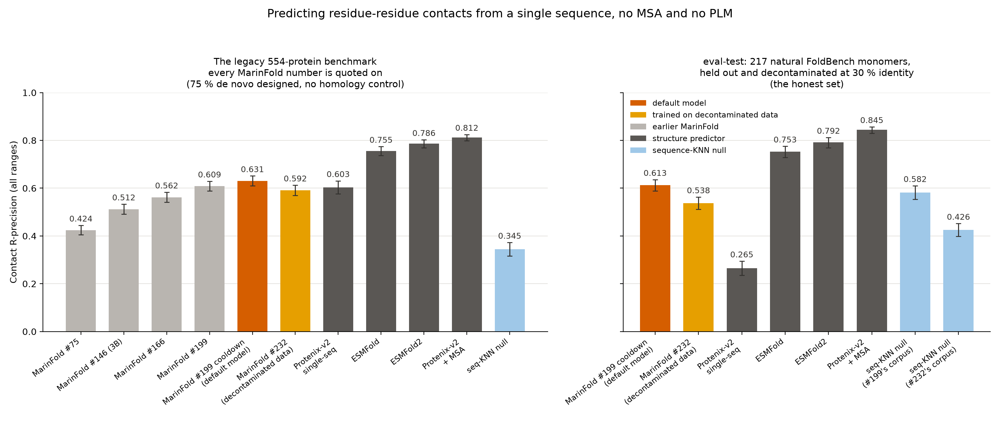

# MarinFold

[](https://colab.research.google.com/github/Open-Athena/MarinFold/blob/main/notebooks/inference_example1.ipynb) [](https://kaggle.com/kernels/welcome?src=https://github.com/Open-Athena/MarinFold/blob/main/notebooks/inference_example1.ipynb)

Can a vanilla LLM predict protein structures (e.g. contact maps, inter-residue distances) without MSAs or PLMs?
MarinFold aims to answer this question. Our models are trained from scratch (without natural language data) on [Marin](https://github.com/marin-community/marin) infrastructure.

This is a research codebase for an ongoing project. It is an experiment in open development.

We welcome collaborators! If you would like to discuss or contribute, join the [Marin Discord](https://discord.gg/J9CTk7pqcM) and look for the `#marinfold` channel.

## Current performance

Here we are prompting with the amino acid sequence and predicting residue/residue
contacts.



Two panels because one set cannot answer both questions. **Left** is the legacy
554-protein benchmark that every published MarinFold number lives on, so it is
where the generations are comparable: #75 0.424 → #146 0.512 → #166 0.562 → #199
0.609 → **#199 cooldown 0.631**, the current default. **Right** is
[eval-test](#how-we-evaluate) — FoldBench's 217 natural monomers that nothing here
had ever scored and that are provably absent from the
[decontaminated](#training-data-decontamination) training corpora at 30 % identity.

Three things to read off it:

- **On natural proteins we are well ahead of single-sequence Protenix-v2** (0.613
  vs 0.265 on eval-test) and well behind ESMFold (0.753), ESMFold2 (0.792) and
  Protenix-v2 + MSA (0.845). The near-tie with Protenix-v2 single-seq on the left
  panel is a property of that set: it is 75 % de novo designed protein, where
  Protenix-v2 single-seq scores 0.835 and on natural monomers 0.265.
- **The nulls are the yardstick.** Copying the contacts of a protein's ten nearest
  training sequences scores 0.582 out of the corpus #199 trained on and 0.426 out
  of the decontaminated corpus #232 trained on. Each model clears the null over
  *its own* corpus — #199 cooldown by +0.031, #232 by +0.112 — and sits below the
  null over the richer one. Decontamination removed 0.156 of memorisable contact
  map per protein.
- **#199 and #232 are not budget-matched** (290,400 vs 145,199 steps), so the gap
  between them is not the price of decontamination; #232's own arms are where that
  gets settled.

All MarinFold bars use our best test-time inference — 100 resampled rollouts voted
per residue pair, see [exp82](experiments/exp82_evals_contacts_v1_contact_prediction/README.md)
— so differences between them are the model, not the decoding. R-precision is a
top-K metric; on **AUC** over the whole contact map the default reaches 0.951,
above Protenix-v2 + MSA (0.941) and ESMFold2 (0.923).

Numbers behind the figure:
[`readme_performance.csv`](experiments/exp245_evals_foldbench_held_out_monomers/data/readme_performance.csv).
The progression over time, with every number's source, is in
[exp180](experiments/exp180_evals_contacts_v1_progress_over_time/README.md).

## How we evaluate

**One metric, one inference recipe, three protein sets.** Everything below is
contact **R-precision** (precision at the number of true contacts, minimum
sequence separation 6) computed by
[exp89's `compute_metrics.py`](experiments/exp89_evals_contacts_v1_model_on_eval_set/compute_metrics.py),
against pyconfind side-chain contacts on the experimental structure. MarinFold
checkpoints are decoded with exp82's rollout+resample recipe (100 realizations,
T = 1.0, top-p 0.95, top-k disabled, `6L + 128` token budget, occurrence-frequency
voting). The same weights score ~0.086 *lower* under the older pairwise readout,
so a number without its recipe is not interpretable.

The current sets, all built from [FoldBench](https://github.com/BEAM-Labs/FoldBench)'s
334 monomers in [exp245](experiments/exp245_evals_foldbench_held_out_monomers/README.md):

| set | what it is | n | use it for |
|---|---|---:|---|
| **eval-test** | every natural FoldBench monomer outside the historical 100 | **217** | the default for any accuracy claim — held out, decontaminated, not design-heavy |
| **eval-val** | the natural monomers inside the historical FoldBench-100 | 97 | continuity with every figure published before 2026-08-18 |
| **eval-denovo** | every de novo designed FoldBench monomer | 19 | designs, kept out of natural-protein means |
| legacy 554 | exp89's benchmark: FoldBench-100 + exp65's 454 low-MSA/novel-fold candidates | 554 | comparing model generations to each other, nothing else |
| eval2 | the ≤40 %-identity subset of a 776-protein superset ([exp226](experiments/exp226_evals_expand_foldbench_eval_set/README.md)) | 307 | superseded by eval-test for natural proteins; 75 % designed |

**The exact proteins in each split** are one file with a split column:
[`experiments/exp245_evals_foldbench_held_out_monomers/data/eval_sets.csv`](experiments/exp245_evals_foldbench_held_out_monomers/data/eval_sets.csv)
— 334 rows, one per monomer, with `eval_set`, `designed`, `is_viral`, `kingdom`,
`seq_len`, `scorable` / `exclusion_reason`, the RCSB entity and title, and each
protein's best sequence identity to the pre-decontamination training corpora.
Ground truth for the scored 333 is
[`gt_universe_scored.jsonl`](https://huggingface.co/buckets/open-athena/MarinFold/resolve/data/contacts-v1-foldbench-monomers-exp245/gt_universe_scored.jsonl);
per-protein scores for all nine predictors are
[`per_protein.csv.gz`](experiments/exp245_evals_foldbench_held_out_monomers/data/per_protein.csv.gz).
The older sets have their own membership files:
[`eval2_manifest.csv`](experiments/exp226_evals_expand_foldbench_eval_set/data/eval2_manifest.csv)
(307 rows, identity-annotated) and the legacy universe
[`gt_universe.jsonl`](https://huggingface.co/buckets/open-athena/MarinFold/resolve/data/contacts-v1-model-eval-exp89/gt_universe.jsonl).
Everything is also on the public bucket under
`data/contacts-v1-foldbench-monomers-exp245/`, readable with no auth.

**Reporting rules that change conclusions, not presentation.**

- **Never pool designs with natural proteins.** Predictors rank differently on
  them: Protenix-v2 single-seq scores 0.835 on the 19 designs and 0.265 on the 314
  natural monomers. Any set that is mostly designed (the legacy 554, eval2) reports
  a different question than "how well does this fold a protein".
- **Split viral vs non-viral.** The viral penalty tracks how much a predictor leans
  on homology — seq-KNN −0.351, ESMFold2 −0.170, MarinFold −0.076 to −0.123,
  Protenix-v2 + MSA −0.045, Protenix-v2 single-seq −0.002. `is_viral` is a column
  on the split file; only 19 of 334 monomers are viral, so treat that stratum as
  indicative.
- **Quote a sequence-KNN null beside any accuracy claim**, computed over the corpus
  the model actually trained on. It bounds how much of the score is reachable by
  copying a training homolog.
- **Differences under ~0.005 are ties** — four evaluations of one unchanged
  checkpoint span 0.0023 ([#204](https://github.com/Open-Athena/MarinFold/issues/204)).

Scoring a checkpoint is a single workflow: the
[`eval-checkpoint`](.agents/skills/eval-checkpoint/SKILL.md) skill carries the
recipe, the bucket paths, the reporting cuts and the two validation gates.

## Training-data decontamination

Models trained before [#232](https://github.com/Open-Athena/MarinFold/issues/232)
saw corpora that were **never filtered against the proteins we evaluate on**;
[#213](https://github.com/Open-Athena/MarinFold/issues/213) measured 58 % of the
554-protein eval set as homologous to training data. Every number from those
models should be read with that in mind.

[#225](https://github.com/Open-Athena/MarinFold/issues/225) built the fix and
published both rebuilt corpora. **The rule as applied:** drop every training
document with **≥ 30 % sequence identity over ≥ 50 % of the shorter sequence** to
any protein in the reference — the 554 eval proteins **∪ all 1,940 FoldBench
protein chains** (not just the monomers we score) — with no E-value arm. Cost:

| corpus | documents | dropped |
|---|---:|---:|
| AFDB (`contacts_v1`) | 4,129,682 → **3,963,003** | 166,679 (4.04 %) |
| ESM-Atlas (`contacts_v1_esm_atlas`) | 66,759,922 → **65,553,178** | 1,206,744 (1.81 %) |

Both live on the bucket as
`data/document_structures/contacts_v1_decontam/train` and
`…/contacts_v1_esm_atlas_decontam/train`; the reference and the applied drop list
are under `data/decontamination/contacts_v1_eval_reference/v1/`.

**What that rule does and does not cover, measured rather than asserted**
([exp245 §1](experiments/exp245_evals_foldbench_held_out_monomers/README.md#1-the-232-checkpoints-are-verifiably-clean-on-all-334-monomers),
[`decontamination_check.json`](experiments/exp245_evals_foldbench_held_out_monomers/data/decontamination_check.json),
[`residual_identity.csv`](experiments/exp245_evals_foldbench_held_out_monomers/data/residual_identity.csv)):

- **It covers the sequence axis completely, at that coverage gate.** 131,180
  training rows match one of the 334 FoldBench monomers under the rule, and *all*
  of them are in the applied drop list — 0 survivors, verified against the drop
  list rather than assumed. The highest surviving identity to any eval protein at
  ≥ 50 % coverage is 0.299.
- **It does not mean "no shared subsequence".** Relax the coverage requirement to
  40 % and essentially every eval protein has a surviving training relative at
  ≥ 30 % identity; with no coverage requirement, 65 of the 334 have one at ≥ 90 %
  identity over some fragment. Domain-level similarity survives by design.
- **It is not fold-level.** #225 priced a fold-disjoint purge (Foldseek TM ≥ 0.5)
  at **37 % of AFDB** and declined it: a third of AFDB's structural clusters share
  a fold with something in a 554-protein eval set. "Decontaminated at 30 %
  identity" is a statement about sequences, never about novel folds.
- **The chain of custody is checked end to end**, not trusted: published corpus row
  counts, the tokenizer's pinned document counts, and the live W&B config of each
  training run, so a model claimed to be clean can be shown to have read only
  decontaminated caches.

Models trained on the decontaminated corpora: #232's `m2-p06` and `m1-p02`
(scored in [#244](https://github.com/Open-Athena/MarinFold/pull/244) and
[#245](https://github.com/Open-Athena/MarinFold/issues/245)). The current default
model, #199's cooldown, was **not** — it is kept as the default because it is the
strongest checkpoint we have, and it is labelled as contaminated wherever it is
compared.

## Try it out

MarinFold predicts a **residue–residue contact map** from a single sequence —
no MSA, no template, no structure. The default model in
[`MODELS.yaml`](marinfold/marinfold/MODELS.yaml) is
`contacts-v1-exp199-cooldown-1.5B` — a 1.47B Qwen3 trained from scratch on a
50/50 AFDB + ESM-Atlas mixture on CoreWeave H100s and then annealed, from
[#199](https://github.com/Open-Athena/MarinFold/issues/199) and scored in
[#234](https://github.com/Open-Athena/MarinFold/pull/234). R-precision **0.631**
on the 554-protein contact benchmark, against single-sequence Protenix-v2's
0.603. The checkpoint it continues, `contacts-v1-exp199-1.5B`, is 0.609.

On **eval-test** — the held-out, decontaminated set of 217 natural FoldBench
monomers described in [How we evaluate](#how-we-evaluate) — it is **0.613**,
against ESMFold's 0.753, ESMFold2's 0.792, Protenix-v2 + MSA's 0.845 and
single-sequence Protenix-v2's 0.265. So the near-tie with single-sequence
Protenix-v2 on the 554 is a property of that set (75 % de novo designed, where
Protenix-v2 single-seq reaches 0.835); on natural proteins we are far ahead of it
and still well behind the MSA and PLM methods. Quote the 554 number as progress
against our own history and eval-test when the question is how well this folds a
protein — see [exp245](experiments/exp245_evals_foldbench_held_out_monomers/README.md).

Note the default model was trained *before*
[decontamination](#training-data-decontamination): its corpora were never filtered
against the eval proteins. The strongest checkpoint trained on decontaminated data
is #232's `m2-p06` at 0.538 on eval-test, and the two runs are not budget-matched.

### GPU example

Set up:

```bash
# Install uv if you don't already have it:
curl -LsSf https://astral.sh/uv/install.sh | sh

git clone https://github.com/Open-Athena/MarinFold.git
cd MarinFold/marinfold
uv sync --extra vllm  # "vllm" for Linux+GPU, "transformers" for CPU/CUDA, "mlx" for Apple Silicon
```

Run inference:

```bash
# Predict the contact map for the Top7 de novo designed protein ([1QYS](https://www.rcsb.org/structure/1QYS)).
# Replace "vllm" with "transformers" (CPU/CUDA) or "mlx" (Apple Silicon).
SEQUENCE=MGDIQVQVNIDDNGKNFDYTYTVTTESELQKVLNELMDYIKKQGAKRVRISITARTKKEAEKFAAILIKVFAELGYNDINVTFDGDTVTVEGQLEGGSLEHHHHHH
uv run marinfold infer \
    --backend vllm \
    --input-sequence $SEQUENCE \
    --out ~/prediction.json \
    --out-plots ~/contact_map.pdf
```

`--out` holds one `P(contact)` score per residue pair; `--out-plots` is the
contact-map heatmap. The first run downloads our 1.5B contacts-v1 model
(~6 gb). Omitting `--model` uses the default (`contacts-v1-exp199-cooldown-1.5B`);
the earlier contacts-v1 checkpoints are available as `--model
contacts-v1-exp199-1.5B` / `contacts-v1-exp166-1.5B`
/ `contacts-v1-exp117-1.5B` / `contacts-v1-exp120-1.5B` / `contacts-v1-exp75-1.5B`,
and the older distogram models as `--model 1B` / `1.5B` (see below).

The command above uses the fast **`pairwise`** readout (~0.3 s/protein). Our
**best** inference — what every MarinFold bar in *Current performance* uses —
is exp82's **`rollout`** recipe: vote over 100 sampled
contact-section completions (each from a freshly resampled document) with a
pairwise tie-break. It is ~150× slower (~50 s/protein on a GPU) but sharpens the
top-ranked contacts. Run it via the per-impl driver (the top-level CLI keeps its
surface narrow):

```bash
uv run contacts-v1 infer \
    --backend vllm --model contacts-v1-exp199-cooldown-1.5B \
    --method rollout --n-rollouts 100 \
    --input-sequence $SEQUENCE \
    --out ~/prediction.json --out-plots ~/contact_map.pdf
```

`rollout` needs a sampling backend — `--backend vllm` or `transformers` (not
`mlx`). The pairwise `--ensemble-k N` test-time-augmentation knob lives on this
driver too.

To score against a known structure's ground-truth contacts, use `evaluate`
(reports contact-prediction AUC and precision@{L, L/2, L/5}). Ground truth is
read with [pyconfind](https://github.com/timodonnell/pyconfind), so add its
extra to the sync (`uv sync --extra vllm --extra contacts-v1`):

```bash
uv run marinfold evaluate \
    --backend vllm \
    --input tests/data/1QYS.cif \
    --metrics-out ~/metrics.json \
    --out-plots ~/gt_vs_pred.pdf
```

### Previous generation (distograms)

Our earlier `contacts-and-distances-v1` models predict CB–CB **distograms**
rather than contacts. Same CLI, just point `--model` at one of them:

```bash
uv run marinfold infer \
    --backend vllm --model 1B \
    --input-sequence $SEQUENCE \
    --out ~/distogram.json --out-plots ~/distogram.pdf
```

## Document structures

A **document structure** is a recipe for turning a protein structure
into the token string a trained model sees (and back).
`contacts-and-distances-v1` is our current format: a residue
sequence followed by a mix of CB-CB contact statements and per-pair
distance statements, with a per-structure pLDDT-bin token.

Generate one document from a structure file:

```bash
cd marinfold
uv sync
uv run contacts-and-distances-v1 generate \
    --input tests/data/1QYS.cif \
    --out /tmp/docs.jsonl
```

The output is one row per input structure with a `document` field
holding the token string (`.parquet` works too — pick by suffix).
View the first document:

```bash
python -c "import json; print(json.loads(open('/tmp/docs.jsonl').readline())['document'])"
```

You'll see a single space-separated token string like:

```
<contacts-and-distances-v1> <begin_sequence> <M> <G> <D> <I> ... <begin_statements> <long-range-contact> <p3> <p82> <distance> <p7> <p41> <CA> <CB> <d12.5> ... <plddt_95_100> <end>
```

Point `--input` at a directory to batch over a whole set of
structures (one document per input). See `contacts-and-distances-v1
generate --help` for the algorithm knobs (contact cutoff, per-mode
fractions, pLDDT filter, context-length budget).

A second format, `contacts-v1`
([SPEC.md](marinfold/marinfold/document_structures/contacts_v1/SPEC.md)),
is contacts-only: a residue sequence — `<pN> <AA>` statements in
random order, with `<n-term>`/`<c-term>` markers and residues numbered
from a random start that wraps around 2000 indices — followed by
`<contact>` statements for the strongest
[pyconfind](https://github.com/timodonnell/pyconfind) side-chain
contacts above a minimum degree (as many as fill the context budget),
listed in random order. Generation needs the `contacts-v1` extra (pyconfind):

```bash
cd marinfold
uv sync --extra contacts-v1
# Eyeball documents + their contact tables in the terminal:
uv run contacts-v1 view --input tests/data/1QYS.cif
# Write documents (with protein-docs-style metadata columns) plus a
# per-protein JSON summary (sequence, every contact's degree, truncation):
uv run contacts-v1 generate --input tests/data/1QYS.cif \
    --out /tmp/contacts_v1_docs.jsonl --summary-out /tmp/summary.json
```

## More details (mostly written by robots)

Trained models are listed in
[`MODELS.yaml`](marinfold/marinfold/MODELS.yaml) by
nickname. The `marinfold` CLI looks up the model, picks the first
document structure it supports, and dispatches to that impl. Two
subcommands:

```bash
cd marinfold
uv sync --extra mlx        # or --extra vllm, or --extra transformers

# Predict structure for a sequence (contacts or distances, per the model).
uv run marinfold infer \
    --backend mlx --input-sequence SIINFEKLLLSKP \
    --out /tmp/preds.json

# Evaluate predictions against ground-truth structures.
uv run marinfold evaluate \
    --backend mlx --input /path/to/pdbs/ \
    --metrics-out /tmp/metrics.json
```


| Backend        | Platform                                       | Extra                  |
| -------------- | ---------------------------------------------- | ---------------------- |
| `vllm`         | Linux + NVIDIA GPU (production / scaled eval)  | `--extra vllm`         |
| `mlx`          | Apple Silicon (fastest local)                  | `--extra mlx`          |
| `transformers` | Anywhere torch installs (Apple MPS, CPU, CUDA) | `--extra transformers` |


`--model` accepts a [`MODELS.yaml`](marinfold/marinfold/MODELS.yaml) nickname or a
local checkpoint directory. Omit it to use the entry marked
`default: true`. `--document-structure` overrides the impl
selection; without it the first supported impl wins. See
`[marinfold/README.md](marinfold/README.md)` for the full backend
matrix and `marinfold infer --help` / `marinfold evaluate --help`
for the full flag set.

For impl-specific flags (seed-N sweeps, distance cap, batch size,
etc.) each impl has its own lower-level CLI. `contacts-v1` and
`contacts-and-distances-v1` install theirs as console scripts
(`contacts-and-coordinates-v1` has none — run it with `python -m`;
see [`marinfold/README.md`](marinfold/README.md)):

```bash
cd marinfold
uv sync --extra mlx
uv run contacts-and-distances-v1 evaluate \
    --backend mlx --model 1B \
    --input /path/to/pdbs/ --seed-n-values 0,5,20,50 \
    --out /tmp/metrics.json
```

## Colab Notebooks

- [Inference Example 1](https://colab.research.google.com/github/Open-Athena/MarinFold/blob/main/notebooks/inference_example1.ipynb) — run the default `contacts-v1-exp199-cooldown-1.5B` model on a structure from RCSB and plot the ground-truth vs predicted contact map (choose `pairwise` or `rollout` inference).
- [Fold From Contacts 1](https://colab.research.google.com/github/Open-Athena/MarinFold/blob/main/notebooks/fold_from_contacts1.ipynb) — a classical "approximate AlphaFold" (Floyd–Warshall + MDS) that folds a 3D backbone from predicted contacts, following [sokrypton/ml4me](https://colab.research.google.com/github/sokrypton/ml4me/blob/main/AlphaFold_approx_v2.ipynb) but sourcing contacts from `contacts-v1-exp199-cooldown-1.5B` (from sequence alone) instead of the MSA. Takes any RCSB PDB id (MSA built via the ColabFold MMseqs2 API) or an AlphaFold-DB UniProt id; compares MarinFold vs MSA-coevolution contact maps side by side, and toggles which one drives the fold (with a py3Dmol overlay vs the reference). Ready-made examples plus a `custom` option for any PDB/UniProt id; the default `1R69` (434 repressor) has a deep MSA, and `1QYS` (Top7) is a designed protein with a nearly empty MSA.
- [Inspect Data 1](https://colab.research.google.com/github/Open-Athena/MarinFold/blob/main/notebooks/inspect_data1.ipynb) — browse legacy `timodonnell/protein-docs` subsets plus newer `open-athena/MarinFold` bucket parquet data, with sample documents and parquet schema previews.
- [Short-Document Bias](https://colab.research.google.com/github/Open-Athena/MarinFold/blob/main/notebooks/short_document_bias.ipynb) — does `contacts-v1-exp75-1.5B` under-generate contacts / emit too-short rollout documents vs the ground truth? ([issue #142](https://github.com/Open-Athena/MarinFold/issues/142)) Part A reproduces the published 12-protein × 200-rollout finding (no GPU); Part B regenerates rollouts on a GPU. The shortfall is mild-to-moderate (`pred/gt ≈ 0.70`), never truncated (100% finish), and tracks difficulty (`corr(pred/gt, recall) = +0.84`) — a symptom of the model being unsure of the fold, not a decoding bug.
- [Retraction Mode Playground](https://colab.research.google.com/github/Open-Athena/MarinFold/blob/main/notebooks/retraction_mode_playground.ipynb) — `exp175-cv1-1.5B-mode50-v2`, a contacts-v1 model that can take back its own predictions mid-rollout with a `<retract>` statement, and whose first token decides whether it may ([#175](https://github.com/Open-Athena/MarinFold/issues/175)). Same weights, same protein, one token different: `<contacts-v1>` gives 0.1 retractions per rollout, `<contacts-v1.backtracking>` gives 42. Shows what it retracts and how far back it reaches, votes rollouts into a contact map, and compares the two modes side by side. Free Colab T4, no login. **It is deliberately not the accuracy frontier** — it scores −0.006 (clean) / −0.015 (retraction) R-precision against the `exp120` model it was fine-tuned from; use `1.5B` for prediction.
- [Explore ESM Atlas Distill](https://colab.research.google.com/github/Open-Athena/MarinFold/blob/main/notebooks/explore_esm_atlas_distill.ipynb) — randomly sample 10 proteins from the [`open-athena/esm-atlas-esmfold2-distill`](https://huggingface.co/buckets/open-athena/esm-atlas-esmfold2-distill) bucket (the ESMFold2 Atlas distill for training-set expansion, [#91](https://github.com/Open-Athena/MarinFold/issues/91)), load their mmCIFs, and view them in an inline py3Dmol grid cartoon-colored by per-residue pLDDT. Runs on a free CPU runtime with no login; samples cheaply via range reads (never downloads a full part).

## Layout

```
MarinFold/
├── RESOURCES.md            # datasets, tokenizers, W&B projects, prior repos
├── AGENTS.md               # shared agent rules
├── .github/ISSUE_TEMPLATE/experiment.md
├── scripts/                # repo-management scripts (scaffold, itemize, history)
├── experiments/            # one dir per GitHub issue tagged `experiment`
│   ├── README.md
│   ├── AGENTS.md
│   ├── TEMPLATE.md
│   └── exp<N>_<kind>_<name>/       # individual experiments
├── marinfold/              # top-level package: MODELS.yaml, backends, doc-structure toolkit + impls, `marinfold` CLI
├── models/                 # library for model-training experiments
└── history/                # one file per W&B-logged run + summary RUNS.md
```

Each top-level dir under the repo root is a **small library** for one
kind of work. Concrete experimental work begins as an issue and a
sub-directory under `experiments/` and pulls in helpers from the
relevant library. An experiment dir is never copied into a kind dir —
code meant to be reused lands in the library from the start and the
experiment imports it.

## Experiment workflow

1. **File an issue** with the `experiment` label using the
  [issue template](.github/ISSUE_TEMPLATE/experiment.md). Specify
   the `Kind:` in the issue body.
2. **Scaffold** the experiment dir:
  ```bash
   cd scripts
   uv sync                                                          # one-time setup
   python scaffold.py --issue <N> --kind <kind>
  ```
   Creates `experiments/exp<N>_<kind>_<name>/` with a README
   pre-filled from the issue body.
3. **Implement.** Add `.py` files in the experiment dir. If the
  experiment imports marin, add a `pyproject.toml` declaring a path
   dep on the relevant kind library; see
   `[exp0_models_protein_docs_initial_port/pyproject.toml](experiments/exp0_models_protein_docs_initial_port/pyproject.toml)`
   as the worked example.
4. **Launch.** Marin's executor hash-caches step outputs, so a rerun
  with no config changes is a no-op:
5. **Record results** in the experiment's README. Commit small CSVs
  to its `data/`, plots to its `plots/`. Large artifacts go to GCS
   or HuggingFace (see below).
6. **Regenerate the index**: `python scripts/itemize.py`.
7. **Close the issue** once the conclusion lands.

Most work happens on `main`. Use a branch (`exp/<N>-<name>`) only
when an experiment needs speculative changes to a shared kind
library.

## Experiment kinds

Every experiment is one of four kinds, indicated by the second token
in its directory name (`exp10_<kind>_<name>`):


| Kind                  | What it does                                                                                           | Library lives in                                                                       |
| --------------------- | ------------------------------------------------------------------------------------------------------ | -------------------------------------------------------------------------------------- |
| `models`              | Train models                                                                                           | `[models/](models/)`                                                                   |
| `evals`               | Run evals on trained models                                                                            | — (no shared library yet)                                                              |
| `data`                | Generate training / eval datasets                                                                      | — (no shared library yet)                                                              |
| `document_structures` | Define a generate-from-input + evaluate-against-ground-truth interface for one protein-document format | `[marinfold/marinfold/document_structures/](marinfold/marinfold/document_structures/)` |


Kind libraries are only created when a second experiment needs the
same helper. Today `evals/` and `data/` kinds exist as experiment
kinds (e.g. `experiments/exp9_evals_`*) but have no shared library —
the first experiment in each kind that finds itself sharing code
with a sibling creates the kind dir at that point.

A **document structure** is a recipe with two responsibilities: turn
input data (e.g. a PDB) into a training document string, and score a
trained model against ground-truth structures using the same format.
Every format is implemented as a subpackage of
[`marinfold.document_structures`](marinfold/marinfold/document_structures/)
from its first commit, with its own `cli.py` driver (`generate` /
`view` / `infer` / `evaluate` / `tokenizer`, depending on the impl) on
top of the shared toolkit there (`EvalResult`, `build_tokenizer`,
parquet/jsonl writers). `contacts-v1` is the current format; see
[`marinfold/README.md`](marinfold/README.md) for all three and what
each supports.

## Run history

Every W&B-logged run gets a markdown file under `history/runs/`.
A **run** is anything with a W&B link — training, evals, data-gen
pipelines that emit metrics. Multiple processes contributing to the
same W&B `run_id` share one history file.

Each file has YAML frontmatter (user, launch time, W&B URL, iris
job IDs, git SHA, kind, experiment, short description) plus a
free-form body for the detailed plan, changes from prior runs, and
notes. `history/RUNS.md` is a generated summary table sorted newest-
first with links out to W&B + the detail file.

After `wandb.init()` returns and you have the W&B URL in hand:

```bash
python scripts/history.py new \
    --wandb-url https://wandb.ai/open-athena/MarinFold/runs/<id> \
    --wandb-name <display-name> \
    --experiment exp<N>_<kind>_<name>   # or no_experiment
    --kind <models|evals|data|document_structures|other> \
    --short "<one-line description>" \
    --iris-jobs <iris-job-id>

python scripts/history.py add-iris-job <run-stem> <new-iris-job-id>   # on preempt-restart
python scripts/history.py update-index                                # regenerate RUNS.md
python scripts/history.py sync                                        # catch missed runs (needs wandb extra)
python scripts/history.py check                                       # CI gate
```

See `[history/README.md](history/README.md)` for the full schema and
policy.

## Where artifacts go

We try hard to avoid committing large files into the repo. The
authoritative homes for non-source artifacts:

- **HuggingFace bucket** (`buckets/open-athena/MarinFold`) — single
bucket for **both data artifacts and model checkpoints**. Inside,
use top-level `data/...` and `checkpoints/...` prefixes so the
distinction is explicit. Checkpoint names should embed the W&B
run name. (See `AGENTS.md` "HF bucket" for the splitting policy.)
- **HuggingFace datasets** (`huggingface.co/datasets/timodonnell/<name>`)
— first-class published text / tokenized corpora that levanter
loads via `hf://datasets/` URIs. Long-tail / in-flight data
artifacts go to the bucket instead.
- **GCS** (`gs://marin-<region>/<...>`, co-located with the job's
compute zone — see `AGENTS.md` "GCS bucket") — large intermediate
artifacts produced by marin's executor (tokenized parquets,
cached features, predictions).
- **W&B** (`https://wandb.ai/open-athena/MarinFold`) — training and
eval metrics, run metadata.

The repo holds source, prose, small CSVs that feed plots, and
plots themselves. Anything bigger than ~1 MB needs a deliberate
reason to be checked in.

## Tooling reference

Repo-management scripts live in `[scripts/](scripts/)` and are run
with plain `python`:


| Script                                          | Purpose                                                             |
| ----------------------------------------------- | ------------------------------------------------------------------- |
| `python scripts/scaffold.py --issue N --kind K` | Create an experiment dir from a GitHub issue                        |
| `python scripts/itemize.py`                     | Regenerate `experiments/index.md`                                   |
| `python scripts/history.py new ...`             | Create a run history file for a W&B run                             |
| `python scripts/history.py add-iris-job ...`    | Append an iris job ID (preemption / restart)                        |
| `python scripts/history.py sync`                | Pull W&B runs; skeleton-file the missing ones (needs `wandb` extra) |
| `python scripts/history.py update-index`        | Regenerate `history/RUNS.md`                                        |
| `python scripts/history.py check`               | CI gate: exit non-zero if W&B has runs without history files        |


For impl-specific CLI surfaces (e.g. `generate` and `tokenizer`
subcommands), see the per-impl CLI — `contacts-v1` and
`contacts-and-distances-v1` install one as `<structure-name>` (e.g.
`contacts-and-distances-v1 {generate,infer,evaluate,tokenizer} ...`)
alongside the top-level `marinfold` command.

To set up the scripts venv: `cd scripts && uv venv --python 3.11 && uv sync`
(add `--extra wandb` for `history sync` / `history check`).

## Status

Initial port (commit-level) from the
`[marin/protein-training-1b](https://github.com/marin-community/marin/tree/protein-training-1b/experiments/protein)`
branch. All training/export scripts live under
`[experiments/exp0_models_protein_docs_initial_port/](experiments/exp0_models_protein_docs_initial_port/)`;
shared marin glue is in `[models/marinfold_models/](models/marinfold_models/)`.
The `contacts-and-distances-v1` document structure lives at
`[marinfold/marinfold/document_structures/contacts_and_distances_v1/](marinfold/marinfold/document_structures/contacts_and_distances_v1/)`;
the experiment that first built it is
`[experiments/exp1_document_structures_contacts_and_distances_v1/](experiments/exp1_document_structures_contacts_and_distances_v1/)`,
kept as a historical record.
Eval experiments (e.g. `experiments/exp9_evals_`*) have started
landing; a shared `evals` kind library will be created when a second
eval experiment needs the same helper.
