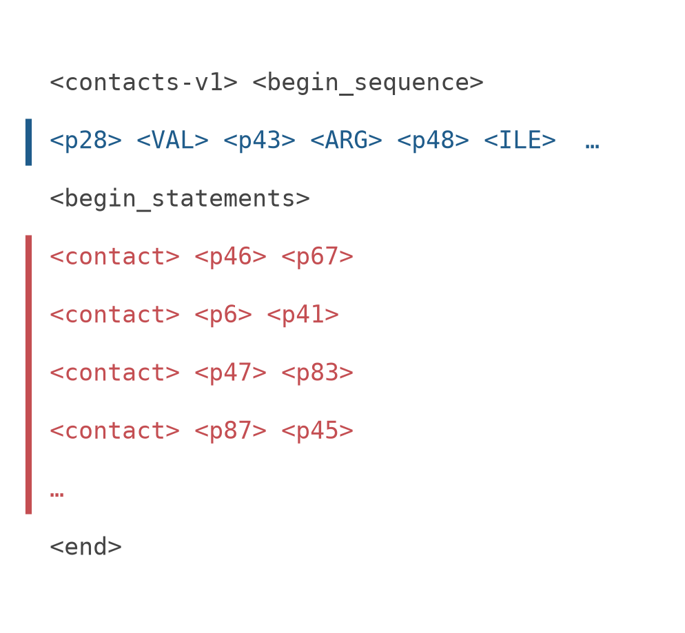
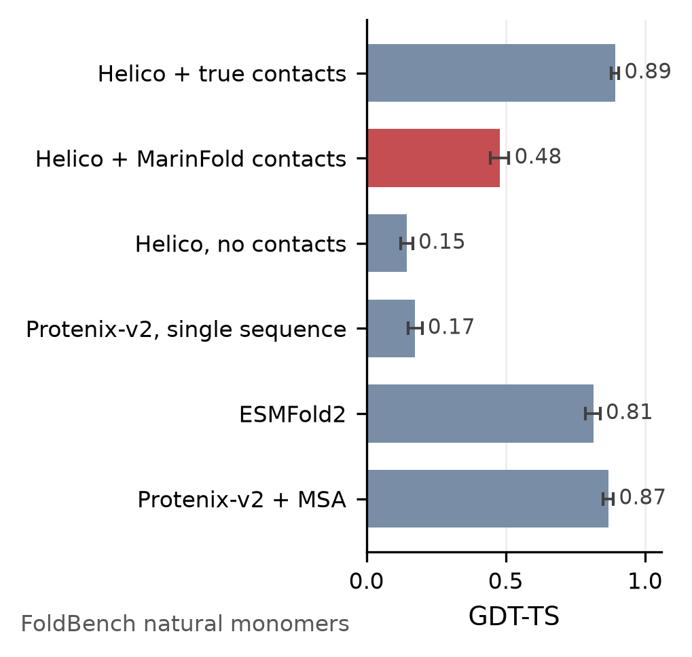
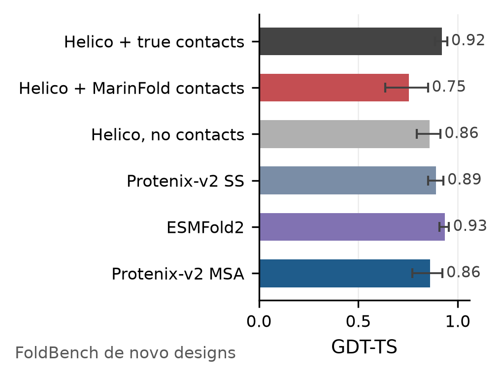

# MarinFold

[](https://colab.research.google.com/github/Open-Athena/MarinFold/blob/main/notebooks/inference_example1.ipynb) [](https://kaggle.com/kernels/welcome?src=https://github.com/Open-Athena/MarinFold/blob/main/notebooks/inference_example1.ipynb)

Can a vanilla LLM predict protein structures without MSAs or PLMs?

MarinFold aims to answer this question. Our models are trained from scratch (without natural language data) on [Marin](https://github.com/marin-community/marin) infrastructure.

This is a research codebase for an ongoing project. It is an experiment in open development.

We welcome collaborators! If you would like to discuss or contribute, join the [Marin Discord](https://discord.gg/J9CTk7pqcM) and look for the `#marinfold` channel.

## Background

Protein structure predictors like [AlphaFold3](https://doi.org/10.1038/s41586-024-07487-w) and [ESMFold2](https://doi.org/10.64898/2026.06.03.729735) rely on evolutionary information in the form of multiple sequence alignments (MSAs) or protein language model (PLM) embeddings. While that works great in many cases, this dependency limits accuracy in key settings such as rapidly evolving viral proteins, rare proteins, highly-conserved proteins, and mutated proteins. It also limits the accessible space of de novo computationally-designed proteins to the highly-stable structures current models can fold without evolutionary information.

The success of AlphaFold and the like has enabled the creation of enormous databases comprising hundreds of millions of predicted protein monomer structures. In this project we are asking whether single sequence structure prediction might be tractable simply by using these predicted structures as training data. Perhaps the evolutionary information provides models a "shortcut," and if we train a model without this shortcut on a large enough dataset, it might learn single-sequence structure prediction.

For the current experiments, we trained a 1.5 billion parameter large language model from the Qwen3 family on AlphaFold2- or ESMFold2-predicted contact maps from about 70 million natural proteins, with ProteinMPNN redesigns expanding the current training corpus to 232 million documents.

Why use an LLM architecture? We've built a lot of infrastructure for training LLMs on large datasets for the [Marin](https://github.com/marin-community/marin) project, which we are making use of here. We also think formulating MarinFold as an autoregressive LLM may eventually prove useful for inference-time search and post-training.

To make it possible to use an LLM without any modifications, we assemble a “document” for each training protein specifying the protein sequence followed by statements indicating residue/residue contacts:



As shown above, a MarinFold training document consists of a protein sequence specified as (position, amino acid) pairs followed by a series of residue/residue contacts. The sequence and the contacts are given in a random order. Each element in angle brackets is a token in the model’s 2,845-token vocabulary.

At inference-time, we autoregressively generate 100 rollouts and rank contacts by how often they appear across rollouts. We then use another model called [Helico](https://github.com/Open-Athena/helico) to generate all-atom 3D structures conditioned on the contacts predicted by MarinFold. Helico closely follows the AlphaFold3 architecture and is fine-tuned from an AlphaFold3 clone called [Protenix](https://doi.org/10.64898/2026.02.05.703733).

## Does this work?

Sort of! Here's the MarinFold prediction for a simple de novo designed protein called [Top7](https://www.rcsb.org/structure/1QYS). The panel uses the 92-residue Top7 sequence from our legacy benchmark and the new exp277 checkpoint's saved rollouts.


More quantitatively, we can compare MarinFold contact prediction accuracy to existing predictors on protein monomers from the [FoldBench](https://www.biorxiv.org/content/10.1101/2025.05.22.655600v1) benchmark. We define the R-precision for a protein with N ground truth contacts as the fraction of the model’s N highest-confidence predicted contacts that are present in the ground truth structure. For MarinFold, we rank contacts by how often they occur across 100 rollouts. For the baseline models, we score the single highest-confidence structure and rank contacts by ConFind contact degree. This is what that looks like:

 

The new default is **exp277 at step 266,344** (`contacts-v1-exp277-m2-p06-full-epoch-1.5B`), trained for one complete epoch over native and ProteinMPNN-redesigned documents. It improves over the previous native-only exp232 default on legacy 554 and on de novo designs, while natural eval-val is effectively tied. These contact plots use the **97 eval-val proteins and 19 eval-denovo designs**, with identical proteins for every predictor and 95% protein-bootstrap intervals. Exp277 has not been scored on eval-test. The sequence-KNN reference indexes the native decontaminated corpus; it does not include redesigns.

MarinFold outperforms Protenix-v2 single-sequence on natural eval-val, but still trails the structure predictors on these de novo designs. The design gain over exp232 is +0.086 (paired 95% interval +0.040 to +0.139); the natural eval-val delta is +0.002 (−0.008 to +0.013). This is one seed with different training exposure. [Results, source tables, and plot reproduction](experiments/exp277_models_single_mpnn_pilot/README.md).

We train on predicted structures and evaluate on experimentally determined structures. The native corpus was filtered to remove sequence matches to evaluation proteins at ≥30% identity over ≥50% of the shorter sequence; redesigns derive from those filtered source structures.

For a more apples-to-apples comparison, we can also look at the accuracy of the predicted structures when we run MarinFold-predicted contacts through [Helico](https://github.com/Open-Athena/helico). The following structure results use the **previous exp232 step-363000 model**, not exp277; a Helico evaluation of the new checkpoint is still pending.

 

We get a nice boost on natural monomers above Protenix v2 SS. We still have a ways to go to get something competitive with the other predictors, however.

## What's next?

The main areas of ongoing work are:
* Inference-time search techniques that might generate better predictions than simply taking the consensus across 100 MarinFold rollouts
* Post-training. We've been trying ideas like: fine-tune MarinFold to generate multiple predicted contact maps per rollout, then use reinforcement learning to push the model to generate a diverse set of predictions in each rollout.
* Extending beyond protein monomers to protein complexes, where existing predictors leave greater room for improvement

## Try it out

The default model in [`MODELS.yaml`](marinfold/marinfold/MODELS.yaml) is
`contacts-v1-exp277-m2-p06-full-epoch-1.5B` — a 1.47B Qwen3 trained from scratch for one complete epoch over the native and ProteinMPNN-redesigned corpus, from [#277](https://github.com/Open-Athena/MarinFold/issues/277). R-precision is **0.620** on legacy 554, **0.554** on eval-val, and **0.696** on eval-denovo. The [public checkpoint](https://huggingface.co/buckets/open-athena/MarinFold/tree/checkpoints/contacts-v1-exp277-m2-p06-full-epoch-1.5B/hf/step-266344) includes its tokenizer and publication manifest. The previous native-only model remains available as `contacts-v1-exp232-m2-p06-train-1.5B`.

### GPU example

Set up:

```bash
# Install uv if you don't already have it:
curl -LsSf https://astral.sh/uv/install.sh | sh

git clone https://github.com/Open-Athena/MarinFold.git
cd MarinFold/marinfold
uv sync --extra vllm  # "vllm" for Linux+GPU, "transformers" for CPU/CUDA, "mlx" for Apple Silicon
```

Run inference, with the 100-rollout consensus our published numbers use:

```bash
# Predict the contact map for the Top7 de novo designed protein ([1QYS](https://www.rcsb.org/structure/1QYS)).
# Replace "vllm" with "transformers" (CPU/CUDA); rollouts need one of those two.
SEQUENCE=MGDIQVQVNIDDNGKNFDYTYTVTTESELQKVLNELMDYIKKQGAKRVRISITARTKKEAEKFAAILIKVFAELGYNDINVTFDGDTVTVEGQLEGGSLEHHHHHH
uv run contacts-v1 infer \
    --backend vllm \
    --input-sequence $SEQUENCE \
    --method rollout \
    --n-rollouts 100 \
    --out ~/prediction.json \
    --out-plots ~/contact_map.pdf
```

To score against a known structure's ground-truth contacts, use `evaluate`
(reports contact-prediction AUC and precision@{L, L/2, L/5}). Ground truth is
read with [pyconfind](https://github.com/timodonnell/pyconfind), so add its
extra to the sync (`uv sync --extra vllm --extra contacts-v1`):

```bash
uv run contacts-v1 evaluate \
    --backend vllm \
    --input tests/data/1QYS.cif \
    --method rollout \
    --n-rollouts 100 \
    --out ~/metrics.json \
    --out-plots ~/gt_vs_pred.pdf
```

Both commands use the default model, because `--model` is omitted.

`contacts-v1` is the readout-level CLI for this document structure — that is
where `--method` and the sampling knobs live. There is also a narrower
high-level CLI, `marinfold infer` / `marinfold evaluate`, which picks the impl
for you from the model's registry entry and always uses the fast `pairwise`
readout (seconds rather than minutes, and several points less accurate). Only
`pairwise` runs on Apple Silicon; rollouts need `vllm` or `transformers`.

## Details

### Training set

Our training set consists of about four million structures predicted by [AlphaFold2](https://doi.org/10.1038/s41586-021-03819-2) and deposited in the [AlphaFold Database](https://doi.org/10.1093/nar/gkad1011) (AFDB) plus about 66 million structures predicted by [ESMFold2](https://doi.org/10.64898/2026.06.03.729735) and deposited in the ESM-Atlas (https://biohub.ai/esm/protein/atlas). We selected these proteins from their databases through a series of filtering and clustering steps. For AFDB, the inclusion criteria were: mean pLDDT >= 70, length 2-2000, and membership in both an AFDB50 sequence cluster and a Foldseek [structural cluster](https://doi.org/10.1038/s41586-023-06510-w) with at least 3 members. Of these we took up to five proteins per structural cluster by mean pLDDT.  For ESM-Atlas, the inclusion criteria were: mean pLDDT >= 70, pTM >= 0.50, length 60-1000, and non-redundant with the AFDB data at 40% sequence identity. This resulted in 163M structures, which we clustered using [MMseqs2](https://doi.org/10.1038/nbt.3988) linclust at 40% identity into 67M clusters. We selected one representative per cluster by taking the longest sequence per cluster. Before assembling the final training dataset from the two sources, we removed proteins that had 30% or greater sequence identity to any protein in our eval set across a span covering at least 50% of the smaller of the two proteins. Our eval set for this purpose consisted of all protein chains in [FoldBench](https://www.biorxiv.org/content/10.1101/2025.05.22.655600v1), plus several hundred additional proteins. This removed 1,373,423 (1.9%) of training points, resulting in a native training dataset of 69.5 million proteins. The current exp277 model adds ProteinMPNN-redesigned documents from these source structures, producing 232,090,905 documents and 248.584 billion raw tokens. It visits all 34,092,146 packed examples once, with a fresh global shuffle and no fixed 50:50 source weighting.

### Contact prediction model

MarinFold uses a [Qwen3](https://arxiv.org/abs/2505.09388) large language model (LLM) architecture with 1.47 billion parameters (24 layers, hidden dimension 2048, 32 attention heads with 8 key/value heads, QK-normalization, rotary positional embeddings, context length 8192). The model was trained from scratch with a standard next-token cross-entropy objective with no natural language pre-training using a 2,845 token vocabulary. Training used AdamW at peak learning rate 1e-3 and weight decay 0.2. At inference time, we prompt the model with a protein sequence and sample the contact section to completion (a rollout), drawing 100 rollouts per protein. We rank contacts by their frequency of occurrence across the 100 rollouts. MarinFold is available at: https://github.com/Open-Athena/MarinFold.

### Document structure

A contact map is represented as a document over a custom vocabulary of 2,845 tokens (Figure 1a). The sequence section gives one (position, amino acid) statement per residue plus n-term and c-term statements defining the termini. The structure section specifies one (contact, position1, position2) triple per contacting residue pair. Statements within each section are emitted in random order. Positions come from a ring of 2,000 index tokens. Each document draws a uniformly-random starting index and numbers protein residues from there, wrapping around after index 1999, so that the whole index range is used even though most proteins are shorter than 2,000 residues.

### Contacts definition

We defined contacts using [ConFind](https://doi.org/10.1016/j.str.2015.03.015), which considers the fraction of sidechain rotamer states that clash between residues, rather than a fixed distance cutoff. We used the pyconfind implementation (https://github.com/timodonnell/pyconfind), and counted a residue pair as in contact if its contact degree exceeded 0.001 and the two residues are at least 6 positions apart in primary sequence. Deviating from the standard ConFind implementation, which considers all possible amino acids at each position, we consider only the native amino acids present in the sequence being predicted.

### 3D structure prediction model

Helico closely follows the [AlphaFold3](https://doi.org/10.1038/s41586-024-07487-w) architecture and is initialized from [Protenix v1](https://doi.org/10.64898/2026.02.05.703733) weights. We replaced the MSA input with a three-state (contact / no-contact / unknown) token by token matrix, projected by a zero-initialized linear layer into the initial pair representation, so that enabling contact conditioning has no effect on the model at the first training step. During fine-tuning the level of contact conditioning is sampled per example from none to complete, and the contacts provided to the model are corrupted with both false positives and false negatives. We fine-tuned Helico for 6,000 steps on data sampled from the original Protenix v1 training set. This took about 8 hours on a machine with 8x H100 GPUs. Helico is available at: https://github.com/Open-Athena/helico.

### Baseline predictors

[Protenix v2](https://doi.org/10.64898/2026.04.10.717613) (protenix 2.0.0) was run in both single-sequence and MSA modes on H100 GPUs with 10 trunk recycles, 5 random seeds, and 8 diffusion samples per protein. We scored the top-1 sample selected by Protenix's ranking score. MSAs were pre-computed with Protenix's [ColabFold](https://doi.org/10.1038/s41592-022-01488-1) backend. [ESMFold](https://doi.org/10.1126/science.ade2574) was run with 4 recycles, giving one deterministic prediction per protein. ESMFold2 was run with num_loops = 20 and best-of-5 diffusion draws at distinct seeds, keeping the top-1 by the model's own confidence. Helico was run MSA-free with 6 trunk recycles and 3 diffusion samples, keeping the best of the three by its own confidence head. To score contact prediction for the structure-based predictors we took the single highest-confidence predicted structure and rank residue pairs by ConFind contact degree, using the same parameters as for the ground truth.

## More details

See [DOCS.md](DOCS.md).