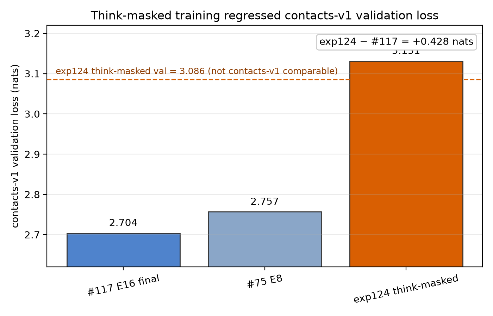

---
marinfold_experiment:
  issue: 124
  title: 'exp: train a 1.5B contacts-v1 model on the pause-token dataset — apples-to-apples vs Eric''s #75'
  kind: models
  branch: exp124/think-loss-masked
---

# exp: train a 1.5B contacts-v1 model on the pause-token dataset — apples-to-apples vs Eric's #75

**Issue:** [#124](https://github.com/Open-Athena/MarinFold/issues/124) · **Kind:** `models` · **Branch:** `exp124/think-loss-masked`

## Question

Does the pause-token setup from Goyal et al. 2023 improve contacts-v1 modeling
and downstream contact prediction in MarinFold? In this setup, the training data
contains inserted `<think>`/pause tokens, loss is masked on positions that predict
those pause tokens, and inference can append pause tokens before extracting the
model's contact predictions.

Operationally, the first check is whether the model preserves ordinary
contacts-v1 validation loss, followed by the downstream contact metric with and
without inference-time `<think>` insertion.

## Hypothesis

Pause tokens may give the model extra computation before committing to contact
statements. Following the original pause-token intuition, a model trained with
these inserted tokens may learn to use the extra positions and improve downstream
contact prediction when the same kind of pause tokens are inserted at inference
time.

## Background

- **Reference paper:** Goyal et al., ["Think before you speak: Training Language
  Models With Pause Tokens"](https://arxiv.org/abs/2310.02226) (ICLR 2024),
  introduce a learnable pause token and report downstream gains when models are
  trained and evaluated with pause delays. Their pretraining recipe masks the
  loss on positions whose target is `<pause>`, and their inference recipe appends
  pause tokens to the prefix before reading out the answer.
- **Dataset:** exp126 published a think-augmented contacts-v1 corpus at
  `hf://buckets/open-athena/MarinFold/data/document_structures/contacts_v1_think/`.
  It is a 1:1 transform of exp53 over the same proteins, rounds and splits, with
  randomly inserted `<think>` tokens.
- **Tokenizer:** `timodonnell/contacts-v1-tokenizer@5d68a24a899f`; `<think>` is
  token id `6`.
- **Training target:** in the cache built here, causal positions whose **target**
  token is `<think>` have loss weight 0. The model sees `<think>` in context but
  is not directly optimized to emit it.
- **Baseline scale:** historical #75/#117 W&B contacts-v1 validation losses are
  on an older Marin/Levanter loss scale and should not be directly subtracted
  from exp124's ordinary validation loss. The most relevant same-era/same-stack
  ordinary next-token control is the exp177 CE baseline, which ended around
  `eval/tokenized/contacts-v1-val/loss ≈ 3.119`. Historical #75/#117 losses are
  still useful as context for model lineage, but not as an apples-to-apples
  absolute-loss baseline.

## Approach

1. **Build a region-local pretokenized cache.** [`cache.py`](cache.py) reads the
   public exp126 HF-bucket parquet, tokenizes with the contacts-v1 tokenizer, and
   writes Levanter cache fields:

   - `input_ids`
   - `loss_weights`, with weight 0 when the next token is `<think>`.

   The full cache root used by the final run was:

   ```text
   gs://marin-us-east5/protein-structure/MarinFold/exp124_contacts_v1_think_loss_masked/cache/think-masked/2026.07.29.2
   ```

   At cache-build time the builder skipped two train shard slots (`00858`,
   `01423`) due the then-present HF shard-availability workaround. The intended
   train/val/test sizes are 4,129,682 / 41,954 / 41,567 documents; the built
   train cache contains 4,125,682 documents.

2. **Train from scratch on TPU.** [`train.py`](train.py) launches a Qwen3 1.47B
   model with the exp177/exp117 TPU recipe: `seq_len=8192`, global batch 256,
   AdamW LR `3.1623e-3`, WD `0.2`, betas `0.9/0.95`, cosine + 10% warmup,
   `data_seed=0`, block-Feistel shuffle, and a 16-epoch-equivalent step budget.

3. **Evaluate two validation streams.** The run logs both:

   - `eval/contacts-v1-think-masked/loss` on the think validation cache with
     `<think>` targets masked;
   - `eval/tokenized/contacts-v1-val/loss` on the ordinary contacts-v1 validation
     cache, for comparison to prior contacts-v1 CE runs.

   After training, #117 E16 final was also recomputed on the exact exp124
   think-augmented validation cache with `<think>` targets masked, so the native
   think-mode validation result has an apples-to-apples baseline.

## Success criteria

- Think-masked train and validation caches build successfully in `us-east5` and
  load as packed Levanter datasets.
- A TPU smoke run starts from scratch, logs W&B, gets through first batch/JIT,
  and confirms no raw HF/parquet tokenization is in the training hot path.
- Full `v5p-128` run logs train loss, think-val loss, standard contacts-v1 val
  loss, throughput, checkpoint, and HF export with tokenizer co-located.
- Headline: does the think-trained model improve downstream/inference-time think
  behavior without damaging standard contacts-v1 validation?

## Results

All infrastructure criteria were met: cache smokes passed, the full resumed
`v5p-128` run succeeded, and step-35680 checkpoint/HF export completed. The model
result is negative for this small contacts-v1 reproduction of pause-token
training: exp124 was slightly worse than the same-stack ordinary next-token
control on ordinary no-`<think>` contacts-v1 validation, and forcing `<think>` at
inference time did not improve downstream contact-map metrics. It did improve
over #117 when both are evaluated on the native think-augmented masked validation
metric, but that improvement did not transfer to the downstream contact
prediction setup we tested.

**Final W&B run:**
[`exp124-cv1-think-masked-e16-lr3p162e-3-wd0p2-bs256_next_token-exp177recipe-v5p128-r3`](https://wandb.ai/open-athena/MarinFold/runs/exp124-cv1-think-masked-e16-lr3p162e-3-wd0p2-bs256_next_token-exp177recipe-v5p128-r3)

**Final driver jobs:**

- `/zack/exp124-train-full-20260731-1413-resume-r5`
- `/zack/exp124-train-full-20260731-1744-resume-auto`

**Final W&B summary:**

| metric | value |
|---|---:|
| `global_step` | 35,680 |
| `train/loss` | 3.0132369995117188 |
| `eval/contacts-v1-think-masked/loss` | 3.0855870246887207 |
| `eval/tokenized/contacts-v1-val/loss` | **3.131303071975708** |

The ordinary contacts-v1 validation result should be compared on the newer
Marin/Levanter loss scale. On that scale, the relevant ordinary next-token
control is the exp177 CE baseline at approximately **3.119**, not the historical
#75/#117 W&B numbers. The historical runs were logged under older loss semantics
and are included below only as old-scale context.



| model/run | metric | val loss | comparison |
|---|---|---:|---:|
| exp177 CE baseline | ordinary contacts-v1 val, newer scale | ~3.119 | exp124 +~0.012 |
| **exp124 think-masked** | ordinary contacts-v1 val, newer scale | **3.1313** | — |
| #117 E16 final | ordinary contacts-v1 val, historical W&B scale | 2.7037 | not directly comparable |
| #75 E8 | ordinary contacts-v1 val, historical W&B scale | 2.7566 | not directly comparable |
| #117 E16 final | think-augmented masked val, recomputed same setup | 3.0996 | exp124 -0.0141 |
| **exp124 think-masked** | think-augmented masked val, same setup | **3.0856** | — |

The #117 think-masked baseline was recomputed with
[`recompute_think_masked_val.py`](recompute_think_masked_val.py) on Iris job
`/zack/exp124-think-val-exp117-full-v5e-west4-r1`; the output JSON is stored at
`gs://marin-us-east5/protein-structure/MarinFold/exp124_contacts_v1_think_loss_masked/eval_loss/exp117-full-v5e-west4-r1.json`
and summarized in [`data/exp117_think_masked_eval.json`](data/exp117_think_masked_eval.json).

The exp188 padding-target-loss investigation found that historical W&B losses
and newer Levanter losses can be on different absolute scales. Consequently, the
apparent ~0.43-nat gap between exp124 and historical #117 should not be treated
as an apples-to-apples model-quality delta. Using the newer-stack exp177 CE
control, the ordinary-validation gap is roughly **0.012 nats**.

### Downstream prompt intervention

We also evaluated the step-35680 checkpoint on the 554-protein contact-prediction
benchmark with the exp82 rollout+resample scorer (`n=100`, temperature 1.0,
top-p 0.95, no top-k), comparing the standard prompt against interventions that
append one, two, or three literal `<think>` tokens after the protein sequence /
`<begin_statements>` prefix. All conditions completed all 12 CoreWeave shards and
were scored with the same exp89 metric implementation.

| condition | all R | long R | all AUC | long AUC | all recall@L | long recall@L |
|---|---:|---:|---:|---:|---:|---:|
| standard prompt | 0.3365 | 0.2856 | 0.8119 | 0.7798 | 0.3725 | 0.3834 |
| 1 × `<think>` | 0.3359 | 0.2822 | 0.8103 | 0.7757 | 0.3719 | 0.3786 |
| 2 × `<think>` | 0.3347 | 0.2805 | 0.8093 | 0.7745 | 0.3703 | 0.3770 |
| 3 × `<think>` | 0.3353 | 0.2806 | 0.8093 | 0.7747 | 0.3700 | 0.3777 |

The prompt intervention therefore did not improve contact-prediction quality.
Increasing from one to two or three inserted `<think>` tokens did not reveal a
hidden gain; the main ranked metrics stay slightly below the standard prompt.

Full summaries are in [`data/prompt_intervention_precision.csv`](data/prompt_intervention_precision.csv)
and [`data/prompt_intervention_recall.csv`](data/prompt_intervention_recall.csv).

## Conclusion

Exp124 was a small contacts-v1 test of the pause-token training setup from
Goyal et al. It did not reproduce the paper's reported improvement in this
setting.

On ordinary no-`<think>` contacts-v1 validation, training on the think-augmented
corpus with masked `<think>` targets produced a model with loss **3.1313**. The
same-stack ordinary next-token exp177 CE control ended around **3.119**, so the
ordinary-validation gap is about **+0.012 nats** on the comparable newer scale.
The older #75/#117 W&B losses are lower in absolute terms, but are not directly
comparable because they used older Marin/Levanter loss semantics.

On the native think-augmented validation cache with target `<think>` tokens
masked, exp124 is better than #117: **3.0856** vs **3.0996**. However, the
downstream contact-prediction test is the metric we care about for this use case,
and adding one, two, or three forced `<think>` tokens at inference time did
**not** improve it. The best all-range R among the inserted-token settings was
0.3359, versus 0.3365 for the standard prompt; the best long-range R was 0.2822,
versus 0.2856 standard.

So the concrete result is: under this contacts-v1 setup, our pause/`<think>`
training run did not improve contact prediction, and inference-time token
insertion did not help.

If pause tokens are revisited, stronger follow-ups would include:

- closer matching of the Goyal et al. pause-finetuning/inference protocol, e.g.
  number and placement of inserted pause tokens;
- a mixture with ordinary contacts-v1 documents to preserve the base objective;
- shorter pilot runs that compare standard contacts-v1 val loss before spending a
  full 16-epoch-equivalent run.

## Artifacts

- Final W&B run:
  <https://wandb.ai/open-athena/MarinFold/runs/exp124-cv1-think-masked-e16-lr3p162e-3-wd0p2-bs256_next_token-exp177recipe-v5p128-r3>
- Output artifact/checkpoint root:
  `gs://marin-us-east5/protein-structure/MarinFold/exp124_contacts_v1_think_loss_masked/checkpoints/exp124-cv1-think-masked-e16-lr3p162e-3-wd0p2-bs256_next_token-exp177recipe-v5p128-r3/2026.07.30.4`
- Final checkpoint/HF export: `step-35680`
- Think-masked cache root:
  `gs://marin-us-east5/protein-structure/MarinFold/exp124_contacts_v1_think_loss_masked/cache/think-masked/2026.07.29.2`
- Run history:
  `history/runs/20260730_exp124_models_contacts_v1_think_loss_masked_exp124_cv1_think_masked_e16_lr3p162e_3_wd0p2_bs256_next_token_exp177recipe_v5p128_r3.md`
- Think-masked #117 recompute:
  `data/exp117_think_masked_eval.json`,
  `gs://marin-us-east5/protein-structure/MarinFold/exp124_contacts_v1_think_loss_masked/eval_loss/exp117-full-v5e-west4-r1.json`
- Prompt-intervention contact eval summaries:
  `data/prompt_intervention_precision.csv`, `data/prompt_intervention_recall.csv`,
  `s3://marin-us-east-02a/MarinFold/exp124/standard_prompt_eval/metrics/`,
  `s3://marin-us-east-02a/MarinFold/exp124/think_prompt_eval/metrics/`
- Plot source/output:
  `data/final_losses.csv`, `plots/final_losses.png`, `plots/final_losses.pdf`
