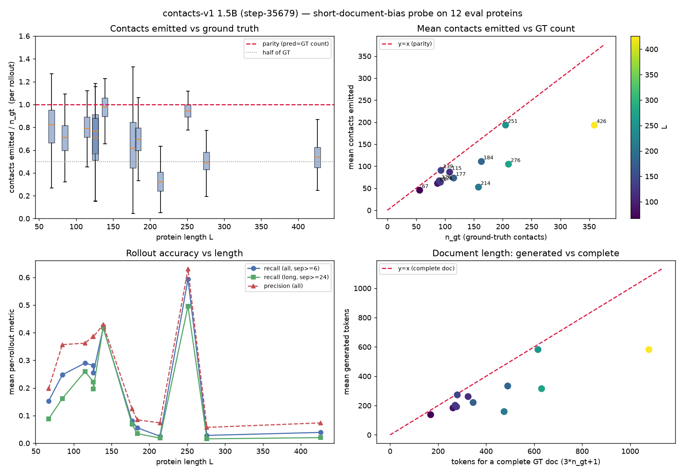

# exp142 — short-document / under-generation bias in contacts-v1 rollouts

Issue: [#142](https://github.com/Open-Athena/MarinFold/issues/142) · Kind: evals ·
[](https://colab.research.google.com/github/Open-Athena/MarinFold/blob/main/notebooks/short_document_bias.ipynb) interactive notebook ([`notebooks/short_document_bias.ipynb`](../../notebooks/short_document_bias.ipynb))

## Question

Does the current best contacts-v1 model — the exp75 ([#75](https://github.com/Open-Athena/MarinFold/issues/75)) E8 1.5B,
`prot-exp75-cv1-1_5b-e8-lr1e-3-wd0p2-v1-bc3084` **step-35679** (eval loss 2.7566) —
have a bias toward generating **very short rollout documents that assert far fewer
contacts than the ground truth**, and does it worsen with length?

## Hypothesis (preregistered prior)

The model *strongly* under-generates: it emits very short contact sections with
*way* fewer `<contact>` statements than the structure has, capping recall
regardless of inference tricks.

## Approach

- **12 length-stratified eval proteins** (L = 67 → 426; denovo_pdb / foldbench100 /
  cameo_hard / casp_fm), each with ≥ 8 resolved GT contacts, drawn from the exp89
  ([#89](https://github.com/Open-Athena/MarinFold/issues/89)) GT universe.
- **200 resampled rollouts / protein** from step-35679 with the settled exp82
  ([#82](https://github.com/Open-Athena/MarinFold/issues/82)) *rollout + resample*
  recipe (temperature 1.0, top-p 0.95, top-k 50; a fresh contacts-v1 document
  realization per rollout).
- **Generous token budget** `max_new = min(8192 − prefix, 6·L + 128)` so the cap
  never binds — a short document can only come from the model emitting `<end>`.
  Every rollout records `finished` to prove truncation is not the cause. (The fullest
  eval GT doc needs ~4.2·L contact tokens; `6·L+128` leaves comfortable headroom.)
- **GT contact definition** is identical to exp89 `compute_metrics.true_matrix` +
  `resolved_pairs`: degree ≥ 0.001, sep ≥ 6, both endpoints resolved. `n_gt` is the
  resolved-restricted count (what the eval credits).

Harness is the exp98 ([#98](https://github.com/Open-Athena/MarinFold/issues/98)) /
exp102 ([#102](https://github.com/Open-Athena/MarinFold/issues/102)) local-GPU HF
rollout worker, trimmed for this question (no `output_logits`; larger budget/batch;
tracks `finished`, raw `<contact>` count, and `n_pred`).

## Results



Per-protein numbers are in [`summary.csv`](summary.csv). Headline:

- **Pooled `pred/gt` = 0.70** (median 0.71, p10–p90 0.36–1.00) over 2,400 rollouts.
- **`finished` = 100%** everywhere; **duplication ratio = 1.00** (no repeated
  contacts) → documents are *complete and non-redundant*, just shorter than GT.
- **23.5%** of rollouts emit < ½ the GT contact count.
- `corr(pred/gt, L) = −0.44`; `corr(pred/gt, recall) = +0.84`.

### Findings

1. **Under-generation is real but mild-to-moderate on average — not "way fewer."**
   ~0.70× the GT count; most proteins 0.64–0.97. Not truncation, not repetition.
2. **Strong specifically at the hard/long end:** 8cih (L=214) 0.33×, T1042 (L=276)
   0.50×, 8bfy (L=426) 0.54×.
3. **It is a *symptom* of uncertainty, not a decoding pathology.** `corr(pred/gt,
   recall)=+0.84`: when the model knows the fold it emits near-complete documents
   *with* good accuracy (6reo L=251: 0.94×, recall 0.59); when lost it emits a short
   document **and** the few contacts it does emit are mostly wrong (precision
   ~0.06–0.07). It is not withholding *correct* contacts.
4. **Secondary bias:** emitted contacts modestly under-represent long-range (sep≥24)
   vs GT.

**Interpretation.** The short-document effect caps recall (pred/gt=0.5 ⇒ recall ≤ 0.5)
but forcing longer documents would mainly add *wrong* contacts where it under-generates.
Not the lever — consistent with exp82 (better inference narrows, does not close the gap;
needs a stronger model).

**Caveats.** n = 12, one selection seed; temperature 1.0 only. `n_gt` is
resolved-restricted, so for the 3 partially-resolved foldbench/casp targets true
`pred/gt` is slightly higher than shown.

## Reproduce

```bash
uv sync
# On a CUDA 12.2 driver the lock resolves a cu13 torch that won't run; override:
#   uv pip install torch==2.5.1 --index-url https://download.pytorch.org/whl/cu121

# 1. targets from the exp89 GT universe + exp74/exp78 manifests (paths are local
#    checkouts; the durable source is the published exp89 gt_universe.jsonl).
uv run python select_eval_targets.py --n 12 --min-gt 8 --seed 7 --out data/eval/targets.parquet
# 2. resampled prompt realizations (needs marinfold).
uv run python gen_prompts.py --targets data/eval/targets.parquet -k 200 --out data/eval/prompts
# 3. rollouts (auto-stages step-35679 from the open-athena bucket if --model missing).
uv run python gen_rollouts_worker_eval.py \
    --model data/model --targets data/eval/targets.parquet --prompts data/eval/prompts \
    --out data/eval/runs/probe --n-rollouts 200
# 4. table + pooled stats + figure.
uv run python analyze_short_bias.py --run data/eval/runs/probe \
    --targets data/eval/targets.parquet --out-prefix plots/short_bias
```

Full run: ~470 s wall on an RTX A5000 (torch cu121, transformers 4.57).
