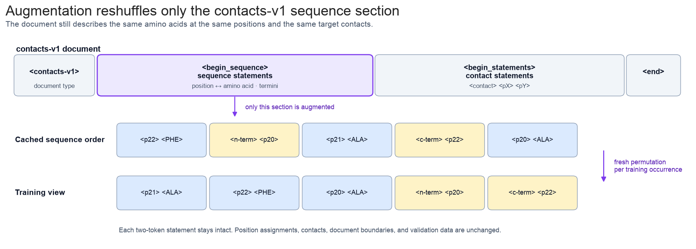
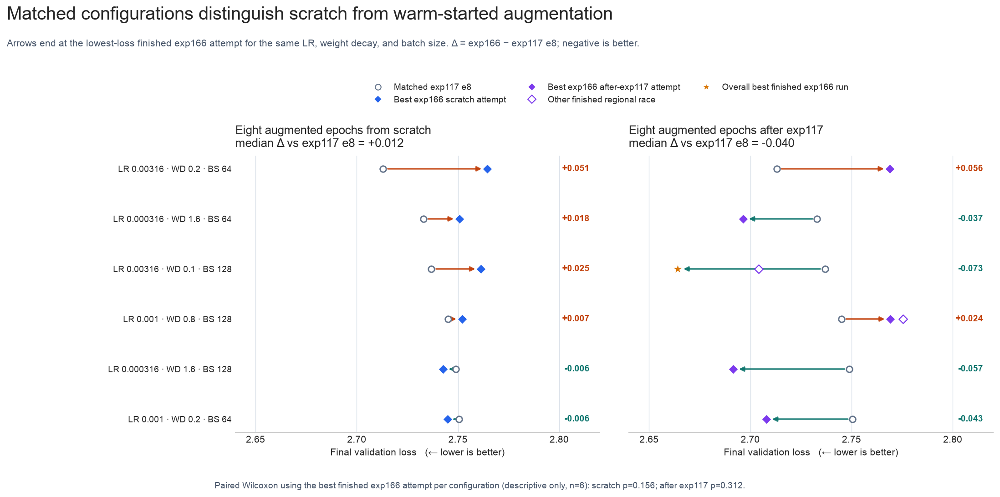
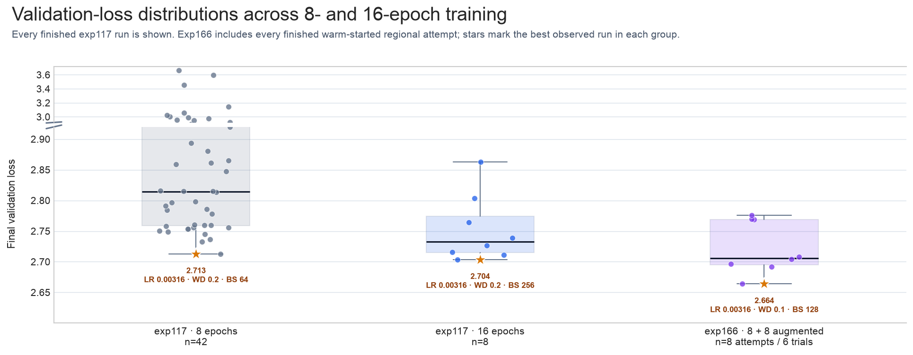
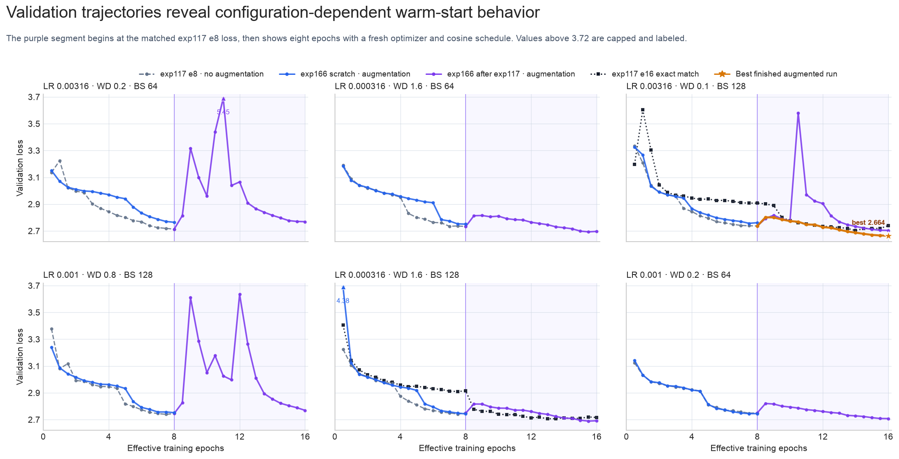

---
marinfold_experiment:
  issue: 154
  title: 'exp: run contacts-v1 parameter scaling sweep'
  kind: models
  branch: eac/exp154-cv1-scaling
---

# exp: run contacts-v1 parameter scaling sweep

**Issue:** [#154](https://github.com/Open-Athena/MarinFold/issues/154) · **Kind:** `models` · **Branch:** `eac/exp154-cv1-scaling`

## Question

How does contacts-v1 validation loss vary across the model scale, training
duration, learning rate, weight decay, and batch-size sweeps in #75, #117, and
#146? For #166, does training-time amino-acid statement augmentation help the
best 1.5B eight-epoch configurations when training from scratch or when adding
eight epochs to their matching exp117 checkpoints?

## Hypothesis

The combined sweep data should support useful local hyperparameter guidance for
the 1.5B model without claiming extrapolation beyond the tested settings.
Resampling the order of sequence statements may be more useful after an exp117
warm start than during training from random initialization.

## Approach

Fetch finished runs from the latest sweep subversion in each source experiment.
Plot every completed run's validation loss against its configured training
epochs. For partial dependence, restrict the data to 1.5B models, collapse
duplicate hyperparameter cells to their minimum loss, exclude the five cells
whose final training and validation losses both exceed a robust z-score of 2.5,
and fit a Matérn-5/2 Gaussian process on ordinal epochs, weight decay, learning
rate, and batch size. The plotted divergence mask is the mask applied to the GP
training rows.

### Exp166 augmentation comparison

Exp166 reruns six selected exp117 configurations for eight epochs with
training-only amino-acid augmentation. The scratch arm starts from random
weights. The warm-start arm loads only the matching exp117 model weights and
starts a fresh optimizer, cosine schedule, data order, and step count. It is
therefore an eight-epoch warm-start ablation rather than a literal continuation
of the exp117 optimizer state.

The augmentation re-permutes intact two-token amino-acid and terminus statements
inside each training document's sequence section. Position assignments,
contacts, document boundaries, and validation data do not change.

W&B metadata comes from tags and config rather than run-name parsing. All exp166
results use `eval/tokenized/contacts-v1-val/loss`. Region is an execution detail
in the sweep design, while the `trial_id` tag identifies a logical trial. Fourteen
regional attempts finished for twelve logical trials; the earliest finished
attempt per `trial_id` is the canonical result, and both alternate finishes are
retained in the plot data. Every exp166 configuration has an exact exp117
eight-epoch match. Matched arrows use the lowest-loss finished exp166 attempt
for each logical trial and show other regional finishes as open markers. Exact
sixteen-epoch matches are too sparse for the paired plot; the separate
distribution view compares all finished exp117 eight- and sixteen-epoch runs
with all finished warm-started exp166 attempts.

## Results

[Figure data](data/validation_loss_vs_epochs.csv)

### Exp166 amino-acid augmentation

[Figure data](data/exp166_augmentation_schematic.csv)

[Figure data](data/exp166_final_comparisons.csv)

[Figure data](data/exp166_epoch_distributions.csv)

[Figure data](data/exp166_validation_trajectories.csv)

Across the six exact eight-epoch matches, augmented scratch training improves
two configurations and worsens four. Its median validation-loss change is
`+0.012` (higher is worse). Warm-started augmented training improves four and
worsens two, with a median change of `-0.040` relative to the source exp117
eight-epoch checkpoints. These comparisons use the best finished exp166 attempt
for each configuration. Exact paired Wilcoxon tests are descriptive only at
this sample size (`p=0.156` and `p=0.312`, respectively).

Across all finished 1.5B runs, the best observed losses are `2.713` after eight
exp117 epochs, `2.704` after sixteen exp117 epochs, and `2.664` after eight
exp117 epochs plus eight warm-started augmented epochs. The distribution view
uses all finished runs in each group, including all eight regional warm-start
attempts, and highlights each group winner. The `2.664` result is an alternate
regional finish and the selected endpoint for its matched arrow because it is
the lowest-loss finished attempt for that trial.

The validation trajectories expose substantial restart instability for some
warm-started configurations. The most aggressive LR point briefly reaches
`5.45` validation loss before recovering, while both `3.16e-4` points remain
stable. The best finished augmented run is highlighted throughout its
trajectory. The two extra finished regional races differ from their canonical
counterparts by `0.040` and `0.006` loss, which is large enough to discourage
fine-grained ranking of close results.

## Conclusion

The original plots summarize the completed scaling runs and the local 1.5B GP
fit. The exp166 comparison does not show a consistent benefit from augmentation
when training from scratch. Warm-started augmented training is more promising,
but the effect depends on hyperparameters and is entangled with optimizer and
schedule restart. The `3.16e-4` continuation paths are the most stable starting
point for a more controlled augmentation ablation.
