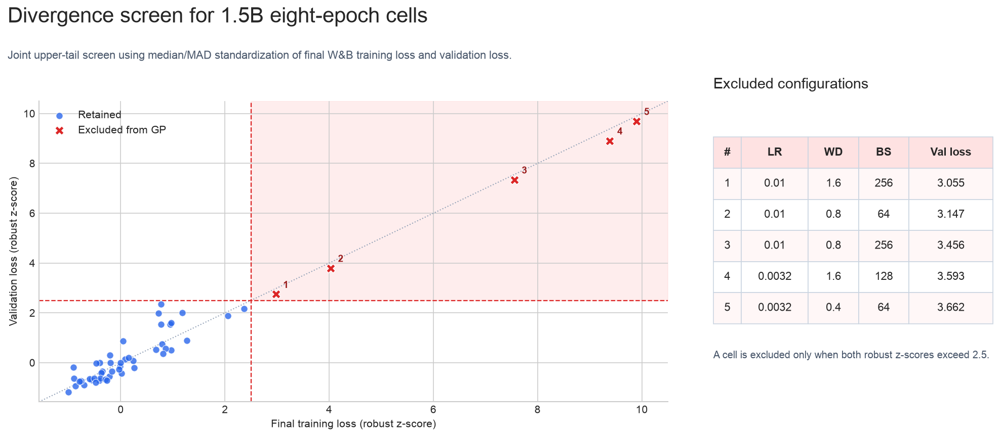

---
marinfold_experiment:
  issue: 154
  title: 'exp: run contacts-v1 parameter scaling sweep'
  kind: models
  branch: eac/exp154-cv1-scaling
---

# exp: run contacts-v1 parameter scaling sweep

**Issue:** [#154](https://github.com/Open-Athena/MarinFold/issues/154) · **Kind:** `models` · **Branch:** `eac/exp154-cv1-scaling`

## Question

How does held-out contacts-v1 validation loss scale with model size and
training compute across the sweeps in [#75](https://github.com/Open-Athena/MarinFold/issues/75),
[#117](https://github.com/Open-Athena/MarinFold/issues/117), and
[#146](https://github.com/Open-Athena/MarinFold/issues/146)?

## Hypothesis

Normalizing the sweep metadata will expose a coherent scaling trend across
parameter count, tokens, and epochs while retaining LR, weight decay, and
batch size as potential confounders.

## Approach

1. Fetch runs tagged `exp75`, `exp117`, and `exp146` from the
   `eric-czech/marin` W&B project.
2. Keep only finished sweep cells with either
   `eval/tokenized/contacts-v1-val/loss` or the older
   `eval/contacts-v1-val/loss` key.
3. Normalize parameters, tokens, and epochs from tags. Read weight decay,
   learning rate, and global batch size from `optimizer.weight_decay`,
   `optimizer.learning_rate`, and `trainer.train_batch_size` in the W&B run
   config. When corresponding tags are present, require them to agree exactly
   with the config values.
4. Normalize `sweep=v1` and `sweep_subversion=N`, then retain only the latest
   subversion independently within each issue.
5. Save the source tags and a provenance column for every normalized
   hyperparameter so inconsistencies remain auditable.
6. Plot validation loss against epochs for every run. Use color for model size,
   marker shape for source issue, and a ring for the best run within each
   `(model size, epochs)` group. Every figure is saved as SVG, 150 dpi PNG, and
   a plot-only CSV.
7. For the 1.5B analysis, collapse repeated hyperparameter cells to their
   minimum observed loss. Screen convergence using both final W&B training loss
   and validation loss, normalized robustly within epoch. Retain flagged cells
   as divergence evidence but exclude them from the conditional converged-loss
   models. Compare an in-sample additive ordinal OLS baseline, a constrained
   regularized linear response surface, and a Gaussian process benchmark. The
   regularized models use five-fold out-of-fold (OOF) predictions.

Run:

```bash
uv run python fetch_wandb.py
```

The output is `data/wandb_runs.csv`.

## Success criteria

The committed CSV contains every finished run from the latest subversion of
each source sweep, has no missing requested hyperparameters, records which
validation-loss key was used, and can be regenerated with one command.

## Results

The initial fetch on 2026-07-31 produced 129 finished runs from the latest
subversion of each sweep:

| issue | normalized subversion | runs | parameters | loss key |
|---|---:|---:|---:|---|
| #75 | 1 (`sweep=v1`) | 63 | 1,471,369,216 | `eval/contacts-v1-val/loss` |
| #117 | 2 | 50 | 1,471,371,264 | `eval/tokenized/contacts-v1-val/loss` |
| #146 | 1 | 16 | 3,003,164,160 | `eval/tokenized/contacts-v1-val/loss` |

All 129 rows have parameters, tokens, epochs, weight decay, learning rate,
batch size, and validation loss. The source is committed as
[`data/wandb_runs.csv`](data/wandb_runs.csv).


Each dot is a finished run. Rings identify the lowest validation loss within
each model-size/epoch group; color denotes model size and marker shape denotes
the source issue. The y-axis ends at 3.2; higher-loss runs remain visible at the
upper boundary with small upward carets. The exact plotted rows are in
[`data/validation_loss_vs_epochs.csv`](data/validation_loss_vs_epochs.csv), with
SVG and 150 dpi PNG outputs under `plots/`.

### 1.5B modeling scope and unique-record rule

The modeling analysis is limited to 1.5B runs. The source contains 113 such
runs and 110 unique hyperparameter cells. Because model size is fixed, the row
key is:

```text
(epochs, weight_decay, learning_rate, batch_size)
```

Three keys occur twice, each once in #75 and once in #117:

| epochs | learning rate | weight decay | batch size | retained loss | other loss |
|---:|---:|---:|---:|---:|---:|
| 8 | 1e-3 | 0.1 | 128 | 2.822944 | 2.919425 |
| 8 | 1e-3 | 0.2 | 128 | 2.755503 | 2.756602 |
| 8 | 1e-3 | 0.4 | 128 | 2.760388 | 2.772849 |

The minimum validation loss is retained for each repeated key. This treats the
cell as the experimental unit and avoids giving replicated settings extra
weight. `data/model_fit_vs_actual.csv` retains `source_run_count`, both source
run IDs, both issue IDs, and an explicit `record_key`, so the resolution remains
auditable without a separate supporting table.

### Divergence screen

High validation loss alone is not enough to call a run divergent: one-epoch
runs should have higher loss, and a genuinely poor hyperparameter setting is
still part of the response surface. The screen therefore uses two distinct
outcomes from each run:

1. final W&B `train/loss`; and
2. contacts-v1 validation loss.

For each outcome and epoch, compute the one-sided modified z score
`(value - median) / (1.4826 × MAD)`. A cell is flagged only when **both** scores
exceed 2.5. Requiring agreement between training and validation makes the rule
more conservative than thresholding either loss alone and avoids using the
eventual regression residual to decide which rows that regression may see.



Five of the 110 unique cells are flagged, matching the lower end of the
anticipated 5–15 range. All are 8-epoch #117 runs:

| learning rate | weight decay | batch size | validation loss | final train loss |
|---:|---:|---:|---:|---:|
| 3.1623e-3 | 0.4 | 64 | 3.661646 | 3.696117 |
| 3.1623e-3 | 1.6 | 128 | 3.593348 | 3.650111 |
| 1e-2 | 0.8 | 256 | 3.456444 | 3.486187 |
| 1e-2 | 0.8 | 64 | 3.146665 | 3.170807 |
| 1e-2 | 1.6 | 256 | 3.055087 | 3.076660 |

Inspection of their sampled W&B histories also found large gradient-norm
spikes, supporting an optimization-instability interpretation. A threshold of
3.0 flags four cells and 2.0 flags eight; refitting at both alternatives leaves
the model ordering and qualitative recommendations unchanged.

The five runs are **not deleted**. They remain in
[`data/model_fit_vs_actual.csv`](data/model_fit_vs_actual.csv) and
[`data/divergence_screen.csv`](data/divergence_screen.csv) with their scores,
rule, W&B identifiers, and `is_divergent_outlier=true`. They are excluded only
from models of loss conditional on convergence, and no recommendation may
select them. Operationally, they establish that the high-LR/high-WD corner is
unsafe rather than merely high loss.

### Models

The simple baseline is ordinary least squares on ordinal grades for epochs,
weight decay, learning rate, and batch size. Epoch grade is `log2(epochs)`;
the other grades are the ranks of their actually configured values. It is shown
in sample, as requested.

The selected interpretable model is linear in its coefficients. On standardized
log2 inputs it contains epoch fixed effects, linear and quadratic LR/weight-decay
terms, an LR × weight-decay interaction, epoch × LR and epoch × weight-decay
interactions, and batch-size indicators. Its LR/weight-decay quadratic form is
constrained positive semidefinite, preventing saddle and downhill-edge
behavior. Both epoch interactions are constrained non-positive; in particular,
the marginal penalty for weight decay can decline with more epochs, allowing
the fitted optimum to move toward higher weight decay. Ridge strength is
selected inside each OOF training fold.

The benchmark Gaussian process uses standardized log2 inputs and a Matérn-5/2
kernel. It is more flexible and less directly interpretable.


| model | evaluation | R² | RMSE | MAE |
|---|---|---:|---:|---:|
| additive ordinal OLS | in-sample | 0.800 | 0.056 | 0.040 |
| convex linear surface | nested 5-fold OOF | 0.816 | 0.053 | 0.037 |
| Gaussian process | 5-fold OOF | **0.884** | **0.042** | **0.027** |

The five unstable cells accounted for most of the apparent lack of fit in the
first analysis. Conditional on convergence, even the additive baseline is
strong, while the GPR is clearly the best predictor of absolute loss. The
convex surface remains accurate enough for interpretable decision support but
should no longer be described as matching the GPR on overall predictive fit.


The coefficient plot separates the very simple ordinal baseline from the
selected constrained surface. The latter's coefficients act on standardized
log2 inputs, so they describe direction and relative shape rather than changes
on the raw hyperparameter scales.

### Hyperparameter selection


The full converged-data fits select the following among combinations that were
actually run. Regret is the selected run's observed loss minus the best observed
loss at that epoch.

| epochs | observed best LR / WD / BS | convex surface LR / WD / BS (regret) | GPR LR / WD / BS (regret) |
|---:|---|---|---|
| 1 | 7e-4 / 0.05 / 128 | 7e-4 / 0.02 / 128 (+0.039) | 3.5e-4 / 0.1 / 128 (+0.020) |
| 2 | 7e-4 / 0.8 / 128 | 7e-4 / 0.2 / 128 (+0.026) | 7e-4 / 1.2 / 128 (+0.004) |
| 4 | 1e-3 / 0.05 / 128 | 1e-3 / 0.2 / 128 (+0.010) | 1e-3 / 0.2 / 128 (+0.010) |
| 8 | 3.1623e-3 / 0.2 / 64 | 1e-3 / 1.6 / 128 (+0.043) | 3.1623e-4 / 1.6 / 64 (+0.020) |
| 16 | 3.1623e-3 / 0.2 / 256 | 1e-3 / 1.6 / 128 (+0.023) | 3.1623e-3 / 0.2 / 128 (+0.008) |

These full-fit regrets are descriptive and optimistic, particularly for the
near-interpolating GPR. A more honest selection check treats every `(fold,
epoch)` held-out subset as a small candidate set (25 sets total):

| model | mean regret | median regret | maximum regret | exact choices |
|---|---:|---:|---:|---:|
| convex linear surface | 0.01458 | 0.000 | **0.0670** | 14 / 25 |
| Gaussian process | **0.01453** | 0.000 | 0.1474 | 14 / 25 |

Despite the GPR's better point predictions, the two models are effectively tied
on mean held-out selection regret and exact-choice count. The linear surface's
worst held-out choice is less than half as costly. It therefore remains a
reasonable primary **decision/explanation** model, with the GPR retained for
loss prediction and as a nonlinear sensitivity check.

For an already-tested epoch, the raw observed best remains the first choice:
there is no benefit to overriding a directly observed winner with a smoothed
estimate. The models are useful for identifying a conservative neighborhood and
for checking whether a winner is supported by a broader trend. At 8 and 16
epochs the data support two competitive regimes: relatively high LR with low WD
(the raw winners) and lower LR with high WD (the smoothed models). Combining
high LR with high WD is the observed divergence region. Targeted repeats should
compare the two safe regimes rather than filling in that unstable corner. The
exact plot data and both models' selected run IDs are in
[`data/hyperparameter_guidance.csv`](data/hyperparameter_guidance.csv).

## Conclusion

Five of 110 unique 1.5B hyperparameter cells show joint training/validation
divergence. Keeping them as an explicit unsafe outcome while excluding them from
the converged-loss regression produces a much more coherent response surface.
The GPR is the best model of absolute converged loss. The constrained linear
surface is still sufficiently accurate, substantially easier to interpret, and
essentially tied with the GPR on held-out hyperparameter-selection regret, so it
is the preferred explanatory and decision model.

The raw best combinations are still the recommended settings at the five
tested epoch counts. For new repeats, avoid the observed high-LR/high-WD
divergence corner. At 8 and 16 epochs, compare the raw high-LR/low-WD winner
against the lower-LR/high-WD regime preferred by the smoothed models; that is
the unresolved scientific choice with the greatest practical value.
