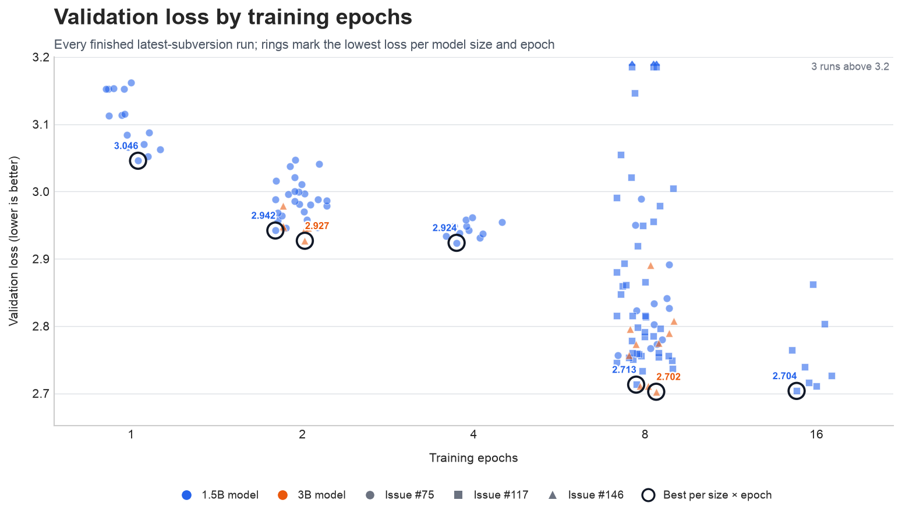

---
marinfold_experiment:
  issue: 154
  title: 'exp: run contacts-v1 parameter scaling sweep'
  kind: models
  branch: eac/exp154-cv1-scaling
---

# exp: run contacts-v1 parameter scaling sweep

**Issue:** [#154](https://github.com/Open-Athena/MarinFold/issues/154) · **Kind:** `models` · **Branch:** `eac/exp154-cv1-scaling`

## Question

How does held-out contacts-v1 validation loss scale with model size and
training compute across the sweeps in [#75](https://github.com/Open-Athena/MarinFold/issues/75),
[#117](https://github.com/Open-Athena/MarinFold/issues/117), and
[#146](https://github.com/Open-Athena/MarinFold/issues/146)?

## Hypothesis

Normalizing the sweep metadata will expose a coherent scaling trend across
parameter count, tokens, and epochs while retaining LR, weight decay, and
batch size as potential confounders.

## Approach

1. Fetch runs tagged `exp75`, `exp117`, and `exp146` from the
   `eric-czech/marin` W&B project.
2. Keep only finished sweep cells with either
   `eval/tokenized/contacts-v1-val/loss` or the older
   `eval/contacts-v1-val/loss` key.
3. Normalize parameters, tokens, and epochs from tags. Read weight decay,
   learning rate, and global batch size from `optimizer.weight_decay`,
   `optimizer.learning_rate`, and `trainer.train_batch_size` in the W&B run
   config. When corresponding tags are present, require them to agree exactly
   with the config values.
4. Normalize `sweep=v1` and `sweep_subversion=N`, then retain only the latest
   subversion independently within each issue.
5. Save the source tags and a provenance column for every normalized
   hyperparameter so inconsistencies remain auditable.
6. Plot validation loss against epochs for every run. Use color for model size,
   marker shape for source issue, and a ring for the best run within each
   `(model size, epochs)` group. Every figure is saved as SVG, 150 dpi PNG, and
   a plot-only CSV.

Run:

```bash
uv run python fetch_wandb.py
```

The output is `data/wandb_runs.csv`.

## Success criteria

The committed CSV contains every finished run from the latest subversion of
each source sweep, has no missing requested hyperparameters, records which
validation-loss key was used, and can be regenerated with one command.

## Results

The initial fetch on 2026-07-31 produced 129 finished runs from the latest
subversion of each sweep:

| issue | normalized subversion | runs | parameters | loss key |
|---|---:|---:|---:|---|
| #75 | 1 (`sweep=v1`) | 63 | 1,471,369,216 | `eval/contacts-v1-val/loss` |
| #117 | 2 | 50 | 1,471,371,264 | `eval/tokenized/contacts-v1-val/loss` |
| #146 | 1 | 16 | 3,003,164,160 | `eval/tokenized/contacts-v1-val/loss` |

All 129 rows have parameters, tokens, epochs, weight decay, learning rate,
batch size, and validation loss. The source is committed as
[`data/wandb_runs.csv`](data/wandb_runs.csv).



Each dot is a finished run. Rings identify the lowest validation loss within
each model-size/epoch group; color denotes model size and marker shape denotes
the source issue. The y-axis ends at 3.2; higher-loss runs remain visible at the
upper boundary with small upward carets. The exact plotted rows are in
[`data/validation_loss_vs_epochs.csv`](data/validation_loss_vs_epochs.csv), with
SVG and 150 dpi PNG outputs under `plots/`.

## Conclusion

The source sweep data is normalized and ready for scaling analysis. No scaling
conclusion is drawn yet.
