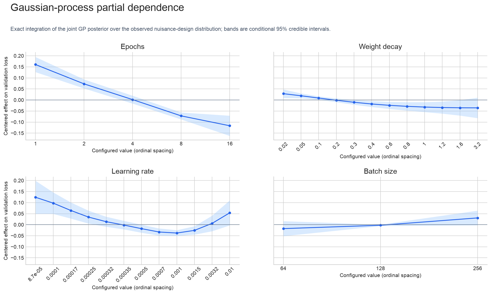

---
marinfold_experiment:
  issue: 154
  title: 'exp: run contacts-v1 parameter scaling sweep'
  kind: models
  branch: eac/exp154-cv1-scaling
---

# exp: run contacts-v1 parameter scaling sweep

**Issue:** [#154](https://github.com/Open-Athena/MarinFold/issues/154) · **Kind:** `models` · **Branch:** `eac/exp154-cv1-scaling`

## Question

How does contacts-v1 validation loss vary across the model scale, training
duration, learning rate, weight decay, and batch-size sweeps in #75, #117, and
#146?

## Hypothesis

The combined sweep data should support useful local hyperparameter guidance for
the 1.5B model without claiming extrapolation beyond the tested settings.

## Approach

Fetch finished runs from the latest sweep subversion in each source experiment.
Plot every completed run's validation loss against its configured training
epochs. For partial dependence, restrict the data to 1.5B models, collapse
duplicate hyperparameter cells to their minimum loss, exclude the five cells
whose final training and validation losses both exceed a robust z-score of 2.5,
and fit a Matérn-5/2 Gaussian process on ordinal epochs, weight decay, learning
rate, and batch size. The plotted divergence mask is the mask applied to the GP
training rows.

## Results

[Figure data](data/validation_loss_vs_epochs.csv)

## Conclusion

The validation-loss plot summarizes the completed scaling runs. Five 1.5B
eight-epoch cells are jointly extreme in final training and validation loss and
are excluded from GP fitting. The Gaussian-process partial-dependence bands come
from exact integration of the joint GP posterior over the remaining observed
nuisance-design distribution.
