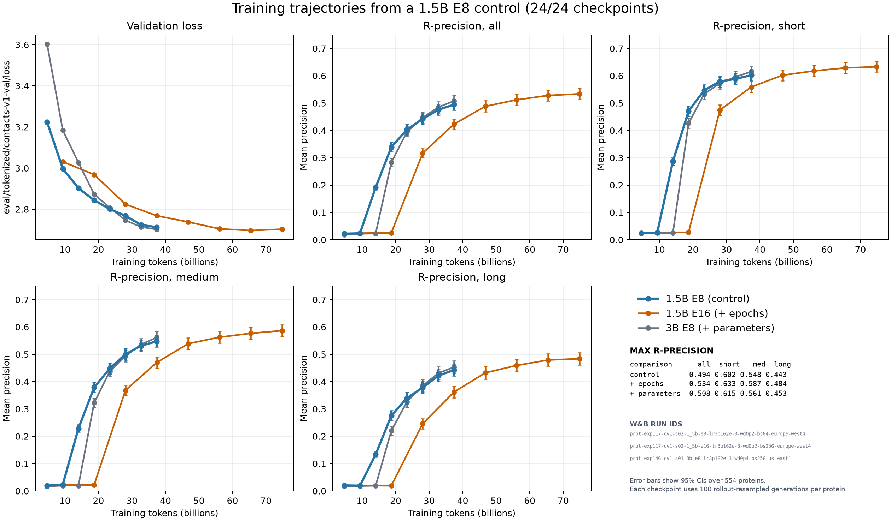
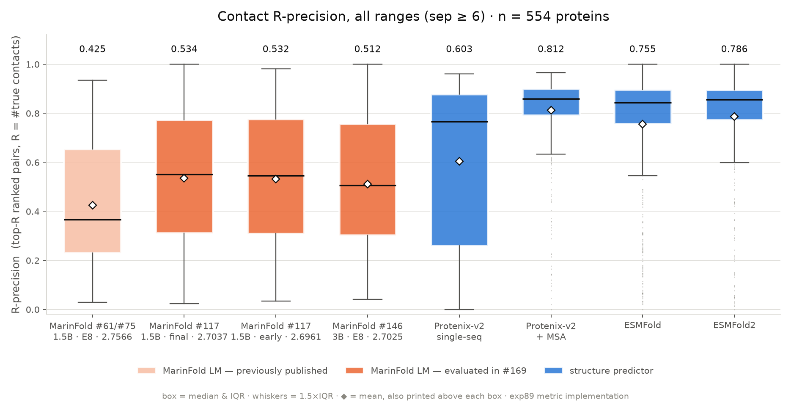
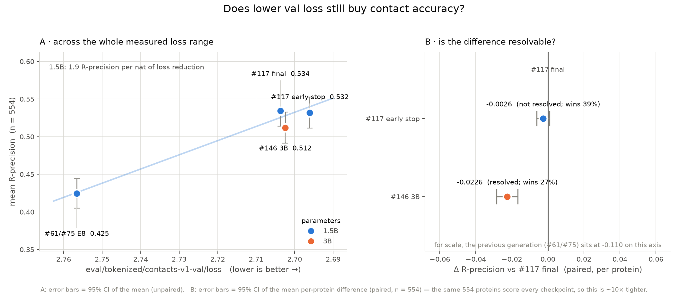

---
marinfold_experiment:
  issue: 169
  title: 'exp: evaluate selected checkpoints from #117 and #146'
  kind: evals
  branch: claude/marinfold-issue-169-evals-be31d1
---

# exp: evaluate selected checkpoints from #117 and #146

**Issue:** [#169](https://github.com/Open-Athena/MarinFold/issues/169) · **Kind:** `evals` · **Branch:** `claude/marinfold-issue-169-evals-be31d1`

## Question

Issue #169 lists three checkpoints — the final and early-stop winners of
[#117](https://github.com/Open-Athena/MarinFold/issues/117) (1.5B) and the
[#146](https://github.com/Open-Athena/MarinFold/issues/146) 3B — all selected by
`eval/tokenized/contacts-v1-val/loss`. **What R-precision does each get on the
554-protein contact eval set?**

The three sit within **0.008 nats** of each other, so the real question underneath
is: *at that separation, is val loss still a useful selection signal for contact
accuracy, or has the loss → accuracy relationship gone flat?* The prior evidence
([exp82](../exp82_evals_contacts_v1_contact_prediction/)) is a steep slope —
2.7566 → 2.7037 (0.053 nats) bought **+0.11** R-precision — but that was measured
across a much wider loss gap, and a 3B model was not in the picture.

## Hypothesis

If the exp82 slope (~2.1 R-precision per nat) held locally, the 0.0076-nat gap
between the #117 final and early-stop checkpoints would be worth ~0.016
R-precision — small but resolvable with a paired test over 554 proteins. The
#146 3B, at 2.7025, should land between the two #117 points if loss alone
predicts accuracy; if extra capacity buys accuracy that the val loss does not
see, it should beat both.

## Background

- **The eval set** ([#74](https://github.com/Open-Athena/MarinFold/issues/74) /
  [#78](https://github.com/Open-Athena/MarinFold/issues/78)) — 554 `(dataset, stem)`
  units over 552 unique proteins (FoldBench-100 + exp65 low-MSA / novel-fold
  candidates). Ground truth is pyconfind side-chain contacts on the experimental
  structure, defined identically to the contacts-v1 training documents.
- **The measurement spec** —
  [exp89](../exp89_evals_contacts_v1_model_on_eval_set/)'s ground-truth universe,
  candidate-pair universe and `compute_metrics.py`. Nothing here re-derives them.
- **The inference recipe** —
  [exp82](../exp82_evals_contacts_v1_contact_prediction/)'s settled
  **rollout + per-rollout document resampling, n = 100, top-k off**. exp82 also
  owns the dispatcher, the worker and the metric code; this experiment supplies
  only the checkpoints, an S3 prefix and a job name, so the numbers land on
  exactly the scale as the published #75 / #117 rows.

## Approach

**1. Get all three checkpoints into one place, in one format.** #169 notes the
checkpoints are region-split (`europe-west4` / `us-east1`) and that the #117
early-stop checkpoint has **no HF export at all**. Rather than run compute in two
regions, everything is mirrored once into CoreWeave object storage next to the
H100s that do the scoring:

| Checkpoint | Source | Path here |
|---|---|---|
| #117 · 1.5B · step 35679 (final) | published `hf/` export, already staged by exp167 | reused as-is |
| #117 · 1.5B · step 33450 (early stop) | **levanter only** → exported here | `export_exp117_early_stop_to_hf.py` |
| #146 · 3B · step 17839 | published `hf/` export | mirrored in-cluster |

**2. Repair what levanter's transformers-5.12 exporter wrote.**
[`prepare_hf_export.py`](prepare_hf_export.py) downgrades `rope_parameters` →
`rope_theta`/`rope_scaling` and replaces the unresolvable
`tokenizer_class: TokenizersBackend`, then recasts fp32 → bf16. Both repairs are
applied *on disk before upload* on purpose, so the eval worker stays
byte-identical to the one that produced the published numbers.

**3. Verify before spending GPU time.**
[`verify_prepared_exports.py`](verify_prepared_exports.py) checks all three share
one vocabulary and one set of special-token ids, that llama3 rope survived the
config downgrade, and that a real contacts-v1 prompt through the real weights
puts its next-token mass on the format-legal tokens.

**4. Score — on whichever accelerator has room.** exp82's worker is the same file
either way; only the fsspec URLs and the launcher differ.

- [`run_eval_cw.sh`](run_eval_cw.sh) → 3 × 12 single-H100 CoreWeave jobs.
- [`dispatch_eval_tpu.py`](dispatch_eval_tpu.py) → 3 × 4 marin `v5p-8` slices.

**This run used the TPU path**, because on 2026-07-28 every amd64 CoreWeave
cluster was fully committed — rno-2a at 512/512 GPUs with 229 more of pending
demand (one job alone holding 328), us-east-02a at 256/256 — and the workstation
A5000 was busy with another job. That the same worker runs on both is what makes
the numbers comparable to the published CoreWeave ones; the only code change it
needed was replacing a hard-coded `s3://` in its resume path with
`fs.unstrip_protocol`, so it is now `score_rollout_worker.py`, not `…_cw.py`.

**The #117 final checkpoint is re-scored rather than reusing exp167's published
matrices** — the headline comparison is a 0.0076-nat difference between two #117
checkpoints, which deserves to be measured in one submission, and reproducing the
published 0.535 is itself the harness check (and here, the cross-accelerator
check as well).

**5. Report paired.** [`summarize_results.py`](summarize_results.py) reports the
aggregate table *and* the per-protein paired differences. At a 0.008-nat
separation an unpaired mean ± SEM cannot resolve anything: the between-protein
spread of R-precision is ~0.3, so the SEM alone (~0.013) is wider than the effect.
The paired SE is an order of magnitude smaller because protein-to-protein variance
cancels.

### Running

```bash
cd experiments/exp169_evals_selected_checkpoints_117_146
uv venv && uv sync

# 1. checkpoints -> bf16, vLLM-loadable  (the levanter export needs marin's venv)
/home/bizon/git/marin/.venv/bin/python export_exp117_early_stop_to_hf.py \
    --checkpoint-dir <local levanter dir>/checkpoints --step 33450 \
    --output-dir ~/exp169_eval/hf_exp117_step33450_fp32
uv run python prepare_hf_export.py --src ~/exp169_eval/hf_exp117_step33450_fp32 \
    --dst ~/exp169_eval/hf_exp117_step33450_bf16

# 2. mirror weights into CoreWeave S3 (in-cluster where a published HF export exists —
#    42 s, vs 48 min over the ~2 MB/s workstation uplink)
set -a; source ~/.config/marin/cw-rno2a.env; set +a
/home/bizon/git/marin-freshiris/.venv/bin/python stage_from_hf_cw.py \
    --repo open-athena/marinfold-exp146 --path <run>/hf/step-17839 \
    --dst s3://marin-us-east-02a/MarinFold/exp169_eval/model_exp146_3b_step17839
uv run python stage_model_s3.py --src ~/exp169_eval/hf_exp117_step33450_bf16 \
    --dst s3://marin-us-east-02a/MarinFold/exp169_eval/model_exp117_step33450

# 3. gate, then score, then fetch + metric + plot
uv run python verify_prepared_exports.py --model ref=<dir> --model new=<dir>
./run_eval_cw.sh
./finalize.sh
```

## Success criteria

- All 554 `(dataset, stem)` units scored for all three checkpoints, no skips.
- The #117 final row reproduces exp82's published **0.535** R-precision (all) —
  the harness check that licenses comparing the new rows to the old ones.
- A paired verdict on #117 early-stop vs final, and on the 3B vs both, with
  confidence intervals that say whether the differences are resolvable at all.

## Results

All **554/554** `(dataset, stem)` units scored for all three checkpoints, no
skips, **0 of 166,200 rollouts truncated** (the `6L+128` token budget never
binds). 12 × `v5p-8`, ~11.5k tok/s per slice for the 1.5B and ~4.0k for the 3B;
~10 min per 1.5B shard, ~25 min per 3B shard.

**Aggregate, mean over 554 proteins** (exp89 metric implementation; the #61/#75
row is exp82's published number, for scale):

| checkpoint | val loss | R (all) | R (long) | P@L (all) | AUC (all) | AUC (long) |
|---|---:|---:|---:|---:|---:|---:|
| #61/#75 · 1.5B · E8 | 2.7566 | 0.4245 | 0.3656 | — | 0.9010 | 0.8740 |
| **#117 · 1.5B · E16 · final (35679)** | 2.7037 | **0.5344** | **0.4815** | **0.4809** | 0.9326 | 0.9147 |
| #117 · 1.5B · E16 · early stop (33450) | **2.6961** | 0.5318 | 0.4806 | 0.4789 | **0.9327** | **0.9148** |
| #146 · 3B · E8 (17839) | 2.7025 | 0.5119 | 0.4589 | 0.4594 | 0.9251 | 0.9051 |

**Paired per-protein differences, R-precision** (same 554 proteins score every
checkpoint; 95% CI on the mean difference):

| A | B | Δ (A−B) | 95% CI | A wins | ties | verdict |
|---|---|---:|---|---:|---:|---|
| #117 final | #117 early | +0.0026 | [−0.0010, +0.0062] | 48.6% | 12.8% | **not resolved** |
| #117 final | #146 3B | +0.0226 | [+0.0167, +0.0284] | 64.3% | 8.3% | resolved |
| #117 early | #146 3B | +0.0199 | [+0.0143, +0.0256] | 61.2% | 10.3% | resolved |

**Harness check.** The #117 final checkpoint reproduces its published number:
**0.5344** here against **0.5350** in exp82 — a gap of 0.0006, well inside the
≤0.006 TPU-vs-CUDA backend agreement exp89 established. AUC 0.9326 vs 0.9318.
So the new rows are on the published scale, and the cross-checkpoint deltas
above are backend-controlled regardless (all three ran on the same stack).

## Training trajectories

The trajectory evaluation scores all eight permanent #146 3B E8 checkpoints,
all eight permanent #117 1.5B E8 BS64 checkpoints, and every second permanent
#117 1.5B E16 checkpoint. The E8 runs cover 4.68B–37.41B tokens; the E16 sample
covers 9.35B–74.82B. Every checkpoint uses the same full 554-protein,
100-rollout evaluation described above.

BS64 gives the new 1.5B run four optimizer updates per BS256 update at the same
token budget. Its E8 schedule also ends earlier than E16, so the curves compare
the complete training configurations rather than isolate batch size.

The BS64 run learns contact prediction first. At 14.03B tokens its all-range
R-precision is 0.1918 while the 3B remains at 0.0231. It leads the 3B through
23.38B tokens, then the 3B passes it and finishes at 0.5077 versus 0.4944 near
37.41B. That paired difference is 0.0133 (95% CI [0.0093, 0.0173]). At the same
token budget, BS64 remains 0.0712 ahead of E16. Continued E16 training reaches
0.5338 after 74.82B tokens.

The trajectory does not support 3B overfitting. Its epoch-7 to epoch-8 loss
falls from 2.7140 to 2.7025 while all-range R-precision rises by 0.0225 (paired
95% CI [0.0181, 0.0269]); short, medium, and long R-precision also improve. The
three contact-learning transitions occur as validation loss approaches 2.9,
despite different token counts. E16's loss later rises from 2.6970 to 2.7037
while R-precision still gains 0.0058, so small late loss differences do not
reliably order contact accuracy.



The implementation, execution notes, and artifact layout are documented in
[`trajectory/README.md`](trajectory/README.md). The plot-ready table is
[`data/trajectory_checkpoint_metrics.csv`](data/trajectory_checkpoint_metrics.csv),
adjacent-checkpoint paired changes are in
[`data/trajectory_paired_changes.csv`](data/trajectory_paired_changes.csv), and
matched-token paired comparisons are in
[`data/trajectory_matched_token_changes.csv`](data/trajectory_matched_token_changes.csv).
All 265,920 per-protein metric rows are in
[`data/trajectory_metric_rows.csv.gz`](data/trajectory_metric_rows.csv.gz).

## Conclusion

**1. The #117 final checkpoint is the best of the three, and #169's selection
by val loss did not improve on it.** At R-precision 0.534 (all) / 0.482 (long)
it is where the project already stood; the two checkpoints #169 added are equal
to it or worse.

**2. Val-loss early stopping bought nothing here.** The early-stop checkpoint
has **0.0076 lower** val loss and is statistically indistinguishable on contact
accuracy: Δ = +0.0026 in favour of the *final* checkpoint, CI [−0.0010, +0.0062],
win rate 48.6% — a coin flip. The exp82 slope (~1.9 R-precision per nat, measured
across the 0.053-nat #75→#117 gap) predicted **+0.016** for the early-stop
checkpoint. We measure −0.003 ± 0.004. **The loss → accuracy relationship is
steep across training generations and flat inside one run's last 2,000 steps** —
so `contacts-v1-val/loss` is not a useful tie-breaker at the 0.01-nat scale, and
picking an early-stop checkpoint on it is not worth the bookkeeping.

**3. Matched val loss does not mean matched contact accuracy across model
sizes.** The #146 3B has a val loss 0.0012 *better* than the #117 final and is
**0.023 worse** on R-precision — a resolvable gap (CI [+0.017, +0.028]), the
largest effect in this comparison, and one the loss column points the wrong way
on. It holds on long-range R (−0.023) and on AUC (−0.008) too. Caveat: this
3B differs from the 1.5B in epochs (8 vs 16) and weight decay (0.4 vs 0.2) as
well as size, so this says *this 3B checkpoint at this loss* is worse, not that
scale hurts. Either way the practical consequence is the same — **do not compare
`contacts-v1-val/loss` across model sizes to pick a contact predictor**, and a
3B is not yet buying anything over the tuned 1.5B.

**4. Nothing here changes where MarinFold sits against structure predictors.**
0.534 vs Protenix-v2 single-seq 0.603, ESMFold 0.755, ESMFold2 0.786,
Protenix-MSA 0.812. AUC remains the strong column (0.933, second only to
Protenix-MSA's 0.941) — the model ranks the whole contact map well and still
fails to concentrate confidence into the top R pairs.

**Follow-ups.** (a) The 3B result is worth isolating: an epoch- and wd-matched
3B vs 1.5B would separate scale from schedule. (b) If a future sweep needs a
checkpoint-selection signal at sub-0.01-nat resolution, it has to be a contact
metric, not val loss — the eval here costs ~10 min on 4 TPU slices per
checkpoint, so it is affordable as a selection criterion.

**Artifacts.** Score matrices (554 `[L,L]` per checkpoint), per-protein metrics,
the paired table and both figures are published to
`hf://buckets/open-athena/MarinFold/data/contacts-v1-model-eval-exp169/`,
alongside the ground truth and prompts exactly as scored — see
[`data/BUCKET_README.md`](data/BUCKET_README.md).




