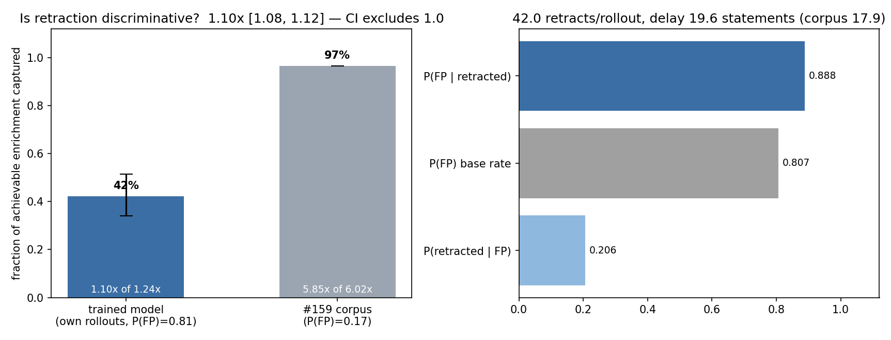
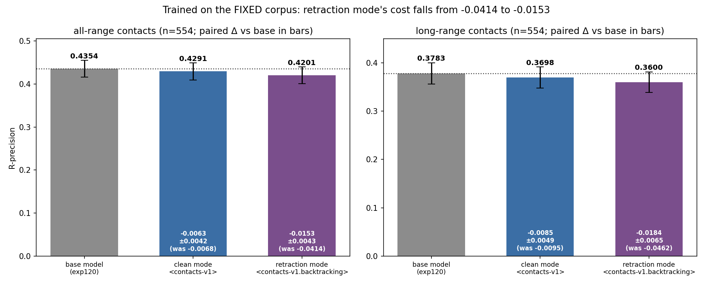

---
marinfold_experiment:
  issue: 175
  title: "exp: condition contacts-v1 on retraction mode with a <contacts-v1.backtracking> doc-type token"
  kind: models
  branch: exp175-backtracking-mode-token
---

# exp: condition contacts-v1 on retraction mode with a `<contacts-v1.backtracking>` doc-type token

**Issue:** [#175](https://github.com/Open-Athena/MarinFold/issues/175) · **Kind:** `models` · **Branch:** `exp175-backtracking-mode-token` (stacked on #160)

## Question

Does telling the model **at token 0** whether it may retract recover the contact-prediction accuracy [#160](https://github.com/Open-Athena/MarinFold/issues/160) lost, and sharpen the retraction behaviour it learned?

## Hypothesis

**#160 trained on a mixture the model could not condition on.** Both halves of its corpus begin with the identical prefix:

```
backtracking : <contacts-v1> <begin_sequence> <p714>  ...
clean        : <contacts-v1> <begin_sequence> <p1021> ...
```

Worse, **208,363 of the 1,023,997 backtracking documents (20.4%) contain no `<retract>` at all** — measured on the published corpus, not estimated — so a fifth of that half is indistinguishable from clean data in prefix *and* body.

A model in that position must marginalise over "may I take this back later?" at every step. Three of #160's measurements are what that predicts:

| #160 measurement | value |
|---|---|
| rollouts containing a retraction | 43.0% — it *samples* the mode rather than being told |
| enrichment vs its ceiling | 1.134x of 1.26x = **52% of headroom** |
| **emission-quality regression** (retraction ignored) | **−0.0251** R-precision |

That last number is the interesting one, and it is the one this experiment attacks. In retraction mode the optimal emission policy is *more speculative* — you can walk a guess back. With no marker that speculativeness has nowhere to live but the shared policy, so it leaks into clean generation. **A model that cannot tell which mode it is in has to hedge in both.**

## Approach

### Format (`marinfold`, done)

`<contacts-v1.backtracking>` — a variant doc type swapped in as token 0 by `GenerationConfig(backtracking=True)`, following the existing `<contacts-v1.sequence_only>` idiom. Not a new statement type: the statements, sections and fold are untouched.

**Append-only, verified against the tokenizer #160 actually trained under:** 0 id mismatches across all 3,849 pre-existing tokens, `<retract>` still 3848, `<crop>` still 3847, new token at 3849.

⚠️ **The hazard worth naming.** Both coordinate supersets build their inherited block by *filtering* contacts-v1's trailing tokens out and re-appending them at the end. A new trailing token that is not added to that filter lands **inside** the inherited block and shoves the whole xyz/crop block up by one id — silently breaking every published crops/ccoord checkpoint and desyncing the two formats' xyz ids. Both filters are extended, and a test pins `<xyz-000>` at 2847.

### Corpus (`mark_corpus.py`, done)

A **one-token rewrite** of #160's mix — no regeneration. The marker is determined by which generator produced the document, so it is a string operation, not a re-run of the model-in-the-loop job. Runs on a marin CPU pod (GCS → GCS, zero workstation uplink).

**Marked by generator, not by content.** The silent 20.4% keep the marker: they teach the honest conditional *"in this mode, sometimes nothing needs retracting"*. Marking by content would instead teach *"this token implies a retraction follows"* — a different target that destroys the token's use as a mode switch, because at inference we want to enter the mode without promising the model it must use it.

Verified on the output: clean half byte-identical, backtracking tails byte-identical, `live_contacts` unchanged on every sampled document, 0 UNKs and identical token counts under the 3850-token tokenizer.

| | |
|---|---|
| documents | 2,047,994 |
| marked `<contacts-v1.backtracking>` | 1,023,997 |
| ...of which contain no `<retract>` | **208,363 (20.4%)** |
| clean `<contacts-v1>` | 1,023,997 |

### Training

**#160's recipe, unchanged** — full fine-tune of exp120, lr 3e-4, wd 0.2, bs 128, seq 8192, 1-epoch cosine, v5p-32 — so the *only* difference between the two runs is the marker. `dispatch_train.py` and `resize_init_vocab.py` are reused from #160 rather than copied: both are fully parameterized, and reusing them is what makes "same recipe" checkable rather than asserted.

Needs one more +1 offline vocab resize (2845 → 3850) of the **same exp120 base** #160 started from; levanter does not resize on warm start.

### Eval

With a marker the retraction on/off comparison becomes a **generation-time** experiment on one checkpoint, which is strictly more informative than #160's readout-time ablation:

- prompt `<contacts-v1>` → clean mode
- prompt `<contacts-v1.backtracking>` → retraction mode

on the same 554-protein set, through #160's `score_backtracking_worker.py` and exp89 `compute_metrics`.

## Success criteria

- **Format is append-only** — asserted in tests, not assumed. ✅
- **The marker is obeyed** — retract rate under the backtracking marker clearly above the rate under `<contacts-v1>` (#160's unconditioned model: 43%).
- **Emission cost recovered** — clean-mode R-precision closes most of #160's −0.0251 against `exp120-base`.
- **Retraction sharpens** — enrichment beyond #160's 52% of headroom.
- **Headline** — best-of-both-modes beats `exp120-base` on the #89 benchmark at matched token compute. The bar #160 did not clear.

### Artifacts

```
corpus v1 (published corpus, sorted flush)
    gs://marin-us-east5/protein-structure/MarinFold/exp175_backtracking_mode/corpus
corpus v2 (regenerated, shuffled flush)   <- the one that counts
    gs://marin-us-central1/protein-structure/MarinFold/exp175_backtracking_mode/corpus_v2/train
resized init   .../exp175_backtracking_mode/init/exp120-step-1005-vocab3850
runs           .../exp175_backtracking_mode/runs/exp175-cv1-1_5b-mode50{,-v2}-lr3e-4-e1-cos
eval           s3://marin-us-east-02a/.../exp175_backtracking_mode/eval/scores{,_v2}
published      hf://buckets/open-athena/MarinFold/checkpoints/
                   exp175-cv1-1_5b-mode50-v2-lr3e-4-e1-cos/hf/step-2070
```

The two runs live under separate prefixes on purpose. The eval worker resumes by
*skipping outputs that already exist*, and `--name-suffix` renames the job
without renaming its output path — so pointing a second run at the first's
prefix produces `[worker] nothing to do` and a set of scores that silently
belong to the wrong model. That happened once here and was caught only because
the numbers matched v1 to four decimal places and the backtracking arm reported
0.0% retractions.

`corpus_v2` sits in `us-central1` rather than `us-east5` because `us-east5-a`'s
v5p-32 pool had scaled to zero (`No workers match constraints`). marin's TPU
path hard-fails on cross-region GCS reads, so the 9.0 GiB corpus was mirrored
server-side — 64 seconds — and the run relaunched in the region that had
capacity.

The resize ran **locally**, not on a pod: it is a CPU-only job that asks for a
TPU purely for host RAM, and on 2026-07-29 every v5p-8 in both zones reported
`Insufficient TPUs (need 4, available 0)`. This workstation has 503 GB, so it
took 37 min end-to-end (`resized embeddings (2845, 2048) -> (3850, 2048)`,
`verified rows 0..2844 are bit-identical`) rather than waiting on a queue.
Two smaller notes for anyone re-running it: `resize_init_vocab.py` imports
`marinfold_models` transitively, so it needs `PYTHONPATH=<repo>/models` outside
a pod; and exp160's documented `--cpu 200` no longer fits — the v5p VMs now
advertise 176 allocatable cores.

### Warm-start check (and a correction to #160)

#160's launch comment claimed the run "opens at ~2.45-2.50", below exp120's
converged 2.7213, and treated that as proof the warm start was intact. **That
was wrong** — 2.45 was the loss at step ~586. Pulled from W&B, exp160 actually
opened at **3.87** and did not cross 2.7213 until **step 35**.

The right test is the *rate*, not the opening value: a scrambled vocab or a
wrong rope starts near `log(3850) = 8.3` and needs thousands of steps, so
crossing a converged model's loss in ~35 steps is only reachable from a warm
start that kept its embeddings' meaning.

By that test exp175 is healthy — it converges onto its control within 50 steps:

| step | 2 | 10 | 20 | 30 | 40 | 50 |
|---|---|---|---|---|---|---|
| exp160 | 3.866 | 3.480 | 3.007 | 2.784 | 2.671 | 2.632 |
| exp175 | 5.212 | 3.768 | 3.191 | 2.894 | 2.717 | 2.657 |
| **delta** | +1.345 | +0.288 | +0.183 | +0.110 | +0.046 | **+0.025** |

The residual +1.3 nats at step 2 decaying to +0.025 by step 50 is what one
brand-new untrained token at the head of half the documents should cost: it is
unpredictable exactly once per marked document, and the model learns it almost
immediately.

## Results

**Two runs, not one.** The first (`v1`, step 2058) trained on the mix built from
the corpus as published. Partway through its eval we found the corpus bug
described in [#159](https://github.com/Open-Athena/MarinFold/issues/159) — the
ground-truth flush emitted contacts in `sorted()` order, and that block is ~80%
of a backtracking document. The corpus was regenerated with a shuffled flush and
the run repeated identically (`v2`, step 2070). **`v2` is the result; `v1` is
reported beside it because the difference between them is the cleanest
measurement of what the artifact was costing.**

Everything below: 554 proteins, 100 rollouts each, exp82 rollout+vote inference,
exp89 `compute_metrics`, paired per-protein against `exp120-base`.

### 1. The marker is obeyed — completely

| prompt token 0 | retracts / rollout | proteins with ≥1 retraction |
|---|---|---|
| `<contacts-v1>` | **0.12** | 0.9% |
| `<contacts-v1.backtracking>` | **41.96** | 98.2% |

One checkpoint, two behaviours, selected by a single token. #160's unconditioned
model *sampled* the mode instead (43% of rollouts). ✅

The 0.9% leak is new in `v2` (`v1` was exactly 0) and comes to 5 proteins out of
554; it is not zero, so it is reported rather than rounded away.

### 2. The artifact is gone from the model

Sortedness of contact-emission order — 0.5 is a random order, and the published
corpus scored 0.869:

| arm | trained on published corpus (`v1`) | trained on shuffled corpus (`v2`) |
|---|---|---|
| retraction mode | **0.833** (7.8% of rollouts fully sorted) | **0.499** (0.0%) |
| clean mode | 0.501 | 0.500 |

Measured on the models' own rollouts by `measure_sortedness.py`. The fix worked
end-to-end: corpus → training → generation. ✅

### 3. Retraction is discriminative — and the artifact was not why

| | `v1` | `v2` |
|---|---|---|
| P(FP \| retracted) | 0.894 | 0.888 |
| P(FP) base rate | 0.813 | 0.807 |
| enrichment | 1.098 [1.08, 1.12] | 1.101 [1.08, 1.12] |
| ceiling (`1/P(FP)`) | 1.23 | 1.24 |
| **fraction of headroom** | **43%** | **42%** |
| retraction delay, mean / median | 18.7 / 9 | 19.6 / 9 |
| recovery rate | 0.235 | 0.265 |

The CI excludes 1.0: when this model retracts, it is retracting something that
really is wrong, more often than chance. But it captures **42% of the available
discrimination against the corpus's 97%**, and removing the ordering artifact
moved that number by one point. Whatever limits the transfer, it is not the
sort. ✳️ (#160's 52% is on a slightly different footing — a readout-time
ablation of an unconditioned model, not a generation-time mode.)



### 4. Accuracy: the marker recovers most of the cost, the fixed corpus recovers most of the rest — and it still does not win

R-precision, paired Δ vs `exp120-base` (95% CI):

| arm | all-range | long-range |
|---|---|---|
| `exp120-base` | 0.4354 | 0.3783 |
| **clean mode** | 0.4291 (**−0.0063** ±0.0042) | 0.3698 (−0.0085 ±0.0049) |
| **retraction mode** | 0.4201 (**−0.0153** ±0.0043) | 0.3600 (−0.0184 ±0.0065) |



Against the two things this experiment was testing:

**The hypothesis held.** #160's unconditioned model scored −0.0199 (all-range).
Its two modes, once separated, sit on either side of that: −0.0063 and −0.0153.
An unconditioned model behaving as a mixture of the two is the prediction, and
−0.0199 against a midpoint of −0.0108 is roughly what it looks like. Telling the
model which mode it is in recovers **two thirds** of the clean-mode regression.

**The artifact cost accuracy, not discrimination.** Retraction mode went from
−0.0414 to −0.0153 across the corpus fix — 63% of the gap — while clean mode
(−0.0068 → −0.0063) and enrichment (43% → 42%) did not move at all. That is a
clean dissociation: the sorted sweep was collapsing the 100-rollout vote, which
is an *accuracy* mechanism, and it was never what taught the model to retract.

**And the headline criterion is still not met.** −0.0063 is small but its CI
excludes zero, and retraction mode costs 51% more tokens (757 vs 502 per
rollout, 4.6% truncated) to land further behind. On the #89 benchmark, at any
token budget, the honest summary is that **the best arm of this experiment is
the model we started from.** ❌

### Success criteria, scored

| | |
|---|---|
| Format is append-only | ✅ 0 id mismatches on 3,849 pre-existing tokens |
| The marker is obeyed | ✅ 0.12 vs 41.96 retracts/rollout, one checkpoint |
| Emission cost recovered | ✅ mostly — −0.0199 → −0.0063, but not to zero |
| Retraction sharpens | ❌ 42% of headroom, flat vs #160 |
| **Beats `exp120-base` on #89** | ❌ **−0.0063 clean, −0.0153 retraction** |

## Conclusion

**The mode marker does its job. Retraction still does not pay for itself.**

Three things are now settled that were not before:

1. **Conditioning works and is cheap.** One appended token, no format change, no
   regeneration — and the model splits cleanly into two behaviours it previously
   had to average over. Two thirds of #160's emission regression was the cost of
   *not* being able to tell the modes apart.

2. **The corpus artifact is fixed and it mattered — for accuracy.** Removing the
   sorted flush cut retraction mode's cost by 63% and drove the model's own
   sortedness to the null. It changed the discrimination measurement by one
   point.

3. **The 42% transfer gap is the real open problem.** It survived a mode marker
   *and* a corpus regeneration. The corpus retracts 97% of its available
   false positives because a ground-truth flush tells it which ones they are;
   the model gets 42% from the same traces. The gap is between "can be shown
   the answer" and "can tell from the inside", and nothing tried so far touches
   it.

What that implies for the series: the next lever is not another supervised
corpus variant. A model that discriminates at 42% of ceiling is being asked to
learn a judgement from demonstrations of an oracle's judgement, and imitation
gets it partway. The natural continuation is to let the model retract and score
the *outcome* — the RFT setup #98 already has data for — rather than to keep
demonstrating retractions it cannot yet justify.

The trained model is published and there is a notebook for poking at it:
[`notebooks/retraction_mode_playground.ipynb`](../../notebooks/retraction_mode_playground.ipynb).

```
hf://buckets/open-athena/MarinFold/checkpoints/
    exp175-cv1-1_5b-mode50-v2-lr3e-4-e1-cos/hf/step-2070
```

**It is not the accuracy frontier and should not be used as one** — for contact
prediction, `exp120-base` beats it in both modes, and [#166](https://github.com/Open-Athena/MarinFold/issues/166)
beats that. It is published because a checkpoint whose behaviour you can switch
with one token is a useful object to have.
