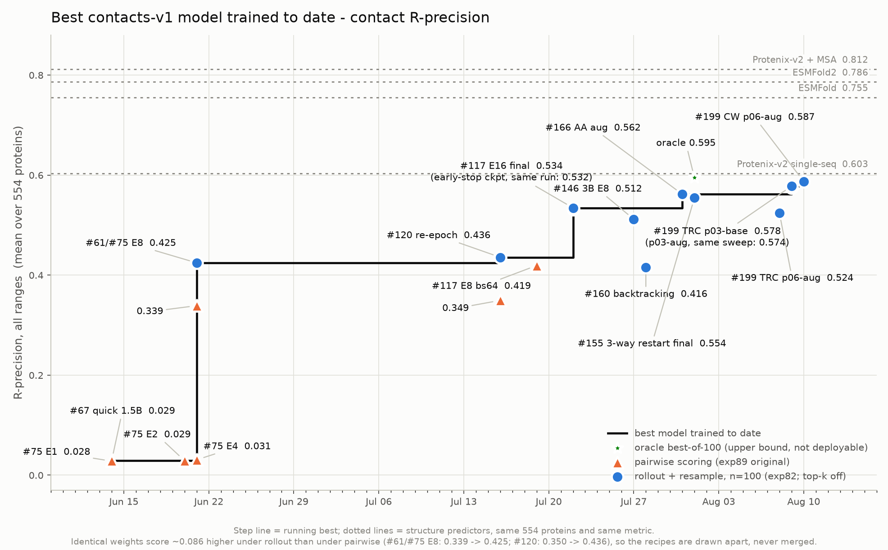
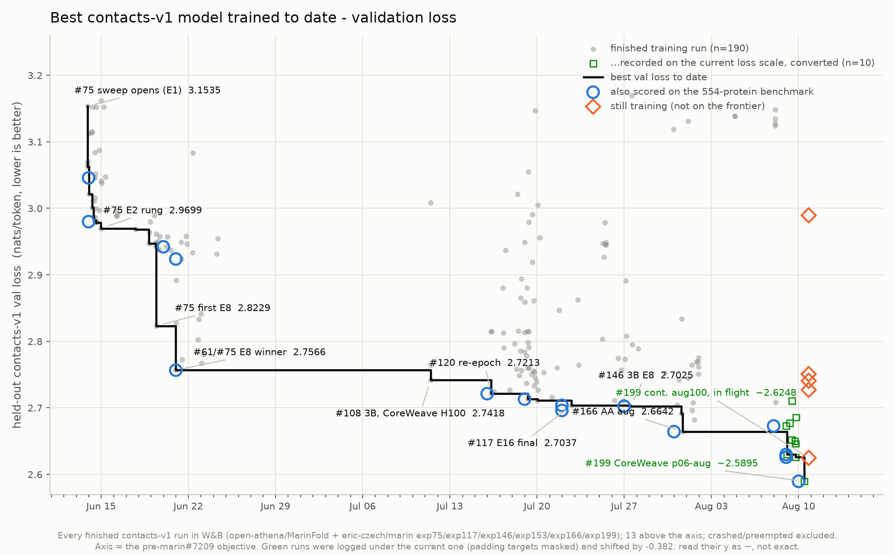
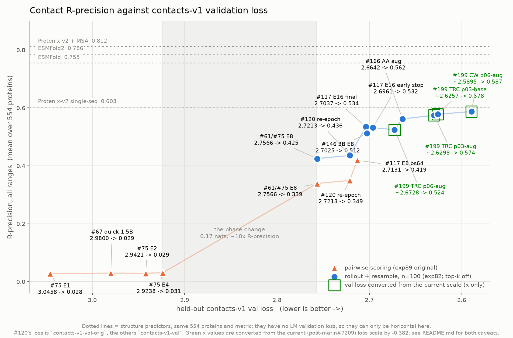
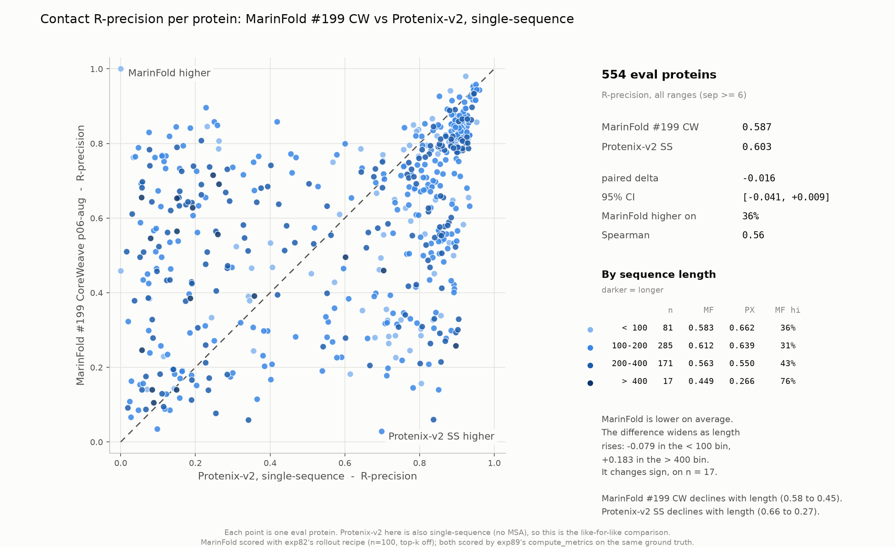
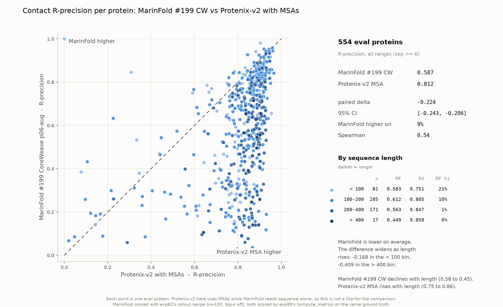

---
marinfold_experiment:
  issue: 180
  title: 'exp: track contacts-v1 R-precision and validation loss over time'
  kind: evals
  branch: claude/rprecision-validation-loss-plots-750306
---

# exp: track contacts-v1 R-precision and validation loss over time

**Issue:** [#180](https://github.com/Open-Athena/MarinFold/issues/180) · **Kind:** `evals` · **Branch:** `claude/rprecision-validation-loss-plots-750306`

## Question

How good was the best contacts-v1 model we had on any given date — on contact
R-precision and on held-out validation loss — and how tightly do those two
track each other?

Every number exists somewhere already (#67, #75, #82, #89, #108, #117, #120,
#146, #155, #160, #166, #169, #199/#204), but they are scattered across issue comments, per-experiment
CSVs and two W&B projects, with three different inference recipes and two
different validation-loss objectives mixed in. This
experiment collects them into one dataset and three standing figures, and keeps
them refreshable as new models land.

## Hypothesis

Not a hypothesis-testing experiment — it is a **standing tracker**. The two
things it is built to make visible, both of which prior issues assert
piecemeal:

1. Progress on contact accuracy has come almost entirely from the **base
   model**, not from inference or post-training.
2. Validation loss predicts contact accuracy **across training generations**
   and stops predicting it **within a generation** (#169's finding), so the
   loss frontier and the accuracy frontier are not the same curve.

## Background

- **#89** — the fixed 554-protein contact benchmark: ground-truth universe,
  candidate pairs, and `compute_metrics.py`. Every R-precision number here is
  computed by that implementation.
- **#82** — settled the best LM-only inference: n=100 rollouts + per-rollout
  document resampling + pairwise tie-break. **#142** then removed the
  `top_k=50` that was truncating rollouts.
- **#75 / #117 / #146 / #166 / #199** — Eric's LR/WD/epoch sweeps, the
  AA-augmentation run and the AFDB+ESM-Atlas mixture sweep
  (`eric-czech/marin`, tags `exp75`, `exp117`, `exp146`, `exp153`, `exp166`,
  `exp199`); **#67 / #85 / #108 / #120 / #137 /
  #150 / #155** — MarinFold-side runs (`open-athena/MarinFold`).
- **#204** — scored #199's final checkpoints on the same 554 proteins and the
  same rollout path as #190, *and* re-ran the #117 control three times
  alongside them. Those replicates are the first noise estimate this tracker
  has for the rollout recipe (span 0.0023), which is what makes several of the
  small gaps here readable as ties rather than results.
- **marin #7209** — changed the packed-LM objective to mask padding targets and
  so moved the validation-loss scale by ~0.38 nats partway through this
  tracker's history. See "The two loss scales".
- **#169** — showed val loss is not a usable checkpoint selector at the
  0.01-nat scale, and that matched loss does not mean matched accuracy across
  model sizes. This experiment is the longitudinal version of its panel A.
- **#74 / #78** — the structure-predictor baselines drawn as reference lines.

## Approach

Two tables and three figures, all code in the experiment dir.

- `build_dataset.py` — pulls every finished contacts-v1 training run reporting
  `eval/contacts-v1-val/loss` from both W&B projects, and carries the
  hand-curated benchmark scores (one source citation per row, since these live
  in issue comments and per-experiment CSVs rather than in W&B). Recomputes the
  structure-predictor lines from exp89's per-protein table.
- `plot_progress.py` — three figures: R-precision vs date, val loss vs date,
  R-precision vs val loss. Both date figures draw a running-best staircase;
  both R-precision figures carry the structure predictors as dotted reference
  lines.
- `plot_vs_protenix.py` — two more figures: one pinned contacts-v1 checkpoint
  against Protenix-v2 single-sequence and against Protenix-v2 with MSAs, one
  point per eval protein. The frontier figures say how far along we are; these
  say *which proteins* the number is made of.

**Two methodological traps, both handled explicitly:**

1. *Inference recipe.* The same weights score **~0.086 higher** under exp82's
   rollout recipe than under exp89's original pairwise scorer (#61/#75 E8:
   0.339 → 0.425; #120: 0.350 → 0.436). The figures keep the recipes visually
   separate rather than pooling them.
2. *Loss scale.* The same weights score **~0.38 nats lower** under the
   pre-marin#7209 objective than under the current one. Losses are declared
   per source, converted onto one axis, and converted points are drawn in their
   own ink with a `~`.

Metric throughout: **R-precision, all ranges (seq-sep ≥ 6), mean over the 554
proteins**. Date = when the training run finished, not when it was evaluated.

## Success criteria

- One dataset with a traceable source for every plotted number, and three
  figures that a future reader can regenerate with two commands.
- A documented refresh procedure so the tracker stays current as #146, #150,
  #153, #155 and the post-training line produce new checkpoints.


## How to update this experiment

This is a **standing tracker**. Refreshing it after new models land is two
commands plus, usually, one hand-edit. Do it whenever a training sweep finishes
or a checkpoint gets scored on the #89 benchmark.

### 1. New training runs only (no new contact scores)

The validation-loss figure reads W&B directly, so it needs nothing but a
refresh:

```bash
cd experiments/exp180_evals_contacts_v1_progress_over_time
uv run python build_dataset.py     # re-pull W&B, rebuild the tables
uv run python plot_progress.py     # redraw the three figures
uv run python build_summary.py     # optional: refresh plots/summary.pdf
```

`build_dataset.py` re-pulls every run from `open-athena/MarinFold` and from
`eric-czech/marin` tags `exp75` / `exp117` / `exp146` / `exp153` / `exp166` /
`exp199`.
The loss figure's source footnote is generated from those columns, so it can
never disagree with what was actually pulled. **If a new
sweep lands under a new tag, add it to `WANDB_SOURCES` first** — otherwise its
runs are silently absent and the loss frontier will look flat when it isn't.

Three other things to check when adding a source:

- **The loss scale.** Every `WANDB_SOURCES` entry declares `HISTORICAL` or
  `CURRENT`, and getting it wrong moves the whole source by 0.38 nats — far
  more than any real result on this figure. It is a property of the **pinned
  marin version**, not of the run date: MarinFold-side runs launched in August
  2026 still pin a June `marin-core` and are still `HISTORICAL`. Read it off
  the run itself rather than guessing:

  ```python
  api.runs(project, filters={"display_name": name})[0].file("requirements.txt")
  ```

  `marin-core` at or after the version carrying marin#7209 (merged
  2026-07-16) → `CURRENT`; before it → `HISTORICAL`. If a single sweep spans
  the boundary, split it into two entries or the frontier will get a step that
  is pure bookkeeping.

- **The loss key.** `LOSS_KEYS` is tried in order. A run that logs the
  contacts-v1 val loss under some new component name will be dropped, not
  crash. Grep the new runs' summary keys before trusting the output.
- **`EXCLUDE_SUBSTRINGS`.** Smoke tests, batch-calibration probes and profiling
  runs are excluded by name. A new naming convention may need a new substring —
  or, worse, may accidentally match an existing one and drop a real run. The
  printed run count (`wrote data/val_loss_runs.csv (N runs)`) is the cheap
  sanity check.

### 2. A checkpoint gets scored on the 554-protein benchmark

Add a row to `RPRECISION_ROWS` in `build_dataset.py` and re-run both commands.
Each row needs:

| field | what |
|---|---|
| `label` | short identifier used on the figures, e.g. `#146 3B E8` — keep it under ~20 chars |
| `model` | the W&B run name + step, so the row is traceable |
| `date` | when the **training run finished** (W&B `heartbeatAt`), not when it was scored |
| `params`, `issue` | 1.5B / 3B / …; the issue number the checkpoint came from |
| `val_loss`, `val_loss_key` | `None` / `""` if the model's vocab makes its loss non-comparable (see #160) |
| `val_loss_scale` | omit for `HISTORICAL`; set `CURRENT` for anything trained on marin ≥ #7209. `normalise_rows()` then fills `val_loss_raw` and rewrites `val_loss` onto the plotting axis |
| `r_precision` | **R-precision, all ranges**, mean over 554 — the `range=all, cut=R` cell |
| `inference` | `ROLLOUT` or `PAIRWISE` — **never guess this**, see below |
| `source` | the CSV or gist the number came from, precisely enough to re-find |

Then add a label offset for the new point in `RP_LABEL_OFFSET` (and
`S3_OFFSET`) in `plot_progress.py`. Offsets are hand-placed in points; the
figures are dense enough that a new point will collide with something. **Render
and look at the PNGs** — the collision check is visual, there is no test for it.

### 3. Getting the inference recipe right

This is the one thing that will quietly corrupt the figures. The same weights
score **~0.086 higher** under rollout than under pairwise, which is comparable
to two generations of model progress. If a new score is filed under the wrong
recipe it will look like a jump that never happened.

- The **`eval-checkpoint` skill** runs exp89's **pairwise** scorer. Anything
  produced by it is `PAIRWISE`.
- exp82's `score_rollout_*.py` workers and the exp169 dispatcher produce
  `ROLLOUT` (n=100, resampled, top-k off).
- If a score came with `top_k=50` (anything predating #142), it is a **third**
  realisation — record it in `FOOTNOTE_ROWS`, not as a checkpoint.

When in doubt, ask where the score came from rather than inferring it from the
magnitude.

### 4. Keep the caveats honest

`Caveats worth carrying` below is part of the deliverable, not decoration. When
one is resolved — e.g. someone proves `contacts-v1-val-orig` and
`contacts-v1-val` are the same split — delete it and the corresponding figure
footnote. When a new one appears (a new tokenizer, a changed eval set, a
different val split), add it before the figures get quoted elsewhere.

If the **554-protein eval set itself** ever changes, this experiment's whole
y-axis changes with it. That is a rebuild, not a refresh: every historical
number would have to be re-scored, and the honest interim move is to freeze
these figures and start a second set.

### 5. The head-to-head figure pins a specific model

`plot_vs_protenix.py` hard-codes
`MARINFOLD_MODEL = "prot-exp199-cw-cv1-s02-m1-p06-aug-step-145199"`
and reads its per-protein scores from `ROWS_CSV`, currently
`data/exp199_cw_p06_aug_step145199_rows.csv.gz`. It emits
one figure per entry in `BASELINES` (currently Protenix-v2 single-seq and MSA);
`--baseline` restricts it to one.

**When a new model takes the accuracy frontier, re-point it**: set
`MARINFOLD_MODEL` / `MARINFOLD_LABEL` / `MARINFOLD_SHORT`, and point `ROWS_CSV`
at whichever experiment holds the new per-protein rows (the two move together —
the model string is a value *inside* that file). It needs *per-protein*
precision, not a summary — a mean is not enough to draw the scatter, so the
scoring run has to have published its rows CSV.

`ROWS_CSV` used to be a read across experiment directories, so it could not
drift from the published scores. #199 keeps per-protein rows only in the HF
bucket — git holds manifests and summaries — so this is now a **local copy**,
and the drift protection is a hash instead: `ROWS_SHA256` is the
`source_sha256` #199 records for `cw-p06-aug` in its
`contact_eval_pr_comparison_summary.csv`, and `ROWS_URL` re-fetches the file.
If a future frontier model does keep its rows in git, prefer the read.

Adding another baseline is one entry in `BASELINES`. The rows available in
exp89's CSV are `(protenix-v2, single_seq|msa, structure|distogram)`,
`(esmfold, single_seq, structure)` and `(esmfold2, single_seq, structure)`.

**Do not write the commentary block by hand.** `describe()` generates it from
each figure's own numbers precisely because the two current baselines trend in
opposite directions with length — a written-once summary was wrong on one of
them, and would be again for any new baseline.

### 6. Cross-check

`data/rprecision_footnotes.csv` holds measurements that are alternate
realisations of a checkpoint rather than new checkpoints. Nothing in it should
ever appear on a figure; it exists so a number found in an old issue comment
can be identified as "already known, different recipe" instead of being added
as a new point.

## Results

Three figures. All R-precision values are **all ranges (seq-sep ≥ 6), mean over
the 554-protein eval set**, computed by exp89's `compute_metrics.py`.







### Per-protein comparison with Protenix-v2

The frontier figures compress each model to one number. These unroll the same
comparison over the 554 proteins, for the current best model — **#199 CoreWeave
p06-aug** (0.587) — against both Protenix-v2 configurations.

**Single-sequence** — the like-for-like baseline, since MarinFold also reads
sequence alone:



**With MSAs** — not like-for-like, and much the stronger baseline:



| | Protenix-v2 SS | Protenix-v2 + MSA |
|---|---:|---:|
| baseline mean | 0.603 | 0.812 |
| paired difference | **−0.016** | −0.224 |
| 95% CI | **[−0.041, +0.009]** | [−0.243, −0.206] |
| MarinFold higher on | 36% | 8.7% |
| Spearman | 0.56 | 0.54 |

By length (MarinFold is 0.583 / 0.612 / 0.563 / 0.449 across the four bins):

| length | n | Δ vs SS | MF higher | Δ vs MSA | MF higher |
|---|---:|---:|---:|---:|---:|
| < 100 | 81 | −0.079 | 36% | −0.168 | 21% |
| 100–200 | 285 | −0.027 | 31% | −0.194 | 10% |
| 200–400 | 171 | **+0.013** | 43% | −0.285 | 1% |
| > 400 | 17 | **+0.183** | 76% | **−0.409** | 0% |

**The headline moved: the single-sequence gap's confidence interval now crosses
zero.** At #166 the paired difference was −0.041 [−0.065, −0.018] — a real
deficit. At #199 CW it is −0.016 [−0.041, +0.009]. On this benchmark MarinFold
is no longer distinguishable from single-sequence Protenix-v2; it is not ahead
of it either, and "0.587 vs 0.603" is still a mean that favours Protenix.

**The two baselines still trend in opposite directions with length, and that
remains the main thing to take from this pair.** Against single-sequence
Protenix the gap narrows monotonically and changes sign — now in *two* bins,
not one. Against MSA Protenix it widens monotonically, and MarinFold does not
win a single protein above 400 residues.

The reason is visible in the marginals: MarinFold declines with length
(0.58 → 0.45) and so does single-sequence Protenix, only much faster
(0.66 → 0.27) — whereas MSA Protenix *improves* with length (0.75 → 0.86),
presumably because longer chains have deeper, more informative alignments.

So "MarinFold holds up better on long proteins" is a statement about the
single-sequence baseline only. It is a shallower decline, not an absolute
strength: the > 400 bin is where MarinFold is weakest in absolute terms
(0.449), and it is also where the MSA gap is widest. That bin holds **17
proteins** either way, so both readings of it are weak estimates.

The Spearman values are worth noting too — 0.56 against single-sequence, 0.54
against MSA. At #166 these were 0.61 / 0.49, so the two have converged:
MarinFold's notion of which proteins are hard no longer tracks the
single-sequence predictor much better than the MSA-informed one.

**Both figures moved with the model, and the shape did not.** Re-pointed
#117 (0.534) → #166 (0.562) → #199 CW (0.587), every bin has improved at each
step and the single-sequence gap has gone −0.069 → −0.041 → −0.016, but the two
baselines still trend in opposite directions. What has changed twice is where
the sign flips: at #166 only the 17-protein > 400 bin was positive; at #199 CW
the 200–400 bin joins it at +0.013 on 171 proteins. MarinFold now wins the
upper half of the length range against a single-sequence structure predictor
and loses the lower half.

### The accuracy frontier

| date | model | val loss | R-precision (all) | recipe |
|---|---|---:|---:|---|
| 2026-06-14 | #67 quick 1.5B | 2.9800 | 0.029 | pairwise |
| 2026-06-14 | #75 E1 | 3.0458 | 0.028 | pairwise |
| 2026-06-20 | #75 E2 | 2.9421 | 0.029 | pairwise |
| 2026-06-21 | #75 E4 | 2.9238 | 0.031 | pairwise |
| **2026-06-21** | **#61/#75 E8** | **2.7566** | 0.339 / **0.425** | pairwise / rollout |
| **2026-07-16** | **#120 re-epoch** | **2.7213** | 0.350 / **0.436** | pairwise / rollout |
| 2026-07-19 | #117 E8 bs64 | 2.7131 | 0.419 | pairwise |
| 2026-07-22 | #117 E16 early stop | 2.6961 | 0.532 | rollout |
| **2026-07-22** | **#117 E16 final** | **2.7037** | **0.534** | rollout |
| 2026-07-27 | #146 3B E8 | 2.7025 | 0.512 | rollout |
| 2026-07-28 | #160 backtracking | — | 0.416 | rollout |
| **2026-07-31** | **#166 AA aug** (from #117 init) | **2.6642** | **0.562** | rollout |
| 2026-08-01 | #155 3-way restart final (step 74793, run complete) | — | 0.554 | rollout |
| 2026-08-01 | #155 3-way restart final, oracle best-of-100 | — | 0.595 | oracle (not deployable) |
| 2026-08-08 | #199 TRC p06-aug | ~2.6728 | 0.524 | rollout |
| 2026-08-09 | #199 TRC p03-aug | ~2.6298 | 0.574 | rollout |
| **2026-08-09** | **#199 TRC p03-base** | **~2.6257** | **0.578** | rollout |
| **2026-08-10** | **#199 CoreWeave p06-aug** | **~2.5895** | **0.587** | rollout |

Bold = took the accuracy frontier on its date. `~` = the loss was recorded on
the current scale and converted (see below); the R-precision values are all
directly measured. **#155's 3-way restart never took the frontier**: it
finished 08-01 at 0.554, one day after #166 reached 0.562, so it lands 0.008
below a frontier that had already moved.

Structure predictors on the same 554 proteins and the same metric:
Protenix-v2 single-seq **0.603**, ESMFold **0.755**, ESMFold2 **0.786**,
Protenix-v2 + MSA **0.812**.

### The two loss scales

marin **#7209** (merged 2026-07-16) changed the packed-LM objective to mask
positions whose next token is padding. Padding targets are nearly free to
predict, so dropping them raises the mean: **the same checkpoint reads ~0.38
nats lower under the old objective than under the current one.** Eric measured
this directly by re-evaluating four #166 checkpoints under both
([gist](https://gist.github.com/eric-czech/9c40252457790a513eeb62a6a965c049)):
offsets +0.37934 … +0.38511, so `current ≈ historical + 0.38171`.

Everything through #166 is on the historical scale; #199 is the first sweep on
the current one. This tracker plots the **historical** axis — not because it is
better but because 97% of the runs are natively on it, so the approximate
conversion lands on the few rather than the many. Converted points are drawn in
green with a `~`.

The conversion is not free. Its residual across the four measured checkpoints
is 0.0023, and the gist's alternative *line* fit disagrees with its *offset*
fit by ~0.025 nats once you extrapolate a third of a nat below the range it was
fitted on — which is exactly where #199's CoreWeave run sits. For scale, the
#146 → #166 frontier step is 0.038 nats and the #117-early-vs-final gap is
0.008. **So #199's position on the loss axis is a real result at the 0.1-nat
scale and unreadable at the 0.01-nat scale.** Its R-precision carries no such
caveat.

The scale is a property of the pinned marin version, not the run date, and is
not in the W&B config — `build_dataset.py` declares it per source and the
README's refresh section says how to verify it from the run's own
`requirements.txt`.

### The loss frontier

3.15 → 2.98 → **2.7566** (#61/#75 E8, 06-21) → **2.7418** (#108's 3B on
CoreWeave H100s, 07-11) → **2.7213** (#120, 07-16) → 2.7131 → 2.7112 →
**2.7037** (#117 E16 final, 07-22) → **2.7025** (#146 3B, 07-27) →
**2.6642** (#166 AA aug, finished 07-31) → **~2.6298** and **~2.6257**
(#199's two TRC p03 runs, 08-09) → **~2.5895** (#199 CoreWeave p06-aug,
08-10), over 190 finished runs. #155's 3-way
restart reached 2.6819 on 08-01 — below #146 but above #166, so it does not
take this frontier either.

The last three steps are conversions, and the two on 08-09 are 0.004 apart, so
the honest reading of the tail is one step of roughly 0.04–0.07 nats rather
than three resolvable ones. Those two are left unlabelled on the figure for
that reason.

### What the figures show

- **The accuracy frontier moved in four jumps**, all from the base model,
  none from inference or post-training: ~0.03 → **0.425** when #75's
  E8 rung finished (2026-06-21), 0.436 → **0.534** when #117's 16-epoch
  bs256 run finished (2026-07-22), 0.534 → **0.562** when #166's
  AA-augmentation continue-train of #117 finished (2026-07-31), and
  0.562 → **0.587** when #199's AFDB+ESM-Atlas sweep finished (2026-08-09/10).
  Between the first two, five weeks of post-training and inference work moved
  it by +0.011 (#120's re-epoch). (#75's E4 winner, 0.031, landed the same day
  as E8, so the pre-jump frontier reads 0.029 — #67's.)
- **#199 is the largest single-experiment gain since #117, and the first from
  adding data rather than reshaping it.** #166 augmented contacts-v1 with
  amino-acid permutations; #199 trains on AFDB *plus* 71.4B tokens of
  ESM-Atlas. Its best checkpoint is +0.025 over #166 and +0.054 over the #117
  control re-scored in the same batch. It is also the first frontier point
  trained **from scratch on CoreWeave H100s** rather than continued from a
  #117 TPU checkpoint.
- **Within #199, the CoreWeave/TRC gap is not a hardware result.** CW p06-aug
  (0.587) and TRC p06-aug (0.524) share a hyperparameter point and differ by
  0.063, but CW trained from scratch for 145,199 steps on a WSD schedule while
  TRC continued a #117 checkpoint for 72,599 on cosine. Different
  initialisation, schedule and budget: nothing here isolates the platform.
- **#199's p03-base vs p03-aug is a tie, and this is the first time the
  tracker can say that with a measurement.** They differ by 0.0036, and #204's
  four evaluations of one unchanged #117 checkpoint span 0.0023. Every earlier
  "X beat Y by 0.00n" in this experiment was a between-run subtraction with no
  noise estimate at all; now there is one, and it is the same size as the
  smaller differences being quoted.
- **Two data-side results landed a day apart, and only one of them is on the
  frontier.** #166 (AA augmentation on top of #117, 07-31, 0.562) and #155's
  3-way crops+contacts-v1+ESM-Atlas mixture restart (08-01, 0.554) are both
  *data* changes rather than hyperparameter sweeps — the first of their kind
  here — but #166 is 0.008 higher and one day earlier, so #155 never appears
  as a step. They are not alternatives that were run against each other:
  different data, different initialisation, different token budgets, and no
  paired comparison exists. Only the final, finished checkpoint is plotted for
  #155 — two earlier checkpoints from the same run were also scored while it
  was still training (step 60000: R 0.553, step 70000: R 0.556) but are
  intentionally left off the figures now that a settled result exists; see the
  caveats section.
- **#166 is the only frontier point with a within-run control.** #190 re-scored
  #117 alongside it on the same 554 proteins and the same inference path,
  reading 0.5336 against #169's 0.5344 — so its **+0.0282** (95% CI
  0.0226–0.0338, higher on 67% of proteins) is a paired result, not a
  subtraction across two harnesses. Every other gap in the table above is the
  latter.
- **The oracle best-of-100 diagnostic (new, #155 final checkpoint only):**
  scoring each of the 100 sampled rollouts per protein on its own first-R
  precision and taking the max, instead of voting them together, reads
  **0.595** — **+0.041** over the same checkpoint's deployable rollout+vote
  number (0.554). That is real headroom left on the table by the
  aggregation step, not by the base model: the *union* of information across
  100 samples ranks higher than any one of them (that's why voting beats a
  single rollout, per exp82), but picking a *specific* best-performing rollout
  per protein beats the vote too. Both can be true because voting and
  cherry-picking extract different structure from the sample — voting favors
  contacts many rollouts agree on, while the oracle rewards a rollout that
  happens to get the high-value ones right even if it disagrees elsewhere.
  0.595 is a **ceiling that assumes free ground truth** (you cannot know
  which of the 100 rollouts is best without it) — it bounds how much a better
  *selection* method could close the gap to Protenix-v2 single-seq's 0.603,
  not a number the current pipeline can bank without one.
- **Loss and accuracy agree across generations and stop agreeing inside one.**
  The 0.008-nat gap between #117's early-stop and final checkpoints buys
  nothing (paired Δ +0.0026 in the *final*'s favour, CI crosses zero), and
  #146's 3B is 0.0012 *better* on loss and 0.023 *worse* on R-precision.
- **The cross-generation exchange rate is collapsing.** Successive frontier
  steps buy less and less R-precision per nat:

  | step | Δ loss | Δ R-precision | R per nat |
  |---|---:|---:|---:|
  | #75 E8 → #117 E16 | 0.053 | +0.109 | 2.06 |
  | #117 E16 → #166 AA aug | 0.040 | +0.028 | 0.71 |
  | #166 AA aug → #199 CW | ~0.075 | +0.025 | ~0.33 |

  The last row uses a converted loss, so read it as ~0.33 with a range of
  roughly 0.25–0.50 — the conclusion survives the whole range. This is what
  #204's sigmoid fit describes from the other direction: an upper asymptote of
  **0.5955**, which #199 CW is already at 98.6% of. Either the relationship
  saturates near there and loss stops being a useful proxy at all, or the fit
  is extrapolating past its four-point support. This tracker cannot tell those
  apart yet, but the next frontier point will.
- **#108's 3B on CoreWeave held the loss frontier from 2026-07-11 to 07-16 at
  2.7418** and was never contact-scored. Given #146's result — a 3B at matched
  loss under-performing the 1.5B — it is probably not a missed frontier point
  on accuracy, but that is an inference, not a measurement. It is the one real
  gap in the accuracy figure.
- **#85's LR re-heat did not lower loss.** It finished at 2.9801 against #67's
  2.9800. The Week-of-June-22 `UPDATES.md` entry says it "improved eval loss
  somewhat"; the W&B history does not support that (the run's five eval points
  run 2.9825 / 2.9828 / 2.9843 / 2.9820 / 2.9801).
- **#67 never held the loss frontier.** It finished 2026-06-14 15:36 at 2.9800,
  about two hours after `prot-exp75-cv1-1_5b-e2-lr7e-4-wd0p05-v1` reached
  2.9787.
- **The single-sequence Protenix-v2 gap is no longer statistically
  distinguishable from zero** — 0.587 vs 0.603, paired Δ −0.016 with a 95% CI
  of [−0.041, +0.009] over the 554 proteins. Protenix still has the higher
  mean and this is not a claim to have passed it; it is a claim that the
  benchmark can no longer tell them apart. Two months ago the same comparison
  read 0.029 vs 0.603. ESMFold2 (0.786) and MSA Protenix (0.812) remain far
  ahead, and the MSA gap has barely moved.
- **The oracle headroom and the remaining single-seq gap have swapped
  places.** At #166 both were ~0.041. The gap is now 0.016 while the oracle
  diagnostic found +0.041 inside one checkpoint's own rollouts — so, taking
  the diagnostic at face value, better *selection among already-sampled
  rollouts* is now worth more than the entire remaining distance to
  single-sequence Protenix. That comparison crosses two checkpoints (#155's for
  the oracle, #199 CW's for the gap) and should be treated as a rough
  ordering, not an arithmetic one.

## Conclusion

Both success criteria are met: `data/rprecision_checkpoints.csv` carries a
source citation per number, and the figures regenerate from two commands.

The substantive read is that **contact accuracy has come from the base model
and essentially nowhere else**. Four training results account for the entire
frontier; the settled inference recipe is worth a large constant (+0.086) but
was banked once in June and has not moved since; and the post-training line
(#120, #160) has produced +0.011 and −0.020 respectively.

The last two jumps are both *data* changes rather than hyperparameter sweeps or
epoch counts, and they are the two largest since #117:

- **#166** (07-31, 0.562) augmented contacts-v1 with amino-acid permutations —
  +0.028 for a continue-train, with a within-run control (+0.0282 paired
  against its own #117 initialisation).
- **#199** (08-09/10, 0.587) added 71.4B tokens of ESM-Atlas alongside AFDB and
  trained from scratch on CoreWeave — +0.025 over #166, +0.054 over the #117
  control re-scored in the same batch.

**The single-sequence structure-predictor gap has effectively closed.**
0.587 against Protenix-v2's 0.603 is a paired Δ of −0.016 with a CI of
[−0.041, +0.009]: Protenix still has the higher mean, but this benchmark can no
longer separate them. Two months ago the same comparison read 0.029 vs 0.603.
The MSA-informed baseline (0.812) and ESMFold2 (0.786) are untouched by any of
this, and that is where the remaining distance is.

Three things this cannot settle. **#155 and #199 both add ESM-Atlas and were
never run against each other** (0.554 vs 0.587, different data, initialisation
and budget). **Whether AA augmentation composes with the ESM-Atlas mixture** is
still open — #199 ran `base` and `aug` variants and they tied within noise on
p03, which is a hint, not an answer. And **#199's CoreWeave-vs-TRC gap is not a
platform result**: different schedule, initialisation and step count.

The **oracle best-of-100** diagnostic remains a second, orthogonal lever, and
it has grown in relative importance: +0.041 R-precision sits in the *inference*
step even after the settled rollout+vote recipe. That is now larger than the
0.016 still separating the best model from single-sequence Protenix. It is
unreachable without ground truth, but it says better *selection among*
already-sampled rollouts (not more sampling, not a better base model) is worth
investigating — a learned reranker, or a cheap proxy for "is this rollout one
of the good ones."

Validation loss remains a useless *within-generation* proxy and an
increasingly weak *cross-generation* one: successive frontier steps have bought
2.06, 0.71 and ~0.33 R-precision per nat. Since this experiment costs nothing
to keep current and a benchmark run costs ~10 min on 4 TPU slices, #169's
recommendation stands and has got stronger: select checkpoints on the contact
metric, and use the loss frontier only to decide which checkpoints are worth
scoring.

## Method and provenance

### What is being measured

**R-precision, all ranges** — precision at the top *R* ranked residue pairs,
where *R* is that protein's true-contact count (seq-sep ≥ 6), meaned over the
**554-protein eval set** (#74/#78 + #41/#65 curation), scored by exp89's
`compute_metrics.py` against the published exp89 ground-truth universe. This is
the only accuracy number on these plots; long/medium/short-range cuts, AUC and
contacts@L exist in the source CSVs but are not plotted.

**Validation loss** — `eval/contacts-v1-val/loss` (Eric's runs log the same
quantity as `eval/tokenized/contacts-v1-val/loss`), the full held-out
contacts-v1 split: 41,954 documents / 47,821,958 tokens. Reported on the
**historical** (pre-marin#7209) scale throughout; `data/*.csv` carry
`val_loss_raw` and `val_loss_scale` alongside, so the as-logged value is never
lost. See "The two loss scales".

**Date** — when the training run *finished* (W&B `heartbeatAt`), i.e. when the
checkpoint came into existence. Not when it was evaluated; several checkpoints
were scored weeks later.

### The three inference recipes

The same weights score **~0.086 higher** under the settled rollout recipe than
under exp89's original pairwise scorer, on both checkpoints measured under both:

| checkpoint | pairwise | rollout | Δ |
|---|---:|---:|---:|
| #61/#75 E8 | 0.3389 | 0.4245 | +0.0856 |
| #120 re-epoch | 0.3495 | 0.4357 | +0.0862 |

So the figures never merge them — marker shape and colour carry the recipe, and
a checkpoint measured both ways shows both points. Recipes:

- **pairwise** — autoregressive `P(<contact> <pi> <pj>)`, symmetrised. exp89's
  original scorer; still what the `eval-checkpoint` skill runs.
- **rollout** — n=100 sampled rollouts + per-rollout document resampling +
  pairwise tie-break, **top-k off**. Settled in exp82; `top_k=50` was removed
  in #142 (it cost ~0.007–0.012 R-precision by truncating long rollouts). This
  is the only one of the three that is actually **deployable** — the other two
  either require the ground truth being scored against (oracle) or are
  strictly worse (pairwise).
- **oracle_best_of_100** *(new)* — same 100 rollouts as `rollout`, but instead
  of voting them into one `[L,L]` matrix, each rollout is scored on its own
  first-*R* precision (its emitted contacts, in generation order, restricted
  to resolved pairs — same *R* definition as the standard "R" cut), and the
  reported number is the **max over the 100**. Requires ground truth to know
  *which* rollout was best, so it is a diagnostic upper bound, never a
  deployable score — kept in its own marker/colour, excluded from the "best
  model trained to date" frontier line and from headline-label selection
  (see `plot_rprecision_frontier`'s `deployable` filter). Currently computed
  for one checkpoint (#155's final, #155 issue) via
  `exp82_evals_contacts_v1_contact_prediction/score_rollout_worker_oracle.py`
  + `build_oracle_best_rollout.py`.

Consequence for the accuracy frontier: it is the running max over each
checkpoint's *best available deployable* measurement. Every step of it happens
to be a rollout number, and the pairwise-only points (#67, #75 E1/E2/E4, #117
E8 bs64) never touch it, so the mixture does not change the staircase. If a
rollout number is ever produced for #117 E8 bs64 it would land near 0.50 and
still sit under the #117 E16 step.

### Structure-predictor reference lines

Dotted lines on both R-precision figures, same 554 proteins and same metric,
recomputed from `../exp89_evals_contacts_v1_model_on_eval_set/data/contact_precision_all.csv`.
These are the `predictor=structure` rows. Protenix's *distogram* readouts
(0.380 single-seq, 0.465 MSA) are in the same CSV but are not drawn — the
structure readout is the one the project quotes.

### What is in, what is out

**In the accuracy figure** — the 17 checkpoints with a benchmark score
(`data/rprecision_checkpoints.csv`, 20 rows: 2 checkpoints measured under two
recipes, plus the oracle diagnostic row, one citation per row).

**In the loss figure** — every *finished* W&B run reporting a contacts-v1 val
loss across `open-athena/MarinFold` and `eric-czech/marin` tags exp75 / exp117 /
exp146 / exp153 / exp166 / exp199 (n=190 after exclusions, of which 10 are on
the current loss scale and converted).

**Excluded, and why:**

- **Crashed / preempted / failed runs** (94 crashed, 12 failed). Their last
  logged loss is mid-training, not a trained model. Several would otherwise
  punch spurious holes in the frontier — e.g. a preempted exp117 run sitting
  at 2.7309.
- **Smoke tests, batch-calibration probes, profiling runs, the NeMo #112
  throughput runs, and the bio2token vetting run** — matched on name
  (`smoke`, `probe`, `profile`, `-prof`, `vet-`, `nemo`).
- **#160 backtracking** appears in the accuracy figure (R 0.4158) but not the
  loss one: it has a 3849-token superset vocabulary, so its val loss is not
  comparable to the 2845-vocab runs.
- **In-flight runs** are drawn as hollow diamonds on the loss figure and kept
  off *that* frontier — they have not finished training. Six such runs are
  live as of 2026-08-10: #155's 2-epoch no-crops variant at 2.9894 and five
  #199 runs — four CoreWeave sweep points still training (~2.727 / 2.741 /
  2.751 / 3.419 converted) and one `-cont-` continuation run at ~2.6248
  converted, which is the best of them and is labelled on the figure. The
  run above 3.26 nats sits off the top of this figure's axis, same as
  the finished-run outliers the caption already accounts for. #155's
  3-way *restart* — previously in this set — **finished training on 08-01 at
  2.6819** and is now a regular point on the finished-run frontier (see "The
  loss frontier" above), labelled `#155 3-way restart (finished)`. While it
  was still training, two of its intermediate checkpoints were also scored
  on the accuracy benchmark (step 60000: R 0.553, step 70000: R 0.556) —
  the #89 benchmark scores a specific checkpoint, not a finished run, so
  this was possible before the run finished. Now that the run has a settled
  final checkpoint (step 74793, R 0.554), only that final point is plotted;
  the two earlier ones are dropped from the figures, though the underlying
  eval outputs are still in `data/` (see Files table).

### Caveats worth carrying

1. **#120's loss is `eval/contacts-v1-val-orig/loss`** (2.7213), everything
   else is `contacts-v1-val`. Almost certainly the same held-out split under a
   different cache name, but that has never been proven — #160 flagged the same
   thing. Treat #120's position on the loss axis as approximate.
2. **#146's 3B is confounded.** It differs from the #117 1.5B in epochs (8 vs
   16) and weight decay (0.4 vs 0.2) as well as parameter count, so "3B at
   equal loss is worse" indicts *this checkpoint*, not scale.
3. **The #117 early-stop checkpoint is step 33450 of the run that ends at
   35679.** At day resolution it plots on top of the final; both markers are
   drawn, one label carries both numbers.
4. **exp89's harness vs exp82's**: the #117 final reads 0.5344 through exp169's
   TPU worker and 0.5350 through exp82's — a 0.0006 backend difference, inside
   the ≤0.006 TPU-vs-CUDA agreement #89 established. Either is fine; the plots
   use exp169's for that checkpoint.
5. **#155's 3-way restart finished training on 08-01 at step 74793** (target
   74800), R-precision 0.5545 — a settled result, not an in-flight snapshot,
   and the only checkpoint from this run plotted on the accuracy figure. Two
   earlier checkpoints scored while the run was still training (step 60000:
   R 0.553, step 70000: R 0.556, briefly the higher of the two) are excluded
   from the figures now that a final result exists — the 0.002 gap between
   the 70k checkpoint and the final is itself a small, likely-noise dip, not
   a reason to keep the intermediate point around. Their raw eval outputs
   remain in `data/` if needed. It has no val loss on these figures
   (3848-token superset crops tokenizer, same reason as #160) — its
   loss-figure label reads `(finished)` to distinguish it from the still-live
   original 3-way mix and no-crops ablation runs of the same experiment
   family.
6. **#166 is a continue-train of #117, not an independent run.** Its 8 epochs
   start from #117's step-35679 weights, so it inherits that run's tokenizer
   (which is why its val loss *is* comparable, unlike #155's) and its
   R-precision is not independent evidence about the recipe — it is evidence
   about AA augmentation applied to that specific checkpoint. Its step number
   (35679) coincidentally equals #117's; they are different weights.
7. **#155 and #166 have never been compared to each other.** They differ in
   data, initialisation, epoch count and token budget, and their 0.008
   difference is a between-run gap read off two separate eval jobs, well inside
   the range where nothing can be concluded. Do not read the frontier as
   "AA augmentation beat the 3-way mixture".
8. **The oracle best-of-100 diagnostic is scored for one checkpoint only**
   (#155's final, step 74793). It shares the same 100 rollouts as that
   checkpoint's `rollout` row — same TPU eval run, same per-protein samples —
   scored a second way, not an independent measurement. Treat it as a
   headroom bound on *that specific checkpoint*, not yet established as a
   general property of the model family. Note it is now compared against a
   *different* checkpoint's gap to Protenix (#199 CW's), which is a rough
   ordering rather than arithmetic.
9. **#199's four losses are converted, not measured, on this axis.** The
   offset was fitted on four #166 checkpoints spanning 0.026 nats of
   historical loss; #199 CW sits ~0.075 nats below the bottom of that range,
   and the gist's line fit and offset fit disagree by ~0.025 nats there. Their
   *rank* against #166 is safe (0.38 ≫ 0.025); their *spacing* on the loss
   axis is not. The R-precision values are unaffected — they were measured on
   the same 554 proteins by the same code as everything else here.
10. **#199's CoreWeave and TRC runs are not a hardware comparison.** CW trained
    from scratch, WSD schedule, 145,199 steps; TRC continued a #117 checkpoint,
    cosine, 72,599 steps. The 0.063 gap between the two p06-aug runs confounds
    all four differences.
11. **#199's R-precision numbers are single evaluations per candidate.** Only
    the #117 control was replicated (four times, span 0.0023). Differences
    between two #199 candidates smaller than ~0.005 should be read as ties;
    that covers p03-base vs p03-aug (0.0036) but not CW vs TRC p06-aug (0.063)
    or #199 CW vs #166 (0.025).
12. **The #117 control has now been evaluated four times and #166 once.** The
    +0.0282 paired #166 result quoted above came from #190's single control
    run (0.5336); the mean of the four controls is 0.5341. This does not move
    #166's number materially, but a future paired claim should use the
    replicate mean rather than whichever single control shared its batch.

## Files

| path | what |
|---|---|
| `build_dataset.py` | assembles both tables; W&B pull + the hand-curated benchmark rows |
| `plot_progress.py` | the three progress figures |
| `plot_vs_protenix.py` | the two comparison scatters + their paired CSVs |
| `data/rprecision_checkpoints.csv` | 20 rows (17 checkpoints; 2 measured under both pairwise/rollout recipes, plus the oracle diagnostic row), one source citation each. `val_loss` is on the historical axis; `val_loss_raw` + `val_loss_scale` carry the as-logged value |
| `data/structure_baselines.csv` | the four dotted lines, recomputed from exp89 |
| `data/val_loss_runs.csv` | 436 W&B runs with a contacts-v1 val loss, with state, loss scale + exclusion flag |
| `data/rprecision_footnotes.csv` | measurements that are alternate realisations of a checkpoint, not new checkpoints — including #204's three fresh #117 control evaluations, the tracker's only noise estimate |
| `data/marinfold_vs_protenix_{ss,msa}.csv` | the 554 paired per-protein scores behind each comparison figure |
| `data/exp155_3way_restart_step60000_rollout_summary.csv` | aggregate R-precision/AUC for #155's step-60000 checkpoint, this session's rollout eval — not plotted, superseded by the run's final checkpoint (see caveat 5) |
| `data/exp155_3way_restart_step60000_rollout_rows.csv.gz` | per-protein rows behind that summary (554 × 20) |
| `data/exp155_3way_restart_step70000_rollout_summary.csv` | same, for the step-70000 checkpoint — also not plotted |
| `data/exp155_3way_restart_step70000_rollout_rows.csv.gz` | per-protein rows behind that summary (554 × 20) |
| `data/exp155_3way_restart_step74793_rollout_summary.csv` | same, for the final checkpoint (step 74793, run complete) — the one point plotted for this run |
| `data/exp155_3way_restart_step74793_rollout_rows.csv.gz` | per-protein rows behind that summary (554 × 20) |
| `data/exp155_3way_restart_step74793_oracle_best100_summary.csv` | oracle best-of-100 mean R-precision by range, same checkpoint and rollouts as the summary above |
| `data/exp155_3way_restart_step74793_oracle_best100_rows.csv.gz` | per-protein, per-range oracle rows behind that summary |
| `data/exp199_cw_p06_aug_step145199_rows.csv.gz` | per-protein rows for the pinned head-to-head checkpoint (#199 CoreWeave p06-aug). A copy of the HF-published file, not a read: #199 keeps rows in the bucket, not in git. Verified by SHA-256 against #199's own `contact_eval_pr_comparison_summary.csv`; `ROWS_URL` in `plot_vs_protenix.py` re-fetches it |
| `plots/*.png.meta.json` | the numbers behind each figure |
| `../exp82_evals_contacts_v1_contact_prediction/score_rollout_worker_oracle.py` | rollout-eval TPU worker; additive fork of exp82's `score_rollout_worker.py` that also writes a per-rollout, emission-order detail table |
| `../exp82_evals_contacts_v1_contact_prediction/build_oracle_best_rollout.py` | scores that detail table into the oracle best-of-100 summary/rows CSVs above |

Sources for every R-precision value are in the `source` column of
`data/rprecision_checkpoints.csv` — exp82 / exp89 / exp120 / exp155 / exp160 /
exp166 / exp169 / exp199 data CSVs, plus
[eric-czech's checkpoint gist](https://gist.github.com/eric-czech/bfa78571dcb8f673884bf70e6cc68e14)
for #117 E8 bs64. The loss-scale conversion comes from
[the same-checkpoint gist](https://gist.github.com/eric-czech/9c40252457790a513eeb62a6a965c049).

#199's own artifacts, for anything this tracker summarises:
[TRC](https://api.wandb.ai/links/eric-czech/582mdeag) and
[CoreWeave](https://api.wandb.ai/links/eric-czech/g2x1fbj5) sweep reports,
[exported checkpoints](https://huggingface.co/open-athena/marinfold-exp199),
[eval code and README](https://github.com/Open-Athena/MarinFold/tree/exp/199-evals/experiments/exp199_optimize_contacts_v1_afdb_esm/evals/contact_prediction),
and the
[public evaluation artifacts](https://huggingface.co/buckets/open-athena/MarinFold/tree/data/contacts-v1-model-eval-exp199).
