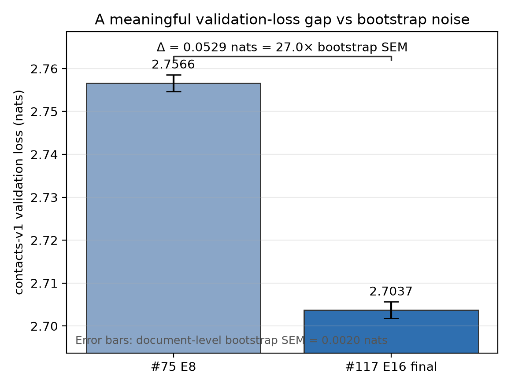

---
marinfold_experiment:
  issue: 188
  title: 'eval SNR characterization'
  kind: evals
  branch: exp/188-eval-snr-characterization
---

# eval SNR characterization

**Issue:** [#188](https://github.com/Open-Athena/MarinFold/issues/188) · **Kind:** `evals` · **Branch:** `exp/188-eval-snr-characterization`

## Question

How much finite-validation-set noise is there in the canonical contacts-v1 LM
validation loss? In particular, are the ~0.001–0.01 nat differences used to
compare nearby checkpoints meaningfully above the document-level sampling noise
of the eval set?

A second, related question came up while this experiment was running: did the
contacts-v1 validation-loss scale change when Levanter started masking targets
whose successor token is padding, and can we reproduce the old scale when needed
for historical comparisons?

## Hypothesis

The full contacts-v1 validation split is large enough that the token-weighted
loss stderr should be small, but not obviously small enough to treat sub-0.01 nat
differences as meaningful without measurement. A document-level bootstrap should
produce a more honest uncertainty estimate than treating individual tokens as
independent.

For the Levanter objective question, the expected fix is not to revert the new
default. Padding targets are artificial and should remain masked by default. The
right compatibility surface is an explicit legacy mode that includes
padding-target positions only when intentionally comparing against old runs.

## Background

There are two contacts-v1 held-out sets that are easy to conflate:

- **LM validation split / W&B `eval/loss`** — the exp53 contacts-v1 document
  validation split, `gs://marin-us-east5/protein-structure/MarinFold/exp53_contacts_v1_5x/documents/val/*.parquet`.
  This has 41,954 validation documents in the scored table here and is the split
  used for contacts-v1 training validation loss.
- **554-unit contact-prediction benchmark** — the downstream FoldBench / low-MSA
  benchmark used by exp82/exp89/exp169 for R-precision, AUC, contacts@L, etc.
  This experiment's bootstrap did **not** use that benchmark.

The bootstrap result below is therefore about the noise floor of **LM validation
loss on the contacts-v1 validation document population**, not about finite-sample
noise of the 554-protein contact metric.

## Approach

### 1. Score validation documents and bootstrap over documents

[`score_eval_loss_vllm_worker.py`](score_eval_loss_vllm_worker.py) scores the
exp117 final contacts-v1 checkpoint one validation document at a time and emits
one row per document with:

- `loss_sum` — summed negative log probability for the document prompt, excluding
  the initial BOS position;
- `token_count` — number of predicted tokens contributing to that document;
- `mean_loss` — `loss_sum / token_count` for inspection.

[`summarize_per_doc_loss.py`](summarize_per_doc_loss.py) then computes the usual
token-weighted validation loss,

```text
sum_i loss_sum_i / sum_i token_count_i
```

and a document-level Poisson bootstrap with independent weights
`w_i ~ Poisson(1)` over 10,000 replicates.

### 2. Recompute historical losses under controlled Levanter semantics

[`recompute_eval_loss_levanter.py`](recompute_eval_loss_levanter.py) is the
Levanter-side recompute harness used while debugging old/new validation-loss
semantics. It can evaluate from an HF export or native checkpoint, use raw
validation parquet or an existing tokenized cache, and choose:

- `loss_weight_mode="example"` — use dataset/example-provided loss weights;
- `loss_weight_mode="legacy-uniform"` — reproduce an older packed uniform-weight
  path where useful;
- `padding_target_loss="mask"` or `"include"` — the explicit mode added in Marin
  PR [#7921](https://github.com/marin-community/marin/pull/7921). `"mask"` is
  the new/default behavior; `"include"` is the old-scale compatibility mode.

The compatibility smoke used CoreWeave S3 only, because CoreWeave jobs should not
stream from GCS. The relevant paths were:

- model: `s3://marin-us-east-02a/MarinFold/exp167_eval/model_exp117_bs256_step35679`
- raw validation shard: `s3://marin-us-east-02a/MarinFold/data/document_structures/contacts_v1/val/contacts_v1-00000-of-00022.parquet`
- tokenized cache: `s3://marin-us-east-02a/MarinFold/exp188/tokenized/contacts-v1-val-smoke-pr7921-include-r4`
- output: `s3://marin-us-east-02a/MarinFold/exp188/levanter_recompute/exp117-pr7921-include-cw-smoke4-r4.json`

## Success criteria

- Per-document loss table for exp117 on contacts-v1 LM validation documents.
- Bootstrap stderr for token-weighted validation loss.
- A clear verdict on whether 0.001 / 0.01 nat validation-loss deltas are above
  finite-validation-set noise.
- A smoke/integration check that the explicit Levanter compatibility mode
  restores old-scale padding-target behavior without changing the new default.

## Results

### Bootstrap over the contacts-v1 LM validation split

The committed per-document table is
[`data/exp117_e16_final_step35679_per_doc_loss.parquet`](data/exp117_e16_final_step35679_per_doc_loss.parquet).
The summary JSONs are:

- [`data/exp117_e16_final_step35679_bootstrap_summary.json`](data/exp117_e16_final_step35679_bootstrap_summary.json)
- [`data/exp117_e16_final_step35679_bootstrap_summary_from_helper.json`](data/exp117_e16_final_step35679_bootstrap_summary_from_helper.json)

They agree on the headline numbers:

| quantity | value |
|---|---:|
| bootstrap unit | validation document |
| validation documents | 41,954 |
| predicted tokens | 47,780,004 |
| bootstrap replicates | 10,000 |
| token-weighted loss from per-doc table | 3.0836491807483473 |
| document-level bootstrap stderr | **0.0019573972720316546** |

Interpretation: finite validation-set noise at the document level is about
**0.002 nats** for this split and tokenizer/model scale. A 0.001-nat loss delta
is below one bootstrap standard error and should not be treated as a meaningful
selection signal by itself. A 0.007–0.01 nat delta is several bootstrap standard
errors for the LM loss measurement, but exp169 shows that this still does not
necessarily translate into a resolved contact-accuracy difference inside the end
of a single training run.

[`plot_loss_delta_vs_sem.py`](plot_loss_delta_vs_sem.py) plots one deliberately
large, meaningful contacts-v1 loss gap with the bootstrap SEM as error bars:
#75 E8 versus #117 E16 final. This is the scale where the loss difference is
unambiguously above finite-val-set noise.



| run | validation loss |
|---|---:|
| #75 E8 | 2.7566 |
| #117 E16 final | 2.7037 |
| absolute delta | 0.0529 |
| delta / bootstrap SEM | 27.0× |

### Historical Levanter loss semantics

The Levanter compatibility API in Marin PR
[#7921](https://github.com/marin-community/marin/pull/7921) keeps
padding-target masking as the default and adds the explicit mode:

```python
padding_target_loss: Literal["mask", "include"] = "mask"
```

CoreWeave smoke with PR code and `padding_target_loss="include"` succeeded:

| field | value |
|---|---|
| job | `/zack/exp188-pr7921-include-cw-smoke4-r4` |
| accelerator | 1×H100 on CoreWeave `cw-rno2a` |
| input/model/cache/output | CoreWeave S3 (`s3://marin-us-east-02a/...`) |
| validation input | one contacts-v1 raw validation parquet shard |
| `max_eval_batches` | 4 |
| `loss_weight_mode` | `"example"` |
| `padding_target_loss` | `"include"` |
| `eval/loss` | **2.8036928176879883** |

This is on the expected old/compatibility scale and, more importantly, validates
that the PR code path runs end-to-end with the explicit mode. A full CoreWeave
recompute was attempted next, but the submitted pod did not receive a visible GPU
(`cuInit(0)` failed; Levanter reported no accelerator). That failure was a launch
resource issue, not evidence against the loss semantics.

[`data/legacy_val_loss_results.csv`](data/legacy_val_loss_results.csv) records the
broader recompute sweep status. Of 246 candidate W&B/spreadsheet rows, 28 had a
successful recompute and 217 lacked an available checkpoint path. The cleanest
apples-to-apples subset is exp146, where 15 successful recomputes match W&B on
the same scale very tightly:

| subset | successful recomputes | min Δ | median Δ | max Δ |
|---|---:|---:|---:|---:|
| exp146 (`W&B loss - recomputed loss`) | 15 | -0.00355 | +0.000046 | +0.00415 |

Rows from exp120 and the thought-token experiments should not be pooled with
that subset: they involve different data/objective details and show much larger
offsets under the recompute harness. Those offsets motivated keeping the
compatibility mode explicit and named rather than hidden behind a boolean.

## What not to conclude

- The bootstrap mean `3.08365` is **not** a replacement for W&B `eval/loss`.
  It comes from the vLLM per-document scorer, while W&B uses Levanter's packed
  eval path. The bootstrap is useful for the document-level sampling noise of
  the same validation population; absolute losses should be compared only within
  one evaluation implementation.
- The bootstrap was **not** on the 554-protein contact-prediction benchmark. It
  estimates LM validation-loss noise on the exp53 contacts-v1 validation document
  split.
- `padding_target_loss="include"` is a compatibility mode. The default should
  remain `"mask"` for new training/evaluation unless the goal is explicitly to
  compare against pre-padding-target-mask losses.

## Conclusion

The contacts-v1 LM validation split has a document-level bootstrap stderr of
about **0.002 nats** for token-weighted loss. That makes 0.001-nat differences
noise-scale and not useful as checkpoint-selection evidence. Differences around
0.008–0.01 nats are measurable in LM loss, but they remain small enough that
contact-accuracy selection should use the contact benchmark directly when the
choice matters; exp169 is the concrete example where a 0.0076-nat val-loss
advantage did not produce a resolved R-precision improvement.

The Levanter padding-target-loss drift is now understood and has an explicit
Marin PR surface: `padding_target_loss="mask"` by default, with
`"include"` for old-scale compatibility. The CoreWeave smoke recompute validated
that path on contacts-v1 data without changing the default objective.

## Artifacts

- Per-document bootstrap input: `data/exp117_e16_final_step35679_per_doc_loss.parquet`
- Bootstrap summaries: `data/exp117_e16_final_step35679_bootstrap_summary*.json`
- Loss-delta scale reference: `data/loss_delta_vs_sem.csv`,
  `plots/loss_delta_vs_sem.png`, `plots/loss_delta_vs_sem.pdf`
- Legacy recompute manifest/status: `data/legacy_loss_manifest.jsonl`,
  `data/legacy_loss_jobs.jsonl`, `data/legacy_val_loss_results.csv`
- Per-document scoring output working copy:
  `gs://marin-us-central1/protein-structure/MarinFold/exp188/per_doc_loss/exp117_e16_final_step35679`
- CoreWeave smoke output:
  `s3://marin-us-east-02a/MarinFold/exp188/levanter_recompute/exp117-pr7921-include-cw-smoke4-r4.json`
- Marin PR for compatibility mode:
  <https://github.com/marin-community/marin/pull/7921>
