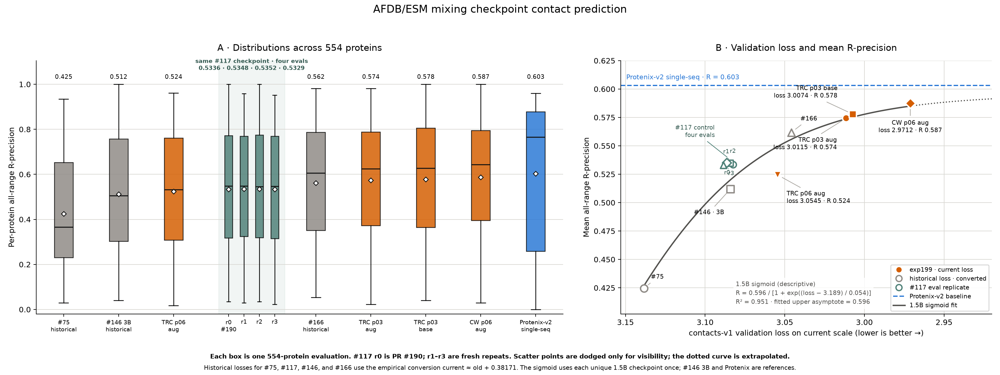

# Exp199 contact prediction evaluations

This workspace evaluates an extensible catalog of exp199 checkpoints with the
fixed 554-protein contact set and 100 rollout-resampled generations per protein.
Each checkpoint runs as one resumable Iris job. Native Levanter checkpoints
remain read-only in their region-local GCS buckets.

## Finished exp199 runs and their control

The completed `prot-exp199-cv1-s01-m1-p03-aug-us-east1` run has nine permanent
checkpoints. The forced final checkpoint is step 72,599. All nine steps are in
`checkpoint_specs.py`, so a later trajectory evaluation only requires selecting
another catalog key.

The other previously evaluated trial is
`prot-exp199-cv1-s01-m1-p06-aug-us-east1`. Its forced final checkpoint is also
step 72,599. `exp199_final_checkpoint()` makes each future completed trial a
one-line catalog addition.

Two more final HF exports were evaluated. The TRC p03-base run is
`prot-exp199-cv1-s01-m1-p03-base-us-east5` at step 72,599. The CoreWeave
p06-aug run is `prot-exp199-cw-cv1-s02-m1-p06-aug` at step 145,199. Both are
pinned to an immutable `open-athena/marinfold-exp199` revision.

The control is the exact exp117 1.5B, 16-epoch step 35,679 HF export used by PR
#190. Its repository revision is pinned. The exp199 analyzer first rescored PR
#190's lossless sparse votes and recovered mean all-range R-precision
`0.5335961341539802` across 554 proteins. End-to-end generation is stochastic.
Three fresh control runs produced `0.5347972614575084`, `0.535215598085612`,
and `0.5328883690891095`. All passed PR #190's 0.006 tolerance. Across the
archived run and three repeats, R-all spans `0.002327228996502506`.

Submit or resume each checkpoint independently. HF-backed checkpoints omit a
region so the main cluster can place them wherever capacity is available:

```bash
uv run --frozen python submit_contact_eval.py \
  --checkpoint exp117-control-step35679 \
  --run-tag <unique-tag> \
  --cluster marin \
  --user eczech

uv run --frozen python submit_contact_eval.py \
  --checkpoint s01-m1-p03-base-step72599 \
  --run-tag <unique-tag> \
  --cluster marin \
  --user eczech

uv run --frozen python submit_contact_eval.py \
  --checkpoint cw-s02-m1-p06-aug-step145199 \
  --run-tag <unique-tag> \
  --cluster marin \
  --user eczech
```

Each submission explicitly uses interactive priority and requests one `v6e-4`.

The isolated `rerun02-20260809` jobs were submitted concurrently on 2026-08-09.
All three succeeded without a failure or preemption:

- [`/eczech/marinfold-exp199-exp117-control-step35679-eval-rerun02-20260809`](https://iris-dev.oa.dev/#/job/%2Feczech%2Fmarinfold-exp199-exp117-control-step35679-eval-rerun02-20260809), 45m 54s
- [`/eczech/marinfold-exp199-s01-m1-p03-aug-step72599-eval-rerun02-20260809`](https://iris-dev.oa.dev/#/job/%2Feczech%2Fmarinfold-exp199-s01-m1-p03-aug-step72599-eval-rerun02-20260809), 43m 57s
- [`/eczech/marinfold-exp199-s01-m1-p06-aug-step72599-eval-rerun02-20260809`](https://iris-dev.oa.dev/#/job/%2Feczech%2Fmarinfold-exp199-s01-m1-p06-aug-step72599-eval-rerun02-20260809), 44m 53s

The `finals03-20260810` control and two new candidates ran concurrently on the
main cluster at interactive priority. All three succeeded on their first
attempt:

- [`/eczech/marinfold-exp199-exp117-control-step35679-eval-finals03-20260810`](https://iris.oa.dev/#/job/%2Feczech%2Fmarinfold-exp199-exp117-control-step35679-eval-finals03-20260810), 46m 26s
- [`/eczech/marinfold-exp199-s01-m1-p03-base-step72599-eval-finals03-20260810`](https://iris.oa.dev/#/job/%2Feczech%2Fmarinfold-exp199-s01-m1-p03-base-step72599-eval-finals03-20260810), 45m 8s
- [`/eczech/marinfold-exp199-cw-s02-m1-p06-aug-step145199-eval-finals03-20260810`](https://iris.oa.dev/#/job/%2Feczech%2Fmarinfold-exp199-cw-s02-m1-p06-aug-step145199-eval-finals03-20260810), 1h 16m 51s

## Final checkpoint results



| Run | Step | contacts-v1 loss, current scale | R-all | R-short | R-medium | R-long |
| --- | ---: | ---: | ---: | ---: | ---: | ---: |
| [exp117 control, PR #190](https://github.com/Open-Athena/MarinFold/pull/190) | 35,679 | ≈3.085419 | 0.533596 | 0.628409 | 0.585364 | 0.482558 |
| [exp117 control, fresh r1](https://huggingface.co/buckets/open-athena/MarinFold/tree/data/contacts-v1-model-eval-exp199/derived/prot-exp117-cv1-s02-1_5b-e16-lr3p162e-3-wd0p2-bs256-europe-west4/step-35679) | 35,679 | ≈3.085419 | 0.534797 | 0.630044 | 0.585700 | 0.485725 |
| [exp117 control, fresh r2](https://huggingface.co/buckets/open-athena/MarinFold/tree/data/contacts-v1-model-eval-exp199/replicates/rerun02-20260809/derived/prot-exp117-cv1-s02-1_5b-e16-lr3p162e-3-wd0p2-bs256-europe-west4/step-35679) | 35,679 | ≈3.085419 | 0.535216 | 0.629265 | 0.585215 | 0.484878 |
| [exp117 control, fresh r3](https://huggingface.co/buckets/open-athena/MarinFold/tree/data/contacts-v1-model-eval-exp199/replicates/finals03-20260810/derived/prot-exp117-cv1-s02-1_5b-e16-lr3p162e-3-wd0p2-bs256-europe-west4/step-35679) | 35,679 | ≈3.085419 | 0.532888 | 0.627580 | 0.584631 | 0.483040 |
| [exp199 p03-aug](https://wandb.ai/eric-czech/marin/runs/prot-exp199-cv1-s01-m1-p03-aug-us-east1) | 72,599 | 3.011531 | 0.574333 | 0.660688 | 0.623301 | 0.526172 |
| [exp199 p06-aug](https://wandb.ai/eric-czech/marin/runs/prot-exp199-cv1-s01-m1-p06-aug-us-east1) | 72,599 | 3.054504 | 0.524407 | 0.629089 | 0.579260 | 0.469668 |
| [exp199 p03-base](https://wandb.ai/eric-czech/marin/runs/prot-exp199-cv1-s01-m1-p03-base-us-east5) | 72,599 | 3.007422 | 0.577965 | 0.657243 | 0.627441 | 0.529338 |
| [exp199 CoreWeave p06-aug](https://wandb.ai/eric-czech/marin/runs/prot-exp199-cw-cv1-s02-m1-p06-aug) | 145,199 | 2.971201 | 0.587348 | 0.665621 | 0.635742 | 0.542181 |

Loss is `eval/tokenized/contacts-v1-val/loss` from W&B at the listed checkpoint
step. Exp199 used the current loss implementation. The exp117 raw loss
`2.7037086486816406` came from the historical implementation and is shown after
the empirical conversion `current ≈ old + 0.38171`. The change is traced in
[issue #173](https://github.com/Open-Athena/MarinFold/issues/173#issuecomment-5227639661)
and the linked
[Discord message](https://discord.com/channels/1354881461060243556/1533900986446385202/1535720900165369906).
The [same-checkpoint study](https://gist.github.com/eric-czech/9c40252457790a513eeb62a6a965c049)
found the offset more stable than its fitted slope across the narrow observed
loss range.

The figure retains PR #190's historical #75, #146, #166, and Protenix-v2
single-sequence references. Their old losses use the same conversion. The four
#117 boxes and scatter points are separate evaluations of one checkpoint. The
scatter dodges those points horizontally for visibility while keeping their
shared converted loss explicit. The loss conversion affects only the x-axis;
all plotted R-precision values come from the original per-protein evaluations.
Lower loss runs to the right.

The scatter includes a descriptive three-parameter sigmoid fit with its lower
asymptote fixed at zero. It uses the unique 1.5B checkpoints. The four #117
evaluations enter that fit once through their mean. The 3B #146 point and
Protenix-v2 are references rather than fit inputs. The fitted equation is
`R = 0.595529 / (1 + exp((loss - 3.188702) / 0.054182))` with R² `0.951167`.
Its upper asymptote `0.595529` remains below the Protenix-v2 baseline
`0.603158`, so the fit has no finite baseline crossing. The dotted portion is
an extrapolation below the lowest observed loss. This describes a small,
mixed-history sample whose historical x values use an approximate conversion.

CoreWeave p06-aug is the strongest exp199 checkpoint at R-all `0.587348`,
`0.015809` below Protenix-v2. TRC p03-base and p03-aug reach `0.577965` and
`0.574333`. Their difference is `0.003632`, the same order as the `0.002327`
total span observed across the four control evaluations. TRC p06-aug reaches
`0.524407`. These are single evaluations of each exp199 checkpoint. The
CoreWeave and TRC p06 runs also have different training histories. CoreWeave
starts from scratch and ends at step 145,199, while TRC continues an exp117
checkpoint through step 72,599, so their difference does not isolate hardware.

The p03-aug and p06-aug results come from `rerun02-20260809`; p03-base and
CoreWeave p06-aug come from `finals03-20260810`. Every manifest records the
same evaluator revision, 554 targets, target hashes, 100 rollouts, sampling
settings, and tensor parallelism.

Rebuild the comparison from the published rows without running inference:

```bash
uv run --frozen --extra analysis python plot_contact_eval.py
```

The script downloads one result table at a time into repository `scratch/`,
checks every SHA-256, and validates the means against the compact comparison
CSV before writing the figure and its metadata.

The CoreWeave p06-aug checkpoint has the highest R-precision in every range.
It generated 49,135,390 tokens and reached the stop token in 90.03% of
rollouts, compared with about 27 million tokens and 100% stop rates for the
same-batch control and p03-base jobs. This accounts for its longer evaluation.

The current scorer can separately reproduce PR #190's archived lossless votes:

```bash
uv run --frozen --extra analysis python analyze_contact_eval.py \
  --verify-pr190-control
```

That deterministic rescore returns R-all `0.5335961341539802`. The
`finals03-20260810` control returned `0.5328883690891095`, a
`-0.0007077650648706912` delta that passed the 0.006 gate. PR #190 did not
assign per-request TPU seeds, so decoded samples vary across runs. Every
candidate used the same stochastic generation, vote, and metric pipeline as a
validated control replicate.

Within `finals03-20260810`, p03-base is `+0.04507645686870665` R-all above the
fresh control and CoreWeave p06-aug is `+0.054460008705852436` above it. The local
[`contact_eval_final_checkpoint_summary.csv`](../../data/contact_eval_final_checkpoint_summary.csv)
index preserves unrounded range values, the PR #190 reference and delta, run
identities, job names, and artifact prefixes. A
[public copy](https://huggingface.co/buckets/open-athena/MarinFold/resolve/data/contacts-v1-model-eval-exp199/derived/contact_eval_final_checkpoint_summary.csv)
lives beside the per-checkpoint artifacts.

Public derived artifacts:

- [canonical PR #190 exp117 control](https://huggingface.co/buckets/open-athena/MarinFold/tree/data/contacts-v1-model-eval-exp166/derived)
- [fresh exp117 control r1](https://huggingface.co/buckets/open-athena/MarinFold/tree/data/contacts-v1-model-eval-exp199/derived/prot-exp117-cv1-s02-1_5b-e16-lr3p162e-3-wd0p2-bs256-europe-west4/step-35679)
- [fresh exp117 control r2](https://huggingface.co/buckets/open-athena/MarinFold/tree/data/contacts-v1-model-eval-exp199/replicates/rerun02-20260809/derived/prot-exp117-cv1-s02-1_5b-e16-lr3p162e-3-wd0p2-bs256-europe-west4/step-35679)
- [exp199 p03-aug step 72,599](https://huggingface.co/buckets/open-athena/MarinFold/tree/data/contacts-v1-model-eval-exp199/replicates/rerun02-20260809/derived/prot-exp199-cv1-s01-m1-p03-aug-us-east1/step-72599)
- [exp199 p06-aug step 72,599](https://huggingface.co/buckets/open-athena/MarinFold/tree/data/contacts-v1-model-eval-exp199/replicates/rerun02-20260809/derived/prot-exp199-cv1-s01-m1-p06-aug-us-east1/step-72599)
- [fresh exp117 control r3](https://huggingface.co/buckets/open-athena/MarinFold/tree/data/contacts-v1-model-eval-exp199/replicates/finals03-20260810/derived/prot-exp117-cv1-s02-1_5b-e16-lr3p162e-3-wd0p2-bs256-europe-west4/step-35679)
- [exp199 p03-base step 72,599](https://huggingface.co/buckets/open-athena/MarinFold/tree/data/contacts-v1-model-eval-exp199/replicates/finals03-20260810/derived/prot-exp199-cv1-s01-m1-p03-base-us-east5/step-72599)
- [exp199 CoreWeave p06-aug step 145,199](https://huggingface.co/buckets/open-athena/MarinFold/tree/data/contacts-v1-model-eval-exp199/replicates/finals03-20260810/derived/prot-exp199-cw-cv1-s02-m1-p06-aug/step-145199)

The exp199 raw votes, timings, exact inputs, and manifests use exact run
identities:

```text
hf://buckets/open-athena/MarinFold/data/contacts-v1-model-eval-exp199/
  replicates/<run-tag>/runs/<wandb-run-name>/step-<N>/
```

The canonical control raw votes remain under PR #190's
`contacts-v1-model-eval-exp166/scores/exp117-control-step-35679` prefix.

After another job completes, validate all 554 completion markers and compute
the standard contact metrics locally:

```bash
uv run --frozen --extra analysis python analyze_contact_eval.py \
  --checkpoint exp117-control-step35679 \
  --run-tag <unique-tag>
```

The finalizer writes compact per-protein metrics, summaries, timings, and
provenance to the experiment `data/` directory and publishes them under the
matching HF derived prefix. Raw sparse votes stay available, so score matrices
and later analyses can be rebuilt without another TPU run. Git retains only
manifests, aggregate summaries, and the consolidated index. Per-protein rows
and timing archives remain in HF.

## CoreWeave checkpoint archive

The finished `prot-exp199-cw-cv1-s02-m1-p06-aug` run is available for future
evaluation from its [HF directory](https://huggingface.co/open-athena/marinfold-exp199/tree/e2b1e27d92a0cef41d13242b2067519a87685829/prot-exp199-cw-cv1-s02-m1-p06-aug).
It contains Levanter checkpoints at step 116,160, before cooldown, and final
step 145,199, plus the final HF export at step 145,199. The 67 files total
41,199,082,505 bytes.

[`upload_cw_checkpoint.py`](upload_cw_checkpoint.py) copied the three subtrees
serially from the read-only
`s3://marin-us-east-02a/marin/protein-structure/MarinFold/exp199_optimize_contacts_v1_afdb_esm/checkpoints/protein/prot-exp199-cw-cv1-s02-m1-p06-aug/2026.08.07.2/`
source. It staged one subtree at a time on ephemeral disk and used one HF
upload worker. The
[`/eczech/marinfold-exp199-cw-p06-aug-checkpoints-to-hf-01`](https://iris.oa.dev/#/job/%2Feczech%2Fmarinfold-exp199-cw-p06-aug-checkpoints-to-hf-01)
CPU job ran on `cw-us-east-02a` for 6m 44s without a failure or preemption.
Every destination path, size, and content hash was verified before completion.

## Step 26760 pilot record

The temporary Iris job
`/eczech/marinfold-exp199-step26760-eval-shell-01` was used with `iris task
exec` before unattended submission. Commands issued inside that live `v6e-4`
verified the locked environment, four TPU devices, GCS restore, HF export,
shardwise BF16 cast, tokenizer and Qwen3 geometry, TPU vLLM load, and one
100-rollout inference batch. The batch completed for `foldbench100/5sbj_A` with
all 100 generations reaching the stop token.

The complete 554-target evaluation ran as
[`/eczech/marinfold-exp199-s01-m1-p06-base-step26760-eval-retry01`](https://iris-dev.oa.dev/#/job/%2Feczech%2Fmarinfold-exp199-s01-m1-p06-base-step26760-eval-retry01).
The `retry01` suffix distinguishes it from an earlier container-build failure.
Both attempts targeted the same immutable result prefix, and completion markers
made a later retry skip finished parts. The job succeeded without a preemption
or task failure in 47 minutes 26 seconds. Inference generated 55,400 rollouts
for all 554 proteins in 2,509 seconds. Checkpoint preparation took 40 seconds,
and TPU vLLM loading and compilation took 195 seconds.

The finalized mean metrics are:

| Range | R-precision | AUC |
| --- | ---: | ---: |
| All | 0.461997 | 0.910293 |
| Short | 0.588240 | 0.956308 |
| Medium | 0.508059 | 0.943702 |
| Long | 0.404464 | 0.885805 |

The raw prefix contains 35 sparse-vote parts and 35 timing completion markers.
The public
[`derived/prot-exp199-cv1-s01-m1-p06-base/step-26760`](https://huggingface.co/buckets/open-athena/MarinFold/tree/data/contacts-v1-model-eval-exp199/derived/prot-exp199-cv1-s01-m1-p06-base/step-26760)
prefix contains the validated per-protein metric rows, aggregate summary,
timings, and provenance manifest. The finalizer validated 2,516,122 sparse vote
rows and produced 11,080 metric rows.
