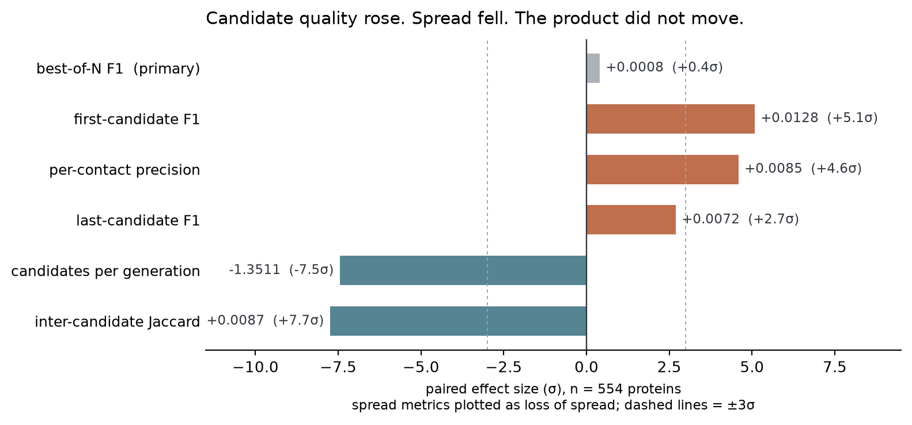

---
marinfold_experiment:
  issue: 200
  title: 'RL post-training: best-of-N over self-generated contact candidates'
  kind: models
  branch: claude/marinfold-issue-200-plan-5ba0c8
---

# RL post-training: best-of-N over self-generated contact candidates

**Issue:** [#200](https://github.com/Open-Athena/MarinFold/issues/200) · **Kind:** `models` · **Branch:** `claude/marinfold-issue-200-plan-5ba0c8`

## Question

[#163](https://github.com/Open-Athena/MarinFold/issues/163)'s multi-draft model writes ~15 near-disjoint candidate contact maps in one generation. The best of them scores F1 **0.303** while the last — the one a caller would actually read — scores **0.249**, and the base E8 single-shot scores 0.237. Does RL over self-generated candidates close that gap, and does it do so without damaging the ordinary contacts-v1 task?

## Hypothesis

A **dense** reward will move this where a trajectory-level one would not. Every emitted `<contact> <pI> <pJ>` triple is independently checkable against ground truth, so the credit assignment can be per-contact rather than one scalar smeared over ~4,200 tokens. Two terms:

1. **Stepwise**, per contact: `+(1 - p̄)` if the pair is a true contact, `-p̄ · δ^e` if not, where `e` counts earlier errors in that section. The decay reflects that a wrong contact may be the logical consequence of an earlier mistake rather than an independent error. `p̄` is the policy's own recent precision, so the expected stepwise reward is ~0 at current performance and the gradient says only "beat yourself".
2. **Document-level**, per rollout: the best section's F1, baselined leave-one-out across the generations for that protein. This is the term that pays for *spread* — without it the stepwise term alone would push every section toward one best guess and destroy the diversity that makes best-of-N work.

RL runs on a 50:50 mix of `<contacts-v1>` and `<contacts-v1.multi>` prompts, so the base task is optimized directly rather than merely defended.

## Background

`<contacts-v1.multi>` (token id 7 under exp163's renamed tokenizer) is not part of the `marinfold` library — it is an exp163 artifact. `<begin_statements>` means "discard the previous candidate, here is a new one", and only the final section is closed by `<end>`, so `<end>` remains the generation stop token. See exp163's [WRITEUP.md](../exp163_models_teach_contacts_v1_to_refine_a/WRITEUP.md).

Two prior results constrain the design. exp163's v1/v2 refiners lost **41-44%** of base-task R-precision to a single full fine-tune, so a KL anchor and a low learning rate are not optional. And exp163 found conditioning on *external* drafts degrades prediction monotonically (-0.117 F1 at k=16), which is why the candidates here must be on-policy and self-generated.

## Approach

Fully online `RLJob` (`marin.rl`): vLLM rollout workers and a train worker with live weight transfer, on marin iris v5p (interactive band).

- `contact_rewards.py` — the dense reward, walking **token ids** rather than decoded text so rewards land on specific positions. Per-section F1 is verified equal to exp163's `rollout_metrics.score_rollout`, so the document return is the same number the published #163 figures came from.
- `dense_loss.py` — `ContactsDenseLoss(RLOOLoss)`, returning one per-token advantage array per rollout: `A_t = lam_step · token_rewards[t] + lam_doc · (R_doc − RLOO baseline)`.
- `contacts_env.py` — `ContactsV1RLEnv(MarinEnv)`; one instance per lesson, plain and multi at equal curriculum weight.
- `rl_config.py` — assembles the `RLJobConfig`; also the checkpoint preflight (`rope_theta`, `vocab_size`) and the guards that refuse a config which would fail deep inside a worker.
- `dispatch_rl.py` / `dispatch_parity.py` / `dispatch_prep.py` / `dispatch_publish.py`, over `_submit.py` — launchers. This directory is the complete iris workspace (exp166's pattern), so the pod resolves exp200's own pinned manifest.
- `prep_prompt_pool.py` — builds the training pool. `publish_checkpoint_hf.py` — publishes the starting model as an HF repo, which the rollout worker's tokenizer loader requires.
- `_trace.py` / `read_trace.py` — the environment reports to object storage, because `iris job logs` is empty for a *running* child.
- `reap.py` — stops a finished run, which marin cannot do itself (see Phase 3).
- `phase1_parity.py` — the parity gate, with exp163's scorer vendored as `_exp163_rollout_metrics.py` for cross-checking.

marin's vLLM path renders every prompt through a chat template, and this vocab has neither a chat template nor `<|im_end|>`. The context class is picked by a hardcoded `if inference_type == "vllm"` in `rollout_worker.py`, so a subclass cannot be injected. Instead the environment builds prompt token ids itself and calls `inference_ctx.llm.generate` with `TokensPrompt` — the renderer is touched nowhere outside `batch_completions`, and its constructor validates nothing, so setting `canonical_model_name` to a qwen-containing string is enough to get past construction. This is also what exp163's validated `gen_rollouts_worker_exp163.py` does, which makes the Phase-1 parity check a like-for-like comparison rather than a comparison against a reimplementation.

Starting model: exp163 arm F, republished as the HF repo
[`timodonnell/plm-exp163-refine-cv1-1_5b-lr1e-4-e1-cos-tpuF-step404`](https://huggingface.co/timodonnell/plm-exp163-refine-cv1-1_5b-lr1e-4-e1-cos-tpuF-step404).

## Success criteria

- **Primary** — paired Δ best-of-N F1 on the 553-protein exp163 eval set ≥ **+0.02 at ≥3σ**, against the arm-F reference **re-measured at the same `--max-sections` cap** (the published 0.303 was measured uncapped, so comparing to it directly would be wrong by construction).
- **Guardrail** — teacher-forced R-precision in plain `<contacts-v1>` mode ≥ **−0.005** vs arm F's 0.3374.
- **Reported, not gating** — last-section F1 and consensus-vote F1, since best-of-N is an oracle metric; plus `n_sections`, `mean_jaccard`, `frac_improving` and a token-matched independent best-of-N control.

Kill criteria: mean contacts per section below 60% of baseline (reward hacking toward silence), `mean_jaccard` above 0.3 (diversity collapse), or R-precision Δ below −0.01 (the exp163 v1/v2 forgetting failure).

## Results

**Status.** The sampling path reproduces #163's published numbers (Phase 1); the
training pool is built (Phase 2); the RL loop trains correctly and its one real
defect — runs that cannot terminate themselves — is root-caused upstream and
worked around (Phase 3); the learning-rate sweep is running (Phase 4). No
accuracy claim yet: nothing has been evaluated against the success criteria.

### Phase 1 — sampling-path parity (PASSED)

All 554 eval proteins x 4 rollouts, uncapped, on one v5p-8 (job
`/bizon/exp200-parity-all554`, 47m). Source: [`data/parity_all554.json`](data/parity_all554.json),
[`data/parity_all554_rollouts.csv`](data/parity_all554_rollouts.csv).

exp200 generates through `ContactsV1RLEnv` and scores by walking **token ids**;
exp163 generated through its own worker and scored by regexing **decoded text**.
Running both over the same 2,216 rollouts is a check on two independent
implementations, not a smoke test.

| metric | exp200 | #163 §4.1 | delta |
|---|---|---|---|
| best_f1 | 0.3015 | 0.3025 | −0.0010 |
| last_f1 | 0.2456 | 0.2493 | −0.0037 |
| first_f1 | 0.1849 | 0.1840 | +0.0009 |
| n_sections | 14.23 | 14.99 | −0.76 |
| mean_jaccard | 0.0677 | 0.0710 | −0.0033 |

Agreement between the two scorers: **max |best_f1 delta| 0.0**, **max |section_f1
delta| 0.0**, 0/2216 malformed prompts. Free-generation termination reproduced
independently at 0.569 against the published ~0.56.

3/2216 rollouts disagree on section COUNT, all of them truncated at the token
budget: exp163's regex keeps a trailing empty section after the final
`<begin_statements>` where the token walk does not. `best_f1` is identical on all
three — an empty section scores zero and never wins a max — so no score is
affected.

Measured per-contact precision is **0.2294**, which sets `p_bar`; the configured
starting value of 0.30 is close enough not to bias the first steps much.

One earlier run on 100 proteins read best_f1 0.1498 and looked like a 50%
regression. It was a sampling bug, not a model result — `--limit` truncated the
target list instead of sampling it, returning 100% foldbench100, where exp163's
own numbers give 0.1296 against 0.2928 on the denovo_pdb rows that are 71% of the
file. Kept as [`data/parity_100_foldbench_biased.json`](data/parity_100_foldbench_biased.json).

### Phase 2 — RL training pool (built)

10,000 proteins x 16 resampled realizations, built in 69s on one CPU pod in
us-east5 (job `/bizon/exp200-prep-pool`). Source:
[`data/train_pool_summary.json`](data/train_pool_summary.json).

`gs://marin-us-east5/protein-structure/MarinFold/exp200/train/{targets.parquet,prompts/}`

| | |
|---|---|
| source | exp53 contacts-v1 train split, AFDB **round 0** (highest pLDDT) |
| mean global pLDDT | 89.0 (min 70.5) |
| L | 31 / 159 / 359 / 512 (min / median / p90 / max) |
| n_gt | 5 / 105 / 139 (min / median / mean) |
| distinct entry ids | 10,000 |
| distinct struct clusters | 10,000 |
| exact sequence overlap with eval554 | **0** |

The zero-overlap number is a real measurement, not a filter that silently never
fired: both sides use the same one-letter alphabet (eval554 additionally contains
`X` for unknown residues), so a match could have fired. Length distribution also
lands close to the eval set (median 159 against eval554's 161), so the training
and evaluation protein populations are comparable in the axis that most drives
contact difficulty.

Homology-level overlap is **not** addressed — only exact sequence identity. exp41
(foldseek train-similarity) is the tool if that gap needs closing.

### Phase 3 — RL loop bring-up (resolved)

Everything up to the training loop is done and verified. The loop itself runs but
does not yet complete a run.

**The reward mechanism is confirmed on real hardware.** Reading a rollout batch
written by a TPU worker: 4 groups of 4 (uniform, which the replay buffer's
rectangular indexing requires), prompt 413 / response 433 / logprobs 433 /
token_rewards 433 (all aligned), `episode_reward` 0.1533, and `token_rewards`
spanning −0.0669 to 0.2665 with 432/433 nonzero and **not constant**. Those two
extremes are the design arithmetic exactly — `(1 − p̄)/3 = 0.267` and
`−p̄/3 = −0.067` at the observed p̄ ≈ 0.20. Environment, dense reward, weight
transfer and serialization all work.

**Training completes, and the loop is healthy.** W&B for the nano run:
`finished`, 10/10 steps, `train/max_advantages` 0.4746 (dense advantages reach
the loss), `train/mean_advantages` 0.0028 (≈0, which is exactly what centring the
reward on p̄ is designed to produce), `train/ratio_mean` 1.0024 (sampler and
trainer logprobs agree, so clipping is inert and the logprob path is validated),
`train/kl_k3_mean` 0.00052 with `kl_beta` 0.01.

**The bottleneck is rollout supply, not weight transfer.** Throughput metrics:
`train_step_duration` **1.14 s** against `rollout_wait_duration` **36.1 s** of a
37.3 s iteration. An earlier reading of this as a weight-transfer cost was wrong
— it inferred step time from the spacing between rollout batches, which measures
the rollout worker's whole cycle rather than the training step. The lever is
`num_rollout_workers` (now 4).

**Runs cannot terminate themselves, and the cause is upstream.** The
object-storage trace ruled out the obvious explanations first: **one boot id, one
worker_id, zero failures** across 106 rollout batches, so nothing was restarting,
and the `weight_step` cycling `−1 → 4 → −1` was just the weight client falling
back to its "no weights yet" sentinel after the trainer stopped serving.

The coordinator *does* have reaping logic — `train_job.wait()` then
`_terminate_rollout_jobs()`. It never runs because the completion handshake has no
safety on either side:

| side | code | failure mode |
|---|---|---|
| trainer | `runtime.run_state.mark_completed.remote().result()` (`orchestration.py:308`) | **no timeout** — blocks forever if the RPC does not land |
| rollout | `get_snapshot.remote().result(timeout=5.0)` inside `except Exception: pass  # best-effort` | a persistent failure is indistinguishable from "still running" — loops forever |

Either way `train_job.wait()` never returns and nothing reaps the rollout workers.
Measured directly: trace1 logged steps 2→9 and its W&B runtime stopped at **688 s**,
while the rollout worker kept generating for another 40+ minutes.

Two hypotheses were checked and rejected on the way, which is worth recording so
nobody re-runs them: hosted actors are served on a background thread
(`serve_background()`), so the coordinator blocking in `wait()` is not a deadlock;
and the trainer's only background thread is the replay buffer's, which is
`daemon=True`, so a lingering non-daemon thread is not holding the process open.

`reap.py` therefore detects completion through W&B — the channel that demonstrably
works — and stops the job from outside. Fixing the handshake itself would mean
patching marin, whose RL module was deleted upstream two days after this pin.

#### Bring-up failures, and why the earlier gates could not catch them

Five distinct failures, each found by the 10-step nano rather than by a
three-arm sweep:

| # | Failure | Why it was invisible earlier |
|---|---|---|
| 1 | marin deleted the `vllm` extra and `marin.rl` (`e7ef104402`, 2026-08-07) while iris rejects clients older than 14 days | Packaging; surfaces only at pod build |
| 2 | `WANDB_API_KEY` never propagated to workers | `create_environment` forwards it from `os.getenv` of the *calling* process, so the chain works only if the driver was launched with it |
| 3 | `canonical_model_name` is both a renderer substring match and an exact `MODEL_MAPPINGS` key | The exact-key lookup is on the weight-transfer path, which pure generation never touches — the Phase 1 gate ran 2,216 rollouts through the same context without hitting it |
| 4 | `prng_key` is a union of JAX key and plain int, selected by `use_jax_rng = (inference_type == "levanter")` | marin's own `mock_env` calls `jax.random.randint` unguarded, so the union is invisible until you run vLLM inference |
| 5 | `sync_interval_steps=1` costs 372 s/step | Only measurable once the loop actually ran |

None of these were reachable from the Phase 1 parity gate, which exercises
generation and scoring rather than the RL loop. That is an argument for the nano
gate, not against parity: the two cover different surfaces.

### Phase 4 — LR sweep (one arm completed; two lost to preemption)

Launched 2026-08-10 as `/bizon/exp200-rl-sweep3`: three arms at **1e-6 / 3e-6 /
1e-5**, 150 steps, `train_batch_size=32`, 16 prompts x 8 generations,
`max_sections=8`, `sync_interval_steps=8`, KL k3 at beta 0.01, on the full
10,000-protein pool. Each arm was 1 v5p-8 trainer plus 4 v5p-8 rollout workers.

| arm | W&B step | checkpoint | outcome |
|---|---|---|---|
| **1e-6** | **149/149, finished** | **step-149** | completed, exported, evaluated |
| 1e-5 | 120 | step-90 | trainer stalled; stopped |
| 3e-6 | 100 | step-72 | trainer stalled; stopped |

**The loop works at full scale.** Four rollout workers removed the starvation
entirely — `throughput/rollout_wait_duration_seconds` read **0.0** on all three
arms against 36.1 s with one worker. `n_pred` held flat (~620 multi, ~130 plain)
and p̄ flat at 0.13-0.16 through training, so nothing drifted toward emitting
fewer, safer contacts. KL rose monotonically with learning rate (0.00051 /
0.00079 / 0.00133), which is the expected ordering and a useful sanity check on
the anchor.

**Two arms were lost to preemption, not to a bug.** The driver was preempted
twice; the two trailing arms' trainers stopped advancing while their rollout
workers kept generating, and after ~25 minutes with no step progress they were
stopped to return the slices. The identical config completed cleanly on 1e-6, so
this is preemptible-v5p attrition rather than a defect. A rerun should either
accept the attrition and launch arms independently — so one preemption cannot
strand two siblings under a shared driver — or checkpoint far more often than
every 20 minutes, since the stalled arms' rolling checkpoints lagged their
training step by ~30 steps.

**Expect a small effect.** KL of 0.00051 on the completed arm means the policy
barely moved over 150 steps. The learning rates were chosen an order of magnitude
below exp163's 1e-4 fine-tune value, and the evidence now says that was
conservative. A flat result here bounds the useful range from below; it does not
speak to whether the dense reward works, which the training-time metrics already
answer affirmatively.

### Phase 5 — evaluation of the 1e-6 arm (primary criterion NOT met; mechanism identified)

Trained arm scored on all 554 eval proteins x 4 rollouts, uncapped, by the same
code that produced the arm-F reference, so the comparison is matched rather than
approximate (job `/bizon/exp200-eval-lr1em06`; scorer agreement on the trained run
was again exact — max |best_f1 delta| 0.0, 0 mismatches, 0 malformed prompts).
Paired per protein, n=554. Source:
[`data/eval_lr1em06_vs_armF_per_protein.csv`](data/eval_lr1em06_vs_armF_per_protein.csv).

| metric | arm F | RL 1e-6 | paired Δ | σ | win % |
|---|---|---|---|---|---|
| **best_f1** (primary) | 0.3015 | 0.3022 | **+0.0008** | +0.4 | 54.5 |
| last_f1 | 0.2456 | 0.2528 | +0.0072 | +2.7 | 54.5 |
| first_f1 | 0.1849 | 0.1977 | **+0.0128** | **+5.1** | 59.4 |
| precision | 0.2294 | 0.2379 | **+0.0085** | **+4.6** | 64.3 |
| n_sections | 14.23 | 12.88 | **−1.35** | **−7.5** | 31.0 |
| mean_jaccard | 0.0770 | 0.0828 | **+0.0087** | **+7.7** | 72.6 |
| n_pred | 1319 | 1195 | −125 | −9.1 | 31.9 |

**Primary criterion (≥ +0.02 at ≥3σ): NOT MET.** best_f1 is flat at +0.4σ.



The per-protein view ([`plots/quality_vs_spread.png`](plots/quality_vs_spread.png)) is
worth reading honestly: better-and-fewer is the plurality quadrant at 41%, and the
trade is weak protein-by-protein (r = −0.20) even though both means shift clearly. The
effect is a distributional shift, not a per-protein rule.

**But the reward did exactly what it was designed to do.** Per-contact precision
rose +0.0085 at +4.6σ and first-section F1 rose +0.0128 at +5.1σ — individual
candidates got better, which is precisely what a dense per-contact reward targets.
There is also no reward hacking: `n_pred_per_section` is unchanged (92.7 -> 92.8),
so the drop in total predictions comes entirely from emitting **fewer sections**,
not shorter ones.

**The gain was cancelled by lost diversity.** Sections fell by 1.35 (−7.5σ) and
Jaccard between them rose by 0.0087 (+7.7σ, 72.6% of proteins). best-of-N is a
product of per-candidate quality and spread, and this run traded one for the
other almost exactly evenly.

That is the tension the reward design anticipated: the stepwise term pushes every
section toward the model's single best guess, and the document-level best-of-N
term exists to pay for spread. At `lam_step = lam_doc = 1.0` the stepwise term
won. **The specific next lever is the ratio**, not the learning rate: raise
`lam_doc` relative to `lam_step`, or make the document term reward spread
explicitly rather than only the best section's F1.

Note also that the KL of 0.00051 means this is the effect of a policy that barely
moved. Both readings point the same way — a larger `lam_doc` and a higher learning
rate — and they are independent knobs.

**Not yet measured:** the guardrail, teacher-forced R-precision in plain
`<contacts-v1>` mode, needs exp163's `rprec_worker_tpu.py` against arm F's 0.3374.
Given precision rose and per-section quality improved, base-task damage looks
unlikely, but it is unmeasured and the kill criterion is therefore unverified.

### Where to pick this up

Everything needed to run the next iteration is in place and verified:

- **Reward + loss** — `contact_rewards.py` already supports `mode="plain"`;
  `dense_loss.py` takes `lam_step` / `lam_doc`, so the λ ratio is a config change.
- **Launchers** — `dispatch_rl.py` (env-knob sweep, `--submit` for the CPU driver),
  `dispatch_parity.py --model` (eval any checkpoint against the same 554 proteins),
  `dispatch_export.py`, `dispatch_prep.py`, `dispatch_publish.py`, over `_submit.py`.
- **Observability** — `_trace.py` / `read_trace.py` (the environment reports to object
  storage, because `iris job logs` is empty for a *running* child) and `reap.py`
  (stops a finished run, which marin cannot do itself).
- **Data** — the 10,000-protein pool in both us-east5 and us-central1, and the
  arm-F baseline measured on all 554 eval proteins.

Two things a rerun should change, both learned the hard way: launch arms as
**independent jobs** so one driver preemption cannot strand its siblings, and
checkpoint on a **step interval** rather than a 20-minute timer — that is why two of
three arms here have nothing clean to evaluate.

**Follow-up: [#208](https://github.com/Open-Athena/MarinFold/issues/208)** — the same
dense reward on the base `<contacts-v1>` format only, where the spread axis disappears
entirely, starting from `contacts-v1-exp199-1.5B` and with the document term redefined
as a rollout's leave-one-out marginal contribution to the n=100 consensus vote. That
last change is the direct consequence of this experiment: it aligns the objective with
the metric actually reported, and defends diversity by construction rather than by a
hyperparameter.

### Published artifacts

- **Checkpoint** — [`timodonnell/plm-exp163-refine-cv1-1_5b-lr1e-4-e1-cos-tpuF-step404`](https://huggingface.co/timodonnell/plm-exp163-refine-cv1-1_5b-lr1e-4-e1-cos-tpuF-step404),
  bf16, `rope_theta=500000`, `vocab_size=2845`, id 7 = `<contacts-v1.multi>`,
  verified anonymously loadable. Sourced from the open-athena bucket, **not** the
  GCS bf16 dir: only the bucket copy carries exp163's renamed tokenizer.
- **Training pool** —
  `gs://marin-us-east5/protein-structure/MarinFold/exp200/train/{targets.parquet,prompts/}`
- **Parity evidence** — `data/parity_all554.json`, `data/parity_all554_rollouts.csv`

## Reproducing

This directory is the complete iris workspace (exp166's pattern) — no marin
checkout, and the iris CLI comes from its own venv. The bundle is built from
`git ls-files`, so **commit before submitting**; `_submit.check_clean` enforces it.

```bash
uv sync --extra cpu --extra test
PYTHONPATH=../../marinfold uv run pytest tests/ -q
```

```bash
uv run python dispatch_parity.py --limit 554 --n-generations 4 --max-sections 0
```

```bash
uv run python dispatch_prep.py --n 10000 -k 16
```

```bash
uv run python dispatch_publish.py
```

```bash
EXP200_LRS=1e-6,3e-6,1e-5 EXP200_STEPS=150 uv run python dispatch_rl.py --submit
```

```bash
uv run python read_trace.py --path gs://marin-us-east5/protein-structure/MarinFold/exp200/trace/<run-name>
```

The marin pin is `0.2.76.dev31155643335` and **cannot be advanced**: 0.2.77
(2026-08-08) is the first release without `marin.rl`, which is
`ContactsDenseLoss`'s base class and the whole environment API. marin's RL
direction is now SkyRL, so moving forward is a rewrite rather than a bump.

Capacity note: v5p-16 had 0 ready slices in both zones on 2026-08-09 while v5p-8
had 103 in us-central1-a, so training runs on v5p-8 at `train_batch_size=32`.
marin's DAPO normalisation divides by batch size, so a learning rate swept at
batch 32 does not transfer to a batch-128 run.

## Conclusion

**The dense per-contact reward works; best-of-N did not move because the gain was
spent on diversity.**

The mechanism is not in doubt. Per-contact precision rose +0.0085 (+4.6σ) and
first-section F1 rose +0.0128 (+5.1σ) — candidates got better, which is exactly
what a per-contact reward targets — and `train/mean_advantages` sat at 0.0028
through training, so the p̄-centring behaved as designed rather than biasing toward
silence. `n_pred_per_section` was unchanged, so nothing collapsed toward emitting
less.

The primary metric is flat anyway (+0.0008, +0.4σ) because sections fell 1.35
(−7.5σ) and inter-section Jaccard rose 0.0087 (+7.7σ). best-of-N is quality times
spread, and this run traded one for the other almost exactly evenly. At
`lam_step = lam_doc = 1.0` the stepwise term overwhelmed the document-level term
that exists to pay for spread.

So the result is a specific, actionable negative rather than an uninformative one.
The next lever is **the λ ratio, not the learning rate**: raise `lam_doc` relative
to `lam_step`, or reward spread explicitly rather than only the best section's F1.
A higher learning rate is worth combining with it — KL of 0.00051 says this policy
barely moved — but on its own it would likely just buy a larger version of the same
trade.

Two caveats stated plainly. The guardrail (teacher-forced R-precision in plain
mode) is **unmeasured**, so that kill criterion is unverified. And only one of
three learning-rate arms survived preemption, so this is a single point rather than
a sweep.

What can be said before any accuracy result: the dense per-contact reward works
as designed on real hardware. `train/mean_advantages` sits at 0.0028 — the
p̄-centred reward is doing exactly what it was built to do, which is to make the
gradient say "beat your own current precision" rather than "emit fewer contacts".
And `train/ratio_mean` 1.0024 means the sampler and trainer agree on logprobs to
within a quarter of a percent, so the importance ratio is exact and clipping is
inert; that validates the whole logprob path, which is the part of a policy-
gradient setup that is easiest to get silently wrong.

The methodological lesson worth carrying forward is that the two gates caught
disjoint classes of bug. Parity (2,216 rollouts, two independent scorers agreeing
to floating point) proved the measurement; it could not have caught any of the
five bring-up failures, because it exercises generation and scoring rather than
the RL loop. The 10-step nano caught all five for a few v5p-minutes each. Neither
substitutes for the other, and three of the four bugs found across both were
silent-wrong rather than loud-fail.
