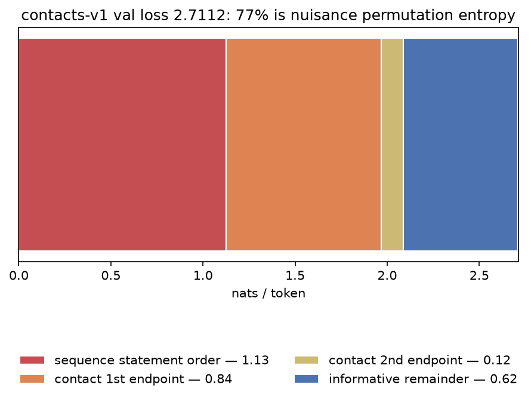
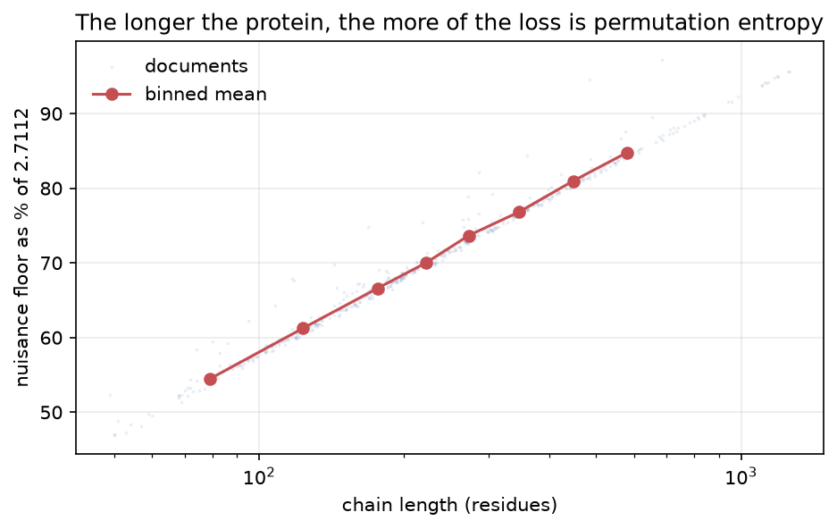

---
marinfold_experiment:
  issue: 201
  title: 'exp: order-marginalized (soft-target) supervision for contacts-v1'
  kind: models
  branch: claude/contacts-soft-target-supervision-cc25fd
---

# exp: order-marginalized (soft-target) supervision for contacts-v1

**Issue:** [#201](https://github.com/Open-Athena/MarinFold/issues/201) · **Kind:** `models` · **Branch:** `claude/contacts-soft-target-supervision-cc25fd`

## Question

contacts-v1 documents list an unordered **set** — the sequence statements and
the contacts — in a **uniformly random order**. One-hot next-token supervision
therefore spends most of its budget asking the model to predict a nuisance
permutation it cannot predict and that we do not want it to learn.

**Does replacing the one-hot target with the exact conditional marginal over the
next token — computable in closed form from the generation process — train
contacts-v1 materially faster, and give a validation loss that actually tracks
R-precision?**

## Hypothesis

This is a **Rao–Blackwellization** of the current loss, not a heuristic. Since

```
E_ordering[ CE(onehot(y_t), p_theta) ] = E_prefix[ CE(q_t, p_theta) ]
```

the soft-target loss has an **identical population objective** — same optimum,
same expected value, same expected gradient — and, by the law of total variance,
a **strictly lower-variance target**. It is a lower-variance *estimator* of the
same quantity, **not a smaller number**: both losses have the same floor `H(q)`,
and pointwise soft-CE = `KL(q||p_theta) + H(q)`. The interpretable,
zero-at-optimum quantity is `KL = CE - H(q)`, and `H(q)` is computable per
document from the tokens alone.

Put another way: 16 epochs of hard targets averages over 16 sampled orderings.
Soft targets average over all `N!*2^N` of them in a single pass, for ~0.3 % extra
FLOPs.

**Three predictions:**

1. **Most of the current loss is nuisance.** Permutation entropy per document is
   `log(N!) + N*log 2 + log((L+2)!)`. On the three real contacts-v1 documents in
   [`exp82/data/benchmark_docs.parquet`](https://github.com/Open-Athena/MarinFold/blob/main/experiments/exp82_evals_contacts_v1_contact_prediction/data/benchmark_docs.parquet):

   | protein | L | contacts | tokens | perm. entropy | nats/token | share of 2.71 |
   |---|---|---|---|---|---|---|
   | 1UBQ | 76 | 67 | 361 | 529 | 1.47 | 54 % |
   | 1QYS | 92 | 76 | 420 | 645 | 1.54 | 57 % |
   | 7BNY | 132 | 137 | 683 | 1161 | 1.70 | 63 % |

   Extrapolating with `N ~ L`, `tokens ~ 5L + 8` to the corpus mean document
   (4,676,753,425 tokens / 4,213,203 docs = **1,110 tokens/doc**, L ~ 220):
   **1.90 nats/token = 70 % of the 2.7112 val loss**, rising to ~82 % at L = 500.

   *(Pre-registered estimate, left as written. Measured over the full val split:
   **2.0889 nats/token = 77.0 %** — see Results.)*

2. **This explains #169 mechanistically.** "Val-loss early stopping bought
   nothing" and "matched loss != matched accuracy across sizes" is exactly what a
   metric that is 70 % nuisance produces. It also reframes #166: 2.7112 -> 2.6642
   is a **~6 % relative** gain in the informative part of the loss, not 1.7 %.
   *(Measured: 77 % nuisance, so the reframing is **7.6 %** relative.)*

3. **Better per-token information, not just lower variance.** At a
   second-endpoint slot the model currently gets one of ~15 true partners while
   the other 14 correct answers are actively pushed down by the softmax. The
   soft target hands it the whole row.

## Background

- **#150 / #117** — the recipe and the control. 1.5B Qwen3, exp53 corpus,
  bs 128, seq 8192, block shuffle, `data_seed=0`, final val loss 2.7112. The
  control curve and per-epoch checkpoints already exist, so only the treatment
  arm needs TPU time.
- **#169** — three checkpoints within 0.008 nats that val loss ranked *wrong*
  against R-precision. A ready-made adversarial test for the metric claim.
- **#163** — conditioning on true partial contact maps lifts R-precision
  0.145 -> 0.556. The joint signal is real, large, and precision-gated.
- **#174** — Pass 1 (the coarse fold) is the bottleneck, not refinement.
- **#82 / #89** — the settled inference recipe (rollout + per-rollout resampling,
  n = 100) and the fixed 554-protein metric.

## Approach

### Phase 0 — offline accounting (local, ~1 day)

- `marinfold/marinfold/document_structures/contacts_v1/soft_targets.py`: pure
  NumPy reference — `soft_targets(token_ids)` and `permutation_entropy(...)` with
  a per-section breakdown. Stays in the jax-free package; it is a property of the
  document structure.
- **Monte-Carlo identity test:** for a small protein, sample K orderings and
  assert (a) empirical next-token frequencies match `q` (in the document's
  own sequence-index frame), and (b) `mean_orderings(hard CE) ==
  mean_orderings(soft CE)` within MC error. This is the test
  that makes every later phase trustworthy — a silently wrong target looks
  exactly like a working run.
- Entropy decomposition over the exp53 val split.
- **Gate:** nuisance share >= ~40 %. **Measured: 77.0 %** (see Results).

### Phase 1 — decompose the loss on checkpoints we already have (~1 day, 1 GPU)

Score the val split with existing HF exports (#117 final, #117 early-stop, #146
3B, #166, plus an early-training checkpoint or two for spread), reporting KL
**per slot kind**: contact first endpoint, contact second endpoint, amino-acid
identity, statement order, `<contact>`-vs-`<end>` timing. Plot each component
against already-measured R-precision.

Note what this is *not*: swapping hard CE for soft CE cannot re-rank checkpoints
on a val split this large. The two agree in expectation, and the ordering noise
that separates them is ~1e-4 nats over tens of millions of val tokens — far
below the 0.008-nat spread in #169. Subtracting `H(q)` likewise only rescales,
since it is a constant of the val split.

What *can* re-rank is the **decomposition**: the aggregate 2.71 mixes several
sub-tasks (predicting amino acids, predicting when the contact list ends,
predicting endpoints), and only some of them relate to contact accuracy. If the
endpoint-slot KL orders the #169 checkpoints by R-precision where the aggregate
does not, that is a usable model-selection signal and it ships on its own.

### Phase 1b — the mask-only arm (cheap, no custom kernel) — *implemented*

Phase 0 found the single largest nuisance component is not in the structure
section at all: the **sequence-statement shuffle is 1.13 nats/token, 42 % of the
entire training loss**, and it is 100 % nuisance — the statement heads are
prompt, not prediction.

That component can be removed without any soft-target machinery. The
statement-head slots are identifiable from token ids alone (every other token
between `<begin_sequence>` and `<begin_statements>`), so zeroing them in
`example.loss_weight` is a ~20-line `compute_next_token_loss` override that
reuses levanter's existing fused CE kernel unchanged.

Worth running as its own arm because it is nearly free and it isolates the
biggest single component:

- **arm 0** — control (#117 recipe verbatim)
- **arm 1** — statement heads loss-masked *(this phase; no new kernel)*
- **arm 2** — full soft targets *(Phase 3)*

It is not strictly dominated by arm 2: masking drops those slots entirely, while
soft targets keep a low-variance gradient there that still teaches "these
positions remain undefined". Which is better is empirical, and arm 1 answers it
for a fraction of the engineering.

**Status: code complete and verified; the training run is not launched.**

- [`models/marinfold_models/loss_masks.py`](../../models/marinfold_models/loss_masks.py)
  builds the mask from token ids. Packing-safe by construction: both "most
  recent marker" lookups are running maxima over position indices, so a later
  document's `<begin_sequence>` beats an earlier document's closer with no
  per-document reset, and a window that starts mid-document masks nothing rather
  than masking the wrong thing.
- [`models/marinfold_models/masked_loss_model.py`](../../models/marinfold_models/masked_loss_model.py)
  is a `Qwen3Config` + LM-head **subclass** overriding `compute_next_token_loss`
  — levanter's own injection point, no monkey-patching. The architecture is
  untouched, so checkpoints and the HF export path stay interchangeable with a
  plain `qwen3` run.
- 28 tests in [`models/tests/`](../../models/tests/), and
  [`verify_mask.py`](verify_mask.py) re-checks everything against real exp53
  documents before any TPU time is spent.

Two loss-reporting decisions worth knowing, both discovered while wiring it up:

- levanter's weighted mean divides by the **sum of weights**, so `train/loss`
  here is the mean over surviving slots — a different denominator *and* slot mix
  than any historical run. `train/loss_unmasked` is logged alongside from the
  same forward pass; that is the comparable series.
- **Evaluation is deliberately not masked.** `levanter.eval` pairs the
  per-position loss it requests with the *unmasked* `loss_weight`, so returning
  a masked numerator would give a meaningless hybrid of two denominators. The
  eval path returns the standard loss, keeping `eval/.../loss` comparable with
  #117/#150 — and the masked arm should be expected to score **worse** on it,
  because it deliberately stopped fitting 23.7 % of slots that are pure
  permutation noise. That is the intervention working, which is exactly why
  R-precision, not val loss, is the primary endpoint (#169).

### Phase 2 — the JAX loss (~2-3 days)

`models/marinfold_models/soft_targets.py` (target construction + loss) and
`soft_loss_model.py` (`Qwen3SoftTargetConfig` + LM-head subclass). Tests: JAX vs
the NumPy reference on real documents, packed multi-document windows, and the
Phase-0 MC identity.

### Phase 3 — the training A/B (the decisive experiment)

- Recipe = #150's #117 reproduction verbatim. Control curve already exists.
- Run against the **Phase-1b mask-only arm** as well as the control, so a soft-target
  win has to beat the cheap intervention, not just the do-nothing baseline.
- **First** a 2-epoch, 3-point LR mini-sweep for the soft arm (1x, 2x, 3.16x of
  3.16e-3) — see risk 2.
- Then the winner to 4 epochs (17,840 steps), extending to 16 only if the
  4-epoch point is at or ahead of the control.
- **Primary endpoint:** R-precision on the fixed 554-protein #82/#89 eval at
  matched steps. **Secondary:** hard-CE val loss at matched steps.
- **Success:** control's R-precision at <= half the steps, or beating it at the
  full budget.

### Phase 4 — probe documents (own issue, only if Phase 3 lands)

Supervise `q(partner | X)` for **every** position X from the sequence alone, not
just the ~N rows a random ordering happens to visit. The naive form is
prohibitive — one document per X repeats the whole sequence section, ~2L^2 ~
180k tokens at L = 300, a 22x blowup. The fix is a shared prefix plus a
**canonical enumeration** of every position:

```
<contacts-v1.probe> <begin_sequence> ...L+2 shuffled statements...
<begin_statements> [optional m real contacts]
<contact> <p_s> <contact> <p_s+1> ... <contact> <p_s+L-1>
```

Supervise only the logits at each `<p_X>` slot with the row target (uniform over
X's remaining partners; all mass on `<end>` when X has none); loss-mask
everything else.

- **No custom attention mask is needed.** Enumerating *every* position in
  canonical wrap-around order makes the probe stream a deterministic function of
  L, so it leaks nothing about the contact map and plain causal attention is
  sound even though probe i attends to probes < i. (Enumerating only
  contact-bearing positions *would* leak and would force a prefix/tree mask.)
- **Cost ~4L + 4 tokens** — *less* than a normal document (~5L), while carrying
  the entire contact map instead of one ordering.
- **Mode marker:** new doc-type token `<contacts-v1.probe>`, appended **last** in
  `all_domain_tokens()` (the #158/#160 id-freeze discipline). #175 showed a mode
  marker cleanly separates behaviours within one checkpoint. Reuse
  `<contact>`/`<end>` rather than minting more tokens.
- **The `m`-prefix variant is the interesting one.** With m real contacts in the
  prefix (m ~ U[0, N]) the target becomes the *remaining* partner row — dense
  supervision of exactly the conditional #163 measured as the big lever.
- Probe documents are a **training-only construct**; they are not sampleable as
  coherent structures. Keep the long random-order documents in the mixture so
  self-conditioned rollout generation still trains.

This will be split into its own issue if Phase 3 lands, per the
"different hypothesis -> new issue" rule.

## Success criteria

**Phase 0 (done).** The nuisance share of the reported val loss is >= 40 %.

**Phase 1 / 1b.** Some per-slot-kind KL component orders the #169 checkpoints by
R-precision where the aggregate val loss does not; and/or the mask-only arm
matches the control's R-precision in fewer steps.

**Phase 3 (the experiment).** The soft-target arm reaches the #117 control's
R-precision on the fixed 554-protein #82/#89 eval in **<= half** the steps, or
beats it at the full budget. Secondary: hard-CE val loss at matched steps, which
stays comparable with every historical run.

## Results

### Phase 0 — how much of the contacts-v1 loss is nuisance permutation entropy?

Measured over the **whole exp53 validation split** — 41,954 documents,
47,780,004 tokens, mean 1,139 tokens/document — with
[`analyze_entropy.py`](analyze_entropy.py). "Floor" is the cross-entropy an
oracle that knew the structure exactly would still pay, because the generator
shuffles both the sequence statements and the contact list.

| slot kind | % of slots | floor (nats/token) | % of the 2.7112 val loss |
|---|---:|---:|---:|
| sequence statement order | 23.3 % | **1.1265** | 41.6 % |
| contact 1st endpoint | 17.7 % | **0.8423** | 31.1 % |
| contact 2nd endpoint | 17.7 % | **0.1201** | 4.4 % |
| amino acid / terminus index | 23.3 % | 0 | — |
| section markers, `<contact>` vs `<end>` | 18.0 % | 0 | — |
| **nuisance floor** | | **2.0889** | **77.0 %** |
| **informative remainder** | | **0.6223** | 23.0 % |



**77.0 % of the #117 validation loss is a permutation no model can predict.**
The informative remainder is 0.6223 nats/token, so the gap between #117 (2.7112)
and #166 (2.6642) is a **7.6 % relative** improvement in the part that can be
learned, not the 1.7 % the raw numbers suggest.

The biggest single component is the one this experiment did not set out to
attack: the **sequence-statement shuffle, 1.1265 nats/token — 42 % of the whole
training loss**, spent on predicting which residue statement the generator
happened to emit next. Those slots are prompt, not prediction. Hence the
mask-only arm added as Phase 1b.

### It gets worse with length



| chain length | documents | floor (nats/token) | % of 2.7112 |
|---|---:|---:|---:|
| < 100 | 6,771 | 1.463 | 54 % |
| 100–200 | 14,454 | 1.722 | 63 % |
| 200–400 | 13,107 | 1.985 | 73 % |
| 400–700 | 5,546 | 2.242 | 83 % |
| > 700 | 2,076 | 2.458 | 91 % |

The permutation entropy grows like `log(N!)` while the token count grows like
`N`, so the share rises monotonically: **at 700+ residues, 91 % of the loss is
nuisance** and the learnable signal is outnumbered ~10:1. That is the same
direction as the long-protein weakness characterised in
[#142](https://github.com/Open-Athena/MarinFold/issues/142), and it means any
gain from removing the nuisance should be *largest* exactly where the model is
currently weakest.

*Caveat on the denominator:* the floor is normalised per in-document transition
(`num_tokens - 1`), while the reported val loss also supervises the per-document
`<eos>` transition inside packed windows. That makes the shares above high by
~0.1 % relative — immaterial at this resolution.

### Phase 1b — mask verified against the real corpus

[`verify_mask.py`](verify_mask.py) over 400 exp53 validation documents, plus a
7,656-token packed window of 9 documents (what the trainer actually sees):

```
[ok] token ids match the mask defaults: {'<begin_sequence>': 8, '<begin_statements>': 9, '<end>': 10}
[ok] mask == oracle on 400 individual documents
[ok] mask == oracle on a 7,656-token packed window (9 documents)

masked slots         : 115,758 / 488,361 (23.7% of supervised slots)
nuisance nats removed: 1.1659 of 2.1190 nats/token (55.0% of the nuisance floor)
```

So the mask drops **23.7 % of supervised slots** and with them **1.166
nats/token — 43 % of the total training loss and 55 % of its nuisance floor** —
without touching the structure section, the amino acids or any section marker.

### A correction the tests forced

The Monte-Carlo test contradicted the framing this experiment was written with.
The one-hot target is a **sample** from the soft target, so

    E_ordering[hard CE] == E_ordering[soft CE]

**exactly** (verified to 1e-5 over 2,000 sampled orderings in
`test_expected_hard_loss_equals_expected_soft_loss`). Both losses share the floor
`H(q)`. The soft target is a lower-variance *estimator* of the same objective,
**not a smaller loss number**, and the zero-at-optimum quantity is
`KL = CE - H(q)`.

Consequence: swapping hard CE for soft CE **cannot re-rank checkpoints** on a val
split this size — the ordering noise separating the two estimators is ~1e-4 nats
over 47.8 M tokens, far below the 0.008-nat spread in
[#169](https://github.com/Open-Athena/MarinFold/issues/169). Subtracting `H(q)`
only rescales, since it is a constant of the val split. Phase 1 was rewritten
accordingly: the re-ranking candidate is the **per-slot-kind decomposition**, not
soft-vs-hard.

The variance/efficiency bet in Phases 1b–3 is untouched by this, and is now
clearly the only first-order claim.

## Conclusion

*Phase 0 complete. Phase 1b implemented and verified; no training run launched
yet. Phases 1, 2, 3, 4 not started.*

Phase 0 clears its gate with room to spare: **77 % of the contacts-v1 training
loss is nuisance permutation entropy**, rising to **91 % for proteins over 700
residues**. The exact conditional targets that remove it are a pure function of
the token stream, so the training A/B needs no corpus, tokenizer or
data-pipeline change.

The unexpected finding is where the nuisance sits — 42 % of the total loss is the
*sequence-statement* shuffle, removable with a loss mask and no new kernel. That
became Phase 1b and should be run before the full soft-target implementation.
