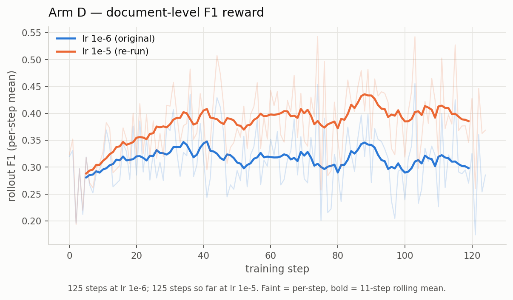
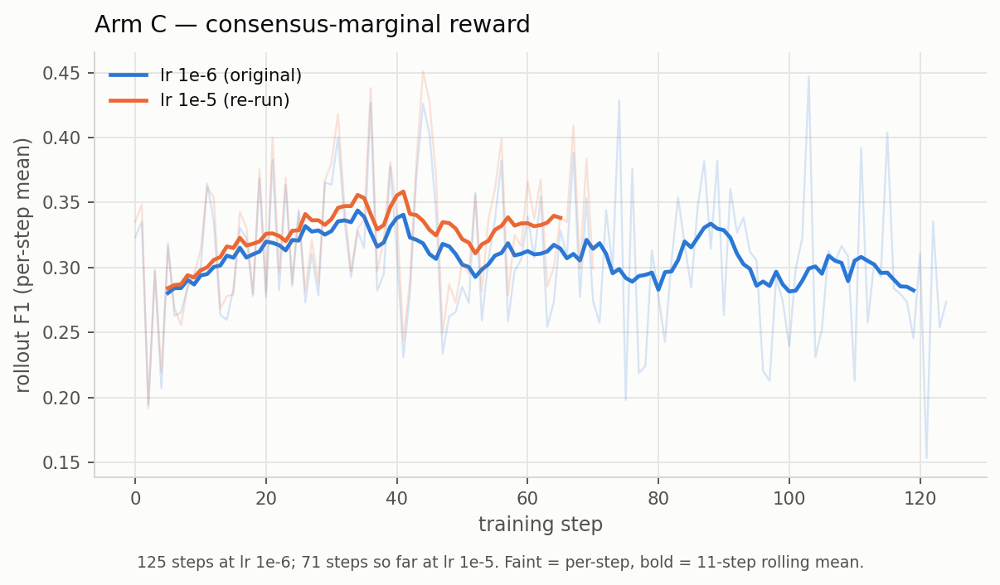
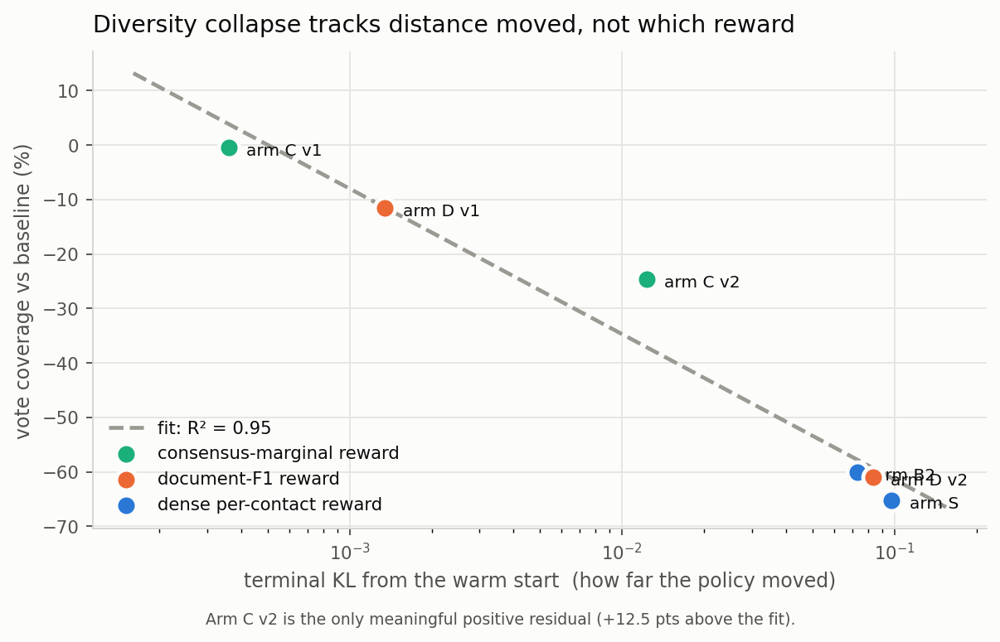

# exp208 results: RL post-training on contacts-v1

**Issue [#208](https://github.com/Open-Athena/MarinFold/issues/208) · five arms × 125 steps · 554-protein held-out eval · 8×A100**

**The one-paragraph version.** Nine runs across five reward designs. Eight made the
model worse or left it unchanged; the ninth — the leave-one-out consensus marginal
at lr 4e-5 — is the first to **significantly beat the warm start** (AUC +0.0032,
p = 4e-05, better on 61% of 554 proteins) while holding R-precision flat. The
mechanism running through all of it is **vote diversity**: the eval is a consensus
over 100 rollouts, and a reward that makes each rollout individually better makes
the hundred redundant. Every arm containing the dense per-contact term collapsed
coverage 60–65%; the consensus marginal, which pays a rollout for what it *adds*
to the group, held it at −6.4% and raised total votes 23%.

The older framing below — that any sufficient policy movement destroys diversity —
was refuted by that last run and is kept, marked, because the refutation is the
most useful thing in this document. Raising
the learning rate 10× on the two document-level arms confirmed this rather than
overturning it: they finally moved, and the one that moved most (arm D v2, terminal
KL 0.0836) went from −0.0001 to **−0.0083** — while looking excellent on every
training metric. A
dense per-contact reward moves the policy hard and costs 0.021 R-precision
(p = 5.7e-19) — not through bad contacts but through missing ones: it learns to be
selective, emits **65% fewer distinct pairs**, and consensus scoring cannot rank a
pair that never receives a vote. Adding the leave-one-out consensus marginal
significantly repairs part of that damage (+0.0048 R, +0.0110 AUC over the dense
reward, both p < 1e-4). Two purely document-level rewards — a per-rollout F1 scalar
and the consensus marginal alone — left the model statistically unchanged, but
their KL says they never moved it, so they are **untested rather than ineffective**.

| arm | reward | terminal KL | R-precision | Δ warm start | AUC | vote coverage |
|---|---|---|---|---|---|---|
| — | baseline `exp199` | — | **0.6111** | — | **0.9487** | 2267 pairs |
| **C** | consensus marginal **only** (`lam_step=0`) | **0.00036** | 0.6116 | +0.0005 (p = 0.74) | 0.9484 | −0.5% |
| **C v2** | same, lr 1e-5 | 0.0123 | 0.6112 | +0.0001 (p = 0.95) | 0.9445 | −24.6% |
| **D** | document F1 only, GRPO | **0.00135** | 0.6109 | −0.0001 (p = 0.93) | 0.9467 | −11.6% |
| **D v2** | same, lr 1e-5 | 0.0836 | 0.6027 | **−0.0083** (p = 1.6e-05) | 0.9184 | −61.0% |
| **S** | dense per-contact | 0.09763 | 0.5898 | **−0.0213** (p = 5.7e-19) | 0.8976 | **−65.2%** |
| **B v1** | dense + consensus (`lam_doc` 4.5) | 0.09 | 0.5879 | −0.0232 | 0.8986 | −65.3% |
| **B v2** | dense + consensus (`lam_doc` 1067) | 0.07308 | **0.5946** | −0.0165 | **0.9087** | −60.1% |

Read the KL column alongside the score column. **The two arms with a moving policy
both lost; the two that scored at baseline had terminal KLs 50–200× smaller.** No
configuration tested here improved the metric.

Details: [ARM_S_RESULTS.md](ARM_S_RESULTS.md) · [ARM_B_RESULTS.md](ARM_B_RESULTS.md) ·
[ARM_D_RESULTS.md](ARM_D_RESULTS.md) · [VOTE_COVERAGE.md](VOTE_COVERAGE.md) ·
[ERR_DECAY_ANALYSIS.md](ERR_DECAY_ANALYSIS.md)

---

## 1. The finding: a per-rollout objective is wrong for a consensus metric

Arm S doubled single-rollout precision, 0.252 → 0.473, and lost 0.021 R-precision
and 0.051 AUC. Both are true at once, and only the second matters.

Its reward pays `n_scored · (precision − p̄)` — a **per-contact** quantity whose
lever is *which contacts to emit*, so the cheapest way to raise it is to emit only
confident ones. Consensus R-precision is a property of the **vote distribution over
100 rollouts**, and it needs the marginal, uncertain contact emitted *sometimes*;
that is what a vote count is for. Over the recall axis the two objectives point in
opposite directions.

Measured on paired within-protein data, four checkpoints on the same 554 proteins:

| checkpoint | pairs voted | ρ(Δcoverage, ΔAUC) |
|---|---|---|
| arm S step 40 | −15.8% | +0.142 (p = 8e-4) |
| arm S step 125 | **−65.2%** | **+0.781** (p = 6e-115) |
| arm D step 125 | −11.6% | −0.013 (p = 0.76) |

The proteins that lost the most coverage lost the most AUC. **AUC absorbs the
damage and R-precision hides it**: AUC ranks every candidate pair, so an unvoted
pair is unrankable (arm S is worse on 98.4% of proteins), while R-precision reads
only the top R, where the surviving contacts genuinely *are* better. A reward that
trades recall for precision looks nearly harmless on the headline number while
gutting the ranking beneath it.

This confirms pre-registered prediction 2 and its mechanism: *"the step-only arm
raises precision and moves consensus R-precision by ≤ 0 — union coverage shrinks
and votes concentrate."* At its own internal peak (step 40) arm S is −0.0023,
p = 0.12 — the 0.0023 reproducibility floor. **It never beat the warm start.**

## 2. Was a purely document-level reward tried?

Yes, twice, and neither trained the model.

**Arm D — one scalar per rollout (section F1), GRPO group baseline, no per-token
term.** Scored 0.6109 (−0.0001, p = 0.93). Mean KL 0.00069 against arm S's 0.0318;
0.00135 vs 0.09763 over the last 25 steps. Its own training reward is flat over all
125 steps (trend p = 0.87).

**Arm C — the consensus marginal alone (`lam_step = 0`).** Scored 0.6116 (+0.0005,
p = 0.74), coverage −0.5%, every training metric statistically flat (trend
p = 0.28–0.63). Terminal KL **0.00036** — the least movement of any arm, less even
than arm D.

Arm C's flat `pred/gt` (1.09–1.11 throughout, where arm S falls to 0.57) is
therefore **not** evidence that the consensus term prevents shrinkage. A policy
that does not move does not shrink. An earlier draft of this document claimed the
causal reading; it does not hold.

Two reasons these signals are so weak, and they compound:

- **Dilution.** A per-rollout scalar spread over ~600 response tokens gives each
  token ~0.03, against the dense reward's 0.248 concentrated on the three tokens of
  each contact. Equalising the *summed* contribution (which `lam_doc = 1067` does)
  does not equalise the per-token gradient.
- **No normalisation, for arm C specifically.** With `lam_step = 0` the advantage is
  the raw consensus marginal under a pass-through estimator, whereas arm D's GRPO
  normalises to unit variance. Arm C had both the thinnest and the least-scaled
  signal, and moved 4× less than arm D.

So "document-level" is not one thing: two document-level rewards here differ by 4×
in how far they moved the policy, and both are 50–200× below the dense arms.
**Neither has been tested at a learning rate that trains the model.**

## 2b. The re-runs at lr 1e-5

Both document-level arms were re-run at **10× the learning rate**, the change their
KL numbers called for. Both now train.

Faint traces are per-step values; bold is an 11-step rolling mean. Per-step noise
has sd ~0.056, which is why the block means in earlier drafts of these documents
looked like structure that was not there — the rolling mean is what makes the
comparison readable.

| arm | reward | lr 1e-6, last 20 steps | lr 1e-5, last 20 steps |
|---|---|---|---|
| D | document F1 | 0.3171 | **0.3967** (at step 78) |
| C | consensus marginal | 0.3118 | **0.3334** (at step 71) |

**Arm D separates clearly**; arm C's improvement is real but much smaller, matching
their KL ratios. Both re-runs raise precision *and* recall *and*
correct-contacts-per-rollout while `pred/gt` stays near 1.0 — the opposite of arm S,
which bought precision by emitting less.

**Read these two charts as a cautionary tale, not a result.** They are training-set
curves, and the held-out score below contradicts them: the arm whose curve rises
most is the arm that lost the most on the metric of record.

**The training gains did not transfer, and arm D v2 is the cleanest demonstration
in this experiment of why.**

| arm | R-precision | Δ baseline | AUC | union pairs | total votes | votes/pair |
|---|---|---|---|---|---|---|
| baseline `exp199` | **0.6111** | — | 0.9487 | 2267 | 16,191 | 7.14 |
| arm D v1 (lr 1e-6) | 0.6109 | −0.0001 (p = 0.93) | 0.9467 | 2005 | 15,797 | 7.88 |
| **arm D v2 (lr 1e-5)** | 0.6027 | **−0.0083** (p = 1.6e-05) | 0.9184 | **885** | 14,519 | **16.41** |
| arm C v1 (lr 1e-6) | 0.6116 | +0.0005 (p = 0.74) | 0.9484 | 2256 | — | — |
| **arm C v2 (lr 1e-5)** | 0.6112 | +0.0001 (p = 0.95) | 0.9445 | 1709 | 15,668 | 9.17 |
| arm S (dense) | 0.5898 | −0.0213 | 0.8976 | 788 | 8,438 | 10.71 |

Arm D v2 trained beautifully by every per-rollout measure — precision 0.4125 against
arm S's 0.4354, **50.8** correct contacts per rollout against arm S's 33.8, `pred/gt`
a healthy 0.90 — and it is **significantly worse than its warm start**.

The last three columns say why, and they identify a **second, distinct failure mode**:

- **Arm S collapsed volume.** Total votes fell 16,191 → 8,438 (−48%). It emitted
  fewer contacts.
- **Arm D v2 collapsed diversity.** Total votes barely moved (−10%), but the union
  fell 2267 → 885 and votes-per-pair went **7.1 → 16.4**. It emitted just as many
  contacts — *the same ones every time*.

That is sharpening, and it is exactly what the hypothesis section predicted before
any of this ran: *"a precision-only reward is a sharpening operator by
construction: it pushes every rollout toward the model's single best guess. So it
can raise per-rollout precision and lower consensus R-precision."* A document-level
F1 reward turns out to be a precision-only reward in this sense; optimising each
rollout to be individually excellent makes the 100 rollouts redundant, and a
consensus over redundant rollouts carries less information than a consensus over
diverse ones.

**Arm C v2 resists it**, which is the one place the consensus marginal's design
shows through: votes/pair 9.17 against arm D v2's 16.41, coverage −24.6% against
−61.0%, and R-precision holding at baseline. Rewarding a rollout for what it adds
to the group's vote is structurally an anti-sharpening objective. This is
suggestive rather than conclusive — arm C v2's terminal KL is 0.0123 against arm D
v2's 0.0836, so it also simply moved less, and the two are not matched.

**This invalidates the tripwire built earlier in this experiment.** It watches
`pred/gt`, which reads 0.90 — perfectly healthy — for a run whose eval coverage fell
61%. Per-rollout statistics cannot see diversity collapse. `contacts/votes_per_pair`
is now logged for exactly this: total emitted contacts over distinct pairs within a
rollout group, 1.0 = disjoint proposals, G = identical ones.

## 3. The consensus marginal does real work — inside a dense reward

Arm B (dense + consensus) beats arm S on identical data and LR:

| | Δ vs arm S | p | better on |
|---|---|---|---|
| R-precision | **+0.0048** | 3.8e-05 | 47.3% |
| AUC | **+0.0110** | 3.3e-28 | 69.9% |

This is the only significant improvement anywhere in the experiment. It recovers
~22% of arm S's deficit — while recovering only **7.9%** of its coverage deficit,
so the consensus term improves the *ordering* of votes as well as their spread.
That is what a marginal contribution to the group's **correct** consensus should
do, and it is the one piece of evidence that a group-level objective does something
a per-rollout objective cannot.

Prediction 3 is **confirmed in direction, refuted in magnitude**: significant, and
nowhere near enough to reach baseline.

## 3b. Coverage loss tracks distance moved, not which reward

Plotting every arm's vote coverage against how far its policy actually moved:

| arm | terminal KL | coverage | fit | residual |
|---|---|---|---|---|
| arm C v1 | 0.00036 | −0.5% | +3.9 | −4.4 |
| arm D v1 | 0.00135 | −11.6% | −11.5 | −0.1 |
| **arm C v2** | 0.0123 | −24.6% | −37.1 | **+12.5** |
| arm B2 | 0.07308 | −60.1% | −57.8 | −2.3 |
| arm D v2 | 0.0836 | −61.0% | −59.3 | −1.7 |
| arm S | 0.09763 | −65.2% | −61.1 | −4.1 |

`coverage% ≈ −26.7·log10(KL) − 88.1`, **R² = 0.95**. Six arms with four different
reward designs — dense per-contact, dense+consensus, document F1, consensus-only —
lie on one line. To a first approximation the reward does not determine how much
diversity is lost; *how far the policy moved* does.

If that holds, it reframes every result above. The arms did not fail because their
objectives were wrong in kind; they failed because training this policy at all
costs vote diversity, and the metric is a vote. It also predicts that **more data
will not help**: the runs already use `epochs=1` over 2,000 prompts with
`train_batch_size=16`, i.e. exactly 125 steps and no prompt seen twice, so there is
no repetition to relieve. More prompts buys more steps, more steps means more
movement, and more movement is further down this line.

The one crack in it is **arm C v2's +12.5 residual** — the only arm that lost
meaningfully less coverage than its KL predicts, and the only one whose reward
explicitly pays for what a rollout *adds* to the group. That is consistent with the
consensus marginal being structurally anti-sharpening, and it is one point.

**The decisive test is arm C at arm S's step size** (lr 4e-5, targeting terminal
KL ≈ 0.098 from arm C's own scaling KL ∝ lr^1.53). Two outcomes, both worth having:

- lands at ~−60% → the fit is the whole story, the reward is irrelevant to
  diversity, and it has to be targeted **explicitly** (an entropy or diversity term
  — nothing tried so far contains one).
- holds near −25% → the consensus marginal genuinely resists sharpening, and
  scaling it up is the right direction.

That run is in progress.

## 3c. Arm C at arm S's step size: the first thing to beat baseline

The decisive run above — arm C's reward at lr 4e-5, chosen to reach arm S's
terminal KL — overshot to **KL 0.168**, the largest policy movement of any arm, and
did *not* collapse:

| arm | terminal KL | R-precision | Δ base | AUC | Δ base | union pairs | total votes | votes/pair |
|---|---|---|---|---|---|---|---|---|
| baseline `exp199` | — | **0.6111** | — | 0.9487 | — | 2267 | 16,191 | 7.14 |
| arm C v2 (lr 1e-5) | 0.0123 | 0.6112 | +0.0001 (p = 0.95) | 0.9445 | −0.0043 | −24.6% | 15,668 | 9.17 |
| **arm C v3 (lr 4e-5)** | **0.168** | 0.6099 | −0.0012 (p = 0.53) | **0.9519** | **+0.0032** (p = 4e-05) | **−6.4%** | **19,871** | 9.36 |
| arm D v2 (lr 1e-5) | 0.0836 | 0.6027 | −0.0083 | 0.9184 | −0.0303 | −61.0% | 14,519 | 16.41 |
| arm S (dense) | 0.0976 | 0.5898 | −0.0213 | 0.8976 | −0.0511 | −65.2% | 8,438 | 10.71 |

**AUC +0.0032, p = 4e-05, better on 61% of proteins — the first statistically
significant improvement over the warm start anywhere in this experiment.**
R-precision is unchanged (−0.0012, p = 0.53).

**But it is a redistribution, not a uniform gain, and the loss is more significant
than the win.** By separation band and cut:

| band | cut | baseline | arm C v3 | Δ | p |
|---|---|---|---|---|---|
| all | AUC | 0.9487 | 0.9519 | **+0.0032** | 4e-05 |
| **long** | **AUC** | 0.9340 | 0.9398 | **+0.0058** | 7.1e-07 |
| medium / short | AUC | — | — | +0.0006 / +0.0004 | 0.54 / 0.66 |
| all | **L/5** | 0.8189 | 0.8051 | **−0.0138** | **1.9e-07** |
| long | L/5 | 0.7105 | 0.6991 | −0.0113 | 0.00023 |
| short | R | 0.6814 | 0.6746 | −0.0068 | 0.022 |
| all | R | 0.6111 | 0.6099 | −0.0012 | 0.53 |

The gain is **concentrated in long-range AUC** (+0.0058, the hardest and most
valuable band) and the loss is **at the top of the ranking** (L/5 precision −0.0138,
a smaller p-value than the AUC gain). That is exactly what wider vote coverage
should do: spreading mass over more candidates improves the global ordering,
especially where the model was previously blind, and dilutes the very top of the
list. Reporting only the AUC line would be choosing the favourable metric.

Whether longer training converts this into a net win, or simply deepens both sides
of the trade, is the question the 10k run is being used to answer.

**This refutes §3b.** The R² = 0.95 fit predicted ~−67% coverage at KL 0.168; the
measured value is −6.4%, and total votes went *up* 23% (16,191 → 19,871). The fit
was confounded: every high-KL point in it contained the stepwise term, so what
looked like "distance moved destroys diversity" was really "the stepwise term
destroys diversity, and only the stepwise arms had moved far." The consensus
marginal differs in kind, not merely in degree.

Its training trace shows the same thing from the inside — `pred/gt` **rises**
(1.16 → 1.21) and contacts per rollout climb 153.6 → 162.8, where every other arm
at every learning rate shrank. A reward that pays a rollout for what it *adds* to
the group's vote makes the policy emit more, and more varied, candidates.

The honest reading: this moves the ranking metric (AUC) and not the headline one
(R-precision). AUC rewards getting the whole candidate ordering right, which is
what better vote coverage buys; R-precision reads only the top R, where the extra
coverage does not yet help. Whether more training converts the AUC gain into an
R-precision gain is exactly the open question — so the next run is this
configuration on **10,000 prompts (625 steps, 5×)**, checkpointing every 50 steps.

## 4. Four instrumentation failures, none visible in the eval numbers

Each was found by asking whether a run did what its config claimed — not by reading
its score.

1. **`err_decay = 0.5` deleted the reward's baseline.** The k-th error in a section
   costs `p̄·δ^k`, so on real rollouts the *next* wrong contact costs a median of
   **exactly 0.000000** against +0.745 for a correct one — 2.3% of the reward's
   magnitude. No intermediate value helps (ranking quality flat over δ ∈ [0, 0.9]).
   Now 1.0. [ERR_DECAY_ANALYSIS.md](ERR_DECAY_ANALYSIS.md)
2. **`p̄` drifted above true precision.** An unweighted mean over rollouts of
   per-rollout precision *ratios*, not the count-weighted aggregate: a 3-contact
   rollout moved it as hard as a 200-contact one. Ended at 0.5501 against a true
   0.4733, which pays the policy to go quiet. Now count-weighted;
   `INITIAL_PRECISION` 0.45 → 0.26 against five direct measurements of the pool.
3. **`lam_doc = 4.5` made the document term inert.** Its total contribution is
   exactly `lam_doc · marginal`; measured spreads are 18.6 (stepwise) vs 0.0174
   (marginal), so 4.5 carried **0.42%**. Arm B v1 reproduced arm S to three decimals
   and to **within one vote-pair in 2267**. Now 1067, identity pinned by a test.
4. **The constant-advantage guard could not fire.** It took `std` across the full
   padded row; `advantages * response_mask` zeroes the padding, so a constant
   per-token advantage still read as varying. It could only ever trip on a batch
   with no padding — and arm C, whose advantage is constant by construction, trained
   125 steps without it firing. Now computed over response tokens only.

Plus one infrastructure failure: **SkyRL's FSDP2 policy sharding silently destroys
the policy** at any shard count, via a weight sync that pushes a divergent copy into
the inference engines (trainer/engine logprob gap 1.33 nats sharded vs 0.017
unsharded). A zero-LR control proved it was the sync, not the gradient. Every run
here is unsharded.

## 5. What to run next

1. ~~Re-run arms C and D at 10–100× the learning rate.~~ **Done.** Arm D v2 reached
   terminal KL 0.0836 (arm S is 0.098) and scored −0.0083, significantly below
   baseline; arm C v2 reached 0.0123 and stayed at baseline. Both document-level
   arms are now tested, and neither improved the metric.
2. **Attack diversity directly.** Every failure here reduces to the same thing —
   the 100 rollouts become less informative as a committee, whether by emitting
   less (arm S) or by emitting the same thing (arm D v2). No reward tried so far
   targets diversity, and the consensus marginal, which comes closest, is the only
   one that preserved it. An explicit diversity term, or the consensus marginal at
   arm S's effective step size, is the untried direction.
2. **Sweep `lam_doc` in the dense+consensus arm.** It is the only lever shown to
   improve anything, and it demonstrably acts on the variable that sets the metric.
3. **Normalise the advantage for sequence-level rewards.** Arm C's pass-through
   estimator left its signal unnormalised; GRPO-style normalisation is the obvious
   fix and explains part of the 4× gap to arm D.

## 6. Limitations

- One epoch over 2,000 prompts per arm, lr 1e-6, single seed. Arm-to-arm
  differences are paired over 554 proteins and well-powered; absolute claims about
  what RL can achieve on this task are not supported by this budget.
- The eval pipeline reproduces the baseline's published 0.6103 at **0.6111** using
  exp82's worker and exp89's metric implementation, so the numbers are comparable to
  the record. All scoring uses the published scripts, not re-derivations.
- No arm improved the metric. The honest headline is a negative result plus one
  significant intra-arm effect (consensus > no consensus, inside a dense reward).
