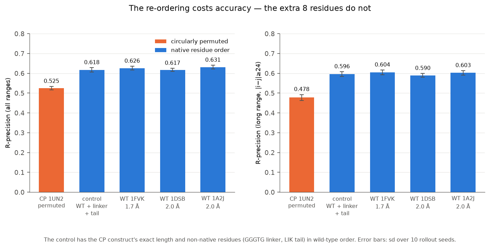
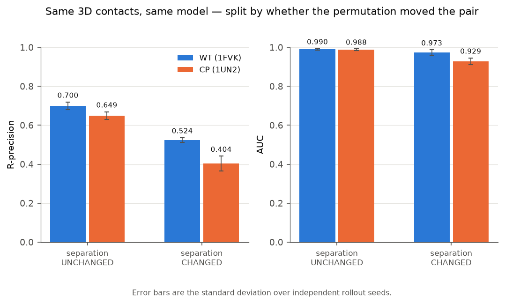
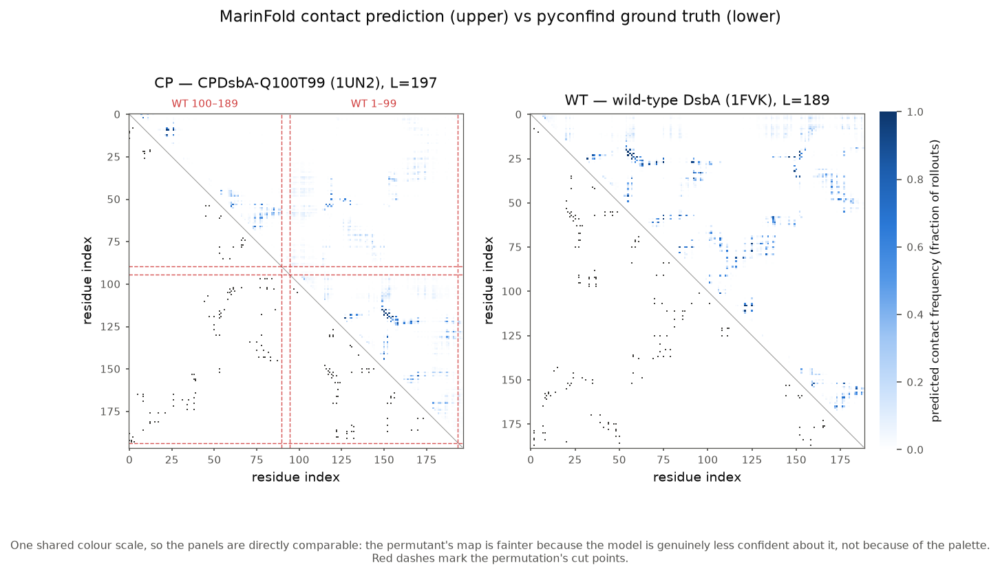
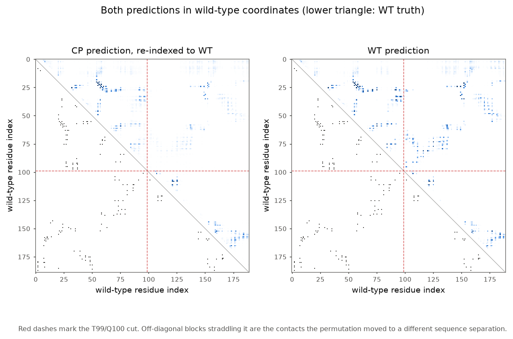
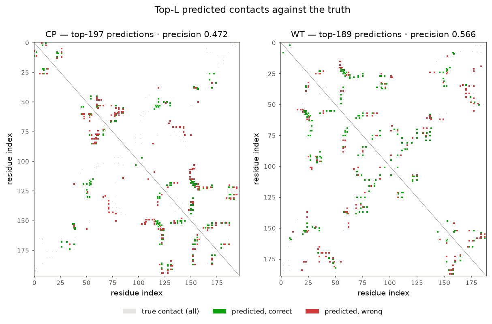
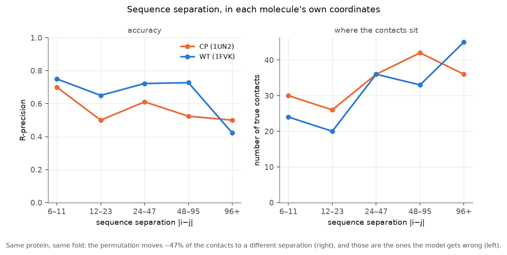

---
marinfold_experiment:
  issue: 224
  title: 'exp: does MarinFold fold a circularly permuted protein? (1UN2 CPDsbA-Q100T99 vs wild-type DsbA)'
  kind: evals
  branch: claude/marinfold-1un2-contacts-528538
---

# exp: does MarinFold fold a circularly permuted protein? (1UN2 CPDsbA-Q100T99 vs wild-type DsbA)

**Issue:** [#224](https://github.com/Open-Athena/MarinFold/issues/224) · **Kind:** `evals` · **Branch:** `claude/marinfold-1un2-contacts-528538`

## Question

Does MarinFold predict contacts for a **circularly permuted** protein as well as
it does for the natural, non-permuted parent — or does its accuracy come from
having memorised the parent's sequence→contact mapping at fixed sequence
separations?

## Hypothesis

A circular permutation is close to the ideal probe. `1UN2` (CPDsbA-Q100T99,
2.4 Å) has the same fold, the same residues and essentially the same 3D contact
set as wild-type *E. coli* DsbA — but the contact map in *sequence* coordinates
is reorganised: the chain is cut between T99 and Q100 and the halves swapped, so
every contact spanning the old termini changes sequence separation.

If the model reasons about the fold from local sequence, the permutant should be
fine. If it leans on a learned separation prior — or on retrieving the parent,
which is in AFDB and therefore almost certainly in exp199's training set — the
re-ordering should break it.

## Background

`1UN2` is "Crystal structure of circularly permuted CPDSBA_Q100T99: Preserved
Global Fold and Local Structural Adjustments". The construct decodes exactly as
named (verified against `P0AEG4`, mature numbering after the 19-residue signal
peptide — `prepare_inputs.py` derives the decomposition and asserts it):

| segment | mature DsbA residues | length |
|---|---|---|
| new N-term | **Q100 – K189** | 90 |
| linker | `GGGTG` | 5 |
| new C-term | **A1 – T99** | 99 |
| cloning tail | `LIK` | 3 |
| | **total** | **197** |

Related: [#94](https://github.com/Open-Athena/MarinFold/issues/94) (sequence-KNN
memorisation null model), [#213](https://github.com/Open-Athena/MarinFold/issues/213)
(train-set overlap audit), [#142](https://github.com/Open-Athena/MarinFold/issues/142)
(under-generation as a difficulty symptom).

## Approach

- **Model:** `contacts-v1-exp199-1.5B`, the `MODELS.yaml` default
  ([#199](https://github.com/Open-Athena/MarinFold/issues/199) CoreWeave p06-aug).
- **Inference:** exp82's fixed recipe — 100 rollouts/protein, fresh document
  realization each (resampled N-terminus + statement order), temperature 1.0,
  top-p 0.95, **top-k disabled**, budget 6L+128, vote by occurrence frequency.
  Repeated under **10 independent seeds**, because n=1 protein per arm needs an
  error bar. Local A5000, vLLM 0.11.0, ~50 s per seed for all five units.
- **Ground truth:** pyconfind side-chain contact degree via exp74's
  `pyconfind_contacts.compute_contacts` (imported, not forked), contact = degree
  ≥ 0.001 and |i−j| ≥ 6, remapped to input-sequence coordinates.
- **Metrics:** exp89's `compute_metrics` functions, imported verbatim.

Five units, chosen so every confound has its own control:

| unit | what it is | why |
|---|---|---|
| `cp_1un2` | the permutant, 2.4 Å | the test |
| `ctrl_identity` | WT + `GGGTG` + `LIK`, **unpermuted** | same length (197) and same non-native residues as CP, native order — isolates re-ordering from the extra residues |
| `wt_1fvk` | wild-type DsbA, 1.7 Å | the reference |
| `wt_1dsb`, `wt_1a2j` | wild-type, 2.0 Å | ground-truth noise floor: same molecule, three crystals |

Code: `prepare_inputs.py` → `score_rollout.py` → `analyze.py` → `plot.py`;
`build_notebook.py` emits the Colab notebook.

## Results

**The premise holds.** CP and WT really are the same fold: 88.5% of WT's
contacts are present in CP (Jaccard 0.734), against a crystal-to-crystal floor
of 0.85–0.88 for the two WT replicates. So any model gap is about *sequence*,
not structure. **47% of WT's contacts (74/156) cross the cut**, and for those the
separation transforms exactly as `CP_sep = 194 − WT_sep` (median 128 → 66).

### The permutation costs ~0.09 R-precision; the extra residues cost nothing

Mean ± sd over 10 rollout seeds, exp89 metrics:

| unit | L | R-prec (all) | R-prec (long) | P@L | AUC (all) | contacts/rollout |
|---|---:|---:|---:|---:|---:|---:|
| **`cp_1un2`** (permuted) | 197 | **0.5247 ± 0.0091** | **0.4781 ± 0.0145** | 0.4736 | 0.9524 | **140.7** |
| `ctrl_identity` (same length, native order) | 197 | 0.6177 ± 0.0104 | 0.5956 ± 0.0120 | 0.5508 | 0.9830 | 181.5 |
| `wt_1fvk` (1.7 Å) | 189 | 0.6259 ± 0.0096 | 0.6044 ± 0.0120 | 0.5651 | 0.9822 | 179.5 |
| `wt_1dsb` (2.0 Å) | 189 | 0.6174 ± 0.0077 | 0.5898 ± 0.0094 | 0.5884 | 0.9808 | 179.1 |
| `wt_1a2j` (2.0 Å) | 189 | 0.6313 ± 0.0093 | 0.6025 ± 0.0109 | 0.5921 | 0.9864 | 179.5 |

The identity control is the load-bearing row. It has the permutant's exact
length and its exact non-native residues, in wild-type order, and it scores
**0.6177** — indistinguishable from the three real WT crystals (0.617–0.631).
So the length and the linker cost ~0.008, inside noise. The permutation costs
**−0.0930** (Welch t = −21.3, p = 4.9 × 10⁻¹⁴), an order of magnitude larger
than either the seed spread (0.009) or the crystal spread (0.013).

For scale: exp199's average over the 554-protein benchmark is 0.5873, so
wild-type DsbA is a slightly-easier-than-average protein for this model, and the
permutant lands below average.

### The damage is concentrated on exactly the pairs the permutation moved

Same model, same residue pairs, same candidate universe, scored in WT
coordinates and split by whether the permutation changed that pair's sequence
separation:

| pair class | n pairs | arm | R-precision | AUC |
|---|---:|---|---:|---:|
| separation **unchanged** (within-segment) | 7,589 | WT | 0.7000 ± 0.0192 | 0.9897 ± 0.0041 |
| | | CP | 0.6494 ± 0.0197 | 0.9877 ± 0.0041 |
| | | **CP − WT** | **−0.0506** | **−0.0020** |
| separation **changed** (cross-segment) | 8,521 | WT | 0.5243 ± 0.0124 | 0.9733 ± 0.0145 |
| | | CP | 0.4038 ± 0.0380 | 0.9285 ± 0.0171 |
| | | **CP − WT** | **−0.1205** | **−0.0448** |

Pairs whose separation the permutation changed lose **2.4× more R-precision**
(−0.121 vs −0.051) and **22× more AUC** (−0.045 vs −0.002) than pairs it left
alone. That is the mechanism, isolated: it is not that the permutant is a
harder protein overall, it is that the model is specifically worse at the
contacts it has to place at an unfamiliar separation.

### The maps

Re-indexing the CP prediction into WT coordinates puts both panels in one frame.
The wild-type panel has dense signal in the block that straddles the cut
(residues ~1–99 × ~100–189); in the permutant that block is visibly thinner —
those are the contacts whose separation moved.

### The model hedges on the permutant

Every native-order unit emits ~180 contacts per rollout. The permutant gets
**140.7 ± 3.0** — a 22% drop, with no truncation anywhere (`frac_finished` = 1.000
on all 50 unit-seeds, at the 6L+128 budget). The model is not failing to finish;
it is declining to commit. This matches
[#142](https://github.com/Open-Athena/MarinFold/issues/142)'s reading of
under-generation as a difficulty symptom rather than a decoding bug.

Note too that CP's **AUC stays high (0.952)**. The model still ranks the map
well overall; what it loses is the ability to concentrate confidence into the
top-K — the same failure mode exp82 identified for contacts-v1 in general, here
triggered on demand by a re-ordering.

## Interactive notebook

[`notebooks/circular_permutation_1un2.ipynb`](../../notebooks/circular_permutation_1un2.ipynb)
— self-contained Colab: installs `marinfold` from the public repo, pulls
structures from RCSB, rebuilds ground truth with pyconfind, downloads the
checkpoint from the public bucket, and reproduces the analysis. No credentials.

Its last two cells are the point: **cut the chain wherever you like**, and sweep
several cut points. `CUT = 99` reproduces 1UN2; `CUT = 0` is the identity
permutation and must score like wild-type.

> The Colab badge points at `main`, so it goes live when this branch merges.

## Success criteria

Met. R-precision and AUC are reported for CP and WT on their own ground truth,
with the junction-spanning vs junction-preserved breakdown, seed error bars, a
crystal-replicate noise floor, and a length/composition control.

## Conclusion

**MarinFold is not just retrieving the parent protein — but a circular
permutation costs it a lot, and the cost falls precisely where the theory says
it should.**

The permutant keeps most of the model's skill (R-precision 0.525 vs 0.626 for
wild-type; AUC 0.952 vs 0.982), which rules out the strong memorisation story: a
lookup keyed on the parent's sequence→contact mapping at fixed separations would
have collapsed, not degraded by 16%. The model transfers real structural
information across a re-ordering it has never seen.

But the −0.093 gap is unambiguous, and the identity control shows it is caused by
the **re-ordering itself**, not by the 8 extra residues or the extra length. It
concentrates on the contacts whose sequence separation the permutation changed
(−0.121 R-precision, −0.045 AUC) and largely spares those it did not (−0.051,
−0.002). Together with the 22% drop in contacts emitted per rollout, the picture
is a model that has learned the fold *and* a strong prior over where in sequence
its contacts should live — and that leans on the prior more than a genuine folding
model would.

That is a concrete, mechanistic instance of the generalisation gap, on a natural
experiment nature already ran. The obvious follow-up is whether permutation
augmentation at training time closes it, and whether the closing transfers to
ordinary proteins — a cheap augmentation to test, since it needs no new
structures.

**Caveat.** n = 1 permutant. The internal contrast (same molecule, same model,
same 3D contacts, split by whether the pair moved) is what carries the argument;
the absolute CP-vs-WT gap rests on a single pair of crystals. The
[CATH/SCOP circular-permutation sets](https://doi.org/10.1093/nar/gkl217) would
turn this into a population result.
