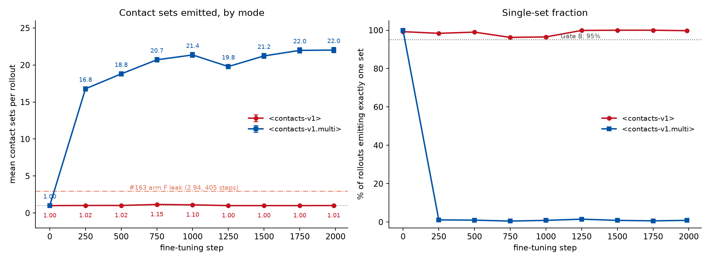

---
marinfold_experiment:
  issue: 230
  title: 'exp: fine-tune contacts-v1-exp199-1.5B into a clean <contacts-v1.multi> multi-draft model (on-policy drafts, PDB + AFDB, 30%-decontaminated)'
  kind: models
  branch: claude/finetune-contacts-v1-multi-b46f9b
---

# exp: fine-tune contacts-v1-exp199-1.5B into a clean <contacts-v1.multi> multi-draft model (on-policy drafts, PDB + AFDB, 30%-decontaminated)

**Issue:** [#230](https://github.com/Open-Athena/MarinFold/issues/230) · **Kind:** `models` · **Branch:** `claude/finetune-contacts-v1-multi-b46f9b`

## Question

Can we port [#163](https://github.com/Open-Athena/MarinFold/issues/163)'s `<contacts-v1.multi>` multi-draft format onto the current best base model (`contacts-v1-exp199-1.5B`) — with **on-policy** drafts, an **experimental-PDB** data component, and a protein pool **decontaminated at 30% identity** against the eval set — such that the resulting checkpoint (a) writes many diverse candidate contact maps under `<contacts-v1.multi>`, (b) is a **clean single-document decoder** under plain `<contacts-v1>`, and (c) gives up nothing on plain-mode R-precision?

This is the SFT starting point for best-of-N RL ([#200](https://github.com/Open-Athena/MarinFold/issues/200) / [#208](https://github.com/Open-Athena/MarinFold/issues/208)), which is a **separate** experiment and explicitly out of scope here.

## Hypothesis

**H1 — the format transfers to a stronger base.** #163 established that multi-draft generation is a loss-weight-profile question, not a capacity question: `w_draft` has to compete with `w_final` for the section-boundary transition, and arm **F** (header 0.1 / draft 1.0 / final 1.0) plus a **50% plain-rehearsal mix** is the configuration that both emitted ~15 candidates and held the base task (R-prec 0.3374 vs base 0.3357 — a tie). Nothing in that mechanism is specific to E8, so it should reproduce from exp199.

**H2 — the mode leak is an under-training artifact, and steps are the lever.** #163's arm F emits **~2.94 sections under the plain `<contacts-v1>` sentinel** — the leak this issue is chartered to fix. It was trained for **405 steps**. [#175](https://github.com/Open-Athena/MarinFold/issues/175) got a *completely* clean token-0 mode switch out of the same kind of marker on the same kind of 50:50 marked mixture — **0.1 vs 42.0 retracts per rollout on one checkpoint, prompt-selected** — after **2,070 steps**. The two runs differ by ~5x in optimization, not in mechanism. Predicted: mean sections in plain mode falls to ~1.0 somewhere between 405 and ~2,000 steps. **Intermediate checkpoints make this falsifiable rather than assumed** (see Approach, Phase 3).

**H3 — drafts must be on-policy, and the risk is diversity, not quality.** #163's drafts were E8 rollouts at ~12% per-contact precision. exp199 is a far stronger sampler (R-prec **0.6103** under exp82's reference worker, [#209](https://github.com/Open-Athena/MarinFold/issues/209)), and RL will sample from *this* model, so the training drafts must come from it. The preregistered risk is the opposite of the obvious one: a stronger sampler is a *more consistent* one, so candidate diversity may shrink below #163's mean Jaccard of 0.071 — and best-of-N reward is paid for by spread, not by mean quality. **Jaccard is a reported gate, not an afterthought.**

**H4 — experimental PDB is worth including here.** #222's corpora are the first contacts-v1 documents whose `<begin_statements>` section is a *measurement* rather than a prediction. The multi-draft document is exactly the place that distinction lands: drafts are model opinion, the final section is truth, and the model is being taught to tell them apart.

## Background

| Prior work | What this run takes from it |
|---|---|
| [#163](https://github.com/Open-Athena/MarinFold/issues/163) ([WRITEUP](https://github.com/Open-Athena/MarinFold/blob/main/experiments/exp163_models_teach_contacts_v1_to_refine_a/WRITEUP.md)) | The format (repeated `<begin_statements>`; only the final section closed by `<end>`), the id-7 rename, arm F's weight profile, the 50% rehearsal mix, `build_refinement_corpus.py` / `tokenize_refinement_corpus.py` / `reweight_corpus.py` / `refine_ft_common.py` / `dispatch_refine_train.py` / `gen_rollouts_worker_exp163.py` / `rprec_worker_tpu.py` |
| [#175](https://github.com/Open-Athena/MarinFold/issues/175) | The evidence that a token-0 mode marker becomes a clean on/off switch given enough steps on a marked 50:50 mixture |
| [#199](https://github.com/Open-Athena/MarinFold/issues/199) / [#204](https://github.com/Open-Athena/MarinFold/pull/204) | The base model |
| [#209](https://github.com/Open-Athena/MarinFold/issues/209) | exp82's worker is the **reference scorer**; exp199 reads 0.6103/0.5639, not the published 0.5873/0.5422 |
| [#222](https://github.com/Open-Athena/MarinFold/issues/222) / [#223](https://github.com/Open-Athena/MarinFold/pull/223) | The PDB corpora on the bucket |
| [#225](https://github.com/Open-Athena/MarinFold/issues/225) / [#229](https://github.com/Open-Athena/MarinFold/pull/229) | The Tier-A decontamination rule and its machinery (`sequence_droplist.py`, `decontam_lib.py`) |
| [#213](https://github.com/Open-Athena/MarinFold/issues/213) / [#226](https://github.com/Open-Athena/MarinFold/issues/226) | The 70.9M-sequence MMseqs2 training DB, `sequence_from_document`, and the eval2 query set |
| [#200](https://github.com/Open-Athena/MarinFold/issues/200) / [#208](https://github.com/Open-Athena/MarinFold/issues/208) | The consumer. exp200's whole RL stack already assumes **token id 7 = `<contacts-v1.multi>`** — matching that is a deliberate compatibility constraint |

#163 also left a falsification worth carrying: its **v2 100k-document sweep collapsed the base task by −44%** across four weight profiles (mdA–mdD, all with `w_draft` ≤ 0.3 and *no plain rehearsal*). The published arm F run differs in exactly two ways — `w_draft = 1.0` and the 50:50 plain mix — and is a tie with base. **Both are load-bearing; neither is optional.**

## Approach

### Phase 0 — protein pool and decontamination

Three sources, all already published and anonymously readable on `hf://buckets/open-athena/MarinFold`:

- `data/document_structures/contacts_v1/train` — AFDB (#53), 4.13M docs
- `data/document_structures/contacts_v1_esm_atlas/train` — ESM-Atlas (#139), 66.8M docs
- `data/document_structures/contacts_v1_pdb_deduped_monomers/documents` — **experimental PDB** (#222), 41,661 docs, one representative per RCSB 40% cluster, pre-shuffled

Draw the pool so the plain-rehearsal half stays close to exp199's own pretraining mixture (AFDB + ESM-Atlas) while PDB carries real weight: **all surviving PDB monomers**, plus AFDB and ESM-Atlas draws to fill. Target ≈100k distinct proteins.

**Decontamination — Tier A at 30%**, which is what "no ≥30% sequence similarity to the eval set" means operationally, and is #225's Tier A rule verbatim:

> drop any training row with **identity ≥ 30% over ≥ 50% query coverage**, **or** E ≤ 1e-3, against any eval query. MMseqs2 at `-s 7.5` (the #65/#94/#213/#225 convention — keep it so the numbers stay comparable), `--max-seqs 5000` (#226: exp213's *published* table used 5000, not the 2000 in its argparse default).

- **Queries: eval2's 776**, `data/contacts-v1-eval2-exp226/eval2.fasta` — a strict superset of the 554-protein #89 benchmark we gate on. Costs nothing extra and protects the benchmark we are moving to.
- **AFDB / ESM-Atlas arms:** reuse `/data/exp213_overlap/targetDB` directly. Its headers are `{arm}|{shard:05d}_{row}_{entry_id}`, so a hit names the corpus row and inverting hits into a drop list needs no join.
- **PDB arm:** build a fresh 41,661-sequence DB. Cheap. Note #222 already excludes the eval set's 552 PDB entries *by PDB id*, but measured **50.2% of eval entries still have a 40% homolog** in the corpus — id-exclusion is not identity-exclusion, and this is the arm where contamination is most likely.
- Sequences come from `contacts_v1.read.sequence_from_document` (inverts the generator; currently only on [#216](https://github.com/Open-Athena/MarinFold/pull/216)'s branch — land it or vendor it, don't rewrite it). Neither published corpus carries a `sequence` column.
- **Report the drop rate per arm.** Expect ~1.9% for AFDB and ~1.6% for ESM-Atlas (#225 Tier A); PDB unknown and probably higher.

### Phase 1 — on-policy rollouts from exp199

Source model: `checkpoints/prot-exp199-cw-cv1-s02-m1-p06-aug/hf/step-145199` on the bucket (verified: `vocab_size` 2845, `rope_theta` 500000 present at top level so #198's repair is in place, id 7 = `<contacts-and-distances-v1>`).

Sampling is exp82/exp142's settled recipe, **not** exp98's: `T=1.0`, `top_p=0.95`, **top-k disabled** (`-1` in vLLM), budget `6L+128`. **32 rollouts per protein**, every protein. Drop `logprobs` (~3.7x faster; only `pred` is used).

Fan-out: **8x A100-80GB, one engine per GPU** (`run_gpu_node_gen.sh`). The plan was CoreWeave `cw-rno2a` at batch priority (the standing rule), but that path is unavailable — the workstation's object-storage key is revoked. The marin-TPU route in `dispatch_rollouts.py` was tried next and is kept for its submission traps; the A100 node then made both moot, and made 32 rollouts at 100 % coverage affordable where the TPU budget forced 12 at 50 %. Write per-shard aggregate parquets (`entry_id`, `r`, `pred`), never per-protein files.

### Phase 2 — corpus

`build_corpus.py`, following #163's format with three deliberate departures:

| span | content |
|---|---|
| header | sequence, shuffled, fresh position numbering per document |
| draft × K | a real **exp199** rollout, subsampled from a truncated power law `P(n) ~ n^-0.5` on `{1..m}`; **K is packed, not drawn** — slots are added until the rollouts or the context run out |
| final | ground truth, closed by `<end>` — **treated identically to every draft**: same size law, same weight, no positional privilege |

The departures from #163, all deliberate:

1. **Disjoint proteins between the halves.** #163 drew both halves from the same proteins so the token-0 marker would be their only systematic difference. Here they share none — the arm-stratified draw matches their length distributions to 0.03 residues of mean L, which buys the same property without any protein being seen twice.
2. **One document per protein, one epoch.** No protein is repeated anywhere in the corpus.
3. **No cap on section size.** The power law replaces #163's fixed subsample cap, so a full-length section is always reachable (2.63 % of sections exceed 250 contacts; the largest observed is 649).

Plain rehearsal documents are generated by the ordinary contacts-v1 generator from the same decontaminated pool, so PDB appears in both halves.

Tokenize with the **2845-token renamed tokenizer** from `make_multi_tokenizer.py` (id 7 renamed in place; vocab size and every other id untouched, so no embedding resize and no id drift). Weight profile **F** — header 0.1 / draft 1.0 / final 1.0, plain documents 1.0 throughout, the `<eos>` slot explicitly zeroed. Run `reweight_corpus.py --selftest` (it guards the packing logic).

Size for **~2x #163's protein breadth**, so that a **single epoch** lands at **1,989 steps** at batch 128 — ~5x #163's 405 steps, which is the H2 lever. (The preregistration reached that step count with 2 epochs over a smaller pool; one epoch over a larger one is the same optimization without repeating a protein.)

### Phase 3 — training

Warm start from exp199 via `initialize_from_hf` (weights only: fresh optimizer, fresh schedule, step 0). #163's `refine_ft_common.py` `MODEL_CONFIG` **matches exp199's `config.json` exactly** — hidden 2048, intermediate 8192, 32 heads / 8 KV, 24 layers, llama3 rope at 500000, ctx 8192, vocab 2845 — so the training code transfers 1:1.

- lr **1e-4** cosine to `min_lr_ratio` 0.1, warmup 10%, AdamW wd 0.2 (#163 swept this: 3e-4 fit the multi-draft objective 0.3% better while degrading base-task retention by **+7.4% bpb**)
- batch 128 × 8192, `per_device_parallelism=-1`, **no microbatching** — levanter re-normalises per-token loss weights *per microbatch*, which would silently change the objective
- **1 epoch = 1,989 steps**, **checkpoint every ~250 steps** (levanter checkpoints every 29 and exports HF every 250), so the leak-vs-steps curve in H2 is measured rather than assumed and the earliest clean checkpoint can be selected

### Phase 4 — evaluation

Two gates and one report. Everything scored with **exp82's rollout+resample worker** and **exp89's `compute_metrics.py`** — and the **base model re-scored in the same batch**, because #209 showed exp199's published 0.5873 understates its own weights by 0.023 under the reference scorer.

- **Gate A — plain-mode accuracy is not lost** (the requirement this run exists to protect). Teacher-forced/rollout R-precision under plain `<contacts-v1>`, 554-protein #89 benchmark, paired against the base.
- **Gate B — no mode leak.** Free generation under plain `<contacts-v1>`: section count per rollout. This is the behaviour #163 shipped broken.
- **Report — multi mode works.** At `--max-sections 8`: `n_sections`, mean pairwise Jaccard, first/best/last section F1, `frac_improving`, termination rate, contacts per section.
- **Secondary:** eval2-natural (78 proteins at <40% id, #226) — the honest low-homology readout. Lead with it separately, never pooled: eval2 is 75% de novo design.

## Success criteria

**Gate A — plain `<contacts-v1>` accuracy (paired vs base, same batch, same scorer):**
- R-precision (all) ≥ base − **0.005** (#204's four-replicate noise span is 0.0023; this is 2x it)
- R-precision (long) ≥ base − **0.010**

**Gate B — clean mode switch under plain `<contacts-v1>`:**
- mean sections per rollout ≤ **1.05** (#163 arm F: 2.94)
- ≥ **95%** of rollouts emit exactly one section

**Multi mode is usable for RL (reported; blocks the RL hand-off, not this run):**
- ≥ 8 sections at `--max-sections 8` (it uses the budget)
- mean pairwise Jaccard ≤ **0.30** (exp200's diversity-collapse kill criterion)
- best-of-N section F1 exceeds last-section F1 by a margin outside noise

**Deliverable:** checkpoint published to `hf://buckets/open-athena/MarinFold/checkpoints/<run>/hf/step-N` with the **renamed tokenizer co-located**, rope key verified at publish time, ready to be consumed by #200/#208.

**Kill criteria:**
- plain-mode R-precision Δ < **−0.02** → this is #163's v1/v2 forgetting failure reappearing; stop and diagnose rather than tune
- mean contacts per section < 60% of base → degenerate short sections

## Run book

Every stage writes its own provenance JSON into `data/`. Paths below are the
defaults each script carries.

```bash
# 0. stage bucket shards + write the shard manifest (needs huggingface_hub>=1.5,
#    which cannot share an interpreter with marinfold -- see stage.py)
/home/bizon/anaconda3/bin/python stage.py --work /data/exp230_multi --arm pdb
/home/bizon/anaconda3/bin/python stage.py --work /data/exp230_multi --arm afdb --n-shards 44
/home/bizon/anaconda3/bin/python stage.py --work /data/exp230_multi --arm esm_atlas --n-shards 10

# 1. Tier-A/30% drop list against #226's 776 eval queries
python decontam.py --work /data/exp230_multi

# 2. the decontaminated protein pool, then DISJOINT halves for the two document
#    kinds (arm-stratified, so disjoint does not mean differently distributed)
python select_targets.py --work /data/exp230_multi --n-afdb 40000 --n-esm 40000 --n-pdb 0
python split_targets.py --work /data/exp230_multi --n-multi 260000 --n-plain 260000 --seed 230

# 3. on-policy rollouts from exp199 -- 32 per protein, one engine per GPU.
#    (dispatch_rollouts.py is the marin-TPU route, kept for its submission
#     traps; this run used the A100 node instead.)
./run_gpu_node_gen.sh

# 4. multi-draft + plain-rehearsal corpus, then profile F
python build_corpus.py --work /data/exp230_multi \
    --targets-multi targets_multi.parquet --targets-plain targets_plain.parquet \
    --docs-per-protein 1 --alpha 0.5 --seed 230
python make_multi_tokenizer.py --source /data/exp208_replication/model/C_bf16 \
    --out /data/exp230_multi/tokenizer_multi
python tokenize_corpus.py --in /data/exp230_multi/corpus \
    --out /data/exp230_multi/tokenized --tokenizer /data/exp230_multi/tokenizer_multi
#   ^ prints STEPS_PER_EPOCH (1,989), which the training run needs

# 5. fine-tune -- in-process on the node, one epoch, no dispatcher
python train_local.py --corpus '.../tokenized/*.parquet' --val '.../val/*.parquet' \
    --init .../model/exp199 --out .../checkpoints --steps 1989

# 6. eval targets: the 577-unit universe (554 legacy + 23), eval2 cuts as
#    columns. Applies BOTH of #89's filters -- MIN_SEP 6 and MIN_DEG 0.001.
python build_eval_targets.py --work /data/exp230_multi        # -> eval577_targets.parquet

# 7. Gate A. Refuses to start while train_local.py is alive: the drain step
#    kill -9's every process holding a card.
#    NB the final export is step-1988, not 1989 -- levanter exports on its own
#    cadence and the last one lands one step short of the step count.
FT=$HOME/exp230_data/checkpoints/hf/step-1988 \
TARGETS=$HOME/exp230_data/eval577_targets.parquet WHAT=rprec \
    setsid nohup ./run_gpu_node_eval.sh
#   exp82's score_rollout_worker.py VERBATIM, base and fine-tune concurrent on
#   4 GPUs each (#209: exp82's worker is the reference scorer, not #199's own)
python score_gate_a.py --rprec .../eval/rprec --targets .../eval577_targets.parquet \
    --base base --finetune finetune --out .../eval/gate_a

# 8. aggregation modes, the budget-matched plain baseline, and the curve.
#    run_all_evals.sh chains these; each stage waits for the GPUs to drain, so
#    it can be launched while Gate A is still running.
./run_agg_modes.sh          # 8a  multi, 8 rollouts, full context -> sections
./run_plain_baseline.sh     # 8b  plain, 22 rollouts, 6L+128      -> sections
./run_leak_curve.sh         # 8c  8 checkpoints x 2 modes, 200-protein subset

python score_agg_modes.py --sections .../eval/agg_sections \
    --targets .../eval577_targets.parquet --out data/ --label finetune
python score_agg_modes.py --sections .../eval/plain_sections \
    --targets .../eval577_targets.parquet --out data/ --label plain22 \
    --group-rollouts         # pools ROLLOUTS as candidates, not sections
python summarize_modes.py --rollouts .../curve/step-1988 --label step-1988   # Gate B
python plot_leak_curve.py --curve .../eval/curve --out plots/

# 9. publish. Both verify/repair before upload; neither ever passes delete=True.
HF_TOKEN=... python publish_to_hf_bucket.py --src .../checkpoints/hf/step-1988 \
    --run plm-exp230-cv1-multi-1_5b-lr1e-4-e1-cos-a100 --step 1988
HF_TOKEN=... python publish_corpus.py --data ~/exp230_data

# tests (28): corpus invariants, the Gate A reducer, the publisher's rope
# repair, the Gate B counters, and the five aggregation rules
python -m pytest test_corpus.py test_gate_a.py test_publish.py \
    test_modes.py test_agg_modes.py -q
```

### Environments

Three interpreters, and they cannot be merged:

| what | interpreter | why |
|---|---|---|
| bucket staging | system python (`huggingface_hub` 1.5) | the bucket API does not exist below 1.5; `snapshot_download` cannot see buckets at all |
| corpus / tokenizer / local generation | `/data/exp208_replication/venv` | has `marinfold` + vLLM + a transformers that pins `huggingface_hub<1` |
| iris submission | `/home/bizon/git/marin-freshiris/.venv` | iris rejects a client more than 14 days old |

## Results

**Status: COMPLETE.** Both gates pass. The fine-tune holds plain-mode
R-precision (−0.0025 on the legacy 554, inside the −0.005 tolerance; **+0.0027**
on eval2-natural) and switches modes cleanly (1.008 sections under plain against
#163's 2.94). The checkpoint and the corpus are published.

The one negative result, stated up front: **at matched sampling budget the multi
format is not an accuracy win**. 22 independent plain rollouts, consensus-voted,
read 0.5896 where one multi rollout's 22 sections read 0.5673. The format's value
is that it carries many candidates inside a single sequence — which is what the
RL hand-off needs — not that it predicts contacts better per unit of compute.

### Stage 0 — decontamination (DONE)

Tier A at 30 % identity (#225's rule) against #226's **776** eval queries, which
this run verifies key-for-key and sequence-for-sequence to be a strict superset
of #225's 554 rather than assuming it.

| arm | corpus documents | dropped | rate |
|---|---|---|---|
| `afdb` (#53) | 4,129,682 | 109,085 | 2.64 % |
| `esm_atlas` (#139) | 66,759,922 | 1,311,485 | 1.96 % |
| **`pdb`** (#222 deduped monomers) | 41,647 | 2,254 | **5.41 %** |

Two findings worth carrying out of this stage:

- **The experimental-PDB arm is ~3x more contaminated than AFDB.** That is what
  #222's 50.2 % eval-side leakage predicted: it excluded the eval set's 552 PDB
  entries **by id**, and id exclusion is not identity exclusion. Within the
  quality-filtered pool the rate is higher still (2,010 / 29,120 = 6.9 %) —
  contaminated PDB entries skew toward well-resolved structures, which are
  exactly the ones that pass a quality gate.
- **The 222 net-new eval2 queries are not a rounding error** on top of #225's
  554. They add **31,198** fresh AFDB drops (+40 % on #225's 77,887) and ~286k
  fresh ESM-Atlas drops. This is #226's finding from the other side: newer PDB
  entries are **more** homologous to training data, not less.

Pool: **107,110 proteins** — 40,000 AFDB (round 0), 40,000 ESM-Atlas, 27,110 PDB
— feeding *both* halves of the corpus, so the token-0 mode marker is the only
systematic difference between them.

| arm | n | L median | L p90 | GT contacts median |
|---|---|---|---|---|
| afdb | 40,000 | 170 | 368 | 118 |
| esm_atlas | 40,000 | 204 | 383 | 172 |
| pdb | 27,110 | 182 | 380 | 155 |

### Stage 1 — on-policy drafts (DONE)

Two provisional numbers preceded the real one, biased in opposite directions.
The complete set replaces both:

| sample | rollouts | precision | why it was not quotable |
|---|---:|---:|---|
| 6-protein local smoke | 48 | 0.411 | far too small to mean anything |
| first 4 GCS parts | 24,000 | 0.297 | the shortest proteins only |
| **complete set** | **8,319,968** | **0.4095** | — |

Over every rollout generated: **precision 0.4095, recall 0.4142, F1 0.4090**.
Precision and recall land within 0.005 of each other, so exp199 predicts close to
the right *number* of contacts and its error is in *which* ones — which is
exactly the error a refinement format is supposed to be able to fix.

Both provisional figures were artifacts of the same cause: each shard walks its
targets in **ascending length**, so whatever lands first is the short tail of the
pool, where there are few valid pairs and the model over-generates. The smoke
drew a more typical length mix and landed within 0.0015 of the truth — but that
is luck, not vindication. A 48-rollout sample had no business being that close,
and the 24,000-rollout sample that looked far more trustworthy was off by 0.11.

The qualitative claim the design rests on holds: an exp199 draft is far more
precise than the ~0.12 of #163's E8 drafts. That **sharpens** the preregistered
risk in H3 rather than softening it — a stronger sampler is a more consistent
one, so candidate diversity (Jaccard), not draft quality, is the number to watch.

#### 32 rollouts per protein, at 100 % coverage

An earlier revision of this README planned **12** rollouts per protein on a marin
`v6e-4` fleet, sized against an 11-slot cap and a 50 % snapshot, with
`--docs-per-protein 7` and 2 epochs compensating for the partial pool. Moving to
the 8x A100 node made all three compromises unnecessary: **32 rollouts, every
protein, one document each, one epoch**. Nothing is subsampled and no protein is
seen twice.

### Format plumbing — verified, not asserted

- Renaming vocab id 7 in exp199's own tokenizer leaves vocab at **2845** with
  **zero id drift** and an exact round trip; published as
  [`timodonnell/contacts-v1-multi-tokenizer`](https://huggingface.co/timodonnell/contacts-v1-multi-tokenizer).
- Regenerating a rehearsal document from ground truth parsed out of the
  published document is **lossless** — sequence, length and contact set
  identical on 300/300 PDB rows (`test_corpus.py`).
- Profile F materialises with the restart slot and the stop slot at **exactly
  equal weight**, which is the property #163 showed decides whether the model
  ever emits a second section.
- `<eos>` and pad positions carry weight 0, so no document's last weight can
  supervise the first token of the next one in a packed row.

### Stage 2 — the corpus (DONE)

Every number here is measured on the built artifact (519,998 rows across 6
shards) rather than on the code that was meant to build it. The full writeup,
with ten sampled documents, is **[DOCUMENTS.md](DOCUMENTS.md)**.

| | multi | plain | total |
|---|---:|---:|---:|
| documents | 259,999 | 259,999 | 519,998 |
| unique proteins | 259,999 | 259,999 | 519,998 |
| tokens | 1,436,794,528 | 247,684,213 | 1,684,478,741 |
| mean tokens/doc | 5,526 | 953 | 3,239 |

| | |
|---|---|
| sequences | 254,493 of 8,192 |
| packing density | 80.7 % |
| protein overlap between halves | **0** |
| documents per protein | **1** (max, both halves) |
| dropped | 0 |
| **steps/epoch at batch 128** | **1,989** |

Arm mix is identical in both halves by construction (afdb 123,222 / esm_atlas
123,222 / pdb 13,555), and the halves match to **0.03 residues of mean L** — the
arm-stratified draw is what lets the two halves be disjoint without becoming
different distributions.

Three findings from measuring it:

- **1:1 by document is 84/16 by gradient.** A multi document is ~5.8x longer:

  | | multi | plain |
  |---|---:|---:|
  | documents | 50.00 % | 50.00 % |
  | raw tokens | 85.30 % | 14.70 % |
  | **supervised loss weight** | **84.37 %** | **15.63 %** |

  The 0.1 header weighting recovers about a point (14.70 → 15.63 %) because it
  discounts the sequence section of multi documents but not of plain ones.
  Summing the per-document weights gives 1,584,417,457 against the
  1,582,200,150 actually written into the tokenized parquet — a 0.14 % gap,
  which is the zeroed `<eos>` slot on each of the 254,493 packed rows. 1:1
  documents, 1 document per protein and full context packing cannot *all* hold
  and also give a 50/50 token split. This is the first knob to turn if Gate A
  regresses.
- **The K=32 spike is the rollout budget, not the context.** K averages 28.08 and
  **66.3 %** of multi documents sit at exactly 32 — meaning the packer consumed
  every available candidate and still had context left. Only the other 33.7 % are
  context-bound. Longer multi documents need *more rollouts per protein*; a bigger
  context would do nothing for two-thirds of the corpus.
- **No positional bias in section size.** Sections are drawn from a truncated
  power law (`P(n) ~ n^-0.5` on `{1..m}`): mean **58.01** contacts, median 33,
  p90 148, p99 324, max **649**,
  **2.63 %** above the old 250 cap, so full-length drafts genuinely occur. Mean
  contacts by slot is flat at 61-66 across slots 0-11, where an earlier build that
  clipped each draw to the remaining budget ran ~56 early against 36-45 late — a
  positional signal the model could have learned instead of reading the candidate.

A pre-flight build of 47k documents against the live rollout prefix caught the
one gap that would have stopped this stage dead: the interpreter that has
`marinfold` had **no `gcsfs`**, so the corpus build could not read its own input.
It failed in under four seconds with an `ImportError` an output filter had hidden.

### Stage 3 — the fine-tune (DONE)

`train_local.py` in-process on the 8x A100 node, warm-started from exp199.
Single epoch, **1,989 steps**, run name
`plm-exp230-cv1-multi-1_5b-lr1e-4-e1-cos-a100`
([W&B](https://wandb.ai/timodonnell/MarinFold/runs/plm-exp230-cv1-multi-1_5b-lr1e-4-e1-cos-a100)).
21.5 s/it, 11.9 h end to end, zero errors.

Base-task retention on exp53's canonical held-out split, unmasked — **monotonic
at every checkpoint**:

| step | 250 | 500 | 750 | 1000 | 1250 | 1500 | 1750 | 1988 |
|---|---|---|---|---|---|---|---|---|
| val loss | 2.9818 | 2.9788 | 2.9778 | 2.9764 | 2.9747 | 2.9731 | 2.9720 | **2.9714** |

#163's four un-rehearsed weight profiles each lost ~44 % of the base task. At
15.6 % rehearsal weight that does not happen.

**Published:**
`checkpoints/plm-exp230-cv1-multi-1_5b-lr1e-4-e1-cos-a100/hf/step-1988/` on the
public bucket — 5.89 GB, tokenizer co-located, rope repaired for
transformers-4.x, verified anonymously readable.

### Gate A — plain-mode accuracy is not lost (PASS)

Base and fine-tune scored in **one run** by exp82's worker, 4 GPUs each, paired
per protein. R-precision (all), 100 rollouts per protein:

| cut | n | base | fine-tune | Δ | 95 % CI | |
|---|---:|---:|---:|---:|---|---|
| legacy 554 | 554 | 0.6083 | 0.6058 | **−0.0025** | [−0.0053, +0.0001] | within tolerance |
| eval2 | 307 | 0.5430 | 0.5403 | −0.0027 | [−0.0064, +0.0010] | |
| **eval2-natural** | 78 | 0.3354 | **0.3381** | **+0.0027** | [−0.0033, +0.0088] | *lead with this* |
| eval2 <30 % | 275 | 0.5406 | 0.5388 | −0.0018 | [−0.0058, +0.0022] | |

Long-range R-precision (separation ≥ 24), criterion base − 0.010:

| cut | base | fine-tune | Δ | 95 % CI |
|---|---:|---:|---:|---|
| legacy 554 | 0.5614 | 0.5583 | −0.0031 | [−0.0063, +0.0003] |
| eval2 | 0.4886 | 0.4835 | −0.0051 | [−0.0093, −0.0007] |
| eval2-natural | 0.2926 | 0.2913 | −0.0014 | [−0.0075, +0.0049] |
| eval2 <30 % | 0.4853 | 0.4806 | −0.0047 | [−0.0093, −0.0001] |

Met everywhere; worst case −0.0051. Note the eval2 pooled and <30 % CIs exclude
zero — a small long-range loss that is statistically real but an order of
magnitude inside the tolerance.

**The base reproduces its published reference**, which is what makes this
trustworthy rather than merely self-consistent: 0.6083 / 0.5430 / 0.3354 measured
against 0.611 / 0.545 / 0.337 published — all within 0.003, *including* the
MIN_DEG ground-truth fix. Had that fix been wrong, the base would have missed its
own number.

**One nuance the mean hides.** The fine-tune wins on 198 proteins and loses on
258 of the legacy 554. That direction is consistent enough to be significant
under a sign test, even though the magnitude sits at #204's 0.0023 noise floor
and inside the preregistered −0.005 tolerance. A small *consistent* cost, not
noise — and it reverses on eval2-natural.

### Gate B — the mode switch is clean (PASS)

| | measured | bar | |
|---|---:|---:|---|
| mean sections, plain mode | **1.008** | ≤ 1.05 | PASS |
| rollouts emitting exactly one set | **99.8 %** | ≥ 95 % | PASS |

#163's arm F read **2.94** here. Counts are uncapped (`n_sections_raw`).

### Published artifacts

| what | where | size |
|---|---|---|
| checkpoint | `checkpoints/plm-exp230-cv1-multi-1_5b-lr1e-4-e1-cos-a100/hf/step-1988/` | 5.89 GB |
| corpus | `data/document_structures/contacts_v1_multi_exp230/` | 6.26 GB |

Both on the public `open-athena/MarinFold` bucket and **verified anonymously
readable**. The checkpoint ships its tokenizer co-located and its rope config
repaired for transformers-4.x readers (`rope_theta` restored beside
`rope_parameters`). The corpus carries `train/` (519,998 documents),
`tokenized/` (`input_ids` + `loss_weights` — profile F as actually trained) and
`tokenizer/`.

### The leak-vs-steps curve



| step | 0 (base) | 250 | 500 | 750 | 1000 | 1250 | 1500 | 1750 | 1988 |
|---|---:|---:|---:|---:|---:|---:|---:|---:|---:|
| plain, mean sets | 0.998 | 1.019 | 1.023 | 1.154 | 1.105 | 1.001 | **1.000** | **1.000** | 1.008 |
| plain, % single | 99.3 | 98.4 | 99.0 | 96.3 | 96.5 | 99.9 | **100.0** | **100.0** | 99.8 |
| multi, mean sets | **0.999** | 16.78 | 18.80 | 20.71 | 21.36 | 19.79 | 21.23 | 21.98 | **22.02** |
| multi, % single | 99.9 | 1.1 | 1.0 | 0.5 | 0.9 | 1.5 | 0.9 | 0.6 | 0.9 |
| multi, finished | 1.00 | 0.92 | 0.77 | 0.51 | 0.54 | 0.78 | 0.56 | 0.60 | 0.65 |

**Step 0 is measured for both modes, not left blank.** Vocab id 7 is renamed *in
place*, so the base model handed the multi marker sees the identical integer —
pairing exp199's weights with the renamed tokenizer is the honest step-0 reading
of "what does this model do with this token", not a trick. It emits **0.999**
sets: the base is a single-document decoder under *either* marker. The fine-tune
moves that one number from 1 to 22 while leaving the plain marker at 1.

That is the cleanest statement of what this run did: **one token's behaviour
changed, and nothing else did.**

**H2 is answered, but not the way it was posed.** The prediction was that the
leak closes somewhere between 405 and ~2,000 steps. In fact it **never opened**:
plain mode sits at ~1.0 from step 250, peaks at 1.15 around step 750, and is
exactly 1.000 at steps 1500 and 1750. #163's 2.94 is not on this curve's scale.
So the leak was never a step-count problem at this rehearsal ratio — 50 % plain
documents by count was enough on its own, and the extra optimization bought
stability rather than the fix itself.

Both curves are plotted together on purpose: plain falling to 1.0 *alone* is
equally consistent with the model having **lost** the format, and multi staying
high alone says nothing about the leak. Only the pair distinguishes a mode
*switch* from a mode *collapse*.

Note `finished` in multi mode is 0.51–0.65: about a third to a half of multi
rollouts run to the context limit instead of emitting `<end>`. #163 reported
~56 % finishing, so this is in family.

### The five aggregation modes, and the budget-matched baseline

The obvious comparison — Gate A's plain 0.6058 against the multi modes — is not
budget-matched: Gate A votes **100 rollouts** where each multi number uses **one**
rollout's ~22 sections. So plain was re-run at **22 rollouts** and the *same three
aggregation rules* were applied to the 22 rollouts that were applied to the 22
sections. Same model, same sampler, same metric; the only difference is whether
the 22 candidate contact sets came from 22 independent rollouts or from one
rollout.

R-precision (all), legacy 554:

| aggregation | plain, 22 rollouts | multi, 1 rollout (~22 sections) |
|---|---:|---:|
| single candidate | 0.4454 | 0.4566 *(`last`)* / 0.4284 *(`second_last`)* |
| best — **ORACLE** | 0.5680 | 0.5342 |
| consensus | **0.5896** | 0.5673 |
| *(reference: plain, 100 rollouts)* | *0.6058* | — |

| cut | plain single | plain best* | plain consensus | multi consensus | multi best* |
|---|---:|---:|---:|---:|---:|
| legacy 554 | 0.4454 | 0.5680 | **0.5896** | 0.5673 | 0.5342 |
| eval2 | 0.3626 | 0.5107 | **0.5236** | 0.5029 | 0.4727 |
| eval2-natural | 0.1718 | 0.3017 | **0.3130** | 0.2889 | 0.2600 |
| eval2 <30 % | 0.3612 | 0.5127 | **0.5229** | 0.5024 | 0.4731 |

\* ORACLE selects using ground truth — a ceiling, not a deployable result.

Four things fall out, and one of them is a negative result:

1. **At matched budget, independent rollouts beat one rollout's sections** —
   consensus 0.5896 vs 0.5673, oracle-best 0.5680 vs 0.5342, on every cut. The
   multi format is not an accuracy win over simply sampling more.
2. **Consensus beats the ORACLE best single candidate**, in both regimes
   (0.5896 > 0.5680; 0.5673 > 0.5342). Voting across candidates is better than
   the best candidate *even with ground-truth selection* — they carry
   complementary information rather than being noisy copies of one guess. This is
   the finding that matters for best-of-N RL.
3. **A multi rollout's last section beats a single plain rollout** (0.4566 vs
   0.4454), and `last` > `second_last` (0.4284). The ordering is meaningful: the
   model treats its final section as a commitment, which is what the training
   format taught even though drafts were shown in random order.
4. **The diversity gap is measurable directly.** The union of 22 independent
   plain rollouts covers **1,065** distinct pairs; 22 sections of one multi
   rollout cover **658**. Independent sampling explores ~62 % more of the space,
   which is exactly why its consensus is better.

### H3's preregistered risk materialized

Mean pairwise Jaccard between a multi rollout's sections is **0.304**, against
#163 arm F's **0.071** — 4.3x more similar, and just past exp200's 0.30
diversity-collapse criterion. This was called in advance: exp199 is a stronger
and therefore *more consistent* sampler, and best-of-N is paid for by spread.

The spread that matters is nonetheless real and not subtle: best-section F1
exceeds last-section F1 by **+0.0845 ± 0.0039**, over 20σ. Lower diversity than
#163, still productive diversity — but finding 4 above says an RL loop that can
afford independent rollouts should prefer them.

### Parameters, in full

**Protein pool and decontamination**

| | |
|---|---|
| sources | AFDB `contacts_v1/train` (round-0 shards 1596–2066 only), ESM-Atlas `contacts_v1_esm_atlas/train`, PDB `contacts_v1_pdb_deduped_monomers` |
| quality gates | AFDB/ESM `global_plddt >= 80`; PDB `resolution <= 9 Å` (NMR, which reports none, kept) |
| shared filters | `seq_len <= 512`, `>= 5` contacts, not `truncated` |
| decontamination | Tier A (#225): identity **>= 30 %** over >= 50 % query coverage, **or** E <= 1e-3 |
| search | MMseqs2 `-s 7.5`, report ceiling E <= 10, against #226's **776** eval queries |
| drop rates | afdb 2.64 %, esm_atlas 1.96 %, pdb 5.41 % |

**Rollout generation** (`run_gpu_node_gen.sh`)

| | |
|---|---|
| model | exp199 `step-145199` |
| rollouts per protein | **32** |
| sampler | `T=1.0`, `top_p=0.95`, **`top_k=-1` (disabled)**, budget `6L+128` |
| engine | vLLM, **one engine per GPU**, `tensor_parallel_size=1`, `gpu_memory_utilization=0.90`, `max_num_seqs=512`, chunk 16 |
| total | 8,319,968 rollouts; precision 0.4095 / recall 0.4142 / F1 0.4090 |

**Corpus** (`build_corpus.py`)

| | |
|---|---|
| seed | 230 |
| documents per protein | **1** |
| halves | 259,999 multi + 259,999 plain, **disjoint proteins**, arm-stratified |
| section-size law | truncated power law `P(n) ∝ n^-α` on `{1..m}`, **α = 0.5**, no cap |
| section count K | **packed**, not drawn — slots added until rollouts or context run out |
| context | 8,192 |
| tokenizer | id 7 renamed in place, vocab **2,845**, no resize |
| loss weights | **profile F**: header 0.1 / each draft 1.0 / final 1.0; plain documents uniform 1.0; `<eos>` slot 0 |

**Training** (`train_local.py`)

| | |
|---|---|
| init | exp199, weights only (fresh optimizer, fresh schedule, step 0) |
| lr | **1e-4** cosine → `min_lr_ratio` 0.1, warmup 10 % |
| optimizer | AdamW, wd **0.2** |
| batch | **128 × 8,192**, `per_device_parallelism=-1`, **no microbatching** (levanter renormalises loss weights per microbatch) |
| schedule | **1 epoch = 1,989 steps**; levanter checkpoint every 29, HF export every 250 |
| hardware | 8 × A100-80GB, 21.5 s/it, 11.9 h |

**Evaluation**

| | |
|---|---|
| targets | **577-unit universe** = exp89's 554 + exp226's 23 |
| ground-truth filters | `MIN_SEP 6` **and `MIN_DEG 0.001`** — the degree filter drops **21.7 %** of separation≥6 pairs (minimum degree 1.2e-12). Omitting it inflates `n_gt` ~22 %, and since R-precision cuts at R = n_true that silently makes every number incomparable with #180's frontier |
| cuts | legacy554 (554), eval2 (307), **eval2-natural (78)**, eval2 <30 % (275) |
| Gate A | exp82's `score_rollout_worker.py` **verbatim**, 100 rollouts, `T=1.0 top_p=0.95 top_k=-1`, `--no-per-request-seed`, `gpu_frac 0.90`; base + fine-tune concurrent, 4 GPUs each |
| metric | exp89's `compute_metrics` **imported, not copied**; R at `cut = n_true` |
| Gate B / curve | `eval_modes_worker.py`, 4 rollouts, `max_sections 16`, seeded 200-protein subset identical across checkpoints |
| aggregation modes | `eval_agg_worker.py --mode multi`, 8 rollouts, full context |
| budget-matched plain | `eval_agg_worker.py --mode plain`, **22 rollouts**, budget `6L+128` |
| CI | paired per-protein bootstrap, 10,000 resamples, seed 230 |

### Hardware notes

This run is on an **8x A100-80GB node**, not marin TPU and not CoreWeave.
CoreWeave is unavailable — the workstation's object-storage key is revoked (every
request, every bucket, and anonymously). The TPU path was used for the first
rollout attempt and its submission traps are documented in
`dispatch_rollouts.py`: current marin has **dropped the `vllm` extra**, the IAP
credential cache is keyed on cluster *name* (so `--cluster=<path>` submits
unauthenticated), and name resolution reads the CWD's checkout.

On the A100 node, one engine per GPU with `tensor-parallel-size 1` beats an 8-way
split — a 1.5B model fits one card with room to spare, so 8 independent engines
give 8x the batch concurrency and no cross-GPU traffic. Two traps cost real time
and are guarded in the launchers: vLLM renames its child to `VLLM::EngineCore`,
so `pkill -f <worker>` matches only the parent and leaves engines holding ~74 GB
each (and vLLM sizes its KV cache from *free* memory, so a relaunch into those
orphans kills all 8 new engines at once); and a **shared inductor compile cache**
raced across 8 simultaneous engine builds and killed 5 of 8 GPUs — split per-GPU,
compilation is both safe and 23 % faster than `--enforce-eager`.

One open defect, deliberately not fixed mid-run: levanter mishandles a `file://`
URI and stages checkpoint temps into a literal `./file:` directory inside the
repo, **17 GB per checkpoint, never cleaned** (346 GB by step 500, projecting
~1.2 TB by step 1989). Disk is 17 TB free so it cannot threaten the run, and
deleting during training risks clobbering an in-flight write.

## Conclusion

**The format ports to exp199 at essentially no cost to the base task, and the
mode marker is a clean switch.** Gate A: −0.0025 R-precision on the legacy 554
(inside the preregistered −0.005), **+0.0027** on eval2-natural. Gate B: 1.008
sections under the plain sentinel, 99.8 % single-set, against #163 arm F's 2.94.
The checkpoint is published and ready for #200/#208.

**H1 confirmed.** Arm F's weight profile plus a 50 % plain-rehearsal mix
reproduces from a much stronger base, exactly as the mechanism predicted.

**H2 answered, but the premise was wrong.** The leak was framed as an
under-training artifact that more steps would close. It never opened: plain mode
sits at ~1.0 sections from step 250 and is exactly 1.000 at steps 1500/1750. At
this rehearsal ratio the 50 % plain mix was sufficient on its own; the extra
optimization bought stability, not the fix. A future run could likely spend far
fewer than 1,989 steps.

**H3's risk materialized, and it has a consequence.** Jaccard 0.304 vs #163's
0.071 — a stronger sampler is a more consistent one, as preregistered. The
concrete cost shows up in the budget-matched comparison: **22 independent plain
rollouts beat one multi rollout's 22 sections** under every aggregation rule
(consensus 0.5896 vs 0.5673). The union of 22 independent rollouts covers 1,065
distinct pairs against 658 for one rollout's sections — ~62 % more of the space.

**H4 is not answered here.** PDB is 5.2 % of each half, which is the whole
eligible experimental pool after decontamination, and nothing in this run
isolates its contribution. It would need an ablation.

**What this means for the RL hand-off (#200/#208).** Two results point in
opposite directions and both matter:

* **Consensus beats the ORACLE best single candidate** in both regimes. Candidate
  sets carry complementary information rather than being noisy copies, so a
  reward that can exploit *combinations* has more to work with than best-of-N
  over individual candidates.
* **Independent rollouts are more diverse than one rollout's sections.** If the
  RL loop can afford N independent rollouts, it should prefer them to N sections
  of one. The multi format's advantage is that it puts many candidates inside a
  *single sequence* — which is what makes in-context refinement expressible at
  all — not that its candidates are better.

**Open, in order of value:** an ablation isolating the PDB component (H4); a
shorter run to find where the mode switch actually becomes clean (the curve says
well before 1,989 steps); and whether the diversity gap can be widened at
generation time (temperature or an explicit diversity term) without giving back
the accuracy.
