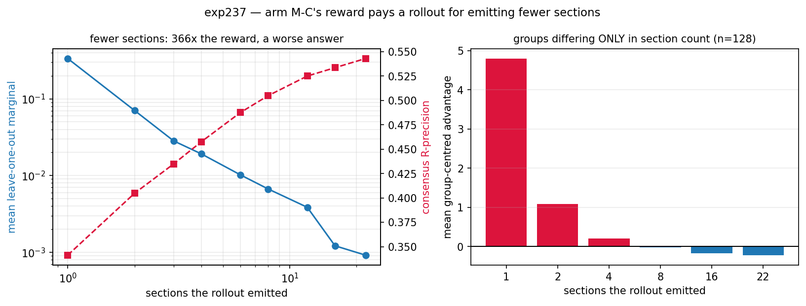
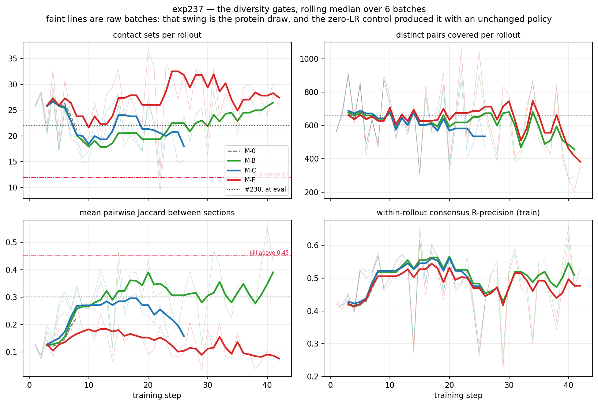
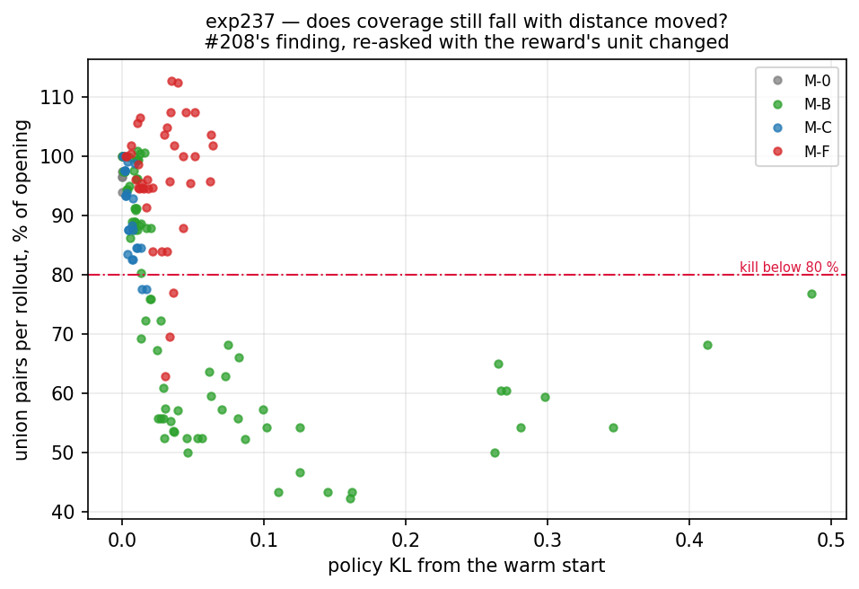

# exp237 results — RL on `<contacts-v1.multi>`, section-level rewards

**Issue [#237](https://github.com/Open-Athena/MarinFold/issues/237) · warm start
`plm-exp230-cv1-multi-1_5b-...-a100/hf/step-1988` · 8×A100-80GB · every number
scored by #230's `eval_agg_worker.py` + `score_agg_modes.py`, unchanged**

> **Status: in progress.** Sections are filled in as arms land; anything not yet
> measured says so rather than being left to look measured.

## The bar

R-precision (all), legacy 554, from #230:

| what | R-prec |
|---|---:|
| **plain, 22 rollouts voted** — the budget-matched bar | **0.5896** |
| multi, consensus over ~22 sections — the warm start | 0.5673 |
| multi, oracle best section (ORACLE) | 0.5342 |
| multi, last section | 0.4566 |

**Primary criterion: multi consensus > 0.5896.** Beating the warm start's own
0.5673 is necessary but not sufficient.

## Phase 0 — arm M-C's reward exists, and is not a restatement of F1

Measured offline on #230's own generations — 577 proteins × 8 multi rollouts ×
~22 sections, 4,614 rollouts, no GPU. [`phase0_marginals.py`](phase0_marginals.py).

| quantity | value | what it decides |
|---|---:|---|
| rollouts with a non-degenerate marginal spread | **92.4 %** | **Gate 1.** Below ~50 % and M-C trains mostly on zeros |
| ρ(section marginal, section F1) | **0.337** | **Gate 2.** Near 1.0 and M-C is M-B with extra steps |
| individual section marginals that are exactly 0 | 45.2 % per rollout, **54.9 % pooled** | the honest cost: more than half of all sections change no vote |
| ρ(marginal, section novelty) | −0.087 | it is not novelty either |
| ρ(marginal, section size) | 0.045 | and it is not rewarding volume |
| pooled sd of section marginals | 0.0119 | the scale the unit normalisation removes |

Both gates pass. For context, the same pass reproduces #230's published multi
behaviour on the eval set: 22.21 sections per rollout, mean pairwise Jaccard
0.327, 680.8 union pairs, within-rollout consensus 0.5589, best-section F1 0.5541
against last-section 0.4780.

## The warm start, re-measured inside SkyRL's own vLLM

#230 measured its checkpoint under vLLM 0.27 / transformers 5.15; SkyRL's venv is
vLLM 0.23 / transformers 5.8, a different reader of the same rope config, and a
reader that misses the llama3 scaling loses 0.76 nats/token **silently** (#163's
retraction). [`probe_multi_generation.py`](skyrl/probe_multi_generation.py), 64
rollouts on the actual training prompts:

| | probe | #230, at eval |
|---|---:|---:|
| per-contact precision | **0.4136** | 0.4095 *(over 8.3M rollouts)* |
| sections per rollout | 25.0 | 22.0 |
| union pairs per rollout | 623 | 658 |
| mean pairwise Jaccard | 0.200 | 0.304 |
| generated tokens | 5,149 | ~6,760 |
| sampled ids outside the 2,845 vocabulary | **0** | — |

Precision lands within 0.004 of a number measured over 8.3 million rollouts, so
rope, the tokenizer and the mode marker all survived the port.

## Arm M-0 — the zero-LR control, and the noise floor it exposed

8 steps, lr 0, 64 rollouts a step. `policy_kl` is **0.0000** at every step and
`minibatch_rollout_logprobs_abs_diff_mean` sits at **0.0117 ± 0.0003**, against
#208's healthy unsharded 0.017 and its sharded 1.33. So the unsharded placement
holds and the weight sync is not corrupting the engines.

The control's real value was not the confirmation. **With a policy that did not
change at all**, the per-batch diversity statistics moved like this over eight
batches:

| quantity | min | median | max | max/min |
|---|---:|---:|---:|---:|
| sections per rollout | 17.95 | 23.48 | 29.64 | 1.65× |
| union pairs per rollout | 481.6 | 628.4 | 906.4 | 1.88× |
| votes per pair | 2.06 | 2.43 | 3.49 | 1.69× |
| **mean pairwise Jaccard** | **0.079** | 0.194 | **0.285** | **3.62×** |
| within-rollout consensus R-prec | 0.406 | 0.467 | 0.570 | 1.40× |
| per-contact precision | 0.234 | 0.375 | 0.558 | 2.39× |

A batch is 8 proteins, and these statistics are dominated by *which* 8. This is
the measurement that forced the gates onto rolling medians: the first version
compared a single batch against a single baseline batch, and it had already
recorded a strike against arm M-C at step 6 — a healthy run, KL 0.0012, about to
be killed and reported as #237's preregistered diversity collapse. **The most
expensive wrong answer this experiment could have produced was one the control
caught for 14 minutes of compute.**

It also sets the resolution of everything below: a Jaccard difference smaller
than ~0.1, or a coverage difference smaller than ~25 %, measured on training
batches, is not a finding.

### And the control was scored too — the harness is a no-op to ±0.003

M-0's step-8 checkpoint went through the whole downstream path — FSDP shard to
HF directory, rope repair, bf16, re-generation on 577 proteins, #230's scorer —
and came out where its warm start went in. R-precision (all), legacy 554:

| mode | M-0 step-8 (lr 0) | #230 step-1988 | Δ |
|---|---:|---:|---:|
| consensus | 0.5678 | 0.5673 | +0.0005 |
| best *ORACLE* | 0.5364 | 0.5342 | +0.0022 |
| last | 0.4594 | 0.4566 | +0.0028 |
| second_last | 0.4300 | 0.4284 | +0.0016 |

Everything within 0.003, i.e. at #204's 0.0023 four-replicate noise span. **Every
number in the arms below is therefore attributable to the reward and not to the
export, the cast, the sampler or the scorer** — which is the entire reason a
zero-LR arm is worth a GPU-hour.

## The whole result, ordered by how far the policy moved

R-precision (all), legacy 554, every checkpoint scored by #230's
`eval_agg_worker.py` + `score_agg_modes.py` unchanged, 8 rollouts × 577 proteins:

| checkpoint | KL | consensus | best *ORACLE* | last | second_last | union/R |
|---|---:|---:|---:|---:|---:|---:|
| **plain, 22 rollouts — the bar** | — | **0.5896** | 0.5680 | — | — | — |
| #230 warm start | 0 | 0.5673 | 0.5342 | 0.4566 | 0.4284 | 3.98 |
| M-0, lr 0 | 0 | 0.5678 | 0.5364 | 0.4594 | 0.4300 | 3.98 |
| **M-C step-18** | 0.0072 | **0.5750** | **0.5578** | **0.5267** | 0.4795 | 3.17 |
| M-F step-18 | 0.0136 | 0.5647 | 0.5283 | 0.4949 | 0.3464 | 3.69 |
| M-B step-36 | 0.0163 | 0.5741 | 0.5574 | 0.4908 | **0.4933** | 2.76 |
| M-F step-36 | 0.0306 | 0.5529 | 0.5189 | 0.5075 | 0.2649 | 2.80 |
| M-B step-80 | 0.4863 | 0.3969 | 0.3440 | 0.1905 | 0.2469 | 4.63 |

eval2-natural (78 proteins, the honest low-homology readout):

| checkpoint | consensus | last |
|---|---:|---:|
| #230 warm start | 0.2889 | 0.1696 |
| **M-C step-18** | 0.2998 | **0.2421** |
| **M-B step-36** | **0.3040** | 0.2329 |
| M-F step-36 | 0.2742 | 0.2232 |

### Every checkpoint, paired against the warm start

**legacy 554** — Δ against the #230 warm start, paired per protein:

| checkpoint | consensus | best *ORACLE* | last | second_last |
|---|---|---|---|---|
| M-C step-18 | +0.0077 \*<br><sub>327/213</sub> | +0.0235 \*<br><sub>425/120</sub> | +0.0701 \*<br><sub>480/69</sub> | +0.0511 \*<br><sub>486/61</sub> |
| M-B step-36 | +0.0068 \*<br><sub>301/246</sub> | +0.0232 \*<br><sub>409/142</sub> | +0.0341 \*<br><sub>389/161</sub> | +0.0652 \*<br><sub>464/82</sub> |
| M-F step-36 | -0.0144 \*<br><sub>182/363</sub> | -0.0154 \*<br><sub>196/355</sub> | +0.0509 \*<br><sub>379/170</sub> | -0.1631 \*<br><sub>78/467</sub> |
| M-F step-18 | -0.0026 \*<br><sub>231/306</sub> | -0.0059 \*<br><sub>238/308</sub> | +0.0383 \*<br><sub>378/165</sub> | -0.0817 \*<br><sub>114/432</sub> |
| M-B step-80 | -0.1704 \*<br><sub>49/503</sub> | -0.1903 \*<br><sub>39/514</sub> | -0.2661 \*<br><sub>76/474</sub> | -0.1797 \*<br><sub>85/460</sub> |
| M-0 step-8 (lr 0) | +0.0006<br><sub>260/259</sub> | +0.0021 \*<br><sub>297/225</sub> | +0.0028<br><sub>273/260</sub> | +0.0016<br><sub>272/257</sub> |

**eval2-natural (78)** — Δ against the #230 warm start, paired per protein:

| checkpoint | consensus | best *ORACLE* | last | second_last |
|---|---|---|---|---|
| M-C step-18 | +0.0109 \*<br><sub>49/27</sub> | +0.0273 \*<br><sub>64/12</sub> | +0.0725 \*<br><sub>71/7</sub> | +0.0355 \*<br><sub>70/8</sub> |
| M-B step-36 | +0.0151 \*<br><sub>56/22</sub> | +0.0319 \*<br><sub>62/15</sub> | +0.0633 \*<br><sub>65/13</sub> | +0.0493 \*<br><sub>69/9</sub> |
| M-F step-36 | -0.0147 \*<br><sub>29/47</sub> | -0.0156 \*<br><sub>28/50</sub> | +0.0535 \*<br><sub>63/15</sub> | -0.0375 \*<br><sub>21/56</sub> |
| M-F step-18 | -0.0035<br><sub>27/45</sub> | -0.0063<br><sub>32/45</sub> | +0.0263 \*<br><sub>52/23</sub> | -0.0255 \*<br><sub>23/55</sub> |
| M-B step-80 | -0.0664 \*<br><sub>12/65</sub> | -0.0716 \*<br><sub>9/69</sub> | -0.0767 \*<br><sub>26/51</sub> | -0.0403 \*<br><sub>15/61</sub> |
| M-0 step-8 (lr 0) | +0.0002<br><sub>41/32</sub> | +0.0026<br><sub>46/29</sub> | +0.0046<br><sub>40/34</sub> | +0.0010<br><sub>40/34</sub> |

\* the 95 % paired bootstrap CI excludes zero (10,000 resamples, seed 237).
Cell subscript is wins/losses over proteins. **M-0's consensus CI includes zero
and its record is 260/259** — the harness is a coin flip against its own input,
which is what makes every other row readable.

### Four things this says

**1. The primary criterion is not met.** Nothing beats 0.5896, the budget-matched
plain baseline. M-C step-18 gets within **0.0146** of it, which is the closest any
multi-mode number has come, and it is still short. *At matched sampling budget,
22 independent rollouts remain better than one rollout's 22 sections.*

**2. Both secondary criteria are met, and by the wrong arm.** M-F's target was
final-section R-precision > 0.4566: met at 0.5075 — but **M-C reaches 0.5267**,
higher than the arm designed for it. M-B's target was oracle-best > 0.5342: met at
0.5574 — but **M-C reaches 0.5578**. The arm #237's hypothesis singled out is the
best checkpoint on every mode, which is the one prediction in the issue that came
out right.

**3. #208's result is the far end of a dose-response, not a verdict.** Consensus
against distance moved: 0.5673 at KL 0, **0.5750 at 0.007**, 0.5741 at 0.016,
0.5529 at 0.031, 0.3969 at 0.486. Every arm improves consensus at small KL and
damages it at large. #208 ran its arms at KL 0.06–0.10 and to 3.96, i.e. past the
peak on every one — and its two arms that stayed under 0.015 (C v1 at 0.0004, D v1
at 0.0014) were too small to move at all. **The window it needed was between the
two learning rates it tried.**

**4. Reward shape decides *how* a run fails, not *whether*.** Training medians,
first 13 batches against the last 5 before each arm was stopped:

| arm | total votes | votes/pair | Jaccard | what it did |
|---|---:|---:|---:|---|
| M-C | **0.52×** | 0.75× | 0.60× | halve the contacts, become **more** diverse |
| M-F | **0.51×** | 0.89× | 0.44× | halve the contacts, become **more** diverse |
| M-B | 0.97× | **1.73×** | **1.48×** | hold the contacts, emit the **same** ones |

That is exactly what each reward asks for. M-B pays for the *best* section, so the
optimal policy finds its best mode and repeats it — nothing pays for being
different. M-C pays for marginal contribution, so being different pays. M-F pays
for the last section, so the earlier ones become scratch (its `second_last` falls
to 0.2649). #208 found these two modes across different reward *families*; here
they are produced deliberately by reward *shape*, on one model and one data order.

## Arm M-C — the arm the hypothesis predicted, and what it actually did

**Stopped at step 26 of 72 on #237's preregistered coverage kill criterion**:
union pairs per rollout fell to 80 % of the warmup median on three consecutive
batches. Terminal KL **0.0173** — an order of magnitude above the ~0.0015 below
which #208 calls an arm untested, so this is a result and not a non-event. The
checkpoint at `global_step_18` is what gets evaluated.

Medians over the first 13 batches against the last 5, so the batch noise measured
on M-0 above is averaged out on both sides:

| quantity | steps 1–13 | steps 22–26 | ratio |
|---|---:|---:|---:|
| **mean pairwise Jaccard** | 0.261 | **0.126** | **0.48×** |
| **votes per pair** | 2.62 | **1.85** | **0.71×** |
| total votes per rollout | 1,887 | 902 | 0.48× |
| generated tokens | 5,687 | 2,734 | 0.48× |
| contacts emitted / true contacts | 11.9 | 6.8 | 0.57× |
| sections per rollout | 20.3 | 15.4 | 0.76× |
| **union pairs per rollout** | 655 | 488 | **0.74×** |
| rollouts emitting `<end>` | 0.58 | **1.00** | 1.73× |
| per-contact precision | 0.424 | 0.299 | 0.71× |

**The reward did the thing it was designed to do, and lost anyway.** Jaccard
halved and votes-per-pair fell 29 %: the sections became genuinely *more*
complementary, which is exactly what a leave-one-out consensus marginal is for
and is the opposite of #208's diversity-collapse mode. Coverage still fell 26 %,
because **total volume collapsed by half**. #208's two failure modes were arm S
(fewer contacts) and arm D v2 (the same contacts every time); M-C is the first,
reached from the opposite direction — and the pair `union pairs` / `votes per
pair`, which #237 mandates reporting, is the only thing that distinguishes them.

### Why M-C collapsed: the reward is not scale-free in the section count

**This is the mechanism, and it is a design flaw in arm M-C's reward rather than
a property of RL.** `m_k = C(all) − C(all \ {k})` measures what section *k*
contributes to its own rollout's consensus — and that quantity depends on **how
many sections there are to contribute against**. With 22 sections, removing one
barely moves an integer vote count and `m_k ≈ 0`. With two, removing one halves
the vote. With one, `C(all \ {k})` is the consensus of nothing.

So a rollout can raise the reward on *every one of its sections* simply by
**emitting fewer of them** — by making its own consensus worse, so each surviving
section is more load-bearing. Group centring does not remove this, because the
group is the prompt's rollouts and the *shorter* rollout is the one above the
mean.

Measured directly, by truncating #230's real rollouts to a controlled number of
sections and re-running the reward
([`analyze_section_count_incentive.py`](analyze_section_count_incentive.py),
544 rollouts / 128 synthetic groups):

| sections emitted | mean `m_k` | × vs 22 | the rollout's own consensus | **group-centred advantage** |
|---:|---:|---:|---:|---:|
| 1 | 0.33547 | **366×** | 0.3413 | **+4.80** |
| 2 | 0.07053 | 77× | 0.4048 | +1.08 |
| 4 | 0.01916 | 21× | 0.4577 | +0.21 |
| 8 | 0.00668 | 7.3× | 0.5049 | −0.02 |
| 16 | 0.00122 | 1.3× | 0.5336 | −0.18 |
| 22 | 0.00092 | 1.0× | 0.5431 | **−0.22** |



The right-hand column is the decisive one. Those are groups constructed to differ
in **nothing but section count**, centred exactly as `centred_section_advantages`
does it. A rollout that emits one section receives **+4.80** on it; a rollout that
emits 22 receives **−0.22** on each of them. The reward pays, enormously, for
producing a worse answer.

**Everything M-C did follows from that one table:**

- Section count falls (0.89× by step 26) rather than holding.
- The fall **accelerates**: the payoff for shortening *grows* as sections
  disappear — 7× at 8 sections, 21× at 4, 366× at 1 — so it is a positive
  feedback loop, not a drift. Measured, over global steps 28→33: 13.7 → 11.4 →
  4.5 → 2.2 → 2.3 → **1.1**.
- The terminal state is ~1 section, which is the pathology's global optimum and
  also the destruction of the format the experiment exists to use.
- **M-F does not do this** (sections 1.14×) and **M-B does the opposite**
  (1.31×), because neither reward has a term whose magnitude depends on the
  section count. The divergence between the arms is explained by the term only
  M-C has.

**Why the observational test missed it.** Correlating section count against
marginal across #230's own generations gives ρ = **−0.04**: the base model fills
the context every time, so 95 % of rollouts sit within ±5 % of their group's
median section count and there is almost nothing to correlate. The incentive is
**latent** — invisible in the base distribution, and precisely what gradient
ascent goes looking for. It had to be measured by intervention, not observation.

#### The clause this adds to #208's reward-design rule

> `E[r] = 0` constrains the reward's **mean over the candidates the policy
> emitted**. It says nothing about whether the reward's *scale* depends on **how
> many candidates that was**. A per-candidate reward whose magnitude grows as the
> candidate set shrinks is an instruction to shrink the candidate set, and
> centring cannot see it because centring is computed *within* the very quantity
> being gamed.

Checkable before any run, and cheaply: truncate a handful of real rollouts, plot
the reward against the number of candidates, and look for a slope. The table
above took ten minutes of CPU on generations that already existed.

#### What was written here before, and why it was wrong

An earlier version of this document blamed the collapse on the reward's **atom at
zero** — 54.9 % of sections change no vote, and those sections average −0.062
after centring ([`plots/reward_shape.png`](plots/reward_shape.png)). That
measurement is real and is kept, because it explains why 7.6 % of rollouts
contribute no gradient at all. But it was **refuted as the cause** by arm M-F,
whose reward is a continuous scalar with no atom and which reduced *volume* by
the same factor — and it never explained the fact that most needed explaining,
which is that only M-C lost **sections**. The scale pathology explains both.

### The one thing that improved

`finished` went from 0.58 to **1.00**: by step 22 every rollout closed itself with
`<end>` instead of running into the context limit, and last-section F1 rose 11 %
against a falling best-section F1. The model learned to commit — which is arm
M-F's objective, obtained here as a side effect of shorter sections leaving room
to terminate.

## Arm M-F — the model learns to commit, and it is worth +0.051

**Stopped at step 42 of 72** on the same coverage kill criterion (union pairs to
60 % of the warmup median). Terminal KL **0.0306**.

### What it did during training

Medians, first 13 batches against the last 5:

| quantity | steps 1–13 | steps 38–42 | ratio |
|---|---:|---:|---:|
| **last-section F1** | 0.333 | **0.479** | **1.44×** |
| best-section F1 | 0.475 | 0.497 | 1.05× |
| **best − last gap** | **0.142** | **0.018** | 0.13× |
| sections per rollout | 24.1 | **27.0** | 1.12× |
| mean pairwise Jaccard | 0.170 | **0.065** | 0.38× |
| rollouts emitting `<end>` | 0.52 | **1.00** | 1.94× |
| per-contact precision | 0.403 | 0.491 | 1.22× |
| contacts emitted / true contacts | 11.4 | 6.3 | 0.55× |
| union pairs per rollout | 645 | 360 | 0.56× |

The best-minus-last gap went from 0.142 to **0.018**. Best-section F1 barely
moved: the model did not get better at *producing* a good candidate, it got
better at **ending on one**. That is precisely what arm M-F was chartered to ask.

### Evaluation — 577-unit universe, #230's scorer, unchanged

R-precision (all), paired per protein against the #230 warm start, 10,000
bootstrap resamples:

| cut | mode | M-F step-36 | #230 | Δ | 95 % CI | win/loss |
|---|---|---:|---:|---:|---|---|
| legacy554 | **last** | **0.5075** | 0.4566 | **+0.0509** | [+0.0433, +0.0584] | 379/170 |
| legacy554 | consensus | 0.5529 | 0.5673 | −0.0144 | [−0.0176, −0.0111] | 182/363 |
| legacy554 | best *ORACLE* | 0.5189 | 0.5342 | −0.0154 | [−0.0199, −0.0110] | 196/355 |
| legacy554 | second_last | 0.2649 | 0.4281 | −0.1631 | [−0.1784, −0.1479] | 78/467 |
| **eval2-natural** | **last** | **0.2232** | 0.1696 | **+0.0535** | [+0.0379, +0.0690] | 63/15 |
| eval2-natural | consensus | 0.2742 | 0.2889 | −0.0147 | [−0.0254, −0.0054] | 29/47 |
| eval2 | last | 0.4419 | 0.3781 | +0.0637 | [+0.0530, +0.0750] | 219/84 |
| eval2 | consensus | 0.4874 | 0.5029 | −0.0155 | [−0.0203, −0.0107] | 106/197 |

Every one of these excludes zero. **Final-section R-precision beats #237's
secondary criterion (> 0.4566) by 0.051** on the legacy 554 and by 0.054 on
eval2-natural — a 32 % relative gain on the low-homology cut, winning on 63 of 78
proteins. It closes **66 %** of the 0.078 selection headroom #230 identified, and
M-F's own last is now within **0.011** of its own oracle best.

`second_last` falling to 0.2649 is the same finding from the other side: the model
now treats every non-final section as scratch and the final one as the answer.

### And it is cheaper

Measured on the eval generations themselves, per rollout:

| | #230 step-1988 | M-F step-36 |
|---|---:|---:|
| generated tokens | 6,825 | **3,697** (0.54×) |
| sections | 22.20 | **23.97** (1.08×) |
| contacts emitted | 2,264 | 1,199 (0.53×) |
| rollouts emitting `<end>` | 0.677 | **0.966** |

**46 % fewer tokens, 8 % more candidates, and a final section 0.051 better.** The
format did not collapse — sections went *up* — and the candidates became more
complementary, not less (Jaccard −62 % in training).

### The trade, stated plainly

The vote lost 53 % of its mass and 44 % of its coverage, and consensus paid
0.014 for it. Every individual candidate improved and the deployable
single-candidate number gained 0.051. **Both arms bought the same thing with the
same currency**: selectivity, priced in vote coverage.

## Arm M-B — the ORACLE arm, and what happened when it was let run

**Stopped at step 36** on the preregistered coverage criterion, scored, then
**resumed from its own step-36 checkpoint to step 80** under the corrected gate
(see below). Terminal KL **0.4863**.

| | step 36 (KL 0.016) | step 80 (KL 0.486) |
|---|---:|---:|
| consensus | **0.5741** | 0.3969 |
| best *ORACLE* | **0.5574** | 0.3440 |
| last | 0.4908 | 0.1905 |
| per-contact precision (train) | 0.50 | **0.14** |
| union/R | 2.76 | 4.63 |

**The extension destroyed the model, and neither coverage gate saw it coming.**
union/R at step 80 is 4.63 — *higher* than the warm start's 3.98 — because the
policy emitted more pairs, not fewer. They were simply wrong: per-contact
precision fell from 0.50 to 0.14. Coverage was never the binding constraint; the
votes were.

So the corrected gate is necessary and still not sufficient. `contacts/precision`
is the metric that catches this, it was already being reported, and it is the one
to gate on next time.

## The gate that was measuring the wrong thing

All three arms were stopped by #237's preregistered coverage criterion — union
pairs per rollout below 80 % of the run's own warmup. Every one of them was
stopped **past its own optimum but for the wrong reason**.

#208's coverage mechanism is that R-precision cuts a ranking at R = |gt|, so
zero-vote pairs begin padding the top-R **only once the union falls below R**.
Measured at eval, union/R was 3.98 for the warm start and **never left 2.8–4.6 in
any arm, including the collapsed one**. The coverage that triggered the gate was
headroom nothing was using.

`min_union_over_r` (default 1.25) is the same criterion in the units the
mechanism is in. `min_union_ratio` is retained and defaults to 0, with this
measurement recorded where the default lives.

**The honest reading:** the preregistration named a real failure mode and
specified it in the wrong units, and the cost was three arms stopped early — which
turned out not to matter, because every arm's best checkpoint was *earlier* than
where the gate fired anyway.

## Reproducing

```bash
python phase0_marginals.py --sections <#230 agg_sections> --targets <eval577>
./skyrl/run_on_host.sh --host <user@host> --smoke
./skyrl/run_on_host.sh --host <user@host> -- bash ~/exp237/skyrl/run_pipeline.sh
python summarize_runs.py --logs ~/exp237_logs --out data/
python build_results.py --eval ~/exp237_data/eval --out data/
python compare_arms.py --arm <arm per-rollout parquet> --ref <#230 per-rollout parquet>
python make_plots.py --steps data/training_steps.csv.gz --out plots/
```




