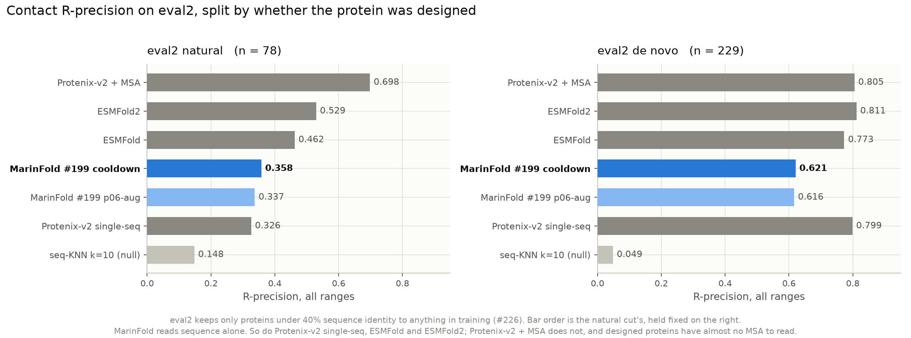
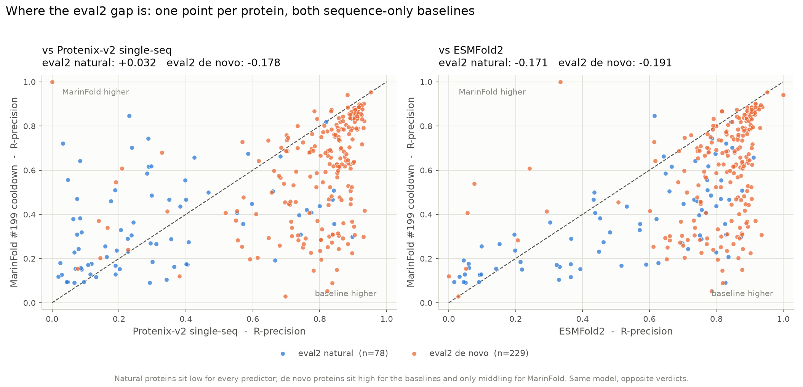

---
marinfold_experiment:
  issue: 238
  title: 'exp: promote the #199 CoreWeave cooldown to the default contacts-v1 model'
  kind: models
  branch: claude/marinfold-default-model-e035dc
---

# exp: promote the #199 CoreWeave cooldown to the default contacts-v1 model

**Issue:** [#238](https://github.com/Open-Athena/MarinFold/issues/238) · **Kind:** `models` · **Branch:** `claude/marinfold-default-model-e035dc`

## Question

[#234](https://github.com/Open-Athena/MarinFold/pull/234) landed a new best contacts-v1 model — #199's CoreWeave p06 **cooldown**, `prot-exp199-cw-cv1-p06-cool-s01` at step 290,400. It is not published anywhere durable and nothing in the repo points at it. What has to happen for it to *be* MarinFold's default model?

## Hypothesis

Not a hypothesis-testing experiment — a promotion. The one thing that could
fail is the publication: a checkpoint copied without its rope repair, or with a
tokenizer that has drifted, works well enough to look fine and is wrong.

## Background

- [#199](https://github.com/Open-Athena/MarinFold/issues/199) / [#234](https://github.com/Open-Athena/MarinFold/pull/234) — the run and its evaluation. R-precision **0.6307** all / **0.5837** long on the legacy 554, against the current default's (`p06-aug`, step 145,199) 0.6088 / 0.5633 scored by the same CoreWeave worker in the same batch. Validation loss 2.9397 vs 2.9712 (both current scale).
- The cooldown export exists **only in CoreWeave S3**, at
  `s3://marin-us-east-02a/marin/protein-structure/MarinFold/exp199_continue_contacts_v1_cw/checkpoints/protein/prot-exp199-cw-cv1-p06-cool-s01/2026.08.14.1/hf/step-290400`.
  Nothing outside the cluster can read it, so it cannot be a registry entry as it stands.
- [#180](https://github.com/Open-Athena/MarinFold/issues/180) — the standing frontier tracker; a new frontier point is a refresh, and its head-to-head-vs-Protenix figure pins whichever checkpoint is current.
- [#197](https://github.com/Open-Athena/MarinFold/issues/197) / [#184](https://github.com/Open-Athena/MarinFold/pull/184) — the transformers-5 rope defect. levanter-side exports state rope only as `rope_parameters`; transformers 4.x ignores that key and silently loads the architecture-default `rope_theta`, worth **0.44–0.77 nats/token** depending on the checkpoint. Every checkpoint we publish gets a repaired `config.json` and a `PROVENANCE.md`, and the registry points at *our* copy rather than a third-party export.
- [#226](https://github.com/Open-Athena/MarinFold/issues/226) — eval2 is now the default eval set. #234's evaluation already scored the full 577-unit universe, so the cooldown's eval2 cuts exist and need reporting, not recomputing.

## Approach

1. **Publish.** Copy the six-file export from CoreWeave S3 into the public `open-athena/MarinFold` bucket at `checkpoints/prot-exp199-cw-cv1-p06-cool-s01/hf/step-290400`, cloud-side on a `cw-us-east-02a` iris job (the workstation has no credentials for that bucket, and a ~5.9 GiB round trip over a 2.5 MB/s uplink is not the way). Verify every object against the S3 ETags #234 recorded, repair the rope block, keep the tokenizer co-located.
2. **Verify.** Re-download the published copy from the public bucket, confirm `scripts/repair_checkpoint_config.py --survey` reads it clean, measure the repaired-vs-as-published NLL delta on the three benchmark documents so `PROVENANCE.md` carries a per-checkpoint number, and run `marinfold evaluate` end-to-end against the registry entry.
3. **Promote.** New default entry in `MODELS.yaml`; `README.md`, `UPDATES.md` and the notebooks that name the default nickname follow.
4. **Refresh #180.** Add the cooldown to `RPRECISION_ROWS`, re-point `plot_vs_protenix.py` at the new frontier model, redraw.
5. **Report eval2.** Both cuts, leading with eval2-natural (n=78), against the checkpoint it displaces.

## Success criteria

- `marinfold infer` with no `--model` resolves the cooldown, downloads it from the public bucket with no authentication, and produces contacts.
- The published `config.json` reads `rope_theta = 500000` under transformers 4.x.
- #180's figures show the new frontier point and the running-best staircase steps to it.
- The eval2 numbers for the new default are written down somewhere a reader will find them.

## Results

### The checkpoint is published

`hf://buckets/open-athena/MarinFold/checkpoints/prot-exp199-cw-cv1-p06-cool-s01/hf/step-290400`
— six files plus `PROVENANCE.md`, readable with no authentication. The copy
took **48 seconds** of pod time; the same bytes over the workstation uplink
would have been about an hour each way.

Every object was checked against the sizes and S3 ETags #234 recorded before
anything was uploaded, and the sha256 of every file was then re-verified after
downloading the published copy back through the registry. `data/published_manifest.json`
holds the digests. The weights are byte-identical to the CoreWeave export;
only `config.json` differs.

### The rope repair is worth 1.300 nats on this checkpoint

Measured against the published copy on exp82's three benchmark documents
(`measure_rope_cost.py`, `data/rope_cost.json`), repaired vs the levanter
export's rope shape:

| document | tokens | repaired | as exported | Δ |
|---|---:|---:|---:|---:|
| 1UBQ | 361 | 1.790 | 2.674 | +0.88 |
| 1QYS | 420 | 2.367 | 3.323 | +0.96 |
| 7BNY (chain A) | 683 | 2.646 | 4.705 | +2.06 |
| **mean** | | **2.268** | **3.567** | **+1.300** |

**1.300 nats/token, against the 0.437 the same defect cost `p06-aug`** on these
same three documents — three times as much, and the largest figure any
published MarinFold checkpoint has measured. This is the strongest evidence yet
for the convention of measuring the defect per checkpoint rather than carrying
a number over: the extra 152B tokens of training that made this model better
also made it depend harder on getting position right. A reader who loads the
raw CoreWeave or `open-athena/marinfold-exp199` export under transformers 4.x
gets a model that is *worse than the #75 checkpoint from June*, silently.

`scripts/repair_checkpoint_config.py --survey` reads the bucket copy as
`ok (rope_theta=500000, rope_type=llama3)`; the model-repo copy of the same
checkpoint still surveys as `AFFECTED`, which is why `MODELS.yaml` points at
ours.

### It resolves and runs end-to-end

```
$ marinfold evaluate --backend transformers --input tests/data/1QYS.cif
[marinfold] wrote metrics to metrics.json
  model: contacts-v1-exp199-cooldown-1.5B   auc_all 0.9886   r_precision_all 0.566
```

No `--model`, no token: the registry resolved the default, mirrored 5.9 GiB out
of the public bucket and scored 1QYS at **AUC 0.989**, against the 0.983 the
previous default recorded on the same protein when it was promoted.

### eval2 — no rerun was needed

**#234 had already scored the full 577-unit eval2 universe.** Its headline
table reports the legacy-554 slice for comparability with #204, but the run
produced every eval2 cut and checked them into
`experiments/exp199_.../evals/rollout_v2/data/cooldown_subset_aggregate_metrics.csv`.
Re-running would have spent ~12 H100-hours reproducing numbers that already
exist, so this experiment reports them instead:

| cut | n | R (all) | R (long) | AUC (all) |
|---|---:|---:|---:|---:|
| **eval2 natural, <40% identity** | **78** | **0.3579** | **0.2998** | **0.8702** |
| eval2 natural, <30% | 61 | 0.3202 | 0.2538 | 0.8568 |
| eval2 pooled, <40% | 307 | 0.5539 | 0.4955 | 0.9328 |
| eval2 pooled, <30% | 275 | 0.5503 | 0.4896 | 0.9322 |
| legacy exp89 | 554 | 0.6307 | 0.5837 | 0.9511 |
| full 577-unit universe | 577 | 0.6231 | 0.5762 | 0.9489 |

### eval2 against the field, split natural vs de novo

eval2 is ~75% designed proteins, so its pooled number is mostly a statement
about de novo design. `plot_eval2_comparison.py` cuts it on #226's
`designed_any` flag and scores every predictor on both halves.



| predictor | natural (n=78) | de novo (n=229) |
|---|---:|---:|
| Protenix-v2 + MSA | 0.6979 | 0.8051 |
| ESMFold2 | 0.5293 | **0.8114** |
| ESMFold | 0.4623 | 0.7732 |
| Protenix-v2 single-sequence | 0.3259 | 0.7987 |
| **MarinFold #199 cooldown** | **0.3579** | **0.6207** |
| MarinFold #199 p06-aug (previous) | 0.3372 | 0.6162 |
| seq-KNN k=10 (null) | 0.1478 | 0.0486 |

**The bar order is the natural cut's, held fixed on the right, because the
ranking does not survive the split.** On natural proteins MarinFold is
mid-field and every predictor is weak. On de novo proteins every predictor is
strong and MarinFold is last of the four real ones — 0.62 against 0.77–0.81.

Paired against the new default, over the same proteins:

| comparison | natural (n=78) | de novo (n=229) |
|---|---|---|
| vs Protenix-v2 single-seq | **+0.032** [−0.027, +0.091] | **−0.178** [−0.207, −0.149] |
| vs ESMFold2 | −0.171 [−0.219, −0.124] | −0.191 [−0.219, −0.163] |
| vs #199 p06-aug (previous default) | **+0.021** [+0.009, +0.032] | +0.004 [−0.007, +0.016] |

Four things fall out of this, and three of them are cautions.

1. **The cooldown's gain is concentrated on natural proteins.** +0.021 with an
   interval clear of zero there; +0.004 and a tie on de novo. Whatever the
   extra 152B tokens bought, it was not de novo design.
2. **On eval2 we do not beat single-sequence Protenix-v2.** The +0.032 on the
   natural cut has an interval that crosses zero at n=78, and the de novo cut
   is −0.178 with an interval nowhere near it. The +0.028 win on the
   554-protein benchmark is a statement about a set that is neither
   homology-controlled nor natural — [#213](https://github.com/Open-Athena/MarinFold/issues/213)
   said the same thing from the homology side and this is the design side of
   it. Quote the 554 number as progress against everything published before
   it, never as "we passed Protenix".
3. **The gap to ESMFold2 is ~0.18 in both halves** — the one number here that
   does not care how the set is cut, and the honest answer to "how good is
   this model".
4. **The null tells you the two halves are different problems**, not one
   problem at two difficulties: sequence-KNN scores 0.148 on natural proteins
   and 0.049 on de novo ones. Designed proteins have no informative neighbours
   to memorise, and every real predictor still does *better* on them.



Per protein, against the two baselines that also read sequence alone. The blue
cloud (natural) sits low and straddles the diagonal against Protenix-v2
single-seq; the orange cloud (de novo) sits high and almost entirely below it.
Source numbers for both figures: `data/eval2_comparison.csv`.

### #180 refreshed

The cooldown takes the accuracy frontier at 0.631 and the loss frontier at
~2.5580, and the head-to-head figure is re-pointed at it — which needed its
per-protein rows published to the bucket first (`publish_eval_rows.py`), since
#234 left them on CoreWeave S3.

The refresh turned up a second result. #234 re-scored the *previous* default
under the same harness and got **0.6088**, not the **0.5873** #204 published
and #180 has carried since. #208 had independently measured 0.6103 with exp82's
own worker. #234's harness reproduces the historical #75 E8 anchor to 0.00017
and #204's two TRC p03 checkpoints to ~0.001, so the disagreement is one
checkpoint's reading rather than a harness-wide offset. #180 now carries #234's
numbers for the whole #199 family, with #204's in the footnotes and caveat 13
recording that the cause has never been explained. Three of #180's conclusions
changed as a result — the single-sequence Protenix gap reverses to **+0.028
[+0.001, +0.054]**, the loss→accuracy exchange rate stops collapsing, and
#204's sigmoid fit (asymptote 0.5955) is falsified by two checkpoints above it.

## Conclusion

`contacts-v1-exp199-cooldown-1.5B` is MarinFold's default model as of
2026-08-16. It is published, verified byte-for-byte, rope-repaired, and
reachable with `marinfold infer` and no arguments.

On the 554-protein benchmark it scores **0.631**, and it is the first
contacts-v1 model measurably ahead of single-sequence Protenix-v2 there
(+0.028, 95% CI [+0.001, +0.054]) — barely clear of zero, but ahead.

**That result does not survive the move to eval2.** On the 78 natural
low-identity proteins it scores 0.358 against Protenix-v2 single-seq's 0.326,
a +0.032 whose interval crosses zero; on the 229 de novo ones it scores 0.621
against 0.799, a −0.178 whose interval does not. ESMFold2 is ~0.18 ahead in
both halves. The 554-protein win is a statement about a set that is 75%
designed and not homology-controlled, and it should be quoted as progress
against our own history rather than as passing a structure predictor.

Two things are worth carrying out of this beyond the promotion itself.

**The cooldown was nearly free and it worked.** No new data, no new
hyperparameters, no architecture change: 29,040 further updates on the same
mixture with the learning rate annealed to zero bought +0.022 R-precision at
the best loss-to-accuracy exchange rate since #117. The obvious follow-up is
that nobody has yet found where this model line stops improving — #199 stopped
it at 152B tokens, the continuation and cooldown took it to 304B, and the
frontier moved both times.

**The published-number hygiene problem is real and recurring.** Two separate
silent-failure modes bit this single checkpoint: an export whose rope block
transformers 4.x ignores (1.300 nats), and an evaluation pipeline that read a
checkpoint 0.022 low and went unnoticed through a merged PR, a MODELS.yaml
entry, a frontier tracker and an UPDATES.md summary. Both were caught only
because something re-measured a known quantity — the survey script for the
first, #234's #75 acceptance test for the second. Keep the anchors in every
harness.
