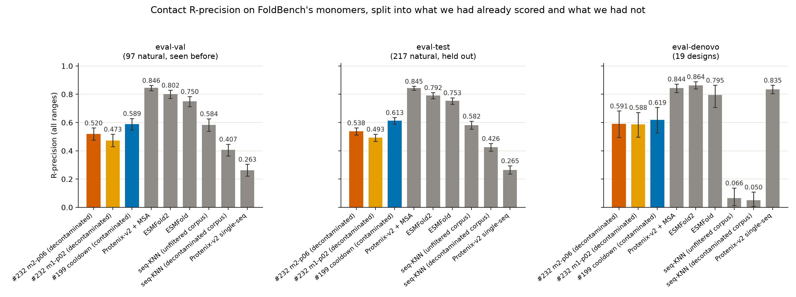
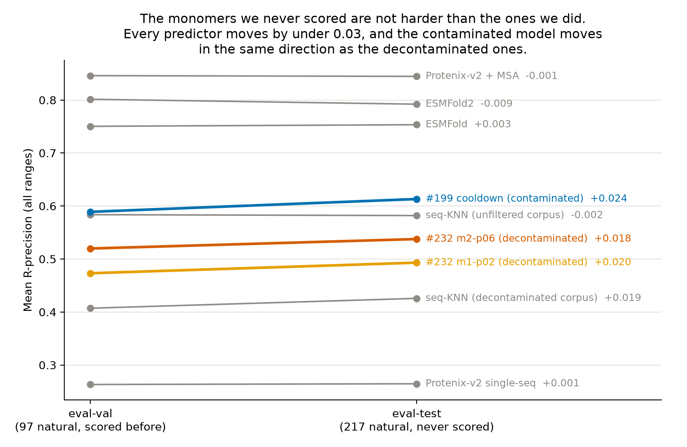

---
marinfold_experiment:
  issue: 245
  title: 'exp: FoldBench held-out monomer eval sets (eval-val / eval-test / eval-denovo) for the decontaminated #232 checkpoints'
  kind: evals
  branch: exp/245-foldbench-eval-sets
---

# exp: FoldBench held-out monomer eval sets (eval-val / eval-test / eval-denovo) for the decontaminated #232 checkpoints

**Issue:** [#245](https://github.com/Open-Athena/MarinFold/issues/245) · **Kind:** `evals` · **Branch:** `exp/245-foldbench-eval-sets`

## Question

**How do the decontaminated #232 checkpoints score on FoldBench's natural monomers — held-out ones we have never scored — and how does that compare to the structure-prediction baselines on the same proteins?**

Every contact number we publish today comes from a 554-protein set whose FoldBench half is the *first 100 rows* of `monomer_protein.csv`, chosen before we understood the training-set overlap ([#213](https://github.com/Open-Athena/MarinFold/issues/213), [#225](https://github.com/Open-Athena/MarinFold/issues/225)). [#232](https://github.com/Open-Athena/MarinFold/issues/232) trained models on corpora decontaminated against **all** of FoldBench, so for the first time the other 234 monomers are a legitimate held-out test set rather than an untested slice of training data.

This experiment cuts FoldBench's 334 monomers into three sets and scores them:

| set | definition | n |
|---|---|---:|
| **eval-val** | the natural monomers inside the historical FoldBench-100 — what every previous eval reported on | 97 |
| **eval-test** | every other natural FoldBench monomer — never scored by anything here | 218 |
| **eval-denovo** | every de novo designed FoldBench monomer | 19 |

Each protein carries a viral / non-viral flag so results can be stratified ([#241](https://github.com/Open-Athena/MarinFold/issues/241) found MarinFold ties ESMFold on viral proteins and loses badly on non-viral ones, so the split is not cosmetic).

## Hypothesis

- **H1.** eval-test and eval-val agree within noise for the #232 checkpoints. Both sets are decontaminated at the same rule, so a gap between them would mean the historical 100 is unrepresentative of FoldBench for reasons other than leakage.
- **H2.** The contaminated reference model (#199 CoreWeave cooldown, the current default) drops more from eval-val to eval-test than the #232 checkpoints do — its training data was never filtered against the 234, so eval-val is partly memorised for it and eval-test is not.
- **H3.** Baselines (Protenix-v2 single-seq/+MSA, ESMFold, ESMFold2) move little between eval-val and eval-test: their training data is unchanged by any of this, and eval-test is not novel to them.

## Background

- [#225](https://github.com/Open-Athena/MarinFold/issues/225) published both decontaminated corpora. Rule: **≥30 % identity over ≥50 % of the shorter sequence**, reference = the 554 eval proteins ∪ all 1,940 FoldBench protein chains, no E-value arm. AFDB 4,129,682 → 3,963,003; ESM-Atlas 66,759,922 → 65,553,178.
- [#232](https://github.com/Open-Athena/MarinFold/issues/232) trained the #199 recipe from scratch on exactly those corpora; [#244](https://github.com/Open-Athena/MarinFold/pull/244) evaluated the two best checkpoints (`m2-p06` 0.592 / `m1-p02` 0.579 on the legacy 554).
- [#226](https://github.com/Open-Athena/MarinFold/issues/226) established the FoldBench monomer universe (334), the RCSB chain-resolution recipe, and ground truth for 23 of the unused ones.
- [#241](https://github.com/Open-Athena/MarinFold/issues/241) supplied the designed-vs-natural audit and the kingdom/viral annotation for all 776 eval proteins.

## Approach

Four steps, each with its own script and its own control.

**0. Confirm the decontamination** ([`confirm_decontamination.py`](confirm_decontamination.py)).
Five links have to hold for these checkpoints to be clean on these proteins, and
each is checked rather than assumed. See [Results §1](#1-the-232-checkpoints-are-verifiably-clean-on-all-334-monomers).

**1. Cut the sets** ([`build_eval_sets.py`](build_eval_sets.py)). FoldBench's
`monomer_protein.csv` has 334 rows; our historical eval set is its first 100.
Designed-vs-natural is decided by two independent RCSB signals — the
`synthetic construct` source taxon and the PDB's `DE NOVO PROTEIN` structural
class, tested against both the curated keyword field and the depositor's free
text — which agree on all 334 (19 designs, 315 natural). Viral status comes from
the NCBI taxonomy lineage. #241's independent annotation of the same proteins is
asserted to match, all 334 rows.

**2. Ground truth for everything** ([`build_ground_truth.py`](build_ground_truth.py)).
199 monomers have never been scored and have no ground truth. Rather than bolt
new records onto #89's frozen universe and leave the sets with two provenances,
all 334 are rebuilt through one path — #89's `pyconfind_contacts.compute_contacts`
imported, RCSB `-assembly1` mmCIFs, the resolved auth chain — and the 126
overlapping units built from the same input sequence must come back byte-identical.
They do, 126/126.

**3. Check the format can represent them** ([`check_context_budget.py`](check_context_budget.py)).
The 554-protein set tops out at 761 residues; FoldBench's monomers reach 1,596,
and contacts-v1 documents have to fit an 8,192-token context. Measured with the
real tokenizer and the real document builder rather than assumed.

**4. Score** — [`rollout/`](rollout) for the checkpoints (PR #244's harness with
exp245's eval sets as reporting cuts), [`score_baselines.py`](score_baselines.py)
and [`run_knn_baseline.py`](run_knn_baseline.py) for the baselines,
[`analyze.py`](analyze.py) and [`plot_results.py`](plot_results.py) for the tables
and figures.

## Success criteria

- Decontamination confirmed with zero surviving ≥30 %/≥50 %-shorter alignments into either training corpus, and the coverage-gate caveat quantified.
- All 334 units scored for all three checkpoints with 0 unfinished rollouts, and the #75 E8 gate reproduced on the legacy 554 within 0.005 to validate the path.
- A single table giving R-precision (all) for {3 MarinFold checkpoints + 5 baselines} × {eval-val, eval-test, eval-denovo}, with bootstrap CIs on the paired deltas and a viral / non-viral split.
- An answer to H2 stated as a number: the eval-val → eval-test drop for the contaminated model minus the same drop for the decontaminated ones.

## Results

### 1. The #232 checkpoints are verifiably clean on all 334 monomers

Five links, all checked ([`data/decontamination_check.json`](data/decontamination_check.json)):

| link | check | result |
|---|---|---|
| The eval proteins were queries | all 334 monomer sequences present byte-identically in #225's 1,940-chain FoldBench reference | **334/334**, by name and by sequence |
| Nothing that matches them survived | every alignment into either corpus at ≥30 % identity over ≥50 % of the shorter sequence, checked against the applied drop list | **131,180 meet the rule, 0 survive** |
| The published corpora are the filtered ones | #225's `verify_published.py` row counts | AFDB 3,963,003 (−166,679); ESM-Atlas 65,553,178 (−1,206,744) |
| #232 tokenized those bytes | its tokenizer pins both bucket prefixes and requires those exact row counts, and its sweep pins the same totals for the mixture weights | counts agree |
| The two runs read only those caches | live W&B config for both runs | only exp232's `afdb`/`esm` caches, plus #154's contacts-v1 **validation** cache (loss only, never trained on) |

**What the rule does not cover, priced.** The gate is identity over half the
*shorter* sequence, so a training protein matching an eval protein at high
identity over a short stretch is kept by design. At the applied gate the highest
surviving identity to any of the 334 is **0.299** — right up against the
threshold, as it should be. Drop the coverage requirement to 40 % and 97/97
eval-val and 217/218 eval-test proteins have a surviving training relative at
≥30 % identity; with no coverage requirement at all, 19 eval-val and 46
eval-test proteins have a surviving relative at ≥90 % identity over some
fragment. Decontamination at 30 % means *this* rule, not "no shared subsequence".
Per-protein residuals are in [`data/residual_identity.csv`](data/residual_identity.csv).

### 2. The three sets

| set | n | viral | median L | max L | ground truth | baselines |
|---|---:|---:|---:|---:|---|---|
| **eval-val** — the natural members of the historical FoldBench-100 | 97 | 6 | 245 | 761 | reproduced from #89's frozen universe, 97/97 identical | published, reused |
| **eval-test** — every other natural monomer | 218 | 13 | 258 | 1,596 | built here | 194 run here, 23 reused |
| **eval-denovo** — every designed monomer | 19 | 0 | 146 | 284 | built here or reproduced | 15 run here, 4 reused |

The historical 100 is **97 natural + 3 designs** (`5sbj_A` "METP, miniaturized
rubredoxin", `7ur7_A`, `8ah9_A`), so eval-val is 97 and the three designs sit in
eval-denovo where they belong. The designed/natural verdict has two independent
RCSB signals that agree on every one of the 334, and matches #241's independent
annotation on all 334.

**One protein is excluded from scoring.** `8uxt_A` (1,596 residues) is the only
monomer whose contacts-v1 document does not fit an 8,192-token context:
`build_document` truncates it to 1,664 of its 3,809 contacts, so no rollout can
produce it in full and a score for it would measure the format's context limit
rather than the model. It stays in
[`data/eval_sets.csv`](data/eval_sets.csv) flagged, and out of the 333 scored
units. Every other protein clears the budget with a median 2.3× headroom
([`data/context_budget.csv`](data/context_budget.csv)).

### 3. The evaluation reproduces PR #244 protein by protein

The usual gate — #75 E8 on the legacy 554 — is not available on this eval set, so
the path is validated against #244 directly: same two checkpoints, same 97
proteins (all of eval-val is inside #244's `foldbench100`), independent runs.

| checkpoint | n | mean R here | mean R in #244 | difference | per-protein r |
|---|---:|---:|---:|---:|---:|
| #232 m2-p06 | 97 | 0.5198 | 0.5229 | **−0.0031** | 0.996 |
| #232 m1-p02 | 97 | 0.4731 | 0.4754 | **−0.0023** | 0.996 |

Both inside the 0.0023 spread #204 measured across four evaluations of one
unchanged checkpoint, and inside #244's own 0.005 gate. Everything this
experiment rebuilt — ground truth, targets, dataset label, the adapted harness —
is covered by that comparison. 333 units × 3 checkpoints, 33,300 rollouts each,
**0 unfinished** ([`data/path_validation.json`](data/path_validation.json)).
### 4. The scoreboard

R-precision, all ranges, over the 333 scored units. Every predictor covers every
unit ([`data/headline.csv`](data/headline.csv), per-protein rows in
[`data/per_protein.csv.gz`](data/per_protein.csv.gz)).

| predictor | eval-val (97) | eval-test (217) | eval-denovo (19) |
|---|---:|---:|---:|
| **#232 m2-p06 (decontaminated)** | **0.520** | **0.538** | **0.591** |
| **#232 m1-p02 (decontaminated)** | **0.473** | **0.493** | **0.588** |
| #199 cooldown (contaminated reference) | 0.589 | 0.613 | 0.619 |
| Protenix-v2 single-seq | 0.263 | 0.265 | 0.835 |
| ESMFold | 0.750 | 0.753 | 0.795 |
| ESMFold2 | 0.802 | 0.792 | 0.864 |
| Protenix-v2 + MSA | 0.846 | 0.845 | 0.844 |
| seq-KNN null, **unfiltered** corpus | 0.584 | 0.582 | 0.066 |
| seq-KNN null, **decontaminated** corpus | 0.407 | 0.426 | 0.050 |

*Figure 1. All-range R-precision per predictor on each set, with 95 % bootstrap
intervals over proteins. MarinFold checkpoints coloured, baselines grey. Rendered
by `plot_results.py`.*

### 5. The historical set was not flattering us

This is the result the experiment was filed for. **Every predictor scores the
same or slightly better on the 217 monomers we had never touched**, and the
contaminated reference moves in the same direction and by the same amount as the
decontaminated checkpoints:

| predictor | eval-val | eval-test | eval-test − eval-val | 95 % CI |
|---|---:|---:|---:|---|
| #232 m2-p06 (decontaminated) | 0.520 | 0.538 | **+0.018** | [−0.033, +0.068] |
| #232 m1-p02 (decontaminated) | 0.473 | 0.493 | **+0.020** | [−0.028, +0.070] |
| #199 cooldown (contaminated) | 0.589 | 0.613 | **+0.024** | [−0.022, +0.073] |
| ESMFold | 0.750 | 0.753 | +0.003 | [−0.038, +0.046] |
| ESMFold2 | 0.802 | 0.792 | −0.009 | [−0.045, +0.028] |
| Protenix-v2 + MSA | 0.846 | 0.845 | −0.001 | [−0.022, +0.024] |
| Protenix-v2 single-seq | 0.263 | 0.265 | +0.001 | [−0.052, +0.055] |

*Figure 2. Each predictor's mean on the two natural sets. Rendered by
`plot_results.py`.*

**H2 is not supported, and the direction is worth stating.** The
difference-in-differences the issue asked for — the contaminated model's val→test
change minus a decontaminated one's — is **−0.006** (m2-p06) and **−0.004**
(m1-p02): the contaminated model gains *slightly more* on the held-out set, not
less, and both numbers are an order of magnitude inside the noise. If the
historical FoldBench-100 were inflating #199's score through memorised homologs,
this is where it would show, and it does not. H1 and H3 hold: all seven
predictors move by less than 0.03 between the two sets.

### 6. Where the #232 checkpoints actually stand

Paired deltas on eval-test, bootstrap over proteins
([`data/paired_deltas.csv`](data/paired_deltas.csv)):

| #232 m2-p06 vs | delta | 95 % CI |
|---|---:|---|
| Protenix-v2 single-seq | **+0.273** | [+0.239, +0.307] |
| seq-KNN null over its **own** (decontaminated) corpus | **+0.112** | [+0.083, +0.141] |
| seq-KNN null over the **unfiltered** corpus | **−0.044** | [−0.078, −0.011] |
| ESMFold | −0.216 | [−0.238, −0.194] |
| ESMFold2 | −0.255 | [−0.278, −0.232] |
| Protenix-v2 + MSA | −0.307 | [−0.333, −0.281] |

Three things this says that the raw table does not.

**The KNN null is the right yardstick, and it is corpus-specific.** Copying the
contacts of a protein's ten nearest training sequences scores **0.582** on
eval-test out of the unfiltered corpus and **0.426** out of the decontaminated
one — decontamination removed 0.156 of *memorisable* contact map per protein on
average, and more than 0.2 for 99 of the 314 natural proteins. Each model clears
the null over the corpus it actually trained on (#232 m2-p06 +0.112, #199
cooldown +0.031) and falls below the null over the richer corpus. Read that way,
#199's 0.075 lead over m2-p06 is roughly what a nearest-neighbour lookup gains
from the same extra data, and the two runs are not budget-matched anyway (290,400
steps versus 145,199), so **this experiment does not measure a cost of
decontamination** — #232's own budget-matched arms do.

**Protenix-v2 single-sequence is not a real comparator on natural proteins.** It
scores 0.835 on the 19 designs and 0.265 on the 314 natural monomers; the
"MarinFold is at parity with Protenix-SS" framing that #213 and #226 tracked
comes from an eval set that is three-quarters designed protein. On natural
FoldBench monomers both #232 checkpoints beat it by more than 0.27.

**Viral proteins are harder for everything except MSA.** On eval-test
(13 viral / 204 non-viral): m2-p06 0.465 vs 0.542, #199 cooldown 0.497 vs 0.621,
ESMFold2 0.608 vs 0.804, seq-KNN 0.262 vs 0.602 — and Protenix-v2 + MSA 0.812 vs
0.847, essentially flat. #241's finding survives on new proteins: the viral gap
tracks how much homology a predictor can reach, and an MSA closes it.

### 7. Why designs look only slightly easier here, when #226 found a huge gap

Prior work (#213, #226, #241) reported de novo designs as *much* easier than
natural proteins. On these sets the design advantage is small for MarinFold
(+0.054 [−0.043, +0.151] for m2-p06, +0.006 [−0.090, +0.097] for the #199
cooldown) and moderate for ESMFold2 (+0.071 [+0.039, +0.105]). That is not a
contradiction — the earlier comparison used a different designed population *and*
a homology-filtered natural one, and both differences push the same way.

**The designed population.** The published contrast is exp65's `denovo_pdb`: 396
de novo PDB entries, mostly small idealised bundles and barrels. Published means
on the 554 (all-range R, #199 p06): **denovo_pdb 0.673** vs **foldbench100 0.541**
— +0.132 for MarinFold. exp245's `eval-denovo` is a different thing: the 19
monomers FoldBench happens to contain that RCSB calls synthetic, which includes
engineered binders and miniaturised natural folds ("high affinity CTLA-4 binder",
"METP, miniaturized rubredoxin", extendable nanofibers) rather than 396 idealised
designs. At n = 19 the interval is ±0.09, so these numbers cannot distinguish
"similar" from "+0.13" anyway.

**The natural population, which matters more.** The headline "designs are much
easier" numbers were against **eval2-natural** — the natural proteins under 40 %
identity to exp199's training set, where MarinFold scores ~0.31-0.36. exp245's
`eval-test` is *every* natural FoldBench monomer, and it is not homology-filtered
against the unfiltered corpus: only 23 of 217 sit under 40 % identity to #199's
training sequences, and 139 are at or above 60 %. Split eval-test on that axis and
the published pattern comes straight back:

| predictor | natural, <40 % id (23) | natural, ≥40 % id (194) | designs (19) |
|---|---:|---:|---:|
| #232 m2-p06 (decontaminated) | 0.415 | 0.552 | 0.591 |
| #199 cooldown (contaminated) | 0.442 | 0.633 | 0.619 |
| ESMFold2 | 0.599 | 0.815 | 0.864 |
| Protenix-v2 single-seq | 0.243 | 0.267 | 0.835 |
| seq-KNN (unfiltered corpus) | 0.297 | 0.615 | 0.066 |

Against the homology-hard natural slice the design advantage is **+0.177
[+0.044, +0.306]** for m2-p06 and identically +0.177 for the #199 cooldown —
the effect #226 and #241 measured, reproduced here.

So both statements are true and they are about different comparisons: **designs
are much easier than natural proteins we have no homolog for**, and **designs are
about as easy as natural proteins in general**, because most natural proteins have
homologs. Protenix-v2 single-sequence is the extreme case — +0.570 designs vs all
natural, and it does not benefit from homology at all (0.243 vs 0.267 across the
identity split), which is why it looked competitive on an eval set that was
three-quarters designed and collapses on natural monomers.

### How each baseline was run

Every baseline is #74's / #78's / #94's driver invoked on exp245's manifest, at
those experiments' own settings — the point is that the new proteins are scored
by the same programs at the same knobs as the published rows this experiment
reuses for the other 124 units. Per-protein timings are in
`data/coreweave_results/timings.csv` (checkpoints) and each driver's
`contact_eval_meta.csv` (baselines).

**Protenix-v2, both modes** ([`build_protenix_inputs.py`](build_protenix_inputs.py)
→ exp12 `cli.py run` → [`sync_protenix_best.py`](sync_protenix_best.py)):

| setting | value |
|---|---|
| model | `protenix-v2` (`checkpoint/protenix-v2.pt`), released `protenix` PyPI package |
| trunk recycles | `model.N_cycle = 10` |
| seeds | `1,2,3,4,5` — five independent trunk+diffusion runs |
| diffusion samples per seed | `sample_diffusion.N_sample = 8` |
| samples per protein and mode | **40** (5 seeds × 8) |
| selection | top-1 across all 40 by Protenix's own `ranking_score`, #74's rule |
| single-sequence mode | `--use_msa false` |
| MSA mode | `--use_msa true`, MSA precomputed once per protein through Protenix's own colabfold pipeline (`runner.msa_search.update_seq_msa(mode="colabfold")`, `MMSEQS_SERVICE_HOST_URL=https://api.colabfold.com`), giving `pairing.a3m` (a monomer stub) + `non_pairing.a3m` (the unpaired MSA) |
| readout scored | **structure** — pyconfind on the selected mmCIF, ranked by contact degree. Not the distogram: #74/#78 emit both and #213 published the structure rows (the distogram roughly halves every baseline) |
| hardware | one Modal H100 per (protein, mode) |

The per-protein selection — which seed and sample won, and its ranking score — is
in [`data/protenix_selection.csv`](data/protenix_selection.csv). Two mechanical
notes for anyone rerunning it: exp12's Modal app binds its output volume inside
the `@app.cls` decorator, so `--output-volume` is accepted and then ignored and
predictions land in exp12's own `foldbench-protenix-runs` volume; and only the
winning sample's mmCIF is downloaded here (5 ranking JSONs + 1 structure per
protein and mode) because syncing all 40 samples plus per-seed distograms is
~6 GB of small files at ~50 kB/s through the Modal API. Protenix sorts samples
within a seed by `ranking_score`, and that is checked rather than assumed —
24/24 complete seed directories from a full sync have `sample_0` as the maximum,
and `--verify-all` re-reads all eight per seed.

**ESMFold** (exp78 `esmfold_app.py`): `facebook/esmfold_v1` via
`transformers.EsmForProteinFolding`, single sequence, `num_recycles=4` (model
default), ESM-2 language-model stem cast to fp16, trunk attention
`chunk_size=128`, one deterministic prediction per protein, one Modal H100.

**ESMFold2** (exp78 `esmfold2_app.py`): `biohub/ESMFold2` (ESMC-6B + all-atom
diffusion) via `transformers.models.esmfold2`, **single sequence**,
`num_loops=20`, `num_sampling_steps=100` (documented defaults), best-of-N
diffusion draws with distinct seeds keeping top-1 by the model's confidence —
mirroring the Protenix top-1-of-40 selection.

**seq-KNN null** ([`run_knn_baseline.py`](run_knn_baseline.py)): #94's index over
the 4,129,682 AFDB training documents, MMseqs2 `-s 7.5`, k = 10 nearest
sequences excluding verbatim self-hits, contacts averaged from the neighbours'
own contact sets. Run twice — over the unfiltered corpus and over the rows #225
kept — and scored through #82's `build_rollout_rows.py`, which carries #89's
metric functions verbatim.

**MarinFold checkpoints**: #82's rollout+resample recipe — 100 fresh document
realizations per protein (resampled N-terminus and statement order), temperature
1.0, top-p 0.95, **top-k disabled**, token budget `min(8192 − prompt, 6L + 128)`,
occurrence-frequency voting over contacts still live at the end of each rollout,
no pairwise tie-break. Twelve single-H100 CoreWeave shards per checkpoint at
batch priority; float32 exports evaluated as bfloat16.

### Artifacts

Everything public is under
`hf://buckets/open-athena/MarinFold/data/contacts-v1-foldbench-monomers-exp245/`:
`eval_sets.csv` (all 334, with `scorable` / `exclusion_reason`),
`eval_targets_foldbench_monomers.parquet` + `gt_universe_scored.jsonl` (the 333
scored units), `eval_sets.fasta`, `per_protein.csv.gz` (9 predictors x 333 x 4
metrics), `headline.csv`, `paired_deltas.csv`, `val_vs_test.csv`,
`context_budget.csv`, `residual_identity.csv`, the two check reports, and
`runs/fbmono-20260818-01/` (the CoreWeave run's metric tables and manifest).

Checkpoints were read in place from CoreWeave S3; none was copied. The run root
is `s3://marin-us-east-02a/marin/protein-structure/MarinFold/exp245_foldbench_held_out_monomers/evals/rollout/fbmono-20260818-01/`.
W&B runs: [`prot-exp232-cw-cv1-decontam-s02-m2-p06-aug`](https://wandb.ai/open-athena/MarinFold/runs/prot-exp232-cw-cv1-decontam-s02-m2-p06-aug),
[`prot-exp232-cw-cv1-decontam-s02-m1-p02-aug`](https://wandb.ai/open-athena/MarinFold/runs/prot-exp232-cw-cv1-decontam-s02-m1-p02-aug),
[`prot-exp199-cw-cv1-p06-cool-s01`](https://wandb.ai/open-athena/MarinFold/runs/prot-exp199-cw-cv1-p06-cool-s01).

## Conclusion

**The eval set we have been reporting on is honest.** FoldBench's other 217
natural monomers — proteins no model or baseline here had ever seen scored, and
which #225 provably removed from the #232 training corpora at 30 % identity —
score **+0.018 to +0.024 higher**, not lower, for all three checkpoints, and the
contaminated reference model's val→test change is indistinguishable from the
decontaminated ones' (difference-in-differences −0.006 and −0.004, both far
inside a ±0.05 interval). Whatever else is wrong with the historical
FoldBench-100, it was not inflating our numbers through leaked homologs.

**What the three sets are for from here.** `eval-test` (217 natural monomers) is
now the default set for any claim about decontaminated accuracy: it is four times
the size of eval2-natural's audited 63, it is not 75 % designed protein, and its
ground truth and baselines are complete and published. `eval-val` keeps
continuity with every published figure. `eval-denovo` (19) exists so designs stop
being averaged into natural-protein claims — they behave completely differently
(Protenix-v2 single-seq: 0.835 on designs, 0.265 on natural).

**The finding that changes how to read the frontier.** A sequence-KNN null over
the corpus a model trained on is the yardstick that makes #199-vs-#232
interpretable. Copying the ten nearest training sequences' contacts scores 0.582
on eval-test out of the unfiltered corpus and 0.426 out of the decontaminated
one; each model clears the null over its own corpus by a modest margin (#232
m2-p06 +0.112, #199 cooldown +0.031) and sits below the null over the richer one.
So #199's 0.075 lead is not evidence that decontamination is free or that it is
expensive — the runs are not budget-matched (290,400 vs 145,199 steps) — but it
does put an upper bound on how much of any contacts-v1 score is reachable by
memorisation.

**Still open.** A budget-matched decontaminated-vs-contaminated comparison (#232's
own arms). The fold-novelty axis, which none of this measures — "no 30 %-identity
homolog" is not "novel fold", and #225 priced the fold-level purge at 37 % of
AFDB. And the gap to ESMFold2 (−0.255) and Protenix + MSA (−0.307) on natural
proteins, which is where the real headroom is.

