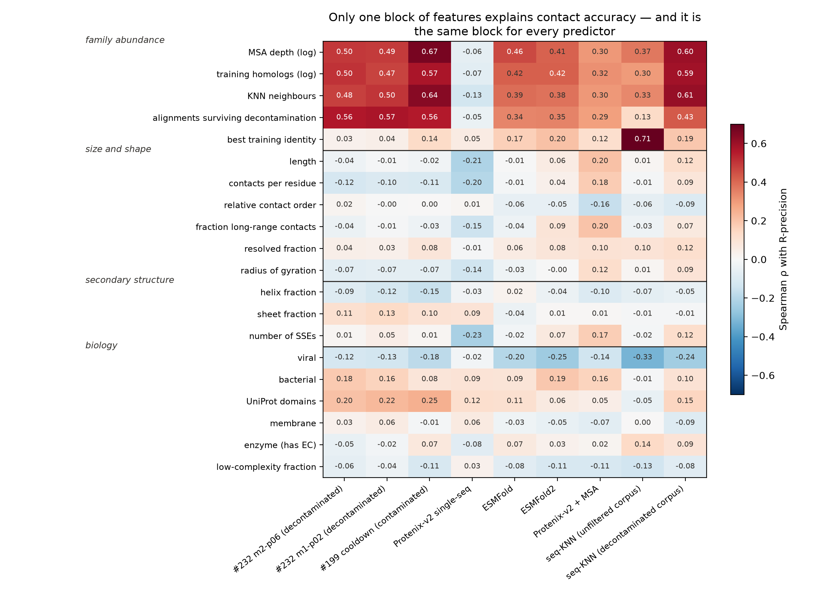
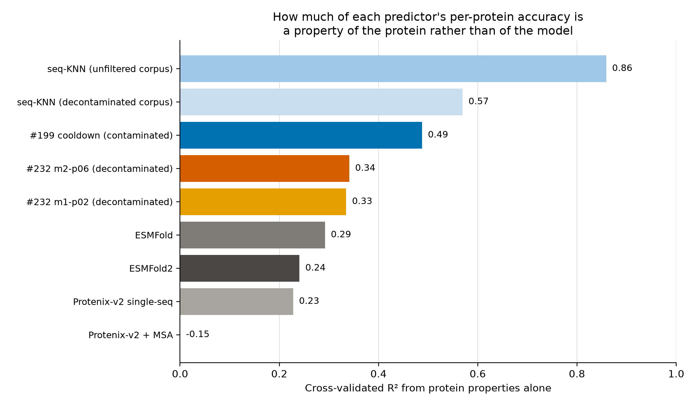
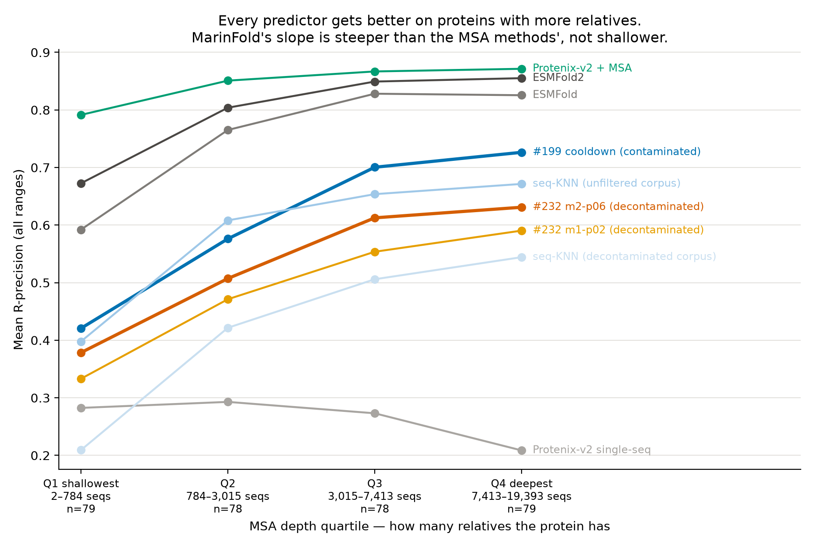

---
marinfold_experiment:
  issue: 247
  title: 'exp: what protein properties explain per-protein contact accuracy, for MarinFold and for the baselines?'
  kind: evals
  branch: main
---

# exp: what protein properties explain per-protein contact accuracy, for MarinFold and for the baselines?

**Issue:** [#247](https://github.com/Open-Athena/MarinFold/issues/247) · **Kind:** `evals` · **Branch:** `main`

## Question

**What properties of a protein explain how well MarinFold predicts its contacts — and are they the same properties that explain the baselines?**

[#245](https://github.com/Open-Athena/MarinFold/issues/245) produced per-protein contact scores for nine predictors over 314 natural FoldBench monomers (eval-val 97 + eval-test 217), all decontaminated at 30 % identity and all deposited after the baselines' training cutoffs. That table has never been explained: we know the means, not what drives the spread, which on eval-test runs from 0 to 1 for every predictor.

The comparative half is the interesting half. If MarinFold's per-protein accuracy is explained by *training-set proximity* while ESMFold2's is explained by *MSA depth* and Protenix+MSA's by neither, that says something concrete about what a from-scratch sequence LM has actually learned — and it tells us which proteins to add to training.

## Hypothesis

- **H1 (training support dominates for us).** MarinFold's per-protein R-precision correlates with how much similar sequence its training corpus held — best identity to training, number of significant homologs, seq-KNN neighbour quality — more strongly than any baseline's does. The seq-KNN null is the ceiling of that effect (#245 measured the null at 0.582 on eval-test out of the unfiltered corpus).
- **H2 (difficulty is shared).** Length, contact order, fraction of long-range contacts and fraction of unresolved residues move *every* predictor in the same direction; these are protein-difficulty axes, not model-specific ones.
- **H3 (the MSA methods separate).** MSA depth (Neff) explains Protenix-v2 + MSA and ESMFold variance and explains little of MarinFold's, since MarinFold sees one sequence. If MarinFold's residual against ESMFold2 is *largest* on low-Neff proteins, single-sequence modelling is where we are actually competitive.
- **H4 (biology matters less than statistics).** Kingdom, cellular localisation, function class and domain count explain less variance than length + contact order + training support, and most of their apparent effect disappears once those are controlled. Viral is the exception #241 and #245 already measured (−0.076 to −0.351 depending on predictor).

## Background

- [#245](https://github.com/Open-Athena/MarinFold/issues/245) — the eval sets, the per-protein table (`data/per_protein.csv.gz`, 9 predictors × 333 × {all,long} × {R,AUC}), and the protein annotation already attached to each row (`data/eval_sets.csv`: length, kingdom, viral, deposit date, RCSB entity/title, pre-decontamination training identity per arm).
- [#241](https://github.com/Open-Athena/MarinFold/issues/241) — viral proteins score differently, and the arms of our corpus miss viruses.
- [#213](https://github.com/Open-Athena/MarinFold/issues/213) / [#225](https://github.com/Open-Athena/MarinFold/issues/225) — training-set overlap measurement and the decontamination that makes "training support" a well-defined, *removed* quantity here.
- [#142](https://github.com/Open-Athena/MarinFold/issues/142) — under-generation on contacts-v1 rollouts tracks difficulty, not a decoding bug: evidence that per-protein variance is real signal.
- [#116](https://github.com/Open-Athena/MarinFold/issues/116)-era finding that long-protein weakness is a base-rate artefact — length must be analysed against the metric's own denominator, not naively.

## Approach

Analysis only. No training, no new model inference; the per-protein scores already exist.

**1. Build a protein-feature matrix** over the 314 natural monomers (`build_features.py`):

| family | features | source |
|---|---|---|
| size / shape | length, resolved fraction, radius of gyration, contacts per residue | GT universe + assembly mmCIFs (already cached) |
| contact structure | mean contact order, fraction long-range (\|i−j\|≥24), short/medium/long contact counts | GT contacts |
| secondary structure | helix / sheet / coil fraction, number of SSEs | `biotite.structure.annotate_sse` on the GT chain |
| training support | best identity to the pre-decontamination corpus (per arm and pooled), number of significant homologs, seq-KNN neighbour count and best bitscore, residual identity surviving decontamination at several coverage gates | #213/#226 identity table, #245's `residual_identity.csv`, #94's KNN hit summary |
| MSA | Neff / depth of the colabfold MSA already computed for the Protenix +MSA arm | the `a3m` files on the Modal MSA volume |
| domains | domain count and family assignments (Pfam, CATH/SCOP where assigned, InterPro), UniProt domain features | RCSB `rcsb_polymer_entity_annotation`, UniProt REST |
| function | GO molecular-function / biological-process slims, EC class, enzyme vs non-enzyme | RCSB annotations, UniProt |
| localisation | UniProt subcellular location, membrane / secreted / cytoplasmic, transmembrane-segment and signal-peptide counts | UniProt REST |
| taxonomy | kingdom, viral flag, organism | already in `eval_sets.csv` |
| composition | amino-acid class fractions, hydrophobicity, low-complexity fraction | sequence |

**2. Univariate pass** (`analyze_associations.py`): Spearman ρ of every feature against every predictor's per-protein R-precision (all- and long-range), with FDR control and the same table computed per eval set so nothing rests on one sample.

**3. Multivariate pass**: for each predictor, a regularised linear model and a gradient-boosted one on the same standardised features, reporting cross-validated R², coefficients and permutation importance. The linear model is the reportable one at n = 314; the GBM is a non-linearity check.

**4. The comparative question**: which features rank differently across predictors, and what explains MarinFold's *residual* against ESMFold2 and against the seq-KNN null per protein. Plus a partial-correlation check for H4 — do biology features survive controlling for length, contact order and training support?

**5. Deliverables**: a committed feature matrix (one row per protein, every feature and every predictor's score), the association tables, three or four figures, and a README that says plainly which properties matter, for whom, and how much.

## Success criteria

- A committed `data/protein_features.csv` covering all 314 natural monomers with ≥ 30 features and explicit provenance for each family, plus a per-feature coverage report (some annotations will be missing for recent entries; that must be visible, not silently imputed).
- Spearman associations for every (feature, predictor) pair with FDR-adjusted q-values, reported separately for eval-val and eval-test so any claim can be checked for stability across the two sets.
- Cross-validated R² for each predictor's feature model, with the honest statement of how much per-protein variance is explained at all — including if the answer is "little".
- A direct answer to H1 and H3: the correlation of MarinFold's score with training support versus each baseline's, and with MSA depth versus each baseline's, with confidence intervals.
- A ranked, quantified answer to "what makes a protein hard for MarinFold", written so it can drive a training-data decision.

## Results

### 1. One block of features explains contact accuracy, and it is the same block for everyone

60 usable features over 314 natural monomers. The features that predict per-protein
R-precision are all measures of **how many relatives a protein has** — MSA depth,
homolog count in our training corpus, KNN neighbour count, alignments surviving
decontamination — and they predict *every* predictor. Everything else is near zero.

*Figure 1. Spearman ρ per (feature, predictor) over the 314 natural monomers.
Full table with BH q-values and the eval-val / eval-test split in
[`data/associations.csv`](data/associations.csv).*

Spearman ρ against MSA depth, which is the cleanest single measure of family size:

| predictor | ρ with MSA depth | ρ with training homolog count |
|---|---:|---:|
| #199 cooldown (contaminated) | **0.67** | 0.57 |
| **#232 m2-p06 (decontaminated)** | **0.50** | 0.50 |
| #232 m1-p02 (decontaminated) | 0.49 | 0.47 |
| ESMFold | 0.46 | 0.42 |
| ESMFold2 | 0.41 | 0.42 |
| seq-KNN (unfiltered corpus) | 0.37 | 0.30 |
| Protenix-v2 + MSA | 0.30 | 0.32 |
| Protenix-v2 single-seq | −0.06 | −0.07 |

All q < 0.001 except Protenix-v2 single-seq, and the sign is stable across eval-val
and eval-test for every predictor except that one.

**H2 is refuted, and cleanly.** Length, relative contact order and fraction of
long-range contacts are ρ ≤ 0.04 for MarinFold — the difficulty axes everyone
assumes matter do not move our model at all. They move Protenix-v2 single-seq
(length −0.21) and Protenix-v2 + MSA (+0.20, the other way), which is a statement
about those models, not about the proteins.

### 2. The more a predictor leans on homology, the more predictable it is

*Figure 2. Cross-validated R² (5-fold, 314 proteins) of the better of a ridge and
a gradient-boosted model that sees only protein properties.
[`data/model_performance.csv`](data/model_performance.csv).*

| predictor | CV R² from protein properties |
|---|---:|
| seq-KNN (unfiltered corpus) | **0.86** |
| seq-KNN (decontaminated corpus) | 0.57 |
| #199 cooldown (contaminated) | 0.49 |
| **#232 m2-p06 (decontaminated)** | **0.34** |
| ESMFold | 0.29 |
| ESMFold2 | 0.24 |
| Protenix-v2 single-seq | 0.23 |
| Protenix-v2 + MSA | **≈ 0** (negative) |

A KNN lookup is almost entirely explained by protein properties, because it *is* a
protein property. Protenix-v2 + MSA is at the other end: its per-protein variation
is not explainable from anything measured here — it is uniformly good (0.845 mean)
and what varies is idiosyncratic. **MarinFold sits between the null and the
structure predictors, closer to the null than ESMFold2 is.**

### 3. MarinFold is *not* the model that shines when homology is thin — H3 refuted

The hypothesis was that a single-sequence model should hold up where MSAs are
shallow. The opposite is true.

*Figure 3. Mean R-precision by MSA-depth quartile, with each bin's sequence-count
range on the axis. Rendered by `plot_properties.py`.*

| MSA depth quartile | sequences in the MSA | #232 m2-p06 | ESMFold2 | Protenix + MSA | gap to ESMFold2 |
|---|---|---:|---:|---:|---:|
| Q1 shallowest (n=79) | **2 – 784** (median 160) | 0.378 | 0.673 | 0.791 | **−0.294** |
| Q2 (n=78) | 796 – 2,997 (median 1,803) | 0.507 | 0.804 | 0.851 | −0.297 |
| Q3 (n=78) | 3,034 – 7,268 (median 4,985) | 0.613 | 0.849 | 0.867 | −0.237 |
| Q4 deepest (n=79) | 7,462 – 19,393 (median 10,699) | 0.631 | 0.855 | 0.871 | −0.224 |

Depth is the number of sequences in the colabfold MSA the Protenix +MSA arm
actually ran with (`msa_depth` in the feature matrix), so these are the same
alignments one of the baselines was given. The set spans 2 to 19,393 sequences
with a median of 3,016; the quartile boundaries are 784, 3,015 and 7,413. **Q1 is
not an "orphan" bin** — its median is 160 sequences, a small family rather than no
family. Only six proteins have ten sequences or fewer, and they are the subject of
the next section.

MarinFold loses **0.25 of R-precision** between the deepest and shallowest quartile;
ESMFold2 loses 0.18 and Protenix-v2 + MSA loses 0.08. The gap to ESMFold2 *widens*
as the family gets smaller (ρ = +0.18 between MSA depth and the gap, p = 1.4e-3).
Of the 14 proteins where MarinFold matches or beats ESMFold2, the median MSA depth
is 287 against 3,015 overall — so our wins are on small families, but they are 14
of 314 and do not move the trend.

### 3b. The six near-orphan proteins, where the ordering changes

Six of the 314 have an MSA of ten sequences or fewer — the regime where a
single-sequence model has its strongest claim, and the only place in this set
where MSA-based prediction genuinely has nothing to work with. It is six proteins,
so this is a pointer and not a measurement, but the pattern is not subtle
([`data/near_orphan_proteins.csv`](data/near_orphan_proteins.csv)):

| protein | depth | L | organism class | #232 m2-p06 | #199 cooldown | Protenix-ss | ESMFold | ESMFold2 | Protenix + MSA | seq-KNN |
|---|---:|---:|---|---:|---:|---:|---:|---:|---:|---:|
| `8ii8_A` pink-colored protein, *Pleurotus* | 2 | 226 | eukaryote | 0.333 | 0.333 | 0.522 | 0.355 | 0.493 | 0.362 | 0.000 |
| `8qoh_A` kinetochore protein KKT14 | 2 | 278 | eukaryote | 0.320 | 0.342 | 0.053 | 0.436 | 0.669 | 0.143 | 0.019 |
| `8wrx_A` Anti-CRISPR type II-A 28 | 3 | 88 | virus | 0.385 | 0.449 | 0.705 | 0.718 | 0.769 | 0.577 | 0.013 |
| `8oxk_A` powdery-mildew effector AVRA10 | 5 | 99 | eukaryote | 0.326 | 0.316 | 0.158 | 0.505 | 0.905 | 0.095 | 0.084 |
| `8ux2_A` ADP-ribosyltransferase CteC | 5 | 246 | bacteria | 0.153 | 0.333 | 0.088 | 0.208 | 0.481 | 0.421 | 0.051 |
| `8j8y_A` phytoplasma immunodominant membrane protein | 10 | 141 | bacteria | 0.385 | 0.354 | 0.833 | 0.604 | 0.844 | 0.865 | **0.667** |
| **mean** | | | | **0.317** | 0.355 | 0.393 | 0.471 | **0.694** | 0.410 | 0.139 |
| *Q1 mean (n=79)* | | | | *0.378* | *0.421* | *0.282* | *0.592* | *0.673* | *0.791* | *0.398* |

**The MSA methods lose their advantage entirely, and we do not pick it up.**
Protenix-v2 + MSA falls from 0.791 on Q1 to **0.410** here — with no alignment to
condition on it is no better than its own single-sequence mode. The seq-KNN null
collapses to 0.139, which is what "no homolog" means mechanically. But MarinFold
does not gain: 0.317, *below* its own Q1 average, and behind Protenix-v2
single-sequence (0.393).

**ESMFold2 is the one method that holds up** — 0.694 here against 0.673 on Q1 and
0.795 overall, so it barely degrades at all. Whatever ESMC-6B has learned survives
the absence of a family, and that, not the MSA methods, is the comparison a
single-sequence model has to win. On these six it beats us on five of six, by
0.16 to 0.58.

Two caveats worth keeping attached to this table. Six proteins is anecdote
territory — the per-protein spread within them (0.153 to 0.385 for MarinFold) is
as large as the difference between bins. And `8j8y_A` at depth 10 has a KNN score
of 0.667, so it has a close training relative despite a shallow MSA; MSA depth and
training support are correlated but not the same thing, and at n = 6 that
distinction is visible in individual rows.

### 4. Our corpus matters beyond nature's family size, a little

MSA depth and training-homolog count correlate at ρ = 0.80 (and KNN neighbour count
at 0.87), so "the family is large" and "our corpus held a lot of it" are hard to
separate. Partial correlations do separate them:

| predictor | ρ with training homologs | … controlling for MSA depth |
|---|---:|---:|
| #232 m2-p06 (decontaminated) | +0.504 | **+0.230** (p = 3.7e-5) |
| ESMFold2 | +0.421 | +0.195 (p = 5e-4) |
| #199 cooldown (contaminated) | +0.574 | +0.133 (p = 0.018) |
| Protenix-v2 + MSA | +0.318 | +0.133 (p = 0.019) |

So corpus abundance carries a real signal beyond family size — and it does so for
ESMFold2 too, which never saw our corpus. Both are reading the same underlying
quantity from different databases. The GBM agrees: MarinFold's single most
important feature is `n_surviving_alignments` (0.21, five times the next), while
ESMFold2's is identity to our **ESM-Atlas** arm (0.30) — a metagenomic proxy for
what its own PLM stem was trained on.

### 5. Biology explains little, and most of what it seems to explain is homology

H4 holds. Controlling for length, contact order and best training identity
([`data/partial_associations.csv`](data/partial_associations.csv)):

| feature | raw ρ (MarinFold) | partial ρ |
|---|---:|---:|
| UniProt domain count | +0.203 | +0.205 |
| bacterial | +0.181 | +0.189 |
| cytoplasmic | −0.165 | −0.124 |
| nuclear | −0.159 | −0.113 |
| viral | −0.119 | −0.115 |
| membrane / secreted / enzyme / transmembrane count | ≤ |0.06| | ≤ |0.05| |

Nothing in the biology block reaches half the strength of the homology block.
Viral survives the control (−0.115) and is stronger for ESMFold2 (−0.133) and the
KNN null (−0.086 partial, −0.328 raw), consistent with #241 and #245: viral proteins
are hard because their families are thin, plus a residue that is not just family
size. Multi-domain proteins being *easier* (+0.205) is the one surprise, and it
survives the length control, so it is not simply "longer".

Secondary structure barely matters: sheet fraction +0.11, helix fraction −0.09 for
MarinFold. β-rich proteins carry the long-range pairings a contact model has to get
right, and they are marginally *easier* for us, not harder.

## Conclusion

**The single thing that determines whether MarinFold folds a protein is how many
relatives that protein has.** Not its length, not its contact order, not its
secondary-structure content, not its localisation or function — those are all
ρ ≤ 0.12. Family abundance is ρ = 0.50, and it is the top feature by a factor of
five in the gradient-boosted model.

**We are more homology-dependent than the PLM and MSA baselines, not less.**
MarinFold's dependence on MSA depth (0.50) exceeds ESMFold2's (0.41) and Protenix-v2
+ MSA's (0.30); only the contaminated #199 cooldown is higher (0.67). Between the
deepest and shallowest quartile of family size we lose 0.25 R-precision where
ESMFold2 loses 0.18 and Protenix + MSA loses 0.08. The intuition that motivated this
model class — that a from-scratch sequence LM should be the method that works when
there is no MSA to build — is not what the data shows. A sequence LM trained on a
sequence database inherits that database's family statistics.

**What that implies for training data.** The lever is not more tokens of the same
distribution; it is coverage of small families. The proteins we fail on are the ones
our corpus is thin around, and both corpus arms are built from clustered databases
(AFDB at struct-cluster level, ESM-Atlas at 40 % linclust) that systematically
downweight exactly those. #241 already found both arms miss viruses; this generalises
it — viruses are one visible case of a thin-family failure mode that also covers
orphan bacterial and eukaryotic proteins.

**What it implies for evaluation.** MSA depth should be a reported stratum, not an
afterthought. A model comparison on a set with median MSA depth 3,000 says little
about behaviour at depth 100, and the ordering of methods is not preserved: on Q1
MarinFold reaches 56 % of ESMFold2's score, on Q4 74 %.

**The comparison that matters is ESMFold2, not the MSA methods.** On the six
proteins with ten or fewer MSA sequences, Protenix-v2 + MSA drops to 0.410 and the
KNN null to 0.139 — but ESMFold2 holds at 0.694 while we fall to 0.317. The
regime where "no MSA available" is the whole point is exactly where a PLM-based
predictor is strongest and we are weakest. Six proteins is not a measurement, but
it says where to look.

**Open.** Whether family abundance is *causal* for us — a training-data intervention
(upsample small families, or train on a de-duplicated corpus) would test it, and
this analysis is only correlational. And the 14 proteins where we match ESMFold2 are
worth reading individually: small families, short proteins, and possibly the shape of
what this model class is actually good at.

