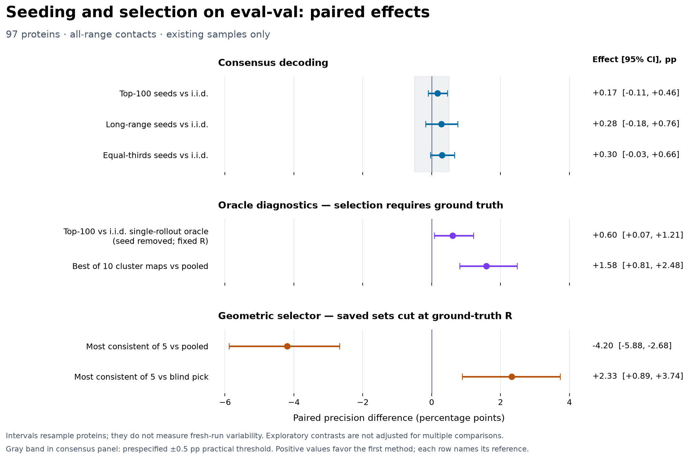

---
marinfold_experiment:
  issue: 254
  title: 'exp: seed each rollout with a top-ranked pairwise contact — does conditioning on our own high-confidence predictions beat i.i.d. sampling?'
  kind: evals
  branch: claude/contact-probability-inference-eval-a2d2ea
---

# exp: seed each rollout with a top-ranked pairwise contact — does conditioning on our own high-confidence predictions beat i.i.d. sampling?

**Issue:** [#254](https://github.com/Open-Athena/MarinFold/issues/254) · **Kind:** `evals`

## Conclusion

**Keep pooled rollout consensus as the current decoder, but do not abandon
seeding or cluster selection on this evidence.** None of the three single-contact
seeding strategies establishes a consensus improvement on these 97 eval-val
proteins. However, top-100 seeding improves the oracle best rollout even after
removing the forced seed and correcting the score denominator. K-means cluster
candidates also have measurable oracle headroom above pooled consensus. The
tested geometric selector fails to capture that headroom; this does not establish
that other selectors or downstream folding cannot do so.

The September 2026 audit reproduces the original consensus scores from all
38,800 saved rollouts, corrects a forced-seed confound and a misleading oracle
metric label, adds paired uncertainty for cluster results, and makes the inputs
public. It replaces the earlier claims that one contact is uninformative,
pointwise ranking is exhausted, and cluster-and-fold is closed. Those conclusions
were stronger than the experiment supports. No new predictor inference or
held-out evaluation was performed in the audit.



## Question and original expectations

Does starting each of 100 contacts-v1 rollouts with a distinct pairwise-predicted
contact improve consensus or the best available individual rollout? Prior work
[#163](https://github.com/Open-Athena/MarinFold/issues/163) motivates partial-map
conditioning, but conditioning on multiple true contacts is a different
intervention from injecting one predicted pair.

The original primary prediction was seeded consensus minus iid consensus <= 0;
the secondary prediction was an oracle best-of-100 improvement. A difference of
0.005 was chosen as a practical comparison band, informed by
[#204](https://github.com/Open-Athena/MarinFold/issues/204). This is not a universal
noise floor or a substitute for uncertainty. All three observed consensus deltas
are positive, so the literal primary directional prediction was not confirmed.
The oracle prediction has support, with a smaller effect under the corrected
fixed-R metric.

## Model, inputs, and scoring

- Checkpoint: `prot-exp232-cw-cv1-decontam-s02-m2-p06-aug`, step **145199**,
  1.5B, decontaminated m2-p06 from [#232](https://github.com/Open-Athena/MarinFold/issues/232).
- Evaluation: exactly **97 natural eval-val monomers** from
  [#245](https://github.com/Open-Athena/MarinFold/issues/245), no eval-test scoring.
- Original sampling: one local A5000, vLLM 0.19.1, bf16; 100 rollouts per protein,
  T=1, top-p=0.95, top-k disabled, token budget `6L+128`, fresh document
  realization per rollout. All four arms have 9,700 rollouts, none empty or capped.
- Arms: iid; top-100 pairwise seeds; 100 long-range seeds; 33/33/34 seeds from
  short/medium/long ranges. Corresponding arms share document realizations.
- Consensus uses exp89's resolved-pair scoring, separation >= 6. R is the number
  of true contacts in the scored universe. The iid control scores **0.521678**,
  within 0.005 of the published m2-p06 value 0.520.
- Reported 95% intervals bootstrap **paired protein-level differences**, conditional
  on this checkpoint, target set, and saved sampling draw. They do not measure
  run-to-run inference variation. Follow-on analyses and multiple comparisons
  are exploratory; no multiplicity correction was applied.

### Consensus: no established win, with unresolved modest gains

| Seed strategy | Consensus R-precision | Delta vs iid | Paired 95% CI |
|---|---:|---:|---|
| iid control | 0.5217 | — | — |
| Top 100 overall | 0.5234 | +0.0017 | [-0.0011, +0.0046] |
| Long-range only | 0.5244 | +0.0028 | [-0.0018, +0.0076] |
| Equal thirds | 0.5247 | +0.0030 | [-0.0003, +0.0066] |

Only the top-100 interval is entirely within the preselected +/-0.005 band.
The other two do not rule out gains larger than 0.005. Removing the injected
seed's own consensus vote leaves the top-100 gain at +0.0020
[-0.0007, +0.0049]. For that same top-100 arm, the exploratory long-range
seed-removed gain is +0.0045 [+0.0001, +0.0094]; it should not be hidden by
calling every readout a tie.

Top-100 seeds are already 56.8% long-range; equal thirds reduces that share.
The targeted long-only arm has long-range consensus 0.5068 versus 0.5042 for iid
and 0.5081 for top-100. These small differences do not establish that targeting
long range is harmful or identify a causal effect of seed separation or rank.

### Oracle: the positive signal survives a stricter metric

The historical `oracle best-of-N` CSV rows use exp82's ordered-rollout precision
**TP / min(R, number of emitted scorable pairs)**. Roughly half the iid and
seeded rollouts emit fewer than R pairs (50.8% and 52.1%). Therefore those rows
are **not directly comparable to consensus R-precision**: a short perfect list
gets score 1 under the historical metric even when it recovers few true contacts.
They remain in the original CSVs for traceability.

`audit_conclusions.py` adds fixed-R scoring, **TP / R**, with missing predictions
counted as misses. It separately removes the injected seed *before* selecting
and scoring the continuation's first R pairs. Oracle selection always uses ground
truth and is a candidate-quality diagnostic, not a deployable prediction method.

| Best-of-100 metric, all ranges | iid | Top-100 seeded | Paired delta [95% CI] |
|---|---:|---:|---|
| Historical precision, full rollout | 0.5199 | 0.5341 | +0.0142 [+0.0055, +0.0249] |
| Fixed-R, full rollout | 0.4892 | 0.4970 | +0.0078 [+0.0027, +0.0135] |
| **Fixed-R, continuation only** | **0.4892** | **0.4952** | **+0.0060 [+0.0007, +0.0121]** |

Even the seeded single-rollout oracle remains below iid pooled consensus
(0.4970 versus 0.5217 under fixed-R scoring). The positive seeding contrast is
therefore a sampling diagnostic, not evidence that selecting one individual
rollout would improve the existing decoder's average contact score.

The corrected continuation gain is heterogeneous: 48 protein wins, seven ties,
42 losses, median delta zero. It supports a small positive candidate-quality
signal, without establishing that diversity is the mechanism. The previously
highlighted long-only historical long-range oracle deficit of -0.0106 has CI
[-0.0276, +0.0030]; a deterioration is not established.

### Correct seed versus wrong seed: remove the given answer first

The original true-versus-false seed comparison counted the injected seed in the
rollout score. That mechanically gives a true seed credit which a false seed
cannot receive. The corrected plots and `*_continuation.csv` tables exclude it.

For top-100 seeding, the within-protein continuation precision difference is
**+0.0055 [+0.0017, +0.0095]**, versus +0.0124 when the injected seed is counted.
Long-only and equal-thirds continuation differences are +0.0073 and +0.0085.
These retain the historical P@min(R, emitted) definition, explicitly labeled as
continuation precision rather than fixed-R recovery.

Even this corrected comparison is **observational**. True and false seeds differ
in contact identity and rank, and the model was not randomized to receive a true
versus false contact with otherwise matched properties. Pooling across proteins
adds a large protein-difficulty confound. Neither comparison proves that one
contact carries little information, that a wrong seed is harmless, or why the
consensus effect is small.

### Coverage and fitted pair ranking

The iid union contains **92.28%** of true contacts on average; the three seeded
unions contain 91.97–92.10%. Vote ranking recovers 52.17% at R, about 67% at 2R,
and 79% at 5R. This is useful evidence of ranking headroom *within the existing
candidate pool*. It does not bound the benefit of extra sampling, which can
also improve ranking among already-proposed pairs.

The actual iid resolved candidate universe contains 3,903,113 pairs, of which
401,689 receive a vote: **89.66% are unvoted negatives**, not the previously
stated 99.9%.
This is pooled across proteins; macro per-protein coverage is reported separately.

| Tested pair score | R-precision | AUC |
|---|---:|---:|
| Votes | 0.5217 | 0.9310 |
| Pairwise probability | 0.4589 | 0.9433 |
| Quality-weighted votes | 0.5232 | 0.9314 |
| Fitted votes + pairwise, all candidates | 0.5152 | 0.9514 |
| Fitted votes + pairwise + emission rank + quality, voted candidates | 0.5231 | 0.9437 |

Fits use five-fold cross-validation over proteins. The best observed improvement
among these feature/model choices is small. Logistic-loss optimization and AUC
are different objectives from top-R recovery; the results do not prove an
unavoidable AUC/R tradeoff or exhaust pointwise ranking. Rollout-quality weighting
itself carries set-level information. Matching in-sample and CV scores is not
proof that model selection on eval-val cannot overfit.

### Clustering: candidate headroom remains; geometric selection falls short

| K-means K | Cluster oracle | Random-partition oracle | Largest cluster |
|---:|---:|---:|---:|
| 2 | 0.5291 | 0.5249 | 0.5142 |
| 3 | 0.5358 | 0.5251 | 0.5118 |
| 5 | 0.5371 | 0.5278 | 0.5108 |
| 10 | 0.5375 | 0.5237 | 0.5094 |
| 20 | 0.5352 | 0.5096 | 0.4983 |

At K=10, the oracle improves on pooled consensus by **+0.0158
[+0.0081, +0.0248]**. Keeping the pooled map as an additional candidate gives
**0.5407**, gain **+0.0190 [+0.0119, +0.0277]**. Thus a useful selector would
**not** have to outperform the oracle. This is a ceiling for these particular
candidates under contact R-precision, not for alternative clustering, additional
samples, or downstream structural accuracy. Lopsided average-linkage clusters
also do not prove the posterior contains only one fold hypothesis.

The exp211 geometric residual selects maps scoring **0.4797 at K=5**, compared
with 0.5217 pooled and 0.4564 for blind selection. Its paired gain over blind
selection is +0.0233 [+0.0089, +0.0374], but it loses **0.0420** to pooled
[-0.0588, -0.0268]. At K=10 the gain over blind selection is inconclusive.
Allowing pooled consensus as a fallback still loses 0.0199 at K=5
[-0.0311, -0.0099], retaining pooled on exact residual ties.

The residual itself uses no reference contact labels. However, this analysis
constructs candidate maps using ground-truth R and the resolved-residue mask,
so the complete selection pipeline is an evaluation diagnostic, not yet a
reference-free deployment recipe. Optimization uses a deterministic RNG stream,
not identical initializations across candidates; long proteins are chunked.
The observed correlation is not evidence of a “12 times” predictive improvement
over another experiment.

### Downstream folding is a separate test

[exp256](../exp256_evals_helico_contact_cut_sweep/README.md) audits the Helico
cut sweep. The original matched-95 lDDT results reproduce, while corrected
contact recall and an all-96 sensitivity analysis sharpen their interpretation.
Passing the noisy union of all pairs harms this tested solver; modest cut
changes have uncertain effects. This does not test folding multiple coherent
cluster candidates and selecting by structure confidence.

## What to test before abandoning the direction

The current evidence justifies retaining iid pooled consensus in production.
A follow-up should keep that map as a candidate, freeze a selector on eval-val,
and test whether it captures the measured cluster headroom before spending on a
large folding sweep. Repeated sampling draws would separate run-to-run variation
from target variation. A matched intervention on seed correctness or multiple
predicted contacts would address the conditioning mechanism more directly.
Any eventual eval-test evaluation should follow a frozen protocol, not be used
to choose among these exploratory variants.

## Reproduce the audit without a GPU

Run from this experiment directory. The public input archive contains the
original four rollout arms, their exact seed files, and 97 pairwise matrices;
its complete file list and SHA-256 checksums are in `data/artifacts.json`.
The download is anonymous and is verified before extraction into a new directory.

```bash
uv run --no-project publish_to_hf.py fetch --manifest data/artifacts.json --out /tmp/exp254-inputs
export PYTHONPATH="$PWD/../../marinfold"
uv run --no-project --python 3.12 --with numpy --with pandas --with pyarrow --with scikit-learn --with gemmi --with fsspec python build_metrics.py --run /tmp/exp254-inputs --out data
uv run --no-project --python 3.12 --with numpy --with pandas --with pyarrow --with scikit-learn python audit_conclusions.py --run /tmp/exp254-inputs --data data --out data
uv run --no-project --python 3.12 --with pytest --with numpy --with pandas --with pyarrow --with scikit-learn --with gemmi --with fsspec pytest test_exp254.py test_audit_conclusions.py -q
uv run --no-project --python 3.12 --with numpy --with pandas --with matplotlib python plot.py --data data --out plots
uv run --no-project --python 3.12 --with numpy --with pandas --with matplotlib python plot_strategies.py --data data --out plots
uv run --no-project --python 3.12 --with numpy --with pandas --with matplotlib python plot_audit.py --data data --out plots
uv run --no-project --with matplotlib python build_summary.py
```

The cluster audit consumes committed per-protein clustering results and per-set
geometric residuals. Rebuilding candidate partitions uses `cluster_rollouts.py`;
reranking uses `rerank_pooled.py --fit-on all` and `--fit-on voted` with the same
`--run` and `--out` arguments. Recomputing the embedding residuals additionally
requires exp211's torch analysis environment and `cluster_consistency.py`.
The September audit independently rebuilds all three clustering methods from
raw rollouts: all 97 per-protein rows and 46 summary rows reproduce exactly.
Reconstructed pooled/K=5/K=10 candidates also match all 1,552 saved geometric
evaluation rows in cluster size, contact count, and precision (within floating
serialization precision). The audit re-scores saved geometry; it does not
independently repeat those optimizer runs or Helico inference.

### Generate new rollouts

The GPU environment is pinned by `uv.lock`. The package is supplied through
`PYTHONPATH` because this checkpoint's tokenizer requires transformers 5.x while
the base marinfold installation pins transformers <5. Use the published model
including its tokenizer:
`hf://buckets/open-athena/MarinFold/checkpoints/prot-exp232-cw-cv1-decontam-s02-m2-p06-aug/hf/step-145199`.

```bash
export PYTHONPATH="$PWD/../../marinfold"
uv sync --extra test
MODEL=/path/to/checkpoint-with-tokenizer
RUN=/path/to/new-run
uv run python rank_pairwise.py --model "$MODEL" --out "$RUN" --strategy top
uv run python rank_pairwise.py --model "$MODEL" --out "$RUN" --strategy long
uv run python rank_pairwise.py --model "$MODEL" --out "$RUN" --strategy stratified
uv run python score_rollouts.py --model "$MODEL" --out "$RUN" --arm iid
uv run python score_rollouts.py --model "$MODEL" --out "$RUN" --arm seeded --seeds "$RUN/seeds_top.parquet"
uv run python score_rollouts.py --model "$MODEL" --out "$RUN" --arm seeded-long --seeds "$RUN/seeds_long.parquet"
uv run python score_rollouts.py --model "$MODEL" --out "$RUN" --arm seeded-strat --seeds "$RUN/seeds_stratified.parquet"
uv run python build_metrics.py --run "$RUN" --out data
```

The original pairwise passes differ slightly under bf16 batching (near-ties can
reorder); seed-conditioned metrics use the exact seed file consumed by each arm.
The archived final pairwise matrices are the saved reranking inputs, not a claim
that every earlier pass was bitwise identical.

`publish_to_hf.py prepare` rebuilds a deterministic archive from `--source`,
`--experiment 254`, `--out` and `--manifest`; `publish` takes that manifest and
`--archive` and uploads only matching bytes. The same script publishes the
separate exp256 portable bundle. See each experiment's committed manifest for
its content-addressed public bucket location.

**Timing limitation:** original iid/top-100 timings were recovered from run logs.
The recorded unit is a chunk of eight proteins scheduled together, not separable
per-protein latency; do not sum duplicated chunk timings. Later rollout code
emits timings at evaluation time. The audit does not manufacture missing timing
measurements.


