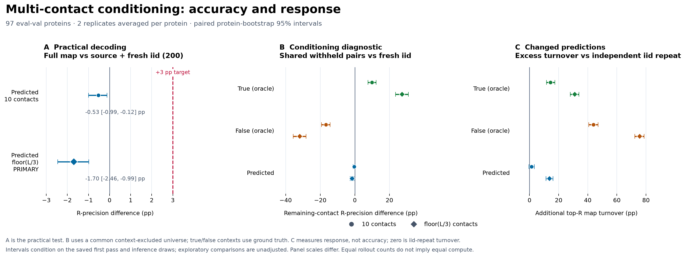

---
marinfold_experiment:
  issue: 254
  title: 'exp: seed each rollout with a top-ranked pairwise contact — does conditioning on our own high-confidence predictions beat i.i.d. sampling?'
  kind: evals
  branch: claude/contact-probability-inference-eval-a2d2ea
---

# exp: seed each rollout with a top-ranked pairwise contact — does conditioning on our own high-confidence predictions beat i.i.d. sampling?

**Issue:** [#254](https://github.com/Open-Athena/MarinFold/issues/254) · **Kind:** `evals`

## Conclusion

**MarinFold responds strongly to contact statements in its prompt.** The controlled
follow-up generated 155,200 completions on all 97 eval-val proteins using the same
m2-p06 checkpoint. After excluding the union of all supplied pairs from every arm's
scoring universe, supplying floor(L/3) true contacts raises remaining-contact
R-precision by **0.2724 [0.2359, 0.3098]**. Equally sized false-contact prompts lower
it by **0.3189 [0.2816, 0.3559]**. These effects concern prediction of contacts that
were never supplied; copying the prompt cannot earn this credit.

**The tested predicted-contact recipe fails the three-percentage-point target.**
Its complete final map scores **0.5077**, versus **0.5247** when the same 100 source
rollouts are pooled with 100 fresh iid rollouts: **−0.0170 [−0.0246, −0.0099]**.
The predeclared +0.03 gain is outside the interval in the wrong direction.
Post-hoc equal-weight blends retaining the source scores recover most of this
loss, but their upper bounds remain below +0.002; none approaches +0.03. Even
predicted prompts change the withheld top-R map: 35.53% turnover versus 21.86%
between independent iid samples. Changed predictions do not imply better ones.

This supports the ability to use contact context and rejects this fixed
high-vote-contact reinjection recipe as a practical improvement on this benchmark.
It does not establish a ceiling for other context-selection or conditioning
methods. True/false oracle controls diagnose behavior; they are not deployable
performance claims. Intervals average two replicates within each protein before
bootstrapping and condition on the archived source and saved inference draws.

The [protocol and recovery amendment](CONDITIONING_PROTOCOL.md), raw-output
verification, independent score reconstruction, and public archive document the
run. Fixed-budget terminations were retained after a post-launch acceptance
amendment; recovery sensitivity is reported below. No eval-test or eval-denovo
accuracy was examined.

The earlier saved-output audit remains below: it corrects forced-seed credit,
short-rollout oracle scoring, and overbroad claims about ranking, clustering,
and prompt insensitivity. Its small gains also fail the current +0.03 target.



## Question and original expectations

Does starting each of 100 contacts-v1 rollouts with a distinct pairwise-predicted
contact improve consensus or the best available individual rollout? Prior work
[#163](https://github.com/Open-Athena/MarinFold/issues/163) motivates partial-map
conditioning, but conditioning on multiple true contacts is a different
intervention from injecting one predicted pair.

The original primary prediction was seeded consensus minus iid consensus <= 0;
the secondary prediction was an oracle best-of-100 improvement. A difference of
0.005 was chosen as a practical comparison band, informed by
[#204](https://github.com/Open-Athena/MarinFold/issues/204). This is not a universal
noise floor or a substitute for uncertainty. All three observed consensus deltas
are positive, so the literal primary directional prediction was not confirmed.
The oracle prediction has support, with a smaller effect under the corrected
fixed-R metric.

## Model, inputs, and scoring

- Checkpoint: `prot-exp232-cw-cv1-decontam-s02-m2-p06-aug`, step **145199**,
  1.5B, decontaminated m2-p06 from [#232](https://github.com/Open-Athena/MarinFold/issues/232).
- Evaluation: exactly **97 natural eval-val monomers** from
  [#245](https://github.com/Open-Athena/MarinFold/issues/245), no eval-test scoring.
- Original sampling: one local A5000, vLLM 0.19.1, bf16; 100 rollouts per protein,
  T=1, top-p=0.95, top-k disabled, token budget `6L+128`, fresh document
  realization per rollout. All four arms have 9,700 rollouts, none empty or capped.
- Arms: iid; top-100 pairwise seeds; 100 long-range seeds; 33/33/34 seeds from
  short/medium/long ranges. Corresponding arms share document realizations.
- Consensus uses exp89's resolved-pair scoring, separation >= 6. R is the number
  of true contacts in the scored universe. The iid control scores **0.521678**,
  within 0.005 of the published m2-p06 value 0.520.
- Reported 95% intervals bootstrap **paired protein-level differences**, conditional
  on this checkpoint, target set, and saved sampling draw. They do not measure
  run-to-run inference variation. Follow-on analyses and multiple comparisons
  are exploratory; no multiplicity correction was applied.

### Consensus: no established win, with unresolved modest gains

| Seed strategy | Consensus R-precision | Delta vs iid | Paired 95% CI |
|---|---:|---:|---|
| iid control | 0.5217 | — | — |
| Top 100 overall | 0.5234 | +0.0017 | [-0.0011, +0.0046] |
| Long-range only | 0.5244 | +0.0028 | [-0.0018, +0.0076] |
| Equal thirds | 0.5247 | +0.0030 | [-0.0003, +0.0066] |

Only the top-100 interval is entirely within the preselected +/-0.005 band.
The other two do not rule out gains larger than 0.005, but all three upper
bounds remain far below the current +0.03 target. Removing the injected
seed's own consensus vote leaves the top-100 gain at +0.0020
[-0.0007, +0.0049]. For that same top-100 arm, the exploratory long-range
seed-removed gain is +0.0045 [+0.0001, +0.0094]; it should not be hidden by
calling every readout a tie.

Top-100 seeds are already 56.8% long-range; equal thirds reduces that share.
The targeted long-only arm has long-range consensus 0.5068 versus 0.5042 for iid
and 0.5081 for top-100. These small differences do not establish that targeting
long range is harmful or identify a causal effect of seed separation or rank.

### How much does the overall prediction change?

`prompt_sensitivity.py` compares contact maps, independently of whether their
accuracy improves. After removing injected seed rows, the 100-rollout seeded
consensus retains about **89–90%** of iid's top-R pairs (macro mean over proteins).
For a size-matched sampling comparison, split the saved samples into disjoint
50-rollout groups, compare iid versus seeded maps, and compare iid versus iid
maps of the same size. Average 40 random splits within each protein first.

| Seed strategy | Top-R pairs retained, 100 vs 100 | Pairs replaced, iid vs seeded, 50 vs 50 |
|---|---:|---:|
| Top 100 | 89.80% | 18.08% |
| Long-range only | 89.01% | 18.22% |
| Equal thirds | 89.59% | 18.20% |

The corresponding **iid-versus-iid 50-sample turnover is 18.30%**. Thus the
aggregate single-contact-seeded maps are similar, and their turnover in this
comparison is close to within-iid sampling variation. These resampled halves
are not independent reruns or a formal test of equivalence. Shared seeds can
couple samples across arms; aggregate overlap can also conceal a response near
the supplied pair or different responses that cancel across the 100 seeds.

Individual same-index continuation contact sets have mean Jaccard overlap
0.472–0.480, so the saved samples are not literally identical. But prompt-length
and sampling-path effects prevent interpreting this as a direct measure of
attention to a seed. The existing data supports a limited observation about
**aggregate predictions under one-contact seeding**, not general insensitivity
to contact statements or to substantial partial maps.

### Oracle: the positive signal survives a stricter metric

The historical `oracle best-of-N` CSV rows use exp82's ordered-rollout precision
**TP / min(R, number of emitted scorable pairs)**. Roughly half the iid and
seeded rollouts emit fewer than R pairs (50.8% and 52.1%). Therefore those rows
are **not directly comparable to consensus R-precision**: a short perfect list
gets score 1 under the historical metric even when it recovers few true contacts.
They remain in the original CSVs for traceability.

`audit_conclusions.py` adds fixed-R scoring, **TP / R**, with missing predictions
counted as misses. It separately removes the injected seed *before* selecting
and scoring the continuation's first R pairs. Oracle selection always uses ground
truth and is a candidate-quality diagnostic, not a deployable prediction method.

| Best-of-100 metric, all ranges | iid | Top-100 seeded | Paired delta [95% CI] |
|---|---:|---:|---|
| Historical precision, full rollout | 0.5199 | 0.5341 | +0.0142 [+0.0055, +0.0249] |
| Fixed-R, full rollout | 0.4892 | 0.4970 | +0.0078 [+0.0027, +0.0135] |
| **Fixed-R, continuation only** | **0.4892** | **0.4952** | **+0.0060 [+0.0007, +0.0121]** |

Even the seeded single-rollout oracle remains below iid pooled consensus
(0.4970 versus 0.5217 under fixed-R scoring). The positive seeding contrast is
therefore a sampling diagnostic, not evidence that selecting one individual
rollout would improve the existing decoder's average contact score.

The corrected continuation gain is heterogeneous: 48 protein wins, seven ties,
42 losses, median delta zero. It supports a small positive candidate-quality
signal, without establishing that diversity is the mechanism. The previously
highlighted long-only historical long-range oracle deficit of -0.0106 has CI
[-0.0276, +0.0030]; a deterioration is not established.

### Correct seed versus wrong seed: remove the given answer first

The original true-versus-false seed comparison counted the injected seed in the
rollout score. That mechanically gives a true seed credit which a false seed
cannot receive. The corrected plots and `*_continuation.csv` tables exclude it.

For top-100 seeding, the within-protein continuation precision difference is
**+0.0055 [+0.0017, +0.0095]**, versus +0.0124 when the injected seed is counted.
Long-only and equal-thirds continuation differences are +0.0073 and +0.0085.
These retain the historical P@min(R, emitted) definition, explicitly labeled as
continuation precision rather than fixed-R recovery.

Even this corrected comparison is **observational**. True and false seeds differ
in contact identity and rank, and the model was not randomized to receive a true
versus false contact with otherwise matched properties. Pooling across proteins
adds a large protein-difficulty confound. Neither comparison proves that one
contact carries little information, that a wrong seed is harmless, or why the
consensus effect is small.

### Coverage and fitted pair ranking

The iid union contains **92.28%** of true contacts on average; the three seeded
unions contain 91.97–92.10%. Vote ranking recovers 52.17% at R, about 67% at 2R,
and 79% at 5R. This is useful evidence of ranking headroom *within the existing
candidate pool*. It does not bound the benefit of extra sampling, which can
also improve ranking among already-proposed pairs.

The actual iid resolved candidate universe contains 3,903,113 pairs, of which
401,689 receive a vote: **89.66% are unvoted negatives**, not the previously
stated 99.9%.
This is pooled across proteins; macro per-protein coverage is reported separately.

| Tested pair score | R-precision | AUC |
|---|---:|---:|
| Votes | 0.5217 | 0.9310 |
| Pairwise probability | 0.4589 | 0.9433 |
| Quality-weighted votes | 0.5232 | 0.9314 |
| Fitted votes + pairwise, all candidates | 0.5152 | 0.9514 |
| Fitted votes + pairwise + emission rank + quality, voted candidates | 0.5231 | 0.9437 |

Fits use five-fold cross-validation over proteins. The best observed improvement
among these feature/model choices is small. Logistic-loss optimization and AUC
are different objectives from top-R recovery; the results do not prove an
unavoidable AUC/R tradeoff or exhaust pointwise ranking. Rollout-quality weighting
itself carries set-level information. Matching in-sample and CV scores is not
proof that model selection on eval-val cannot overfit.

### Clustering: candidate headroom remains; geometric selection falls short

| K-means K | Cluster oracle | Random-partition oracle | Largest cluster |
|---:|---:|---:|---:|
| 2 | 0.5291 | 0.5249 | 0.5142 |
| 3 | 0.5358 | 0.5251 | 0.5118 |
| 5 | 0.5371 | 0.5278 | 0.5108 |
| 10 | 0.5375 | 0.5237 | 0.5094 |
| 20 | 0.5352 | 0.5096 | 0.4983 |

At K=10, the oracle improves on pooled consensus by **+0.0158
[+0.0081, +0.0248]**. Keeping the pooled map as an additional candidate gives
**0.5407**, gain **+0.0190 [+0.0119, +0.0277]**. Thus a useful selector would
**not** have to outperform the oracle. This is a ceiling for these particular
candidates under contact R-precision, not for alternative clustering, additional
samples, or downstream structural accuracy. Lopsided average-linkage clusters
also do not prove the posterior contains only one fold hypothesis.

The exp211 geometric residual selects maps scoring **0.4797 at K=5**, compared
with 0.5217 pooled and 0.4564 for blind selection. Its paired gain over blind
selection is +0.0233 [+0.0089, +0.0374], but it loses **0.0420** to pooled
[-0.0588, -0.0268]. At K=10 the gain over blind selection is inconclusive.
Allowing pooled consensus as a fallback still loses 0.0199 at K=5
[-0.0311, -0.0099], retaining pooled on exact residual ties.

The residual itself uses no reference contact labels. However, this analysis
constructs candidate maps using ground-truth R and the resolved-residue mask,
so the complete selection pipeline is an evaluation diagnostic, not yet a
reference-free deployment recipe. Optimization uses a deterministic RNG stream,
not identical initializations across candidates; long proteins are chunked.
The observed correlation is not evidence of a “12 times” predictive improvement
over another experiment.

### Downstream folding is a separate test

[exp256](../exp256_evals_helico_contact_cut_sweep/README.md) audits the Helico
cut sweep. The original matched-95 lDDT results reproduce, while corrected
contact recall and an all-96 sensitivity analysis sharpen their interpretation.
Passing the noisy union of all pairs harms this tested solver; modest cut
changes have uncertain effects. This does not test folding multiple coherent
cluster candidates and selecting by structure confidence.

## Controlled multi-contact follow-up

The [frozen protocol](CONDITIONING_PROTOCOL.md) tests the same m2-p06 checkpoint on
all 97 eval-val proteins, with two context/sampling replicates and 100 rollouts
per arm: **155,200 new completions** across eight arms. The controls are iid and
an independent iid repeat; interventions supply true, false, or predicted
contacts at doses 10 and floor(L/3). True and false sets have matched sequence
separation bins. Predicted contacts come from the archived 100-rollout iid vote
ranking, selected without ground truth or the resolved-residue mask. Contexts
remain fixed within a replicate and are remapped into each document realization.

For the **practical primary**, 100 source rollouts produce the predicted context,
then 100 conditioned rollouts produce the final map. Its comparator pools that
same source with 100 fresh iid rollouts, also 200 total. Supplied pairs receive
100 votes once each; copied mentions never add extra credit. The target is
**+0.03 absolute R-precision** over this comparator, fixed before new accuracy
was examined. Equal rollout counts do not imply equal compute or latency.

For **mechanistic accuracy**, remove the union of every supplied contact set
from every arm's candidate universe and from its true-contact denominator.
Copied prompt contacts are therefore excluded too. Independent iid repeats
measure sampling-driven map turnover. The forced-next-contact probability probe
measures pair probabilities after forcing `<contact>`; it does not include the
probability of emitting that marker instead of stopping. Average the two
replicates within each protein before a 20,000-draw paired protein bootstrap.
Secondary intervals are pointwise and exploratory.

### Results of the controlled intervention

The practical comparison uses the full standard resolved-pair universe. The
matched 200-rollout baseline is **0.524673**, so the +0.03 objective would require
approximately **0.554673**. Fresh iid-100 is 0.522268; fresh iid-200 is 0.526060.

| Predicted context | Final R-precision | Delta vs shared-source iid-200 | Paired 95% CI |
|---|---:|---:|---:|
| 10 contacts | 0.519378 | −0.005295 | [−0.009930, −0.001242] |
| floor(L/3), primary | 0.507670 | **−0.017003** | **[−0.024636, −0.009889]** |

For the mechanistic comparison, all arms share the same withheld universe and
remaining R. Its iid baseline is **0.336854**, which is a different metric from
full-map R-precision because the supplied-contact union has been removed.

| Context | Remaining-contact R-precision | Delta vs iid | Paired 95% CI |
|---|---:|---:|---:|
| True, 10 | 0.435085 | +0.098231 | [+0.075255, +0.123582] |
| False, 10 | 0.169964 | −0.166891 | [−0.192253, −0.142633] |
| Predicted, 10 | 0.332935 | −0.003919 | [−0.010149, +0.001657] |
| True, floor(L/3) | 0.609295 | **+0.272440** | [+0.235850, +0.309819] |
| False, floor(L/3) | 0.017954 | **−0.318900** | [−0.355889, −0.281558] |
| Predicted, floor(L/3) | 0.320907 | −0.015947 | [−0.027017, −0.005092] |

Large true-versus-false prompts differ by **0.591341 [0.578101, 0.605088]** on
unsupplied contacts. The corresponding withheld top-R turnover relative to iid
is 52.87% for true prompts, 97.47% for false prompts, and 35.53% for predicted
prompts, versus 21.86% for iid resampling. On the same withheld universe, mean
forced-next-contact probability L1 changes are 0.8724, 1.2515, and 0.8450,
respectively. That probe forces the contact marker and is not a measurement of
voluntary contact-emission probability.

These controls contradict general prompt insensitivity on this checkpoint.
Predicted contexts can instead reinforce existing errors, force a fixed set into
the final vote ranking, and alter continuation behavior. This experiment does
not isolate which of those mechanisms causes the practical loss; improved
context quality or selection would require a new practical test against +0.03.
The single-contact result alone could not resolve this distinction.

### Post-hoc check: retaining the first-pass scores

The primary final-map readout discards most first-pass score information. A
subsequent **exploratory, fixed equal-weight blend** keeps those archived scores
and adds either the conditioned continuation votes or complete-document votes.
No new inference, weight search, or model selection is involved. This is an added
analysis after seeing the primary result, not a replacement preregistered test.

| Context | Added votes | Delta vs shared-source iid-200 | Paired 95% CI |
|---|---|---:|---:|
| 10 | Complete document | −0.000911 | [−0.004334, +0.001911] |
| 10 | Continuation | −0.001228 | [−0.004647, +0.001589] |
| floor(L/3) | Complete document | −0.002511 | [−0.007403, +0.001763] |
| floor(L/3) | Continuation | −0.004346 | [−0.009648, −0.000032] |

Retaining source scores removes most of the primary loss. It still provides no
useful gain: every upper bound is below +0.002, far below +0.03. The negative
practical conclusion therefore survives these simple readout alternatives.
See [data/conditioning_blend_summary.csv](data/conditioning_blend_summary.csv).

### Execution and recovery boundaries

All population outputs use H100s with vLLM 0.19.1, transformers 5.15.0, and
PyTorch 2.10.0+cu129. The checkpoint's two weight shards match the local audited
checkpoint byte-for-byte by SHA-256. Its 5.885 GB export was staged once into a
shared eight-GPU RNO2A allocation. Each worker used independent single-GPU
inference; no eval-test or eval-denovo results were read.

The original termination check aborted workers when large false-contact prompts
hit the unchanged `6L+128` completion-token budget. Before examining new accuracy,
acceptance was amended to retain exact-budget terminations and all empty
continuations, preserving the entire cohort. This is a **post-launch amendment**,
not fully preregistered handling. The protocol, public raw archive, and execution
record preserve both worker versions and the original failed groups. Recovered
inference can differ despite identical seeds. Accepted-run truncation rates do
not reconstruct first-attempt rates; the recovery sensitivity substitutes saved
original false-contact outputs and separately examines the retained-initial-unit
cohort. Neither diagnostic replaces the full-cohort primary.

All **155 budget terminations occur in the large-false arm** (155/19,400, 0.799%).
No other arm is capped. Large predicted contexts yield only 78.19 novel parsed
contacts per rollout versus 265.63 for iid, and 856/19,400 contain no parsed contact
at separation >=6. Their aggregate generation time is 307.10 s versus 920.66 s for
iid across the same protein/replicate batches, excluding the common first pass,
probing, prompt construction, setup, and output I/O. Therefore this result does
not rule out alternative allocation of an equal wall-clock budget.

The five preserved initial failure groups contain 81 capped outputs versus 80 in
their accepted reruns; these are observed trigger groups, not a first-attempt
population rate. Despite text differences, replacing their accepted false-contact
votes with the original votes changes no remaining-contact R-precision score.
Excluding all 21 proteins generated by the resumed worker leaves 76 and yields a
primary delta of **−0.017037 [−0.026506, −0.008150]**. This is a selected-cohort
sensitivity, not a replacement primary. See
[data/conditioning_recovery_summary.json](data/conditioning_recovery_summary.json).

Full raw verification covers 155,200 completions and exactly reconstructs all
continuation vote matrices. An independent implementation using explicit residue
pairs and Python sorting reproduces all **3,880 scores** within 1e−12. Probability
matrices were checked numerically but not rerun independently. All **51 tests**
pass across exp254 and exp256.

Per-arm `elapsed_seconds` records generation time. Probability probing is separate.
Per-arm `total_seconds` excludes prompt construction and final serialization;
per-protein completion markers record the entire protein operation. Repeated
model-load fields must not be summed. The initial checkpoint-copy duration was
not persisted after an upload stall; recovered staging records explicitly mark
cache reuse. All prediction timings and worker metadata are saved in
[data/conditioning_timings.csv](data/conditioning_timings.csv).

### Reproduce the controlled run analysis without a GPU

The public archive manifest is [data/conditioning_artifacts.json](data/conditioning_artifacts.json).
It includes raw completions, matrices, timing and completion records, preserved
failure groups, the frozen plan/source votes, and the executed worker sources.
The earlier [input manifest](data/conditioning_inputs.json) preserves the
pre-launch input/code freeze separately. From this experiment directory:

```bash
uv run --python 3.12 publish_to_hf.py fetch --manifest data/conditioning_artifacts.json --out /tmp/exp254-conditioning
export PYTHONPATH="$PWD/../../marinfold"
uv run --no-project --python 3.12 --with numpy --with pandas --with gemmi --with fsspec python verify_conditioning.py --plan /tmp/exp254-conditioning/inputs/plan.json --run /tmp/exp254-conditioning/run --accept-budget-termination --worker-sha256 843a79f0ab7c81c90b2965ab46b90bd46fb99f64ca0c17de3a3c84ca6283831b --worker-sha256 01b2ffb79e307d451e7ea29fb91e02955ac2ae7e14a59b14691b0818da8a893a --out data/conditioning_verification.json
uv run --no-project --python 3.12 --with numpy --with pandas python analyze_conditioning.py --plan /tmp/exp254-conditioning/inputs/plan.json --run /tmp/exp254-conditioning/run --out data
uv run --no-project --python 3.12 --with numpy --with pandas python audit_conditioning_results.py --plan /tmp/exp254-conditioning/inputs/plan.json --run /tmp/exp254-conditioning/run --data data
uv run --no-project --python 3.12 --with numpy --with pandas --with gemmi --with fsspec python conditioning_recovery_sensitivity.py --plan /tmp/exp254-conditioning/inputs/plan.json --run /tmp/exp254-conditioning/run --analysis data --failures /tmp/exp254-conditioning/run/initial_failures --out data --original-worker-sha256 843a79f0ab7c81c90b2965ab46b90bd46fb99f64ca0c17de3a3c84ca6283831b --resumed-worker-sha256 01b2ffb79e307d451e7ea29fb91e02955ac2ae7e14a59b14691b0818da8a893a
uv run --no-project --python 3.12 --with numpy --with pandas python conditioning_blend_check.py --plan /tmp/exp254-conditioning/inputs/plan.json --run /tmp/exp254-conditioning/run --out data
uv run --no-project --python 3.12 --with numpy --with pandas --with matplotlib python plot_conditioning.py --data data --out plots
uv run --no-project --python 3.12 --with matplotlib python build_summary.py
```

## Reproduce the audit without a GPU

Run from this experiment directory. The public input archive contains the
original four rollout arms, their exact seed files, and 97 pairwise matrices;
its complete file list and SHA-256 checksums are in `data/artifacts.json`.
The download is anonymous and is verified before extraction into a new directory.

```bash
uv run --no-project publish_to_hf.py fetch --manifest data/artifacts.json --out /tmp/exp254-inputs
export PYTHONPATH="$PWD/../../marinfold"
uv run --no-project --python 3.12 --with numpy --with pandas --with pyarrow --with scikit-learn --with gemmi --with fsspec python build_metrics.py --run /tmp/exp254-inputs --out data
uv run --no-project --python 3.12 --with numpy --with pandas --with pyarrow --with scikit-learn python audit_conclusions.py --run /tmp/exp254-inputs --data data --out data
uv run --no-project --python 3.12 --with numpy --with pandas --with pyarrow --with scikit-learn python prompt_sensitivity.py --run /tmp/exp254-inputs --out data
uv run --no-project --python 3.12 --with pytest --with numpy --with pandas --with pyarrow --with scikit-learn --with gemmi --with fsspec pytest test_exp254.py test_audit_conclusions.py -q
uv run --no-project --python 3.12 --with numpy --with pandas --with matplotlib python plot.py --data data --out plots
uv run --no-project --python 3.12 --with numpy --with pandas --with matplotlib python plot_strategies.py --data data --out plots
uv run --no-project --python 3.12 --with numpy --with pandas --with matplotlib python plot_audit.py --data data --out plots
uv run --no-project --with matplotlib python build_summary.py
```

The cluster audit consumes committed per-protein clustering results and per-set
geometric residuals. Rebuilding candidate partitions uses `cluster_rollouts.py`;
reranking uses `rerank_pooled.py --fit-on all` and `--fit-on voted` with the same
`--run` and `--out` arguments. Recomputing the embedding residuals additionally
requires exp211's torch analysis environment and `cluster_consistency.py`.
The September audit independently rebuilds all three clustering methods from
raw rollouts: all 97 per-protein rows and 46 summary rows reproduce exactly.
Reconstructed pooled/K=5/K=10 candidates also match all 1,552 saved geometric
evaluation rows in cluster size, contact count, and precision (within floating
serialization precision). The audit re-scores saved geometry; it does not
independently repeat those optimizer runs or Helico inference.

### Generate new rollouts

The GPU environment is pinned by `uv.lock`. The package is supplied through
`PYTHONPATH` because this checkpoint's tokenizer requires transformers 5.x while
the base marinfold installation pins transformers <5. Use the published model
including its tokenizer:
`hf://buckets/open-athena/MarinFold/checkpoints/prot-exp232-cw-cv1-decontam-s02-m2-p06-aug/hf/step-145199`.

```bash
export PYTHONPATH="$PWD/../../marinfold"
uv sync --extra test
MODEL=/path/to/checkpoint-with-tokenizer
RUN=/path/to/new-run
uv run python rank_pairwise.py --model "$MODEL" --out "$RUN" --strategy top
uv run python rank_pairwise.py --model "$MODEL" --out "$RUN" --strategy long
uv run python rank_pairwise.py --model "$MODEL" --out "$RUN" --strategy stratified
uv run python score_rollouts.py --model "$MODEL" --out "$RUN" --arm iid
uv run python score_rollouts.py --model "$MODEL" --out "$RUN" --arm seeded --seeds "$RUN/seeds_top.parquet"
uv run python score_rollouts.py --model "$MODEL" --out "$RUN" --arm seeded-long --seeds "$RUN/seeds_long.parquet"
uv run python score_rollouts.py --model "$MODEL" --out "$RUN" --arm seeded-strat --seeds "$RUN/seeds_stratified.parquet"
uv run python build_metrics.py --run "$RUN" --out data
```

The original pairwise passes differ slightly under bf16 batching (near-ties can
reorder); seed-conditioned metrics use the exact seed file consumed by each arm.
The archived final pairwise matrices are the saved reranking inputs, not a claim
that every earlier pass was bitwise identical.

`publish_to_hf.py prepare` rebuilds a deterministic archive from `--source`,
`--experiment 254`, `--out` and `--manifest`; `publish` takes that manifest and
`--archive` and uploads only matching bytes. The same script publishes the
separate exp256 portable bundle. See each experiment's committed manifest for
its content-addressed public bucket location.

**Timing limitation:** original iid/top-100 timings were recovered from run logs.
The recorded unit is a chunk of eight proteins scheduled together, not separable
per-protein latency; do not sum duplicated chunk timings. Later rollout code
emits timings at evaluation time. The audit does not manufacture missing timing
measurements.


