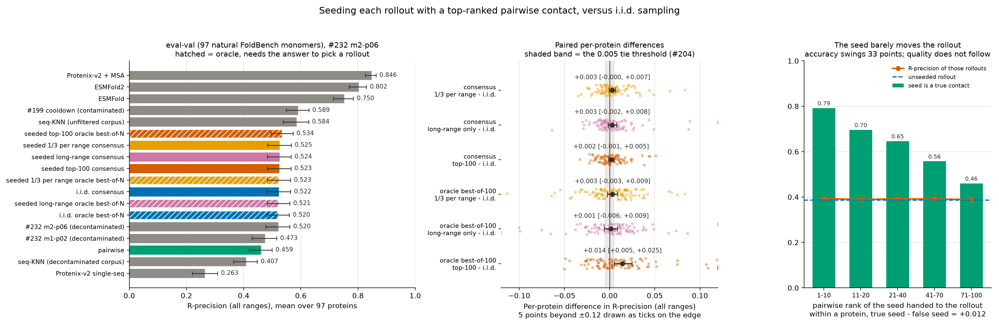
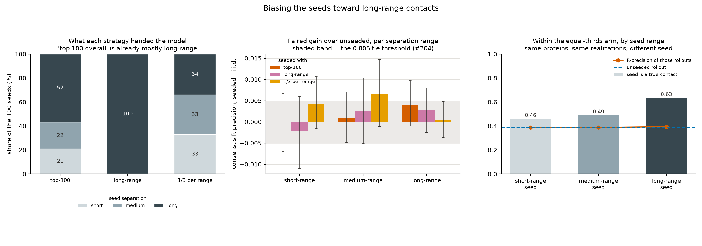

---
marinfold_experiment:
  issue: 254
  title: 'exp: seed each rollout with a top-ranked pairwise contact — does conditioning on our own high-confidence predictions beat i.i.d. sampling?'
  kind: evals
  branch: claude/contact-probability-inference-eval-a2d2ea
---

# exp: seed each rollout with a top-ranked pairwise contact — does conditioning on our own high-confidence predictions beat i.i.d. sampling?

**Issue:** [#254](https://github.com/Open-Athena/MarinFold/issues/254) · **Kind:** `evals` · **Branch:** `claude/contact-probability-inference-eval-a2d2ea`

## Question

Does **seeding** each of N contacts-v1 rollouts with a distinct high-confidence
contact — taken from the *pairwise* `P(contact)` readout, one seed per rollout —
beat plain i.i.d. rollout sampling, measured both by consensus R-precision and by
oracle best-of-N?

## Hypothesis

Two things are known and they pull in opposite directions.

1. **Conditioning on true partial structure is enormously informative.**
   [#163](https://github.com/Open-Athena/MarinFold/issues/163) found that
   prompting a rollout with *ground-truth* partial contacts lifted R-precision
   from 0.145 to 0.556. The joint signal is there; the problem has always been
   that we have no oracle at inference time.
2. **The pairwise readout is a weak stand-in for that oracle.** Under exp82's
   comparison the same weights score ~0.086 *lower* in R-precision under pairwise
   than under rollout voting, so the pairwise top-N is a noisy prior — good
   enough to be better than chance, not good enough to be trusted.

So the pre-registered expectation is:

- **Consensus:** roughly a wash, possibly slightly *worse* than i.i.d. A wrong
  seed poisons a whole rollout, and the seeded pairs additionally get a
  structural +1 vote each, which imports pairwise's ranking errors into the
  consensus. I do not expect this arm to clear i.i.d. by more than noise
  (0.005).
- **Oracle best-of-N:** seeded should be **better**. Forcing N *distinct*
  starting pairs decorrelates the rollouts, which is a broader search of the
  contact-map posterior — exactly what a best-of-N readout rewards. If seeding
  buys anything, it should show up here first, and that would make it a
  candidate reranking/RFT signal rather than a deployable decoder on its own.

The interesting negative result is also informative: if seeded oracle best-of-N
does *not* beat i.i.d. oracle best-of-N, then the per-rollout diversity we
already get from realization resampling is saturating the search, and the
headroom #163 identified is not reachable by conditioning on our own noisy
predictions.

## Background

- [#82](https://github.com/Open-Athena/MarinFold/issues/82) settled
  rollout+resample as the best LM-only contact inference and measured the
  pairwise-vs-rollout gap.
- [#163](https://github.com/Open-Athena/MarinFold/issues/163) measured the
  true-partial-conditioning ceiling (0.145 → 0.556) and found unconditional
  consensus over noisy candidates worth ~nothing (0.22 tie).
- [#232](https://github.com/Open-Athena/MarinFold/issues/232) /
  [#245](https://github.com/Open-Athena/MarinFold/issues/245) produced the
  decontaminated `m2-p06` checkpoint and the eval-val / eval-test / eval-denovo
  split. This experiment uses **`m2-p06` only**, and **eval-val only** — no
  eval-test read.

## Approach

Model: `contacts-v1-exp232-m2-p06-1.5B`
(`prot-exp232-cw-cv1-decontam-s02-m2-p06-aug` step-145199), from the public HF
bucket. Eval set: **eval-val, 97 natural FoldBench monomers** (#245). Sampling
recipe fixed to exp82's: T=1.0, top-p 0.95, top-k disabled, token budget
`6L+128`, N=100 rollouts per protein, one fresh document realization per rollout.

Three phases, all on one local A5000 via vLLM:

1. **Pairwise pass** (`rank_pairwise.py`) — the `P(contact)` readout from
   `marinfold.document_structures.contacts_v1.inference` on one canonical
   realization per protein; keep the top-100 pairs (sep ≥ 6) per protein as the
   seed list.
2. **Rollout pass** (`score_rollouts.py`), two arms over the same 97 proteins:
   - `iid` — the published exp82 recipe, unchanged. The control.
   - `seeded` — rollout *r* starts from realization *r* whose structure section
     is pre-filled with the *r*-th ranked pairwise contact, written in that
     realization's position tokens with a coin-flipped orientation (training
     randomizes pair orientation, so a fixed orientation would be off-manifold).
   Both arms dump **per-rollout, order-preserving contact lists** as well as the
   aggregated vote matrix, which is what the oracle readout needs.
3. **Scoring** (`build_metrics.py`, `plot.py`) — exp89's `compute_metrics.py`
   for consensus, exp82's `build_oracle_best_rollout.py` definition for oracle
   best-of-N. For the seeded arm, consensus is reported **both** with and
   without the seeded pair counted in its own rollout's vote, since the +1 is an
   artifact of the construction rather than a model prediction.

Deliverable: one plot on eval-val with all four MarinFold arms (iid consensus,
iid oracle-best-of-100, seeded consensus, seeded oracle-best-of-100) plus the
standard #245 predictors (Protenix-v2 single-seq and +MSA, ESMFold, ESMFold2,
both seq-KNN nulls, and the #199 cooldown / #232 checkpoints).

## Success criteria

All on eval-val (n=97), all-range R-precision, with long-range reported
alongside. **Differences under 0.005 are ties** (#204's four-replicate span is
0.0023).

- **Sanity gate:** the `iid` arm must reproduce #245's published m2-p06 eval-val
  R-precision of **0.520** within 0.005. If it does not, the harness is wrong and
  nothing else is reportable.
- **Primary:** seeded consensus − iid consensus. Preregistered prediction: ≤ 0,
  i.e. no win.
- **Secondary:** seeded oracle-best-of-100 − iid oracle-best-of-100.
  Preregistered prediction: > 0.
- Paired per-protein deltas with bootstrap intervals for both, not just the
  macro means.

## How to run

One local A5000, three GPU phases plus scoring. The `marinfold` package goes on
`PYTHONPATH` rather than into the venv: its base install pins
`transformers>=4.40,<5`, and the published m2-p06 export declares
`tokenizer_class: TokenizersBackend`, which only transformers 5.x resolves. This
is the same split exp82's CoreWeave worker uses (`pip install marinfold
--no-deps` into a vLLM image).

```bash
export PYTHONPATH=$PWD/../../marinfold
uv sync --extra test && uv run pytest test_exp254.py -q

MODEL=/data/exp_contactseed/model_m2_p06     # the published bucket export
RUN=/data/exp_contactseed/run

.venv/bin/python rank_pairwise.py  --model "$MODEL" --out "$RUN"
.venv/bin/python score_rollouts.py --model "$MODEL" --out "$RUN" --arm iid
.venv/bin/python score_rollouts.py --model "$MODEL" --out "$RUN" --arm seeded \
    --seeds "$RUN/seeds.parquet"
.venv/bin/python build_metrics.py --run "$RUN" --out data
.venv/bin/python plot.py --data data --out plots
```

The weights come from the public bucket, anonymously:
`hf://buckets/open-athena/MarinFold/checkpoints/prot-exp232-cw-cv1-decontam-s02-m2-p06-aug/hf/step-145199`
(`huggingface_hub>=1.5`; `list_bucket_tree` / `download_bucket_files` — buckets
are invisible to `snapshot_download`). Rollouts and pairwise matrices stay on
local disk under `$RUN`; only the derived CSVs and the figure are committed.

## Results

Ran 2026-08-21 on one workstation A5000 (vLLM 0.19.1, bf16). 97 proteins x 100
rollouts per arm, 33.7 min per arm; the pairwise pass took 4.2 min for all 97.
**Zero of 9,700 rollouts hit the token cap in any arm, and zero emitted
nothing** -- the `6L+128` budget never binds on this set.

### The gate

| | this run | #245 published | Δ |
|---|---:|---:|---:|
| m2-p06, eval-val, all-range R-precision, rollout consensus | **0.5217** | 0.520 | +0.0017 |

Inside the 0.005 tie band, so the harness reproduces the published recipe and
everything below is on the same axis as every other MarinFold contact number.

### Four arms

Three seeding strategies, all against the same unseeded control, all sharing
their document realizations with it. "Oracle best-of-100" needs the ground truth
to pick a rollout and is a headroom diagnostic, not a recipe.

| readout | R (all) | R (short) | R (medium) | R (long) |
|---|---:|---:|---:|---:|
| pairwise `P(contact)` (the seed source) | 0.4589 | 0.5116 | 0.4649 | 0.4401 |
| **i.i.d. consensus** (control) | 0.5217 | 0.5701 | 0.5250 | 0.5042 |
| seeded top-100 consensus | 0.5234 | 0.5701 | 0.5260 | **0.5081** |
| seeded long-range consensus | 0.5244 | 0.5678 | 0.5275 | 0.5068 |
| **seeded ⅓ per range consensus** | **0.5247** | 0.5743 | 0.5316 | 0.5046 |
| *i.i.d. oracle best-of-100* | *0.5199* | *0.6503* | *0.6116* | *0.5415* |
| *seeded top-100 oracle best-of-100* | *0.5341* | *0.6557* | *0.6151* | *0.5433* |
| *seeded long-range oracle best-of-100* | *0.5214* | *0.6484* | *0.6158* | *0.5309* |
| *seeded ⅓ per range oracle best-of-100* | *0.5232* | *0.6549* | *0.6128* | *0.5375* |

Paired per-protein differences against the control, all-range R-precision:

| seeded with | consensus Δ | 95 % CI | oracle Δ | 95 % CI |
|---|---:|---|---:|---|
| top 100 overall | +0.0017 | [−0.0011, +0.0046] | **+0.0142** | [+0.0055, +0.0247] |
| long-range only | +0.0028 | [−0.0018, +0.0076] | +0.0015 | [−0.0059, +0.0084] |
| ⅓ per range | +0.0030 | [−0.0003, +0.0066] | +0.0033 | [−0.0025, +0.0089] |

**Both preregistered predictions held, and neither seeding variant changed
them.** Every consensus arm is a tie: the largest is +0.0030 with an interval
straddling zero and inside #204's 0.005 noise floor. Removing the seed's own
vote moves the numbers by ≤ 0.0005, so the ties are not an artefact of the
construction.

The only significant effect anywhere is **top-100 seeding's oracle best-of-100,
+0.0142** — and it is exactly the arm that does *not* concentrate its seeds.
Restricting all 100 seeds to long range gives that gain up (+0.0015), and at
long range the long-only oracle drops **0.0106 below the unseeded control**.
Narrowing the search is worse than spreading it, which is the signature of a
diversity effect rather than an accuracy one.

### Biasing toward long range does not work, and "equal thirds" is not that bias

**The top-100 seeds are already 56.8 % long-range**, because long-separation
pairs dominate the candidate universe. Equal thirds therefore *lowers* the
long-range share to 34 %; only the long-only arm is a bias toward long range.
Neither helps, and the arm aimed at long range is behind the unaimed one at long
range (0.5068 vs 0.5081).

Seed accuracy by range explains why nothing moves, and corrects an obvious
reading: long-range seeds are not intrinsically worse. Inside the equal-thirds
arm they are the *most* accurate (63.5 %, against 49.0 % medium and 46.0 %
short). The long-only arm's 49.1 % is a depth effect — it goes 100 deep into
long range where equal thirds goes 34 deep. **Depth into the ranking is what
costs accuracy, not separation range.** And the R-precision of the rollouts
those seeds produced is flat at 0.3934 / 0.3884 / 0.3885.

### Why every arm ties: one contact is almost no conditioning

The rollout index *is* the pairwise rank of its seed, so each arm carries its own
dose-response curve. For the top-100 arm:

| seed rank | seed is a true contact | R-precision of those rollouts |
|---|---:|---:|
| 1–10 | 79.2 % | 0.3931 |
| 11–20 | 69.6 % | 0.3898 |
| 21–40 | 64.6 % | 0.3921 |
| 41–70 | 55.7 % | 0.3917 |
| 71–100 | 46.0 % | 0.3890 |
| *unseeded (i.i.d.)* | — | *0.3868* |

A 33-point swing in whether the model was told the truth moves the rollout it
then writes by 0.004. Within a protein a true seed beats a false one by
**+0.0124** [+0.0082, +0.0168] (top-100), +0.0141 (long-range), +0.0154 (⅓ per
range) — all tiny, all consistent — while a false seed costs nothing measurable
against no seed at all.

**The pooled version of that split is a trap and is not the result.** Pooled it
reads +0.18, which is almost entirely protein difficulty: a protein the model
handles well supplies both more correct seeds and better rollouts.
`exp254_seed_conditioning_summary.csv` carries both so the confound is visible.

### The bottleneck is ranking, not diversity

The natural next move after "seeding buys diversity" is to seek more diversity.
The rollouts say don't:

| | recall@R | @2R | @5R | union of all 100 |
|---|---:|---:|---:|---:|
| i.i.d., all-range | 0.522 | 0.670 | 0.794 | **0.923** |
| i.i.d., long-range | 0.504 | 0.647 | 0.767 | **0.900** |

**The 100 rollouts already propose 92 % of the true contacts**, from only 15.7×R
distinct pairs (~12 % of the candidate universe), and the mean pairwise Jaccard
between two rollouts of one protein is **0.257** — they already share barely a
quarter of their contacts. All three seeded arms match these numbers to ±0.002.
More diversity can buy at most the remaining 0.08 and would make the vote noisier;
the 0.52 → 0.92 gap is ranking loss and is five times larger.

### Re-ranking the pooled pairs does not close it either

`rerank_pooled.py` scores the pooled candidates with features that cost no extra
inference, 5-fold cross-validated over proteins (in-sample matched CV to four
decimals, so nothing is overfitting):

| score | R (all) | AUC (all) |
|---|---:|---:|
| votes only (exp82 recipe) | 0.5217 | 0.9310 |
| pairwise only | 0.4589 | 0.9433 |
| emission rank only | 0.0204 | 0.8835 |
| **quality-weighted votes** (no fitting) | **0.5232** | 0.9314 |
| fitted votes + pairwise, over *all* candidates | 0.5152 | **0.9514** |
| fitted votes + pairwise + quality, over *voted* candidates | 0.5231 | 0.9437 |

**You can have AUC or R, not both.** Fitting over all candidates is 99.9 %
never-proposed negatives, so the objective optimises the tail: AUC gains
**+0.020** while R-precision loses 0.0065. Restricting the fit to pairs some
rollout proposed recovers R and most of the AUC. The best R-precision from any
re-ranking is **+0.0015** — a tie — and it comes from weighting each rollout's
votes by its own self-consistency, which needs no fitting at all.

Votes, pairwise probability, emission rank and rollout-quality weighting are all
measuring the same marginal confidence, and they agree. Closing 0.52 → 0.92 needs
*joint* information, not another pointwise feature.

### Clustering the rollouts: a small ceiling, and a selector that cannot reach it

If the 100 rollouts held several distinct fold hypotheses, clustering them and
taking a consensus per cluster would give K candidate maps whose best could beat
the single pooled consensus. `cluster_rollouts.py` measures that ceiling, with a
**random equal partition as the control** so a negative cannot be blamed on the
clustering algorithm:

| K (k-means) | oracle@K | random control | largest cluster (no oracle) |
|---:|---:|---:|---:|
| 2 | 0.5291 (+0.0074) | 0.5249 (+0.0032) | 0.5142 (−0.0075) |
| 3 | 0.5358 (+0.0141) | 0.5251 (+0.0034) | 0.5118 (−0.0099) |
| 5 | 0.5371 (+0.0154) | 0.5278 (+0.0061) | 0.5108 (−0.0108) |
| **10** | **0.5375 (+0.0158)** | 0.5237 (+0.0020) | 0.5094 (−0.0123) |
| 20 | 0.5352 (+0.0135) | 0.5096 (−0.0120) | 0.4983 (−0.0234) |

Clustering finds something — k-means beats the random control by ~0.009 at K=5 —
but **the ceiling is +0.0158 with a perfect selector**, and it plateaus by K=10.
Average-linkage on Jaccard is degenerate here, putting 93 of 100 rollouts in one
cluster: there is one diffuse mode, not several hypotheses, and k-means only
helps because it forces splits.

### #211's geometric self-consistency as the selector

`cluster_consistency.py` scores each cluster consensus with
[#211](https://github.com/Open-Athena/MarinFold/issues/211)'s reference-free 3D
embeddability residual and picks the most consistent. All of a protein's
candidates are cut at the same R and scored in one `embed_residual` call, so the
comparison is paired and no candidate is favoured by being shorter.

| K | single | blind pick | largest cluster | **most consistent** | oracle |
|---:|---:|---:|---:|---:|---:|
| 5 | 0.5217 | 0.4564 | 0.5108 | **0.4797** | 0.5371 |
| 10 | 0.5217 | 0.4178 | 0.5094 | **0.4333** | 0.5375 |

**The selector works, and it still loses.** Mean Spearman ρ(excess, precision)
within a protein is **−0.210** at K=5 — negative is the predictive direction,
since lower excess means more self-consistent — and predictive on 65 % of
proteins. It beats blind picking by **+0.023**. That is a genuinely stronger
signal than #211 itself found: on individual rollouts it measured ρ = −0.0175,
useful on 51.8 % of proteins, a coin flip. **Aggregating rollouts into a cluster
consensus makes #211's metric about twelve times more discriminative**, which is
new and is the one positive result here.

It does not matter, because **the candidates are worse than what we already
have.** A cluster consensus averages 20 rollouts where the pooled consensus
averages 100, so the blind cluster is 0.4564 against the pooled 0.5217. Even a
perfect pick reaches only 0.5371 (+0.0154), and a good-but-imperfect one lands at
0.4797 — **0.042 below simply not clustering**. Restricting to the 54 proteins at
L ≥ 100 with no unresolved gap, where #211 says its metric has power, changes
nothing: −0.0477 against the pooled consensus.

So the cluster-and-fold idea is closed at the contact level, and for a reason
that no downstream selector can fix: a folding model's confidence head would have
to be better than an oracle to make K candidates beat the one map we get for
free. `exp254_cluster_consistency.csv.gz` holds all 1,552 scored sets.





Artifacts: `data/exp254_per_protein.csv.gz` (13 readouts × 97 × 4 ranges × 5
cuts), `exp254_headline.csv`, `exp254_paired_deltas.csv`,
`exp254_seed_conditioning.csv.gz` (38,800 individual rollouts),
`exp254_seed_conditioning_summary.csv`, `exp254_seed_rank.csv`,
`exp254_seed_range.csv`, `exp254_seed_composition.csv`, `exp254_blend_curve.csv`,
`exp254_rerank_summary_{all,voted}.csv`, `timings.csv`. Rollout dumps and
pairwise matrices stay on local disk under `/data/exp_contactseed/run` (~1 GB).

**Timing caveat.** `data/timings.csv` for this run was parsed from the run log by
`collect_timings.py` (`source = run_log`) rather than emitted during it;
`score_rollouts.py` now writes the same CSV at eval time. In both cases the
timing unit is the **chunk** of 8 proteins, not the protein: vLLM schedules a
chunk's 800 rollouts together, so there is no separable per-protein inference
time. Do not sum `elapsed_seconds`.

**Reproducibility caveat.** The pairwise pass is not bitwise reproducible across
runs (bf16 batching). Two passes over the same 97 proteins agreed on 98.9/100
seeds per protein, Spearman 0.9994 on matched pairs, median relative difference
0 — near-ties reorder, nothing else. Far below the effect sizes here, but the
`seeded top-100` arm is scored against the exact seed file it consumed
(`seeds_top.parquet`) rather than a re-draw.

## Conclusion

**Seeding rollouts with our own predicted contacts does not improve contact
prediction, under any of three seeding strategies.** Consensus R-precision is
0.5234 (top-100), 0.5244 (long-range only) and 0.5247 (⅓ per range) against a
0.5217 control — ties by any reading, and both preregistered predictions held.

The reason is sharper than the headline. It is not that the seeds are bad: 58 %
of the top-100 pairs are true contacts and 79 % of the top ten are. It is that
**one contact is almost no conditioning at all.** Handing a rollout a true
contact instead of a false one changes what it writes by +0.012–0.015, and
handing it a false one instead of nothing costs about +0.001. Against #163's
finding that conditioning on *true partial contact sets* lifts R-precision from
0.145 to 0.556, the signal lives in the joint structure of many contacts, and a
single pair is not enough constraint to move a 1.5B model that has already read
the whole sequence.

**Biasing the seeds toward long range does not rescue it** — not on the
all-range number, and not even at long range, where the arm aimed there trails
the unaimed one. Depth into the pairwise ranking, not separation, is what
degrades a seed.

**And the follow-on levers are narrower than they look.** The one thing seeding
did buy was diversity (top-100 seeding's oracle best-of-100, +0.0142), but the
rollouts are already diverse: 100 of them cover 92 % of the true contacts with
0.257 mean pairwise overlap. Nor is the answer better pointwise ranking — votes,
pairwise probability, emission rank and self-consistency weighting all agree with
each other, and the best re-ranking is +0.0015.

**Clustering the rollouts into separate hypotheses is closed too.** They are one
diffuse mode, not several: the ceiling from a perfect pick among K cluster
consensuses is +0.0158, and #211's geometric self-consistency — which turns out
to be *twelve times* more discriminative on cluster consensuses than on
individual rollouts, ρ = −0.210 against #211's −0.0175 — still lands 0.042 below
simply not clustering, because every candidate averages fewer rollouts than the
pooled consensus does.

So the 0.52 → 0.92 gap between what the sampler proposes and what the vote count
ranks into the top R is this model's real contact-prediction headroom, and none
of sampling, seeding, pointwise re-ranking, clustering or geometric selection
reaches it. What is left is joint conditioning on partial maps of size k > 1,
which is where #163 found the signal, or a folding model in the training loop
rather than the selection loop. The downstream half of the question — how many of
these pairs a folding model actually wants —
is [#256](https://github.com/Open-Athena/MarinFold/issues/256), and its answer is
that the extra recall is worth nothing until it becomes precision.

**One structural note.** `cluster_consistency.py` puts #211's `consistency.py` on
its second use case, which per `experiments/AGENTS.md` is the trigger to promote
it into an `evals/` kind library. That means creating the library and rewriting a
merged experiment's imports, so this experiment imports it by path and flags the
debt here rather than restructuring the repo unilaterally.

Two side findings worth keeping: consensus over 100 rollouts already matches the
oracle best single rollout at all-range on this set (0.5217 vs 0.5199), and the
remaining best-of-N headroom is entirely long-range (+0.0374 [+0.0129, +0.0660]).
