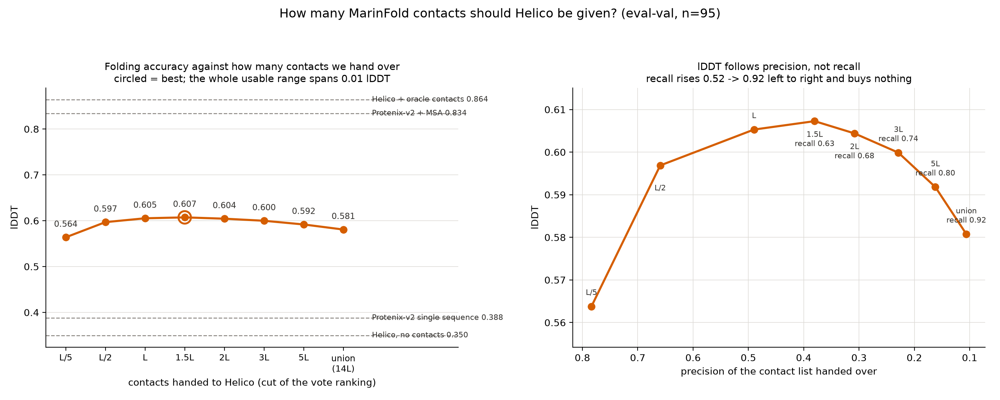

---
marinfold_experiment:
  issue: 256
  title: 'exp: how many contacts should we hand Helico? sweep the cut past top-L, up to every pair any rollout proposed'
  kind: evals
  branch: claude/contact-probability-inference-eval-a2d2ea
---

# exp: how many contacts should we hand Helico? sweep the cut past top-L, up to every pair any rollout proposed

**Issue:** [#256](https://github.com/Open-Athena/MarinFold/issues/256) · **Kind:** `evals` · **Branch:** `claude/contact-probability-inference-eval-a2d2ea`

## Question

Does handing Helico **more than top-L** MarinFold contacts improve folding
accuracy, and where does the lDDT-versus-k curve actually turn?

## Hypothesis

Two measurements point at a gap nobody has looked in.

**From [#254](https://github.com/Open-Athena/MarinFold/issues/254):** the 100
rollouts behind a MarinFold contact prediction collectively propose **92 % of
the true contacts** (union recall 0.923 all-range, 0.900 long-range) using only
~15.7×R distinct pairs. Ranking them by vote count recovers 0.52 at the R cut,
0.67 at 2R and 0.79 at 5R. There is a lot of true signal sitting between rank L
and rank 5L that the top-L cut throws away, and #254 established that no
pointwise re-ranking recovers it (best +0.0015, a tie).

**From helico's side:** the existing cut sweep only ever went *down* — top-L/5,
top-L/2, top-L — and is already flat at the top end (lDDT 0.480 / 0.508 / 0.513
on FoldBench; on natural-pooled and designed targets it reverses). Nobody has
run a cut above L.

Helico's `contact-list` conditioning marks unlisted pairs **UNKNOWN, not
ABSENT** (`src/helico/contacts.py`), so a longer list does not overwrite true
negatives — it only trades precision for recall. It was trained with precision
sampled down to `MIN_SAMPLED_PRECISION = 0.4`.

So the prediction is a **shallow interior optimum between L and 2L**: at 2R the
list is ~0.33 precision, just under Helico's training floor but close to it,
while recall rises 0.52 → 0.67. By 5L (precision ~0.16) and certainly at the
full union (**~6 % precision**, ~10× outside anything Helico saw in training)
lDDT should fall. If the curve is instead flat or still rising at 3L, the
"emit fewer, better contacts" framing that top-L encodes is wrong.

## Background

- [#254](https://github.com/Open-Athena/MarinFold/issues/254) — the coverage
  diagnostic above, and the reranking negative that motivates going wider
  instead of trying to rank better.
- [helico#14](https://github.com/Open-Athena/helico/issues/14) /
  `experiments/exp14_foldbench_held_out_monomers` — the run this extends. Same
  checkpoint, same targets, same index map; it produced the published
  `top-L = 0.619` lDDT on eval-test.
- `RESULTS_contact_conditioning.md` — the L/5 → L/2 → L sweep, and the finding
  that Helico transmits contact quality faithfully (it wins where contacts are
  better, at almost exactly the measured margin), which is what makes a contact
  -side change readable in lDDT at all.

## Approach

**Reuse helico exp14's machinery rather than re-deriving it.** The index map
from MarinFold prompt positions to Helico token indices is the failure mode
here — exp14's own docstring records that a looser ranking rule scored 0.572
against a published 0.510, "close enough to look right, and wrong enough to
change the experiment". exp14's `export_marinfold_contacts.py` asserts it
reproduces exp245's published precision at L, L/2 and L/5 to floating-point
identity before writing an arm; the new cuts go through that same assertion.

- Contacts: `marinfold-exp232-decontam-m2-p06-step145199`, exp245's dense
  vote matrices, ranked exactly as exp245 ranks them.
- New arms: **1.5L, 2L, 3L, 5L, and the full union** (every pair at least one
  rollout emitted, ~15.7×R). top-L, top-L/2 and top-L/5 already exist from
  exp14 and are reused unchanged — no re-run.
- Folding: Helico `contacts-msafree-01` step 6000, 6 trunk recycles, 3
  diffusion samples, no MSA, seed 42, `modal/bench_byclass.py` — identical to
  exp14 so the new points land on the same curve as its published ones.
- **eval-val only (97 natural FoldBench monomers).** eval-test is not read.
- Cost: ~18 GPU-min per arm on H100 (from exp14's timings), so ~1.5 H100-hours
  for the five new arms.

## Success criteria

- lDDT versus k on eval-val, with paired per-target bootstrap CIs against the
  top-L arm. Differences under the paired-noise band are ties.
- **Primary:** does any k > L beat top-L by more than noise? Preregistered
  prediction: a shallow optimum at 1.5L–2L, worth little.
- **Secondary:** where does it turn? Preregistered prediction: down by 5L,
  clearly down at the union.
- Report contact precision and recall of each arm alongside its lDDT, so the
  curve can be read against the operating point rather than against k.

## Results

Ran 2026-08-21. Five new arms on Modal H100 (8 workers), ~5 min wall clock each,
~18 GPU-min per arm — about 1.5 H100-hours for the sweep. 96 of eval-val's 97
targets have a verified index map (`7pv5_A` is dropped, as in exp14); 95 were
folded successfully by every arm and all comparisons are on those 95.

**Gate:** the L, L/2 and L/5 cuts were re-derived from exp245's dense score
matrices and reproduce exp245's published per-protein precision to 1e-9 on all
96 targets, so the ranking and the index map are still the ones the published
numbers came from.

### The curve

| cut | pairs / L | precision | recall | lDDT | Δ vs top-L | 95 % CI | better on |
|---|---:|---:|---:|---:|---:|---|---:|
| top-L/5 | 0.2 | 0.784 | — | 0.5638 | −0.0415 | [−0.0604, −0.0228] | 26 % |
| top-L/2 | 0.5 | 0.659 | — | 0.5969 | −0.0084 | [−0.0184, +0.0009] | 44 % |
| **top-L** | 1.0 | 0.490 | — | **0.6053** | — | — | — |
| **1.5L** | 1.5 | 0.380 | 0.633 | **0.6073** | **+0.0020** | [−0.0048, +0.0086] | 53 % |
| 2L | 2.0 | 0.308 | 0.684 | 0.6044 | −0.0009 | [−0.0080, +0.0060] | 51 % |
| 3L | 3.0 | 0.229 | 0.745 | 0.5999 | −0.0054 | [−0.0133, +0.0022] | 48 % |
| 5L | 4.7 | 0.162 | 0.803 | 0.5918 | −0.0135 | [−0.0243, −0.0034] | 40 % |
| **union** | 14.0 | 0.106 | 0.922 | **0.5808** | **−0.0245** | [−0.0346, −0.0146] | 25 % |

Reference arms on the same 95 targets: Helico with no contacts **0.3499**,
Protenix-v2 single sequence **0.3881**, Protenix-v2 + MSA **0.8342**, Helico with
oracle contacts **0.8642**.

**Both preregistered predictions held.** There is a shallow interior optimum at
1.5L, and it is a **tie** with top-L (+0.0020, interval straddling zero, better
on 53 % of targets). The curve is clearly down by 5L and at the union.

### Three things this says

**Top-L was already the right answer, and the choice barely matters.** Anything
between L/2 and 3L lands within 0.01 lDDT of the best. The cut is not a lever;
it was tuned as far as it goes.

**Recall is worth nothing here.** Going from the top-L list to the full union
raises contact recall from 0.52 to **0.92** and lowers lDDT. Every point on this
curve is explained by precision alone (right-hand panel) — which is the same
conclusion #254 reached from the contact side, arriving from the other
direction. Helico is precision-limited at this operating point, so the 0.52 →
0.92 headroom #254 identified is not reachable by handing it over; it has to be
converted into *precision* first.

**But Helico is remarkably robust to false positives.** The union arm hands it
14×L pairs at **10.6 % precision** — 9 wrong restraints for every right one, an
operating point an order of magnitude outside the `MIN_SAMPLED_PRECISION = 0.4`
it trained against — and it still scores 0.581, against 0.350 with no contacts
and 0.388 for Protenix-v2 single sequence. Drowning the model in false contacts
costs only 4 % of what the contacts were worth. That is a much softer failure
than the training range predicts, and it means the conditioning channel is not
where a future gain is being lost.

Artifacts: `data/cut_sweep_curve.csv`, `data/reference_arms.csv`,
`data/per_target_lddt.csv.gz`, `data/provenance.json` (which arm came from which
run). Arm definitions, contact accuracy and the raw Helico outputs live in the
helico worktree — `experiments/exp14_foldbench_held_out_monomers/` on branch
`claude/helico-contact-cut-sweep`, alongside `export_cut_sweep.py`.

## Conclusion

**Handing Helico every contact any rollout proposed costs 0.0245 lDDT, and the
best cut is the one we already use.** The optimum sits at 1.5L and is a tie with
top-L; the whole span from L/2 to 3L is within 0.01 lDDT.

The useful part is not the ranking of the cuts but what the curve is a function
of. lDDT follows the **precision** of the list and is indifferent to its recall:
0.52 → 0.92 recall, bought by a 14× longer list, moves lDDT *down*. #254 found
that MarinFold's 100 rollouts already propose 92 % of the true contacts and that
the gap to the 0.52 the vote count ranks into the top L is ranking loss, not
sampling loss. This experiment closes the loop on what that headroom is worth
downstream: **nothing, until it is converted into precision.** A wider list is
not a way to spend it, and neither is a better-ordered list of the same length
unless the ordering actually raises precision at the cut.

The one genuinely encouraging result is the shape of the failure. At 10.6 %
precision Helico keeps 96 % of the value of a top-L list. A conditioning channel
that degrades that gently under a 9:1 flood of false restraints is not the
bottleneck in this pipeline, and it leaves room for a future predictor to emit
more contacts as soon as it can emit them at better precision.
