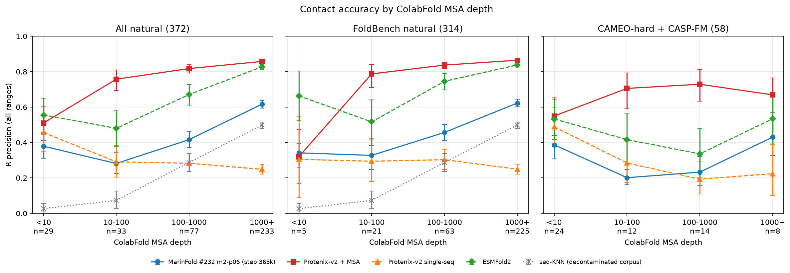

---
marinfold_experiment:
  issue: 260
  title: 'exp: does contact accuracy hold up at low MSA depth? stratify the natural eval set by ColabFold depth for the #232 training checkpoint'
  kind: evals
  branch: exp/260-msa-depth
---

# Contact accuracy vs. MSA depth (issue #260)

**Issue:** [#260](https://github.com/Open-Athena/MarinFold/issues/260) · **Kind:** `evals` · **Branch:** `exp/260-msa-depth`

## Question

**Does the best decontaminated checkpoint we have hold its contact accuracy
where MSA-based methods lose theirs — at low MSA depth?**

[PR #257](https://github.com/Open-Athena/MarinFold/pull/257) evaluated the
[#232](https://github.com/Open-Athena/MarinFold/issues/232) `m2-p06` **training**
checkpoint (step 363,000, decontaminated corpus) on the legacy 554, `eval-val`,
and `eval-denovo`, and deliberately left `eval-test` unscored. This experiment
finishes that read and adds the axis the single-sequence thesis rests on.

Two deliverables:

1. **The usual numbers, completed** — R-precision on `eval-val`, `eval-test`,
   and `eval-denovo`, plus the legacy 554 for continuity.
2. **A depth-stratified table over every natural protein in our eval universe**
   — 357 of them, after 15 mislabelled designs came out — in tiers `<10`, `10–100`, `100–1000`, `≥1000` sequences, for
   all natural proteins, for the FoldBench half, and for the non-FoldBench half.

"MSA depth" is the depth of the ColabFold MSA that Protenix's `+MSA` arm
actually ran with. MarinFold never sees it; it is a property of the protein, and
it is what an MSA-based competitor had to work with on the same target.

## What the eval universe looks like when you cut it to natural proteins

| subset | n | what it is | MSA source |
|---|---:|---|---|
| `foldbench_natural` | 314 | every natural FoldBench monomer: `eval-val` (97) + `eval-test` (217) | `protenix-foldbench-msa` (#12) |
| `nonfoldbench_natural` | 43 | the natural part of `cameo_hard` (32) + `casp_fm` (26), collected in [#65](https://github.com/Open-Athena/MarinFold/issues/65) for exactly this regime | `protenix-exp74-msa` (#74) |
| `nonfoldbench_designed` | 15 | CAMEO-hard entries RCSB annotates as de novo designs — see [below](#first-15-of-the-natural-proteins-are-designs) | `protenix-exp74-msa` (#74) |
| `foldbench_designed` | 19 | `eval-denovo`, kept as a control, not part of the natural stratification | `protenix-foldbench-msa` |

The 97 `eval-val` proteins are the same ones the legacy set calls
`foldbench100`; they are counted once, under FoldBench, where the eval-set
labels live. The legacy `denovo_pdb` 396 are left out: they are designs, they
would outnumber the natural proteins four to one in any pooled bin, and #74
already published their Neff.

Both MSA volumes were written by the same Protenix pipeline call
(`runner.msa_search.update_seq_msa(..., mode="colabfold")`), so the two halves
are measured on one ruler — see [Consistency checks](#consistency-checks).

## What ran

**Scoring.** PR #257's harness with `eval-test` added: 887 `(dataset, stem)`
units (legacy 554 + all 333 scorable FoldBench monomers), one checkpoint, 100
rollouts each under the fixed [#82](https://github.com/Open-Athena/MarinFold/issues/82)
rollout+resample recipe, 12 single-H100 shards at batch priority on
`cw-us-east-02a`, where the checkpoint already lives. **88,700 usable rollouts,
zero unfinished, 887/887 vote matrices**, 9m41s wall clock.

Nothing about scoring changed: the worker bytes (`sha256 dd2f76dd…`) and #89's
metric script (`sha256 6cbaa1c5…`) are byte-identical to PR #257's, and the
checkpoint is read in place from the HF export PR #257 wrote. No weights moved,
no GCS was touched, and nothing left CoreWeave except the small result tables.

**Depth.** `msa_depth_modal.py` measures raw depth and Neff for all 391 proteins
from the two Modal volumes using #74's pinned `msa_depth.py` — one definition,
one code path, both volumes, no alignment leaving Modal.

## Validation

Re-scoring `eval-val`, `eval-denovo`, and the legacy 554 alongside the new
`eval-test` turns PR #257's published aggregates into a reproduction gate rather
than a claim: same weights, same worker, so a disagreement would mean the
execution path moved, not the model. **All twelve reproduced**, largest absolute
difference **0.0044** (`eval-val` R all: 0.5561 here vs 0.5517 published) —
inside the 0.005 tolerance the `eval-checkpoint` recipe fixes, and consistent
with [#204](https://github.com/Open-Athena/MarinFold/issues/204)'s 0.0023
run-to-run span. Full table:
[`data/coreweave_results/results/published_reference_validation.json`](data/coreweave_results/results/published_reference_validation.json).

This is also why the E8 reference checkpoint is not scored here: PR #257 passed
that gate on this cluster with this worker eight days ago, and reproducing the
checkpoint under test is the stronger check.

## Results — the eval sets

All-range and long-range R-precision, plus AUC, for the #232 `m2-p06` training
checkpoint (step 363,000). Source:
[`data/coreweave_results/results/subset_aggregate_metrics.csv`](data/coreweave_results/results/subset_aggregate_metrics.csv).

| subset | n | R (all) | R (long) | AUC (all) | AUC (long) |
|---|---:|---:|---:|---:|---:|
| **`eval-test`** (first read for this checkpoint) | 217 | **0.5693** | 0.5464 | 0.9455 | 0.9375 |
| `eval-val` | 97 | 0.5561 | 0.5402 | 0.9381 | 0.9258 |
| `eval-denovo` | 19 | 0.6110 | 0.5745 | 0.9668 | 0.9580 |
| legacy 554 | 554 | 0.6059 | 0.5566 | 0.9454 | 0.9312 |

Viral split (`is_viral` on #245's `eval_sets.csv`; indicative only — 19 of 334
monomers are viral):

| subset | n | R (all) |
|---|---:|---:|
| `eval-test` non-viral | 204 | 0.5737 |
| `eval-test` viral | 13 | 0.4993 |
| `eval-val` non-viral | 91 | 0.5604 |
| `eval-val` viral | 6 | 0.4906 |

**Where that sits.** On `eval-test`, against #245's published per-protein
baselines over the same 217 proteins:

| predictor | `eval-test` R (all) |
|---|---:|
| Protenix-v2 + MSA | 0.8446 |
| ESMFold2 | 0.7921 |
| ESMFold | 0.7534 |
| **#232 `m2-p06` training (this run)** | **0.5693** |
| #199 cooldown (contaminated data) | 0.6132 |
| #232 `m2-p06` sweep checkpoint | 0.5377 |
| seq-KNN null, unfiltered corpus | 0.5820 |
| seq-KNN null, decontaminated corpus | 0.4257 |
| Protenix-v2 single-seq | 0.2646 |

Training on past the sweep checkpoint is worth **+0.032** on `eval-test`
(0.5377 → 0.5693), which tracks the +0.013 it gained on the legacy 554. The
checkpoint clears the seq-KNN null over the corpus it actually trained on
(0.4257) by 0.144, so the score is not memorisation; it does **not** clear the
null built from the un-decontaminated corpus (0.5820), which is the right
comparison only for the contaminated models.

`eval-test` scores **0.013 above** `eval-val` here, the same direction and
magnitude #245 measured across nine predictors — the historical FoldBench-100 is
not flattering this checkpoint.

## Results — MSA depth

### First: 15 of the "natural" proteins are designs

The non-FoldBench half arrived labelled natural because of where it came from —
CAMEO hard targets and CASP free-modeling domains — not because anything checked
the entries. Reading RCSB's own annotation
([`dashboard/build_annotations.py`](dashboard/build_annotations.py)) says **15 of
those 58 are de novo designs**, 10 tagged `DE NOVO PROTEIN` outright and the rest
synthetic constructs, and **13 of the 15 sit under MSA depth 10**. That is not a
coincidence: a designed protein has no homologs because it never had an
evolutionary lineage.

Leaving them in wrecks the comparison, because designed backbones are easy for
structure predictors and not for us. In the shallow bin the designs score:

| predictor | 13 CAMEO designs | 16 natural |
|---|---:|---:|
| MarinFold | 0.477 | 0.300 |
| Protenix-v2 + MSA | 0.724 | 0.336 |
| Protenix-v2 single-seq | **0.722** | **0.241** |
| ESMFold2 | 0.715 | 0.426 |

Protenix-v2 *single-sequence* triples its score on the designs. The first cut of
this experiment pooled them and concluded MarinFold had no edge over
single-sequence Protenix in the shallow bins; that conclusion was an artifact of
those 13 proteins. This is [#241](https://github.com/Open-Athena/MarinFold/issues/241)'s
finding repeating in a new set, and the reason every table below reports designs
separately. The natural universe is therefore **357**, not 372.

### R-precision by depth tier

Mean all-range R-precision over the 357 natural proteins. Source:
[`data/depth_tiers.csv`](data/depth_tiers.csv).



| depth | n | **MarinFold** | Protenix-v2 + MSA | ESMFold2 | Protenix-v2 single-seq | seq-KNN† |
|---|---:|---:|---:|---:|---:|---:|
| `<10` | 16 | **0.300** | 0.336 | 0.426 | 0.241 | 0.027 |
| `10–100` | 32 | **0.279** | 0.755 | 0.469 | 0.273 | 0.073 |
| `100–1000` | 76 | **0.413** | 0.819 | 0.671 | 0.278 | 0.287 |
| `≥1000` | 233 | **0.616** | 0.858 | 0.827 | 0.249 | 0.498 |
| all | 357 | **0.528** | 0.817 | 0.744 | 0.257 | 0.420 |

† the seq-KNN null is published for the FoldBench proteins only.

**MarinFold is not flat in MSA depth** — it loses 0.32 R-precision from the
deepest bin to the shallowest. A single-sequence model does not escape the
difficulty shallow-MSA proteins represent, which makes sense: depth is a proxy
for how well a protein's family is represented anywhere, including in the AFDB
corpus MarinFold trained on.

What changes with depth is the *relative* picture. Paired per-protein deltas
(MarinFold minus baseline, same proteins, 95 % bootstrap;
[`data/paired_deltas.csv`](data/paired_deltas.csv)):

| baseline | `<10` (16) | `10–100` (32) | `100–1000` (76) | `≥1000` (233) |
|---|---:|---:|---:|---:|
| Protenix-v2 + MSA | **−0.036** [−0.180, +0.104] | −0.477 [−0.545, −0.397] | −0.407 [−0.454, −0.360] | −0.242 [−0.263, −0.220] |
| Protenix-v2 single-seq | +0.058 [−0.046, +0.172] | +0.005 [−0.063, +0.071] | +0.135 [+0.087, +0.184] | +0.367 [+0.337, +0.396] |
| ESMFold2 | −0.126 [−0.227, −0.024] | −0.190 [−0.271, −0.110] | −0.258 [−0.306, −0.210] | −0.211 [−0.232, −0.192] |
| seq-KNN (decontaminated) | +0.315 [+0.237, +0.377] | +0.254 [+0.160, +0.353] | +0.170 [+0.101, +0.236] | +0.124 [+0.099, +0.149] |

**The headline: at MSA depth below 10, MarinFold is statistically level with
Protenix-v2 + MSA** — −0.036 with an interval spanning zero — against −0.242 at
depth ≥1000 and −0.48/−0.41 in the middle tiers. The gap to the MSA-based model
closes exactly where the MSA disappears. It closes mostly because Protenix falls
(0.858 → 0.336), not because MarinFold rises, but that is what the
single-sequence thesis predicts should happen, and it is the first time we have
measured it on proteins chosen for the regime rather than stumbled into it.

MarinFold also clears the memorisation null in every bin and by the widest
margin at `<10` (+0.315), so the shallow-bin result is not retrieval. It remains
behind ESMFold2 everywhere.

### The low-MSA-depth cut — 16 natural, 13 designs, and the 5

The `<10` bin is frozen as a set:
[`data/low_msa_depth_set.csv`](data/low_msa_depth_set.csv) — 29 proteins with a
`designed` column, of which **16 are natural** (11 CAMEO-hard/CASP-FM + 5
FoldBench) and 13 are CAMEO designs. It is a standing reporting cut in the
`eval-checkpoint` skill.

| predictor | 16 natural | FoldBench-only (5) | 13 designs | all natural (357) |
|---|---:|---:|---:|---:|
| **MarinFold #232 `m2-p06` training** | **0.300** | **0.342** | 0.477 | 0.528 |
| Protenix-v2 + MSA | 0.336 | 0.320 | 0.724 | 0.817 |
| Protenix-v2 single-seq | 0.241 | 0.305 | 0.722 | 0.257 |
| ESMFold2 | 0.426 | 0.664 | 0.715 | 0.744 |

Report the 16 and the 5 together, because they disagree and both are small: the
FoldBench-only subset is the only like-for-like comparison against the baselines
(see below) but 5 proteins carry no conclusion alone, and the 16 is what has
enough proteins to say anything.

**The two halves are not equally fair to the baselines.** The CAMEO-hard and
CASP-FM targets are long-standing public benchmarks and are generally inside the
training sets of Protenix-v2, ESMFold and ESMFold2. MarinFold's corpus was
decontaminated against FoldBench and the legacy eval set
([#225](https://github.com/Open-Athena/MarinFold/issues/225)), so it is clean on
both halves. Read the baseline columns on the non-FoldBench proteins as context,
not as a scoreboard — the honest like-for-like comparison in this regime is the
5 FoldBench members, which is exactly why the set needs growing.

Two properties support reading the cut as a real MSA-poor regime rather than a
measurement artifact:

- **Protenix-v2 `+MSA` collapses toward its own single-sequence arm** — 0.336
  against 0.241, versus 0.817 against 0.257 over all natural proteins. With no
  alignment to read, the `+MSA` model is just a single-sequence model.
- **The depths reproduce independently.** #247 counted the same a3m files with
  different code and agrees on all 314 FoldBench naturals exactly; the 11 stems
  held by both Modal volumes all land in the same tier.

Hold one thing loosely: median length is 148 residues in this cut against 290 at
`≥1000`, and contact prevalence goes as ~1/L, so R-precision is mechanically
easier here. That flatters every predictor in the cut equally, but it makes the
*cross-tier* decline for a single predictor conservative.

### Case by case — the dashboard

Every one of the 29 is browsable in
**[`dashboard/index.html`](dashboard/index.html)** — one self-contained page,
rebuilt by `dashboard/build_page.py`:

- what the protein is: entity description, source organism, method, resolution,
  release date, and a link to the RCSB entry or CASP target page;
- the ground-truth structure in an interactive viewer — full-atom, drawn as a
  cartoon from P-SEA secondary structure, switchable to sticks or backbone —
  with the selected predictor's top-L contacts drawn on it as green (correct) or
  red (wrong) cylinders, and a toggle to take them off;
- the contact map — ground truth in the lower triangle, the selected predictor's
  top-L in the upper, on a shared residue ruler;
- the alignment itself, which for these proteins is between one and nine
  sequences;
- depth, Neff, length, true-contact count, eval set, FoldBench membership, the
  designed flag, and per-protein R-precision for every predictor;
- a sortable index of all 29, and `#<stem>` deep links so a specific case can be
  sent to someone.

Structures are the full mapped chain pulled from RCSB (or predictioncenter's
CASP domain tarball for the two targets with no released entry) and aligned onto
the evaluation sequence, so a pair drawn on the structure is the pair the metric
counted; per-protein alignment coverage is ≥95 % for all 29. Baseline contact
maps come from #74's and #78's published per-pair records, which cover 28 of the
29 — the exception is `8ux2_A`, a FoldBench member outside the historical 100
whose per-pair baseline predictions were never published.

Browsing it is what surfaced the design contamination above, and it makes one
more thing obvious: on `8s89_A`, a 401-residue CAMEO target whose ColabFold
search returned *only the query*, Protenix-v2 + MSA still scores 0.900 — and its
own single-sequence arm scores 0.897.

### Structure accuracy — what the contacts are actually worth

The dashboard carries every predicted structure for these proteins, so the
contacts can be judged by what a folding model does with them. Helico
`contacts-msafree-01` was run over the FoldBench monomers in three otherwise
identical arms — no contacts, MarinFold's top-L, and the ground truth's — which
brackets the value of the contact channel. Mean lDDT over the FoldBench members
of the low-depth set, computed here so every arm is scored the same way
(`dashboard/build_structure_metrics.py`):

| arm | natural (5) | designs (13) |
|---|---:|---:|
| Helico, no contacts | 0.455 | 0.927 |
| Helico + MarinFold contacts, step 145k | 0.498 | 0.841 |
| **Helico + MarinFold contacts, step 363k** | **0.549** | 0.848 |
| Helico + ground-truth contacts | 0.928 | 0.938 |
| Protenix-v2 + MSA | 0.567 | 0.927 |
| ESMFold2 | 0.802 | 0.954 |

Three things fall out, all of them on the 5 natural proteins — the designs are
saturated, where even the no-contact arm reaches 0.927 and the contact channel
cannot show anything:

1. **MarinFold's contacts are worth +0.094 lDDT** to a folding model that has
   nothing else to go on (0.455 → 0.549).
2. **Better contacts make better structures.** The step-363,000 checkpoint beats
   the step-145,199 sweep checkpoint by +0.051 lDDT through Helico, on an
   otherwise identical run — same targets, same Helico weights, same sampling,
   one input changed. Contact R-precision improvements are not cosmetic.
3. **Most of the headroom is still there.** Ground-truth contacts reach 0.928, so
   MarinFold captures about a fifth of what perfect contacts would buy, and
   Helico + MarinFold (0.549) only draws level with Protenix-v2 + MSA (0.567)
   rather than passing it.

Scored with biotite: superposition-free lDDT over Cα, GDT-TS as the mean
fraction of Cα within 1/2/4/8 Å after outlier-trimmed superposition, and TM-score
under that superposition. Against helico#14's published lDDT on the arms where
both exist this implementation runs **+0.069 on average (r = 0.99)** — a
definitional difference in which residues get scored, not disagreement about
which structure is better. The dashboard's numbers are internally consistent
across arms; they are not helico#14's numbers and should not be quoted as such
([`data/structure_metrics_validation.json`](data/structure_metrics_validation.json)).

### The two halves separately, and the Neff axis

| | `<10` | `10–100` | `100–1000` | `≥1000` |
|---|---|---|---|---|
| FoldBench natural (314) | 0.342 (n=5) | 0.327 (n=21) | 0.457 (n=63) | 0.623 (n=225) |
| CAMEO-hard + CASP-FM, natural (43) | 0.280 (n=11) | 0.187 (n=11) | 0.199 (n=13) | 0.430 (n=8) |

Cutting on **Neff** (redundancy-weighted depth at 80 % identity) instead moves a
lot of proteins down and populates the shallow end better — 30 natural proteins
under Neff 10 against 16 by raw depth:

| Neff | n | MarinFold | Protenix-v2 + MSA | ESMFold2 | Protenix-v2 single-seq |
|---|---:|---:|---:|---:|---:|
| `<10` | 30 | 0.275 | 0.500 | 0.466 | 0.265 |
| `10–100` | 46 | 0.361 | 0.805 | 0.570 | 0.272 |
| `100–1000` | 96 | 0.436 | 0.830 | 0.720 | 0.259 |
| `≥1000` | 185 | 0.659 | 0.864 | 0.845 | 0.251 |

The Neff cut does *not* show the gap closing — Protenix keeps 0.500 there. The
two axes disagree because they select different proteins: raw depth under 10
means the search returned essentially nothing, while Neff under 10 includes
proteins with hundreds of near-identical sequences. The raw-depth result is the
one about having no alignment at all.

Figure: [`plots/rprecision_by_neff_tier.png`](plots/rprecision_by_neff_tier.png).
Per-protein scatter with the tier boundaries drawn on it:
[`plots/rprecision_vs_depth_scatter.png`](plots/rprecision_vs_depth_scatter.png).

### Designed proteins, as a control

The 19 `eval-denovo` designs and the 15 CAMEO designs behave the same way:
shallow MSAs by construction, and easy for every structure predictor. MarinFold
scores 0.611 on `eval-denovo` and 0.477 on the CAMEO designs — its best numbers
anywhere — while Protenix-v2 single-seq goes from 0.257 on natural proteins to
0.722 on the CAMEO designs. A shallow MSA on a designed backbone is not the same
problem as a shallow MSA on a natural protein, which is the whole reason they
are reported apart.

## Conclusion

The `eval-test` read gives the #232 `m2-p06` training checkpoint **0.5693**
all-range R-precision, +0.032 over the sweep checkpoint and 0.144 clear of the
seq-KNN null over its own decontaminated corpus.

On the MSA-depth question, over the 357 natural proteins:

- **MarinFold degrades with MSA depth like everything else** — 0.616 at depth
  `≥1000` down to 0.300 below 10. Depth proxies how well a family is represented
  anywhere, AFDB included, so a single-sequence model does not escape it.
- **But the gap to Protenix-v2 + MSA closes to nothing where the MSA does:**
  −0.036 [−0.180, +0.104] paired at depth `<10`, against −0.242 at `≥1000`.
  That is the single-sequence thesis holding up in the regime it was argued for,
  measured on proteins selected for that regime.
- **It never leads.** ESMFold2 is ahead in every tier, including the shallow one
  (−0.126 [−0.227, −0.024] paired), so "competitive with MSA-based prediction
  when the MSA is gone" is a claim about Protenix's `+MSA` arm, not about the
  state of the art.

The measurement that matters next is a bigger shallow set: 16 natural proteins,
5 of them uncontaminated for the baselines, is too thin to carry the headline.
The low-MSA-depth cut is now a required reporting row in the `eval-checkpoint`
skill so every future checkpoint is measured here, and growing it — recent PDB
entries with genuinely shallow ColabFold searches, checked against RCSB's own
de novo annotation rather than a collection label — is the obvious follow-up.

### A note on AUC

An earlier draft of this README leaned on AUC — MarinFold ranks contacts better
than every baseline in the shallow bin. **That comparison is not fair and is
withdrawn.** #89 scores a structure predictor from a degree matrix in which every
pair it did not predict is exactly 0, so ~99 % of candidate pairs are tied at the
bottom and `roc_auc_score` awards each tie half credit. The sparser the
predictor, the worse the penalty — it measures output sparsity as much as
ranking quality. AUC stays in
[`data/depth_tiers.csv`](data/depth_tiers.csv) as a within-predictor diagnostic
and for comparing MarinFold checkpoints to each other; no conclusion here rests
on it, and the `eval-checkpoint` skill now says so.

## Artifacts

**Published, anonymously readable over HTTPS** — root
`https://huggingface.co/buckets/open-athena/MarinFold/resolve/data/contacts-v1-msa-depth-exp260/v1-01`:

| path | what |
|---|---|
| `results/subset_aggregate_metrics.csv` | the eval-set table above, every subset × range × cut |
| `results/aggregate_metrics.csv` | pooled 887-unit aggregates |
| `results/marinfold_precision.csv` | per-protein rows, 887 units × 20 (range × cut) |
| `results/contact_precision_all.csv` | the same in #89's unified schema |
| `results/timings.csv` | per-protein wall time, rollout counts, worker metadata |
| `results/run_manifest.json` | full provenance: checkpoint identity, sampling recipe, job ids, digests |
| `results/published_reference_validation.json` | the PR #257 reproduction gate |
| `inputs/evaluation_subsets.csv` | the 887-unit subset manifest with viral flags |
| `inputs/eval_targets.parquet.validation.json` | unit-count validation for the union |
| `analysis/…` | universe, depths, tiered tables (pending, pushed by `publish_to_hf.py`) |

**CoreWeave, in-cluster only** — root
`s3://marin-us-east-02a/marin/protein-structure/MarinFold/exp260_evals_msa_depth_stratified/rollout-v2/2026-08-31/v1-01`:
`dense_scores/` (887 `[L,L]` npz vote matrices), `rollout/` (sparse parquet
parts + per-shard completion markers), `inputs/` (mirrored, digest-verified eval
inputs), `results/` (the same tables published above).

**Checkpoint under test** — read in place, never copied:

- HF export: `s3://marin-us-east-02a/marin/protein-structure/MarinFold/exp232_sweep_cv1_decontam/evals/rollout-v2/2026-08-24/v2-01/models/exp232-decontam-train-m2-p06-step363000/hf/step-363000`
- Levanter source: `s3://marin-us-east-02a/MarinFold/exp232_sweep_cv1_decontam/checkpoints/protein/prot-exp232-trc-cv1-decontam-train-s01-m2-p06-srcpeak-augcont-lr005-us-east1/2026.08.21.1/checkpoints/step-363000`
- W&B: [`prot-exp232-trc-cv1-decontam-train-s01-m2-p06-srcpeak-augcont-lr005-us-east1`](https://wandb.ai/eric-czech/marin/runs/prot-exp232-trc-cv1-decontam-train-s01-m2-p06-srcpeak-augcont-lr005-us-east1), step 363,000, contacts-v1 `eval/loss` 2.9681 at step 361,494

**Iris jobs** (cluster `cw-us-east-02a`, batch priority):
`/timodonnell/exp260-msa-depth-eval-v1-01` — one CPU driver, one smoke shard,
twelve H100 shards, all succeeded. Ids are listed in `run_manifest.json`.

**Upstream inputs**, digest-pinned in
[`rollout/checkpoint_specs.py`](rollout/checkpoint_specs.py) and
[`upstream.py`](upstream.py): #169's legacy target table, #245's FoldBench
targets / ground truth / `eval_sets.csv`, #89's legacy ground truth, #245's
`per_protein.csv.gz` baselines, #89's `contact_precision_all.csv`, and the
Modal volumes `protenix-foldbench-msa` and `protenix-exp74-msa`.

**In-repo**: `data/coreweave_results/` (mirror of the published prefix;
`marinfold_precision.csv` committed gzipped), `data/universe.csv`, and — landing
with the depth commit — `data/msa_depth.csv`, `data/per_protein_depth.csv`,
`data/depth_tiers.csv`, `data/paired_deltas.csv`, `data/tier_counts.csv`,
`data/depth_consistency.json`, `data/low_msa_depth_set.csv`, `plots/*.png`,
`plots/summary.pdf`.

The `eval-test` read is recorded as row 3 in
[`experiments/exp245_evals_foldbench_held_out_monomers/data/eval_test_reads.md`](../exp245_evals_foldbench_held_out_monomers/data/eval_test_reads.md).

## Consistency checks

`check_depth_consistency.py` runs two, and both are reported in
`data/depth_consistency.json`:

1. **Against #247** — that experiment counted sequences in the same
   `protenix-foldbench-msa` a3m files with different code. The counts should
   agree exactly.
2. **Across the two volumes** — 11 stems live in both, searched about three
   weeks apart against a database that grows. Their spread bounds how comparable
   the FoldBench and non-FoldBench halves of the tier table are.

## Files

| file | what it does |
|---|---|
| `upstream.py` | Pinned URLs, digests, volume names, tier definitions. |
| `build_universe.py` | Step 1 — the 391-protein universe (`data/universe.csv`). |
| `msa_depth_modal.py` | Step 2 — depth + Neff on Modal (`data/msa_depth.csv`). |
| `check_depth_consistency.py` | The two depth cross-checks. |
| `build_depth_table.py` | Step 3 — join scores to depth; tier means, paired deltas, bootstrap intervals. |
| `plot_depth.py` | Step 4 — the three figures. |
| `build_low_depth_set.py` | Step 5 — freeze the 29-protein low-MSA-depth set. |
| `publish_to_hf.py` | Push the analysis tables to the public bucket. |
| `dashboard/build_inputs.py` | Sequences and FoldBench chain ids for the 29. |
| `dashboard/build_annotations.py` | What each non-FoldBench protein is, from RCSB; flags de novo designs. |
| `dashboard/build_structures.py` | Fetch ground-truth structures; renumber every atom into evaluation indices and annotate secondary structure. |
| `dashboard/build_dashboard_data.py` | Assemble scores, contacts, alignments, coordinates into `data.json`. |
| `dashboard/build_page.py` | Inline that into `template.html` to produce `index.html`. |
| `rollout/export_low_depth_maps.py` | Export the 29 vote matrices out of CoreWeave (runs in-cluster). |
| `rollout/` | The CoreWeave scoring harness, derived from PR #257's. |
| `build_summary.py` | Rebuild `plots/summary.pdf` from `summary_narrative.md` + `plots/`. |

## Reproducing

```bash
cd experiments/exp260_evals_msa_depth_stratified
uv sync
uv run python build_universe.py
uv run modal run msa_depth_modal.py
uv run python check_depth_consistency.py
uv run python build_depth_table.py
uv run python plot_depth.py
uv run python build_low_depth_set.py
uv run python build_summary.py

# the dashboard
uv run python dashboard/build_inputs.py
uv run python dashboard/build_annotations.py
uv run python dashboard/build_structures.py
uv run python dashboard/build_dashboard_data.py
uv run python dashboard/build_page.py

# the scoring half (needs CoreWeave access; ~10 minutes on 12 H100s at batch)
cd rollout && uv sync
KUBECONFIG=~/.kube/coreweave-iris-gpu uv run python submit_coreweave.py --run-id v1-01
uv run pytest -q test_rollout.py
```
