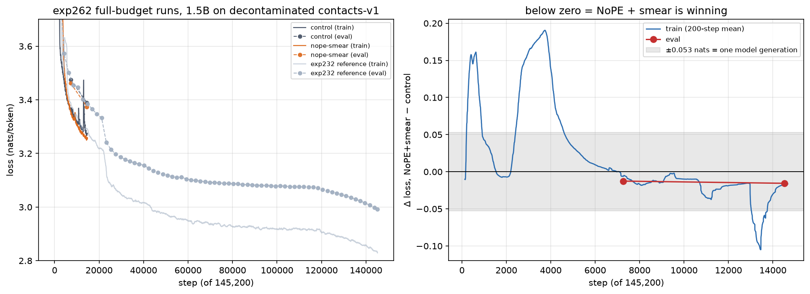

---
marinfold_experiment:
  issue: 262
  title: 'exp: does contacts-v1 need RoPE, or is a width-3 causal token smear enough?'
  kind: models
  branch: exp/262-nope-token-smearing
---

# exp: does contacts-v1 need RoPE, or is a width-3 causal token smear enough?

**Issue:** [#262](https://github.com/Open-Athena/MarinFold/issues/262) · **Kind:** `models` · **Branch:** `exp/262-nope-token-smearing`

## Question

contacts-v1 documents are self-describing and order-randomized: every statement
carries its own explicit `<pXXX>` coordinate, and statement order is uniform
noise. Does a Qwen3 trained on them need RoPE at all, or is a **width-3 causal
token smear** (mix the previous two tokens' embeddings into the current one, as
in the nanogpt speedrun's smear module) enough positional signal on its own?

## Hypothesis

The only positional information contacts-v1 actually uses is *intra-statement
role* — "am I the verb, the first argument, or the second argument?". A learned
causal depthwise mix over offsets {0, −1, −2} supplies exactly that. Everything
else the model needs is content-addressed:

- **Residue coordinates** are vocabulary items (`<p0>`…`<p1999>`), not encodings.
  Sequence separation `|i−j|`, the thing contact statistics actually depend on,
  is computed from token identities, so it survives the removal of RoPE intact.
- **Section membership** is a content lookup: `<begin_statements>` is a unique
  token and the causal mask makes "has it occurred?" a pure attention query.
- **Duplicate avoidance** ("emit each contact once") is a set-membership query
  over already-emitted position tokens — again content, not offset.

So RoPE is being spent on a nuisance variable. Worse, its distance prior is
plausibly *anti*-aligned with the task: the structure section is an unordered
bag of up to ~2700 statements that must be searched **uniformly** (dedup, gather
partners), and a locality prior over a shuffled set is at best wasted capacity.

Prediction: NoPE + smear matches or beats RoPE at equal tokens, with the gain
concentrated on **long** proteins — the regime where the bag is largest and
where we are weakest (our enrichment scales as `L^0.79` against ESMFold2's
`L^1.15`).

## Background

### Two-token lookback is exactly the right window — verified

The grammar has 2-token statements (`<pX> <AA>`, `<n-term> <pX>`, `<c-term> <pX>`)
and 3-token statements (`<contact> <pX> <pY>`), with **no separators**: a real
document reads

```
<contacts-v1> <begin_sequence> <p1153> <LEU> <p1173> <ARG> … <begin_statements>
<contact> <p1127> <p1146> <contact> <p1200> <p1218> … <end>
```

so parse state has to be inferred from token identity alone. Enumerating the
grammar over 400 synthetic documents and asking whether the *parse role* of
token `t` is a deterministic function of the token **classes** at `t−W … t`:

| lookback `W` | distinct contexts | ambiguous contexts |
|---|---|---|
| 1 | 20 | **1** — `(POS, POS)` → contact-arg2 *or* residue-statement head |
| 2 | 31 | 0 |
| 3 | 48 | 0 |

Lookback 2 is the tight bound: one short and it breaks in exactly one place, one
long and it buys nothing. The proposal's "previous two tokens" is not a guess.

<details><summary>reproduction script</summary>

```python
"""Is the parse role of token t a deterministic function of the token CLASSES
at t-2, t-1, t?  (If yes, a width-3 causal smear supplies every bit of
positional information the contacts-v1 grammar needs.)"""
import random
from collections import defaultdict

AA = [f"<AA{i}>" for i in range(20)]
def pos(i): return f"<p{i}>"

def klass(t):
    if t.startswith("<p") and t[2:-1].isdigit(): return "POS"
    if t.startswith("<AA"): return "AA"
    return t

def make_doc(rng):
    nres = rng.randint(30, 120)
    start = rng.randrange(2000)
    idx = [(start + k) % 2000 for k in range(nres)]
    stmts = [("res", [pos(p), rng.choice(AA)]) for p in idx]
    stmts.append(("nterm", ["<n-term>", pos(idx[0])]))
    stmts.append(("cterm", ["<c-term>", pos(idx[-1])]))
    rng.shuffle(stmts)
    cs = []
    for _ in range(rng.randint(10, 200)):
        a, b = rng.sample(idx, 2)
        cs.append(("contact", ["<contact>", pos(a), pos(b)]))
    rng.shuffle(cs)
    toks, roles = ["<contacts-v1>", "<begin_sequence>"], [("doc", 0), ("hdr", 0)]
    for form, ts in stmts:
        for s, t in enumerate(ts): toks.append(t); roles.append((form, s))
    toks.append("<begin_statements>"); roles.append(("hdr", 1))
    for form, ts in cs:
        for s, t in enumerate(ts): toks.append(t); roles.append((form, s))
    toks.append("<end>"); roles.append(("end", 0))
    return toks, roles

for W in (1, 2, 3):
    table, rng = defaultdict(set), random.Random(0)
    for _ in range(400):
        toks, roles = make_doc(rng)
        for t in range(len(toks)):
            ctx = tuple(klass(toks[j]) if j >= 0 else "BOS" for j in range(t - W, t + 1))
            table[ctx].add(roles[t])
    bad = {k: v for k, v in table.items() if len(v) > 1}
    print(f"lookback {W}: {len(table)} contexts, {len(bad)} ambiguous", dict(list(bad.items())[:4]))
```
</details>

### Our own results already say order is nuisance

- **#201 Phase 0**: ~77% of contacts-v1 validation loss is permutation entropy,
  42% of that from the sequence-section shuffle alone. Order is measurably noise.
- **#166 / #199**: the `-aug` arms re-permute statement order as data
  augmentation, and that **helped** (R 0.5618, and every frontier model since is
  `-aug`). We are already paying data-augmentation cost to buy order-invariance.
  NoPE is the architectural version of the same bet — invariance as a prior
  rather than as something the model has to be taught example by example.

### Prior art, and where it stops

- The nanogpt speedrun's **smear module** lets each token peer back one position
  and mix the prior token forward, through a sigmoid gate driven by the first few
  embedding dims. It was added because multiple heads were provably burning
  capacity attending to the previous token. Note it is width-2 there, it
  **coexists with rotary**, and a later record found it removable once bigram
  hash embeddings were present — i.e. smear is best understood as a cheap learned
  local n-gram feature, not as a positional encoding. In contacts-v1 the relevant
  n-gram *is* the statement, which is why width-3 is the natural port.
- **NoPE** decoder-only LMs are a real thing (Haviv et al. 2022; Kazemnejad
  et al. 2023) but the evidence is small-scale/short-context. Production practice
  is *interleaved* NoPE (Llama 4's iRoPE), not pure NoPE, which is why there is a
  hedged arm below.
- **#157** is the complementary axis: it wants RoPE-like structure applied to the
  *residue* index. The two compose into an appealing endpoint — rotary should
  encode the residue coordinate (real geometry) and not the document offset
  (shuffle noise). Out of scope here, worth revisiting after.


## Approach

Data, tokenizer, schedule, optimizer, and augmentation are held at the
[exp232 contract](gpu/exp232_contract.py); only the architecture moves.

### What the smear actually is

For every position `t` and channel `c`, with `e` the token-embedding lookup:

```
x[t, c] = e[t, c]  +  Σ(k = 1..W)  g[k, t] · w[k, c] · e[t − k, c]
```

- `W = 2` (the width-3 window: offsets 0, −1, −2).
- `w[k, c]` — a learned **per-offset, per-channel** vector, unbounded and signed.
  Two separate vectors, one per offset. **Initialised to zero.**
- `g[k, t] = sigmoid((G · e[t, :16] + b)[k])` — a learned per-offset scalar gate
  in (0, 1), computed from the **first 16 channels of the current token's own
  embedding**. `G` is 2×16, `b` is 2.
- `e[t − k] = 0` for `t − k < 0`, masked rather than wrapped.

**This is not an average.** The current token enters with coefficient exactly 1,
unweighted and unnormalised; the neighbours are *added on top* with their own
learned coefficients. The result is the identity plus a learned correction, not
a convex combination — nothing is renormalised, and the effective coefficient
`g[k, t] · w[k, c]` is free to exceed 1 or go negative.

The neighbours are down-weighted, and by two independent learned mechanisms:
`w` scales each channel of each offset separately (so offset 1 and offset 2 are
independently addressable — the property that keeps `<contact> <pX> <pY>`'s two
arguments distinguishable), while `g` decides *per token* whether to look back at
all. Because the gate reads only the current token, it expresses "should I smear
here?" and not "how relevant is that particular neighbour?".

`w = 0` at initialisation, so a smear model is bit-identical to its control at
step 0 and the arms start from the same function. Cost is
`W × (D + 16 + 1) = 2 × 2065 = 4,130` parameters on 1.47B — 3 parts in a million.

The smear sits between the embedding lookup and the transformer; nothing else in
the model changes. `gpu/tests/test_cross_implementation.py` asserts the levanter
and PyTorch implementations are the same function at widths 1, 2 and 3.

**Known limitation.** The smear is not segment-aware. Training packs documents
into 8192-token sequences with `block_cross_document_attention=True`, so
attention stops at a document boundary but the smear does not: the first one or
two tokens of a document mix in the last tokens of the document before it. That
is ~0.18% of tokens and it is identical across arms, but it is a real
inconsistency with the packing contract rather than a deliberate choice.

### Phase 0 — is there anything to win? (no training)

Three probes on the default checkpoint (`contacts-v1-exp199-cooldown-1.5B`),
teacher-forced over **ground-truth** documents built from the exp245 FoldBench
monomers. Local RTX A5000, ~15 minutes total.

- [`grammar_lookback.py`](grammar_lookback.py) — how wide a causal window the
  contacts-v1 grammar needs, by enumeration.
- [`probe_attention.py`](probe_attention.py) — per-(layer, head) attention mass
  at offsets 1 and 2, and the distance profile of co-referent retrieval.
- [`probe_positions.py`](probe_positions.py) — rewrite `position_ids` at
  inference and re-score.
- [`plot_phase0.py`](plot_phase0.py) — the three figures.

### The local pilot — is it worth cluster time?

[`pilot/`](pilot) trains ~15M-parameter scaled-down twins of the exp232 Qwen3 on
360M tokens of the real decontaminated corpus, on one local GPU. Four arms over
the 2×2 of rope/NoPE against smear/no-smear, learning rate tuned **per arm**
because removing rope changes the attention-logit scale.

### Phase 1 — the comparison, at the usual scale

Two arms at the production 1.5B, both at exp232's swept-winner point `p06`
(lr 1e-3, wd 0.2), so the runs differ in exactly one thing:

| arm | rope | smear |
|---|---|---|
| `control` — exp232 `m2-p06-aug` | Llama3, θ=500k | — |
| `nope-smear` | none | 2 |

[`gpu/exp262_train_cw.py`](gpu/exp262_train_cw.py) launches both;
`gpu/tests/test_launch_contract.py` fails if any arm moves a model-config field
other than `smear_width` and `rope`. `PHASE=screen` runs a tenth of the
schedule, `PHASE=full` runs exp232's 145,200 steps exactly, `SMOKE=1` runs a
short job on a temporary path.

Two implementation requirements, both real bug risks and both tested: the smear
must be strictly causal, and offsets −1 and −2 need separate per-channel
coefficients.

**HF export is disabled for both arms.** A NoPE model has no HF Qwen3
representation and the smear weights have no home in one, so `to_hf_config`
refuses rather than exporting something that would silently load as a different
model. Promoting a winner to a rollout evaluation needs a real exporter first.

## Success criteria

- **Phase 0 gate:** proceed only if a previous-token head is identifiable in the
  early layers, or the loss moves measurably under a position rewrite.
- **Phase 1:** eval loss over exp232's full schedule, against a matched control
  trained on the same stack. Read #180's "two loss scales" note first.
- **The real bar:** ≥+0.01 R-precision on eval2-natural against #204's 0.0023
  noise floor. Loss cannot substitute — #169 and #201 both show it does not
  reliably re-rank checkpoints.
- **Guardrail:** rollout `pred/gt` contact-count ratio and finish rate must not
  regress (#142).
## Results

### Phase 0 — the model tells us which half of the idea is right

**The grammar needs a 2-token lookback, and exactly that.** Enumerating the
contacts-v1 grammar over 400 synthetic documents and asking whether a token's
`(statement form, slot)` role is a deterministic function of the token *classes*
in a causal window:

| lookback | contexts | ambiguous |
|---|---:|---:|
| 0 | 9 | 1 |
| 1 | 20 | **1** — `(POS, POS)` is contact-arg2 *or* residue-statement head |
| 2 | 31 | **0** |
| 3 | 48 | 0 |

One short and it breaks in exactly one place; one long and it buys nothing.
Width-3 smear is the tight bound, not a guess.

**(a) Previous-token heads exist, and they are extreme.**


Layer 1 holds two heads that are essentially pure previous-token heads — L1H26
puts **0.999** of its mass at offset 1, L1H25 **0.996** — and a third, L1H2, that
splits **0.75 / 0.16** across offsets 1 and 2, which is a width-3 smear
implemented in attention. Ten of 768 heads exceed 0.30 at offset 1. This is the
same observation that motivated the smear module in the nanogpt speedrun, and it
holds here: the model is paying for heads that do what a smear does for free.

**(b) Long-range retrieval is already distance-uniform — the mechanistic
argument for dropping RoPE does not survive.**


The hypothesis was that RoPE's locality prior costs us reach over the shuffled
bag of contact statements, and that this is why enrichment scales as `L^0.79`
against ESMFold2's `L^1.15`. It does not. Heads that specialise in retrieving
earlier mentions of the query's own residue index hold a **flat** share of their
attention on those co-referents at every distance: L1H17 sits at 0.90–0.93 from
one token away out to 2048. Beyond the local window the profiles are level. RoPE
is not imposing a locality prior that costs us long-range retrieval, so the
long-protein story attached to the NoPE half of #262 is dead.

**(c) The model reads position as an index, not as a metric.**


Rewriting `position_ids` at inference, paired over 24 documents. Both controls
are exact: `gap1` (the degenerate re-derivation of the true positions through
the statement parser) moves the loss by 0.000000, and `shift1024` by −0.00005,
confirming both the parser and RoPE's translation invariance.

The decisive comparison is `fixedgapN` against `randgapN`. Both give the
inter-statement gap the same mean N — the same expected stretch of the position
range — and neither ever repeats a position. Only `randgapN` destroys the exact
distance between every pair of statements:

| mean gap N | `fixedgapN` (rescaled) | `randgapN` (randomized) |
|---:|---:|---:|
| 2 | +0.223 ± 0.013 | **+0.087 ± 0.004** |
| 3 | +0.107 ± 0.015 | **+0.109 ± 0.014** |
| 5 | +1.797 ± 0.189 | **+0.448 ± 0.135** |

Randomizing every exact cross-statement distance is never *worse* than
deterministically rescaling them, and at N=2 and N=5 it is much better. **The
model does not read exact cross-statement distance.** That premise of #262 holds.

What it does read is *distinctness*. `jitter1` keeps the position range exactly
unchanged but lets two tokens occasionally share an id, and costs **+1.230**
nats — an order of magnitude more than any distance-randomizing intervention.
Position is being used as a counter or index, not as a metric.

`flat` (+3.73) and `rope_off` (+5.02) are large and deliberately uninformative:
they impose the proposal's inductive bias on a model trained without it, so they
bound the distribution-shift cost rather than measuring the architecture.

### Phase 0 verdict

| half of the proposal | evidence |
|---|---|
| **width-3 causal smear** | **Supported.** Three layer-1 heads do exactly this job; the 2-token window is provably the tight bound for the grammar. |
| **NoPE** | **Mixed.** Its premise survives (exact cross-statement distance is unused) but its mechanism does not (retrieval is already distance-uniform), and it now has a specific identified risk: the model uses position as a counter, which is what NoPE removes. |

The gate is passed. Phase 0 read the smear as the well-supported half and NoPE as
the speculative one — a reading the pilot then overturned, since NoPE + smear
beats smear alone by a factor of five and smear alone barely clears its own seed
noise. Worth recording: the mechanistic argument and the measured outcome pointed
at different arms.


### The local pilot — both changes are needed, and only together

15M-parameter twins, 150M tokens of real decontaminated contacts-v1, three seeds
per arm, each arm at its own best learning rate:

| arm | val NLL | Δ vs control | own seed sd |
|---|---:|---:|---:|
| RoPE, no smear (control) | 4.0681 | — | 0.0010 |
| RoPE + smear | 4.0340 | −0.034 | 0.0241 |
| **NoPE + smear** | **3.9116** | **−0.157** | 0.0020 |
| NoPE, no smear | 4.1534 | +0.085 | 0.1376 |

The two changes are strongly **super-additive**: smear alone buys −0.034, NoPE
alone *costs* +0.085, together they buy −0.157, an interaction of −0.208. That is
the joint hypothesis of the issue, and it is the only combination that works.
The gain is entirely in the structure section (−0.200) with the sequence section
a hair worse (+0.005) — the shuffled bag is exactly where the theory said it
should land. The counting guardrail showed no NoPE penalty: `p_end_early` is flat
at ~0.0011 across all four arms.

Caveats: 100× smaller than production at seq 4096 rather than 8192, so per #169
it cannot settle whether the gap survives to 1.5B. The first pass of this sweep
was also thrown away — every arm picked a boundary of the learning-rate grid, so
the grid was extended before the numbers above were taken.

### Phase 1 — in flight

Both full-budget runs are training. At step 14,520 of 145,200 (10%):

| step | control | NoPE + smear | Δ | exp232 `s02-m2-p06-aug` |
|---:|---:|---:|---:|---:|
| 7,260 | 3.4745 | 3.4619 | **−0.0126** | — |
| 14,520 | 3.3895 | 3.3739 | **−0.0156** | 3.3849 |



**The control is reproducing exp232 to ~0.005 nats.** That is load-bearing:
exp262 pins a newer marin (0.2.99 against exp232's 0.2.76, needed to clear the
14-day Iris submission gate), and a stack change can move the loss scale on its
own — the #7209 lesson. It did not, so the arm gap is readable and the control
doubles as a validated reproduction of the usual setup.

**The early reversal was LR warmup, not a result.** For the first ~7,000 steps
the NoPE arm was worse, peaking at +0.19 train loss around step 3,700. Warmup is
10% of the schedule, so both arms spend that phase at a fraction of peak LR. The
excursion collapses by step ~7,000 and goes negative after. Recorded because
anyone reading the W&B curves in that window would reasonably have concluded the
idea had failed.

Two eval points is a direction, not a trend line. The load-bearing checkpoints
are past 25% (step ~36,000) and the final cooldown.

## Conclusion

Pending the two full-budget runs.

What is settled: the smear half of the idea is directly motivated by the trained
model's own attention (three layer-1 heads already do that job), the NoPE half
loses its mechanistic argument but keeps its premise, and at 15M parameters the
two changes only work *together* — either alone is neutral or harmful.

What is not settled: whether the −0.157 nats seen at 15M survives to 1.5B, and
whether any loss gain converts into contact-prediction accuracy at all. The
second question needs an HF exporter and a rollout evaluation, and no amount of
validation loss substitutes for it.

Deferred rather than dropped: interleaved NoPE (the Llama-4-style hedge), and
the question of whether `p06` is the new arm's own optimum. The screen's
learning-rate trend for NoPE + smear was monotone downward with `p06` at the
grid edge, so the matched-hyperparameter comparison now running is plausibly a
**lower bound** on what the architecture can do.
