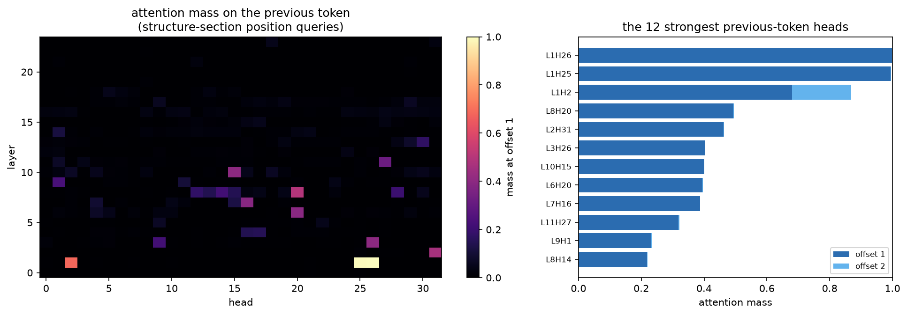
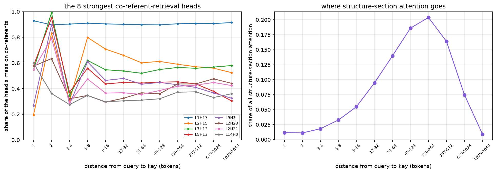
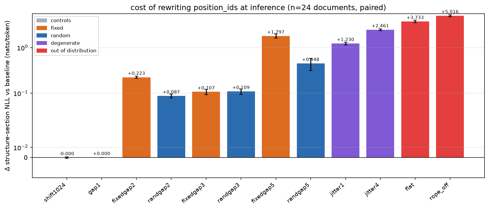

---
marinfold_experiment:
  issue: 262
  title: 'exp: does contacts-v1 need RoPE, or is a width-3 causal token smear enough?'
  kind: models
  branch: exp/262-nope-token-smearing
---

# exp: does contacts-v1 need RoPE, or is a width-3 causal token smear enough?

**Issue:** [#262](https://github.com/Open-Athena/MarinFold/issues/262) · **Kind:** `models` · **Branch:** `exp/262-nope-token-smearing`

## Question

contacts-v1 documents are self-describing and order-randomized: every statement
carries its own explicit `<pXXX>` coordinate, and statement order is uniform
noise. Does a Qwen3 trained on them need RoPE at all, or is a **width-3 causal
token smear** (mix the previous two tokens' embeddings into the current one, as
in the nanogpt speedrun's smear module) enough positional signal on its own?

## Hypothesis

The only positional information contacts-v1 actually uses is *intra-statement
role* — "am I the verb, the first argument, or the second argument?". A learned
causal depthwise mix over offsets {0, −1, −2} supplies exactly that. Everything
else the model needs is content-addressed:

- **Residue coordinates** are vocabulary items (`<p0>`…`<p1999>`), not encodings.
  Sequence separation `|i−j|`, the thing contact statistics actually depend on,
  is computed from token identities, so it survives the removal of RoPE intact.
- **Section membership** is a content lookup: `<begin_statements>` is a unique
  token and the causal mask makes "has it occurred?" a pure attention query.
- **Duplicate avoidance** ("emit each contact once") is a set-membership query
  over already-emitted position tokens — again content, not offset.

So RoPE is being spent on a nuisance variable. Worse, its distance prior is
plausibly *anti*-aligned with the task: the structure section is an unordered
bag of up to ~2700 statements that must be searched **uniformly** (dedup, gather
partners), and a locality prior over a shuffled set is at best wasted capacity.

Prediction: NoPE + smear matches or beats RoPE at equal tokens, with the gain
concentrated on **long** proteins — the regime where the bag is largest and
where we are weakest (our enrichment scales as `L^0.79` against ESMFold2's
`L^1.15`).

## Background

### Two-token lookback is exactly the right window — verified

The grammar has 2-token statements (`<pX> <AA>`, `<n-term> <pX>`, `<c-term> <pX>`)
and 3-token statements (`<contact> <pX> <pY>`), with **no separators**: a real
document reads

```
<contacts-v1> <begin_sequence> <p1153> <LEU> <p1173> <ARG> … <begin_statements>
<contact> <p1127> <p1146> <contact> <p1200> <p1218> … <end>
```

so parse state has to be inferred from token identity alone. Enumerating the
grammar over 400 synthetic documents and asking whether the *parse role* of
token `t` is a deterministic function of the token **classes** at `t−W … t`:

| lookback `W` | distinct contexts | ambiguous contexts |
|---|---|---|
| 1 | 20 | **1** — `(POS, POS)` → contact-arg2 *or* residue-statement head |
| 2 | 31 | 0 |
| 3 | 48 | 0 |

Lookback 2 is the tight bound: one short and it breaks in exactly one place, one
long and it buys nothing. The proposal's "previous two tokens" is not a guess.

<details><summary>reproduction script</summary>

```python
"""Is the parse role of token t a deterministic function of the token CLASSES
at t-2, t-1, t?  (If yes, a width-3 causal smear supplies every bit of
positional information the contacts-v1 grammar needs.)"""
import random
from collections import defaultdict

AA = [f"<AA{i}>" for i in range(20)]
def pos(i): return f"<p{i}>"

def klass(t):
    if t.startswith("<p") and t[2:-1].isdigit(): return "POS"
    if t.startswith("<AA"): return "AA"
    return t

def make_doc(rng):
    nres = rng.randint(30, 120)
    start = rng.randrange(2000)
    idx = [(start + k) % 2000 for k in range(nres)]
    stmts = [("res", [pos(p), rng.choice(AA)]) for p in idx]
    stmts.append(("nterm", ["<n-term>", pos(idx[0])]))
    stmts.append(("cterm", ["<c-term>", pos(idx[-1])]))
    rng.shuffle(stmts)
    cs = []
    for _ in range(rng.randint(10, 200)):
        a, b = rng.sample(idx, 2)
        cs.append(("contact", ["<contact>", pos(a), pos(b)]))
    rng.shuffle(cs)
    toks, roles = ["<contacts-v1>", "<begin_sequence>"], [("doc", 0), ("hdr", 0)]
    for form, ts in stmts:
        for s, t in enumerate(ts): toks.append(t); roles.append((form, s))
    toks.append("<begin_statements>"); roles.append(("hdr", 1))
    for form, ts in cs:
        for s, t in enumerate(ts): toks.append(t); roles.append((form, s))
    toks.append("<end>"); roles.append(("end", 0))
    return toks, roles

for W in (1, 2, 3):
    table, rng = defaultdict(set), random.Random(0)
    for _ in range(400):
        toks, roles = make_doc(rng)
        for t in range(len(toks)):
            ctx = tuple(klass(toks[j]) if j >= 0 else "BOS" for j in range(t - W, t + 1))
            table[ctx].add(roles[t])
    bad = {k: v for k, v in table.items() if len(v) > 1}
    print(f"lookback {W}: {len(table)} contexts, {len(bad)} ambiguous", dict(list(bad.items())[:4]))
```
</details>

### Our own results already say order is nuisance

- **#201 Phase 0**: ~77% of contacts-v1 validation loss is permutation entropy,
  42% of that from the sequence-section shuffle alone. Order is measurably noise.
- **#166 / #199**: the `-aug` arms re-permute statement order as data
  augmentation, and that **helped** (R 0.5618, and every frontier model since is
  `-aug`). We are already paying data-augmentation cost to buy order-invariance.
  NoPE is the architectural version of the same bet — invariance as a prior
  rather than as something the model has to be taught example by example.

### Prior art, and where it stops

- The nanogpt speedrun's **smear module** lets each token peer back one position
  and mix the prior token forward, through a sigmoid gate driven by the first few
  embedding dims. It was added because multiple heads were provably burning
  capacity attending to the previous token. Note it is width-2 there, it
  **coexists with rotary**, and a later record found it removable once bigram
  hash embeddings were present — i.e. smear is best understood as a cheap learned
  local n-gram feature, not as a positional encoding. In contacts-v1 the relevant
  n-gram *is* the statement, which is why width-3 is the natural port.
- **NoPE** decoder-only LMs are a real thing (Haviv et al. 2022; Kazemnejad
  et al. 2023) but the evidence is small-scale/short-context. Production practice
  is *interleaved* NoPE (Llama 4's iRoPE), not pure NoPE, which is why there is a
  hedged arm below.
- **#157** is the complementary axis: it wants RoPE-like structure applied to the
  *residue* index. The two compose into an appealing endpoint — rotary should
  encode the residue coordinate (real geometry) and not the document offset
  (shuffle noise). Out of scope here, worth revisiting after.


## Approach

Data, tokenizer, schedule, optimizer, and augmentation are held at the
[exp232 contract](../exp232_sweep_cv1_decontam/training_contract.py); only the
architecture moves. The already-tokenized decontaminated caches are reused, so
the data cost is zero.

### Phase 0 — is there anything to win? (no training)

Three probes on the default checkpoint (`contacts-v1-exp199-cooldown-1.5B`),
teacher-forced over **ground-truth** documents built from the exp245 FoldBench
monomers (real sequence, real contacts). Local RTX A5000, ~15 minutes total.

- [`grammar_lookback.py`](grammar_lookback.py) — how wide a causal window the
  contacts-v1 grammar needs, by enumeration. → `data/grammar_lookback.csv`
- [`probe_attention.py`](probe_attention.py) — per-(layer, head) attention mass
  at offsets 1 and 2, and the distance profile of co-referent retrieval.
  → `data/phase0_attention_{offsets,lift,docs}.csv`
- [`probe_positions.py`](probe_positions.py) — rewrite `position_ids` at
  inference and re-score. → `data/phase0_position_interventions.csv`
- [`probe_common.py`](probe_common.py) — document building and checkpoint
  loading shared by the two model probes.
- [`plot_phase0.py`](plot_phase0.py) — the three figures.

### Phase 1 — the ablation

Arms, at the exp232 1.5B architecture and a reduced token budget:

| arm | change |
|---|---|
| A | RoPE, no smear — control, the exp232 `m2-p06-aug` shape |
| B | RoPE + smear(2) |
| C | NoPE + smear(2) |
| D | interleaved NoPE + smear(2) — **deferred**, see Conclusion |

Two implementation requirements, both real bug risks: the smear must be strictly
causal (a test asserts that perturbing token `t+1` cannot move the logits at
`t`), and offsets −1 and −2 need **separate per-channel** coefficients, since a
single shared scalar collapses them and destroys the arg1/arg2 distinction that
is the whole point.

## Success criteria

- **Phase 0 gate:** proceed only if a previous-token head is identifiable in the
  early layers, or the loss moves measurably under a position rewrite.
- **Phase 1 gate:** an arm advances on ≥0.01 nats val loss over control A with a
  gap that is not shrinking. Read #180's "two loss scales" note first.
- **Phase 2 (the real bar):** ≥+0.01 R-precision on eval2-natural against
  #204's 0.0023 noise floor, with the enrichment-vs-`L` slope reported.
- **Guardrail:** rollout `pred/gt` contact-count ratio and finish rate must not
  regress (#142).

## Results

### Phase 0 — the model tells us which half of the idea is right

**The grammar needs a 2-token lookback, and exactly that.** Enumerating the
contacts-v1 grammar over 400 synthetic documents and asking whether a token's
`(statement form, slot)` role is a deterministic function of the token *classes*
in a causal window:

| lookback | contexts | ambiguous |
|---|---:|---:|
| 0 | 9 | 1 |
| 1 | 20 | **1** — `(POS, POS)` is contact-arg2 *or* residue-statement head |
| 2 | 31 | **0** |
| 3 | 48 | 0 |

One short and it breaks in exactly one place; one long and it buys nothing.
Width-3 smear is the tight bound, not a guess.

**(a) Previous-token heads exist, and they are extreme.**



Layer 1 holds two heads that are essentially pure previous-token heads — L1H26
puts **0.999** of its mass at offset 1, L1H25 **0.996** — and a third, L1H2, that
splits **0.75 / 0.16** across offsets 1 and 2, which is a width-3 smear
implemented in attention. Ten of 768 heads exceed 0.30 at offset 1. This is the
same observation that motivated the smear module in the nanogpt speedrun, and it
holds here: the model is paying for heads that do what a smear does for free.

**(b) Long-range retrieval is already distance-uniform — the mechanistic
argument for dropping RoPE does not survive.**



The hypothesis was that RoPE's locality prior costs us reach over the shuffled
bag of contact statements, and that this is why enrichment scales as `L^0.79`
against ESMFold2's `L^1.15`. It does not. Heads that specialise in retrieving
earlier mentions of the query's own residue index hold a **flat** share of their
attention on those co-referents at every distance: L1H17 sits at 0.90–0.93 from
one token away out to 2048. Beyond the local window the profiles are level. RoPE
is not imposing a locality prior that costs us long-range retrieval, so the
long-protein story attached to the NoPE half of #262 is dead.

**(c) The model reads position as an index, not as a metric.**



Rewriting `position_ids` at inference, paired over 24 documents. Both controls
are exact: `gap1` (the degenerate re-derivation of the true positions through
the statement parser) moves the loss by 0.000000, and `shift1024` by −0.00005,
confirming both the parser and RoPE's translation invariance.

The decisive comparison is `fixedgapN` against `randgapN`. Both give the
inter-statement gap the same mean N — the same expected stretch of the position
range — and neither ever repeats a position. Only `randgapN` destroys the exact
distance between every pair of statements:

| mean gap N | `fixedgapN` (rescaled) | `randgapN` (randomized) |
|---:|---:|---:|
| 2 | +0.223 ± 0.013 | **+0.087 ± 0.004** |
| 3 | +0.107 ± 0.015 | **+0.109 ± 0.014** |
| 5 | +1.797 ± 0.189 | **+0.448 ± 0.135** |

Randomizing every exact cross-statement distance is never *worse* than
deterministically rescaling them, and at N=2 and N=5 it is much better. **The
model does not read exact cross-statement distance.** That premise of #262 holds.

What it does read is *distinctness*. `jitter1` keeps the position range exactly
unchanged but lets two tokens occasionally share an id, and costs **+1.230**
nats — an order of magnitude more than any distance-randomizing intervention.
Position is being used as a counter or index, not as a metric.

`flat` (+3.73) and `rope_off` (+5.02) are large and deliberately uninformative:
they impose the proposal's inductive bias on a model trained without it, so they
bound the distribution-shift cost rather than measuring the architecture.

### Phase 0 verdict

| half of the proposal | evidence |
|---|---|
| **width-3 causal smear** | **Supported.** Three layer-1 heads do exactly this job; the 2-token window is provably the tight bound for the grammar. |
| **NoPE** | **Mixed.** Its premise survives (exact cross-statement distance is unused) but its mechanism does not (retrieval is already distance-uniform), and it now has a specific identified risk: the model uses position as a counter, which is what NoPE removes. |

The gate is passed, so Phase 1 proceeds — with arm B (RoPE + smear) promoted from
"the safe hedge" to the arm the evidence actually points at, and arm C's risk
localized onto the pre-registered stopping-behaviour guardrail rather than being
a general worry.

## Conclusion

Pending Phase 1. Phase 0 is complete and is summarized above: the smear half of
the idea is directly motivated by the trained model's own attention, and the
NoPE half loses its mechanistic argument while keeping its premise.

Arm D (interleaved NoPE) is deferred rather than dropped. It is the most
invasive arm to build — levanter's `Stacked` transformer shares one config
across layers, so per-layer rope needs a stacked scale carried through the
decoder layer — and it hedges a hypothesis Phase 0 has already weakened. If arm
C lands close to arm A it becomes worth building; if arm C is far off, the hedge
would not have saved it.
