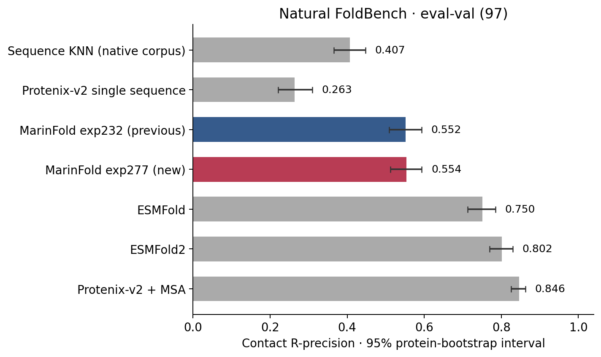
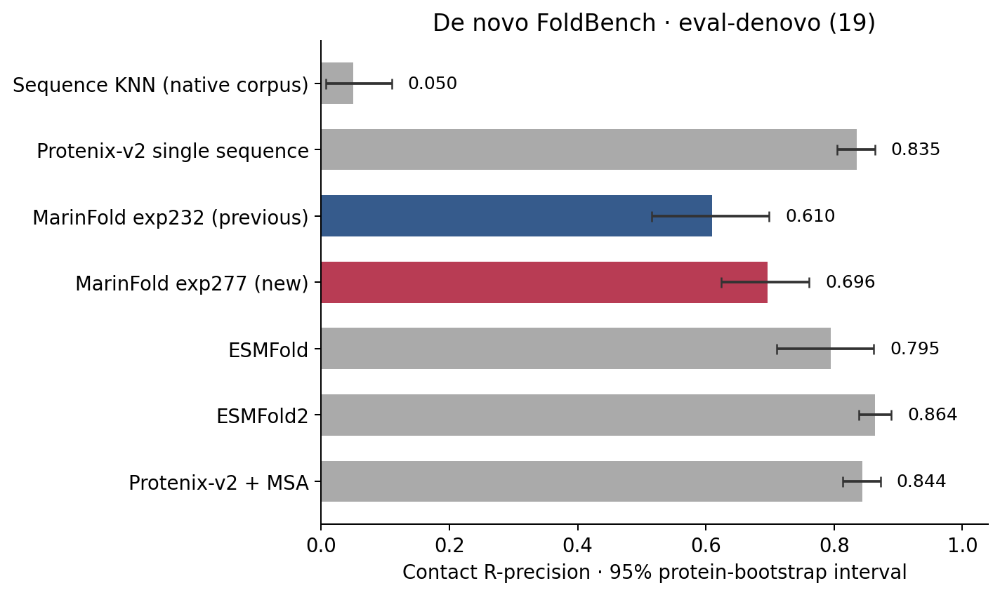
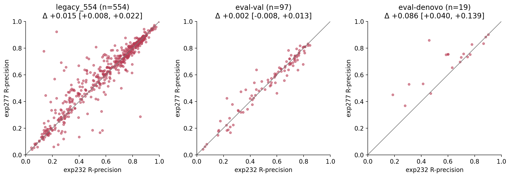
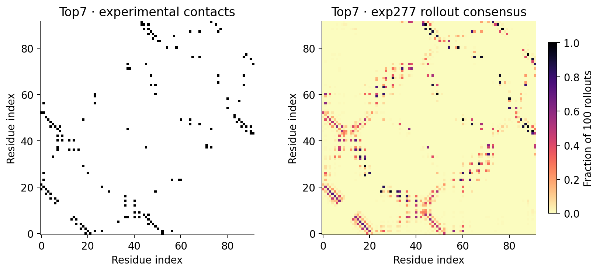
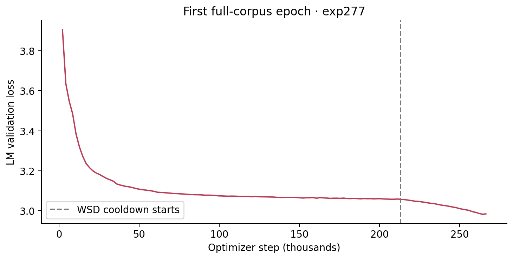

---
marinfold_experiment:
  issue: 277
  title: 'exp: single 1.5B native + MPNN redesign pilot using the exp232 winner'
  kind: models
  branch: exp/277-single-mpnn-pilot
---

# exp: single 1.5B native + MPNN redesign pilot using the exp232 winner

**Issue:** [#277](https://github.com/Open-Athena/MarinFold/issues/277) · **Kind:** `models` · **Branch:** `exp/277-single-mpnn-pilot`

## Question

Does adding ProteinMPNN-redesigned sequences improve contacts-v1 prediction in one straightforward 1.5B training run?

## Hypothesis

Structure-aware sequence redesign may improve generalization when the model trains once on all available native and redesigned documents.

## Background

A deliberately smaller companion to #274, whose mixture/hyperparameter sweep belongs to Zack. Use the published decontaminated native and redesigned AFDB/ESM-Atlas corpora from #225 and #266. Do not wait for multimer data (#145).

## Approach

Train one Qwen3 1.5B model from scratch using exp232's winning m2-p06 settings: LR 0.001, weight decay 0.2, sequence length 8192, global batch 128, packed documents with blocked cross-document attention, and scheduled amino-acid order augmentation. Concatenate the complete native AFDB, native ESM, redesigned AFDB, and redesigned ESM caches, then shuffle the combined packed-example index. Each packed example is visited once; no 50:50 mixture weighting or source cycling is used.

The in-region packing audit counted 232,090,905 documents / 248,583,762,834 raw tokens and 34,092,146 packed examples. One epoch is exactly 266,345 optimizer steps, with 114 real examples and 14 padding examples in the last batch. The existing 8192-token document limit trims one trailing token from each of 862 documents; no document is dropped. Counts are recorded in `data/epoch_corpus_counts.csv`; `audit_epoch.py` reproduces the audit using the trainer's packer. The data configuration checks the packed-example count at startup and exposes a finite dataset to the loader.

Use WSD warmup 10%, decay 20%, minimum LR ratio 0.1 over the full epoch. At the earlier observed throughput, allow about 66–68 hours for this run. Native/redesigned proportions follow corpus size (approximately 30%/70% by raw tokens). Compare to the native-only exp232 winner while reporting the different training exposure explicitly.

Choose placement from live Iris inventory, preferring existing regional data over a bulk cross-region transfer. Reuse native token caches; tokenize redesigned corpora on their existing CoreWeave storage. Validate data and a short isolated training smoke before the production run. Record exact Iris/W&B identities, configuration, and checkpoints in the experiment and run history.

## Success criteria

A healthy launched production run and reproducible checkpoint trail. Subsequently score with the current exp245/exp82 routine eval-val protocol, reporting R-precision and uncertainty against the native baseline, reporting the different token budgets. No held-out eval-test access for this pilot. A null result is useful; avoid treating a single seed as a definitive answer for #274.

## Results

Full data preparation succeeded as `/bizon/exp277-prepare-a03`. The redesigned AFDB cache has 31,702,680 documents / 35,352,543,972 tokens; ESM has 130,872,044 documents / 138,755,354,859 tokens. Native and redesigned cache cardinalities, token totals, locations, and initial-run mixture weights are recorded in `data/tokenized_corpora.csv`. Both isolated tokenizer smoke caches exactly matched independent fresh tokenization for every row (199,180 documents total; `data/tokenization_smoke.csv`).

The 16-node / 128-H100 GPU smoke `/bizon/exp277-train-smoke-a01` succeeded: ten updates, finite final train loss 6.43476, two-batch eval loss 6.31338, and approximately 0.866 seconds per step. Both step-9 native and HF checkpoints are present, including tokenizer files. See [`smoke W&B`](https://wandb.ai/open-athena/MarinFold/runs/contacts-v1-exp277-m2-p06-native-mpnn-1.5B-smoke) and `data/training_smoke.csv`.

Production was submitted on 2026-09-09 at 19:32 UTC as [`/bizon/exp277-train-a01`](https://iris-cw-us-east-02a.oa.dev/#/job/%2Fbizon%2Fexp277-train-a01), using committed source `a8582d2d`. Startup verification passed: W&B reached step 23 with finite train loss 6.70270 and 0.86358 seconds per step (1.214M tokens/s). See [production W&B](https://wandb.ai/open-athena/MarinFold/runs/contacts-v1-exp277-m2-p06-native-mpnn-1.5B) and `data/training_startup.csv`. The GPU child is `/bizon/exp277-train-a01/exp277-train-1fca4ea5`. Training compute is approximately 35 hours at this early rate, plus validation and checkpoint overhead. The first full language-model validation pass completed at step 2,114 with loss 3.76525 (`data/validation_progress.csv`). That weighted-mixture run was intentionally stopped on 2026-09-10 at 13:38 UTC after the user requested one full-corpus epoch; its last observed step was 69,556. Contact-prediction quality has not yet been evaluated.

Preparation required streaming document-only 128-row parquet batches and 32 GB workers for AFDB's long-document tail after an 8 GB memory failure. ESM used 512 workers with 8 GB after measured peak usage of 1.3 GB, reusing completed shards across the resize. No corpus was transferred across regions.

Replacement status (2026-09-10 14:06 UTC): the full-corpus packing audit, four configuration/coverage tests, and full-corpus GPU smoke passed. The smoke completed ten updates with finite losses and native/HF step-9 checkpoints including tokenizer files (`data/epoch_training_smoke.csv`). The new [production W&B run](https://wandb.ai/open-athena/MarinFold/runs/contacts-v1-exp277-m2-p06-full-epoch-1.5B) was submitted at 13:54:56 UTC as `/bizon/exp277-train-a02`, using commit `9783b384`. Its GPU child is `/bizon/exp277-train-a02/exp277-train-8c393c8d`. All 16 workers are running at batch priority, with the 266,345-step target and finite full-corpus configuration verified in W&B. Startup verification passed at step 65 / 266,345: finite train loss 5.90443, 0.85815 seconds/step, and 1.222M tokens/s (`data/epoch_training_startup.csv`). The exact packed-example count check passed and logs confirm scratch initialization. Continuous monitoring is active. The earlier run had no production failures; its permanent checkpoints at steps 14,520, 29,040, 43,560, and 58,080 remain available.

Full-epoch training completed on 2026-09-13 at 14:53 UTC. [W&B](https://wandb.ai/open-athena/MarinFold/runs/contacts-v1-exp277-m2-p06-full-epoch-1.5B) finished at step 266,344 with final validation loss 2.98441; the best of 126 full LM validations was 2.98274 at step 264,250. The final learning rate was 0.000100017, approximately the configured 0.1x WSD floor. All validation points are recorded in `data/epoch_validation_progress.csv`.

The permanent native checkpoint and HF export both completed at `step-266344`. The 5.89 GB HF bundle contains two safetensor shards, their index, model config, `tokenizer.json`, and `tokenizer_config.json`. Recovery job `/bizon/exp277-train-a03` and child `/bizon/exp277-train-a03/exp277-train-78333950` both succeeded at batch priority with all 16 workers terminal-successful. The first production job had failed near step 73,702 during a distributed checkpoint barrier; a03 restored step 72,744 and completed the epoch unchanged. Iris also recovered two worker preemptions automatically. End-to-end wall time for the full-corpus run was just under 73 hours, including the recovery, full validations, checkpointing, and final export.

The first-epoch contact evaluation completed as [`/bizon/exp277-eval-v2-01-r04-rno`](https://iris.oa.dev/#/job/%2Fbizon%2Fexp277-eval-v2-01-r04-rno). It evaluated 670 units with the fixed exp82 rollout-and-resample recipe: legacy 554, eval-val 97, and eval-denovo 19, while leaving eval-test unread. All twelve RNO2A H100 production workers succeeded. The scorer used 66,999 of 67,000 requested rollouts; one capped rollout was excluded from voting and accounted for in the manifest.

| Evaluation set | exp277 R, all / long | exp232 R, all / long | exp277 - exp232, all / long |
| --- | ---: | ---: | ---: |
| legacy 554 | 0.62009 / 0.57704 | 0.60506 / 0.55502 | +0.01503 / +0.02202 |
| eval-val | 0.55375 / 0.53802 | 0.55171 / 0.53591 | +0.00204 / +0.00211 |
| eval-denovo | 0.69582 / 0.67603 | 0.60983 / 0.57228 | +0.08599 / +0.10375 |

The eval-val delta is below the predeclared 0.005 tie threshold. Legacy and de novo improve, with a particularly large designed-protein gain. Exact tables, per-input timings, the run manifest, and per-protein precision are committed under `data/eval_rollout_v2/` and published to the public MarinFold HF bucket under `data/exp277-models-single-mpnn-pilot/evals/rollout-v2/2026-09-13/v2-01/results/`. The full private working output, including 670 dense score matrices, remains at `s3://marin-us-east-02a/MarinFold/exp277_models_single_mpnn_pilot/evals/rollout-v2/2026-09-13/v2-01/`.

## Published default and figures

The first-epoch checkpoint is registered as `contacts-v1-exp277-m2-p06-full-epoch-1.5B`
and selected by default when `--model` is omitted. Its public HF export is at
[step 266344](https://huggingface.co/buckets/open-athena/MarinFold/tree/checkpoints/contacts-v1-exp277-m2-p06-full-epoch-1.5B/hf/step-266344).
The previous exp232 nickname remains available. The export retains the weight
bytes and tokenizer vocabulary, restates the trained RoPE for Transformers 4.x,
and uses its supported fast-tokenizer class name. `publication_manifest.json`
records source ETags and source/published SHA256 digests; `publish_checkpoint.py`
reproduces the in-region CPU publication.

Publication completed on September 14 via Iris CPU job
`/bizon/exp277-publish-step266344-a02`. Anonymous HTTP checks verified both
weight-shard sizes and downloaded the config, tokenizer, index, and manifest.
The small files match their recorded SHA256 digests; both weight-shard digests
match the evaluated source in the publication manifest. Transformers 4.57.6
loads the public config and tokenizer with vocabulary 2,845 and RoPE theta
500,000. All 24 registry/config tests pass. The manifest is also committed as
`data/publication_manifest.json`.







`plot_results.py` reproduces these PNG/SVG figures from saved results; each PNG
has a sidecar with its generating command. The charts compare the same 97
natural eval-val proteins or 19 de novo proteins for every predictor. Error
bars are percentile 95% intervals from 10,000 protein-bootstrap resamples
(seed 277), and the paired charts resample per-protein differences. The legacy
554 is used only for comparing MarinFold checkpoints. The KNN reference uses
the native decontaminated corpus, not the redesigned sequences.

The paired all-range gain over exp232 is +0.01503 [0.00779, 0.02243] on legacy
554, +0.00204 [-0.00844, 0.01303] on eval-val, and +0.08599 [0.03976, 0.13916]
on designs. These intervals describe variation across evaluation proteins;
they do not include training-seed or repeated-rollout variation.

The frozen low-MSA-depth cut has partial coverage because eval-test remains
unread: 11/16 natural proteins score 0.30379, 0/5 FoldBench-only natural
proteins are available, and all 26 low-depth designs score 0.60101. The 11-protein
natural mean must not be compared directly with the old 16-protein mean.
`data/eval_rollout_v2/low_msa_coverage.csv` records these denominators.

The Top7 panel uses existing predictions for the 92-residue `denovo_pdb/1qys_A`
benchmark unit, not the longer demonstration sequence in the CLI example.
No new predictor was run for the figures. The README's historical Helico
structure scores still refer to exp232; exp277 has no Helico/GDT-TS result yet.

## Full-state continuation

The second training stage restores the complete trainer state from permanent
checkpoint `step-213072`, the last save before the first epoch's cooldown began
at step 213076. That 99-object, 17,657,133,747-byte source is at
`s3://marin-us-east-02a/MarinFold/exp277_models_single_mpnn_pilot/runs/contacts-v1-exp277-m2-p06-full-epoch-1.5B/checkpoints/step-213072/`.
The new run uses data seed 1 instead of 0 and maps the restored absolute trainer
step onto the start of a fresh finite permutation, so it visits all 34,092,146
packed examples exactly once in a different order. It adds 266,345 updates,
ending at absolute step 479,418 with final checkpoint `step-479417`. The added
epoch starts at the restored peak learning rate, remains stable for 80%, and
linearly cools to 0.1x over its final 20%. The amino-acid augmentation schedule
continues from the source step and remains at full rate after completing its
original ramp.

Production's reserved identity is
[`contacts-v1-exp277-m2-p06-full-epoch2-from213072-1.5B`](https://wandb.ai/open-athena/MarinFold/runs/contacts-v1-exp277-m2-p06-full-epoch2-from213072-1.5B),
with outputs under
`s3://marin-us-east-02a/MarinFold/exp277_models_single_mpnn_pilot/runs/contacts-v1-exp277-m2-p06-full-epoch2-from213072-1.5B/`,
and it remains gated on a passing restore smoke.

### The first restore smoke failed without running an update

`/bizon/exp277-continue-smoke-a01` (submitted 2026-09-14 13:45 UTC from commit
`07a8bccc`, GPU child `exp277-train-2ff47238`) queued about a day for H100
capacity, restored the checkpoint, and then raised before its first optimizer
update:

```
levanter/data/loader.py:140 initial_example = blocking_wait(self.data_store.getitem_async(0))
IndexError: continuation data starts at offset 27273344, got 0
```

Both the driver and the GPU child nevertheless reported `succeeded exit=0`, so
job state is not evidence here; the worker traceback is.

`DataLoader.__init__` reads global data index 0 exactly once, before any
iteration, to learn the example structure and build its zeroed padding example.
That read does not depend on the restored step, so it lands below the
continuation's absolute offset. The original wrapper rejected it.

The absolute offset itself is required and is kept. Levanter's loader turns an
absolute optimizer step into an absolute data offset
(`BatchSchedule.global_data_offset_by_step`), and `train_lm` starts the
iterator at the restored step, so the restored trainer asks for global indices
from 213,073 x 128 = 27,273,344. Exposing the new epoch at local indices
0..N-1 instead would have been worse than the crash: the loader would have
skipped the first 27,273,344 packed examples, served only the last ~20% of the
epoch, and stopped after about 53,272 of the 266,345 intended updates — and the
ten-step smoke would have passed. `test_epoch_data.py` drives a real
`DataLoader` to pin both behaviours.

The repaired dataset serves the lone index-0 structure probe from the first
example of the new epoch and still rejects every other index below the offset,
so a trainer that failed to restore its step fails loudly instead of silently
retraining a prefix.

The failed step also wrote `SUCCESS` to `.executor_status` under
`runs/...-full-epoch2-from213072-1.5B-smoke/`. A step whose output path holds a
`SUCCESS` status is skipped outright, and recipe drift only warns, so a repeat
at the same path would have been served from cache no matter what the code
said — `--attempt` previously changed only the Iris job name. Smoke runs now
carry their attempt in their run id and output path
(`...-full-epoch2-from213072-1.5B-smoke-a02`); production's identity is
deliberately left stable so a restarted production job resumes from its own
checkpoints.

## Conclusion

The requested single-model, full-corpus first epoch completed successfully with a reproducible native checkpoint and loadable HF export. Language-model validation improved from 3.90598 at step 2,114 to a best of 2.98274 near the end of the epoch. Its contact evaluation shows an eval-val tie with the native-only decontaminated exp232 winner (+0.00204 all, +0.00211 long), an improvement on legacy 554 (+0.01503 all, +0.02202 long), and a large improvement on eval-denovo (+0.08599 all, +0.10375 long). This single run therefore gives no evidence of a material natural eval-val gain at the predeclared 0.005 threshold, but it gives a strong signal that the native-plus-redesign corpus helps designed-protein contacts. Different training exposure and the single seed limit causal attribution. The separately requested reshuffled second epoch is in progress from the last pre-cooldown checkpoint.

## Runtime and placement

The live Iris inventory on 2026-09-09 showed US-EAST-02A with 208 unallocated H100s across 26 empty nodes and zero pending GPU requests. Immediately before production launch, the inventory showed 248 free H100s on 31 empty nodes and no pending GPU requests. The 16-node / 128-H100 batch gang leaves 15 nodes free. Exp232 already completed training with this gang size. RNO2A adds remote data access; the pinned CUDA stack does not support the ARM GB200 fleet. The redesigned corpora and native caches are already in the regional `marin-us-east-02a` bucket, so no large data transfer is required.

The controller now rejects exp232's old Iris client. This experiment pins Marin 0.2.86.dev32222909699 (2026-08-19) and its matching Iris/Fray/Levanter packages, with a committed lock. Other resolved training dependencies retain their exp232 versions where compatible. This runtime change is an additional comparison caveat. The cluster's default storage now points to R2; the launcher explicitly supplies the existing CoreWeave credentials and regional LOTA endpoint to all experiment workers.

`launch.py` submits one named phase at a time: `prepare-smoke`, `prepare`, `train-smoke`, or `train`. It builds a minimal workspace containing the experiment and its imported exp232 recipe helpers. `prepare.py` verifies source shard counts and parquet-footer document totals, rejects malformed/OOV tokenization records, and independently audits every smoke-cache row. `train.py` verifies completed caches before constructing the finite concatenation and preserves full production validation. The replacement smoke uses the full training caches, ten optimizer updates, and two validation batches; it has a separate output identity. `epoch_data.py` preserves scheduled augmentation while bypassing the cycling mixture.

Checkpoints are written under `s3://marin-us-east-02a/MarinFold/exp277_models_single_mpnn_pilot/runs/<wandb-run-name>/checkpoints/step-<N>/`. Tokenizer files must accompany any exported or published weights.
