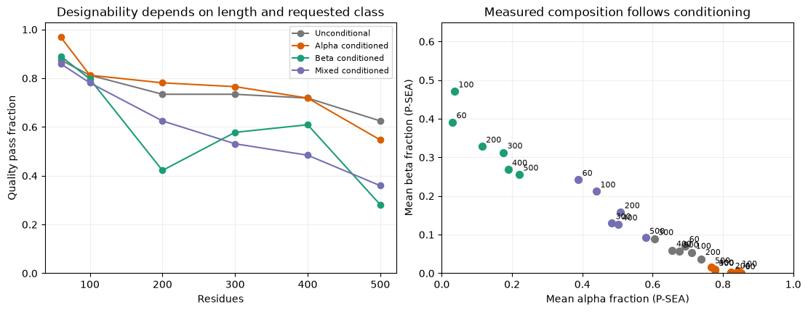
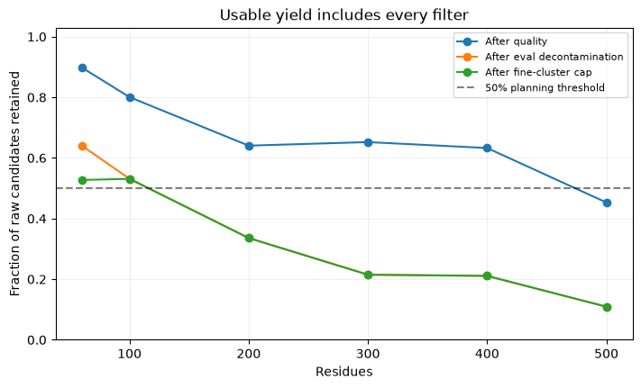
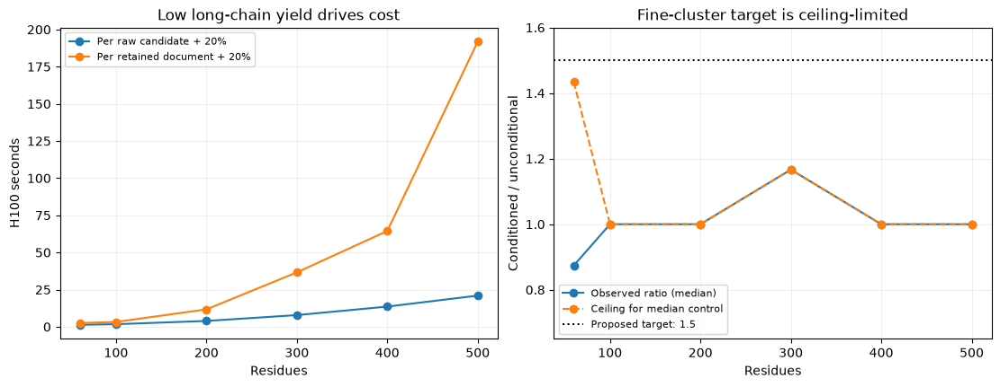

---
marinfold_experiment:
  issue: 278
  title: 'exp: diversify contacts-v1 with Proteina-generated monomers'
  kind: data
  branch: exp278/proteina-pilot
---

# exp: diversify contacts-v1 with Proteina-generated monomers

**Issue:** [#278](https://github.com/Open-Athena/MarinFold/issues/278) · **Kind:** `data` · **Branch:** `exp278/proteina-pilot`

## Question

Can fold-conditioned Proteina generation supply one million useful, structurally diverse, sequence-paired monomer documents of length 60–500, at an acceptable cost per retained structure?

## Hypothesis

Length-stratified, fold-balanced generation followed by sequence design, refolding and structural selection will increase structural coverage relative to unconditional generation. Whether that coverage improves MarinFold must be tested with a fixed-token training comparison; generating more documents alone does not establish value.

## Background

- [Proteina repository](https://github.com/NVIDIA-BioNeMo/proteina), inspected at commit `a44b407daf6a5358e43cd68907f3e3f1cbc65fdc`. Its output is a Cα trace, not an amino-acid sequence or a complete backbone.
- [Published efficiency measurements, Appendix C](https://arxiv.org/html/2503.00710v1#A3): compiled, maximally batched A100-80GB inference, 400 sampling steps. The 200M model without triangle layers is the initial throughput candidate; the long-chain checkpoint uses the same architecture but needs its own benchmark.
- [Upstream designability code](https://github.com/NVIDIA-BioNeMo/proteina/blob/main/proteinfoundation/metrics/designability.py) uses Cα-only ProteinMPNN and ESMFold. Its default evaluates eight sequences per backbone and reloads ESMFold inside each per-backbone call. Production must use persistent workers and explicit sequence-attempt counts.
- MarinFold references: [contacts-v1](https://github.com/Open-Athena/MarinFold/tree/main/marinfold/marinfold/document_structures/contacts_v1), [exp78 ESMFold timings](https://github.com/Open-Athena/MarinFold/blob/main/experiments/exp78_evals_esmfold_contacts/data/timings.csv), [exp225 decontamination](https://github.com/Open-Athena/MarinFold/issues/225), [exp245 evaluation splits](https://github.com/Open-Athena/MarinFold/issues/245).

## Approach

### 1. Pilot before committing to the million

Begin with 1–2 H100s for installation, end-to-end correctness and memory tests. Pin source, checkpoint checksums, CUDA/PyTorch and container digest. Enable compilation through a supported wrapper or small explicit source change; no monkey-patching. Use fixed-length batches and keep all models warm.

Budget up to **100 H100-hours** for a roughly 10,000-candidate pilot, terminating at the resource cap if measured costs are higher. Screen configs on a small subset first; spend the remaining pilot on the strongest candidates. Include 60, 100, 200, 300, 400 and 500 aa plus boundary tests around 250–300.

Compare:

- 200M no-triangle standard checkpoint for short proteins and the long-chain checkpoint for longer ones. Test their overlap instead of assuming an arbitrary cutoff is valid.
- Default unconditional sampling versus balanced C/A-level conditioning, then feasible T-level conditioning. The long-chain release supports a restricted A/T label set; do not force every fold at every length.
- Published noise defaults and one higher-noise candidate to measure the diversity/designability tradeoff. Keep 400 sampling steps for the reference; only reduce steps after checking quality.
- A small 400M triangle-model quality control arm. Choose by accepted diverse structures per GPU-hour, not raw designability alone.
- One versus up to two ProteinMPNN/ESMFold attempts on a matched subset. Report first-attempt and best-of-two acceptance separately.

Capture per-input timings and the repository's required worker metadata at inference time, including checkpoint/seed, batch size, actual batch latency, amortized GPU time, model-load time, stage time, GPU, hostname and versions. Record p50/p95, peak memory and yield by length/fold bin. Every W&B run uses `open-athena/MarinFold` and gets a history file immediately.

### 2. Produce usable sequence–structure pairs

Preferred path:

`Proteina Cα trace → Cα-only ProteinMPNN → ESMFold → self-consistency/geometry checks → pyconfind → existing contacts-v1 serializer`

ESMFold supplies N/CA/C/O and sequence identities needed by the existing native-AA rotamer contact calculation. Retain original Cα coordinates and the accepted refolded structure, explicitly naming which geometry supplies contact labels. The first corpus uses **refolded geometry**; measure diversity after this step. Reusing the upstream per-backbone ESMFold loader would waste the throughput estimate, so write persistent stage workers and disable the stock eight-sequence designability loop.

A cheaper optional arm reconstructs a complete backbone from Cα coordinates and adds designed residue identities, with ESMFold only on an audit sample. That arm would preserve generated geometry more directly but requires reconstruction validation and has weaker sequence–structure assurance. Keep it separate; do not silently mix its labels into the refolded corpus.

Initial acceptance criteria: finite coordinates, one complete chain of the intended length, no severe clashes or chain breaks; Cα self-consistency RMSD ≤2 Å over the full chain and mean ESMFold pLDDT ≥70. These are proposed thresholds, not a claim of experimental folding or verified monomeric state. Record failures; do not label generated PDB B-factors as pLDDT. Validate the checks in every length/fold stratum.

### 3. Make diversity an explicit sampling and retention objective

- Maintain quotas over length and broad structural classes: mostly alpha, mostly beta and mixed alpha/beta. Start with equal class quotas where supported and measure realized assignments independently of requested labels.
- Within feasible length/class combinations, favor underrepresented architectures/topologies relative to the current training corpus. Keep an unconditional exploration arm. Reallocate future sampling to underfilled bins using observed acceptance, while keeping the target distribution fixed and documented.
- Cluster accepted structures using Foldseek prefiltering followed by TM alignment for candidate neighbors. Proposed redundancy definition: TM-score ≥0.8 in both normalizations and ≥80% coverage of both chains. Cap retention at five per fine structural cluster. Calibrate prefilter recall on a small exhaustive comparison; do not perform a trillion-pair all-vs-all alignment.
- Measure unique-cluster fraction, effective cluster count `exp(entropy)`, C/A/T occupancy, secondary-structure composition and nearest-training-structure TM-score distributions. Report broader fold-level comparisons separately from fine redundancy clusters. One million structures does not mean one million new folds.
- Measure both pre-refolding and post-refolding diversity and compare to an equal-size, length-matched unconditional control and an equal-size training-corpus sample. A novel sequence or low sequence identity is not evidence of structural novelty.
- Apply exp225's frozen sequence reference and rule (≥30% identity over ≥50% of the shorter sequence, including the full FoldBench reference). Add a preregistered structural near-duplicate screen against evaluation structures using the fine redundancy definition above. Record all hits and exclusions; avoid claims of complete fold-disjointness. Keep all variants of a backbone/cluster together in any internal split.

### 4. Scale in resumable shards

After the pilot, freeze the selected recipe and predicted cost. Run a **100,000-accepted-design milestone** before completing the million, because duplicate rejection can increase with corpus size.

Use root Iris jobs at batch priority, each with one GPU and independent length-bucket work. Start with 32 H100 workers on RNO2A; separate sampling, folding and CPU queues so each model remains resident and the slow stage gets the appropriate share. Balance estimated shard time, not only row count. Persist a manifest and deterministic seeds; retry only unfinished shards and preserve explicit rejection reasons.

Use the established CoreWeave S3/fsspec path, under one experiment prefix such as `s3://marin-us-east-02a/MarinFold/exp<N>-proteina/`; verify endpoint/locality before bulk I/O. Avoid routing inputs or outputs through the workstation or GCS. Regional movement above 10 GB requires the repository's explicit sign-off; no cross-region transfer is authorized by this proposal. Benchmark document generation on co-located CPU capacity and cache the pyconfind rotamer library per worker. Read the Zephyr performance skill before authoring any `map_shard` pipeline.

Store compressed, sharded structures/coordinates and documents, not one million tiny objects. At mean length 280, raw Cα float32 arrays alone are 3.36 GB/million; N/CA/C/O arrays are 13.44 GB. Full structures, text documents, rejects, search databases and manifests are larger. Initially provision **100–300 GB working storage**, then replace this allowance with pilot byte counts. Keep accepted structures, provenance and reproducible regeneration metadata; retain a stratified reject audit. Publish consolidated public artifacts under `data/exp<N>-proteina/` in the HF bucket after settling the release terms and transfer plan.

## Success criteria

- Pilot yields a reproducible measured cost model, complete timing/rejection records and no silent malformed-document drops. Production planning is conditional on ≥50% aggregate retention; lower retention triggers repricing rather than quietly exceeding the envelope.
- At the 100k milestone, length quotas hold within ±5% relative error; accepted class/fold occupancy and duplicate growth are reported. Fine-cluster retention cap is enforced without dropping desired length/class coverage silently.
- Target at least 1.5× effective fine-cluster count versus a matched unconditional sample, and broader realized class coverage. This is a proposed research target, not a forecast. Failure is a useful negative result and stops the million-scale rollout for redesign.
- Final deliverable, if milestones pass: one million distinct accepted backbones, one sequence/document each, versioned provenance, all decontamination checks, complete cost report and reproducible structural-diversity analysis. At a five-per-cluster cap this requires at least 200,000 fine clusters; assess feasibility at 100k before assuming it scales.
- Downstream utility is a separate, fixed-token continuation experiment from the same decontaminated checkpoint: natural-only control versus 5% and 15% synthetic token mixtures, with identical optimizer/compute budgets. Use eval-val for iteration and eval-denovo as a separate diagnostic; reserve and log a rare eval-test read after selection. Target a ≥0.01 absolute long-range R-precision gain with no material natural-protein regression, accompanied by paired uncertainty estimates. Repeat promising comparisons across seeds before a strong claim.

## Results: initial screen completed on 2026-09-09

The pipeline generated and refolded 1,536 backbones: 64 per requested class at each of six lengths. **1,044 passed quality; 523 passed evaluation decontamination; 494 remained in 453 fine structural clusters after a global five-per-cluster cap.** All 494 contacts-v1 documents passed sequence round-trip, contact-count, endpoint and monomer metadata checks. None was truncated; they contain 459,336 tokens in total. These are provisional research artifacts and have not entered training.

| Length | Raw backbones | Quality pass | Retained | Retention |
| --- | ---: | ---: | ---: | ---: |
| 60 | 256 | 230 | 135 | 52.7% |
| 100 | 256 | 205 | 136 | 53.1% |
| 200 | 256 | 164 | 86 | 33.6% |
| 300 | 256 | 167 | 55 | 21.5% |
| 400 | 256 | 162 | 54 | 21.1% |
| 500 | 256 | 116 | 28 | 10.9% |

The equal-raw-count screen retains 32.2% overall. This differs from a production target uniform over every integer length 60–500: the cost model accounts for length-dependent oversampling instead of dividing pooled runtime by pooled yield.

### Diversity and what the screen can resolve

Conditioning changes independent P-SEA secondary-structure measurements: short alpha, beta and mixed requests produce distinct compositions, while unconditional generation is predominantly helical. Control becomes weaker at 500 aa: the beta-requested arm averages 22% alpha and 26% beta, while the mixed-requested arm averages 58% alpha and 9% beta. Requested labels are not independently assigned CATH classes, architectures or topologies.

After quality and decontamination, the balanced conditioned pool has **0.965×** the effective fine-cluster count of a length-matched unconditional control (108 backbones each; 100 subsampling replicates; 2.5–97.5 percentile range 0.881–1.057). This range measures sensitivity to subsampling this screen, not a statistical confidence interval for population effects. The metric uses all eligible backbones before the cluster cap to avoid evaluating a diversity-selected pool against an unselected control.

The proposed 1.5× target is poorly calibrated for this small screen: the unconditional control already has a median 94.8 effective clusters out of 108 samples, so even a completely unique conditioned sample can reach only about **1.14×** for the median control. The gate is unproven, not a valid general rejection of conditioned Proteina. A follow-up should measure diversity accumulation with sample size and architecture/topology coverage against a frozen natural-data baseline before freezing a revised success target.

Fine redundancy requires both normalized TM scores and both coverages ≥0.8. Original and refolded geometries are analyzed separately. The TM-score bound `min(TM) ≤ shorter_length / longer_length` excludes every cross-length pair on this grid except 400/500; those two lengths were explicitly searched in addition to all within-length searches. No cross-length fine neighbors were detected. Broader TM≥0.5 connected components are reported only within lengths; transitive components are not CATH fold counts.

Each length has a 64-candidate exhaustive TM-align audit. Fine-neighbor recall must be read with the positive counts in `prefilter-recall.csv`; several longer-length audits have zero fine neighbors and cannot estimate recall. The additional mixed-length 64-candidate audit also has zero fine neighbors. These audits do not establish production-scale recall.

### Filtering and corrections

Quality requires one complete sequence-matched monomer, finite Cα coordinates, full-chain Cα self-consistency RMSD ≤2 Å, mean ESMFold pLDDT ≥70, and the recorded Cα clash/continuity checks. This is an operational computational screen, not experimental folding or verified monomeric state. Contacts come from the **ESMFold-refolded** backbone through the existing native-AA pyconfind/contacts-v1 generator.

Sequence searches use exp225's frozen legacy and full FoldBench FASTAs. The final exclusion rule is `(identity ≥0.30 and coverage of the shorter sequence ≥0.50) OR E≤0.001`. The identity branch implements the approved rule without an E-value exception; the extra significance branch conservatively removes strong homology below 30% identity. The initial analysis accidentally retained exp225's E≤10 safeguard on the identity branch; final reports reapply the approved identity rule to saved hits. E-values here use a fixed small reference database and are not numerically interchangeable with exp225's corpus-database E-values. Search sensitivity and thresholds are recorded in each report.

The structural near-duplicate reference contains the legacy 554 plus all 334 FoldBench monomer targets, using exp245's recorded chain resolution; these lists can overlap. The sequence reference additionally covers all FoldBench protein chains. This is not a complete fold-disjointness guarantee. Nearest-training comparisons use 1,304,911 base AFDB **train-split** representatives before exp225 decontamination, not the entire current training corpus or ESM Atlas; report nearest detected matches, not globally novel folds. All 494 selected candidates have a detected match in that reference: median smaller-normalized TM score 0.677, with 72/494 (14.6%) meeting the fine-neighbor threshold including coverage. This does not measure novelty against every current training document. No evaluation model scores or held-out model-selection results were read.

Two integration corrections were validated before final selection. Transformers 4.48.3 ESMFold confidence is returned in [0,1], so filtering and PDB B-factors require multiplication by 100. The initial trans-only Cα distance gate also rejected legitimate cis-proline bonds. The corrected check requires proline, omega within 20 degrees of cis, C–N distance 1.15–1.60 Å and Cα step 2.7–3.4 Å; other compressed steps remain rejections. See [PDBe](https://www.ebi.ac.uk/pdbe/modval4) and the [cis-bond structural study](https://pmc.ncbi.nlm.nih.gov/articles/PMC10413078/). Predictions were corrected without GPU inference in immutable new prefixes. All reported selection counts use the corrected checks.

### Measured cost and auxiliary probes

Warm H100 sampling averages 0.47, 0.80, 2.21, 4.21, 6.96 and 10.26 seconds per backbone at 60/100/200/300/400/500 aa. Persistent ESMFold averages 0.64, 0.64, 1.06, 2.32, 4.30 and 7.14 seconds. ProteinMPNN averages 0.004–0.089 seconds per candidate. Per-input CSVs retain batch latency, amortized stage time, model load and worker metadata; cost sums stage `elapsed_seconds`, because `total_seconds` overlaps between design and refold rows.

At this screen's retained yield, uniform accepted lengths 60–500 and one design/refold attempt, the projection is **13,382 H100-hours per million retained documents**, including 20% overhead: **17.4 days on 32 sustained H100s**. Equal retained contributions from all four requested arms instead project **15,823 H100-hours**. The original 2,500–6,000-hour envelope is not supported by this recipe's yield. These projections interpolate six measured lengths; the short/long checkpoint crossover remains untested.

At illustrative accounting rates of $2–4/H100-hour, the primary estimate is **$26,800–53,500**. These are not vendor quotes; the Iris fleet is prepaid and its contract chargeback rate was unavailable. Million-scale duplicate growth, CPU selection, storage/transfer charges, queueing and downstream training remain outside this estimate. If only half of screening-set survivors remain useful at scale, GPU cost doubles to about 26,800 hours. This is a conditional projection, not a claim that a million sufficiently diverse documents can be delivered.

Compressed-parquet proxies project roughly 53 GB for one selected candidate record per document and 4.3 GB of documents; keeping all raw candidate records at the measured oversampling rate is about 270 GB before caches, search databases and duplicate intermediate formats. See `data/storage-projection.json`. The pilot nearest-reference search examined up to 1,000 hits per candidate and is a diagnostic, not a benchmarked million-scale CPU recipe.

The 500-aa batch-24 probe used 62.45 GB: reference float32 matmuls took 10.16 seconds/backbone versus 5.00 with TF32. Quality passed on 27/48 reference and 30/48 TF32 samples. Original backbones used matched seeds (median cross-setting RMSD 0.125 Å, maximum 7.06 Å), but ProteinMPNN seeds differ between arms, so refolding yields are not a paired comparison. The faster setting is promising; this small check does not establish noninferiority and is excluded from the reference cost projection.

On 32 identical unconditional 500-aa backbones, first-attempt quality was 18/32, second-attempt quality 20/32, and best-of-two quality 23/32. The second attempt rescued five backbones for 231 additional design/refold GPU-seconds (46 seconds per quality rescue, before decontamination). Multiple sequence attempts are not counted as distinct backbones.

### Execution and artifacts

All GPU jobs are terminal. Iris task-attempt wall time totals **4.706 H100-hours**, including setup, compilation, failures and cancelled attempts, against the 100-hour pilot cap; this is resource time, not a provider invoice. There were 23 successful jobs, four startup failures and three cancelled jobs whose completed case outputs were reused. The launcher uses root one-H100 batch jobs, a digest-pinned container, pinned Proteina source and checkpoint checksums, persistent model workers and resumable batch markers. No shared-cluster services were restarted.

- Issue: [#278](https://github.com/Open-Athena/MarinFold/issues/278); implementation: [draft PR #282](https://github.com/Open-Athena/MarinFold/pull/282).
- W&B: [exp278-proteina-pilot-20260909](https://wandb.ai/open-athena/MarinFold/runs/exp278-proteina-pilot-20260909); corresponding run history is committed.
- Working artifacts: `s3://marin-us-east-02a/MarinFold/exp278-proteina/`.
- Final input prefixes: `fold-l60-cis-v2`, `fold-l100-cis-v2`, `fold-l200-cis-v2`, `fold-l300-cis-v2`, `fold-l400-v1`, `fold-l500-v1`. The last two used cis-aware checks at inference time.
- Selected artifact URI, SHA256 and byte count: `data/full-screen/selected-artifact.json`; per-document provenance: `selected-documents.csv` in the same directory. It is a 0.91-MB compressed provisional parquet, not a released training dataset.
- Per-length reports: `data/l<L>-screen/`; global selection and fine clustering: `data/full-screen/`; cost model: `data/cost-projection.json`, `cost-by-length.csv`, `cost-by-case.csv`.
- Validation: 15 focused geometry, confidence, decontamination and diversity-matching tests; scoped Ruff checks; every selected document validated against its sequence and contact metadata.

Reproduction uses the experiment's committed `uv.lock`. Run `uv run analyze_screen.py --input <completed-prefix> --work /data/exp278/l<L>-screen --report data/l<L>-screen --threads 24 --eval-structures /data/exp278/eval-structures` per length, then `uv run combine_screen.py`, `uv run finalize_screen.py`, `uv run collect_sampling.py`, `uv run estimate_cost.py`, `uv run plot_screen.py` and `uv run build_summary.py`. Reference construction is in `prepare_structure_reference.py`; the prebuilt exp225 AFDB database is an explicit external analysis dependency. Rescoring original trans-only outputs uses `rescore_geometry.py`. Exact job submissions and bundle hashes are saved under `data/`.

## Conclusion

Proteina → ProteinMPNN → ESMFold → contacts-v1 works end to end, and conditioning changes broad structural composition. **The tested recipe does not justify million-document production:** retention is 32% in the screen and falls to 11% at 500 aa; the measured projection is about 13,400–15,800 H100-hours, and the proposed diversity gain is unproven with a ceiling-limited small-sample metric.

Stopped at the initial screening gate, before the larger pilot or either production milestone. This is not completion of every arm in the roughly 10k-candidate proposal: A/T conditioning, higher noise, the 400M triangle control, checkpoint overlap, a larger diversity-accumulation study, and a matched natural-corpus baseline remain untested. The next design should calibrate the diversity objective and investigate long-chain rejection causes before spending the remaining budget. No 100k/million run or training mixture was launched; the issue stays open for that redesign.
