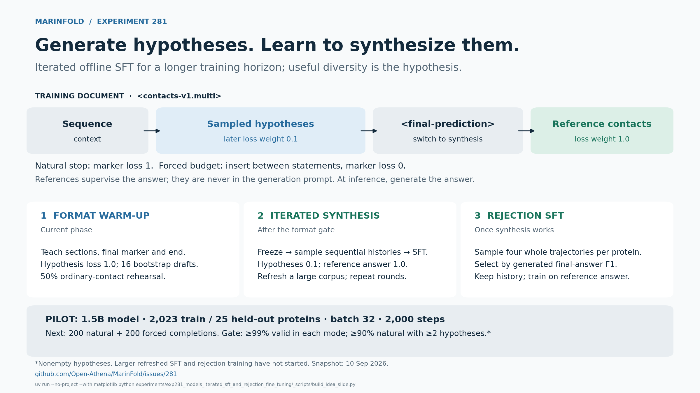

# Multi-hypothesis contact synthesis with iterated SFT

**Goal:** teach the model to generate complementary structural hypotheses and combine them into a better contact prediction. Large offline datasets and repeated SFT rounds offer a longer training horizon than our recent online RL runs.

Training documents use `<contacts-v1.multi>`:

```text
protein sequence → sampled contact hypotheses → <final-prediction> → reference contacts
```

Hypotheses are sampled without reference contacts in the prompt. The final training target comes from the known structure; at inference, the model generates that final answer itself.

1. **Learn the format.** Warm up the current 1.5B model with hypothesis loss weight 1.0. The pilot uses 16 independent bootstrap drafts and 50% ordinary-contact rehearsal.
2. **Learn synthesis, then refresh.** Freeze the model, generate a large corpus of sequential hypothesis histories, and fine-tune with hypothesis loss weight **0.1** and reference-answer loss weight **1.0**. Regenerate histories with the updated model and repeat.
3. **Later, select useful histories.** Sample four whole trajectories per protein. Rank their generated final answers by contact F1, keep the winning history, replace its answer with reference contacts, and train. This may favor complementary hypotheses; improved diversity is a hypothesis, not an established result.

Train both natural finalization and forced insertion of `<final-prediction>` at random token budgets, always between complete contact statements. The natural marker has loss weight 1; an externally inserted marker has weight 0. Reference answers and their end tokens remain fully supervised.

**Current scope:** format warm-up on 2,023 training proteins and 25 held-out proteins, batch 32, through 2,000 steps. The next gate evaluates 200 natural and 200 forced completions: ≥99% validity in each mode and ≥90% of natural outputs with at least two nonempty hypotheses. Larger refreshed SFT and rejection training have not started.

[One-slide PDF](plots/idea_overview.pdf) · [Experiment #281](https://github.com/Open-Athena/MarinFold/issues/281) · [Full design](README.md) · [Warm-up run](https://wandb.ai/open-athena/MarinFold/runs/exp281-format-s02)



Snapshot: 10 September 2026, after the 2,000-step warm-up and before its format-evaluation results. Rebuild the slide from the repository root with `uv run --no-project --with matplotlib python experiments/exp281_models_iterated_sft_and_rejection_fine_tuning/_scripts/build_idea_slide.py`.
