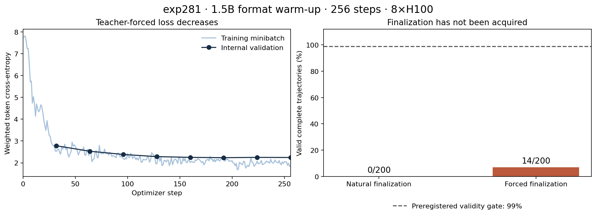
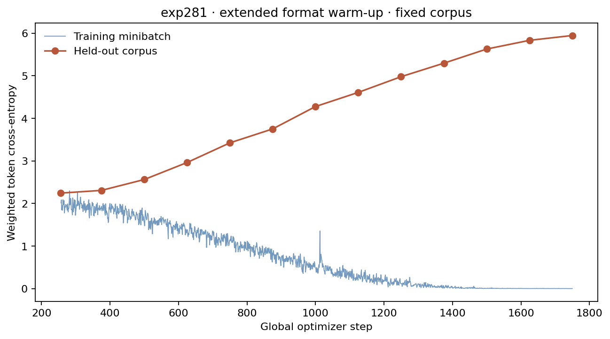
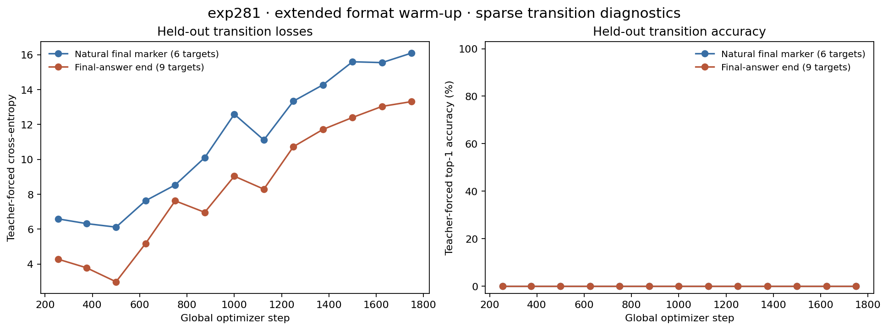

---
marinfold_experiment:
  issue: 281
  title: 'exp: iterated SFT and rejection fine-tuning for multi-hypothesis contact synthesis'
  kind: models
  branch: exp/281-iterated-contact-sft
---

# exp: iterated SFT and rejection fine-tuning for multi-hypothesis contact synthesis

**Issue:** [#281](https://github.com/Open-Athena/MarinFold/issues/281) · **Kind:** `models` · **Branch:** `exp/281-iterated-contact-sft`

## Question

Can prolonged, iterated supervised fine-tuning teach a contacts-v1 model to generate multiple useful structural hypotheses and synthesize a more accurate final contact prediction, and can subsequent rejection fine-tuning improve the hypothesis histories that support that synthesis?

## Hypothesis

1. An explicit `<final-prediction>` token separates hypothesis generation from synthesis, allowing the model to learn a distinct final-answer behavior.
2. After format warm-up, downweighting hypothesis-token loss (initial candidate: 0.1 relative to 1.0 for reference final contacts) will emphasize synthesis while maintaining hypothesis generation. This replaces the initially considered strict zero hypothesis loss.
3. Large offline datasets and repeated generation/SFT rounds permit a substantially longer optimization horizon than the previous online RL runs. Tens of thousands of optimizer steps are a horizon to investigate, not an established requirement; unique proteins and supervised target-token exposure must also be reported.
4. Training both complete and randomly interrupted histories will support natural emission of `<final-prediction>` and externally triggered finalization at different inference budgets.
5. Once synthesis works, selecting histories whose generated final answers score best, then applying nonzero SFT loss to those histories, can favor useful hypothesis-generation strategies. Complementary hypotheses may be selected when they improve synthesis, but increased diversity is not guaranteed: selection could also concentrate the sampling distribution.

## Background

- #163 established multi-hypothesis generation and investigated hypothesis/final loss weighting. Zero-hypothesis-loss training did not learn multiple sections; external-draft conditioning also degraded answer quality in that setup. Those results did not test the proposed dedicated final marker, two-stage warm-up/synthesis training, and long iterative schedule together.
- #230 transferred the multi format to a stronger base. Both #163 and #230 already ended training documents with ground-truth contacts. The changes here are explicit final-answer semantics, staged loss weighting, scale, repeated corpus refresh, and later trajectory selection. In #230, candidate voting beat oracle selection of an individual candidate, while independent plain sampling beat multi-section sampling at matched candidate count.
- #208 and #237 motivate revisiting SFT: their RL runs showed a limited useful optimization window and failures involving coverage, diversity, and trajectory length. Their results do not establish a general limit on RL or prove that longer SFT will succeed.
- #225 / #232 / #245 provide decontamination and evaluation conventions. Pin the actual starting checkpoint before generating data; do not silently inherit an older checkpoint just because it already supports the multi format.
- Related work: [STaR](https://arxiv.org/abs/2203.14465) and [ReST-EM](https://arxiv.org/abs/2312.06585) use iterative generation, selection, and fine-tuning. Our proposed main rejection variant retains reference contacts as the final training target rather than imitating the selected sampled answer.

## Approach

### Document format and inference behavior

```text
<contacts-v1.multi>
<begin_sequence> ...sequence...
<begin_statements> ...hypothesis 1 contact triples...
<begin_statements> ...hypothesis 2 contact triples...
...
<final-prediction> ...final contact triples... <end>
```

During supervised training the final contact triples come from the reference structure. Hypotheses come from model samples generated without access to reference contacts. The final answer may combine or reject draft contacts and introduce contacts absent from all hypotheses; it is not restricted to selecting a candidate or taking their union.

Support both:

- Autonomous generation of hypotheses followed by natural emission of `<final-prediction>`.
- External insertion of `<final-prediction>` at a randomly sampled token budget, rounded to a complete contact-statement boundary. Interruption may occur partway through a hypothesis, but never within a `<contact> <pi> <pj>` triple. Mid-triple interruption is explicitly out of scope.

Reserve enough context for the final answer before allocating the hypothesis budget. Train across short and long prefixes, including no hypotheses and partial hypotheses. Do not silently truncate reference targets to make room for additional drafts.

### Phase A: format warm-up

Fine-tune the chosen current checkpoint to produce the multi format, the new final marker, and a properly terminated final prediction. Supervise hypotheses and structural transitions sufficiently to acquire the behavior, then verify free-running multi-section generation and natural finalization before beginning the synthesis-heavy phase. Include ordinary contacts-v1 rehearsal as needed to preserve plain-mode behavior; measure its effective supervised-weight share.

### Phase B: iterated synthesis SFT

1. Freeze a checkpoint for dataset construction.
2. Generate a large corpus of sequential multi-hypothesis histories from that checkpoint, matching the intended inference distribution. A concatenation of independent plain rollouts is a separate comparison, not an equivalent substitute.
3. Construct complete and randomly interrupted examples, followed by reference final contacts.
4. Continue training with reduced hypothesis loss and full final-answer loss.
5. Evaluate, refresh histories from the updated checkpoint, and repeat for several rounds. A modest replay fraction of older histories is a candidate stabilization measure, not a settled hyperparameter.

Proposed initial loss profile after warm-up:

| Target span | Complete example | Externally interrupted example |
|---|---:|---:|
| Hypothesis tokens and ordinary draft transitions | 0.1 | 0.1 |
| Predicting `<final-prediction>` | 1.0 | 0.0 |
| Reference final contact tokens and `<end>` | 1.0 | 1.0 |

The externally inserted marker is context, not a supervised decision to stop at an arbitrary budget. Its following answer is fully supervised. Complete examples maintain the autonomous stopping behavior. A 50:50 complete/interrupted mix and a small 0.03-vs-0.1 hypothesis-weight comparison are candidate initial settings, to finalize before launch.

Express masks in terms of the token being predicted and verify next-token alignment at boundaries. Normalize by supervised weight and report actual hypothesis/final/rehearsal weight totals: 0.1 per token is not a small total contribution if hypotheses are much longer than final answers. Zero direct token loss does not imply detaching context representations.

### Phase C: rejection fine-tuning after synthesis has begun to work

For each protein, sample several **whole trajectories**, each with its own hypothesis history and generated final answer. Proposed initial candidate count: four.

```text
Generate: hypotheses -> <final-prediction> -> sampled final answer
Select:   score sampled final answer against reference contacts
Train:    selected hypotheses -> <final-prediction> -> reference contacts
```

Select the trajectory with the best generated final answer, retain reduced but nonzero loss on its hypotheses, and retain full reference supervision after the final marker. Sampling several final answers from one shared history would not select among hypothesis-generation strategies and is not the main design. Training on the winning sampled final answer itself is a separate optional ablation, not the default.

For interrupted examples, sample one budget for the protein and apply it to all competing trajectories. Select using the answer generated at that interruption point, not a later completed answer. For autonomous examples, use a common maximum budget and report actual generation cost and natural stopping behavior.

Use final contact-set F1 as the initial candidate selection score, balancing precision and recall rather than rewarding precision alone. Lock the exact score, invalid/incomplete-output handling, and tie-breaking before launch. Do not score the ground-truth replacement itself or select by the best individual draft. Reference contacts are used for offline scoring and final targets only, never in generation prompts. Log winner and candidate-score distributions so selection on decoding luck or narrow strategies is visible.

### Controls and evaluation

Core comparisons, staged to avoid an unnecessarily large initial sweep:

- Direct reference-contact SFT without hypotheses, with the same protein pool and comparable final-target exposure.
- Synthesis SFT on a fixed corpus versus refreshed histories.
- Rejection best-of-four versus random-one-of-four selection from identically generated candidate pools, with matched training exposure.
- Voting over the supplied hypotheses and independent plain sampling at matched inference token budgets, also reporting wall time.

Diagnostics:

- Final-answer performance versus available hypothesis budget, including zero hypotheses, one hypothesis, multiple hypotheses, and repeated copies of one hypothesis.
- Old/new synthesizers evaluated on identical saved histories, alongside evaluation on their own fresh histories, to distinguish reading improvements from generator improvements.
- Final contact precision, recall, and F1; established R-precision/AUC using a preregistered final-output ranking/aggregation protocol rather than treating an unordered single contact set as a calibrated ranking.
- Hypothesis quality, true-contact union coverage, pairwise overlap, section counts, natural marker placement, format validity, completion rates, and plain-mode retention. Low overlap alone is not evidence of useful diversity.
- Paired per-protein comparisons and uncertainty, with candidate budget and target exposure explicit. Use eval-val for iteration, eval-denovo separately, and reserve eval-test for a settled configuration under #245's read-budget policy.

## Success criteria

- Format gate: at least 99% valid final-answer completion on the preregistered format-validation sample, measured separately for natural and forced finalization. Multi generation must retain multiple hypotheses in the intended multi-budget setting; immediate finalization alone does not pass the gate. Externally forced markers occur only between complete statements.
- Synthesis: final-answer accuracy improves over the no-hypothesis SFT control on eval-val, with a paired 95% confidence interval excluding zero on the preregistered primary metric. Report comparisons to voting and independent sampling at matched inference cost even if they remain stronger.
- Iteration: establish whether refreshed histories improve over fixed-corpus training at comparable target exposure; a negative result is informative and must be reported.
- Rejection: best-of-four selection improves over random-one-of-four training under the matched protocol. Report within-trajectory useful coverage and across-trajectory diversity separately; an accuracy gain alone does not establish diversity improvement.
- Freeze exact evaluation budgets, primary metric protocol, plain-mode retention tolerance, and checkpoint-selection rules before launch. Separate demonstrated effects from unconfirmed hypotheses.

## Implementation and execution

The format implementation lives in `marinfold.document_structures.contacts_v1_multi`.
Experiment drivers are separate files:

| Driver | Responsibility |
|---|---|
| `preflight.py` | Validate existing CoreWeave model/input metadata; freeze source URI/size/ETag manifest |
| `prepare.py` | Stream eligible target shards; append missing vocabulary tokens and initialize the model |
| `generate.py` | Batched vLLM bootstrap or sequential histories, random statement-aligned interruptions, all candidate outputs and timing CSVs |
| `build_corpus.py` | Best/random whole-trajectory selection, reference replacement, loss masks, optional plain rehearsal |
| `train.py` | Single-node PyTorch DDP, weighted gradient accumulation, validation, complete checkpoint/resume and W&B history |
| `evaluate.py`, `compare.py` | Unselected final/draft vote metrics and paired per-protein bootstrap comparisons |
| `round_plan.py`, `dispatch.py` | Reviewable stage DAG and minimal-workspace Iris submissions |
| `report.py` | Collect bounded result files into the existing W&B run for review |
| `smoke.py` | Real tiny-Qwen training/resume checks, optionally vLLM generation |

PyTorch DDP is used here to make the global weighted objective explicit. There is
one denominator across ranks and microbatches per optimizer step; DDP averaging
is accounted for. Each document has independent attention and right padding.
This avoids the per-microbatch normalization caveat in the previous Levanter
weighted SFT path. Parameters and Adam states are float32; CUDA forward passes
use bf16 SDPA with activation checkpointing. Checkpoints include optimizer,
and the single-node gang shares one staged copy. Resume memory-maps optimizer
state; temporary checkpoint files are removed after durable publication to keep
worker disk use bounded. Saved checkpoints also include
rank-specific data positions/RNG, tokenizer, source/config fingerprints, and a
checksum completion manifest. Resuming requires identical code, data, world size,
and optimization settings; a new refresh uses the chosen checkpoint as a fresh
weight initialization instead.

**Placement:** start with one 8×H100 node on `cw-us-east-02a`, at batch priority.
The chosen base is the current registry default, exp232 m2-p06 step 363000, whose
HF-format copy already exists in the same S3 bucket as the staged decontaminated
AFDB and ESM corpora. `data/iris_capacity.json` records the live peer snapshot.
RNO2A also has H100 headroom and the GB200 cluster is reachable, but neither is
needed to begin. Marin TPU pools have ready v4/v5p slices; ready is not equivalent
to idle, and moving these S3 inputs to GCS would add a transfer and a second
training backend. The implemented launcher therefore targets US-EAST-02A only.

The old local Iris client was rejected by the controller. Validation uses an
isolated current client checkout at revision `9ccc1bd5e4`; the launcher accepts
its path explicitly. Availability schema v3 preserves free/total accounting but
changes held-band ordering. The older utilization helper expects v2 and must not
be treated as a valid automatic placement decision. The raw v3 response and
current Iris implementation were inspected directly. No shared cluster was
restarted or modified.

### Running the pipeline

Use the experiment environment (`uv sync`; `uv sync --extra generation` for a
local vLLM worker). `uv run python round_plan.py configs/format.json` prints the
initial DAG. All entries in group 0 must finish before group 1, then group 2.
Pass an entry's arguments to `dispatch.py --stage ... --name ... --gpus ... --
...`; it prints the command, and submits only with `--submit`. For example:

```bash
uv run python dispatch.py --iris-project /path/to/current/marin \
  --stage preflight --name exp281-input-preflight --submit
```

Before the format round, run `prepare.py targets` against
`s3://marin-us-east-02a/protein-structure/MarinFold/exp281/inputs/sources.json`,
writing the target manifest at the path in `configs/format.json`. Set an explicit
`--limit` for the initial corpus. Eligibility defaults to 8–512 residues and a
length-based final-answer reserve; excluded lengths/oversized reference answers
are counted, never silently truncated. Internal validation is split by sequence
hash, so identical sequences across the two sources cannot cross that split.
This internal loss-validation set is separate from FoldBench eval-val.

Run `prepare.py model --source <generator URI from config> --output
/tmp/exp281-initial --publish <initial_model URI from config>` on a CoreWeave CPU
worker. It uses the library's existing export normalization for tokenizer/RoPE,
appends missing mode/final tokens, and preserves every original token id. The
prepared checkpoint is shared by corpus construction and training. Generation
uses the original base for bootstrap only.

The format example proposes 2,000 steps, 16 independent bootstrap hypotheses,
one history per target, and 50% plain rehearsal. These are starting settings,
not a completed 2,000-step experiment. The bounded full-model profile and
256-step trial below have completed.
For synthesis/rejection, create another round config with a distinct `round` and
`run_name`, point both `generator` and `initial_model` to the selected previous
checkpoint, and point `tokenizer` to that same checkpoint. Synthesis defaults to
hypothesis weight 0.1, four candidates, random selection, and 10% plain rehearsal;
rejection changes training selection to best final-answer F1. Validation always
uses random selection. Set hypothesis weights/rehearsal explicitly for ablations.
A fixed-corpus control reuses the earlier corpus manifest. A rejection control
builds a second corpus with `--selection random` from the same candidate files.
`--plain` constructs the no-hypothesis baseline.

Sampled histories use T=1, top-p=0.95, top-k disabled. Forced budgets are drawn
from {0, 256, 1024, 2048} and capped by the length-based available context; half
the examples are forced by default. Natural and forced examples never share a
selection pool. Invalid complete outputs are recorded and excluded equally from
best/random training selection; all-invalid pools fail loudly. Evaluation keeps
invalid outputs in its denominator. Bootstrap drafts have up to four deterministic
retries for syntax, termination, and physical position validity.
Every rejected draft is retained in candidate audit records; this acceptance rule
never consults reference contacts. Empty contact sets are valid hypotheses, are
counted explicitly, and do not count toward the multiple-hypothesis format gate.
Exhausted retries and malformed forced-history
prefixes stop corpus generation for diagnosis. Re-run against the same immutable
output prefix only with the same generator/config/source fingerprint; completed
parts are skipped. Changing placement/shard count currently requires a new
output prefix.

Generation writes per-input timing CSVs beside each candidate part, with shared
batch latency explicitly identified and model load time separate. Collect these
CSV files into the experiment's tracked data before reporting predictor timings.
Training creates a history file immediately after W&B init and also saves it
under the durable output's `history/` prefix; bring that file into this repo and
regenerate `history/RUNS.md` when recording a remote run.

### First full-model trial

`configs/trial.json` fixes a bounded format trial: 2,048 eligible proteins, at most
1,024 each from AFDB and ESM, split by sequence hash; 16 bootstrap drafts; 50%
plain rehearsal; 256 optimizer steps with global batch 32; checkpoints every 64
steps and validation every 32. The trial shares the prepared initial checkpoint
with the longer format plan. Its smaller validation set is partitioned across
ranks without duplicating targets; some validation ranks may have no rows.

The initial `trial-s01` generation attempt exposed occasional empty/malformed
plain drafts and one vLLM initialization failure. Its partial corpus is not used.
`trial-s02` added bounded format retries, but a repeatedly empty ESM prediction
exposed the unnecessary nonempty-set requirement. `trial-s03` preserves empty
contact sets and separately audits them, keeping the same target pool,
sampling temperature, and seed. Training records step duration and peak
GPU memory, and attaches corpus manifests to W&B. Evaluate natural and forced
finalization on the internal validation set after the trial; no FoldBench
accuracy claim follows from this engineering/format trial.

Before training, the trial format check is fixed as eight completions per held-out
protein for natural finalization (seed 281), and eight for forced finalization
(seed 282, budgets 0/256/1024/2048). Use the final step-256 checkpoint. Report
valid completion separately for each mode and the fraction of natural trajectories
with at least two nonempty hypotheses. The format gate requires at least 99% valid
outputs in each mode and at least 90% of natural trajectories with multiple
nonempty hypotheses.
Use `--record-invalid-prefixes` for evaluation so malformed forced histories count
as invalid answers instead of aborting or disappearing from the denominator.

### Continuation to step 2,000

`configs/continuation_plan.json` continues the step-256 trial as the distinct
W&B run `exp281-format-s02`, preserving weights, Adam state, per-rank data offsets,
and RNG. It reuses the exact pilot train/validation corpora and objective. The
new schedule starts at global step 256, rewarms from 10% of peak over 100 steps,
then cosine-decays to 10% by step 2,000 (peak LR 1e-4). This is an explicit schedule
extension, not a claim to reproduce a 2,000-step schedule trained from scratch.
The 1,744 additional steps use global batch 32. Save every 250 global steps;
evaluate teacher-forced diagnostics every 125 and at the initial checkpoint.

New validation metrics separate supervised natural final markers, reference
answer tokens, final-answer end tokens, and plain-rehearsal end tokens. Each
reports weighted target count, cross-entropy and top-1 accuracy; forced markers
remain masked. There are only six supervised natural markers in this internal
validation corpus, so these are small-sample diagnostics, not the format gate.
The final free-running gate still uses the same 25 proteins, eight completions
per mode, seeds 281/282, forced budgets, and 99%/90% thresholds as the pilot.

Checkpoint publication now runs in a separate process with a 300-second wall-clock
deadline. The process is killed on timeout and the job fails without marking the
partial checkpoint complete; nested storage retries cannot keep uploading
indefinitely. Interrupted multipart uploads may still require cleanup. Completed
checkpoint prefixes cannot be overwritten. W&B now uses an automatically increasing
log step with `train/step` as its x-axis, so a recovery retains replayed measurements.
Strict same-run resume still requires identical code/configuration. The explicit
`--continue-from` path validates parent configuration/optimizer identity and rejects
changes to the corpus, world size, batch, seed, context or weight decay.

Nineteen tests pass, including the real process deadline and diagnostic masking.
Tiny-Qwen two-process CPU and single-GPU tests preserve optimizer/data state across
a continuation and reproduce its resumed weights bit-for-bit. Iris reports 118
free H100s on `cw-us-east-02a` at the recorded snapshot; the continuation stays with
its co-located inputs and requests one eight-GPU node at batch priority.

### Evaluation protocol

The primary comparison is macro final-answer F1, with paired per-protein
bootstrap intervals. Invalid answers contribute zero F1. Secondary R-precision
and AUC use contact frequency across all unselected final answers; draft voting
is reported separately. Metrics reuse the contacts-v1 library implementation,
including its stable tie ordering. Hypothesis coverage, Jaccard, section counts,
completion rates, and generated-token counts accompany accuracy. The comparison
script requires identical target/mode/budget keys and resamples whole proteins.
Before making FoldBench claims, adapt its pinned eval-val targets to the target
schema and follow the eval-checkpoint skill; the internal training validation
manifest is not a substitute. No eval-test predictions or metrics were read.

## Results

### Completed 256-step format trial — gate failed

The full 1.5B trial completed on one 8×H100 node in `cw-us-east-02a` on
2026-09-09. **It learned repeated hypothesis sections but did not learn reliable
finalization.** Do not advance this checkpoint to synthesis or rejection training.

| Step-256 internal validation | Natural | Forced |
| --- | ---: | ---: |
| Proteins / completions | 25 / 200 | 25 / 200 |
| Valid complete trajectories | **0/200 (0%)** | **14/200 (7%)** |
| Required validity | 99% | 99% |
| Valid trajectories with ≥2 nonempty hypotheses | 0/200 | 3/200 |
| Raw final marker present | 8/200 | 200/200 (inserted) |
| Macro final-answer F1, invalid = 0 | 0.0000 | 0.03193 |

The separate 90% natural multiple-nonempty-hypothesis gate also failed. However,
188/200 natural samples contain multiple raw section markers. This is evidence
of repeated-section behavior, not successful complete documents: raw marker
counts do not validate the intervening contacts or earn credit on the gate.
Natural samples frequently run out of budget or emit `<end>` without first
switching to `<final-prediction>`. In forced mode, 185/200 samples begin another
hypothesis after the final marker; one other sample ends in an incomplete triple.
Forced budget counts were 40/48/56/56 completions at 0/256/1024/2048 tokens, with
10/0/4/0 valid respectively. These budgets use different target subsets, so this
is a diagnostic breakdown, not a controlled estimate of a budget effect.



Training used 2,023 proteins and 25 sequence-hash-held-out proteins from a balanced
2,048-protein pool (1,024 AFDB, 1,024 ESM). Bootstrap generated 16 independent
drafts per target; 252 malformed/unterminated drafts were retried and audited,
60 accepted drafts were empty contact sets, and all 2,048 constructed histories
were valid. The training corpus contains 1,054 plain rehearsal documents and
969 multi documents. Its 1,554 supervised transition-marker tokens include the
1,054 plain-mode starts: only **500 are natural final markers per corpus pass**.
Final labels are reference contacts; no reference contacts were supplied to the
bootstrap generator. Main warm-up hypothesis loss weight was **1.0**; the proposed
0.1 synthesis weight has not been tried yet.

The trial processed 8,192 documents over 256 optimizer steps, global batch 32,
LR 1e-4 with 25-step warm-up. Weighted internal validation loss fell from
2.7812 at step 32 to 2.2445 at step 256; final training minibatch loss was 1.8686.
Peak allocated memory was 35.45 GB per GPU (decimal GB, as logged by the trainer). Median optimizer-step time was 1.049 s, excluding checkpoint
publication and validation. The separate eight-step full-model profile used batch
8, reached 58,480 aggregate tokens/s after its first step, and used 35.44 GB/GPU.
Its weights were not used to initialize the main trial.

Runs: [exp281-trial-s03](https://wandb.ai/open-athena/MarinFold/runs/exp281-trial-s03),
[exp281-profile-s01](https://wandb.ai/open-athena/MarinFold/runs/exp281-profile-s01).
Training and evaluation used source commit `bab3f50a`. The final model, including
its tokenizer, is at
`s3://marin-us-east-02a/protein-structure/MarinFold/exp281/trial-s03/checkpoints/exp281-trial-s03/step-256`.
The prepared initial checkpoint and all large input/output I/O stayed in the
same CoreWeave bucket. `data/iris_capacity_trial.json` records launch-time capacity.

### Recovery and interpretation

The original `/bizon/exp281-trial-s03` stalled publishing its step-128 optimizer
checkpoint, then another rank aborted while waiting. At the last storage check,
the incomplete multipart upload held 7.28 GB across 124 parts. The successful
`/bizon/exp281-trial-s03-r1` resumed from complete step 64 with the same code,
optimizer settings, data order and W&B run. Steps 128, 192 and 256 published
successfully on this attempt. The abandoned multipart upload was removed.
Before long runs, checkpoint I/O needs bounded retries that cannot outlast the
distributed collective timeout; this trial recovered the stall but did not harden
that path. Successful-worker duration was 806.77 s, including setup/save; the
failed attempt consumed another 1,000.66 s.

W&B rejects explicit step numbers already logged before rollback. Therefore
`data/trial_s03_training.csv` combines steps 1–64 from W&B with 65–256 from the
successful resumed console; `data/trial_s03_history.json` preserves the original
W&B history separately. Eight-GPU replay was not numerically identical to the lost
attempt, despite exact tiny-model resume tests. Do not substitute the lost
attempt's replayed validation points when plotting this result.

The raw-output audit independently agrees with the scoring CSVs. Lower aggregate
teacher-forced loss was insufficient to teach the rare finalization transitions.
The 256-step trial does not test the intended long SFT horizon. The next format
trial should extend warm-up toward the proposed 2,000 steps and report natural-marker
and termination losses separately before lowering hypothesis weight. A short-history
curriculum or stronger transition supervision are additional candidate interventions. This is a proposed follow-up,
not a completed comparison or evidence that any particular change will work.
No fixed-vs-refreshed SFT, rejection control, or FoldBench accuracy comparison has
been run; the core synthesis/diversity research questions remain open.

### Reproduction artifacts

`data/trial_s03_format_gate.json` records the fixed gate; per-protein scores and
400 per-candidate diagnostics are adjacent. `data/trial_s03_timings.csv` contains
2,098 captured per-input rows: 2,048 bootstrap and 25 per evaluation mode. Its
latency is explicitly shared batch latency, not an independently measured
per-protein runtime; do not sum duplicated batch latencies across input rows.
Model load time and worker metadata are separate columns.

The complete 2.31 MB bounded report is public under
`hf://buckets/open-athena/MarinFold/data/exp281/trial-s03/report.zip`, also attached
as W&B artifact `open-athena/MarinFold/exp281-trial-s03-report:v0`. It contains raw
evaluation candidates, scores, bootstrap audit counts, timings, corpus manifests,
and the original S3 URI index. `data/trial_s03_public_report.json` pins its checksum.
Download with `hf buckets cp`, unzip, then run `uv run python analyze_trial.py
/path/to/report` in the experiment environment. `plot_trial.py` reads only the
committed CSV/JSON; `build_summary.py` assembles the saved plot and narrative.
Use `uv run --no-project --with matplotlib python ...` for those plotting scripts.
`publish_to_hf.py` rebuilds and uploads the bounded report with a modern `hf` CLI;
run it with `uv run --no-project python` so the older training-environment CLI does
not shadow the workstation's bucket-capable CLI. Later analysis scripts change
the source fingerprint: resume training from the recorded `bab3f50a` source.

### Engineering validation

- Sixteen behavioral/integration tests pass, including causal marker-mask alignment,
  statement-boundary truncation, imperfect-answer rejection followed by reference
  replacement, invalid-output evaluation, and rank-disjoint streaming resume.
- Sixteen existing configuration/tokenizer tests pass; one network test is skipped.
- Real tiny-Qwen CPU DDP and local GPU training pass. Resuming step 1 reproduces
  step 2 bit-for-bit, including the exported tokenizer.
- Iris `/bizon/exp281-h100-smoke` succeeded on one H100 in US-EAST-02A (56.41 s
  worker duration). This is a tiny-model engineering test, not a full 1.5B run.
- Iris `/bizon/exp281-input-preflight` succeeded, validating the checkpoint
  architecture/tokenizer presence and both staged source schemas.
- Local vLLM generation passes with a tiny Qwen using the real model's 64-wide
  attention heads. It emits candidate parquet, explicit invalid-output records,
  and timing CSVs. Random tiny weights are expected to have invalid documents;
  these are not treated as successful protein predictions.
- The first standalone storage probe failed because the bare Iris image has no
  fsspec. The real launcher installs the locked experiment environment.
- A 16-wide-head vLLM toy hit a FlexAttention compiler failure; the smoke uses
  64-wide heads to exercise the production attention path. No library was patched.

### Extended format warm-up: partial result and recovery

[exp281-format-s02](https://wandb.ai/open-athena/MarinFold/runs/exp281-format-s02)
continues the step-256 model toward global step 2,000, preserving Adam state,
per-rank data offsets and RNG. The frozen corpus, batch 32, hypothesis weight 1
and plain rehearsal stay fixed. LR rewarms over 100 steps to 1e-4, then decays
to 1e-5 at step 2,000. Training source is `4721c76c`;
`configs/continuation_plan.json` records training and the subsequent format gate.
Nineteen tests and real CPU/GPU continuation/resume checks passed before launch.

The first attempt reached step 1,750. Training minibatch loss fell to 0.002406,
while held-out token loss rose from 2.244495 at step 256 to 5.946770. Natural
final-marker loss rose from 6.584968 to 16.095710 and final-answer termination
loss from 4.272908 to 13.313005. Their top-1 accuracies remained zero at every
observed check. Those transition diagnostics contain only six natural markers
and nine multi-document end tokens; they do not replace free-running evaluation.
The diverging losses indicate pronounced overfitting of this small fixed corpus.
This is not a test of larger refreshed SFT corpora or rejection fine-tuning.





The new 300-second publication deadline terminated the first attempt while
saving step 1,750. Saves at 500, 750, 1,000, 1,250 and 1,500 each completed in
97–101 seconds; step 1,500 is the latest complete checkpoint. The failed worker
ran for 2,626.48 seconds. `/bizon/exp281-format-s02-cleanup` subsequently succeeded,
cleaning only abandoned uploads from that failed attempt. Its audit is at
`s3://marin-us-east-02a/protein-structure/MarinFold/exp281/format-s02/recovery-cleanup.json`.

Recovery `/bizon/exp281-format-s02-r1` resumes the same run and exact source/config
from `s3://marin-us-east-02a/protein-structure/MarinFold/exp281/format-s02/checkpoints/exp281-format-s02/step-1500`.
As of 2026-09-09 23:43 UTC, it is queued for eight H100s in US-EAST-02A.
The capacity snapshot in `data/iris_capacity_format_s02_recovery.json` showed zero
free H100s there and 511 in RNO2A. An RNO2A recovery is prepared but not submitted:
its approximately 53 GB of cross-region checkpoint I/O requires explicit approval.

`data/format_s02_training.csv` preserves the latest observed metrics by global
optimizer step; the raw W&B history is saved separately. On rollback, replayed
steps replace their earlier metrics in the CSV. Reporting helpers live under
`_scripts/`, leaving the active training source fingerprint unchanged. Run
`uv run --no-project --with matplotlib python -m experiments.exp281_models_iterated_sft_and_rejection_fine_tuning._scripts.plot_continuation`
from the repository root to regenerate these plots from committed data.

Step 2,000 and its 400-completion natural/forced format evaluation are pending.
Still required before scaling: pass free-running finalization and freeze
production corpus sizes and the round schedule. Publication now fails within a
bounded time, but the underlying intermittent upload stall remains unresolved.

## Conclusion

The first full-model trial is complete and fails the preregistered format gate.
Repeated hypothesis generation appears, but natural and forced finalization remain
unreliable. Improve format warm-up before starting synthesis-heavy SFT or rejection
fine-tuning. This trial establishes full-model execution and checkpoint recovery,
not improved contact accuracy or useful hypothesis diversity. Extended training
through step 1,750 overfits the frozen pilot corpus; its final checkpoint and
free-running evaluation remain pending recovery.
