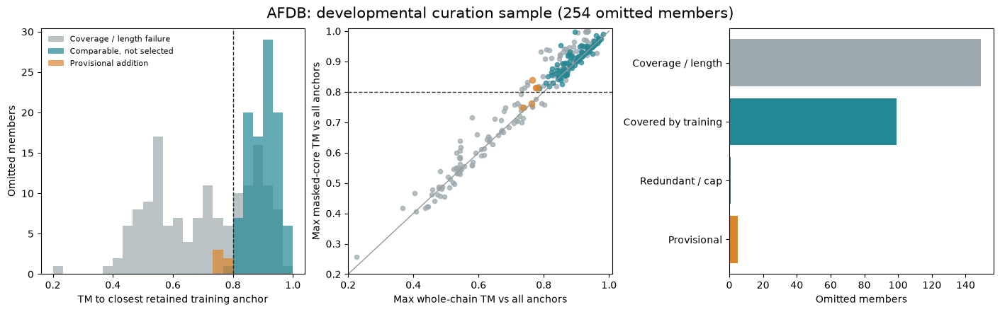
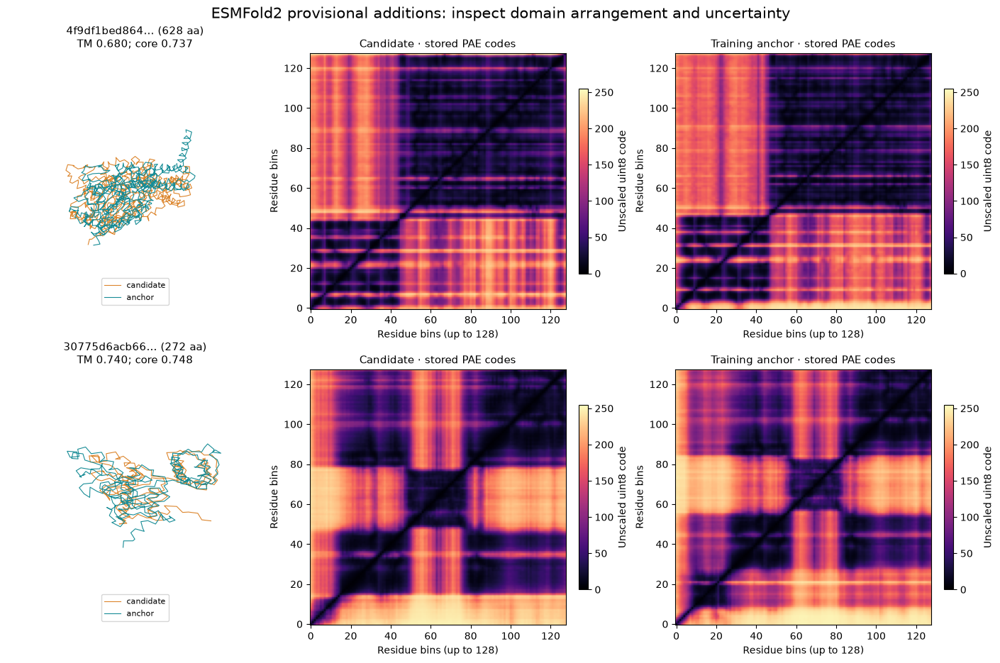

---
marinfold_experiment:
  issue: 292
  title: 'exp: expand AFDB and ESMFold2 training with structurally diverse cluster members'
  kind: models
  branch: exp/292-structural-cluster-diversity
---

# exp: expand AFDB and ESMFold2 training with structurally diverse cluster members

**Issue:** [#292](https://github.com/Open-Athena/MarinFold/issues/292) · **Kind:** `models` · **Branch:** `exp/292-structural-cluster-diversity`

## Question

Can we build a substantial, training-ready supplement by adding up to three quality-passing proteins from each original AFDB and ESMFold2 cluster, prioritizing credible structural diversity when a cluster contains it, and does the next full model trained with that supplement show useful prediction diversity?

## Hypothesis

Representative selection may discard informative structural variation among related proteins. Restoring a few complementary members per cluster could broaden the contact patterns the model learns and make additional samples more useful.

There are two distinct hypotheses: **better coverage of sequence–structure relationships** and **more useful alternative predictions for one sequence**. The first is plausible; the second does not follow automatically. Different homologs can have different preferred structures while each sequence still has a narrow conditional distribution. Each added sequence must retain its own structure label: never attach a homolog's contacts to the representative's sequence.

Low TM-score alone is insufficient evidence. Prediction errors, fragments, domain rearrangements and uncertain interdomain orientations can all produce apparent diversity. Develop the curation through small, visual inspections and filter revisions, then build a large corpus and include it the next time a full model is trained. The model readout should come from roughly a week of training at a fixed token budget chosen for the actual hardware. Short training runs are not a screening stage for this hypothesis.

## Background

The original selection policies differ substantially:

| Source | Original grouping and selection | What expansion would recover |
| --- | --- | --- |
| AFDB | `afdb-24M` retains AFDB v4 entries with both AFDB50 sequence IDs and Foldseek structural IDs. Exp53 selects up to five highest-pLDDT usable members per **structural** cluster, discarding clusters with fewer than three usable members. | Members omitted by confidence ranking, measured against **all retained training members**, not only the nominal representative. |
| ESMFold2 Atlas | Exp91 clusters 163,144,153 filtered sequences with MMseqs2 Linclust at 40% identity and selects one representative per cluster, ordered by length then pLDDT standard deviation. Exp139 converts these to contacts-v1. | Non-representatives of the original sequence clusters, whose structural diversity was not an explicit selection criterion. |

Sources: [AFDB dataset card](https://huggingface.co/datasets/timodonnell/afdb-24M/blob/main/README.md), [exp53 selection](https://github.com/Open-Athena/MarinFold/blob/main/experiments/exp53_data_contacts_v1_zephyr/selection.py), [exp91 production record](https://github.com/jsilter/MarinFold/blob/exp/91-evals-esmfold2-atlas/experiments/exp91_evals_esmfold2_atlas/STATUS.md), [exp91 pipeline](https://github.com/jsilter/MarinFold/blob/exp/91-evals-esmfold2-atlas/experiments/exp91_evals_esmfold2_atlas/pipeline.py), [exp139](https://github.com/Open-Athena/MarinFold/issues/139). The Atlas dataset card's phrase “structural cluster” is misleading: the production code uses sequence clustering.

AFDB structural clusters are not defined by a strict all-pairs TM-score bound. The original clustering study reports median member-to-representative TM-score around 0.71, so meaningful within-cluster variation is plausible even there. [Barrio-Hernandez et al., 2023](https://www.nature.com/articles/s41586-023-06510-w).

[Exp225](https://github.com/Open-Athena/MarinFold/issues/225) subsequently published sequence-decontaminated corpora containing 3,963,003 AFDB and 65,553,178 ESM documents. Those current training manifests—not the original representative lists alone—define what is already included. [Exp277](https://github.com/Open-Athena/MarinFold/issues/277) adds ProteinMPNN sequences on existing backbones; this proposal instead adds backbone/contact variation. It also complements [exp278's generated backbones](https://github.com/Open-Athena/MarinFold/issues/278) and [exp281's multi-hypothesis training](https://github.com/Open-Athena/MarinFold/issues/281), without changing the document format in the first comparison.

Evidence that altered AlphaFold sampling can recover conformational variation motivates evaluating alternatives, but does not establish that homolog expansion will do so: [MSA-subsampled AlphaFold2 study](https://www.nature.com/articles/s41467-024-46715-9).

## Approach

### 1. Recover the original membership and freeze provenance

**AFDB:** Start with omitted members already present in `afdb-24M`, using its `struct_cluster_id`, `seq_cluster_id`, `split`, and structure pointers. The original maps are version 3 files `7-AFDB50-repId_memId.tsv.gz` and `5-allmembers-repId-entryId-cluFlag-taxId.tsv.gz`, using `cluFlag=2`, as recorded in [contactdoc](https://github.com/timodonnell/contactdoc/blob/main/README.md). Handle bare UniProt accessions versus AFDB entry IDs explicitly. Preserve structural-cluster train/validation/test assignments. Searching AFDB50 members excluded from the 24M curation is a later expansion, with its own quality and split audit.

**ESMFold2:** Exp91 records both `clu_cluster.tsv` and `cluster_map.csv` at `s3://marinfold-exp91-usw2/exp91/out/`, each approximately 10.8 GB. These contain the full membership, whereas the public `selected_manifest.parquet` contains selected representatives only. Verify present access and object metadata; process **one** membership representation in AWS us-west-2 and save a compact subset/index there. Recover candidate structures from the pinned Atlas v1 `s3://esm-protein-atlas/v1/folds/folds_1B.lance` using exp91's decoder and indexed retrieval where available. Do not assume the representative-only HF export contains their neighbors.

The original membership and materialization-plan objects were live-verified on 2026-09-14. The first us-west-2 curation job streamed all 163,144,153 membership rows and checked sampled cluster cardinalities against the original plan. A fresh clustering of a changed Atlas snapshot would not be the same experiment. Record the original input snapshot, MMseqs version, identity/coverage settings and representative mapping; a Linclust cluster does not imply every pair of members meets the identity threshold.

Build a manifest of every native backbone in the baseline training corpus, including backbone lineage through any MPNN derivatives. Identify additions by structure/sequence provenance, not just a new accession. Remove duplicate records; retain genuinely validated same-sequence alternative structures as explicit alternate labels rather than silently collapsing them.

### 2. Develop the curation through visual inspection

Begin with a browsable gallery of approximately **100 candidate/anchor pairs**, balanced across sources, cluster sizes and divergence bins. Show the original representative, existing training members and proposed additions through synchronized 3D views and overlays colored by pLDDT, alongside contact maps, pairwise TM-score matrices, sequence identity, alignment coverage and length. Include accepted, rejected and borderline examples so the gallery reveals what the filters are discarding as well as admitting.

Use these inspections to revise confidence, TM-score, coverage, domain-comparability and per-cluster selection rules. Record what changed and why, then inspect fresh examples under the revised rules. This is intentionally exploratory curation; the first proposed thresholds are not locked before seeing structures. Validate the revised policy on a fresh sample before applying it at scale.

For yield and throughput estimates, expand to approximately **1,000 training clusters per source, up to 32 omitted candidates per cluster**—at most 64,000 new structures, plus existing anchors. Sample clusters across size and representative-length bins. Include a reproducible random candidate component and a sequence-spread component; report the sampling policy and cluster inclusion weights. Keep AFDB and ESM results separate. These sample sizes limit curation development work, not the final corpus.

Use metadata first, fetching structures only for shortlisted candidates. Starting quality/comparability rules to investigate visually:

- Single-chain, sequence/coordinates consistent, complete enough for contacts-v1, length 60–1,000 in this initial bounded audit. Report excluded long AFDB proteins separately.
- Mean pLDDT at least 80/100; normalize Atlas metadata's 0–1 scale explicitly. Retain ESM's original pTM floor of 0.5. These are selection heuristics, not proof of correctness.
- For full-chain comparisons, length ratio at least 0.8 and alignment coverage at least 80% of **each** chain. Analyze fragment/domain-architecture cases separately rather than letting them dominate the main arm.
- Measure whole-chain TM-score and repeat the analysis over aligned confident residues, requiring a substantial confident core in both proteins. Record mask size and normalization length so trimming cannot manufacture a favorable score. Use domain-level comparisons and PAE when available to flag uncertain domain orientation; high local pLDDT alone does not validate domain packing.

Use Foldseek for inexpensive screening when helpful, then explicit pairwise [US-align/TM-align](https://github.com/pylelab/USalign) on shortlisted pairs. A missing Foldseek hit is **not** a TM-score of zero. Save both chain-normalized TM-scores, alignment coverage and residue mappings. Define symmetric similarity conservatively as `T(a,b) = max(TM normalized by a, TM normalized by b)`; both normalizations must therefore be low for a pair to count as diverse.

For a cluster, initialize `S` with **every existing training member** and maintain separate comparisons to the original cluster representative, which may differ from the selected training representative. Greedily add the eligible candidate maximizing `min(s in S)[1 - T(candidate,s)]`, then update `S`. Start with at most **three additions per cluster**, revisiting this cap if inspections show additional coherent modes. Initial admission threshold: `max(s in S) T(candidate,s) <= 0.80`, comparing yield and visual quality at 0.70 and 0.90. These are candidate operating thresholds, not established biological boundaries; finalize them from curation evidence before production selection and training.

Require novelty relative to the existing set and previously selected additions; distance from the nominal representative alone can select several copies of the same alternative. Record cases that are diverse only in member-to-member comparisons separately. Flag TM < 0.5 for closer inspection rather than automatically treating the most extreme outliers as best.

Compute aligned contact-map differences and local structural similarity as corroborating diagnostics. Stratify sequence identity to the representative and nearest selected member (including ≥80% identity cases), confident-core size, domain architecture and source. Differences in pyconfind contacts across homologs can reflect amino-acid changes, so corroborate large effects with backbone geometry. Search selected additions against existing training structures to distinguish within-cluster novelty from genuinely new corpus coverage.

Label inspected examples as credible backbone change, domain rearrangement, fragment/alignment artifact, low-confidence region, or unresolved prediction disagreement. Experimental support and independent predictions on a small ambiguous subset are useful checks; predictor agreement is supporting evidence, not experimental validation. No blanket refolding of the corpus.

Deliver the gallery, a versioned filter configuration, yield and artifact-rate estimates on fresh examples, and measured bytes/CPU time/cost per accepted addition. Extrapolate accepted structures and contact-document tokens across the eligible source populations, with uncertainty. A low per-cluster yield can still supply millions of useful examples at this scale; assess the absolute recoverable corpus rather than requiring an arbitrary percentage of clusters to pass. Continue curation until the accepted examples make structural sense and the production estimate supports a substantial training comparison.

### 3. Build one production-scale expansion corpus

After the curation policy is established, scan the eligible original clusters at production scale. A planning target is **10–30 million accepted additional sequence–structure pairs**, subject to measured structural quality and recoverable yield. This is an ambition, not a claim that this many qualifying alternatives exist. Preserve originals and publish the new data as a versioned supplement. A source-specific expansion is valid if only one source supplies useful diversity; record its scope explicitly.

Size the corpus in **unique structures and usable training tokens**, jointly with the training budget and supplement fraction. For non-padding training exposure `T`, supplement-token fraction `f` and supplement size `U` tokens, report effective supplement exposure `f*T/U`. Aim initially for approximately **2–5 effective passes** over the new corpus during the full run. For example, 500B non-padding training tokens with a 10% supplement and 10B unique supplement tokens gives five passes. Ten million additions at an assumed 1,000 tokens each would supply that 10B; replace the assumption with measured document lengths and packing utilization before launch. A few tens of thousands of additions repeatedly sampled for a week would not meet this design.

Use source-local metadata scans, batched structure retrieval and bounded candidate-to-anchor comparisons. The production reservoir is eight deterministically sampled omitted members per cluster: the completed ESM audit shows that this retains approximately 92–95% of the weighted structural hits found by inspecting 32 while substantially reducing coordinate reads. Avoid all-pairs alignment over entire large clusters. Publish which members were inspected so search coverage and missed diversity remain interpretable.

If the measured yield is too small, revisit candidate coverage and the biologically defensible curation rules, and revise the corpus/mixing design explicitly. Do not dilute quality to hit a row count or substitute a tiny training run for the planned scientific comparison.

For every selected addition, apply exp225's production sequence exclusion rule against its full reference: ≥30% identity over ≥50% of the shorter sequence, covering the legacy evaluation proteins and all FoldBench protein chains. Re-run this against **every candidate**, even when its representative survived. Do not resurrect excluded clusters through another representative. Preserve original AFDB splits; Atlas's constant `train` field is not a holdout guarantee. Deduplicate and check leakage across both sources and all descendants used for training.

For each eligible cluster, apply the integrity, quality and sequence-exclusion rules first. Select strict structural-diversity candidates before fillers, checking each proposed addition against all current anchors and earlier additions. A strict candidate currently requires both whole-chain and confident-core symmetric TM-score at most 0.8, at least 80% alignment coverage of both chains and a length ratio of at least 0.8. If fewer than three such candidates exist, fill the remaining slots with the best quality-passing members by deterministic confidence, length-match, sequence-identity and ID ordering. Clusters with fewer than three viable omitted members contribute all of them. Preserve the continuous structural scores and label every addition `structural_diversity` or `quality_fill`.

Generate ordinary contacts-v1 documents through the existing generator and pyconfind settings, preserving each member's own sequence and structure. Publish one versioned supplement and its manifest. There is no matched random-control corpus in this experiment.

### 4. Include the supplement in the next full model

Include the supplement in the next **1.5B full training run**, using the established exp232/exp277 architecture, tokenizer, packing and augmentation recipe. Preserve the existing native/redesigned mixture within the nonsupplement component. New additions are native sequence–structure pairs in this experiment; redesigning them is a separate change.

Budget for **roughly one week on the chosen training allocation**, expressed before launch as a fixed, substantial token count. A working planning point is **500B model-input tokens**, about 477,000 optimizer steps at sequence length 8,192 and global batch 128. Set the exact integer step count and schedule from the final token budget. [Exp277's recorded full run](https://github.com/Open-Athena/MarinFold/blob/main/experiments/exp277_models_single_mpnn_pilot/README.md) provides a scale reference: 266,345 steps took about 73 hours end to end on 128 H100s, so a budget of this order is approximately week-scale on that setup. This is a planning estimate, not a hardware reservation or throughput guarantee.

Use the established full-training optimizer recipe (initial reference: exp232 m2-p06's LR 0.001, weight decay 0.2, and exp277's WSD schedule with 10% warmup, 20% decay and 0.1 minimum LR ratio), scaled to the agreed full horizon. Choose the supplement fraction from the materialized unique-token count, aiming for approximately two to five effective passes, and report padding, contact tokens, source shares, unique proteins and effective epochs.

Infrastructure checks may establish that data loads and training runs, but their metrics do not decide whether the scientific hypothesis proceeds. Evaluate useful diversity at a few prespecified token milestones and at the final checkpoint after cooldown; an early flat or negative curve is not an efficacy stopping rule. This experiment will describe the resulting model and compare it with relevant historical runs, but without a matched control it will not claim that structural prioritization alone caused any change.

### 5. Evaluate useful diversity and accuracy separately

Use **eval-val (97 natural proteins)** for training curves and report **eval-denovo (19)** separately. Reserve eval-test for the completed, settled comparison under exp245's recorded-read policy; no routine milestone read. Respect that boundary when reporting viral/low-MSA strata. Rebuild a sequence-KNN control against the corpus actually used, including additions, for generalization claims.

Accuracy uses exp82/exp89's existing rollout-and-resample recipe: 100 fresh document realizations per protein, temperature 1.0, top-p 0.95, top-k disabled, `6L+128` output budget, canonical residue coordinates and live-contact frequency voting. Report macro R-precision (all and long-range) and paired uncertainty. Keep the candidate universe and reference contact definitions fixed. AUC is a within-MarinFold diagnostic.

Retain individual sampled contact sets, not just their vote matrix. Compute diversity after canonicalization and duplicate-contact removal: different statement orders, N-terminus choices or position labels are not distinct structural hypotheses. Use matched seeds and nested sample budgets N = 1, 4, 16, 100; also report generated tokens and wall time. A fixed-prompt diagnostic separates decoding variability from prompt-resampling effects.

Use **oracle F1@16 minus mean single-sample F1** as the primary useful-diversity readout. Oracle F1 is the best reference-contact F1 among 16 samples; average over deterministic subsets of the saved 100. It measures available useful alternatives, not a deployable selection method. Report absolute oracle F1, mean single-sample precision/recall/F1, and voted accuracy alongside the gap: worsening single samples must not be credited as a diversity gain.

Supporting diagnostics: canonical unique-set fraction, pairwise contact Jaccard distance, contact-count distributions, true-contact union coverage **with its false-positive cost**, and accuracy-versus-sample-budget curves. Compare diversity at similar contact counts/accuracy. All-pairs disagreement or union recall alone can be increased by bad predictions. Bootstrap proteins (or homologous groups), not rollouts, and show each training seed's effect.

Contacts-v1 outputs contact sets, so TM-score is a **data-selection** metric here. Do not report TM-score between model predictions unless a validated coordinate-reconstruction stage is explicitly added.

If the intended claim is specifically “more conformational states for the same protein,” curate a separate frozen benchmark with multiple experimentally supported structures for the same sequence and distinct contacts. Audit every state for leakage against the complete training corpus and its MPNN lineage; exclude overlaps before training. Any historical checkpoint used for comparison has its own exposure history and cannot be made held out retrospectively. Measure coverage of state-specific contacts and recovery of coherent states, not their incompatible union. If no adequately independent benchmark is available, limit the conclusion to useful contact-hypothesis diversity.

## Success criteria

- **Curation quality:** recover verifiable original membership, preserve provenance/splits, document visual filter revisions, and report accepted-example quality on fresh inspection samples with measured cost per retained member.
- **Meaningful scale:** produce up to three additions per eligible cluster, report the exact unique-pair and unique-token counts, and justify the supplement fraction against the next full training horizon. The model readout comes after roughly week-scale training, not from short runs.
- **Corpus integrity:** every row passes source/sequence/coordinate checks and the frozen held-out sequence exclusion, has no cross-source duplicate, preserves original cluster/split lineage, and contains contacts generated from its own structure.
- **Useful diversity:** report oracle-F1@16 gain over mean single-sample F1, absolute oracle F1, unique contact-set fraction and pairwise contact distance for the next full model, with paired protein-level uncertainty and historical context.
- **Accuracy retention:** report mean single-sample F1 and voted macro R-precision, including long-range accuracy. More disagreement accompanied by degraded accuracy is not useful diversity.
- **Interpretation:** without a matched control, changes observed in the next model are associated with the full training change and cannot isolate the causal effect of structural prioritization. Single-sequence conformational claims additionally require the multi-state benchmark.

Curation thresholds may change during visual exploration; freeze the production filters, corpus manifests, full-training settings, evaluation endpoints, subset seeds and checkpoint-selection rule before training. Report confidence intervals and inconclusive outcomes rather than adjusting thresholds to model results. With one full training run, paired protein intervals quantify evaluation-set uncertainty, not training-seed variance; state that limitation without withholding the readout.

## Results

Curation is in progress. Production planning has started; no training run has been launched.

The corrected AFDB development sample (`data/afdb-gallery-v2`, seed 292) contains **36 clusters, 174 retained training anchors and 254 omitted candidates**. All 428 original AFDB v4 structures were fetched and validated, with 2,387 within-cluster comparisons. The metadata census includes 24,009,002 rows; the anchor index minus exp225's AFDB exclusion list reproduces the 3,963,003 current training anchors. Previously removed members and held-out clusters cannot re-enter as candidates.

| Initial whole-chain rule | Omitted candidates |
| --- | ---: |
| Coverage or length mismatch | 149 |
| Already covered by a retained training anchor | 99 |
| Redundant with a selected addition or cluster cap | 1 |
| Provisional additions | **5** |

This is a deliberately stratified development sample, not an unbiased yield estimate. It samples up to eight candidates per cluster; the next audit must sample more clusters and members before estimating production yield.

**Visual/core audit:** two provisional additions, `AF-A0A7W6ECL7-F1` and `AF-A0A226ELZ6-F1`, retain max core TM of 0.748 and 0.761 against every current anchor. Their source predictions have mean pLDDT 92.8 and 93.6 and show distributed backbone/contact differences. Correctness and domain arrangement still require follow-up. The other three reach core TM 0.814–0.840 against at least one anchor, despite lower core TM against the whole-chain nearest anchor. This motivates comparing confident cores against **all** anchors and selected additions, and keeping a separate borderline stratum. The current core diagnostic independently masks residues with pLDDT ≥70 in each chain; it is not yet the final aligned-core/domain policy. See `data/afdb-gallery-v2/visual_reviews.csv` for the inspection record; these are agent assessments, not human approvals or evidence of alternative states for one sequence.

**Scale constraint:** the metadata-first AFDB census finds 14,056,447 eligible omitted members in 332,786 clusters with retained anchors. The exact sum of `min(3, eligible omitted members)` is **884,528** additions before final sequence exclusion. The earlier 998,358 figure was only three times the cluster count and incorrectly assumed every cluster had three candidates.

**ESMFold2 execution:** `i-07272b20c6d092f48`, one `m7i.4xlarge` in `us-west-2a`, processed 29 development clusters from original materialization plan chunk 00000. Its 390 omitted members are paired with representatives explicitly present in exp225's current shard 00000. The selected training representative can differ from the Linclust cluster ID; both identities are preserved. The source membership object is 10,767,514,098 bytes and stayed in-region; its complete scan took 202.2 seconds. Indexed Atlas v1/version-3 retrieval validated all 419 requested hashes and independent sequence/blob agreement, retaining 346 structures after the provisional quality filters. The job completed in 503 seconds, measured 3,408 pairs and found two provisional additions among 317 quality-passing omitted members. All outputs were saved, and the instance terminated. Both hits retain core TM below 0.8; neither is cleared for training. Working artifacts and logs: `s3://marinfold-exp91-usw2/exp292/audits/exp292-esm-gallery-v1/`.

**Domain audit changes the interpretation again:** the 628-residue ESM candidate `4f9df1bed864464b1a317911137bed5b` has whole-chain TM 0.680 and core TM 0.737, but manual crops suggested by its PAE block pattern give domain TM 0.908 and 0.951. Its apparent diversity is largely domain arrangement, and the source PAE pattern shows interdomain uncertainty. The second hit combines length, loop and domain differences. Both remain in the review stratum. Crop boundaries and measurements are committed in `domain_probes.json` and `domain_probe_metrics.csv`; these are exploratory crops, not validated domain annotations. Atlas PAE arrays are stored as uint8 codes; the inspection plot uses unscaled codes because physical-unit decoding is not yet verified. No angstrom PAE cutoff has been applied.

**Broader audit:** initial attempt `i-0a7e2285337d52aef` stopped on a length-integrity assertion and terminated. The corrected attempt `i-0df2f5e2ea0587db5`, one `m7i.8xlarge` in us-west-2a, completed an audit of **919 fresh clusters with up to 14,284 omitted members**, using 24 alignment workers and four bounded indexed-fetch threads. Seed 293 samples 100 current-corpus shards, excluding development shard 00000, then stratifies their 1,963,845 current training anchors by length and original cluster size. `data/esm-audit-919-v1/` and `data/esm-audit-919-v2/` record launch and sampling provenance. Physical shard numbers are not a reliable join to the original materialization plans (an attempted join failed at shard 2995); the broader audit instead reads the original cluster ID and actual retained anchor directly from current training metadata, then checks both against the full original membership. This prevents comparing against an unrelated representative after shard reordering. Working results: `s3://marinfold-exp91-usw2/exp292/audits/exp292-esm-audit-919-v2/results/`.

The failed anchor had 128 source residues including one `X`, versus 127 residues in its training metadata. A metadata-only Atlas check of all 919 anchors found exactly three such noncanonical cases; all other source/training lengths match. The revised policy excludes noncanonical candidates and whole clusters whose anchor contains a noncanonical residue, recording every exclusion. Canonical length mismatches still raise. The small ESM gallery also contains one such anchor cluster, recorded in `revised_policy_exclusions.csv`; neither provisional hit belongs to it. This correction keeps unknown-residue mapping differences from masquerading as backbone novelty.

**Preliminary sequence screen:** all 571 initial omitted candidates were searched against 1,823 unique sequences from exp225's 554-protein plus all-FoldBench reference. The ≥30% identity / ≥50% shorter-sequence coverage rule flags 60 candidates (29 AFDB, 31 ESM); none of the seven whole-chain provisional hits is flagged. An exact, canonical-sequence positive control passed. Inputs, MMseqs version, reporting ceiling and results are under `data/sequence-screen-initial/`. This uses a small target database, so its E-values and weak-hit reporting differ from the original 70M-target search; repeat the screen against the final candidate pool and frozen reference before making production decontamination claims.

**Broader AFDB audit launched:** [/bizon/exp292-afdb-audit-1008-v1](https://iris.oa.dev/#/job/%2Fbizon%2Fexp292-afdb-audit-1008-v1) samples 1,008 fresh clusters, all 4,845 retained anchors and up to 19,201 omitted members. Seed 293 gives no overlap with the 36 development clusters. A 32-CPU preemptible worker is pinned to us-central1-a, with results at `gs://marin-us-central1/protein-structure/MarinFold/exp292/afdb-audit-1008-v1/`; the input manifests are staged under its `inputs/` prefix. `run_afdb_audit.py` parses the original mmCIFs in memory, preserves validated C-alpha arrays and measurements, and publishes completion last. `data/afdb-audit-1008-v1/launch.json` records the exact source hashes, resources and client version. The initial local Iris client was rejected as too old; submission succeeded with an isolated, pinned current client and the upstream current cluster configuration. No shared cluster changes were made.

**Threshold sensitivity in the initial galleries:** `summarize_yield.py` reuses the measured pairs at TM cutoffs 0.7, 0.8 and 0.9. AFDB yields 0, 5 and 40 whole-chain additions, or 0, 2 and 32 when both whole-chain and core TM must pass. ESM yields 1, 2 and 13 whole-chain additions, or 0, 2 and 8 with the core diagnostic. Each setting reruns greedy selection against all anchors and prior additions; it does not simply filter the original chosen set. These counts use the historical development samples, before final sequence exclusion and domain review. They motivate the broader audits, not a production-size estimate. Per-stratum counts and selected IDs are saved in each gallery's `sensitivity/` directory.

**Broader ESM audit completed:** the corrected run finished successfully in 4,813 seconds. It retained 12,979 structures, including 12,063 omitted candidates in 916 clusters after excluding three noncanonical-anchor clusters, and measured 146,433 pairs. The whole-chain TM ≤0.8 rule chooses 49 additions in 35 clusters; rerunning selection with both whole-chain and core TM ≤0.8 chooses 32 additions in 22 clusters. These remain provisional.

`estimate_esm_population.py` validates the exact 100 frozen shard projections and estimates 8.17M eligible ESM clusters with 31.92M omitted members. Together with the AFDB census's 14.06M omitted members, the current search pools contain roughly 46M candidates before candidate-level structural selection and final exclusions. The ESM frame excludes anchors below pLDDT 80, lengths outside 60–1000 and clusters larger than 100,000. Its maximum capacity at three additions per cluster is approximately 15.72M; AFDB's ceiling is less than 1M. These ceilings are not forecasts of structurally useful additions.

Weighting each audit stratum by its estimated population gives the following ESM-only projections for inspecting up to 32 omitted members and retaining up to three per cluster:

| Maximum TM | Whole-chain criterion | Whole-chain plus core diagnostic |
| --- | ---: | ---: |
| 0.7 | ~41,000 | ~9,000 |
| 0.8 | ~167,000 | ~90,000 |
| 0.9 | ~2,201,000 | ~760,000 |

These are point estimates with substantial sampling uncertainty, especially where a populous stratum has few observed hits. They are not confidence bounds or training-cleared corpus sizes: domain review, final sequence exclusion and cross-source deduplication remain. The independent core mask is still diagnostic. Inspecting 32 members covers an estimated 28.68M of the 31.92M omitted ESM members in this frame, so inspecting more members of large clusters alone is unlikely to bridge the gap to 10–30M accepted additions. The original 10–30M goal is aspirational; the current evidence supports planning around a smaller expansion or explicitly revising candidate eligibility and the curation criterion. The full training horizon remains unchanged; its supplement fraction needs to match the eventual unique-token count.

The larger AFDB audit has experienced preemptions and has not produced a final yield estimate yet. The ESM projections and source/output checksums are under `data/esm-audit-919-v2/`; full measured inputs are published with that audit in the public HF bucket.

### Production build (in progress)

Curation development is closed and the frozen policy now lives in `production_policy.py`. Both sources are being materialized against it. Nothing below is a training-cleared corpus: contact-document generation and cross-source deduplication remain.

**ESMFold2 production plan.** The canonical plan is `s3://marinfold-exp91-usw2/exp292/production-v1/esm/plan-v5/`, built from the original membership (`exp91/out/clu_cluster.tsv`), the selected manifest (`exp91/out/selected_manifest.csv`) and pinned Atlas `s3://esm-protein-atlas/v1/folds/folds_1B.lance` version 3. It covers **8,181,677 eligible clusters** holding 31,772,919 eligible omitted members, from which the eight-per-cluster reservoir draws **22,567,967 candidate rows**; the arithmetic ceiling before candidate quality filtering is 15,743,361 additions. Seventy-eight clusters with malformed membership cardinality were excluded and recorded in `cardinality_mismatches.parquet`. The plan is 821,689,307 bytes over 3,768 parquets.

**ESMFold2 locator.** `s3://marinfold-exp91-usw2/exp292/production-v1/esm/locator/` pins every planned protein to an exact Atlas row. Sixteen scan workers read all 1,095,530,880 Atlas rows in 1,045 seconds and found every requested row: `wanted_rows = located_rows = distinct_hashes = 30,749,644`, written as 511 parquets (1,265,029,472 bytes). The instance self-terminated.

**AFDB production plan.** `gs://marin-us-central1/protein-structure/MarinFold/exp292/production-v1/afdb/plan-compact-v2/` covers **335,963 eligible clusters** with 1,627,731 retained training anchors and 1,898,964 reservoir candidates drawn from 14,085,940 eligible omitted members; the ceiling before sequence filtering is 891,442 additions. The compact rebuild writes one parquet per hash partition (256 files, 140,893,494 bytes) instead of 2,980 small ones, which both removes a gcsfs ranged-read HTTP 416 failure on tiny objects and preserves cluster locality: the partition key is `md5(struct_cluster_id || ':292')`, so every anchor and candidate of a cluster lands in the same shard and no downstream stage needs a cross-shard join. `plan-compact-v2.json` records the source hashes.

**AFDB source validation is complete.** [/bizon/exp292-afdb-validate-v1](https://iris.oa.dev/#/job/%2Fbizon%2Fexp292-afdb-validate-v1) re-fetched and re-validated every planned AFDB v4 mmCIF with 256 single-CPU preemptible workers pinned to us-central1 at batch priority. Source objects, workers and output were all in-region. It wrote **3,526,695 rows — exactly the planned 1,627,731 anchors plus 1,898,964 candidates, with no drops — across 256 parquets (10,985,016,132 bytes) in about five minutes** to `.../production-v1/afdb/validated/`. Every row carries its own sequence, C-alpha coordinates, per-residue pLDDT, noncanonical-residue count, source byte count and source SHA-256, so the curation stage never reads AFDB again. A 100-row smoke (`fetch-smoke100-v3`) preceded it; two earlier smokes failed first on an Iris Python 3.13 selection that could not build `tmtools` (fixed by pinning `requires-python = ">=3.12,<3.13"`) and then on the ranged-read bug above.

**Both ESM production stages are validated on real data.** A metadata smoke over 100 clusters of shard 00 (`exp292-esm-metadata-smoke-v1`) resolved 392 located rows into 330 quality-passing rows and 62 rejections, all `candidate_plddt`. The frozen screen excluded 19 candidates and its exact-sequence positive control passed. Of the 100 clusters, 57 had at most three survivors and were selected directly (86 additions), 22 retained a genuine choice and were queued, and 21 had no surviving candidate. Every located row reconciles to a recorded outcome. The structural smoke (`exp292-esm-structures-smoke-v1`) then ranked those 22 clusters, measuring **125 candidate-to-selected pairs instead of the 442 an all-pairs matrix would need** and returning exactly three additions per cluster.

That structural smoke is also the clearest demonstration of what the strict rule is for: **ten of the 125 measured pairs had whole-chain TM ≤ 0.8, and none of them survived the confident-core and coverage requirements**, so the shard produced 66 `quality_fill` additions and zero `structural_diversity` additions. That is the expected rate — the 919-cluster audit found strict hits in roughly 2% of clusters — and it is why the production policy fills the remaining slots rather than requiring strict diversity.

**AFDB curation is implemented.** `curate_afdb.py` and `curate_afdb_cli.py` apply the same frozen policy to the validated shards: cluster-wise quality filtering, the frozen held-out sequence exclusion, then structural-first three-slot selection over the stored C-alpha arrays, measuring only candidate-to-anchor and candidate-to-addition pairs. Because the exclusion rule has no E-value arm, a per-shard search returns the same verdict as one global search, so the screen runs inside each task rather than as a separate global stage. The frozen MMseqs2 archive and both reference FASTAs were mirrored byte-identically (verified by SHA-256) into `.../production-v1/tools/` and `.../production-v1/reference/` in us-central1, and are staged and hash-checked once per worker. `sequence_exclusion.py` now holds the one implementation of that rule, shared by both sources.

**The AFDB arm is complete.** [/bizon/exp292-afdb-curate-v2](https://iris.oa.dev/#/job/%2Fbizon%2Fexp292-afdb-curate-v2) curated all 256 validated shards under the frozen policy, 256/256 tasks succeeding with none failed:

| | total |
| --- | ---: |
| rows consumed | 3,526,695 |
| quality rejections | 0 |
| held-out sequence rejections | 209,849 |
| clusters with a genuine choice | 328,969 |
| clusters needing alignment | 221,468 |
| measured pairs | 7,536,214 |
| **additions** | **861,425** |
| — `structural_diversity` | 34,903 (4.05%) |
| — `quality_fill` | 826,522 |

It consumed **3,526,695 rows, matching the validated corpus exactly**, and the manifest row count matches the summaries exactly as well. Every shard's exact-sequence positive control passed, every shard reported the same frozen MMseqs2 version, and every shard recorded the same two reference SHA-256s. The 861,425 additions are 96.6% of the 891,442 arithmetic ceiling, so quality attrition costs AFDB little: its ceiling is set by cluster count, not by filtering. Alignment cost 1,337 CPU-hours.

Manifests are at `.../production-v1/afdb/selected/` with per-shard provenance — measured pairs, rejections and accounting — at `.../production-v1/afdb/selection-provenance/`.

**A schema defect worth recording.** The first manifests let pyarrow infer each shard's schema from the rows it happened to contain. Names and types agreed everywhere, but the two selection paths build their row dicts in different orders, so field *order* varied across shards: `pyarrow.dataset` read the set fine while a plain `pa.concat_tables` refused it. A defect that only the less-common reader hits is exactly the kind that ships. `curate_afdb` now emits a fixed field order, and `normalize_manifests.py` rewrote the published corpus under one explicit schema — 256 files, one schema, 861,425 rows, concatenable without promotion options. Values were not touched and the row count was verified per shard.

**The ESM metadata stage is complete.** All 256 shards finished, every instance exiting zero with its exact-sequence positive control passing, for **21.0 m7i.4xlarge instance-hours** (median 301 s per shard):

| | total |
| --- | ---: |
| located rows | 30,749,644 |
| quality-passing | 26,444,640 |
| quality rejections | 4,305,004 |
| held-out sequence rejections | 951,318 |
| **selected without alignment** | **8,056,414** |
| clusters queued for structural ranking | 1,604,845 |

The reconciliation is exact rather than approximate: the stage consumed **30,749,644 located rows, matching the locator's own count with zero difference**, so the plan, the locator and the curator all agree on which rows exist. The queued clusters contribute three additions each, so the ESM arm yields **8,056,414 + 4,814,535 = 12,870,949 additions**. With AFDB's ~851,000 the supplement lands at **roughly 13.7M sequence–structure pairs before cross-source deduplication**, inside the original 10–30M planning range.

Note what the two arms do *not* share. ESM contributes volume: 8.06M of its additions are decided on metadata alone, because most of its clusters hold at most three surviving candidates and so offer no choice to make. AFDB contributes a higher strict-diversity rate — 3.8–4.4% of its additions clear the whole-chain *and* confident-core bound, against roughly 2% of clusters in the ESM audits. A source-specific reading of the final corpus is therefore warranted; the arms are not interchangeable.

**Account limit worth recording:** this AWS account allows 445 on-demand vCPUs in the `m7i` bucket, so only 27 16-vCPU workers can run at once. This bit twice. A 64-shard request failed mid-loop on the 28th instance and left the 27 already running with no launch record. The wave-draining replacement then failed too, because an instance keeps its vCPU reservation until it is *fully terminated*: counting only `pending` and `running` workers undercounts the ones still shutting down, so a wave sized against that count overshoots. The launcher now counts every quota-holding state, treats `VcpuLimitExceeded` as backpressure to retry rather than a fatal error, and persists each instance before requesting the next. Neither failure lost work — every shard that started finished, and the run resumes from the set of shards that already have a `summary.json`.

**Cluster limit worth recording:** the first 256-worker curation launch (`exp292-afdb-curate-v1`) failed in about ninety seconds, before doing any work, with `PermissionError: [Errno 13] Permission denied: .../bin/mmseqs`. The task pod mounts `/tmp` `noexec`, so the staged frozen binary unpacked and hash-verified correctly and then could not be executed. The identical extraction works in the ESM arm because that bootstrap unpacks to `/opt` on a plain EC2 host, so the failure only appears once the stage moves onto the cluster. Staging now resolves under the worker's own working directory and runs `mmseqs version` immediately after extraction, so a bad mount fails at staging time with an explicit message instead of several frames deep inside the screen. The trap is written up in the `zephyr-pipeline-performance` skill.

**ESM structural ranking is running** and is the last production stage. [`exp292-esm-structures-v1`](https://s3.console.aws.amazon.com/s3/buckets/marinfold-exp91-usw2) ranks the 1,604,845 queued clusters across 256 shards, drained 13 at a time because its 32-vCPU workers hit the same 445-vCPU account limit. The measured shape of a shard is **about 33 minutes fetching ~42,000 coordinate blobs from Atlas and about 4 minutes ranking**, so the stage is dominated by per-row fetch latency, not by alignment, and projects to roughly 13 hours. It is left running rather than restarted.

Its first completed shard confirms the stage works and sharpens the source comparison. It ranked 6,224 clusters into **18,672 additions — exactly three per cluster — measuring 36,605 pairs where an all-pairs matrix would have needed 127,511**, so the lazy candidate-to-selected policy avoids 71% of the alignment work. Of those 18,672 additions only **180 (0.96%) are `structural_diversity`**, against AFDB's 4.05%.

That gap matters for how the supplement is described. Extrapolated, strict structural additions are on the order of **80,000 out of ~13.7M** — well under 1%. The supplement is therefore overwhelmingly `quality_fill`: it adds cluster members that pass every integrity, confidence and decontamination rule, and only a small minority of them are demonstrably distinct folds. That is the expected consequence of the agreed policy, which prefers strict diversity but does not require it, and it is why the `selection_tier` label is carried on every row — a later analysis can weight, subset or ablate on it without regenerating anything.

Two levers would cut that materially next time, and neither needs more quota. The fetch is sequential `dataset.take` batches, so **making the Atlas fetch concurrent** attacks the actual bottleneck directly. Failing that, because the limit is on vCPUs rather than instances, **27 16-vCPU workers instead of 13 32-vCPU ones** buys roughly twice the aggregate fetch parallelism for the same quota, at the cost of halving the per-shard ranking width — a good trade when ranking is a tenth of the wall time. Neither was applied mid-flight.

The completed audit supports an eight-candidate production reservoir: depending on the TM criterion, it recovers approximately 92–95% of the population-weighted hits found with 32 candidates. Production selection still fills to three with quality-passing members when strict structural alternatives are unavailable. The supplement will be included in the next full 1.5B run; there is no control-corpus build or short model-efficacy screen.

The [public AFDB inspection bundle](https://huggingface.co/buckets/open-athena/MarinFold/tree/data/exp292/afdb-gallery-v2) contains the offline gallery, source C-alpha arrays, pair metrics and provenance. Download `index.html` and open it in a browser. The [ESMFold2 inspection bundle](https://huggingface.co/buckets/open-athena/MarinFold/tree/data/exp292/esm-gallery-v1) provides the corresponding ESM views and measurements. The galleries include candidates that pass, fail and sit near the provisional filters, plus synchronized confidence views, overlays, contact maps, all measured cluster pairs and exportable review notes.

Implementation entry points are `sample_afdb.py` (metadata selection), `structure_audit.py` (source validation and metrics), `production_policy.py` (structural-first three-slot selection), `sequence_exclusion.py` (the frozen held-out screen shared by both sources), `sample_esm.py` (region-guarded original-membership recovery and indexed Atlas decoding), `build_esm_plan.py` and `build_afdb_plan.py` (production cluster planning), `locate_esm_rows.py` (exact Atlas row pinning), `afdb_fetch_rows.py` with `afdb_fetch_cli.py` and `launch_afdb_fetch.py` (source-local AFDB validation on Iris), `curate_esm_metadata.py` with `curate_esm_structures.py` and `curate_afdb.py` with `curate_afdb_cli.py` (production selection), the bounded AWS launchers, `build_gallery.py`, `plot_audit.py`, and `publish_to_hf.py`. Dependencies are frozen in `uv.lock`.

## Conclusion

The original data can be recovered, the curation policy is frozen, and the production pipeline now runs at scale on both sources. Every planned AFDB structure has been re-fetched and re-validated — 3,526,695 rows, exactly the plan, no drops — and both ESM production stages reconcile every input row to a recorded outcome on real data.

The central curation finding has survived every enlargement of the sample: **whole-chain TM alone overstates structural novelty**. Confident-core coverage by a different retained member, or simply low alignment coverage, explains most apparent hits — ten of 125 measured pairs in the latest structural smoke cleared whole-chain TM ≤ 0.8 and none survived the core and coverage requirements. Strict structural additions are therefore rare (roughly 2% of clusters in the 919-cluster audit), which is why the agreed policy prefers them but fills the remaining slots with quality-passing members instead of demanding them.

Outstanding: the AFDB and ESM curation fleet runs, contact-document generation from each selected member's own structure, cross-source deduplication of the compact manifests, and inclusion in the next full 1.5B run. No candidate is training-cleared. Because there is no matched control corpus, the next model's results will be associated with the whole training change and cannot isolate the causal effect of structural prioritization.

Source attribution: AFDB v4 structure data are from Google DeepMind and EMBL-EBI under CC BY 4.0. ESMFold2 structures and adapted arrays are from Biohub ESM Atlas v1 under [CC BY-SA 4.0](https://registry.opendata.aws/biohub-esm-atlas/), accessed 2026-09-14. The bundled 3Dmol viewer has its separate BSD license.
