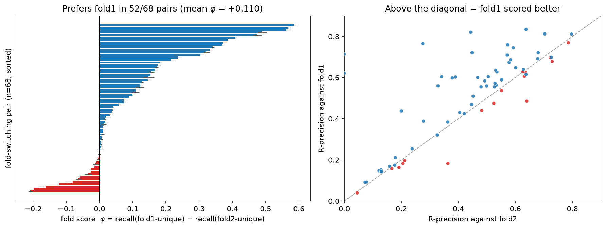
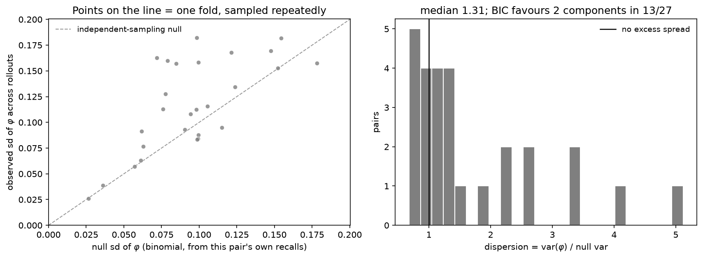
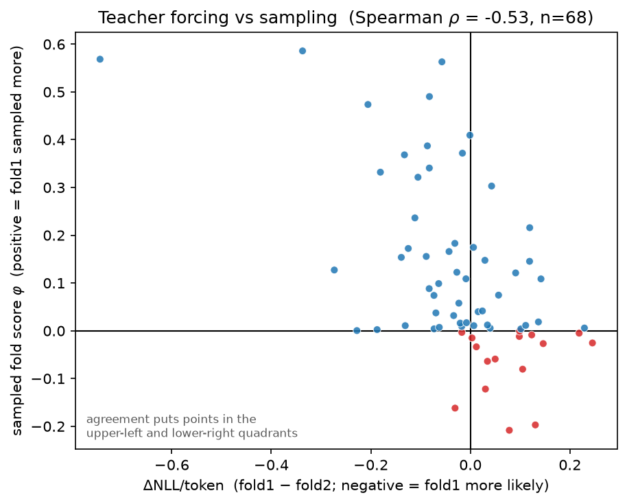
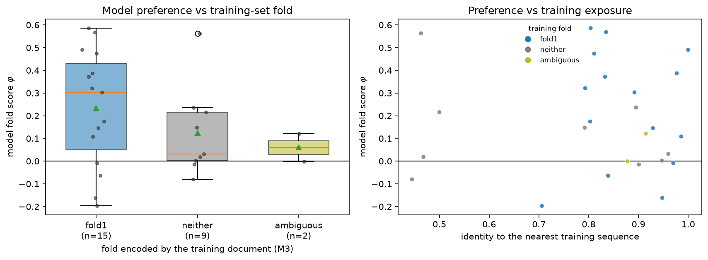

---
marinfold_experiment:
  issue: 301
  title: 'exp: does MarinFold represent both folds of fold-switching proteins?'
  kind: evals
  branch: claude/marinfold-fold-switching-be3610
---

# exp: does MarinFold represent both folds of fold-switching proteins?

**Issue:** [#301](https://github.com/Open-Athena/MarinFold/issues/301) · **Kind:** `evals` · **Branch:** `claude/marinfold-fold-switching-be3610`

## Question

Does MarinFold's distribution contain **both** conformations of fold-switching
proteins — and if it does not sample them spontaneously, how much explicit
contact evidence does it take to force the alternative fold?

## Hypothesis

MarinFold prefers one fold, usually the one its own training document encoded;
spontaneous bimodality sits at the single-fold null; the alternative fold is
improbable rather than impossible under teacher forcing; and conditioning works
with **k\* ≫ 1**, somewhere in 10–40 contacts.

## Background

Fold switchers adopt two distinct stable folds from one sequence, which makes
them the field's sharpest generalisation probe. AlphaFold2 predicts only one
conformation for **94%** of them ([Chakravarty & Porter 2022](https://doi.org/10.1002/pro.4353));
pooling >282,000 predictions from every AF2/AF3 variant gives **35% success on
fold switchers likely in the training set and 1/7 outside it**
([Chakravarty et al. 2024](https://doi.org/10.1038/s41467-024-51801-z)), which
is why that paper's conclusion is *memorization*.

MarinFold is a different instrument, in three ways that matter:

1. **`contacts-v1` is generative over contact sets.** "Is the other fold in the
   distribution?" is answered by sampling, where AF2 needs MSA hacks (AF-Cluster,
   SPEACH_AF) to manufacture a second conformation. MarinFold is MSA-free, so
   that entire debate is inapplicable by construction.
2. **It is promptable.** Conditioning is extending the prefix past
   `<begin_statements>`, so "how much evidence moves the model" is a measurable
   number with no AF2 analog.
3. **We can read our own training data**, so the memorization test Porter's group
   had to infer for AF2 can be run directly here.

[Lee & Porter 2026](https://arxiv.org/abs/2601.01740) frame fold switching as
precisely **contact redistribution** — "single folders tend to undergo
conformational changes that largely preserve their residue-residue contacts,
fold switchers can interconvert between conformations with substantially
different contacts" — so the contact map is the right coordinate system.

Closest precedent: [#224](https://github.com/Open-Athena/MarinFold/issues/224)
(circular permutation) sets the rigour bar — every confound gets its own control.
Related: [#254](https://github.com/Open-Athena/MarinFold/issues/254) (one contact
is almost no conditioning), [#163](https://github.com/Open-Athena/MarinFold/issues/163)
(conditioning on true partial *sets* moved R-precision 0.145 → 0.556),
[#213](https://github.com/Open-Athena/MarinFold/issues/213) (the 70.9M-sequence
training DB), [#142](https://github.com/Open-Athena/MarinFold/issues/142)
(under-generation as a difficulty symptom).

## Approach

**Model:** `contacts-v1-exp277-m2-p06-full-epoch-1.5B`, the `MODELS.yaml` default.
**Compute:** CoreWeave `cw-rno2a` H100 fan-out at batch priority (exp82's recipe).

**Eval set.** `supporting tables/TableS1.xlsx` from
[`ncbi/AF2_benchmark`](https://github.com/ncbi/AF2_benchmark) — 93 fold-switching
pairs, each as Fold1/Fold2 PDB+chain plus the fold-switching region sequence.
178 unique entries, 177 of them already in the local RCSB mirror.

Ground truth is pyconfind side-chain contact degree under exactly `contacts_v1`'s
geometry — marinfold's `analyze_structure` with exp74's `PYCONFIND_KWARGS`,
imported rather than forked, with the numba backend the corpora are defined by.
The two chains are merged into one **union reference** so both folds' contacts
share a coordinate frame, positions where the chains carry different amino acids
are dropped, and everything is restricted to residues **resolved in both**. That
yields the sets every metric is computed on: `S` shared, **`A` Fold1-unique,
`B` Fold2-unique** — the discriminative universe. Nothing here is computed on the
global map, which the shared core dominates.

Measurements (`prepare_inputs.py` → dispatch/worker → `analyze.py` → `plot.py`):

- **M1 observational** — exp82's recipe (100 rollouts × 10 seeds, T=1.0, top-p
  0.95, top-k off, 6L+128); per-rollout fold score `φ = |r∩A|/|A| − |r∩B|/|B|`;
  bimodality against a **calibrated single-fold null**.
- **M2 teacher-forced ΔNLL** — identical document realizations for both folds, so
  the contact set is the only difference; matched statement counts, reported
  per-statement.
- **M3 memorization audit** — MMseqs2 against exp213's training DB at `-s 7.5`,
  then recover the matching AFDB / ESM-Atlas training documents and score them
  against both folds for a per-protein **training-fold label**.
- **M4 forcing** — dose–response `k ∈ {0,1,2,5,10,20,40}` fold-B contacts in the
  prefix with the symmetric fold-A control, scoring recovery of the *remaining*
  B contacts; headline **k\***.
- **M5 controls** — single-fold null, crystal-replicate floor, difficulty control
  against eval-val at matched L, sequence-KNN null, contacts/rollout and
  `frac_finished`.

## Success criteria

Per-fold R-precision and AUC on the discriminative universe with seed error bars;
the φ distribution with a bimodality test calibrated against the single-fold null;
ΔNLL per protein; the training-fold label and its partial correlation with φ; and
the conditioning dose–response with k\* and its symmetric control. A clean
negative is a result, and is directly comparable to AF2's 12–35%.

## Results

### Phase 0 — the eval set exists and the premise holds

`prepare_inputs.py` builds all **93/93 pairs with no failures**;
`build_noise_floor.py` puts a measurement floor under them.

**The gate.** A pair has to be able to discriminate two folds at all, so three
independent criteria each kill it: fewer than 10 contacts unique to either fold,
under 50% overlap between the two chains, or a fold-switching region that cannot
be located. **68 of 93 pass.**

| tier | what | identical-sequence | homolog |
|---|---|---:|---:|
| **A** | both folds are two chains of one PDB entry | 6 | 0 |
| **B** | X-ray / X-ray, two entries | 47 | 0 |
| **C** | NMR or cryo-EM involved | 12 | 3 |
| | **total** | **65** | **3** |

The 25 that fail do so for: `min(|A|,|B|)` too small (17), chain coverage under
50% (14), region not located (3) — some fail on more than one.

**The premise, against its own noise floor.** The two folds of a pair share a
median Jaccard of **0.515**. That is only meaningful against how much two contact
maps differ when nothing has switched, so `build_noise_floor.py` measures it from
the same entries, with no new downloads: **two chains of the same sequence in the
same fold within one crystal** — same molecule, same resolution, same refinement.

| set | n | median Jaccard | p10 | range |
|---|---:|---:|---:|---|
| same-fold replicates (81 chain pairs, 51 entries) | 81 | **0.873** | 0.728 | 0.617–1.000 |
| fold-switch pairs passing the gate | 68 | **0.515** | — | 0.008–0.801 |

**All 68 sit below the replicate median and 62 of 68 below its p10.** The floor of
0.873 independently reproduces #224's DsbA crystal-replicate figure of 0.85–0.88
on a completely different set of proteins, which is a real check on the pipeline
rather than a restatement of it.

**What the 68 give us to work with** (medians): L = 291, common universe = 254
residues, **|A| = 71 and |B| = 58** discriminative contacts, summing to **5,077
`min(|A|,|B|)` contacts** across the set.

**One confound the data surfaced, now carried explicitly.** A pair's two crystals
also differ for reasons that have nothing to do with fold switching — ligands,
domain motions, different constructs — and for a long protein those dominate.
`1h38d/1qlna` is the extreme case: L = 882, and only **2%** of its discriminative
pairs touch the switching region. So FS-region-restricted sets (`n_only1_fs`,
`n_only2_fs`) are computed alongside the global ones for every pair. The median
pair puts **36%** of its discriminative contacts in the switching region, and
**46 of the 68 pairs** keep ≥ 10 on both sides after restriction — that is the
strict subset the FS-only analysis will lead with.

Artifacts: [`data/foldswitch_universe.jsonl`](data/foldswitch_universe.jsonl)
(one record per pair, the Phase-1 input),
[`data/premise_gate.csv`](data/premise_gate.csv),
[`data/noise_floor.csv`](data/noise_floor.csv).

### M3 — the training data encodes Fold1 over Fold2, 30 : 4

The corpora are AFDB and ESM-Atlas — **AF2 and ESMFold predictions** — so whatever
conformer those chose is the only one MarinFold was ever shown for a given
sequence. `audit_training_fold.py` measures that directly: MMseqs2 the 68
reference sequences against exp213's 70.9M-sequence training DB at `-s 7.5`, then
read the corpus row each hit names, fold its document back into a contact set,
and score it against both folds.

**66 of 68 pairs have a training hit**, median identity **0.901**, 33 of them at
≥ 0.90. The fold those training documents encode:

| training fold | n | median identity of the hit |
|---|---:|---:|
| **fold1** | **30** | 0.919 |
| **fold2** | **4** | 0.966 |
| neither | 26 | 0.792 |
| ambiguous | 6 | 0.897 |
| no training hit | 2 | — |

**Among decided pairs that is 88% Fold1** — which independently reproduces the
~81% Fold1 rate [Chakravarty & Porter](https://doi.org/10.1002/pro.4353) measured
for AF2 itself on this set, from a completely different direction. It holds on
the high-identity subset (17 fold1 vs 4 fold2 among the 33 hits at ≥ 90%).

`neither` is largely a homology artifact rather than a third conformer: it sits
at median identity 0.792 against 0.919 for `fold1`, and falls to 9 of 33 on
high-identity hits. Across recoverable training documents, fold1's contacts are
recovered at median 0.233 and fold2's at 0.099.

This is the baseline the model's own preference gets correlated against, and it
is the measurement Porter's group had to *infer* for AlphaFold.

**One correction the data forced.** The audit must read the corpus exp213
**indexed**, not the decontaminated one. #225 permuted the corpus index, so
exp213's `{shard}_{row}` coordinates land on a different document in the
`*_decontam` shards — all 68 lookups came back as row mismatches, and the
`entry_id` guard is what turned that into an error rather than 68 silently
mislabelled folds. Documents are identical between the two corpora
(decontamination removed rows, it did not rewrite them), so only exposure
precision is lost — and #225 filtered against FoldBench chains, not fold
switchers.

Artifacts: [`data/training_hits.tsv`](data/training_hits.tsv),
[`data/training_fold_labels.csv`](data/training_fold_labels.csv).

### The gate — this worker reproduces published numbers

20 eval-val proteins rode along in the same targets file and were scored by the
same worker on the same recipe, then compared **per protein** against exp277's
published values.

Mean paired Δ = **+0.0056 ± 0.0029** (n = 20, positive in 13). Per protein the
mean |Δ| is **0.0101**, against a within-protein seed spread of **0.0094** — the
disagreement is the size of one seed's own sampling noise, and it has no
structure (Spearman with L: −0.20; with the published score: −0.17). The one
documented protocol difference is that exp277's worker excludes non-terminating
rollouts from voting while this one votes with all of them; that is inert here,
since the unfinished rate is 0/500 on every unit but one.

Not a clean zero, and stated as such: the mean sits 1.9 SE from zero (p ≈ 0.06)
and just above the 0.005 tie line. It is small relative to every effect below.

### M1 — MarinFold reaches one fold, and it is Fold1

Excluding the single unit whose rollouts truncate (below), **n = 67**:

| | value |
|---|---|
| prefers fold1 | **52 / 68** (binomial p = 2.2 × 10⁻⁵) |
| mean φ | **+0.112**, 95% CI [+0.071, +0.155] (t = 5.04, p = 3.9 × 10⁻⁶) |
| recall on A vs B | 0.263 vs 0.153 |
| R-precision fold1 vs fold2 | 0.509 vs 0.431, paired margin **+0.078** (p = 8 × 10⁻⁵) |

**The asymmetry is the shape of the result.** Fold1 preferences run out to
φ = +0.6; the strongest fold2 preference is −0.2. The model does not merely pick
a fold per protein — when it picks fold1 it does so far more decisively than it
ever picks fold2.

**Two controls say the effect is real and correctly located.**

| cut | n | mean φ | prefers fold1 |
|---|---:|---:|---:|
| **tier A** — both folds from one crystal | 6 | **+0.176** | 5/6 |
| tier B — X-ray/X-ray, two entries | 46 | +0.094 | 34/46 |
| tier C — NMR or cryo-EM | 15 | +0.142 | 12/15 |
| **restricted to the fold-switching region** | 65 | **+0.153** | 47/65 |

Tier A carries no crystal confound at all — same entry, same conditions, same
refinement — and shows the *largest* preference, so this is not an artifact of
comparing two crystallisations. And restricting to the contacts the fold switch
actually moved makes the effect **stronger** (+0.153 vs +0.112), which is the
check that matters: had the signal been ligand binding or domain motion, the
FS-restricted number would have collapsed.

### M1 controls — three alternative explanations, all dead

**Resolution.** Fold1 structures in this benchmark really are sharper than fold2
structures — 2.52 Å against 2.80 Å, paired p = 0.031 — which is a property of
the set worth knowing, and the obvious way the result could be an artifact: a
better-resolved structure yields a more complete contact map. It is not the
cause. φ is uncorrelated with fold1's resolution advantage (Spearman +0.011,
p = 0.93), and it is the same size whether fold1 is the sharper structure
(+0.091, n = 30) or the blunter one (**+0.103**, n = 21); the difference is
−0.012 (Welch p = 0.80). The preference survives with the confound pointing the
wrong way.

**Set size.** |A| is larger than |B| on average (92.7 vs 78.2, p = 0.001). φ
already normalises by each set, and restricting to size-balanced pairs
(0.8 < |A|/|B| < 1.25, n = 27) gives **+0.105**, fold1 in 21/27 — the same
answer.

**Ground-truth method.** Restricting to X-ray/X-ray pairs, dropping every NMR and
cryo-EM structure: **+0.102**, fold1 in 38/51, p = 1.1 × 10⁻⁴.

### M1b — it does not sample the alternative fold

The per-rollout φ spread is compared against a binomial null built from each
pair's own recalls, because a model with one fold still spreads φ — every rollout
draws a different subset of contacts.

**Median dispersion 1.067**, IQR [0.89, 1.36]. There is a detectable excess
(one-sided Wilcoxon p = 0.006) but it is ~7% of variance, and BIC prefers two
components in 18/68 at n = 500 points per pair, where it is easy to prefer. The
honest reading: the rollout ensemble is **one mode**. Sampling harder does not
produce the second fold.

That is the finding that distinguishes this from AlphaFold's. AF2 needs MSA
tricks to manufacture a second conformation; MarinFold has a native sampling
mechanism, and it still does not find one.

### M2 — but the alternative fold is *improbable, not impossible*

Teacher-forced NLL of both folds' documents under identical realizations, with
both cut to the same number of contacts:

**mean ΔNLL/token = −0.019 (t = −1.11, p = 0.27); fold1 favoured in 37 / 68
pairs (p = 0.54).** A coin flip.

This is the most interesting number in the experiment. The same model that
samples fold1 at φ = +0.112 assigns the two folds **nearly equal likelihood**
when asked to score them. The two readouts agree per protein
(Spearman ρ = −0.54, the sign of agreement), so they are measuring the same
thing — the gap is between *scoring* and *reaching*. Fold2 is in the
distribution; sampling just never goes there.

That is prediction 3 confirmed, and it is what makes M4 worth running: the
target is reachable, so the question is only what it costs to steer to it.

### M3 join — the memorization test is null, and underpowered by construction

The training data encodes Fold1 30 : 4 (above), and the model prefers Fold1 in
82% of those same pairs. It is tempting to read the 76% agreement as
memorization. **It is not evidence of anything**, and the check is the reason:

| | |
|---|---|
| agreement expected from the two marginals alone | **75%** |
| observed agreement | **76%** |
| Fisher exact on the 2×2 | **p = 0.56** |
| φ given training = fold1 vs fold2 | +0.181 (n=30) vs +0.019 (n=4), Mann-Whitney p = 0.087 |
| Spearman(φ, identity to nearest training sequence) | **−0.001** |

Both the model and its training data prefer Fold1 at similar rates, so they agree
most of the time whether or not one causes the other. Distinguishing the two
needs pairs where training says **Fold2**, and there are **4** — because
AF2 and ESMFold themselves almost never predict the alternative fold. The
bottleneck is in the training corpus, not the analysis.

The flat correlation with training identity (−0.001) is a real datum on its own:
the strength of the preference does not scale with how close the nearest training
sequence is, so a simple retrieval-strength account does not fit either.

### Truncation

One unit of 68 — `4zt0c_4cmqb`, L = 1338 — is budget-capped by the 8192-token
context (`max_new` = 5508 against the recipe's 6L+128 = 8156) and terminates in
only 6% of rollouts. It is excluded from the headline, following #245's `8uxt_A`
precedent. Excluding it changes nothing (76% either way; mean φ +0.112 vs
+0.110). Every other unit finished 500/500.

## Conclusion

**MarinFold reaches one fold — Fold1 — and sampling harder does not find the
other. But the other fold is not far away in likelihood, which is a different
failure from AlphaFold's.**

Over 68 fold-switching pairs whose two contact maps differ far beyond the
crystallographic noise floor, the model prefers Fold1 in 52 (mean φ = +0.112,
p = 3.9 × 10⁻⁶; paired R-precision margin +0.078). The preference is *larger* on
the pairs with no crystal confound at all (tier A, +0.176) and *larger* again
when restricted to the contacts the fold switch actually moved (+0.153), so it is
the fold switch being measured, not crystallisation or domain motion. It is also
markedly asymmetric: fold1 preferences reach +0.6, fold2 preferences stop at −0.2.

This reproduces AlphaFold's failure mode on an architecture that shares nothing
with it and uses no MSA — including on KaiB (`5jyt`/`2qke`), the protein
AF-Cluster was built for, where φ = +0.47.

**Where it differs from AlphaFold is the mechanism, and that is the useful part.**
A generative contact model has a native way to produce alternative conformations —
just sample — and it does not work: the per-rollout spread is a binomial null
(median dispersion 1.07). But teacher forcing shows the alternative fold is
assigned **nearly equal likelihood** (ΔNLL/token −0.019, p = 0.27; fold1 favoured
in 37/68). Fold2 is inside the distribution and sampling simply never goes there.
So this is not "the model cannot represent the other fold" — it is "the model's
sampling mode is single-basin". That is a steering problem, and #301's M4 measures
what steering costs.

**The memorization question is open, and the reason is worth recording.** The
training corpora — AFDB and ESM-Atlas, i.e. AF2 and ESMFold predictions — encode
Fold1 over Fold2 at 30 : 4, itself a clean reproduction of Porter's ~81% AF2
Fold1 rate. The model agrees with the training fold 76% of the time, but the two
marginals alone predict 75% (Fisher p = 0.56), and the correlation between
preference strength and training identity is −0.001. **We cannot tell whether the
model follows its training data or independently shares its bias**, because only
4 pairs have a training document encoding Fold2. The bottleneck is the corpus:
the predictors that generated it almost never produce the alternative fold.
Powering that test needs a model trained on experimental PDB, where both folds
exist — #222's corpora and #230's checkpoint are the obvious next probe.

**Caveats.** n = 68, of which 6 are tier A. The calibration gate lands at
+0.0056 ± 0.0029 rather than a clean zero — inside one seed's own spread, but not
nothing. Several pairs switch by domain swap or subunit exchange, where the
monomer map moves least; those are in the set and dilute toward zero. And the
whole experiment scores contact maps, not structures, so "prefers Fold1" means
the contact set, which #174 showed is necessary but not sufficient for the fold.
