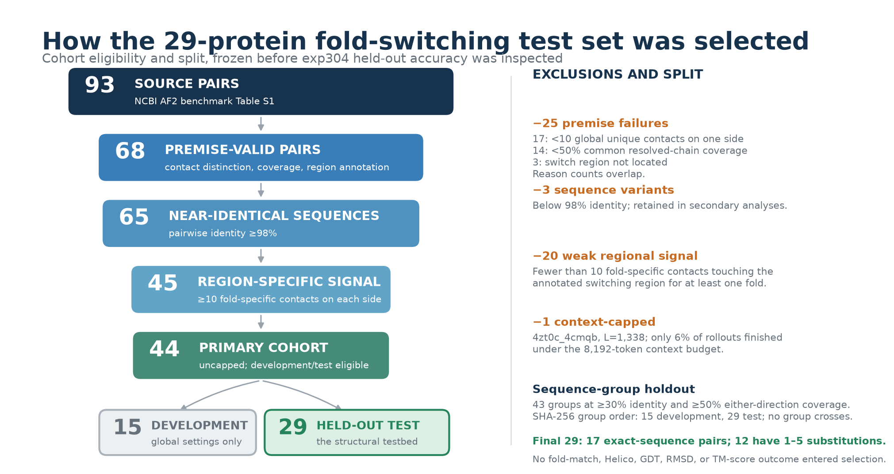
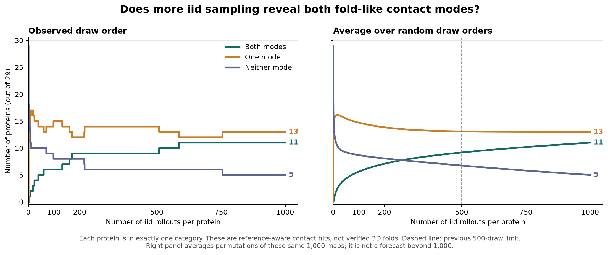
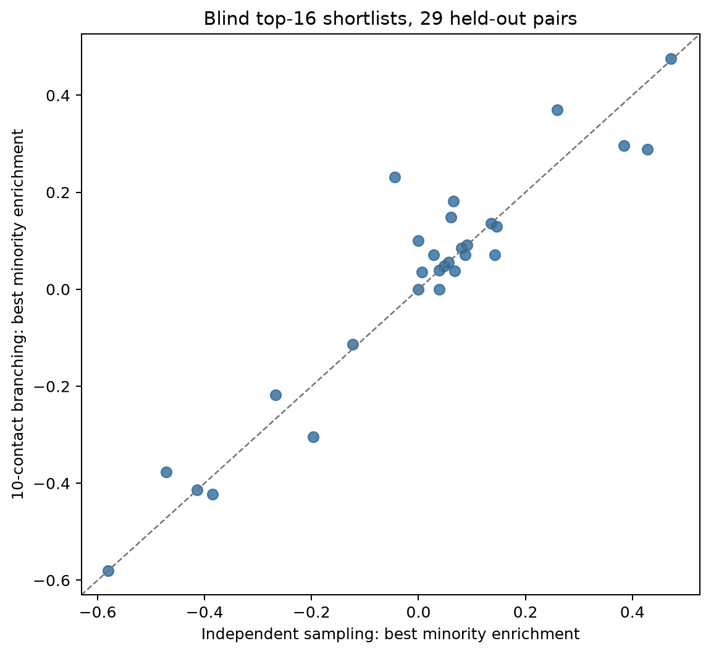
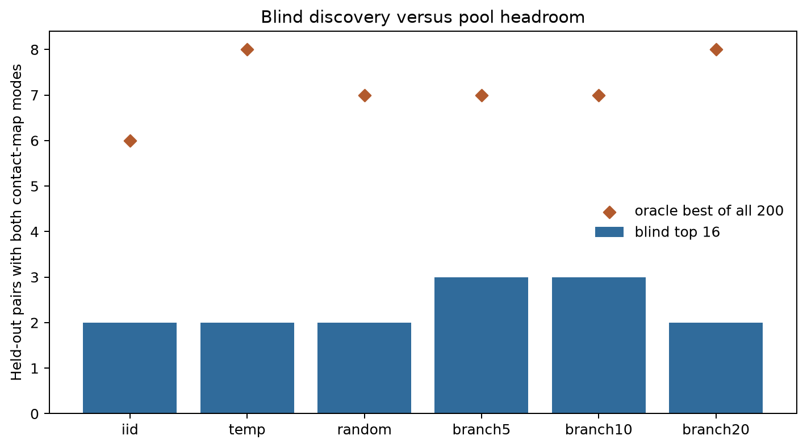
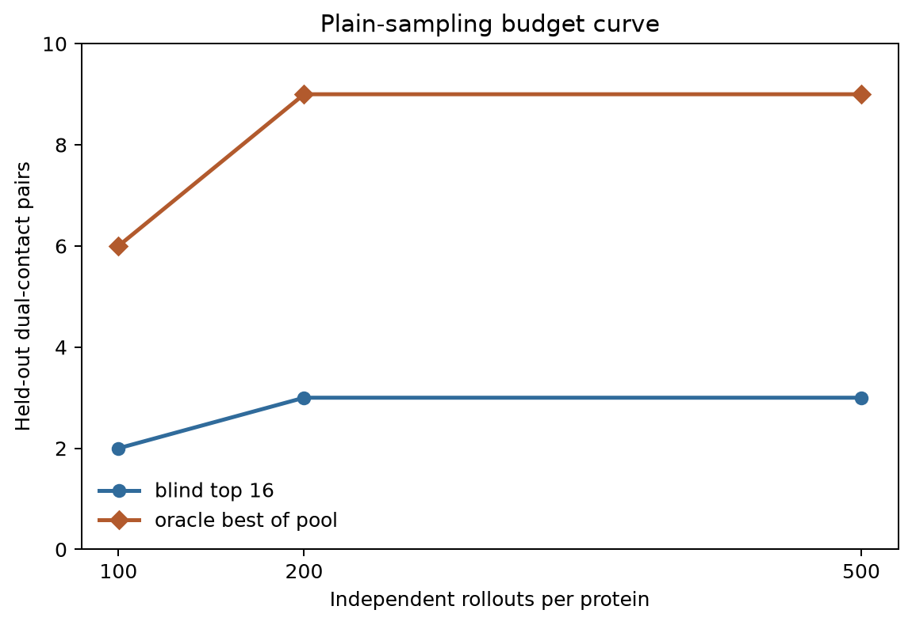
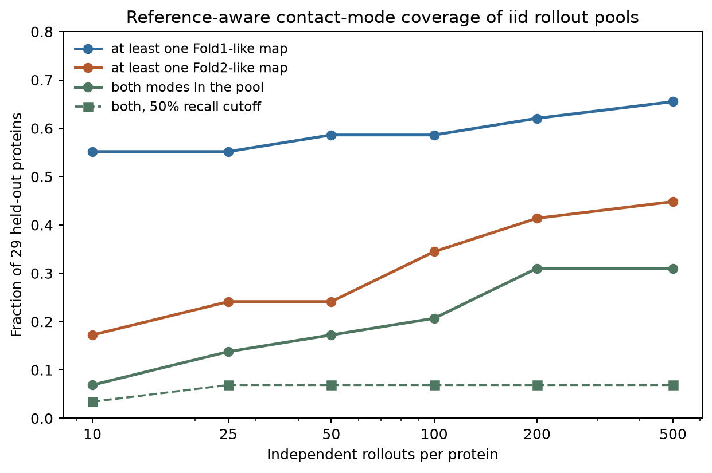
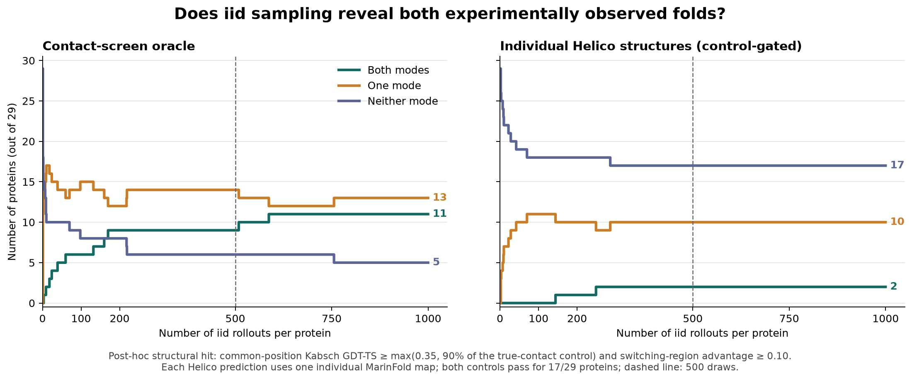
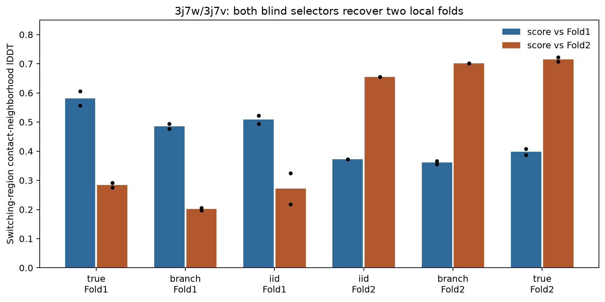

---
marinfold_experiment:
  issue: 304
  title: 'exp: can blind inference search discover both folds of fold-switching proteins?'
  kind: evals
  branch: exp/304-blind-fold-search
---

# exp: can blind inference search discover both folds of fold-switching proteins?

**Issue:** [#304](https://github.com/Open-Athena/MarinFold/issues/304) · **Kind:** `evals` · **Branch:** `exp/304-blind-fold-search`

## Question

Can an inference-only search over `contacts-v1` outputs return **both** experimentally observed contact-map folds of a protein, including an alternate-fold candidate selected without looking at either reference structure?

## Hypothesis

#301 found a Fold1 contact preference, but 5–20 supplied Fold2-specific contacts can move recovery of *other* Fold2 contacts. This suggests a testable route: a rare, internally coherent alternative contact bundle may occur in an unconditional rollout; clustering rollouts and branching from such bundles could amplify it. The failure modes are equally informative: the needed contacts may never be proposed, may be proposed but not jointly, or may be present but impossible to select without an oracle.

## Background

- [#301](https://github.com/Open-Athena/MarinFold/issues/301) provides 93 reference pairs, a 68-pair contact universe, and the exp277 model/worker. Its 500 rollouts per pair favor Fold1 on 51/67 non-capped pairs. Its forcing curve is real but **does not establish** a universal ten-contact threshold, a second sampling mode, or a recovered 3D fold.
- [#82](https://github.com/Open-Athena/MarinFold/issues/82) supplies the plain rollout/resampling baseline. [#254](https://github.com/Open-Athena/MarinFold/issues/254) tests one self-predicted seed; [#163](https://github.com/Open-Athena/MarinFold/issues/163) tests partial-contact conditioning; [#211](https://github.com/Open-Athena/MarinFold/issues/211) develops a reference-free geometry check. This experiment asks whether *sets of mutually supported, model-generated* contacts can reveal a second mode.
- [#256](https://github.com/Open-Athena/MarinFold/issues/256) identifies Helico as a possible contact-to-structure validator. A validator must first recover both references when given their true contacts; otherwise a failed reconstruction says nothing about the search.
- [CF-random](https://www.nature.com/articles/s41467-025-60759-5) is precedent for measuring alternative-fold discovery from a **blindly selected ensemble** rather than oracle-best predictions. Its MSA perturbation is not applicable to this MSA-free model.

## Planned approach

### 0. Freeze targets and the scoring contract

Use exactly the exp277 checkpoint from #301 (`contacts-v1-exp277-m2-p06-full-epoch-1.5B`, HF step 266344); no weight updates, reference contacts, PDB structures, Fold1/Fold2 labels, or annotated switching-region positions may enter search or shortlist selection. References are revealed only to the evaluator after each method has written a fixed shortlist.

Primary cohort: #301's **44** `seq_class=identical` pairs with at least 10 fold-specific contacts touching the annotated switching region on *each* side and without the context-capped `4zt0c_4cmqb`. Secondary: all **64** `seq_class=identical`, non-capped pairs; report the 3 homolog pairs and the capped pair separately. This source label means **at least 98% pair identity**, not literal sequence identity; the exact-match sensitivity analysis below was added when that discrepancy was found. Cluster related sequences before a roughly one-third development / two-thirds test split; freeze the split and shortlist rule before reading test outcomes. This is an algorithm-development holdout, not a claim that these proteins were absent from model training.

Each method emits at most **16 distinct, ranked contact maps per sequence**. Preserve per-rollout contact sets, emission order, prompt/seed lineage, completion status, generated tokens, and per-input wall time: #301's hit counts and vote matrix cannot support co-occurrence search. Reuse its geometry, reference alignment, and contact parser. Fix the zero-denominator case in #301 conditioning: a dose that exhausts a fold-specific set has no remaining-contact recall and must be excluded from that comparison.

### 1. Establish equal-compute baselines

- Plain independent rollouts: #301 recipe (`T=1`, `top_p=.95`, no top-k, fresh realization, `6L+128`) followed by a **reference-free** 16-map selector. Measure 100, 500, and, if useful, 2,000 rollout-equivalent budgets.
- Temperature/top-p diversity sweep, with the same H100-second budget and the same selector; report generated tokens as a second cost axis. Choose global sweep settings on development proteins only.
- Random self-seeding from a single model rollout, to isolate the benefit of conditioning from the benefit of finding coherent minority bundles.

Report actual generated tokens and H100 seconds per protein; the primary comparison matches H100 seconds because a conditioned branch has different prompt and generation costs from a plain rollout. Keep non-terminating outputs and failures visible rather than silently dropping them.

### 2. Search without an oracle

**Candidate pool:** draw an initial pool of unconditional rollouts. Cluster *whole maps* using contact co-occurrence and an inverse-frequency-weighted overlap so the common consensus does not swamp minority variation. Select diverse medoids, including the dominant cluster. Do not union mutually incompatible rollouts into a seed set.

**Branching:** from each medoid/cluster, select a small bundle of contacts that co-occur in that branch and have within-cluster support. Prefix the same base model with 2, 5, 10, or 20 of those **model-generated** contacts; generate children. Allocate the remaining rollout budget across branches using a reference-free combination of within-branch reproducibility, contact count, geometry score (if #211's calibration passes), and novelty relative to the dominant cluster. Permit one further branching round if it improves development results. Tune the selector and budget allocation on development proteins only, then freeze them.

Ablate clustering, bundle size, novelty weighting, and second-round branching. A true Fold2-contact prompt is allowed only as a separately labeled **oracle ceiling**; it is not a candidate inference method.

### 3. Score the sealed shortlists

For every candidate, report recall on Fold1-only (`A`) and Fold2-only (`B`) contacts, their difference, coverage of shared contacts, candidate size/precision, and the same measures restricted to contacts touching the switching region. Do not use full-map R-precision as a substitute for a fold-discriminating score. Primary continuous endpoint: the best **minority-fold enrichment** in the 16 blind-selected maps, accompanied by absolute minority-fold recall so sparse maps cannot win by emitting one lucky contact. Also report whether the shortlist contains credible candidates for **both** folds; calibrate the binary contact-level criterion against same-fold replicate and count-matched controls on development data, then freeze it before test scoring. Report the per-protein paired difference from the equal-compute plain baseline and a protein-level bootstrap interval.

Keep an **oracle-best-of-pool** curve as a diagnostic only. Separate: (a) alternative-specific contacts absent from the pool; (b) present in the pool but not co-occurring in any candidate; (c) a good candidate exists but blind selection misses it; (d) blind selection works but 3D validation fails. This identifies whether more sampling, better search, better ranking, or a different model is needed.

For blind-selected successes and matched baseline candidates, attempt 3D reconstruction with Helico. First establish that true Fold1 and Fold2 contact inputs can produce their corresponding structures under the same reconstruction protocol. Score resulting coordinates against **both** references using switching-region and global TM-score/lDDT, and report contact-to-structure failures explicitly. A contact-level hit is not called an alternate **fold** until this structural check passes.

## Success criteria

1. On the frozen test split at matched compute, the search improves the primary minority-fold enrichment over plain sampling with a paired 95% bootstrap interval excluding zero, without losing absolute minority-fold recall. Report the number of additional proteins meeting the frozen dual-contact criterion among the 16 blind-selected maps.
2. At least one blind-selected alternate candidate passes the calibrated **3D** criterion after the true-contact reconstruction gate passes. If the validator fails its gate, report contact-level discovery only.
3. Publish per-protein results, every nominated contact set and its lineage, full timing/worker metadata (`data/timings.csv`), budget curves, and the oracle diagnostics. Keep the development/test boundary auditable. Publish large rollout artifacts to the public MarinFold HF bucket; keep small tables and plots in the experiment directory.

A negative result is decisive if the oracle pool contains no coherent alternate candidate at the largest practical budget: inference search on this checkpoint is then limited by proposal coverage rather than shortlist selection. If oracle candidates exist but the blind selector misses them, focus the next experiment on ranking; if only true-contact prompts work, focus on model/data changes rather than more inference search.

## Results

Before revealing any exp304 reference scores, the implemented first-pass
comparison was frozen as follows. Each arm contributes 100 new rollouts after
the shared 100-rollout root pool; `seal_shortlists.py` selects at most 16
complete contact maps, counting both the self-supplied seed and the generated
continuation. `branch10` versus independent sampling (`iid`) is the primary
search comparison; `branch5`, `branch20`, `random`, and `temp` are exploratory
ablations. The selector uses contact-map support and weighted map diversity,
with no structure-derived features. A contact-level dual hit requires a
finished map with at least 10 predicted contacts touching the annotated
switching region and, for each reference fold, a separate candidate with at
least 25% recall of that fold's region-specific unique contacts and at least
0.10 recall enrichment over the opposing fold. These are prespecified
operational cutoffs, not a validated structural threshold. The 29 primary test
pairs were held apart by sequence-group from the 15 primary development pairs.
The pre-reveal source and cohort hashes are in `data/protocol.sha256`.

### Cohort selection

The 29 test proteins were not selected from MarinFold or Helico outcomes. The
source was the 93 literature-curated reference pairs in the NCBI
[`AF2_benchmark`](https://github.com/ncbi/AF2_benchmark) Table S1. The selection
then applied reference-defined cohort
eligibility rules: 68 pairs passed the global contact, coverage, and annotated
region premise gate; 65 of those had at least 98% sequence identity between
the two structures; 45 had at least 10 Fold1-only and 10 Fold2-only contacts
touching the switching region; and one context-capped 1,338-residue pair was
excluded, leaving 44 primary pairs.

The 44 pairs formed 43 sequence groups using at least 30% identity and at
least 50% coverage in either alignment direction. A deterministic SHA-256
ordering assigned whole groups to development until it reached 15 pairs; the
remaining 29 became the held-out test set. No sequence group crosses the
boundary. Of the final 29, 17 structure pairs have exactly the same sequence
and 12 differ by 1–5 substitutions. This is an algorithm-development holdout,
not a decontaminated training-data holdout.

The pair-level audit trail is in
[`data/selection_funnel_membership.csv`](data/selection_funnel_membership.csv),
and the stage definitions and counts are in
[`data/selection_funnel_summary.csv`](data/selection_funnel_summary.csv).
The 25 premise-gate exclusions have overlapping failure reasons: 17 lacked
enough global fold-specific contacts on at least one side, 14 had less than
50% common resolved-chain coverage, and 3 lacked a locatable switching-region
annotation. One pair was removed because its rollouts rarely completed within
the fixed context budget; no contact agreement, GDT, RMSD, TM-score, or other
fold-recovery quality result entered the selection.

### What ran

The exp277 step-266344 contacts-v1 checkpoint generated 100 unconditioned
root maps per target, then 100 more for each of six arms: independent sampling,
temperature 1.3/top-p 1.0, random ten-contact self-seeds, and clustered
self-seeds of 5, 10, or 20 contacts. That is 46,900 attempted maps across the
67 non-capped pairs. Every arm except temperature finished essentially every
map; temperature finished 4,903/6,700 (73.2%) and used substantially more
compute. A separate plain-sampling run generated 500 maps per target (33,500
attempts). The 44-pair primary cohort contains 15 development and 29 test
pairs. Related sequences were kept in the same split. An audit of #301's
underlying sequence alignment shows **25/44** primary pairs are literally
identical between the two structures; **17/29** test pairs are. The other
primary pairs have 1–6 substitutions. The source `seq_class=identical` label
was therefore too broad to justify an exact-sequence claim.

The new run reproduces #301's unconditioned fold preference: across all 67
pairs, its 100-root-rollout mean `phi` correlates **0.999** with #301's
500-rollout mean, with mean absolute difference **0.007** and the same mean
predicted contact count (281.9). This is a useful check of the model,
coordinate mapping, and scoring implementation; it is not an independent
biological validation.

### Held-out blind search

The table uses the 29 primary test proteins. Each method had the same shared
100 root maps and 100 arm maps; the temperature arm's time and completion
rate make it an unequal-compute exploratory comparison. Enrichment is the
best minority-fold switching-region recall minus dominant-fold recall among
the 16 sealed candidates. A dual hit means separate candidates pass the
prespecified *contact-level* cutoffs for each fold.
The minority label is fixed by the sign of #301's prior 500-rollout
fold-specific recall difference (`phi`) for each protein; it is not chosen
from this run's candidate outcomes.

| Arm | Mean enrichment | Mean minority recall | Blind dual hits | Oracle dual hits | Mean H100 seconds/pair |
| --- | ---: | ---: | ---: | ---: | ---: |
| Independent | 0.005 | 0.143 | 2/29 | 6/29 | 18.67 |
| Random self-seed | -0.018 | 0.121 | 2/29 | 7/29 | 18.57 |
| Cluster branch 5 | 0.012 | 0.140 | 3/29 | 7/29 | 18.60 |
| **Cluster branch 10** | **0.018** | **0.142** | **3/29** | **7/29** | **18.30** |
| Cluster branch 20 | 0.028 | 0.135 | 2/29 | 8/29 | 18.12 |
| Higher temperature | 0.022 | 0.145 | 2/29 | 8/29 | 26.78 |

The prespecified primary paired difference, branch 10 minus independent, is
**+0.013** enrichment with a protein-bootstrap 95% interval **[-0.014,
+0.043]**. Twelve proteins improved, nine worsened, and eight tied. Absolute
minority recall was essentially unchanged (0.142 versus 0.143). The third
blind dual-contact hit, `1qs8b_1miqb`, is a contact-level gain; the other two
hits occur in both methods. This is **not evidence of a reliable search
improvement**. The 16-map blind selector missed four of seven branch-10
oracle dual hits. On the remaining 22 test proteins, three lacked enough
distinct minority contacts across the finished 200-map pool to reach the
operational recall cutoff; 19 had enough contacts in the union but no single
sufficiently coherent and selective pair of maps. Those categories are
specific to the stated cutoffs.

On the **17 strictly identical-sequence primary test pairs**, a post-hoc
sensitivity analysis gives branch 10 minus independent enrichment **+0.017**
(paired 95% interval **[-0.007, +0.044]**), essentially unchanged minority
recall (0.128 versus 0.128), and **one dual-contact hit in each method**.
This strengthens the conclusion that branching has no demonstrated gain on
the exact-sequence subset; the interval is wider because the subset is
smaller. The per-protein results are in `data/exact_sequence_primary_test.csv`.

The separate plain-sampling budget run shows 2, 3, and 3 blind dual hits at
100, 200, and 500 rollouts, versus 6, 9, and 9 oracle-pool hits. Mean blind
enrichment rose from -0.035 to -0.026 to -0.011. The paired 500-versus-200
improvement is +0.015 with 95% interval [-0.015, +0.047]. Thus extra sampling
through 500 did not reliably improve blind discovery, even though it exposed
more candidates to an oracle. The first-pass search used 74.9 H100 minutes of
pure generation and the 500-rollout run 41.3 H100 minutes; these figures
exclude model staging, load, and shortlist computation. Per-input generation
and worker timing metadata are in `data/timings.csv` and
`data/timings_iid500.csv`. The workers' `elapsed_seconds` is measured pure
generation time. Their `total_seconds` includes only generation plus an
amortized model-init share, so it should not be treated as full end-to-end
wall time. `data/pair_wall_times.csv` preserves the separately logged,
rounded per-protein wall time, including prompt preparation and output dumps;
its source job logs are in the public artifacts.

### What the plain-rollout oracle actually contains

The oracle sees reference Fold1 and Fold2 contacts **after** generation and
scores every map in the separate 500-rollout independent-sampling run. Its
continuous value is the single map with the best minority-fold contact-recall
enrichment. Its **dual hit** is a different question: does the pool contain
*one* Fold1-like map **and another** Fold2-like map? The two maps need not be
among the 16 maps selected without references. The sampling is independent
model sampling at temperature 1 and top-p 0.95, not uniform sampling of
tokens, contact maps, or folds. The 100 and 200 rows below are prefixes of
the same 500 draws.

| Cohort and draw count | Any Fold1-like | Any Fold2-like | Both in pool | Both with 50% recall |
| --- | ---: | ---: | ---: | ---: |
| Primary test, 100 (29 pairs) | 17 | 10 | 6 | 2 |
| Primary test, 200 (29 pairs) | 18 | 12 | 9 | 2 |
| **Primary test, 500 (29 pairs)** | **19** | **13** | **9** | **2** |
| Exact-sequence primary test, 500 (17 pairs) | 12 | 7 | 5 | 1 |
| All non-capped, 500 (67 pairs) | 52 | 38 | 31 | 13 |

“Fold-like” here means a **contact-map screening hit**: a finished map with
at least 10 predicted contacts touching the annotated switching region, at
least 25% recall of the corresponding fold's unique contacts there, and
at least 0.10 more recall than for the opposing fold. The final column raises
only the recall cutoff to 50%; it is a post-hoc sensitivity analysis, not a
second validated definition of a fold. At 500 draws, the 29 primary test
pairs divide into nine with both contact modes, ten with Fold1 only, four with
Fold2 only, and six with neither. All nine dual hits occurred by draw 170 in
this run. Four of those nine had just one or two qualifying maps for their
rarer mode even after 500 draws. Extra draws may still help on a new random
run, but this particular held-out pool gained no new dual hits after 200.

These are **oracle pool coverage** numbers, not inference success rates or
estimates of proteins adopting both 3D folds. The 16-map reference-free
selector retained only three of the nine primary test dual contact hits at
500 draws; Helico confirmed two structures for only `3j7wb_3j7vg` in the
separately generated 200-rollout run described below. The per-protein hit
counts, first-hit draw numbers, and best recalls are in
`data/iid_mode_coverage_per_protein.csv`; cohort curves are in
`data/iid_mode_coverage_summary.csv` and the plot below.

### Extending plain iid sampling to 1,000 draws

To test whether the apparent plateau at 500 draws persists, we generated
another 500 independent root rollouts for **each of the same 29 primary test
proteins**, using the same checkpoint, temperature 1, top-p 0.95, and prompt
realization recipe. The first 500 draws are the existing exp304 run; the new
draws are indexed 501–1,000. All 14,500 new rollouts completed, making
28,997/29,000 completed across the combined streams. The worker recorded
per-protein timing metadata; pure generation for the new draws totaled
19.3 H100 minutes, excluding model setup and artifact transfer. The new
working output is
`s3://marin-us-east-02a/MarinFold/exp304/iid1000-tail-primary/`.

At each draw count, each protein is in exactly one category: **neither**
reference fold has a qualifying map, **one** has a qualifying map, or **both**
have qualifying maps, possibly in different rollouts. We used exactly the
same reference-aware contact screening rule as above: a finished map, at
least 10 predicted switching-region contacts, at least 25% recall of one
fold's region-specific unique contacts, and at least 0.10 greater recall
than for the other fold. This is an *oracle pool coverage* measure, not
blind selection or confirmed recovery of two 3D structures. The scoring
script checked every 500-draw prefix result against the previously
published per-protein and cohort counts.

| Draws per protein | Neither | One fold | Both folds |
| ---: | ---: | ---: | ---: |
| 100 | 8 | 15 | 6 |
| 200 | 8 | 12 | 9 |
| 500 | 6 | 14 | 9 |
| 750 | 6 | 12 | 11 |
| 1,000 | 5 | 13 | 11 |

**There are gains after 500, but they are small:** two proteins first enter
the dual-hit category in the extra draws, at draw 509 (`4aana_4aala`) and
draw 587 (`2lela_2k0qa`). A third protein first gets any hit at draw 756,
moving from neither to one. Thus 1,000 draws yield 11/29 dual hits versus
9/29 at 500. Both new dual-hit proteins have literally identical observed
sequences in their two references, lifting the exact-sequence subset from
5/17 to 7/17. The qualifying rarer fold appears only four times among
1,000 maps for `4aana_4aala` and once for `2lela_2k0qa`. The stricter
50%-recall dual criterion stays at **2/29**, so the extra coverage is at
the permissive screening threshold.

The left panel below follows the actual draw order; the right panel
averages all random reorderings of the *same observed 1,000 maps* for each
protein. Its smooth curve shows how much of the flat section is due to
where rare hits happened to land in this run; it is not a prediction of
additional gains beyond 1,000. At every x-value, the three counts sum to
29. The draw-by-draw curve is in `data/iid1000_primary_test_curve.csv`, and
the per-protein first-hit draws and hit frequencies are in
`data/iid1000_primary_test_per_protein.csv`.

### Structural check

Helico contacts-msafree-01 step 6000 folded 36 target/contact combinations
across four proteins, using three samples, six cycles, one fixed seed, and no
MSA. The runner received only the sequence extracted from a reference chain
and the supplied contact map; it did not receive reference coordinates as
model features. We supplied true contacts for both folds as reconstruction
controls, and scored every output against **both** references on the same
resolved positions. The contact-to-Helico index mapping passed a Cα-distance
check for the native contacts. All 36 predictions completed.

`3j7wb_3j7vg` is the clearest positive case. The two true-contact controls
separate its folds; its two reference chains have exactly the same observed
sequence on their 317 common positions. With Fold1 as the sequence input, switching-region
contact-neighborhood lDDT against (Fold1, Fold2) was **(0.606, 0.292)**
for true Fold1 contacts and **(0.388, 0.723)** for true Fold2 contacts.
Two maps in the branch-10 sealed shortlist scored **(0.477, 0.206)** and
**(0.356, 0.702)** respectively. The independent-sampling shortlist also
contained two structurally discriminating maps, scoring **(0.522, 0.325)**
and **(0.373, 0.654)**. The same fold preferences held when Helico received
the Fold2 observed sequence. On the same common positions with the Fold1
sequence input, the branch shortlist's Fold2-like structure had global
TM-scores **0.602 against Fold1 versus 0.702 against Fold2**; the independent
candidate scored **0.668 versus 0.731**, and the true-Fold2-contact control
**0.698 versus 0.772**. The complete scores are in
`data/helico_cross_reference.csv`. The branch-10 maps were root rollouts
`root:57` and `root:18`, ranked 14 and 10 in that shortlist; the independent
maps were `iid:20` and `root:25`, ranked 5 and 1. This is a concrete example
of **blind inference returning both folds**, with no demonstrated advantage
from branching.

The extra branch-10 contact hit on `1qs8b_1miqb` did **not** reconstruct a
convincing Fold2 structure: its Fold2-like contact map gave switching-region
lDDT 0.328 against Fold2 from the Fold1 sequence input, versus 0.803 for
the true-Fold2-contact control. The branch-5 contact hit on
`3g0ha_3ewsb` produced some Fold2-local signal but fell well short of its
true-contact structural control and stayed closer to Fold1 globally.
`4y0mj_4xwsd` could not be adjudicated with this validator because even its
true-contact controls barely separated the two references under the
common-position structural scores. Contact-level dual hits are therefore
not interchangeable with recovered alternate 3D folds.

These 36 reconstructions were chosen **after** contact scoring from four
representative shortlist successes; the structural result is an existence
check, not an estimate of a 67-protein structural success rate. The binary
contact cutoffs were fixed before scoring but were not calibrated against
same-fold replicates or count-matched decoys, as the plan proposed. We did not
run the optional 2,000-rollout arm, a second branching round, or adaptive
allocation; the 500-rollout plateau and the held-out null result make any
new selector tuning on these test proteins exploratory.

### Folding all 1,000 iid maps individually

We then folded **every individual iid map** for the 29 primary test proteins,
rather than folding a consensus across rollouts. The run contains 29,000 iid
targets plus true-Fold1, true-Fold2, and no-contact controls for every protein,
for 29,087 Helico predictions total. Each target used one diffusion sample,
six trunk cycles, seed 42, no MSA, and the contacts-msafree-01 step-6000
checkpoint. Helico received the Fold1 observed-chain **sequence** and the
candidate contact list; reference coordinates entered only the scorer. All
29,087 predictions and compressed PDBs completed. Two source CIFs incorrectly
declared an amino-acid chain as DNA; the failed attempts are preserved in the
append-only progress log, and a resume pass supplied the explicitly extracted
protein sequence. The final table contains one successful result per target.

Every prediction was scored against both references on their common C-alpha
positions. We saved standard whole-structure TM-score normalized to the
reference length, standard C-alpha RMSD, and Helico's Kabsch-aligned GDT-TS
(fractions within 1/2/4/8 Angstrom after one global Kabsch fit). RMSD and GDT
were saved both globally and on the annotated switching region. The region
score used the global fit, so a locally superposable fragment cannot by itself
create a fold-specific hit. The per-protein deck plots whole-structure TM-score
against Fold1 versus Fold2 for all 1,000 predictions. The GDT-TS convention used
for the separate binary screen matches Helico's evaluator but is simpler than
the iterative subset-superposition procedure sometimes also called GDT-TS.

The plotted binary screen is explicitly **post-hoc and exploratory**. It was
chosen after inspecting the initial controls and the known `3j7wb_3j7vg`
positive, but before the full score table was available. A candidate must:

1. come from a finished MarinFold completion;
2. reach global GDT-TS at least `max(0.35, 90% of the corresponding
   true-contact control)`; and
3. favor that reference in switching-region GDT-TS by at least 0.10.

The corresponding true-contact control must itself reach global GDT-TS 0.35
and the 0.10 region advantage. Both fold controls pass for **17/29** proteins;
an absent mode on the other 12 is not evidence that sampling failed.

| Iid maps per protein | Neither structural mode | One mode | Both modes |
| ---: | ---: | ---: | ---: |
| 100 | 18 | 11 | 0 |
| 200 | 18 | 10 | 1 |
| 500 | 17 | 10 | 2 |
| 750 | 17 | 10 | 2 |
| 1,000 | 17 | 10 | 2 |

Under that strict control-relative screen, the two dual proteins are
`3j7wb_3j7vg` and `2lela_2k0qa`, both in the 17-protein exact-sequence subset.
`3j7wb_3j7vg` first has both modes by draw 144. Its selected Fold1/Fold2 maps
produce global GDT-TS 0.420/0.517 against their targets and region advantages
0.202/0.762; the corresponding true-contact controls score 0.429/0.483. Its
no-contact prediction matches neither fold. This agrees with the independent
TM-score/lDDT analysis above and remains the cleanest contact-driven example.

`2lela_2k0qa` first has both modes by draw 249. Its selected candidates score
0.449 against Fold1 and 0.659 against Fold2, versus true-contact controls of
0.355 and 0.463. The interpretation is less clean: the no-contact prediction
already passes as Fold2-like, so iid search contributes the Fold1-like mode.
That Fold1 structure appears at draw 249 even though its map does not pass the
contact proxy; the only Fold1 contact-screen hit appears at draw 587.

The strongest near-threshold case is `1qs8b_1miqb`. Its candidates score 0.855
against Fold1 and 0.758 against Fold2, with region advantages 0.567 and 0.283;
the true-contact controls score 0.871 and 0.895. The Fold2 candidate reaches
84.7% of its unusually strong control and therefore misses the plotted 90%
rule. Using 80% instead of 90% gives **3/29** dual proteins by adding this case;
requiring 100% gives **1/29**. Fixed absolute GDT-TS cutoffs of 0.35, 0.50, and
0.60, all with a 0.10 region margin, give 8, 3, and 1 dual proteins. The exact
binary count is therefore definition-sensitive. The raw metrics and both
sensitivity grids are the reliable result; 2/29 is a deliberately strict
summary, not a natural boundary between correct and incorrect structures.

The structural analysis materially changes the contact-only picture. At
1,000 draws the contact screen reports 11/29 dual proteins, while the strict
structural screen reports 2/29. Map-level contact preference and structural
preference are related (Spearman rho 0.705), but only 573/970 Fold1 structural
hits and 291/368 Fold2 structural hits also pass the contact proxy. Conversely,
many contact hits do not reconstruct near their nominal fold. For example,
`4aana_4aala` has excellent true-contact controls and dual contact hits, but
its best iid candidates reach only 0.684 and 0.523 versus control-calibrated
thresholds 0.777 and 0.811.

No new strict structural dual appears after draw 249 in this particular
stream. This does not prove that 500 draws saturate iid sampling: every map
was folded once with one fixed Helico seed, only 17 proteins pass both control
gates, and the hit rule is post-hoc. It does show that the two contact-level
gains after draw 500 do not translate into additional strict structural duals
under this reconstruction protocol. Pure Helico prediction time sums to 85.4
H100 hours across the 29,087 targets. Per-target timing and worker metadata are
in `data/helico_iid_timings.csv`.

The detailed [60-page per-protein deck](plots/helico_iid_per_protein_deck.pdf)
shows both experimental contact maps and structures, the selected individual
MarinFold maps, all 1,000 Helico scores, selected and control structure
overlays, and the raw metrics for every protein. The complete score table,
individual PDBs, rendered assets, and member-level checksums are published so
the thresholds and display can be changed without rerunning either model.

All per-candidate contacts, prompts' supplied seed sets, lineage, completion
flags, and timings are published with the small tables and Helico structures
in the [public exp304 artifact bucket](https://huggingface.co/buckets/open-athena/MarinFold/tree/data/contacts-v1-blind-fold-search-exp304).
The co-located CoreWeave working outputs were
`s3://marin-us-east-02a/MarinFold/exp304/blind-search-v1/` and
`s3://marin-us-east-02a/MarinFold/exp304/iid500/`; the 1,000-draw extension
is at `s3://marin-us-east-02a/MarinFold/exp304/iid1000-tail-primary/`. The final 36-case
[Helico Modal run](https://modal.com/apps/open-athena/main/ap-TAZO9vFpGbeUxC1EA8tKb3)
used checkpoint `/ckpts/contacts-msafree-01/final.pt` (step 6000).
The all-rollout structural run used
[the main fanout](https://modal.com/apps/open-athena/main/ap-X8qQ3OhGqEMB51CGItDied)
and [the input-fix resume](https://modal.com/apps/open-athena/main/ap-1DKrtJR4Ips7WQLrX8iZv4);
its public inputs, scores, per-protein PDB archives, checksum index, and deck
assets are under `helico-iid/` in the same bucket.
`data/artifact_manifest.csv` records their SHA-256 hashes. The two shortlist
hashes are in `data/sealed_shortlists.sha256` and
`data/sealed_budget_shortlists.sha256`.

## Conclusion

**Yes, individual iid MarinFold rollouts can lead to both experimental
structures, but this is uncommon and the count depends on how “match” is
defined.** The strict control-relative screen finds both modes for 2/29
proteins; a nearby 80%-of-control rule finds 3/29. `3j7wb_3j7vg` remains the
cleanest example because both contact-driven modes separate, both controls
pass, and the no-contact baseline matches neither. `1qs8b_1miqb` is a strong
absolute structural case that narrowly misses the strict relative cutoff.
`2lela_2k0qa` passes strictly, but one mode is already produced without
contacts.

The 11/29 contact-screen dual count should not be read as 11 recovered pairs
of folds. Contact preference correlates with structural preference, yet the
proxy has many false positives and misses some structures. Structural controls
also fail for at least one fold on 12/29 proteins, limiting what this Helico
protocol can rule out.

Plain independent sampling remains the best-supported inference baseline;
the tested branching method still has no demonstrated held-out gain. The
structural curve also rules out “100 draws are enough” for this realization:
the first strict dual appears at draw 144 and the second at draw 249. It finds
no further strict duals from 500 to 1,000, but one stream and one Helico sample
per map are insufficient to claim saturation. The next search experiments
should optimize for coherent, structurally productive contact sets and a
reference-free way to recognize them, while retaining individual-structure
validation rather than relying on the contact screen alone.
