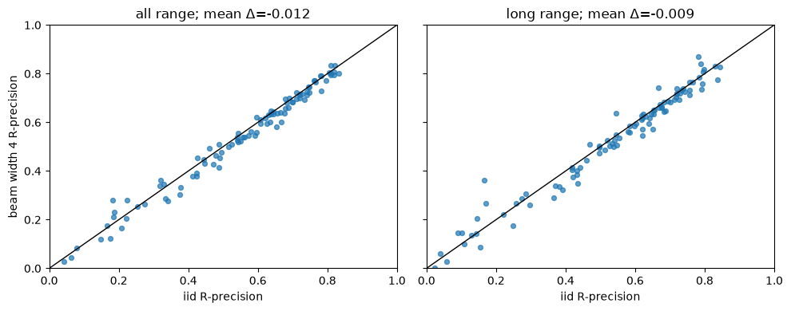
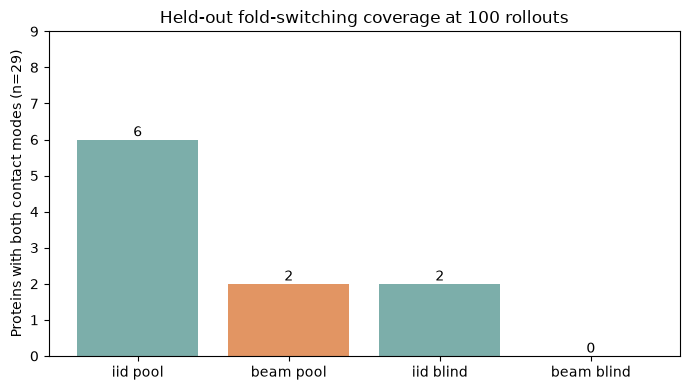
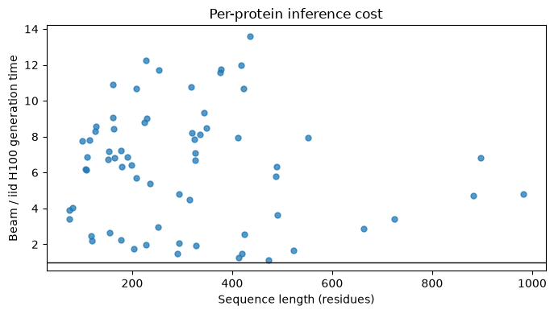

---
marinfold_experiment:
  issue: 306
  title: 'exp: contact-block beam search for fold discovery and eval-val precision'
  kind: evals
  branch: exp/306-contact-block-beam
---

# exp: contact-block beam search for fold discovery and eval-val precision

**Issue:** [#306](https://github.com/Open-Athena/MarinFold/issues/306) · **Kind:** `evals` · **Branch:** `exp/306-contact-block-beam`

## Question

Does short, contact-aligned beam search improve contacts-v1 decoding? Specifically, after the model decides to emit `<contact>`, search jointly over its two position tokens before committing the completed `<contact> <pos1> <pos2>` statement. Measure ordinary contact accuracy and whether this exposes both fold-specific modes in the fold-switching testbed.

## Hypothesis

Choosing each contact's two positions jointly may reject locally plausible
first positions whose likely completions are poor contacts. A truncated beam
could therefore improve contact precision. It may also concentrate the
rollout distribution and remove rare alternate-fold maps, so both ordinary
accuracy and two-mode coverage matter.

## Approach

Use the exact exp277 contacts-v1 checkpoint at step 266344. At each statement
boundary, sample one token with the exp82 settings (temperature 1, top-p 0.95,
top-k disabled). If it is `<end>`, stop. If it is `<contact>`, run vLLM beam
search for exactly two position tokens, retain complete valid contacts, and
sample one from the top beam candidates in proportion to its two-token joint
model probability. Thus every committed contact is a complete
`<contact> <pos1> <pos2>` block. A rollout gets a fresh document realization,
and the ordinary `6L+128` token cap is unchanged. The decoder sees only the
sequence and generated prefix; reference contacts are inaccessible to it.

Test beam widths 4 and 8 on the development fold-switching proteins and a
small eval-val pilot. Freeze the choice before looking at the 29 primary
fold-switching test outcomes. Compare all 97 natural eval-val proteins with
the [exp277 100-rollout baseline](../exp277_models_single_mpnn_pilot/evals/2026-09-13_rollout_v2/README.md)
using the same [exp89 metric functions](../exp89_evals_contacts_v1_model_on_eval_set/compute_metrics.py),
especially all- and long-range R-precision. Eval-test remains unread.
For fold switching, use the same exp304 25%-recall, 0.10-enrichment
contact-level criterion on every rollout and on a 16-map shortlist sealed
without references; separately report the stricter 50%-recall sensitivity.

Both comparisons report pure generation seconds, completed rollouts, number of
contacts, and rejected beam candidates. The 100-rollout comparison answers the
accuracy question; matched H100 time determines whether a gain would be worth
the extra search cost. Per-rollout maps and beam choices are retained for audit.

## Success criteria

Do not call the beam strategy an improvement unless eval-val R-precision is
at least preserved and the blind fold-switching shortlist finds more proteins
with both contact modes at a comparable H100 budget. Oracle-pool gains alone
show only that the search generated candidates, not that inference can select
them. Any new apparent alternate-fold success needs the exp304 3D validator
before it is called a recovered fold.

## Results

The width-4 smoke run produced 100/100 finished rollouts on the 75-residue
development pair `2hdma_2n54b` in 3.68 seconds of pure generation. No
contact was malformed. Its rollouts averaged 17.7 contacts versus 50.1 among
the first 100 plain iid rollouts for that pair. This was a validity check, not
an accuracy result.

The complete 20-protein development set was used to choose a beam width before
the held-out fold-switching run. On the 15 primary development proteins, both
widths found both contact modes in 1/15 oracle pools and 0/15 blind 16-map
shortlists; iid100 found 1/15 by both measures. Mean minority-mode enrichment
in the blind shortlist fell relative to iid by 0.044 for width 4 and 0.076 for
width 8. Mean paired H100 generation time was 6.7x iid for width 4 and 12.3x
for width 8. Width 4 is the frozen choice: it tied width 8 on dual-mode
coverage, preserved more minority-mode evidence, and cost roughly half as much.
These are contact-level development results, not 3D fold recoveries.

On the complete 97-protein natural eval-val set, width 4 gave mean all-range
R-precision 0.54182 versus 0.55375 for the standard exp277 iid100
rollout-and-resample baseline, a paired difference of -0.01193 with a
protein-bootstrap 95% interval [-0.01741, -0.00641]. Long-range R-precision
was 0.52932 versus 0.53802, a paired difference of -0.00870
[-0.01629, -0.00021]. All 97 targets had 100 rollouts; one rollout was capped
and excluded from voting. The beam decoder used 5,269 seconds of pure H100
generation versus 3,539 for the baseline, a 1.49x aggregate cost; the mean
per-protein time ratio was 1.37x. Thus this width does not preserve ordinary
contact accuracy. At the individual-protein level, 26 improved, 63 declined,
and 8 tied on all-range R-precision. Eval-test was not read.

On the 29 primary held-out fold-switching proteins, the width-4 100-rollout
pool contained **both** fold-specific contact modes for 2/29 proteins,
versus 6/29 with iid100. One protein was beam-only and five were iid-only.
The reference-blind 16-map shortlist recovered both modes in 0/29 versus
2/29 with iid. The stricter 50%-recall contact criterion yielded no beam
dual-mode hits. All 2,900 beam rollouts in this primary group finished.
Nearly every protein still had 100 distinct contact maps, so the lost coverage
is not explained by exact duplicate rollouts. The aggregate pure H100
generation cost was 1,697 versus 270 seconds, a 6.28x ratio. On the 17 exact
sequence pairs within this primary group, the beam pool gave 0 dual-mode hits
versus 3 for iid100.

The broader 67-pair non-capped cohort gives the same direction: 6/67 versus
23/67 dual-mode oracle pools, and 2/67 versus 9/67 blind shortlists, at 5.76x
total generation time. These 67 pairs include development and secondary
pairs, so the 29 primary held-out pairs are the main test. The 15 development
pairs were **sampled again** as part of the 67-pair run; their full-run blind
count was 1/15, while the original development run used to freeze the width
was 0/15. Their saved prompts match exactly across the two runs, but sampled
contacts differ, so the full-run development subset is a separate
stochastic run, not the frozen width-selection result.

The one beam-only primary oracle hit (`5jzha_5jztg`) was absent from its blind
shortlist and is not an exact-sequence pair. It is contact-level evidence only;
no beam candidate was validated as an alternate 3D fold.

Working raw outputs are at
`s3://marin-us-east-02a/MarinFold/exp306/{val-b4,foldswitch-b4,dev-b4,dev-b8}/`.
The source and width-4 choice were committed as `4e108216` before held-out
scoring; the sealed 1,072-map shortlist has SHA256
`e5c89eff477b2c9919d8448ee22ea095377328d006fe89b49d57758762a1c1fb`.
The [per-protein timings](data/timings.csv), [eval-val pairs](data/eval_val_beam4.csv),
and [fold-switching pairs](data/foldswitch_beam4.csv) are committed here;
raw per-rollout maps and timing parquets are published in the
[public HF bucket](https://huggingface.co/buckets/open-athena/MarinFold)
under `data/contact-block-beam-exp306/`. From this directory,
`AWS_PROFILE=cw uv run python publish_to_hf.py --refresh` refetches the
working outputs, reseals and scores the full width-4 run, rebuilds the plots,
and syncs the artifacts. The hash above can be checked against the regenerated
sealed CSV.

[Summary slides](plots/summary.pdf) combine the results and plots.

## Conclusion

This contact-aligned beam decoder is **not an improvement** over ordinary
100-rollout sampling. It modestly reduces mean natural eval-val
R-precision, finds both held-out fold-specific contact modes less often even
in the oracle pool, finds none in the blind shortlist, and costs more H100
time. Jointly searching the two position tokens is technically viable, but
these results do not support it as the next inference-time search strategy for
alternate folds. The fold-switching endpoint is a contact-map proxy, not a
measured rate of recovered 3D folds.
