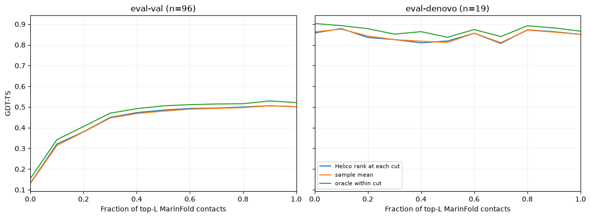
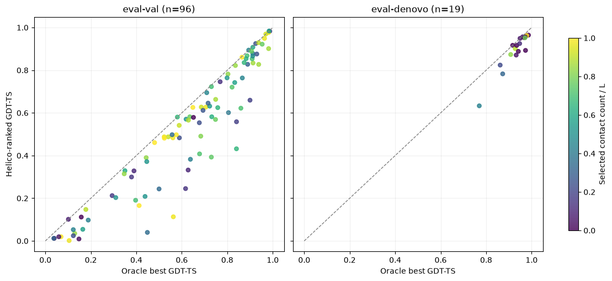

---
marinfold_experiment:
  issue: 311
  title: 'exp: Helico confidence selection across top-0 to top-L exp277 contacts'
  kind: evals
  branch: codex/helico-exp277-contact-sweep
---

# exp: Helico confidence selection across top-0 to top-L exp277 contacts

**Issue:** [#311](https://github.com/Open-Athena/MarinFold/issues/311) · **Kind:** `evals` · **Branch:** `codex/helico-exp277-contact-sweep`

## Question

For the registered latest MarinFold model, exp277 step 266344, how much does Helico structural accuracy vary as the number of supplied contacts changes from zero to top-L in steps of ten? How well does Helico's confidence ranking select among these predictions?

## Hypothesis

The top-L input is unlikely to be uniformly optimal across proteins. A sweep
may expose a better contact budget for an individual target, but Helico's
confidence head must identify the useful structure without seeing ground truth.
The practical quantity is therefore the gap between the oracle envelope and
the Helico-selected prediction, measured separately on natural eval-val and
designed eval-denovo targets.

## Approach

The contact source is the registered latest default, [exp277 step 266344](../../marinfold/marinfold/MODELS.yaml), scored with exp82's 100-rollout and resampling recipe. Its dense vote matrices are the existing [exp277 evaluation](../exp277_models_single_mpnn_pilot/README.md), so this experiment does not regenerate contacts. The structure model is Helico `contacts-msafree-01-step-6000.pt` (SHA-256 `779d540e5bb45cd26bb970188da2f1937ed3079942923a1356c29d06f20fe644`) at Helico git revision `b10385d736673c81b10e70d1099962af6f2573c0`.

`prepare.py` reads Helico exp14's FoldBench targets, ground-truth structures and independently verified prompt-to-token map. It ranks resolved upper-triangle residue pairs at sequence separation ≥6 with a stable descending sort of the exp277 score matrix. It verifies the predicted contact precision at L, L/2 and L/5 against exp277's committed per-protein scores before emitting lists. All **345 reference cuts on 115 targets matched to 1e-9**. One eval-val target, `7pv5_A`, is excluded: Helico exp14 found its sequence alignment ambiguous around a modified cysteine, so its prompt-to-token map is not verified. This gives 96 eval-val and 19 eval-denovo proteins. The input hashes and explicit exclusion are in [input_manifest.json](data/input_manifest.json).

For a target with MarinFold prompt length L, the cuts are 0, 10, 20, …, `10×floor(L/10)`, and exact L when it is not a multiple of ten. There are 3,089 target-cut pairs. Helico runs six trunk recycles and three diffusion samples at every cut with seed 42 reset per cut. It uses single-sequence mode with no MSA. Zero contacts leaves every pair unknown. At each positive cut, the **first k** ranked pairs are mapped to Helico tokens; no pairs are marked absent. Helico rejects any pair whose separation becomes <6 after unresolved residues are removed, as in the historical exp14 runner. This affects 54 of 29,239 requested top-L pairs across 24 targets (maximum eight for one target); `effective_contacts.csv` records the actual count at every cut. Every sample is scored through Helico's established atom matching: lDDT on matched atoms, and GDT-TS, TM-score and RMSD on matched Cα atoms.

`analyze.py` first reduces predictions **within each target**, then averages target summaries so longer proteins with more cuts do not dominate. For each metric the oracle is the best of all cuts and samples (minimum for RMSD); mean and median are over all predictions for that target. The confidence-selected result is one structure per target, selected by Helico's highest `ranking_score` across every cut and sample. The top-zero and top-L references select the best-ranked diffusion sample at their respective cuts. Oracle best is selected separately for each metric, so its different metric entries can describe different structures. Paired differences use a 10,000-resample protein bootstrap for 95% intervals. The primary curves use each target's nearest actual cut to 0, 0.1, ..., 1.0 of L, retaining the same proteins at every point. Absolute-k curves and their changing cohort counts are reported separately.

The frozen low-MSA-depth set from exp260 contains no natural eval-val proteins (its five FoldBench natural proteins are all in eval-test, which this experiment does not read). Thirteen of the 19 eval-denovo designs have MSA depth <10; their structural scores are reported separately in `low_msa_designed_summary.csv` without pooling them with natural proteins.

Run from this directory:

```bash
uv run python prepare.py --helico-exp14 /path/to/helico/experiments/exp14_foldbench_held_out_monomers
HELICO_DRY_RUN=1 uv run python run_sweep.py
uv run python run_sweep.py
uv run python analyze.py
uv run python build_summary.py
```

The exp14 directory must first have run its `build_eval_sets.py` and `build_index_map.py`; exp277's CoreWeave score files are read through the `cw` profile in `~/.aws/credentials`. `run_sweep.py` packages the pinned Helico source and uses the existing Helico Modal checkpoint volume. The dry run estimates 16.8 H100-hours, **$66.54** at [$3.95/hour](https://modal.com/pricing), below Helico's $100 cost gate. The runner writes each completed cut to a Modal results volume and streams target results to resumable local files before assembling the canonical tables.

## Success criteria

- Every target has all specified contact counts and all three diffusion samples, or an explicit failure; no unexplained missing rows.
- Results include GDT-TS, lDDT, TM-score, RMSD and confidence score per prediction, plus per-target timings and hardware metadata.
- Report the oracle envelope, mean, median, confidence-selected prediction, and exact-L confidence reference separately for eval-val and eval-denovo.

## Results

The [full Modal run](https://modal.com/apps/open-athena/main/ap-7FlRkgVXbuH8CHEtIFMRXm) completed all **115 targets × 3,089 cuts × 3 samples = 9,267 structures** with no failed or nonfinite rows. `7pv5_A` is the single preregistered exclusion. The recorded per-cut intervals sum to 13.89 H100-hours, equivalent to **$54.86 of measured GPU compute** at the run's $3.9492/hour rate. This is not an invoice total because it excludes container startup and idle time. Wall time was about 2 h 22 min; keeping all eight H100 containers resident for that entire interval would be an upper-bound estimate of about 18.9 H100-hours or $74.9.

In `timings.csv`, `n_pairs` is the canonical problem size, `n_residues × (n_residues - 1) / 2`; `n_contacts` and `n_effective_contacts` describe the sweep condition. `elapsed_seconds` is Helico inference. `total_seconds` adds the worker's model-load time to the recorded per-cut inference, scoring, and serialization path. The original run did not time the final consolidated driver CSV write, so that small component cannot be reconstructed.

The table below is target-weighted. “Mean” averages each target's samples and then the targets; “median” takes each target's median and then averages targets. “Helico-ranked” is one deployable choice per target: the highest Helico `ranking_score` among every cut and diffusion sample. “Oracle” chooses the best prediction independently for each structural metric, using ground truth. RMSD is Cα RMSD in Å and lower is better; the other metrics are higher-is-better.

| set | metric | oracle best | mean | median | Helico-ranked | top-0 ranked | top-L ranked |
|---|---|---:|---:|---:|---:|---:|---:|
| eval-val (n=96) | GDT-TS | **0.6242** | 0.4369 | 0.4703 | **0.5277** | 0.1323 | 0.5015 |
|  | lDDT | **0.6862** | 0.5876 | 0.6117 | **0.6462** | 0.3476 | 0.6306 |
|  | TM-score | **0.8082** | 0.6903 | 0.7197 | **0.7558** | 0.4158 | 0.7340 |
|  | Cα RMSD ↓ | **2.9395** | 5.0948 | 4.5872 | **4.3117** | 9.0688 | 4.4894 |
| eval-denovo (n=19) | GDT-TS | **0.9341** | 0.8439 | 0.8670 | **0.8990** | 0.8574 | 0.8503 |
|  | lDDT | **0.8620** | 0.8080 | 0.8152 | **0.8414** | 0.8254 | 0.8037 |
|  | TM-score | **0.9491** | 0.9029 | 0.9186 | **0.9336** | 0.9135 | 0.9061 |
|  | Cα RMSD ↓ | **0.6086** | 1.0706 | 0.8779 | **0.7715** | 1.0019 | 0.9717 |

### Confidence selection helps, but leaves measurable oracle headroom

On eval-val, sweeping and selecting by Helico confidence improves exact top-L by **+0.0262 GDT-TS** (95% paired bootstrap **[+0.0039, +0.0508]**) and **+0.0156 lDDT** (**[+0.0023, +0.0308]**). The metric oracle remains another **+0.0965 GDT-TS** (**[+0.0773, +0.1181]**) and **+0.0400 lDDT** (**[+0.0326, +0.0481]**) above the confidence choice. Confidence selects a median cut of 0.631L; it selects no contacts for only 2/96 targets and exact L for 5/96.

On eval-denovo, confidence selection scores **+0.0486 GDT-TS** against exact top-L (95% CI **[-0.0062, +0.1186]**) and **+0.0415** against no contacts (**[+0.0020, +0.1024]**). The top-L interval crosses zero because n=19 and designs vary strongly, but top-L is not a good universal default: confidence selects no contacts for 8/19 designs, exact L for only 1/19, and a median cut of 0.056L. The oracle headroom over confidence is smaller than on natural proteins: **+0.0352 GDT-TS** (**[+0.0211, +0.0518]**).

### The best fixed cut differs between natural proteins and designs

On the paired fraction-of-L grid, eval-val GDT-TS rises from 0.1323 with no contacts to 0.5060 at 0.9L, then ends at 0.5015 at exact L. eval-denovo starts at 0.8574, peaks at 0.8788 around 0.1L, and ends at 0.8503 at L. Per-target confidence selection beats every fixed fraction because different proteins prefer different cuts.





The frozen low-MSA designed subset (13/19 eval-denovo targets) scores 0.9202 confidence-selected GDT-TS, 0.9457 oracle GDT-TS, and 0.8472 at top-L. There is no natural eval-val member of exp260's frozen low-MSA set; its FoldBench natural members are in eval-test, which this experiment did not read.

Raw per-sample metrics, timings and the run manifest are committed under `data/` and published with the input bundle in the [public MarinFold HF bucket](https://huggingface.co/buckets/open-athena/MarinFold/tree/data/exp311-helico-exp277-contact-count-sweep/).

## Conclusion

Always handing Helico top-L contacts leaves accuracy on the table. For natural eval-val proteins, a top-0-to-L sweep plus Helico confidence selection improves GDT-TS from 0.5015 to 0.5277 and lDDT from 0.6306 to 0.6462. The oracle envelope of 0.6242 GDT-TS shows that substantially better structures already exist in the generated grid, but the confidence model does not identify all of them. For eval-denovo, the best policy is qualitatively different: Helico confidence often rejects contacts entirely and scores 0.8990 GDT-TS, while exact top-L scores 0.8503. Future deployment should search the contact count and rank candidates by Helico confidence; improving that confidence ranking is the clearest path to capture the remaining oracle headroom.
