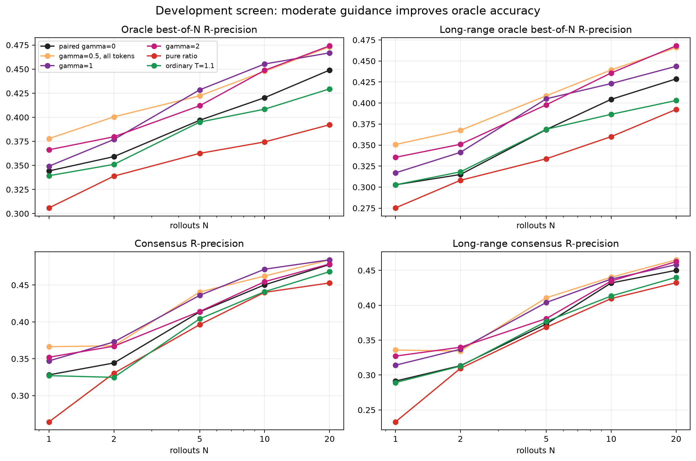
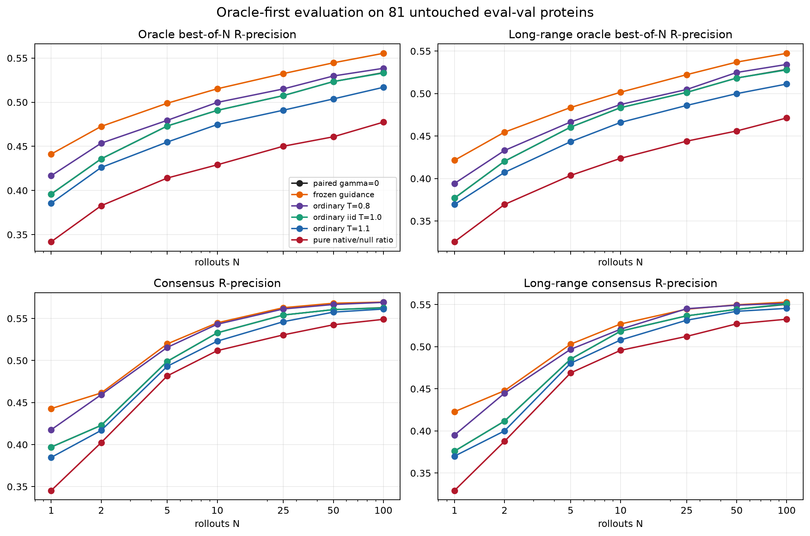
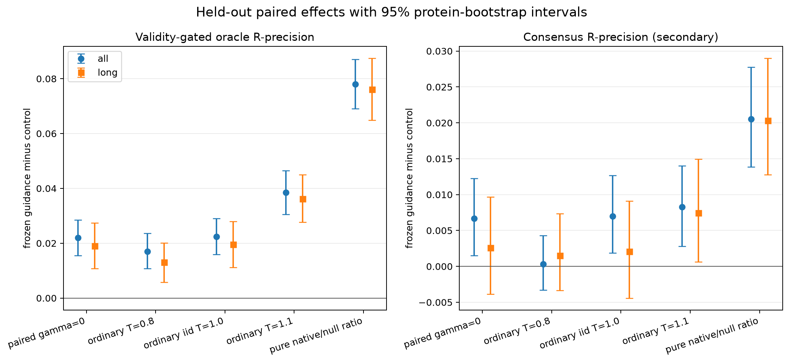
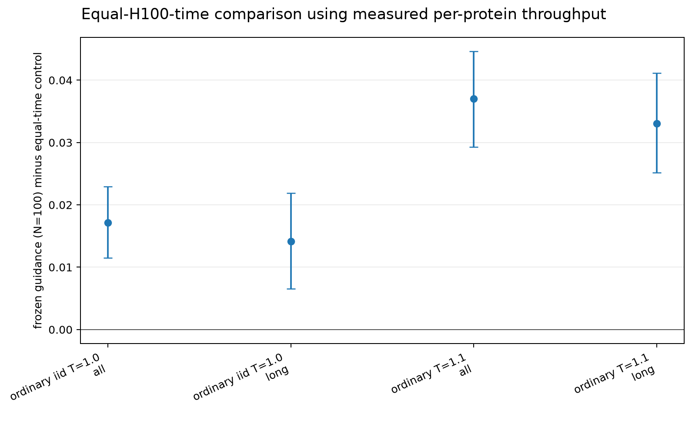
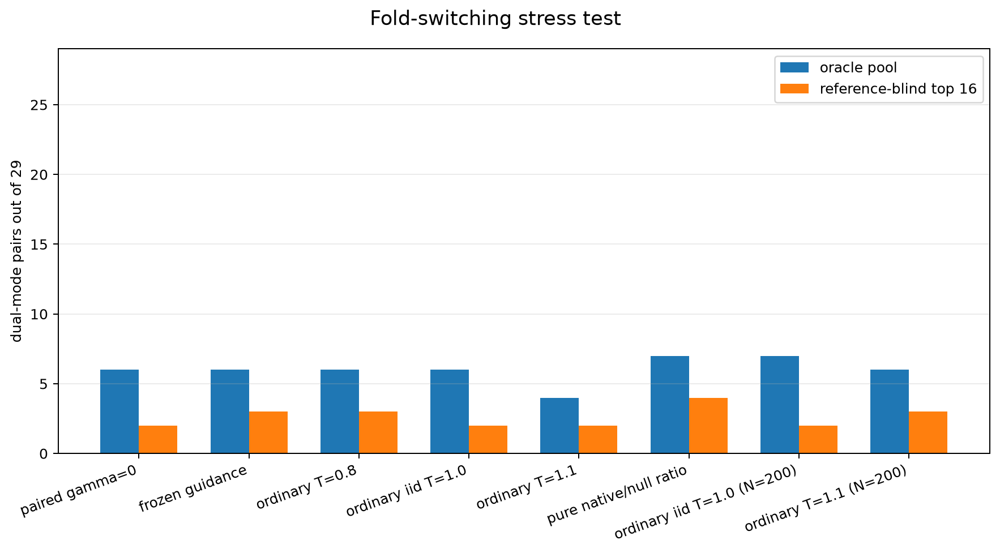

---
marinfold_experiment:
  issue: 321
  title: 'exp: null-sequence contrastive guidance for contacts-v1 rollouts'
  kind: evals
  branch: exp/321-sequence-contrastive-guidance
---

# exp: null-sequence contrastive guidance for contacts-v1 rollouts

**Issue:** [#321](https://github.com/Open-Athena/MarinFold/issues/321) · **Kind:** `evals` · **Branch:** `exp/321-sequence-contrastive-guidance`

## Question

Can a paired, null-sequence inference pass be used to subtract the sequence-independent contact-map prior during `contacts-v1` decoding, yielding more useful rollout diversity without sacrificing contact accuracy?

## Hypothesis

Yes, at moderate guidance strength. At decoding step `t`, run the same model on:

- the native sequence `x` followed by the generated contact-token prefix `y_<t`; and
- a same-length null sequence `x0` followed by the **identical** `y_<t`.

If their next-token logits are `l_x` and `l_0`, sample the native stream from

```text
g_gamma(v) = l_x(v) + gamma * (l_x(v) - l_0(v)).
```

`gamma=0` is ordinary decoding. Positive `gamma` amplifies tokens supported by the real sequence more than by the already-emitted contact map. This is CFG-like, but not literally classifier-free guidance: the second prompt is a sequence ablation, not a learned unconditional condition.

The raw ratio proposed in the motivating idea, `l_x - l_0`, is worth measuring as a diagnostic, but is not the safest primary decoder. A pure ratio can promote a token that is extremely unlikely under both streams merely because the null stream dislikes it slightly more. The primary implementation therefore retains the native logits as the base distribution and applies a native-probability plausibility gate before guidance.

Preregistered expectation:

- moderate guidance will increase **true-contact coverage across rollouts** and reduce rollout overlap while preserving consensus R-precision;
- very large `gamma`, pure-ratio decoding, or guidance on control tokens such as `<end>` will over-generate, increase malformed/low-probability output, or trade precision for indiscriminate novelty;
- the gain, if real, should survive both a homopolymer null and a composition-preserving shuffled-sequence null. A result unique to one null is a null-prompt artifact, not evidence for sequence-specific guidance.

## Background

- [#82](https://github.com/Open-Athena/MarinFold/issues/82) contains the strongest direct motivation. On three canonical proteins, replacing every residue with poly-alanine preserved most of the seeded-contact completion curve: with 32 true contacts in the prefix, native-sequence AUC was about 0.86-0.95 and poly-Ala AUC about 0.80-0.90. The model had learned a strong contact-map/topology prior and only a smaller sequence-dependent increment. The proposed decoder tries to isolate and amplify that increment online while forcing both passes to see exactly the same generated contacts.
- [#254](https://github.com/Open-Athena/MarinFold/issues/254) warns that raw diversity is not itself the bottleneck or the goal. One hundred ordinary rollouts already covered about 92% of true contacts on eval-val, and distinct one-contact seeds did not improve consensus. Success here must mean **precision-preserving useful diversity**, not merely more unique false pairs.
- [#306](https://github.com/Open-Athena/MarinFold/issues/306) and [#308](https://github.com/Open-Athena/MarinFold/issues/308) found that generic contact-block beam search and online novelty penalties worsened fold-mode coverage and/or ordinary accuracy at much higher cost. Sequence-contrastive guidance is different: it removes probability shared with a matched contact-history control instead of rewarding novelty indiscriminately.
- Use the current [#277](https://github.com/Open-Athena/MarinFold/issues/277) checkpoint, `contacts-v1-exp277-m2-p06-full-epoch-1.5B` at step 266344, so the result is comparable with the current rollout, fold-switching, beam, and novelty experiments.

## Approach

### 1. Implement paired decoding with an exact shared suffix

Build one normal `contacts-v1` prompt realization per rollout. Construct the background prompt by copying its token IDs and replacing only amino-acid token IDs; keep document type, sequence length, position tokens, shuffled statement order, termini, and absolute token positions identical.

Decode the two streams with one model in a paired cached-forward loop. Only the native stream samples. Every sampled native token is then appended to **both** streams, so the background pass is always conditioned on the exact contact/control-token history that produced the main rollout; it never generates an independent background rollout.

Primary null: poly-Ala, because #82 already establishes it as a topology-only control. Sensitivity null: one deterministic composition-preserving permutation of the native amino acids per protein. Include poly-Lys only as a development diagnostic; do not select a final result from a large menu of homopolymers.

Primary guidance applies only when the decoder is choosing the two position tokens of a syntactically valid `<contact> <pI> <pJ>` statement. `<contact>` versus `<end>` and other control/grammar tokens use native logits, preventing contact-count changes from masquerading as better contact choice. An all-token-guidance arm is a development ablation.

Before applying guidance, restrict candidates to the native stream's ordinary top-p=0.95 set. Then combine logits and sample at T=1.0. This keeps a tiny null denominator from resurrecting tokens the native model considers implausible. Sweep `gamma in {0, 0.25, 0.5, 1, 2}` on development data. Also run the pure log-ratio score within the same native plausibility set as a labeled diagnostic, not as the assumed winner.

The worker must retain ordered per-rollout contact sets, completion/malformed status, generated-token count, and per-contact native/background log-probability differences. Add a unit test showing that the background suffix after `<begin_statements>` is token-for-token identical to the native suffix at every step.

### 2. Development and freeze

Use the 15 fold-switching development pairs from #304/#306 plus a fixed, length-stratified 16-protein subset of natural eval-val. Do not use eval-test.

First run a cheap teacher-forced diagnostic on ordinary-rollout prefixes: score completed contact statements under native and null prompts and ask whether the within-protein `log p_native - log p_null` separates true from false emitted contacts. Then run 20 rollouts per development protein for the guidance grid.

Freeze exactly one null, guidance scope, plausibility rule, and nonzero `gamma` before running the remaining natural eval-val proteins or the 29 primary fold-switching proteins. Selection criterion is the accuracy/diversity Pareto frontier, not diversity alone. If no nonzero setting preserves accuracy on development, stop and report the diagnostic rather than spending the full run.

### 3. Controls and full evaluation

Run 100 rollouts per protein for the frozen guided decoder and these controls:

1. the published iid recipe: T=1.0, top-p=0.95, no top-k, fresh document realization, token budget `6L+128`;
2. `gamma=0` in the new paired decoder, to isolate implementation/backend effects;
3. an ordinary temperature/top-p setting chosen on development to match the guided arm's rollout overlap or token entropy, to test whether guidance does more than flatten sampling.

Use common document realizations and sampling seeds across arms where semantics permit. Report both equal-rollout and equal-H100-second comparisons: guidance requires roughly two forward streams, so it must also compete with however many ordinary iid rollouts fit in the same measured time.

Full natural evaluation: all 97 eval-val proteins, with the 16 development proteins broken out and the other 81 reported separately. The zero-guidance control must reproduce #306's established exp277 iid result (R-precision about 0.5538 all-range and 0.5380 long-range) within 0.005 before guided results are interpreted.

Fold-diversity stress test: the 29 primary #304 fold-switching pairs, using the same fold-specific contact definitions and reference-blind 16-map selector as #306/#308. This cohort is no longer pristine to the project, so treat it as a fixed comparative stress test, seal predicted maps before scoring, and do not describe it as a newly unseen benchmark. A contact-map hit is not a recovered 3D fold without the existing structural validation gate.

### 4. Metrics

Compute curves at `N in {1, 2, 5, 10, 25, 50, 100}` from each 100-rollout pool.

Accuracy:

- standard vote-consensus R-precision, all-range and long-range;
- mean individual-rollout R-precision;
- completion rate, malformed rate, contacts per rollout, and vote concentration.

Useful diversity:

- true-contact union recall and number of distinct true contacts observed versus N;
- mean pairwise contact-set Jaccard similarity;
- number of distinct canonical contact maps and effective vote-support size;
- precision of contacts newly added to the union relative to iid.

Sequence-dependence diagnostics:

- within-protein AUC / paired difference for statement-level `log p_native - log p_null` on true versus false emitted contacts;
- guidance strength versus native likelihood, contact count, and malformed rate;
- agreement of effect direction between poly-Ala and composition-shuffled nulls.

Fold-switching:

- Fold1-only and Fold2-only recall, minority-mode enrichment, oracle dual-mode pool coverage, and reference-blind top-16 dual-mode coverage, using #304's definitions;
- equal-rollout and equal-time comparisons against iid, #306, and #308.

Use paired protein bootstrap intervals. Preserve per-input timing and worker metadata in `data/timings.csv` using the repository-wide predictor schema. Publish large rollout/logit artifacts to the public `open-athena/MarinFold` HF bucket and commit the small aggregate tables, plots, run manifest, and sealed-map hashes.

## Success criteria

1. **Validity gate:** `gamma=0` in the paired implementation reproduces the established exp277 iid eval-val all- and long-range R-precision within 0.005, with comparable completion and contact-count distributions. Otherwise stop and fix the decoder before interpreting guidance.
2. **Primary:** on the 81 non-development eval-val proteins, the frozen guided setting improves the area under the true-contact-union-recall-versus-log-N curve over both iid and the entropy-matched ordinary-sampling control, with a paired 95% bootstrap interval excluding zero, while all- and long-range consensus R-precision each regress by no more than 0.005.
3. **Compute check:** the useful-diversity advantage remains visible against the equal-H100-second iid control. If it exists only at equal rollout count, report it as a quality/compute tradeoff rather than an inference win.
4. **Secondary:** report whether guidance improves reference-blind or oracle dual-mode coverage on the fixed 29-pair fold-switching stress test. A fold-switching gain is not required for the general contact result, but a loss must be explicit.
5. Raw Jaccard reduction, unique-map count, or entropy alone does **not** count as success. If true-contact coverage or accuracy does not improve, the conclusion is that subtracting this null prior creates novelty rather than useful sequence-conditioned hypotheses.

### Objective amendment: oracle best-of-100

After the development screen and after the original full arms had been launched, the experiment owner clarified that consensus accuracy was not important: the intended product objective is **oracle best-of-100 contact accuracy**, and an improvement confined to that endpoint is useful. The full generations were therefore retained, but the primary analysis was changed before reading their accuracy labels:

- score every individual rollout in emission order at exp89's `R` cutoff (the number of true contacts in that range), with repeated contact statements occupying only their first rank;
- assign zero accuracy to an unfinished rollout or any rollout containing a malformed contact statement, rather than silently dropping it;
- report the best valid rollout in each `N in {1, 2, 5, 10, 25, 50, 100}` prefix, all-range and long-range;
- compare 100 guided rollouts with both 100 ordinary rollouts and however many single-stream rollouts fit the measured paired-guidance H100 time;
- run the literal pure native/null ratio at full scale despite its weak development result, plus 200 ordinary `T=1.1` rollouts as a high-diversity and equal-time control.

This amendment, its validity rule, the development values visible at the time, and the two added arms were frozen in [`data/oracle_followup.json`](data/oracle_followup.json) before those arms were launched. Consensus, union recall, and fold-mode coverage remain secondary diagnostics.


## Results

### Run and validity gates

The experiment generated 108,860 rollouts (98.8 million generated tokens) across 1,159 target/mode predictor runs. Development used 16 length-stratified natural eval-val proteins and 15 primary fold-switch pairs. The final natural comparison used all 97 eval-val proteins, reporting the 16 development proteins separately from the other **81 proteins that were untouched during method selection**. No eval-test proteins were read.

The paired gamma=0 decoder passes the implementation gate. Across all 97 eval-val proteins its consensus R-precision is 0.5531 all-range and 0.5387 long-range, respectively -0.0007 and +0.0007 from #306's established 0.5538/0.5380 reference. All 120 full-run Iris jobs succeeded without retry.

The initial development screen selected all-token poly-Ala guidance with gamma=0.5. At best-of-20 it improved validity-gated oracle R-precision from 0.4490 to 0.4733 all-range (paired delta +0.0243, 95% bootstrap CI +0.0101 to +0.0389) and from 0.4287 to 0.4660 long-range (+0.0372, CI +0.0143 to +0.0608). The literal pure-ratio arm was already worse at 0.3923/0.3924, which is why it remained a confirmatory rather than selected arm.



### Primary result: bounded guidance improves oracle best-of-100

On the 81 untouched eval-val proteins, the frozen guided decoder improves validity-gated oracle best-of-100 R-precision over every ordinary-sampling control:

| Decoder, N=100 | All-range | Long-range |
|---|---:|---:|
| **poly-Ala guidance, gamma=0.5, all tokens** | **0.5554** | **0.5474** |
| ordinary iid, T=1.0 | 0.5331 | 0.5279 |
| paired implementation, gamma=0 | 0.5335 | 0.5284 |
| ordinary T=0.8 | 0.5384 | 0.5343 |
| ordinary T=1.1 | 0.5169 | 0.5112 |
| pure native/null ratio | 0.4774 | 0.4713 |

Against ordinary iid sampling, the paired protein-level improvement is **+0.02235 all-range** (95% bootstrap CI +0.01588 to +0.02899) and **+0.01952 long-range** (+0.01119 to +0.02800). It also beats the overlap-matched T=0.8 control by +0.01699/+0.01310 and the high-diversity T=1.1 control by +0.03853/+0.03616; all four intervals exclude zero.

The gain is not an artifact of discarding failures. The primary metric assigns zero to unfinished rollouts and to any rollout with a malformed contact statement. Guidance had 37 invalid rollouts among 8,100; ordinary iid had 28. In both cases the best rollout for every protein was valid, so the raw and validity-gated oracle means coincide for guidance and differ by only 0.00004 for iid.





### What changed: stronger samples, not more diverse samples

This is a positive result for the amended oracle objective, but not for the original useful-diversity hypothesis. Guidance raises mean validity-gated single-rollout R-precision from 0.4073 to 0.4340 all-range, while making maps **more** similar (pairwise Jaccard 0.3334 versus 0.2846) and reducing true-contact union recall at N=100 (0.9175 versus 0.9364). Consensus R-precision is slightly higher, 0.5695 versus 0.5625, but is secondary here.

The native/null contrast therefore acts as a per-sample quality or concentration control in this regime. It improves the upper tail that an oracle can choose from even though the pool spans fewer distinct true contacts. This distinction matters operationally: the result is useful only when a downstream selector can identify unusually good rollouts; it is not itself such a selector.

The literal ratio behaves in the opposite way. It increases union recall to 0.9612 and lowers Jaccard to 0.2552, but its best-of-100 score collapses to 0.4774. It also produces 249 invalid rollouts, 558 malformed statements, and 353 contacts per rollout, versus 28, 34, and 262 for iid. The ratio signal is real as a diagnostic—on ordinary development rollouts it separates true from false emitted contacts with within-protein AUC 0.564 (95% CI 0.550 to 0.579)—but removing the native-logit base distribution turns that weak signal into indiscriminate over-generation.

### The gain survives compute matching

One hundred paired guided rollouts cost the same measured H100 inference time as a median 132 ordinary T=1.0 rollouts (mean 131.1) or 115 T=1.1 rollouts (mean 118.3), calculated separately for each protein from its captured timing.

Against that equal-time T=1.0 pool, guidance remains better by **+0.01714 all-range** (95% CI +0.01149 to +0.02293) and **+0.01415 long-range** (+0.00657 to +0.02191). It also beats equal-time T=1.1 by +0.03705/+0.03302. Even granting iid a full 200 rollouts, guided N=100 remains +0.00969 all-range (CI +0.00318 to +0.01560) and +0.00561 long-range (CI -0.00186 to +0.01282).



### Fold-switch stress test is suggestive but reliability-limited

On the fixed 29-pair fold-switch stress set, frozen guidance recovers both modes for 6/29 pairs in the oracle pool and 3/29 with the reference-blind top-16 selector, versus 6/29 and 2/29 for iid. Pure ratio reaches 7/29 and 4/29 even after invalid rollouts are forced to fail, but it is not a usable decoder: only 2,774/2,900 rollouts finish, 261 are invalid, and they contain 5,329 malformed contact statements. That one-pair oracle difference is therefore reported as a stress-test observation, not evidence of a robust fold-switching improvement. At N=200, iid reaches 7/29 oracle and 2/29 blind.



### Compute and artifacts

The captured timing table totals 45.14 H100 inference-hours (45.57 hours including apportioned model load and output writes). The paired guided N=100 arm accounts for 5.26 hours; pure-ratio N=100 costs 9.58 hours because it emits much longer documents. Timings include worker/GPU metadata and one row per input/mode.

- Primary per-protein curves and summaries: [data/heldout_natural.csv](data/heldout_natural.csv), [data/heldout_natural_summary.csv](data/heldout_natural_summary.csv), and [data/heldout_paired_deltas.csv](data/heldout_paired_deltas.csv).
- Equal-time analysis: [data/equal_time_natural.csv](data/equal_time_natural.csv) and [data/equal_time_summary.csv](data/equal_time_summary.csv).
- Fold-switch results and sealed raw-map hashes: [data/heldout_foldswitch.csv](data/heldout_foldswitch.csv) and [data/sealed_foldswitch_artifacts.csv](data/sealed_foldswitch_artifacts.csv).
- Predictor timing table: [data/timings.csv](data/timings.csv).
- Run and objective-freeze records: [data/run_manifest.json](data/run_manifest.json) and [data/oracle_followup.json](data/oracle_followup.json).
- Public raw rollout/timing parquets: [HF bucket, data/exp321/null-sequence-guidance-v1](https://huggingface.co/buckets/open-athena/MarinFold/tree/main/data/exp321/null-sequence-guidance-v1) (2,318 files, 174 MB uploaded; anonymously listed and sample-read).
- Working copy: s3://marin-us-east-02a/MarinFold/exp321/null-sequence-guidance-v1.

## Conclusion

There is merit, with one important correction to the original proposal. **Do not sample from the pure native/null probability ratio.** It produces broader but substantially worse and less reliable rollouts. Retaining the native logits and adding a bounded contrast,

~~~text
logits_guided = logits_native + 0.5 * (logits_native - logits_polyAla),
~~~

does improve the objective the experiment owner cares about: oracle best-of-100 R-precision rises by about two points all-range and long-range, with confidence intervals excluding zero and with a positive equal-H100-time comparison. The effect comes from better individual samples, not greater rollout diversity.

The next experiment should focus on a deployable selector for this improved upper tail—ideally one that does not use structure truth—rather than further flattening or ratio-only sampling. Without such a selector, the oracle gain remains an upper bound; with one, bounded null-sequence guidance is a credible inference-time improvement.
