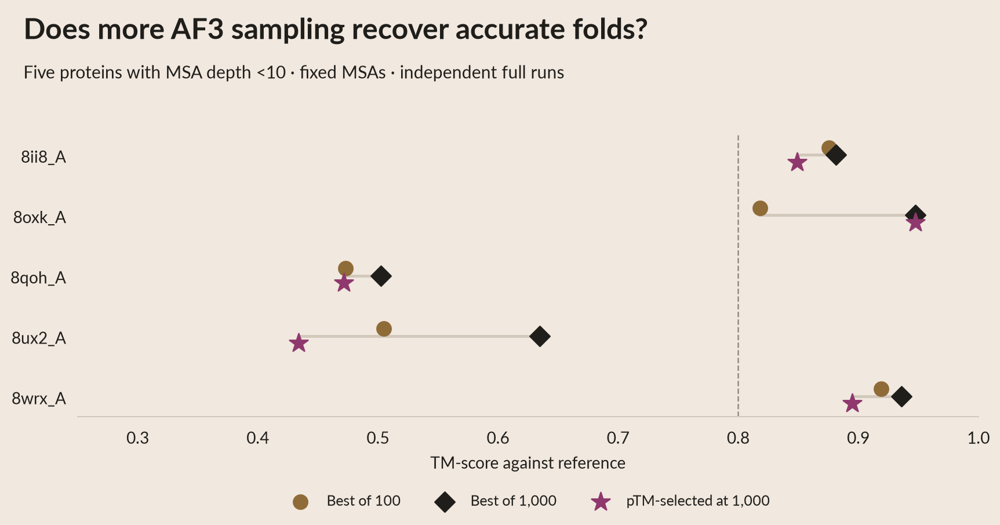

# AlphaFold3 sampling on five very shallow MSAs

User-requested diagnostic on `8ii8_A`, `8oxk_A`, `8qoh_A`, `8ux2_A`, and
`8wrx_A`. All five are natural FoldBench eval-test proteins, with archived MSA
depths 3, 6, 3, 6, and 4. These are raw A3M row counts including the query,
not effective evolutionary counts or estimates of training-set exposure.

## Protocol

The [frozen protocol](data/af3_sampling_protocol.json) specifies 100 fresh runs
per protein, extended to 1,000 for all five if any protein has no TM-score
at least 0.8 in the first 100. The threshold is a working definition of an
accurate prediction for this experiment; continuous scores and counts above
0.5 and 0.7 are also retained.

Each seed is a **complete independent AF3 forward run**, including fresh
featurisation and the trunk, followed by **one diffusion sample**. Seeds
10000–10999 form the fixed sampling order. Ten recycles, the exact archived
ColabFold MSA, protein chain only, no templates, no relaxation. This tests
additional sampling under the existing shared-MSA recipe; it does not test
AF3's full default database search or alternate MSA/assembly inputs.

Official AF3 source: `3c89cc7b89aa7042b72885af9016a45b262da008`. Parameters:
`params-20241113/af3.bin.zst`, SHA-256
`0dd0290af76eec0119f4c0c41f441fbce4ec18aa21a0a02cac4a3af01d841369`.
The adapter hash, per-protein sequences and MSA hashes are in the protocol.
Weights remain private in the existing Modal volume; no new weight transfer
was required. Inference uses up to 20 resident H100 workers in us-east.

**Highest full-precision pTM selects a prediction.** Official AF3
`ranking_score` selection is retained as a separate diagnostic. The standard
AF3 confidence JSON rounds values to two decimals; new runs additionally save
unrounded pTM and ranking_score directly from model metadata. Exact ties use
the earliest seed. The best TM-score uses reference structures only for
offline analysis and is explicitly an oracle, not an inference-time selector.

## Accuracy and original-run comparison

The scorer verifies predicted sequence/residue correspondence and matches
atoms by query position and name. TM-score uses matched CA atoms through
TM-align, normalized by the reference chain; GDT-TS, all-atom lDDT and RMSD
use the same code as the other exp325 AF3 comparisons. Helico metric revision:
`b10385d736673c81b10e70d1099962af6f2573c0`. No Helico model runs in this analysis.

The original AF3 baseline had **five full seeds × five diffusion samples**,
selected by official ranking_score. All 25 original candidates are scored
separately, never added to the new seed prefixes. Their historical pTM JSON
values have two-decimal precision. A regression check requires reproducing
the original five selected TM-scores within 1e-8.

The curves follow the prespecified ascending-seed order. They describe this
realized sample pool, not an expectation over random sampling orders. Five
proteins remain five biological examples; 5,000 draws do not enlarge the
benchmark population. A failure to observe TM ≥0.8 does not show that AF3 can
never generate an accurate structure.

## Reproduce and trace each point

Run commands from this experiment directory:

```bash
AF_VARIANT=af3 uv run --project generation modal run generation/run_af3_sampling.py --budget 100
uv run --project /home/bizon/git/helico --no-sync --with scikit-learn python generation/score_af3_sampling.py --budget 100
uv run python prepare_af3_sampling.py
# If any first-100 pool has no TM >=0.8, extend all five:
AF_VARIANT=af3 uv run --project generation modal run generation/run_af3_sampling.py --budget 1000
uv run --project /home/bizon/git/helico --no-sync --with scikit-learn python generation/score_af3_sampling.py --budget 1000
uv run python prepare_af3_sampling.py
# Aesthetics-only iteration, with no inference or structural scoring:
uv run python render_af3_sampling.py
uv run python build_summary.py
uv run python publish_af3_sampling.py --upload
```

The runner verifies weights, MSA and protocol on workers, gates the pilot on
the longest protein, commits bounded seed chunks, and resumes completed seeds.
`--collect-only` recovers output without generating predictions. Local
structure-score caches are keyed by structure/reference hashes, sequence and
metric implementation. Parameter files are excluded from exported artifacts.

| Figure element | Prepared source | Analysis |
|---|---|---|
| One TM versus pTM dot | `data/af3_sampling_samples.csv`, keyed by `(stem, seed)` | `generation/score_af3_sampling.py`; CIF path and SHA-256 on the same row |
| Best / pTM-selected curve at budget N | `data/af3_sampling_curves.csv`, `(stem, budget)` | `prepare_af3_sampling.py`; selected seed IDs on the same row |
| 100 / 1,000 comparison and hit counts | `data/af3_sampling_summary.csv` | Fixed prefix rows from the same curves |
| Original selected baseline | `data/af3_sampling_original.csv` | Highest official ranking_score among the original 25 candidates |
| Per-run timing and hardware | `data/af3_sampling_timings.csv` | Captured at inference; model setup is shared across seeds and reported separately |

Raw structures, confidences, timings, input MSAs and reference CIFs are
published in the [public artifact directory](https://huggingface.co/buckets/open-athena/MarinFold/tree/data/exp325-writeup-analysis/af3-sampling-2026-10-06).
`data/af3_sampling_publication.json` contains the file inventory and checksums.
Extract each `raw/<stem>.tar.gz` into `scratch/af3_sampling/results/` to restore
the paths in the per-sample CSV. The public package includes no weights.

## Results

All **5,000 new predictions completed**: 1,000 independent full runs for each protein. The first 100 results and their timing records are unchanged from the pilot. Every candidate matched the full resolved CA chain; the original five selected baseline TM-scores reproduce within 1e-8.

| Protein | Best TM, original 25 | Best TM, new 100 | Best TM, new 1,000 | pTM-selected TM, new 1,000 | TM ≥0.8 / 1,000 |
|---|---:|---:|---:|---:|---:|
| 8ii8_A | 0.874 | 0.876 | 0.881 | 0.849 | 978 |
| 8oxk_A | 0.516 | 0.818 | 0.947 | 0.947 | 20 |
| 8qoh_A | 0.471 | 0.473 | 0.502 | 0.472 | 0 |
| 8ux2_A | 0.432 | 0.505 | 0.635 | 0.434 | 0 |
| 8wrx_A | 0.918 | 0.919 | 0.936 | 0.895 | 1000 |

**Extra sampling rescues 8oxk_A.** The first TM ≥0.8 appears on draw 85
(seed 10084), and the best structure reaches TM 0.947 on draw 471 (seed 10470).
Highest pTM also selects seed 10470. Twenty of the 1,000 runs (2%) reach
TM ≥0.8. At a budget of 100, the best candidate's TM was 0.818 while the
pTM-selected candidate's TM was 0.643; increasing the pool improves both
candidate generation and final confidence selection in this case.

8ii8_A and 8wrx_A already fold well in the original baseline. 8qoh_A and
8ux2_A remain below TM 0.8 after 1,000 runs (maxima 0.502 and 0.635), and
neither reaches 0.7. This is a failure to find an accurate prediction within
this fixed budget and input recipe, not evidence that accuracy is impossible.



Per-protein PDFs: [8ii8_A](plots/01b_af3_sampling_8ii8_A.pdf) ·
[8oxk_A](plots/01b_af3_sampling_8oxk_A.pdf) ·
[8qoh_A](plots/01b_af3_sampling_8qoh_A.pdf) ·
[8ux2_A](plots/01b_af3_sampling_8ux2_A.pdf) ·
[8wrx_A](plots/01b_af3_sampling_8wrx_A.pdf).
The [complete slide deck](plots/summary.pdf) includes all five as individual pages.
