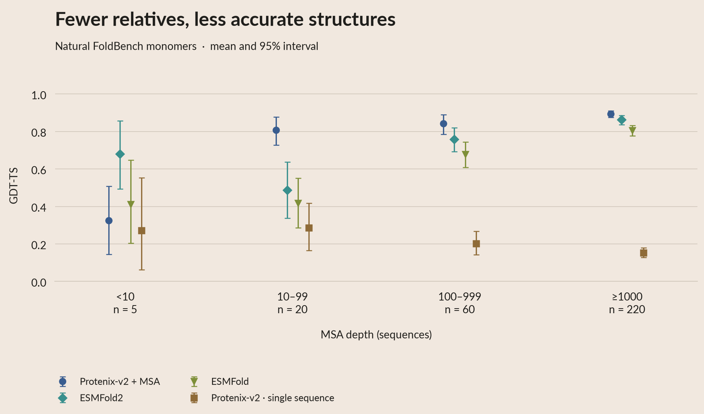
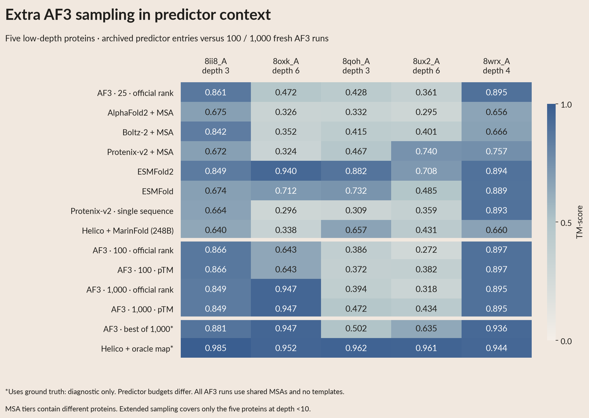
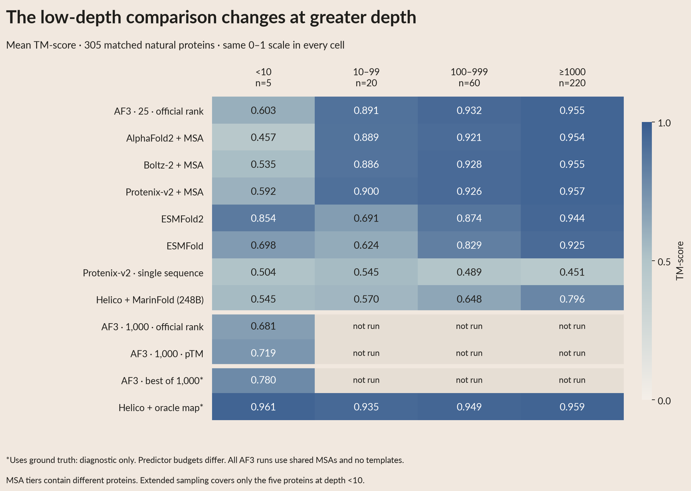
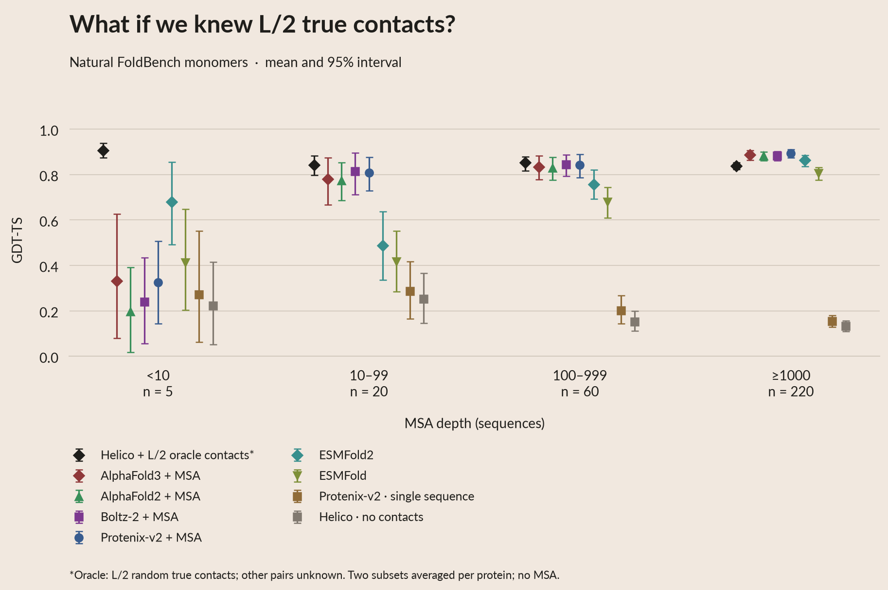
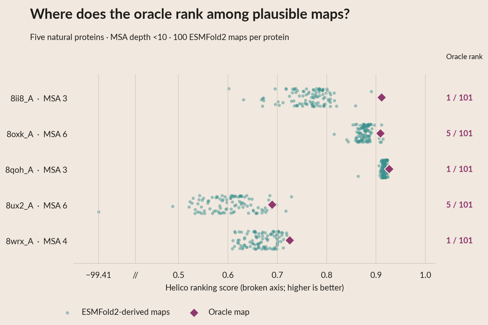
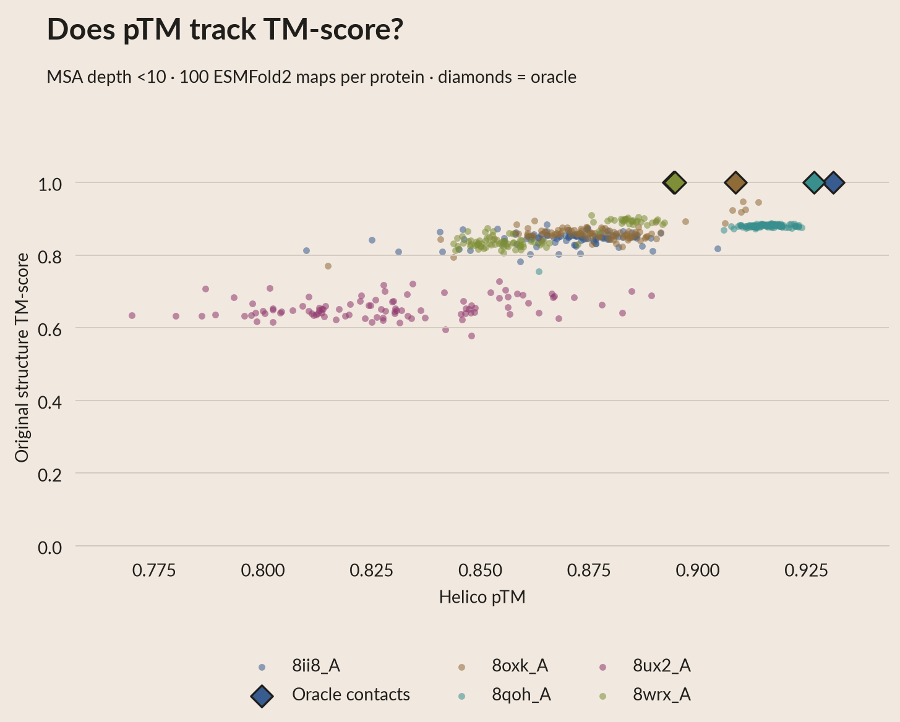
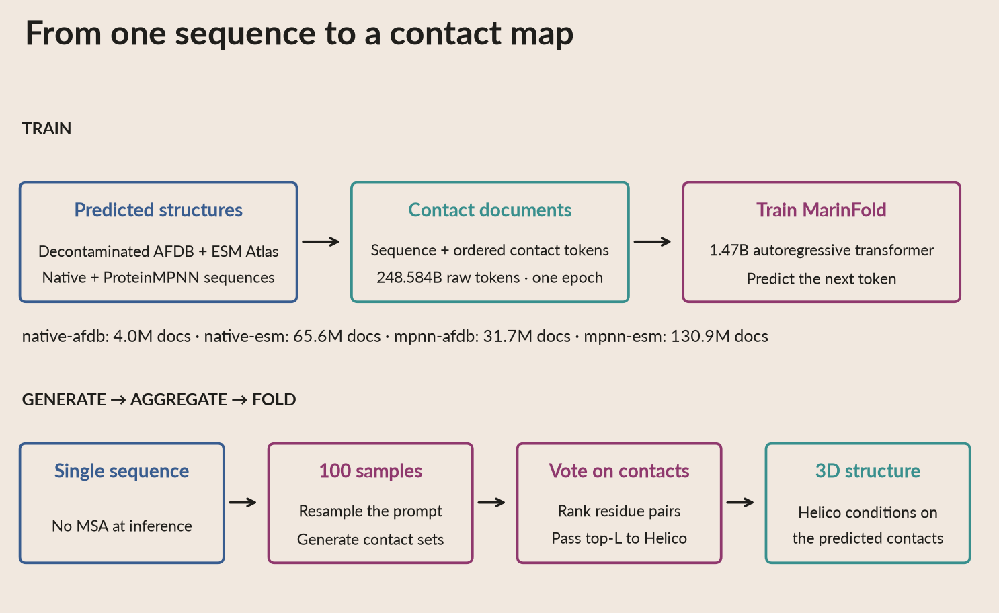
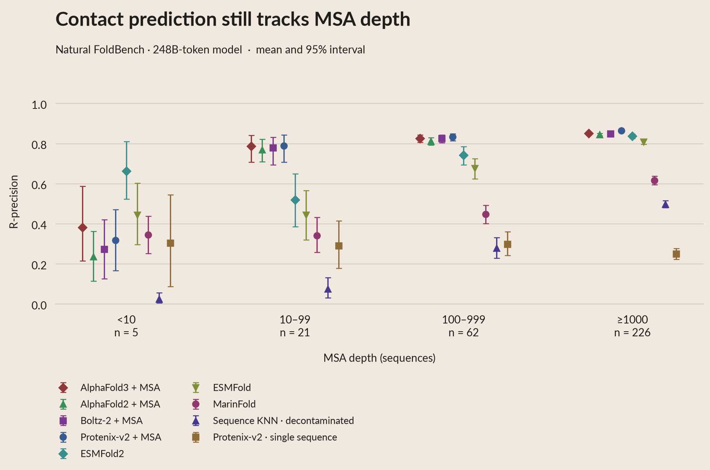
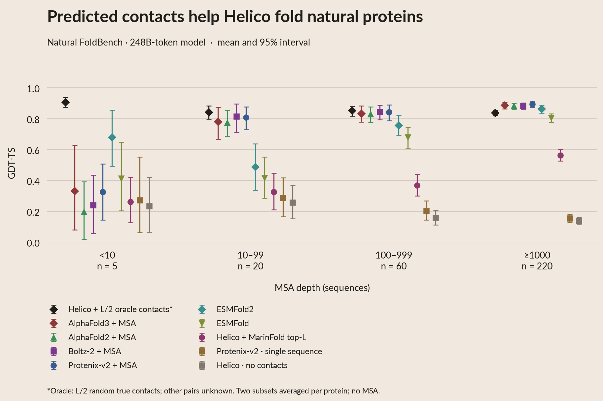
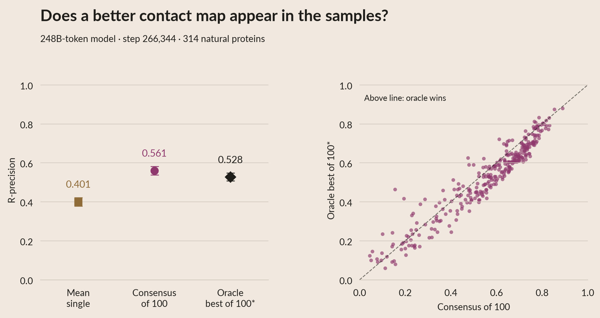

Accurate folding remains harder for proteins with shallow benchmark MSAs. Improving here could also help protein design. These depth counts do not establish how many homologs appeared in a predictor's training data.

AlphaFold2, AlphaFold3 and Boltz-2 use the shared benchmark MSAs here, with templates disabled.

More AF3 sampling brings 8oxk_A from TM 0.472 to 0.947, close to ESMFold2’s
existing 0.940. Two low-depth proteins remain below 0.8 after 1,000 runs.
These AF3 runs use ten recycles and fixed benchmark MSAs without templates;
the baseline is five seeds × five samples, the expansion 1,000 seeds × one.
[Protocol and per-protein plots](AF3_SAMPLING.md).

ESMFold2 still has the higher mean TM on these five proteins: 0.854 versus
0.719 for pTM-selected AF3 at 1,000 runs (0.681 with official ranking).

The existing AF3 baseline is stronger than ESMFold2 in the three deeper MSA
bins. Extra sampling has only been tested in the shallowest bin.

Helico does much better when we give it the answer: the ground-truth contact map, including non-contacts. This is an information upper bound.

Aside: ranking by pTM puts the oracle first for four low-depth proteins and fifth for one.

Among plausible candidates, TM-score versus pTM shows a stronger relationship for one protein and weaker relationships for the other four.

This suggests generating candidate contact sets directly from sequence, trained on structures from existing predictors.

Our current 1.47B-parameter model saw 248.584B raw tokens. Here is its contact accuracy, followed by the structures Helico produces from its top-L contacts.

Low-depth proteins remain the challenge. Consensus R-precision is 0.561; oracle selection of an individual sample gives 0.528. The maps are distinct, but useful whole-map alternatives remain limited.

Next: better candidate diversity, inference-time search, and post-training.

<!-- Placeholder prose. Copy figure captions from theme.py when integrating into
the site; each states the population, uncertainty, conditioning and oracle limits.
Use data/summary.csv and data/paired_deltas.csv for exact values.
This draft embeds PNGs for GitHub. See RUNBOOK.md for the corresponding
interactive website embeds. -->
