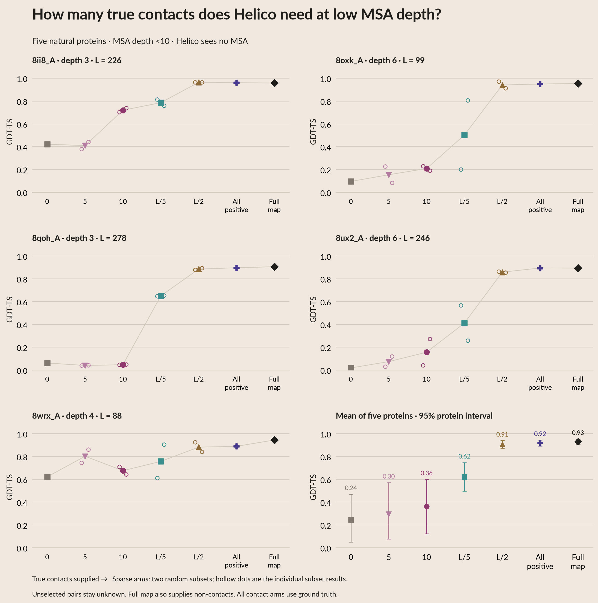
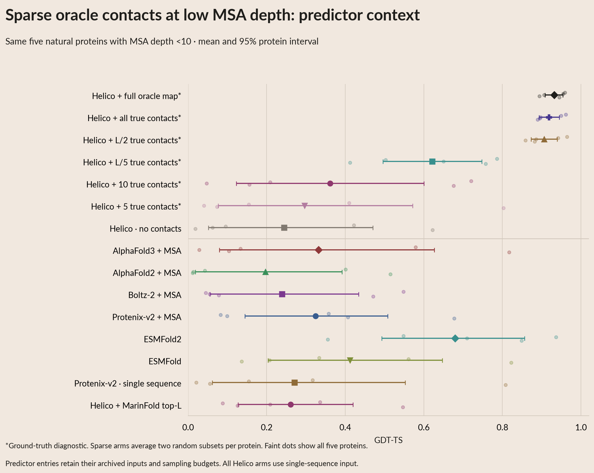

# Sparse oracle contacts at very low MSA depth

Completed on **all five natural Figure 02 proteins with MSA depth <10**,
as requested. No other proteins were folded for this sweep. All five are in
the previously authorized test split. This is a ground-truth conditioning
diagnostic: the supplied contacts are known to be correct.

**L/2 true contacts gets close to the full oracle map; ten contacts is usually
insufficient.** Mean GDT-TS rises from 0.244 without contacts to 0.362 with ten,
0.622 with L/5, and 0.906 with L/2. The full positive/negative oracle scores
0.932. The L/2-minus-full gap is −0.025 (95% paired protein-bootstrap interval
−0.046 to −0.007). With only five proteins and two subsets per budget, these
results describe this small cohort rather than a precise population estimate.

## Per-protein GDT-TS

| Protein | MSA depth | No contacts | 5 | 10 | L/5 | L/2 | All positives | Full oracle |
|---|---:|---:|---:|---:|---:|---:|---:|---:|
| 8ii8_A | 3 | 0.422 | 0.410 | 0.720 | 0.786 | 0.964 | 0.961 | 0.959 |
| 8oxk_A | 6 | 0.096 | 0.154 | 0.209 | 0.503 | 0.941 | 0.949 | 0.955 |
| 8qoh_A | 3 | 0.062 | 0.040 | 0.047 | 0.650 | 0.885 | 0.897 | 0.906 |
| 8ux2_A | 6 | 0.019 | 0.074 | 0.156 | 0.412 | 0.858 | 0.895 | 0.894 |
| 8wrx_A | 4 | 0.622 | 0.802 | 0.676 | 0.757 | 0.882 | 0.890 | 0.945 |
| **Mean** | | **0.244** | **0.296** | **0.362** | **0.622** | **0.906** | **0.918** | **0.932** |

Sparse entries average two independently sampled subsets after selecting one
of three diffusion samples by confidence for each subset. No subset is chosen
using its accuracy. The hollow dots below retain both subset outcomes.
For example, L/5 on 8oxk_A gives GDT-TS 0.199 and 0.806: which true contacts
are revealed can matter substantially.

[Vector PDF](plots/02e_oracle_budget.pdf) ·
[lDDT counterpart](plots/02e_oracle_budget_lddt.pdf) ·
[Exact GDT-TS table](data/oracle_budget_gdt_table.csv)

## Predictor context

The same five proteins have archived mean GDT-TS **0.680 for ESMFold2**,
0.412 for ESMFold, 0.332 for AF3, 0.325 for Protenix + MSA, 0.271 for
Protenix single sequence, 0.261 for Helico + MarinFold, 0.239 for Boltz-2,
and 0.197 for AF2. Their original input and sample-selection protocols are
retained. The oracle arms receive experimental information and serve as
diagnostics, not deployable predictors.

[Context PDF](plots/02f_oracle_budget_context.pdf) ·
[Interactive preview](site/index.html#section-02e_oracle_budget) ·
[White poster PDFs/SVGs and 7,200-pixel PNGs](POSTER.md)

## Frozen protocol

For each protein, sample two independent random permutations of its true
contacts, without replacement. Each permutation supplies nested subsets of
**5**, **10**, **floor(L/5)** and **floor(L/2)** pairs. L is the frozen FoldBench
input sequence length. Relative budgets cap at the available positive count;
**no cap was needed for these five proteins**. All unselected pairs are unknown,
including pairs that happen to be true non-contacts. Contact geometry is
unchanged: Helico's pyconfind oracle, 3 Å contact distance, degree ≥0.001,
sequence separation ≥6.

| Protein | L | L/5 contacts | L/2 contacts | All positive contacts |
|---|---:|---:|---:|---:|
| 8ii8_A | 226 | 45 | 113 | 138 |
| 8oxk_A | 99 | 19 | 49 | 95 |
| 8qoh_A | 278 | 55 | 139 | 266 |
| 8ux2_A | 246 | 49 | 123 | 216 |
| 8wrx_A | 88 | 17 | 44 | 78 |

Three controls use the same inference setup: no contacts, all true contacts
with other pairs unknown, and the full oracle map including true non-contacts.
This separates positive-contact coverage from negative information.

Helico stays at `contacts-msafree-01-step-6000`, checkpoint SHA-256
`779d540e5bb45cd26bb970188da2f1937ed3079942923a1356c29d06f20fe644`, source
`b10385d736673c81b10e70d1099962af6f2573c0`. **No MSA**; three diffusion samples,
six recycles, seed 42 per map. The main comparison keeps Figure 02's original
highest-`ranking_score` sample selection. Average the two map results within
each protein, then give each protein equal weight. Bootstrap proteins for
95% intervals; these intervals do not fully characterize random-map variation
from only two draws per protein.

The interactive menu also exposes **pTM selection**, which changes only the
new Helico sweep. Its mean GDT-TS values, in the table's order, are
0.195 / 0.298 / 0.362 / 0.614 / 0.908 / 0.929 / 0.934. The conclusion persists.

All **55 maps / 165 structures** completed. The first protein reuses the exact
completed pilot; the other four were newly run. Timed inference totals 8.88 GPU
minutes across all five, including the pilot. The narrowed run's conservative
estimate was $6.49; it did not require the earlier full-cohort cost approval.

[Five-protein run](https://modal.com/apps/open-athena/main/ap-AwTRMprJ0eg4njK6kpmuPY) ·
[reused pilot](https://modal.com/apps/open-athena/main/ap-giciAzRnDuLejhmgLJs7ZA) ·
[run manifest](data/helico_oracle_budget_run.json) ·
[timings](data/helico_oracle_budget_timings.csv)

Fresh full-map controls differ from the archived Figure 02 mean by −0.0007
GDT-TS; no-contact controls differ by +0.0208. Both comparisons are recorded
per protein in [oracle_budget_control_check.csv](data/oracle_budget_control_check.csv).
The original across-depth figure retains its archived values.

## Reproduction and figure lineage

1. `generation/prepare_oracle_budgets.py` extracts and freezes only the five
   low-depth proteins. `data/oracle_budget_targets.csv`, `oracle_budget_maps.csv`
   and `oracle_budget_protocol.json` record the cohort, requested/effective
   counts, random seeds and exact input hashes. Raw inputs are in
   `scratch/helico/oracle_budget_low_msa/` before publication.
2. `WRITEUP_PHASE=oracle_budget PYTHONPATH=. uv run --project generation python
   generation/run_helico.py` verifies checkpoint/input hashes and records all
   samples and direct per-map timings. The runner rejects other MSA-depth
   proteins. Completed maps resume by their exact state hash.
3. `uv run python prepare_oracle_budget_analysis.py` creates the selected-sample,
   per-protein, summary and paired-delta CSVs. Every per-protein value points
   back to its selected raw sample rows. Predictor rows point back to their
   existing source tables.
4. `uv run python render.py` calls `render_oracle_budget.py` using only prepared
   tables. Filled points use `value` in `oracle_budget_per_protein.csv`; hollow
   points use `oracle_budget_selected.csv`. Aggregate points/error bars use
   `mean`, `ci_low`, `ci_high` in `oracle_budget_summary.csv`. The context plot's
   faint dots are individual proteins. Menus expose each protein and both
   confidence-selection rules, for GDT-TS and lDDT.
5. `uv run python build_summary.py` updates the PDF; `uv run python
   export_poster.py --upload` regenerates the white poster collection. No
   preprocessing or model inference occurs during these rendering steps.

The [public artifact folder](https://huggingface.co/buckets/open-athena/MarinFold/tree/data/exp325-writeup-analysis/oracle-budget-2026-10-08)
contains every exact input map/CIF, all diffusion coordinates and per-sample
metrics, timings, source code and figure tables. Publish with
`uv run python publish_oracle_budget.py --archive --upload`.
