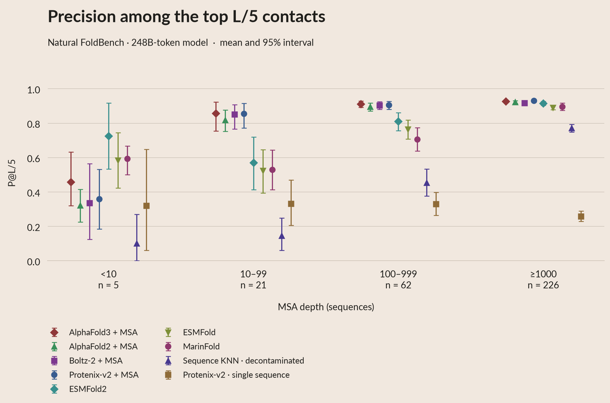
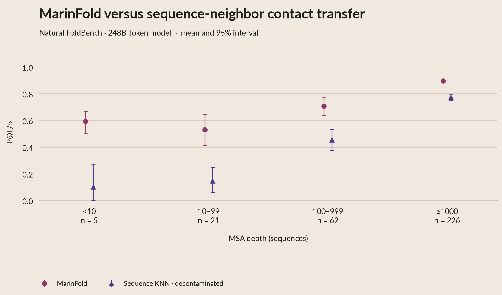
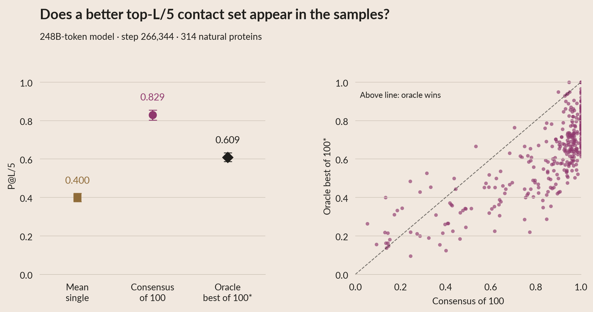

# P@L/5 and sequence-KNN comparisons

P@L/5 counterparts preserve the original plots and fixed 248B-token checkpoint
(exp277 step266344). No predictor inference was added. All-range and long-range
predictor panels include AF2, AF3, Boltz-2, Protenix-v2 + MSA and single sequence,
ESMFold, ESMFold2, MarinFold, and sequence-KNN. The focused KNN panel provides
both P@L/5 and R-precision in both ranges.

## Metric and population

Let **L be the frozen input sequence length**, including unresolved input residues.
Set **k = max(1, floor(L/5))**. Precision is correct contacts in the top k divided
by k. The general evaluator caps k at the eligible-pair count; all displayed
all/long-range rows have enough candidates and use the full k.

The candidate universe and contact definition are unchanged: both residues must
be resolved, pyconfind degree >=0.001 defines a true contact, and sequence separation
is >=6 (all-range) or >=24 (long-range). Structural predictors rank contact degree;
MarinFold consensus ranks vote counts; KNN uses the archived transferred-contact
scores. Score ties retain stable candidate order, without reference-based tie breaking.

All 314 natural proteins are matched across predictors: 97 validation and 217 test.
Tier sizes are 5 / 21 / 62 / 226. The 19 designs remain a separate interactive view.
This contact population is larger than the 305 complete cases in the structural
accuracy panels. Depth bins compare different proteins, not MSA interventions.
Means weight each protein equally. Intervals use 5,000 protein bootstraps, seed 325.

## Results

| Predictor | All-range P@L/5 | Long-range P@L/5 | All-range P@L/5, depth <10 (n=5) |
|---|---:|---:|---:|
| AlphaFold3 + MSA | 0.912 | 0.904 | 0.458 |
| AlphaFold2 + MSA | 0.901 | 0.890 | 0.323 |
| Boltz-2 + MSA | 0.901 | 0.888 | 0.336 |
| Protenix-v2 + MSA | 0.912 | 0.898 | 0.359 |
| ESMFold2 | 0.869 | 0.856 | 0.727 |
| ESMFold | 0.837 | 0.822 | 0.585 |
| MarinFold, 248B tokens | 0.830 | 0.761 | 0.595 |
| Sequence-KNN, decontaminated corpus | 0.657 | 0.595 | 0.102 |
| Protenix-v2 single sequence | 0.279 | 0.248 | 0.320 |



[Long-range version](plots/04_contacts_pl5_long.pdf).

The KNN null transfers contacts from the ten nearest sequences in the native
decontaminated training corpus. It does not index the additional ProteinMPNN
redesign sequences used by this MarinFold checkpoint. This is a contact baseline;
there is no KNN structure-prediction/TM-score arm.



[Long-range P@L/5](plots/04b_knn_long.pdf) ·
[R-precision](plots/04b_knn_r_precision.pdf) ·
[Long-range R-precision](plots/04b_knn_r_precision_long.pdf).
Paired differences and intervals are in `data/pl5_paired_deltas.csv`.

## Consensus versus individual rollouts

Use the **same first 100 iid rollouts** for each of the 314 natural proteins.
An individual map ranks unique contacts by emission order after eligibility
filtering. Short maps retain denominator k; missing ranks receive zero credit.
Unfinished or malformed individual rollouts score zero. The diagnostic consensus
uses all parsed maps, as in the previous R-precision analysis; the main predictor
panel instead excludes unfinished maps from its vote counts.

The oracle is **selected anew by P@L/5**, not inherited from the R-precision winner.
It uses experimental truth only as an offline diagnostic. Ties use the earliest
rollout. Mean single / consensus / oracle-best P@L/5 are **0.400 / 0.829 / 0.609**;
long-range values are **0.389 / 0.761 / 0.595**. This measures contact accuracy,
not the number of distinct folds generated.



[Long-range sampling diagnostic](plots/06_sampling_pl5_long.pdf).

## Provenance and reproduction

`prepare_pl5.py` verifies all **5,994 original predictor R-precision cells** and
**1,884 original sampling R-precision cells** within 1e-12 before producing the
new analysis. This catches alternate inputs and earlier versions of baseline runs.
Published exp245 reruns take precedence over overlapping legacy baseline entries;
the old FoldBench instance takes precedence over duplicate de novo instances.
Every selected row is checked against the original comparison.

| Figure element | Cached data | Provenance |
|---|---|---|
| Predictor mean / interval | `pl5_summary.csv` | Filter by figure, method, cohort, metric and tier; contributing stems retained |
| Per-protein predictor score | `pl5_figure_rows.csv` | Original source file, zero-based row and column; L and k retained |
| Sampling mean / scatter point | `pl5_sampling_per_protein.csv` | Per-protein consensus, mean, best, and newly selected rollout index |
| Every individual rollout | `pl5_sampling_individual.csv.gz` | `(stem, range, rollout)`, validity, precision, emission count and raw archive hash |
| Paired KNN or oracle difference | `pl5_paired_deltas.csv` | Within-protein differences, never subtraction of unpaired intervals |
| Source and output integrity | `pl5_analysis.json` | File hashes, raw hashes, public source locations and definitions |

Numbers and uncertainty are computed only in preprocessing. Rendering requires
no predictors, structural scoring or bootstrap calculations:

```bash
# If restoring the validation rollout cache:
hf buckets sync hf://buckets/open-athena/MarinFold/data/exp321/null-sequence-guidance-v1/full_iid_single/eval-val scratch/pl5/exp321/full_iid_single/eval-val --include '*.parquet' --exclude '*.timing.parquet' --quiet
# Restore the existing test archive at scratch/contacts/results/rollouts/ if needed.
uv run python prepare_pl5.py
uv run python render.py
uv run python build_summary.py
uv run pytest -q
uv run python export_poster.py --width-px 7200 --print-dpi 300 --upload
```

The two small exp226 metric snapshots in `data/inputs/pl5_exp226_*` are copied
from the original archived `esm_scores` / `protenix_scores` tables, with their
source cells checked by the R-precision regression. Other score tables are
committed sibling experiment artifacts. Test rollouts are in the existing
[public analysis package](https://huggingface.co/buckets/open-athena/MarinFold/tree/data/exp325-writeup-analysis/exp277-step266344/v6-ptm-ranking).
The [poster package](POSTER.md) includes the new tables and source snapshots.
