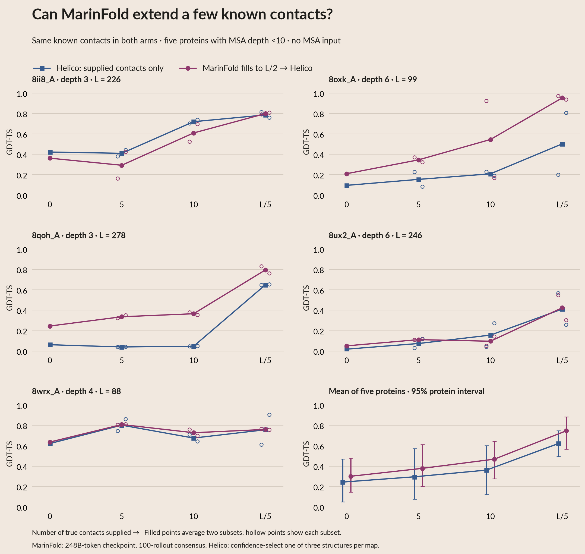
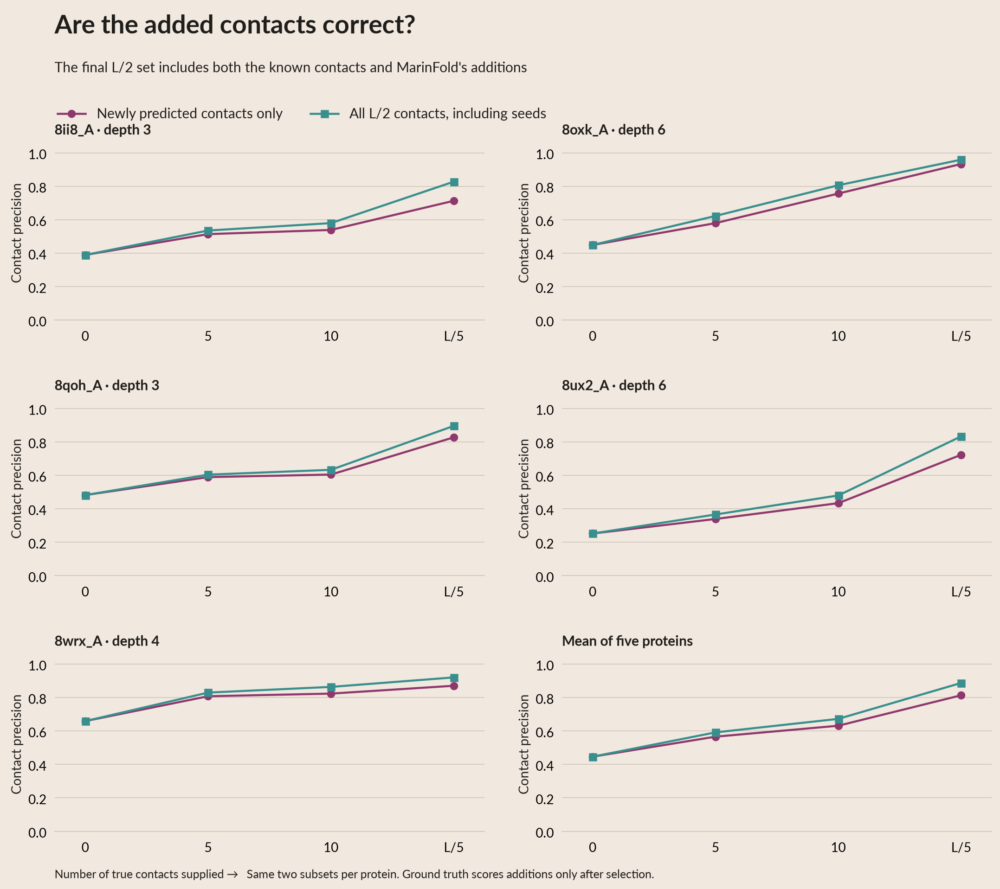

# Extending a few known contacts with MarinFold

Compare Helico given **n true contacts** with Helico given **the same n contacts
plus MarinFold predictions, totaling floor(L/2)**. The cohort is all five natural
FoldBench proteins with archived MSA depth <10. This follow-up is exploratory:
the question was chosen after looking at the previous sparse-oracle results.
Every protein belongs to eval-test; its use was explicitly authorized.

**Completion helps on average at every tested seed budget, but can hurt individual
proteins.** At 10 seeds, mean GDT-TS rises from 0.362 to 0.469; three proteins
improve and two worsen. At L/5 seeds all five improve, although three gains are
small. The largest gains are on 8oxk_A and 8qoh_A.

| True contacts supplied | Direct Helico GDT-TS | Complete to L/2, then Helico | Paired gain [95% protein interval] | Proteins improved |
|---|---:|---:|---:|---:|
| 0 | 0.244 | 0.301 | +0.057 [−0.012, +0.135] | 4/5 |
| 5 | 0.296 | 0.379 | +0.083 [−0.037, +0.213] | 4/5 |
| 10 | 0.362 | 0.469 | +0.107 [−0.058, +0.273] | 3/5 |
| L/5 | 0.622 | 0.747 | +0.125 [+0.009, +0.300] | 5/5 |

At **10 seeds**, the paired GDT-TS values are:

| Protein | MSA depth | Direct | Completed | Gain |
|---|---:|---:|---:|---:|
| 8ii8_A | 3 | 0.720 | 0.609 | −0.111 |
| 8oxk_A | 6 | 0.209 | 0.545 | +0.336 |
| 8qoh_A | 3 | 0.047 | 0.366 | +0.319 |
| 8ux2_A | 6 | 0.156 | 0.096 | −0.060 |
| 8wrx_A | 4 | 0.676 | 0.728 | +0.052 |

Mean TM-score at 10 seeds rises from **0.573 to 0.712**, and mean lDDT from
**0.491 to 0.604**. With pTM selecting the Helico samples, the mean GDT-TS
gain is +0.115 and the same three proteins improve. The new zero-seed result
uses a fresh rollout pool and a **total L/2** cut, whereas the main MarinFold
folding panel uses archived top-L predictions. Those baselines have different
contact budgets and are not identical sampled maps.

All **3,500/3,500 rollouts terminated normally**. All 35 completed maps and
105 Helico structures passed the raw-artifact audit; no condition was dropped.



[GDT-TS PDF](plots/02g_seed_completion.pdf) ·
[TM-score PDF](plots/02g_seed_completion_tm_score.pdf) ·
[lDDT PDF](plots/02g_seed_completion_lddt.pdf) ·
[Interactive draft](site/index.html#section-02g_seed_completion) ·
[White poster exports](POSTER.md).

## Fixed protocol

- **Seeds:** 0, 5, 10 and floor(L/5) uniformly sampled true contacts. Reuse the
  exact subsets from [the sparse-oracle experiment](ORACLE_BUDGET.md): two
  independent random permutations per protein, with nested budget prefixes.
  Zero has one empty set. L is the frozen full input sequence length.
- **MarinFold:** `contacts-v1-exp277-m2-p06-full-epoch-1.5B-step-266344`,
  **248,583,762,834 training tokens**. All checkpoint/tokenizer bytes are
  SHA256-verified against `generation/checkpoint_manifest.json`. No fine-tuning.
- **Prompt:** sequence-only contacts-v1 prefix followed by the supplied contact
  statements. The audited exp14 residue map converts Helico token indices to
  full-sequence indices, then to randomized position tokens. Each seed set
  appears in every one of 100 prompts, in randomized order and orientation.
  Sequence serialization and sampling seeds 0–99 are shared across conditions.
- **Continuation and selection:** temperature 1, top-p .95, top-k disabled.
  Generate complete continuations, up to 6L+128 tokens, stopping at `<end>`.
  This is the usual **100-rollout consensus** recipe: the *final selected map*
  has L/2 contacts; individual continuations are not truncated at L/2.
  Normally terminated rollouts contribute at most one vote per pair. Retain
  all supplied contacts, exclude duplicates of those seeds, then add the
  highest-vote floor(L/2)−n distinct pairs. Ties break by sequence `(i,j)`.
  Require resolved mappings and separation ≥6 in both index systems. No
  zero-vote filling. No ground-truth correctness labels enter this selection.
- **Helico:** the same MSA-free step6000 checkpoint and pinned source as the
  other sparse-oracle plots. All selected pairs are PRESENT; every unselected
  pair is UNKNOWN, with no negative-contact information. Three diffusion
  structures per map, six recycles, seed42. The direct arm reuses its exact
  previous conditioning maps and predictions. Complete maps are newly folded.
- **Selection and aggregation:** highest `ranking_score` selects the diffusion
  structure, matching the GDT-TS depth comparison. pTM selection is also cached
  and available in the interactive menu. Average the two seed subsets within
  each protein; then give all five proteins equal weight. Intervals use 5,000
  protein bootstrap resamples. Neither the best subset nor best true-accuracy
  structure is selected.

The completion arm spends additional MarinFold compute and supplies more
contacts. This tests whether that procedure helps relative to direct sparse
conditioning; it does not isolate prompting from simply adding unconditional
MarinFold contacts. Five proteins and two subsets give a limited view of
protein and subset variability.

## Contact accuracy



The added-contact curve excludes every supplied seed, so it cannot improve
merely by counting guaranteed-correct seeds in its numerator. The full-set
curve includes them. Both are scored with the same Helico oracle definition:
pyconfind 0.6.0, native-only, 3 Å, degree ≥0.001 and separation ≥6.

Mean precision of **newly predicted contacts alone** is **44.6%, 56.6%, 63.1%,
81.3%** at 0, 5, 10 and L/5 seeds. The corresponding full-set precision is
44.6%, 59.2%, 67.2%, 88.7%. Added-contact precision at 10 seeds exceeds the
zero-seed value for every protein, despite structural accuracy worsening for
two proteins relative to direct 10-contact conditioning.

## Trace each figure element

| Figure element | Cached table and keys |
|---|---|
| Individual subset dot | `seed_completion_selected.csv`: stem, budget, map_seed, method, selector; original CSV and zero-based source row retained |
| Filled protein point | `seed_completion_per_protein.csv`: stem, budget, method, metric, selector |
| Five-protein mean and interval | `seed_completion_summary.csv`: budget, method, metric, selector |
| Paired gain and interval | `seed_completion_deltas.csv`: budget, metric, selector |
| Contact-precision point | `seed_completion_contact_precision.csv`: stem, budget |
| Every seed or added contact | `seed_completion_pairs.csv`: stem, arm, map_seed, kind, rank; both index systems, votes and retrospective oracle label |
| Exact conditioning identity | `seed_completion_cases.csv`, `seed_completion_maps.csv`, and `seed_completion_protocol.json` |

Predictor timings live in `seed_completion_timings.csv` and
`helico_seed_completion_timings.csv`; reused direct timings remain in
`helico_oracle_budget_timings.csv`. Raw prompts, continuations, position maps,
votes, conditioning matrices, coordinates and metrics are archived publicly
under [seed-completion-2026-10-08](https://huggingface.co/buckets/open-athena/MarinFold/tree/data/exp325-writeup-analysis/seed-completion-2026-10-08).
`seed_completion_publication.json` records each public artifact's hash.

## Reproduce

From this experiment directory, with the pinned Helico checkout and previously
published sparse-oracle inputs recovered into their documented scratch paths:

```bash
uv run --project /home/bizon/git/helico --no-sync python generation/prepare_seed_completion.py
uv run --project generation modal run generation/run_seed_completion.py
uv run python generation/prepare_seed_completion.py --maps
WRITEUP_PHASE=seed_completion HELICO_DRY_RUN=1 PYTHONPATH=. uv run --project generation python generation/run_helico.py
WRITEUP_PHASE=seed_completion PYTHONPATH=. uv run --project generation python generation/run_helico.py
uv run --project generation modal run generation/archive_helico.py --seed-completion
uv run python generation/audit_seed_completion.py
uv run python prepare_seed_completion_analysis.py
```

Restyling reads only the prepared tables and takes no predictor compute:

```bash
uv run python render.py
uv run python build_summary.py
uv run python export_poster.py --upload
uv run python publish_oracle_budget.py --seed-completion --upload
```

No other depth tier is included in this follow-up, and the main depth-comparison
oracle dots remain the previously requested random L/2 true-contact results.
