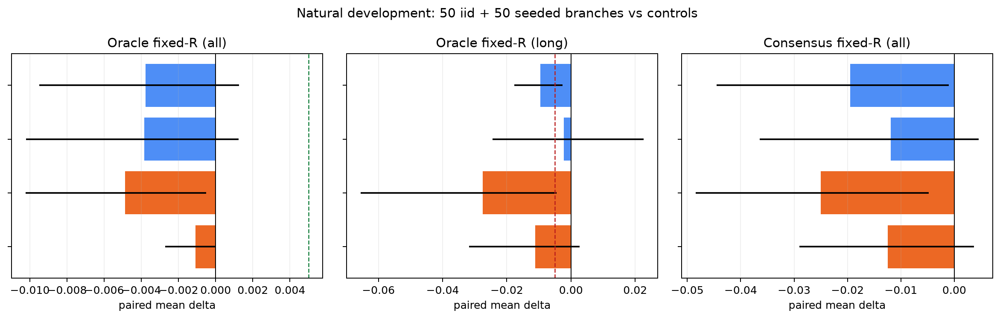
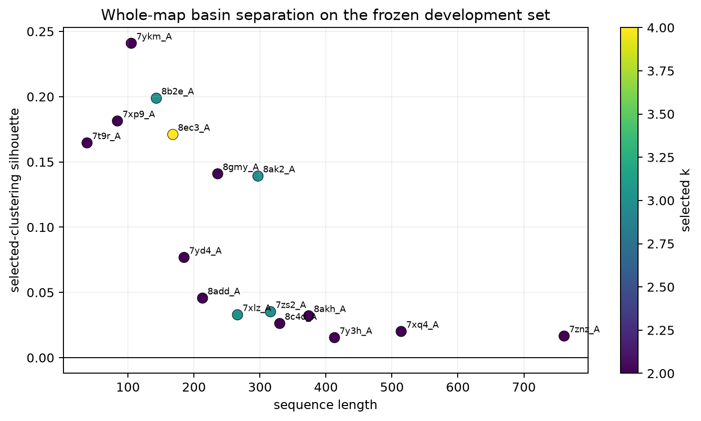
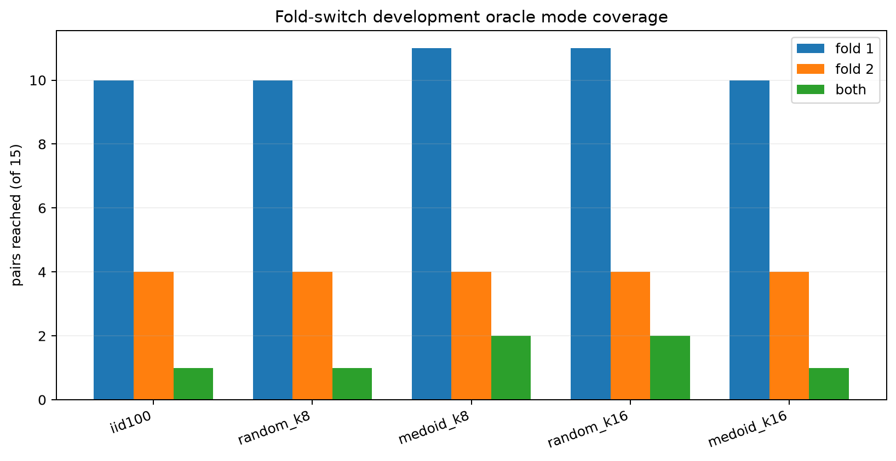

---
marinfold_experiment:
  issue: 328
  title: 'exp: geometry-aware whole-map medoid branching'
  kind: evals
  branch: exp/328-whole-map-medoid
---

# exp: geometry-aware whole-map medoid branching

**Issue:** [#328](https://github.com/Open-Athena/MarinFold/issues/328) · **Kind:** `evals` · **Branch:** `exp/328-whole-map-medoid`

## Question

Can whole-contact-map clustering identify coherent rollout basins well enough that partial maps from cluster medoids improve oracle best-of-100 contact accuracy?

## Hypothesis

The failure in #326 may have come from clustering noisy contact pairs instead
of coherent structural samples. Complete predicted maps should define rollout
basins more directly. A shift-tolerant map distance can group maps that differ
by small index offsets, while partial maps selected from real cluster medoids
should steer new continuations toward those basins without synthesizing an
internally inconsistent prompt.

## Approach

Use #277 `contacts-v1-exp277-m2-p06-full-epoch-1.5B` step 266344 and eval-val
only. Reuse #321's first 50 iid maps as a truth-free discovery pool and its
first 100 maps as the iid control. The natural development set is the frozen
16-protein #326 split; the 81 remaining eval-val proteins stay untouched until
the gate below passes. Eval-test remains unread.

For each protein, define map similarity as the mean of bidirectional soft F1
at endpoint-Chebyshev radii 2 and 8, and distance as one minus that value. Fit
deterministic PAM-style k-medoids for k=2..6, rejecting clusterings whose
smallest cluster has fewer than three maps, and select the highest silhouette
(lower k wins exact ties). If the unconstrained medoid is too short for a seed,
use the most central cluster member that can supply the requested number of
contacts. A single-cluster global-medoid fallback is specified if no candidate
k is valid.

Test 8- and 16-contact seeds. Within each medoid map, choose contacts using a
fixed 60/40 combination of cluster specificity and farthest-point coordinate
coverage. Allocate 50 continuations equally across clusters. The matched
control uses the same seed size and geometrically spread subsets of random
warm-up maps. All contacts are copied from one real source map. Sampling uses
T=1, top-p=.95, no top-k, and `6L+128` completion tokens.

The primary readout excludes every supplied seed contact from its continuation.
Complete seed+continuation maps are retained as a deployable secondary readout.
Raw rollout and timing artifacts are written under `_cache/` during execution
and published to
`hf://buckets/open-athena/MarinFold/data/exp328/whole-map-medoid-branching-v1/`.

## Success criteria

Primary: validity-gated oracle fixed-R precision for the combined 50 warm-up
plus 50 branch pool. Advance exactly one seed size to the 81-protein
confirmation split only if it beats both iid100 and its size-matched random-map
control by at least 0.005 all-range oracle precision, without losing more than
0.005 long-range oracle precision against either comparator. Freeze the choice
before confirmation scoring.

Secondary: consensus fixed-R, ordinary oracle, mean rollout precision, true
contact union recall, pairwise Jaccard, malformed/unfinished counts, cluster
occupancy and silhouette, timing, and the 15-pair fold-switch mechanism panel.
Paired uncertainty uses a protein bootstrap. Consensus cannot rescue an
oracle-negative result.

## Results

All 16 natural-development proteins and all 15 fold-switch pairs admitted a
valid k=2..6 clustering, so the fallback was never used. Natural proteins chose
2.375 clusters on average with mean silhouette 0.096; fold-switch pairs chose
2.73 with mean silhouette 0.109. Separation was weak for most long proteins.

Neither seed size passed the natural-development gate. For the primary
continuation-only validity-gated oracle fixed-R metric, the 8-contact medoid
arm scored 0.4761 versus 0.4799 for iid100 (paired mean delta -0.0038, 95%
bootstrap CI -0.0095 to +0.0013) and 0.4800 for its random-map control (-0.0039,
CI -0.0102 to +0.0012). The 16-contact arm scored 0.4750 (-0.0049 versus iid,
CI -0.0102 to -0.0005; -0.0011 versus random, CI -0.0027 to 0). Long-range
oracle fell by 0.0096 and 0.0274 versus iid for 8 and 16 contacts. The frozen
choice is therefore null and the 81 confirmation proteins remain unread.

Consensus moved in the same unfavorable direction: -0.0195 for 8 contacts and
-0.0250 for 16 contacts versus iid100. True-contact union recall also fell
from 0.9314 for iid100 to 0.9253 and 0.9208. The matched random-map controls
reached 0.9365 and 0.9352, respectively. Medoid pools were less diverse than
their random controls by pairwise Jaccard. The effect did not improve among the
seven proteins with silhouette above 0.1.

The seed diagnostics explain part of the failure. Only 18.4% of the 8-contact
medoid seeds and 17.3% of the 16-contact medoid seeds were true contacts,
versus 30.9% and 29.0% for geometrically spread random-map seeds. Clustering is
therefore preferentially surfacing contacts characteristic of model-specific
maps, but those distinctive contacts are disproportionately wrong. Including
the supplied seed in the final map did not yield a convincing deployable win:
the 16-contact arm was +0.0036 all-range oracle versus iid (CI -0.0073 to
+0.0163) but -0.0233 long-range (CI -0.0637 to +0.0042); the 8-contact arm was
negative on both.

The fold-switch panel was also not medoid-specific. The 8-contact medoid pool
reached fold 1 on 11/15 pairs, fold 2 on 4/15, and both on 2/15, versus 10, 4,
and 1 for iid100. The 16-contact medoid pool matched iid at 10, 4, and 1. A
random 16-contact continuation pool reached 11, 4, and 2, while its complete
maps reached 11, 5, and 3. Thus the small mechanism-panel movement is no better
than generic spread seeding.

Generation produced 6,200 branch rollouts: all finished, with 18 rollouts
containing at least one malformed contact token. Per-target timing and worker
metadata are in `data/timings.csv`. Raw rollouts and timings comprise 248
parquets (9,225,565 bytes) at
`hf://buckets/open-athena/MarinFold/data/exp328/whole-map-medoid-branching-v1/`.

## Conclusion

Do not adopt this whole-map medoid brancher for oracle best-of-100 inference.
It fails the development gate against both iid sampling and a same-size random
partial-map control, degrades consensus, and loses long-range accuracy. Because
the preregistered gate failed, there is no held-out claim and no justification
for spending the 81-protein confirmation set.

The experiment rejects the stronger version of the contact-clustering idea,
not merely #326's pairwise estimator: even shift-tolerant clusters of complete
maps concentrate distinctive but inaccurate contacts. Any future mode-seeking
scheme should first demonstrate that its mode descriptors are enriched for
truth or an independent structure-validity proxy; novelty within the model's
own rollout distribution is not sufficient.
