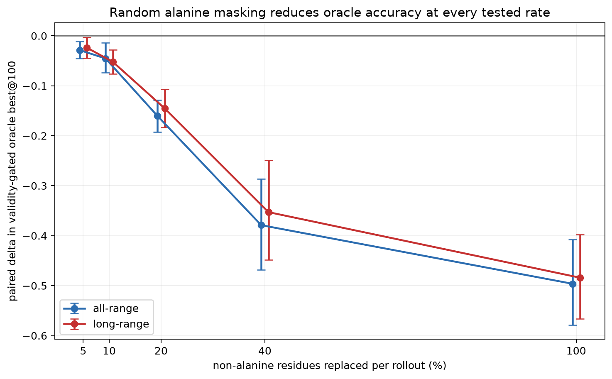
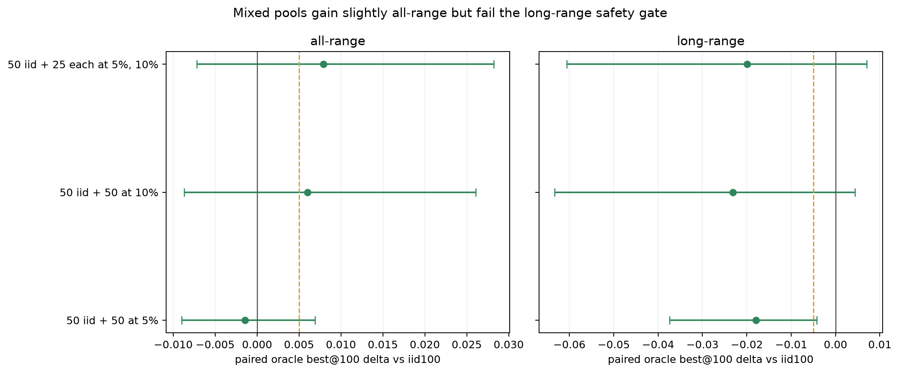
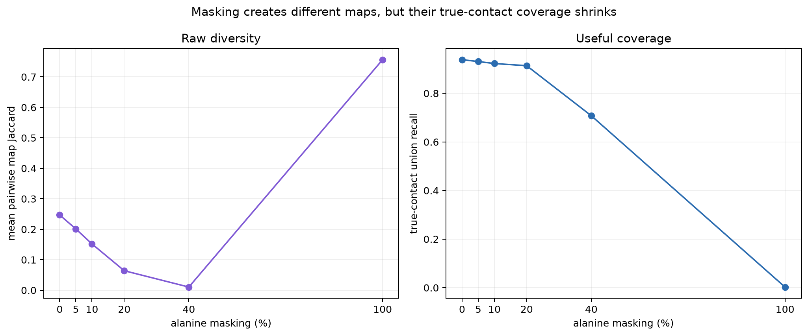

---
marinfold_experiment:
  issue: 333
  title: 'exp: random alanine masking for oracle rollouts'
  kind: evals
  branch: exp/333-alanine-masking-rollouts
---

# exp: random alanine masking for oracle rollouts

**Issue:** [#333](https://github.com/Open-Athena/MarinFold/issues/333) · **Kind:** `evals` · **Branch:** `exp/333-alanine-masking-rollouts`

## Question

Can independently replacing random subsets of a protein sequence with alanine produce complementary contacts-v1 rollouts that improve oracle best-of-100 accuracy on eval-val?

## Hypothesis

Independent alanine masks perturb the sequence conditional without changing
document length, residue positions, or output coordinates.  Some masks may
therefore expose correct contact hypotheses that 100 native-sequence samples
miss.  Small masks should retain more per-rollout accuracy; large masks are
expected to increase novelty but eventually destroy useful sequence evidence.

## Approach

Use #277 `contacts-v1-exp277-m2-p06-full-epoch-1.5B` step 266344 and eval-val
only.  Reuse #321's frozen 16-protein development split and 81-protein
confirmation split; eval-test remains unread.

For each rollout, rank every non-alanine residue with a deterministic random
permutation keyed by `(stem, rollout)`.  An arm at fraction `p` replaces the
first `round(p * n_non_alanine)` positions with alanine.  This makes masks
independent across rollouts but nested across mutation-rate arms.  Native
alanines do not count toward the requested burden.  Every arm uses the same
document-realization key and sampling seed for a given target and rollout.

Development evaluates fractions 0, 0.05, 0.10, 0.20, 0.40, and 1.00 with 100
rollouts each.  The zero arm is an implementation/backend check; full
poly-alanine is a boundary control.  Each nonzero arm is scored both as 100
mutant rollouts and as a 50-native/50-mutant pool.  The native control is
#321's published `full_iid_single` pool.  Generation uses T=1.0, top-p=0.95,
no top-k, fresh contacts-v1 realizations, and `6L+128` completion tokens.

Exactly one fraction and pool composition may advance.  The selection is
written to `data/frozen_choice.json` before any of the 81 confirmation targets
are generated.  Raw rollouts and timings are written to CoreWeave S3 and then
published under
`hf://buckets/open-athena/MarinFold/data/exp333/alanine-masking-v1/`.

## Success criteria

Primary: validity-gated oracle fixed-R precision at best@100, all-range and
long-range.  Unfinished or malformed rollouts score zero.  A policy advances
only if it beats iid100 by at least 0.005 all-range on the 16 development
proteins without losing more than 0.005 long-range.  On the untouched 81, a
win requires a positive paired mean delta whose 95% protein-bootstrap interval
excludes zero; differences under 0.005 remain practical ties.

Secondary metrics are the best-of-N curve, consensus R-precision, mean rollout
precision, true-contact union recall, pairwise Jaccard, unique maps, invalid
rate, contact count, generated tokens, and an equal-H100-time comparison.

## Results

### Run and integrity checks

The development run generated **9,600 rollouts** (5,571,447 generated tokens)
over all 16 frozen development proteins and six mutation rates.  All 9,600
finished before the token cap.  Sixty-two rollouts contained at least one
syntactically malformed or out-of-range contact statement and were assigned
zero by the validity gate.  Every target/rate has exactly 100 ordered rollouts;
all requested mutation counts are exact; and each rollout's masks are nested
across rates.  These checks are recorded in
[`data/dev_validation.json`](data/dev_validation.json).

The zero-mask vLLM worker scores 0.4988 all-range and 0.4840 long-range, versus
0.4799/0.4795 for #321's published iid100 pool.  The all-range difference is
+0.0189 (95% protein-bootstrap CI +0.0014 to +0.0397), outside the 0.005
validity tolerance; long-range is +0.0045 (-0.0265 to +0.0356).  The prompts
and sampling recipe are the same, but the worker/backend and random streams are
different.  Exact cross-worker upper-tail differences therefore cannot be
attributed to masking.  The causal masking comparison below uses the matched
zero-mask worker; mixed policies retain the preregistered comparison to the
published iid pool.

### All-mutant pools get steadily worse

Replacing only 5% of non-alanine residues reduces matched oracle best@100 by
**-0.0286 all-range** (95% CI -0.0456 to -0.0114) and **-0.0238 long-range**
(-0.0450 to -0.0030).  Every larger rate is worse:

| 100-rollout pool | All-range | Δ vs zero mask | Long-range | Δ vs zero mask |
|---|---:|---:|---:|---:|
| zero mask | 0.4988 | — | 0.4840 | — |
| 5% masked | 0.4703 | -0.0286 | 0.4602 | -0.0238 |
| 10% masked | 0.4534 | -0.0454 | 0.4318 | -0.0521 |
| 20% masked | 0.3386 | -0.1603 | 0.3387 | -0.1453 |
| 40% masked | 0.1199 | -0.3789 | 0.1311 | -0.3529 |
| full poly-alanine | 0.0026 | -0.4962 | 0.0000 | -0.4840 |

Full poly-alanine is a degenerate boundary: 1,352/1,600 rollouts contain no
valid contacts and 1,346 emit only one token, normally `<end>`.

### Mixing native and masked rollouts does not rescue the idea

The best all-range development result uses 50 native iid maps plus 25 each at
5% and 10% masking.  It reaches 0.4878, +0.0079 versus iid100, but long-range
falls to 0.4596, **-0.0199**.  The 50-native/50-at-10% arm behaves similarly:
+0.0060 all-range and -0.0231 long-range.  Both clear the +0.005 all-range
threshold but fail the -0.005 long-range safety threshold, and both paired
intervals include zero on all-range.

| Mixed 100-rollout pool | Δ all-range vs iid100 (95% CI) | Δ long-range (95% CI) |
|---|---:|---:|
| 50 iid + 50 at 5% | -0.0014 [-0.0090, +0.0069] | -0.0179 [-0.0375, -0.0043] |
| 50 iid + 50 at 10% | +0.0060 [-0.0087, +0.0261] | -0.0231 [-0.0634, +0.0044] |
| 50 iid + 25 each at 5%, 10% | +0.0079 [-0.0072, +0.0282] | -0.0199 [-0.0606, +0.0071] |

Masking does lower pairwise contact-map overlap, but it also lowers
true-contact union recall.  At 5%, Jaccard falls from 0.2470 to 0.2011 while
union recall falls from 0.9384 to 0.9308; this is broader error, not useful
coverage.

### Compute and artifacts

The run used eight batch H100 jobs (`/bizon/exp333-dev-v1-s0of8` through
`s7of8`) and 0.143 summed H100 inference-hours, or 0.306 hours including
amortized model loading and output writes.  Per-target timings and worker/GPU
metadata are in [`data/timings.csv`](data/timings.csv).  The 192 raw rollout
and timing parquets (6.78 MB) are public at
[the MarinFold HF bucket](https://huggingface.co/buckets/open-athena/MarinFold/tree/main/data/exp333/alanine-masking-v1);
the co-located working copy is
`s3://marin-us-east-02a/MarinFold/exp333/alanine-masking-v1/main`.

The frozen decision is [`data/frozen_choice.json`](data/frozen_choice.json):
the zero-mask cross-worker validity check misses tolerance, and independently
no mutation policy clears both accuracy thresholds.  The 81 confirmation
proteins and eval-test were not read.

## Conclusion

Do not use random alanine masking to improve oracle best@100.  It does make
rollouts less similar, but even 5% masking significantly worsens the matched
all- and long-range oracle, and the apparent all-range gains from mixed pools
come with roughly two-point long-range losses.  This is indiscriminate
sequence-information removal rather than complementary hypothesis generation,
so the experiment stops at its preregistered development gate without spending
the untouched 81-protein confirmation set.
