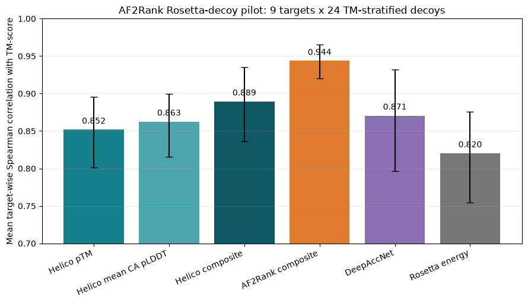
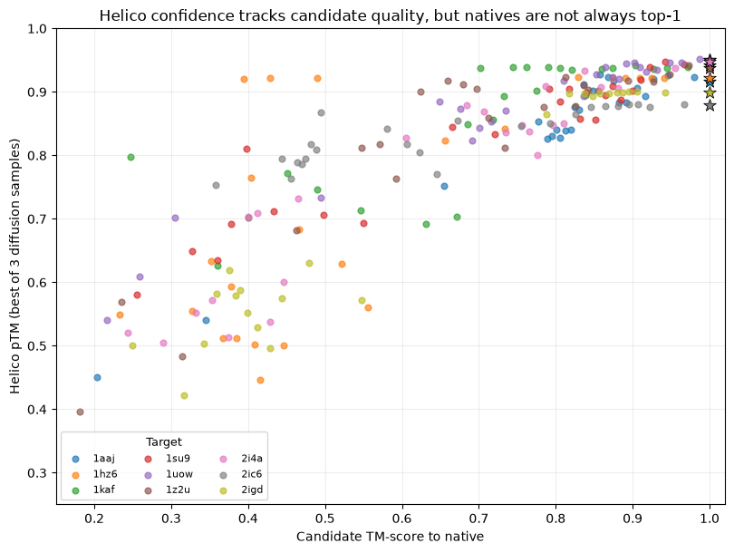
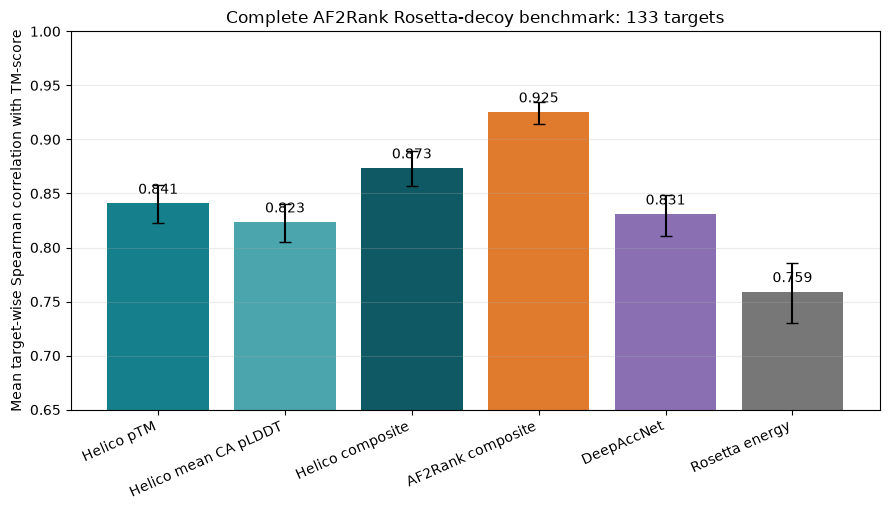
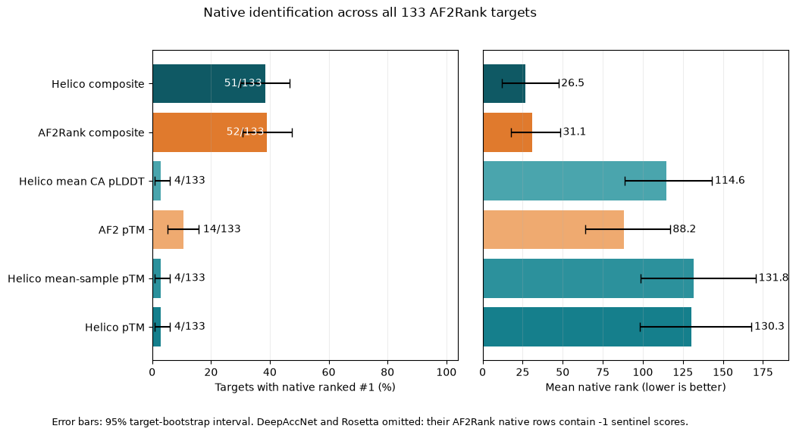

---
marinfold_experiment:
  issue: 335
  title: 'exp: Helico confidence for Rosetta decoy ranking'
  kind: evals
  branch: codex/helico-decoy-ranking
---

# exp: Helico confidence for Rosetta decoy ranking

**Issue:** [#335](https://github.com/Open-Athena/MarinFold/issues/335) · **Kind:** `evals` · **Branch:** `codex/helico-decoy-ranking`

## Question

Can Helico's own confidence rank native and near-native protein structures above Rosetta decoys when each candidate is converted to Helico's contact-map representation, and how does it compare with AF2Rank, DeepAccNet, and the Rosetta energy function on the exact AF2Rank benchmark?

## Hypothesis

A candidate-derived contact map that is geometrically compatible with the target sequence should let contact-conditioned Helico produce a confident structure, whereas inconsistent decoy contacts should reduce Helico pTM. We therefore expect target-wise Helico pTM to correlate positively with candidate TM-score and recover high-quality candidates substantially better than Rosetta energy, but probably below AF2Rank because the contact map discards most of the template geometry available to AlphaFold. The native-versus-decoy discrimination question and the standard decoy-quality ranking question will both be reported.

## Background

AF2Rank ([paper](https://doi.org/10.1103/PhysRevLett.129.238101), [code and data](https://github.com/jproney/AF2Rank)) evaluates 133 protein targets from the Rosetta decoy set. It masks template sidechains, replaces the template sequence with gap tokens, runs MSA-free AlphaFold model 1 with one recycle, and ranks candidates with `mean_pLDDT * pTM * TM(candidate, AF2 output)`. The paper reports mean target-wise Spearman correlation 0.925 with candidate TM-score and mean top-1 TM-score 0.933, versus 0.831 / 0.917 for DeepAccNet and 0.760 / 0.901 for Rosetta.

Data access has been verified before filing this issue:

- The public IPD archive `https://files.ipd.uw.edu/pub/decoyset/decoys.zip` is reachable and is 5,179,742,249 bytes. The local copy has SHA-256 `098a3d813b74588bfe126cb1ac5c27b3123ff70e187d636ffdb66b5dc4a57733` and is fully extracted.
- The benchmark contains 133 targets and 180,079 decoy PDBs (794--2,903 per target; median 1,000), plus native PDBs. All 180,079 `(target, decoy_id)` keys exactly match the local TM-score, RMSD, and Rosetta-score tables.
- The authors' corrected `rosetta_gapseq.csv` downloads without authentication (24,695,656 bytes; SHA-256 `ddb3b91c27561212fa9152df4a4a436b9d01990cfe801569d7adc7f925fb75c9`). It contains exactly the same 180,079 decoys plus one `native` and one `none` row for each target (180,345 rows total), including AF2Rank, DeepAccNet, and Rosetta baseline scores.

Helico exp311 established that the published contact-conditioned checkpoint exposes pTM, pLDDT, and per-sample ranking scores and can be run reproducibly on Modal H100s. This experiment pins Helico source revision `b10385d736673c81b10e70d1099962af6f2573c0` and checkpoint `contacts-msafree-01-step6000.pt` (SHA-256 `779d540e5bb45cd26bb970188da2f1937ed3079942923a1356c29d06f20fe644`) unless a later preregistered comparison is added.

## Approach

Interpret "confidence map" as the candidate-derived **contact map**, because that is Helico's trained conditioning interface.

1. **Freeze and audit the benchmark.** Add a reproducible manifest builder that validates archive/reference hashes, target membership, native coverage, and exact key equality across PDBs and the corrected AF2Rank table. Raw PDBs remain outside git; small manifests and summaries are committed.
2. **Convert candidates without silent index shifts.** Parse each candidate, align its resolved protein residues to the target/native sequence, require an unambiguous residue mapping, and derive Helico's three-state map with the pinned pyconfind geometry (`native_only=True`, 3.0 A contact distance, 25 A cutoff, 2.0 A clash distance, contact degree >=0.001, intra-chain sequence separation >=6, no assembly expansion). Preserve both PRESENT and ABSENT states for the primary full-map condition. Record every exclusion and reason. A present-only map is a preregistered sensitivity analysis because it matches the sparse deployment interface but throws away candidate non-contact information.
3. **Pilot before scaling.** Select a deterministic, target-balanced pilot spanning short/median/long targets and low/median/high decoy counts, always including each native and decoys across the TM-score range. Verify map extraction, native reconstruction, deterministic reruns, adaptive batch size, and duplicate-map rate. Benchmark actual H100 seconds/candidate and publish the full-run cost projection.
4. **Helico inference.** Use the MSA-free checkpoint, six trunk recycles, three diffusion samples, and a fixed target-derived seed shared across candidates. The primary candidate score is the maximum pTM among the three samples (identical to Helico's monomer ranking score). Also save mean pLDDT and all per-sample values. Preregistered secondary scores are mean sample pTM and an AF2Rank-analog composite `pTM * TM(candidate, Helico output)`; the latter is explicitly not a pure confidence metric. Capture per-candidate timings and worker metadata using the repository timing schema.
5. **Full evaluation after the measured scale decision.** Run all 180,079 decoys plus the native for all 133 targets on CoreWeave H100s. Fixed 32-candidate parts are assigned across 96 independent Iris root jobs by a greedy length-squared work estimate. Each worker loads Helico once and reuses target tokenization, but candidates remain separate model calls so that every candidate within a target receives the exact same reset diffusion seed as in the pilot. Results and timing companions are written atomically to fingerprinted, co-located CoreWeave object storage; restarts validate both objects before skipping a part.
6. **Compare on paired candidates.** Recompute AF2Rank's published composite from the corrected table and include DeepAccNet and sign-corrected Rosetta energy. Primary decoy-ranking endpoints are mean target-wise Spearman correlation with reference TM-score and mean TM-score of the top-ranked decoy, matching the paper. Native-discrimination endpoints are native rank percentile, top-1 native recovery, mean reciprocal native rank, and per-target native-vs-decoy AUROC. Also report top-1 GDT-TS/TM-score regret, bootstrap 95% target-level intervals, and candidate-level calibration plots without pooling targets for rank correlations.
7. **Robustness and leakage checks.** Report full-map versus present-only maps, pTM versus mean pLDDT, one versus three samples on the pilot, performance by target length/decoy quality, and the unconditioned Helico confidence as a per-target negative control. Keep primary conclusions on the preregistered pTM score; label all secondary analyses.

## Success criteria

- Reproducible audit accounts for all 133 targets, 180,079 decoys, 133 benchmark natives, and all corrected AF2Rank baseline rows with no unexplained key mismatch.
- Pilot has zero silent mapping failures, finite confidence for every retained candidate, deterministic scores within numerical tolerance on rerun, and a measured full-run cost/time estimate.
- On the full paired benchmark, report Helico and every baseline for all primary and native-discrimination endpoints with target-bootstrap 95% intervals and explicit coverage/exclusions.
- The hypothesis is supported if Helico pTM exceeds Rosetta's 0.760 mean target-wise Spearman correlation and 0.901 mean top-1 TM-score; AF2Rank's 0.925 / 0.933 is the stronger comparison, not an assumed pass threshold.
- Per-candidate timing rows and a run manifest pin data hashes, Helico git SHA, checkpoint hash, inference settings, software versions, and hardware.

## Results

### The exact AF2Rank benchmark is available and internally consistent

`audit_data.py` verified the 5.18 GB public archive and the authors' corrected
results by SHA-256. All 180,079 decoy PDB identifiers across 133 targets match
the TM-score, RMSD, Rosetta-energy and corrected AF2Rank tables exactly. The
corrected table also contains one native and one no-template control per target,
for 180,345 rows total. Target lengths span 53--223 residues and each target has
794--2,903 decoys (median 1,000). The committed
[`benchmark_manifest.json`](data/benchmark_manifest.json) and
[`target_summary.csv`](data/target_summary.csv) freeze that identity and
coverage.

The analysis code independently reproduces the paper's full-set numbers from
the corrected table:

| method | mean target-wise Spearman with TM-score | mean top-1 TM-score |
|---|---:|---:|
| AF2Rank composite | 0.9253 | 0.9328 |
| DeepAccNet | 0.8308 | 0.9167 |
| Rosetta energy | 0.7590 | 0.9010 |

### Full-contact-map pilot: Helico confidence is competitive but below AF2Rank

The bounded pilot selects nine targets on a 3 x 3 grid of target-length and
decoy-count percentiles. Within each target it includes the native and 24
decoys evenly spaced across the reference TM-score order, retaining both the
worst and best decoy. All 225 PDBs mapped exactly to their target sequence.
Pyconfind extraction produced 224 unique maps within target; only one pair of
decoys shared a map, so deduplication will not materially reduce the full run.

The [Modal run](https://modal.com/apps/open-athena/main/ap-a24gF08NVAYXFqRkpn6vaP)
completed 225 candidates x 3 diffusion samples with no failed or nonfinite
predictions. Results use the full three-state map (PRESENT and ABSENT), six
recycles, and the same target-derived seed reset for every candidate. Intervals
below are 95% target-bootstrap intervals over nine targets. These are pilot
estimates, not the final 133-target result.

| ranking metric | mean Spearman with TM-score | mean top-1 TM-score |
|---|---:|---:|
| **Helico pTM (primary)** | **0.8519** [0.8013, 0.8957] | 0.9244 [0.8896, 0.9567] |
| Helico mean CA pLDDT | 0.8626 [0.8157, 0.8995] | 0.9341 [0.9023, 0.9611] |
| Helico composite | 0.8895 [0.8363, 0.9349] | **0.9577** [0.9360, 0.9740] |
| AF2Rank composite | **0.9436** [0.9204, 0.9654] | 0.9515 [0.9368, 0.9637] |
| DeepAccNet | 0.8706 [0.7968, 0.9318] | 0.9512 [0.9325, 0.9692] |
| Rosetta energy | 0.8203 [0.7542, 0.8760] | 0.9557 [0.9383, 0.9716] |

The primary pure-confidence result supports the basic signal: Helico pTM tracks
candidate quality and exceeds Rosetta's rank correlation on this pilot. It does
not match AF2Rank. The secondary Helico composite, `pTM *
TM(candidate, Helico output)`, closes part of that gap and selects a slightly
better mean top-1 decoy here, but it is not a pure confidence metric and must
remain labelled separately.

### Pilot native identification is harder than ranking decoy quality

Pure Helico pTM ranks the native first for 3/9 targets, with mean native rank
3.22 of 25, mean reciprocal rank 0.532, and mean native-vs-decoy AUROC 0.907.
AF2Rank's composite ranks the native first for 5/9 (mean rank 1.44). The Helico
composite ranks it first for 7/9 (mean rank 1.22), suggesting that agreement
between the conditioned output and the candidate carries useful information
beyond confidence alone. DeepAccNet and Rosetta are omitted from native
recovery because the authors' native rows contain `-1` sentinels rather than
scores for those methods.

### Complete 133-target decoy-ranking result

The complete run covers all 180,079 decoys and 133 natives. On the paper's
target-macro endpoints, pure Helico pTM has a strong structural-quality signal
but does not match AF2Rank and only partially meets the preregistered Rosetta
comparison:

| ranking metric | mean Spearman with TM-score | mean top-1 TM-score |
|---|---:|---:|
| Helico pTM (primary pure confidence) | 0.8408 [0.8226, 0.8579] | 0.8795 [0.8611, 0.8959] |
| Helico mean-sample pTM | 0.8405 [0.8224, 0.8577] | 0.8826 [0.8652, 0.8983] |
| Helico mean CA pLDDT | 0.8235 [0.8053, 0.8405] | 0.8910 [0.8781, 0.9027] |
| **Helico composite** | **0.8735 [0.8568, 0.8891]** | **0.9357 [0.9284, 0.9422]** |
| AF2Rank composite | 0.9253 [0.9147, 0.9350] | 0.9328 [0.9248, 0.9399] |
| AF2 pTM | 0.8565 [0.8338, 0.8754] | 0.8872 [0.8686, 0.9028] |
| DeepAccNet | 0.8308 [0.8104, 0.8488] | 0.9167 [0.9065, 0.9258] |
| Rosetta energy | 0.7590 [0.7303, 0.7852] | 0.9010 [0.8884, 0.9123] |

Intervals are deterministic 95% target-bootstrap intervals. In paired
target-level comparisons, Helico pTM improves rank correlation over Rosetta by
0.0818 [0.0598, 0.1043], but its selected decoy is lower in TM-score by 0.0215
[0.0057, 0.0384]. The secondary Helico composite remains 0.0518 [0.0394,
0.0652] below AF2Rank in rank correlation. Its mean top-1 TM-score is 0.0028
higher, but the paired interval [-0.0035, 0.0093] includes zero.

### Complete native-versus-decoy result

Pure confidence is a poor exact-native selector despite its useful correlation
with decoy quality. Helico pTM ranks the native first for only 4/133 targets
(3.0%) and gives mean native rank 130.3. Candidate/output agreement changes the
result: the Helico composite selects 51/133 natives (38.3%) and gives mean rank
26.5, essentially matching AF2Rank's 52/133 (39.1%) and mean rank 31.1.

| ranking metric | native top-1 | mean native rank | mean native-vs-decoy AUROC |
|---|---:|---:|---:|
| Helico composite | 51/133 (38.3%) | 26.47 | 0.9829 |
| AF2Rank composite | 52/133 (39.1%) | 31.11 | 0.9797 |
| AF2 pTM | 14/133 (10.5%) | 88.23 | 0.9403 |
| Helico mean CA pLDDT | 4/133 (3.0%) | 114.58 | 0.9219 |
| Helico mean-sample pTM | 4/133 (3.0%) | 131.75 | 0.9106 |
| Helico pTM | 4/133 (3.0%) | 130.34 | 0.9113 |

The paired Helico-composite minus AF2Rank differences are -0.75 percentage
points for native top-1 [95% interval -11.3, 9.0], -4.64 native-rank positions
[-26.55, 20.22], and +0.0032 AUROC [-0.0107, 0.0156]. None excludes zero.
DeepAccNet and Rosetta are omitted from this endpoint because their AF2Rank
native rows contain `-1` sentinel scores. Both panels below include 95%
target-bootstrap error bars, including the mean-rank panel on the right.

### CoreWeave execution and provenance

The full evaluation ran as 96 independent batch-priority CoreWeave H100 Iris
jobs, `/bizon/exp335-helico-full-s000-of-096-v1` through
`/bizon/exp335-helico-full-s095-of-096-v1`. All 96 succeeded without a
production retry. The run completed 5,698 resumable parts in 3 hours 35 minutes
of wall time. Per-candidate timing records account for 314.45 inference
H100-hours and 320.92 H100-hours including attributed model, target, and output
overheads; mean inference time was 6.28 seconds/candidate. At the planning rate
of $3.95/H100-hour, the accounted compute is $1,267.64.

The immutable run fingerprint is
`c1452eb91e1cfc03aa445d14c88084defda53b7c20593f39170152ab72efa09d`.
Raw working outputs remain under
`s3://marin-us-east-02a/MarinFold/exp335/full-v1/results/<fingerprint>/`; the
consolidated candidates, samples, timings, summaries, and figures are published
under `hf://buckets/open-athena/MarinFold/data/evals/exp335_helico_decoy_ranking/full-v1/`.

Full-set preparation retains all 180,212 candidates. Exactly 1,000 decoys from
target `1iib` contain one additional N-terminal lysine: in every case the full
102-residue target sequence occurs uniquely and contiguously at candidate
offset one. The preparation code projects those candidates onto target indices,
drops the extra residue and incident contacts, and records the mapping per
candidate. Any substitution, internal indel, ambiguous match, or missing
C-alpha is a hard error. All other 179,212 candidates use an identity sequence
map, and all 225 pilot maps and coordinates match the full payloads exactly.

Two 32-candidate smokes passed before release. The pilot-overlap `1aaj` part
reproduced pilot pTM within `5.8e-4`; the maximum-length, 223-residue `1ugh`
part completed without OOM. The committed
[`full_run_manifest.json`](data/full_run_manifest.json) pins coverage, Helico
and checkpoint revisions, package versions, inference settings, timings, and
the worker-script fingerprint.

## Conclusion

Candidate-derived contact maps do contain enough signal for Helico confidence
to rank decoy quality: pure pTM reaches 0.841 mean target-wise correlation and
clearly exceeds Rosetta's 0.759 correlation. It does not, however, select as
high-quality a top decoy as Rosetta and is not a useful exact-native selector
on its own (4/133 natives top-ranked). The original confidence-only hypothesis
is therefore only partially supported.

The non-confidence-only Helico composite is the practically interesting
result. It gives the best point estimate for top-1 decoy TM-score (0.936, tied
with AF2Rank within paired uncertainty) and matches AF2Rank on native recovery
and native rank within uncertainty, although its full rank correlation remains
substantially lower. Helico confidence should not be used alone for true-versus-
decoy selection; combining confidence with candidate/output structural
agreement is competitive and merits follow-up validation on independent decoy
sets.
