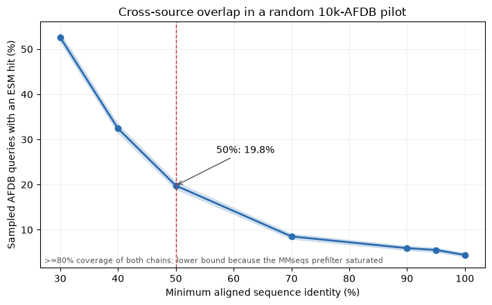
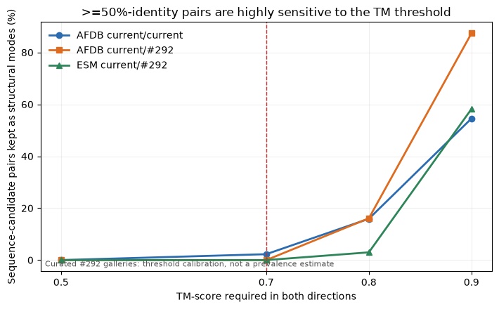
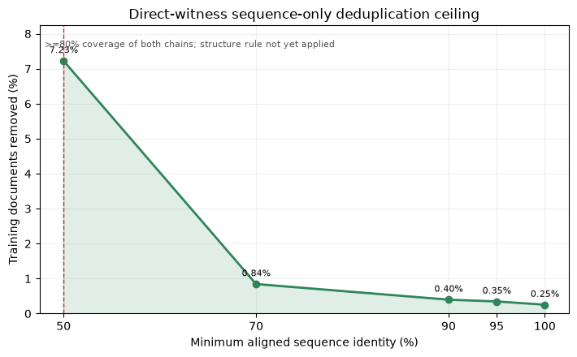

---
marinfold_experiment:
  issue: 336
  title: 'exp: quantify structure-aware sequence deduplication of the training corpus'
  kind: evals
  branch: exp/336-structure-aware-dedup
---

# exp: quantify structure-aware sequence deduplication of the training corpus

**Issue:** [#336](https://github.com/Open-Athena/MarinFold/issues/336) · **Kind:** `evals` · **Branch:** `exp/336-structure-aware-dedup`

## Question

For MarinFold's current decontaminated AFDB + ESM-Atlas training corpus, how many documents and source tokens would remain after deduplication at several sequence-identity thresholds if we remove a protein only when a retained protein also has the same structure, and how many similar-sequence/different-structure examples does that rule rescue?

## Hypothesis

The answer will differ sharply by source. ESM-Atlas was already reduced to one representative per 40%-identity Linclust cluster, so within-ESM loss above 40% should be small; most removable redundancy should come from AFDB's multiple selected members and overlap between AFDB and ESM-Atlas. A sequence-only calculation will overstate the removable fraction, but the structurally discordant rescue rate should be small rather than zero. The #292 supplement should have much more removable sequence redundancy because it deliberately adds homologous cluster members; its structurally selected minority should survive a joint rule more often than its quality-fill majority.

## Background

- #232 defines the current cleaned training universe: 3,963,003 AFDB documents / 4,432,940,838 tokens plus 65,553,178 ESM-Atlas documents / 70,042,923,165 tokens, for 69,516,181 documents / 74,475,864,003 source tokens.
- #139's ESM-Atlas corpus contains one representative per original 40%-identity sequence cluster. AFDB selection instead keeps up to five high-confidence members per Foldseek structural cluster.
- #222 published a one-per-40%-sequence-cluster PDB cut, but that policy intentionally discards alternative structures and therefore does not answer this question.
- #292 is complementary: it recovered 13,732,374 omitted homologs and prioritized 92,511 (0.67%) as strict structural-diversity additions. It does not measure how much of either the current corpus or the supplement a joint sequence/structure deduplication rule would remove.
- Linclust/Foldseek cluster membership is not an all-pairs identity or TM-score guarantee. This experiment must measure the operational pairwise rule rather than infer an answer from cluster counts.

## Approach

### 1. Freeze two universes

The primary universe is exactly the two published, decontaminated #232 corpora. Report AFDB, ESM-Atlas, within-source, cross-source, and pooled totals. Treat the #292 supplement as a separate prospective analysis: report current corpus alone and current + supplement, never a blended headline that changes what training data means.

Build a compact row manifest with source, stable row key, entry/accession, sequence, residue length, exact tokenizer token count, confidence/provenance, structural pointer or C-alpha coordinates, original sequence/structure cluster IDs, and #292 selection tier where applicable. Assert the manifest reproduces #232's pinned document and token totals before analyzing it.

### 2. Generate sequence candidate edges once

Use MMseqs2 at a permissive reporting threshold, then reduce the same alignments into identity cutoffs 100%, 95%, 90%, 70%, 50%, 40%, and 30%. The primary comparability rule requires at least 80% coverage of both proteins so fragments or domain extensions are not collapsed. Also report a 50%-of-shorter sensitivity analysis for comparison with earlier decontamination work.

Count exact sequence duplicates separately. Preserve within-AFDB, within-ESM, and cross-source edges so a large source cannot hide where the savings come from.

### 3. Decide structural redundancy only for sequence candidates

Use Foldseek for candidate screening where useful, but do not equate a missing Foldseek hit with TM-score zero. Compute explicit pairwise US-align/TM-align scores for the candidate-to-representative comparisons needed by the selector. Store both chain-normalized TM-scores and alignment coverages.

Define symmetric structural sameness conservatively as both directional TM-scores clearing the threshold, equivalently `min(qTM, tTM) >= tau_tm`, with at least 80% structural alignment coverage of each protein. Sweep `tau_tm` over 0.5, 0.7, 0.8, and 0.9. The requested example is the cell `sequence identity >= 0.50` and `min(qTM, tTM) >= 0.70`.

Because contacts-v1 trains on contacts rather than coordinates, also compare aligned contact maps. Report how much an additional contact-map-similarity requirement changes every headline cell and inspect cases where TM-score and contact-label similarity disagree.

### 4. Select representatives without losing a structural mode

Use a deterministic quality-first greedy selector. A row may be removed only if it names a retained witness that clears the active sequence, coverage, TM-score, and optional contact-map thresholds. This avoids connected-component chaining, where A resembles B and B resembles C but A and C are different structures. Keep every similar-sequence row for which no structurally matching retained witness exists.

Measure order dependence with fixed alternative source priorities and random seeds. Report the quality-first result plus the observed range; do not present a single ordering as an intrinsic corpus property.

### 5. Outputs

- A two-dimensional threshold table/heatmap with documents and exact source tokens retained/removed.
- Sequence-only loss versus joint sequence+structure loss, including the count and token mass rescued specifically because of structural discordance.
- Results by source, within/cross-source redundancy, length, confidence, original cluster size, and #292 selection tier.
- A witness manifest for every proposed removal and a retained manifest for each operating point.
- A small gallery of high-identity/low-TM examples and TM/contact-map disagreement cases, distinguishing credible conformational alternatives from fragments, uncertain predictions, and alignment artifacts.
- Runtime, bytes read, pair counts, and extrapolation uncertainty if a sampled pilot is required before a complete run.

Do a lineage/metadata pilot first, then a stratified structural pilot large enough to price the complete job. Full-scale work should run source-local and stream compact metadata; do not move structures across regions. Publish compact results and galleries to the public MarinFold HF bucket.

## Success criteria

- Reproduce #232's exact 69,516,181-document and 74,475,864,003-token census before deduplication.
- Produce complete document- and token-loss estimates for every sequence threshold and TM threshold, with the 50% / 0.7 cell explicitly reported.
- Every removed row has a retained witness satisfying the declared thresholds; zero removals occur solely through transitive chaining.
- Quantify the similar-sequence/different-structure rescue mass and audit a stratified sample visually, with artifacts labeled rather than counted as biological alternatives.
- Separate current-corpus results from the prospective #292 supplement and expose representative-order sensitivity.
- Record tool versions, threshold semantics, coverage conventions, input manifests, random seeds, compute time, and durable artifact locations so the result is reproducible.

## Results

### The current AFDB arm was already sequence-deduplicated

[`lineage_pilot.py`](lineage_pilot.py) scanned all 2,067 local #225/#232 AFDB
parquets and reproduced the training cache's exact census: **3,963,003
documents / 4,432,940,838 source tokens** (`num_tokens` plus one EOS per
document). Every row has a distinct AFDB50 `seq_cluster_id`; one per AFDB50
lineage therefore removes **zero** rows. The five #53 rounds are multiple
members of Foldseek structural clusters, but those members are already drawn
from distinct AFDB50 sequence lineages.

This falsifies the hypothesis that most >=50% redundancy would be AFDB's
within-structural-cluster rounds. The corresponding structure-only operation
shows why sequence must remain part of the rule: one per Foldseek lineage would
discard **3,034,162 / 3,963,003 documents (76.6%)** and **3.395B tokens**, even
though those rows are sequence-diverse.

These are lineage results, not pairwise-threshold results: AFDB50 and Foldseek
clusters are transitive assignments. [`data/afdb_lineage_pilot.csv`](data/afdb_lineage_pilot.csv)
and its provenance say so explicitly.

### Cross-source sequence pilot: overlap is substantial, but the search is censored

[`build_current_fastas.py`](build_current_fastas.py) filtered #213's decoded
FASTA using #225's final drop list and reconciled both exact #232 universes:

| source | before #225 | dropped | current #232 |
|---|---:|---:|---:|
| AFDB | 4,129,682 | 166,679 | **3,963,003** |
| ESM-Atlas | 66,759,922 | 1,206,744 | **65,553,178** |

A seed-336 random sample of 10,000 AFDB queries was searched against all 65.6M
current ESM rows at MMseqs sensitivity 7.5, requiring >=80% coverage of both
chains. The observed cross-source overlap is:

| identity | AFDB queries with >=1 ESM hit | fraction | alignment edges |
|---:|---:|---:|---:|
| 100% | 442 | 4.42% | 442 |
| 90% | 593 | 5.93% | 593 |
| 70% | 853 | 8.53% | 861 |
| **50%** | **1,979** | **19.79%** | **3,832** |
| 40% | 3,242 | 32.42% | 20,543 |
| 30% | 5,261 | 52.61% | 125,601 |

At 50%, keeping ESM and removing matching AFDB rows would project to about
**784k AFDB documents** on the raw sample fraction (95% Wilson interval
754k–816k). This is an order-of-magnitude planning number, **not the final
answer**: the 1,000-candidate MMseqs prefilter saturated (median list length
1,000; 1,202 overflows), so the table is a lower bound. Conversely, keeping
AFDB would remove ESM targets; the sample saw 3,832 unique targets at 50%, but
that count is not extrapolated because target degree under full query coverage
is unknown. Source priority is therefore part of any honest "data lost"
answer.

The persistent 65.6M-target MMseqs index is built locally. Full candidate
generation needs a linear clustering/update stage or a partitioned higher-cap
search with explicit saturation checks; repeating this censored search at
larger scale would produce a precise-looking underestimate.

### Structural-threshold calibration: 0.7 preserves few >=50% pairs in the gallery

[#292](https://github.com/Open-Athena/MarinFold/pull/293) already measured
explicit pairwise TM-align scores, both chain coverages, aligned identity and
C-alpha contact Jaccard for curated AFDB and ESM examples. The inputs are pinned
to commit `f57387118363c6dfdf4a5c617903408562937b2e`; this is threshold
calibration, not a random prevalence estimate.

Among the 44 current-AFDB anchor/anchor gallery pairs with >=50% aligned
identity and >=80% coverage of both chains:

| require both directional TM-scores >= | pairs kept as distinct modes | share |
|---:|---:|---:|
| 0.5 | 0 / 44 | 0.0% |
| **0.7** | **1 / 44** | **2.3%** |
| 0.8 | 7 / 44 | 15.9% |
| 0.9 | 24 / 44 | 54.5% |

The sole TM<0.7 case is borderline (`min(TM)=0.6992`), not a dramatic fold
switch. At the requested **50% / TM 0.7** operating point, this calibration
therefore predicts a small structural rescue; the full cross-source structural
sample is still required. The median aligned C-alpha contact Jaccard among the
44 candidates is 0.837, so the label-level contact check remains useful rather
than redundant with TM-score.

### Full-corpus sequence-only ceiling: 7.23% at 50%

[`run_sequence_linclust.py`](run_sequence_linclust.py) organized all
69,516,181 current rows into candidate neighborhoods at >=50% identity and
>=80% coverage of both chains. Linclust alone proposed 5,245,852 removals, but
227,896 of those did not directly satisfy the rule against the nominal center.
[`verify_linclust_pairs.py`](verify_linclust_pairs.py) therefore enumerated all
7,500,558 unordered pairs within the neighborhoods. MMseqs calculated
7,426,316 explicit Smith-Waterman alignments and 6,388,950 passed; any pair
without qualifying direct output is conservatively kept.

[`select_sequence_witnesses.py`](select_sequence_witnesses.py) then applied the
same no-chaining invariant used by the joint selector. The Linclust center is
considered first, followed by stable numeric key; every removed row names an
already-retained direct witness. With the 50%-candidate graph frozen for
comparability:

| minimum identity | documents removed | share removed | documents retained |
|---:|---:|---:|---:|
| **50%** | **5,022,836** | **7.225%** | **64,493,345** |
| 70% | 587,171 | 0.845% | 68,929,010 |
| 90% | 276,929 | 0.398% | 69,239,252 |
| 95% | 241,208 | 0.347% | 69,274,973 |
| 100% | 176,767 | 0.254% | 69,339,414 |

The 100% row means 100% identity over an alignment covering at least 80% of
both proteins; it is not the exact-whole-sequence duplicate count.

At 50%, the direct removals decompose as:

| retained-witness source | removed source | documents removed |
|---|---|---:|
| AFDB | AFDB | 554,021 |
| AFDB | ESM-Atlas | 605,228 |
| ESM-Atlas | AFDB | 113,072 |
| ESM-Atlas | ESM-Atlas | 3,750,515 |

Thus 667,093 / 3,963,003 AFDB rows (**16.833%**) and 4,355,743 /
65,553,178 ESM rows (**6.645%**) are sequence-only removals. Cross-source
witnesses account for 718,300 rows; within-source witnesses account for
4,304,536. The large within-ESM component is a useful correction to the
preregistered hypothesis: an earlier one-per-40%-Linclust-cluster reduction is
not an exhaustive all-pairs guarantee.

The complete local AFDB ledger gives an exact sequence-only token loss of
**738,657,274 / 4,432,940,838 source tokens (16.663%)**. Only 155 / 3,338 ESM
shards are local; 211,094 removals in those shards contain 232,869,643 source
tokens. That subset is recorded but deliberately not extrapolated. The exact
pooled token answer requires the source-local full ESM scan.

These counts are a **sequence-only ceiling for the joint rule**: the
TM/contact condition may only rescue rows from the proposed removals. They are
also candidate-limited because Linclust is approximate; they do not claim an
exhaustive all-pairs lower-identity graph. Thresholds below 50% require their
own candidate pass and remain outstanding.

### Selector implementation

[`dedup.py`](dedup.py) implements the preregistered direct-witness rule. It
first builds quality-ordered sequence stars, then retains one or more structural
modes inside each star. Every removal must name a retained witness clearing all
active identity, bidirectional sequence coverage, bidirectional TM, structural
coverage, and optional contact-similarity thresholds. A transitive `A~B~C`
chain cannot delete `C` through a removed `B`.

Twenty-seven tests cover the 50%/0.7 boundaries, both coverage directions,
different-structure rescue, contact gating, deterministic witness choice,
duplicate evidence, and the no-transitive-removal invariant.

## Conclusion

In progress. At 50% identity and 80% bidirectional coverage, a direct-witness
sequence-only pass can remove **5,022,836 documents (7.225%)**. That is the
maximum removal before asking whether each pair is structurally the same, not
the requested final 50%/TM-0.7 result. The curated calibration suggests TM 0.7
will rescue a small tail, but only a stratified source-local structure run can
turn that into a defensible corpus-wide estimate. The full ESM token ledger,
the 40%/30% candidate passes, and source-local structure/contact scoring remain
open.
